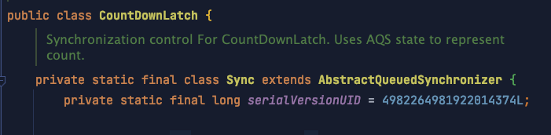

# 彻底理解 AQS（AbstractQueuedSynchronizer）

## 背景

早前写过一篇深入理解 AQS 的文章

[https://mp.weixin.qq.com/s?\_\_biz=MzI3Njk5ODg4OQ==\&mid=2247484343\&idx=1\&sn=0c0ac16161f09cadd00483addbf6e598\&chksm=eb6dbc31dc1a35278931f76fce310d6ead4aba125fc2370aeb52a03b2dc4a78c0d4d95fae420\&token=1325698290\&lang=zh\_CN#rd](https://mp.weixin.qq.com/s?__biz=MzI3Njk5ODg4OQ==\&mid=2247484343\&idx=1\&sn=0c0ac16161f09cadd00483addbf6e598\&chksm=eb6dbc31dc1a35278931f76fce310d6ead4aba125fc2370aeb52a03b2dc4a78c0d4d95fae420\&token=1325698290\&lang=zh_CN#rd "https://mp.weixin.qq.com/s?__biz=MzI3Njk5ODg4OQ==\&mid=2247484343\&idx=1\&sn=0c0ac16161f09cadd00483addbf6e598\&chksm=eb6dbc31dc1a35278931f76fce310d6ead4aba125fc2370aeb52a03b2dc4a78c0d4d95fae420\&token=1325698290\&lang=zh_CN#rd")

过了一段时间后，我发现有些地方记得不清楚了，所以我感觉其实理解的并不深入透彻，于是决定再好好找资料看一看，把之前一知半解的地方彻底弄清楚！

## 看文档

先看下源码， AbstractQueuedSynchronizer 这个类有代码+注释共有 2335 行，可以说很长，我们先看第一手资料即源码注释是怎么写的，通过 AbstractQueuedSynchronizer 类的注释提纲挈领地了解一下这个类。

### 类注释

这里就不贴英文原文了，比较长，直接上翻译内容：

本类提供了一个用于实现阻塞锁和同步器（信号量、事件等）的框架，该框架依赖先进先出 (FIFO) 的等待队列来实现。它为大多数通过单个 int 类型的原子值来表示状态的同步器提供了实现基础。子类必须重写更改同步器状态的 protected 方法，并定义该状态在获取或释放子类对象方面的具体含义。基于此，此类中的其他方法实现所有排队和阻塞机制。子类可以维护其他状态字段，但就同步而言，只有使用了方法 getState、 setState 和 compareAndSetState 操作以原子方式更新的 int 值才能够被跟踪。

子类[^注释1]应定义为**非公共内部辅助类**，用于实现其外部类的同步属性。



AbstractQueuedSynchronizer 类没有实现任何同步接口。相反，它定义了诸如 acquireInterruptably 之类的方法，这些方法可以由具体锁和相关同步器适当调用以实现它们的公共方法。

此类默认支持独占模式和共享模式获取同步状态。当以独占模式获取同步状态时，其他线程尝试获取不会成功。共享模式下，多个线程获取同步状态一般（但不一定）会成功。这个类会忽略这两种模式在机制上的差异，那就是当线程在共享模式下成功获取到同步状态时，下一个等待的线程（如果存在）也必须确定它是否也可以获取该状态。

不同模式下的等待线程共享一个 FIFO 队列。

通常子类只实现一种模式，但两者可以同时工作，例如 ReadWriteLock。只支持一种模式的子类，无需再为另一种模式定义方法。

AQS 定义了一个内部类 ConditionObject，可以当做 Condition 的实例供支持独占模式的子类使用。在独占模式下，方法 #isHeldExclusively 用于表示当前线程是否在独占子类对象，以方法#getState 的返回值为入参，调用方法#release 可以完全释放子类对象。使用这个值调用#acquire 方法，最终恢复到前一个获取锁的状态。 AbstractQueuedSynchronizer 中没有其他方法创建这个条件，所以如果不能满足这个约束，就不要使用它。 AbstractQueuedSynchronizer.ConditionObject 的行为当然是基于它的实现类的语义。

该类为内部类提供了 检查/仪表化/监视 方法，以及类似的用于 condition 对象的方法。 这些可以导出到使用 AbstractQueuedSynchronizer 作为同步机制的类中。
该类的序列化仅仅存储原子整数的维护状态，所以反序列化对象得到的线程队列是空的。子类若需要序列化，要定义 readObject() 用于恢复自己到一个已知的初始状态。

用法：

若将该类用作同步器的基础，请使用 getState()/setState()/cas 这些用于检查或修改同步状态的方法对下面的方法进行重新定义：

*   tryAcquire

*   tryRelease

*   tryAcquireShared

*   tryReleaseShared

*   isHeldExclusively

这些方法默认抛出 `UnsupportedOperationException`, 这些方法内部必须保证线程安全，并且通常应该是简短且无锁的。 定义这些方法是使用该类的意义所在。其他方法因为不能独立的变化，所以声明为 final。

你也能看到继承自 AbstractOwnableSynchronizer 的方法，用于跟踪那些独占了同步器的线程。鼓励你使用这些方法，它们开启了监视和诊断功能，可以帮助用户判断那些线程持有锁。

即使该类基于内部 FIFO 队列，但也不会执行默认的 FIFO 策略，独占同步的核心使用以下策略：

```纯文本
Acquire:
    while (!tryAcquire(arg)) {
          enqueue thread if it is not already queued;
          possibly block current thread;
       }
 
   Release:
       if (tryRelease(arg))
          unblock the first queued thread;
```

（共享模式类似，但可能涉及级联信号。)

因为对获取锁的检查是在入队之前进行，所以一个新线程可能会插入到其他已经入队的线程之前。不管咋地吧，你要是愿意，可以通过调用内部的一个或多个检查方法去定义 tryAcquire() / tryAcquireShared() 方法，从而提供一个公平的 FIFO 获取顺序。特别是，大多数公平同步器在 hasQueuedPredecessors()（这是一个专门设计用于公平同步器的）返回 true 的时候，让 tryAcquire() 返回 false. 当然，其他方法也有可能。

对于默认的插队策略（也叫 greedy/renouncement/convoy-avoidance), 吞吐量和可伸缩性通常最高。尽管这不能保证公平，但允许早入队的线程在后来的线程之前重新竞争，每个重新竞争的线程拥有公平的机会打败新来的线程。尽管获取行为通常不会一直进行，但线程在被阻塞之前，伴随着其他计算过程，他们可能会多次调用 tryAcquire(). 当独占同步器只是短暂的被持有时，这对于自旋来说很有好处，没有太多负担。你可以通过前面的调用增强这一点，以获得带有"fast-path"的方法。如果同步器可能没有被争夺，或许只会预先检查 hasContended() 和 hasQueuedThreads()。

这个类为同步提供了有效的可扩展的基础，部分原因是把范围集中在那些依赖数字状态、 获取/释放参数、 以及内部 FIFO 的同步器上。当这些不能满足需要时，你可以使用原子类、 你自己的 java.util.Queue 类、 LockSupport 来构建更底层的同步器。

用法示例：

这是一个不可重入互斥锁，0 表示打开，1 表示锁定。虽然不可重入锁无需严格记录本地拥有者的线程，但这个类还是这么做了，以便更容易监视。同时也支持 conditions 并且公开了一个检测方法。

```java
class Mutex implements Lock, java.io.Serializable {

    // Our internal helper class
    private static class Sync extends AbstractQueuedSynchronizer {
        // Acquires the lock if state is zero
        public boolean tryAcquire(int acquires) {
            assert acquires == 1; // Otherwise unused
            if (compareAndSetState(0, 1)) {
                setExclusiveOwnerThread(Thread.currentThread());
                return true;
            }
            return false;
        }

        // Releases the lock by setting state to zero
        protected boolean tryRelease(int releases) {
            assert releases == 1; // Otherwise unused
            if (!isHeldExclusively())
                throw new IllegalMonitorStateException();
            setExclusiveOwnerThread(null);
            setState(0);
            return true;
        }

        // Reports whether in locked state
        public boolean isLocked() {
            return getState() != 0;
        }

        public boolean isHeldExclusively() {
            // a data race, but safe due to out-of-thin-air guarantees
            return getExclusiveOwnerThread() == Thread.currentThread();
        }

        // Provides a Condition
        public Condition newCondition() {
            return new ConditionObject();
        }

        // Deserializes properly
        private void readObject(ObjectInputStream s)
                throws IOException, ClassNotFoundException {
            s.defaultReadObject();
            setState(0); // reset to unlocked state
        }
    }

    // The sync object does all the hard work. We just forward to it.
    private final Sync sync = new Sync();

    public void lock() {
        sync.acquire(1);
    }

    public boolean tryLock() {
        return sync.tryAcquire(1);
    }

    public void unlock() {
        sync.release(1);
    }

    public Condition newCondition() {
        return sync.newCondition();
    }

    public boolean isLocked() {
        return sync.isLocked();
    }

    public boolean isHeldByCurrentThread() {
        return sync.isHeldExclusively();
    }

    public boolean hasQueuedThreads() {
        return sync.hasQueuedThreads();
    }

    public void lockInterruptibly() throws InterruptedException {
        sync.acquireInterruptibly(1);
    }

    public boolean tryLock(long timeout, TimeUnit unit)
            throws InterruptedException {
        return sync.tryAcquireNanos(1, unit.toNanos(timeout));
    }
}
```

这是一个类似于 java.util.concurrent.CountDownLatch CountDownLatch 的闩锁类，只是它只需要一个信号即可触发。 因为锁存器是非独占的，所以它使用共享的获取和释放方法。

```java

class BooleanLatch {

    private static class Sync extends AbstractQueuedSynchronizer {
        boolean isSignalled() {
            return getState() != 0;
        }

        protected int tryAcquireShared(int ignore) {
            return isSignalled() ? 1 : -1;
        }

        protected boolean tryReleaseShared(int ignore) {
            setState(1);
            return true;
        }
    }

    private final Sync sync = new Sync();

    public boolean isSignalled() {
        return sync.isSignalled();
    }

    public void signal() {
        sync.releaseShared(1);
    }

    public void await() throws InterruptedException {
        sync.acquireSharedInterruptibly(1);
    }
}
```

如果对上面的翻译理解起来还是费劲，那还放那儿，等看完下面的，再回到上面看一遍就通透了。

## 看设计

AQS 本质上是一个 FIFO 的双向队列，线程被包装成结点的形式，基于自旋机制在队列中等待获取资源（这里的资源可以简单理解为对象锁）


总揽一下这个类，可以看到有两个内部类，剩下的就是一堆成员变量和成员方法。


### 设计思路

这是 AQS 的模型：


AQS 主要由三部分组成，state 同步状态、Node 组成的 CLH 队列、ConditionObject 条件变量（包含 Node 组成的条件单向队列）。

state 用 volatile 来修饰，保证了我们操作的可见性，所以任何线程通过 getState() 获得状态都是可以得到最新值，但是 setState() 无法保证原子性，因此 AQS 给我们提供了 compareAndSetState 方法利用底层 UnSafe 的 CAS 功能来实现原子性。

对于 AQS 来说，线程同步的关键是对 state 的操作，可以说获取、释放资源是否成功都是由 state 决定的，比如 state>0 代表可获取资源，否则无法获取，所以 **state 的具体语义由实现者去定义，现有的 ReentrantLock、ReentrantReadWriteLock、Semaphore、CountDownLatch 定义的 state 语义都不一样。**

*   ReentrantLock 的 state 用来表示是否有锁资源，变量记录了锁的重入次数

*   ReentrantReadWriteLock 的 state 高 16 位代表读锁状态，低 16 位代表写锁状态

*   Semaphore 的 state 用来表示可用信号的个数

*   CountDownLatch 的 state 用来表示计数器的值

| 同步工具                       | 同步工具与AQS的关联                                                                          |
| -------------------------- | ------------------------------------------------------------------------------------ |
| **ReentrantLock**          | 使用AQS保存锁重复持有的次数。当一个线程获取锁时，ReentrantLock记录当前获得锁的线程标识，用于检测是否重复获取，以及错误线程试图解锁操作时异常情况的处理。 |
| **Semaphore**              | 使用AQS同步状态来保存信号量的当前计数。tryRelease会增加计数，acquireShared会减少计数。                             |
| **CountDownLatch**         | 使用AQS同步状态来表示计数。计数为0时，所有的Acquire操作（CountDownLatch的await方法）才可以通过。                      |
| **ReentrantReadWriteLock** | 使用AQS同步状态中的16位保存写锁持有的次数，剩下的16位用于保存读锁的持有次数。                                           |
| **ThreadPoolExecutor**     | Worker利用AQS同步状态实现对独占线程变量的设置（tryAcquire和tryRelease）。                                  |

**AQS 实现了两类队列，即 同步队列 和 条件队列。**

同步队列服务于线程阻塞等待获取资源，而条件队列则服务于线程因某个条件不满足而进入等待状态。
条件队列中的线程实际上已经获取到了资源，但是没有能够继续执行下去的条件，所以被打入条件队列并释放持有的资源，以让渡其它线程执行，如果未来某个时刻条件得以满足，则该线程会被从条件队列转移到同步队列，继续参与竞争资源，以继续向下执行。[^注释2]

## 同步队列

### CLH

同步队列是基于链表实现的双向队列，也是 CLH 锁的变种。CLH 锁是 AQS 队列同步器实现的基础。

**来看一下 CLH 队列**


*   CLH 锁是有由 Craig, Landin, and Hagersten 这三个人发明的锁，取了三个人名字的首字母，所以叫 CLH Lock。

*   CLH 锁是一个自旋锁。能确保无饥饿性。提供先来先服务的公平性。

*   CLH 队列锁也是一种基于链表的可扩展、高性能、公平的自旋锁，申请线程仅仅在本地变量上自旋，它不断轮询前驱的状态，假设发现前驱释放了锁就结束自旋。

### Node

AQS 以内部类 `Node` 的形式定义了同步队列结点。这就是前文看到的第一个内部类。

```java
static final class Node {

    /** 模式定义 */

    static final Node SHARED = new Node();
    static final Node EXCLUSIVE = null;

    /** 线程状态 */

    static final int CANCELLED = 1;
    static final int SIGNAL = -1;
    static final int CONDITION = -2;
    static final int PROPAGATE = -3;

    /** 线程等待状态 */
    volatile int waitStatus;

    /** 前驱结点 */
    volatile Node prev;
    /** 后置结点 */
    volatile Node next;

    /** 持有的线程对象 */
    volatile Thread thread;

    /** 对于独占模式而言，指向下一个处于 CONDITION 等待状态的结点；对于共享模式而言，则为 SHARED 结点 */
    Node nextWaiter;

    // ... 省略方法定义
}
```


Node 在 CLH 的基础上进行了变种。CLH 是单向队列，其主要特点是自旋检查前驱节点的 locked 状态。而 AQS 同步队列是**双向队列**，每个节点也有状态 waitStatus，而其并不是一直对前驱节点的状态自旋判断，而是自旋一段时间后阻塞让出 cpu 时间片（上下文切换），等待前驱节点主动唤醒后继节点。


waitStatus 有如下 5 中状态：

*   CANCELLED = 1
    表示当前结点已取消调度。当超时或被中断（响应中断的情况下），会触发变更为此状态，进入该状态后的结点将不会再变化。

*   SIGNAL = -1
    表示后继结点在等待当前结点唤醒。后继结点入队时，会将前继结点的状态更新为 SIGNAL。

*   CONDITION = -2
    表示结点等待在 Condition 上，当其他线程调用了 Condition 的 signal() 方法后，CONDITION 状态的结点将从等待队列转移到同步队列中，等待获取同步锁。

*   PROPAGATE = -3
    共享模式下，前继结点不仅会唤醒其后继结点，同时也可能会唤醒后继的后继结点。

*   INITIAL = 0
    新结点入队时的默认状态。

从上面的代码中可以看出，位于 CLH 链表中的线程以 2 种模式在等待资源，即 SHARED 和 EXCLUSIVE，其中 SHARED 表示共享模式，而 EXCLUSIVE 表示独占模式。共享模式与独占模式的主要区别在于，同一时刻独占模式只能有一个线程获取到资源，而共享模式在同一时刻可以有多个线程获取到资源。典型的场景就是读写锁，读操作可以有多个线程同时获取到读锁资源，而写操作同一时刻只能有一个线程获取到写锁资源，其它线程在尝试获取资源时都会被阻塞。

### 同步队列主要行为

AQS 类成员变量 head 和 tail 字段分别指向同步队列的头结点和尾结点：

```java

    /**
     * Head of the wait queue, lazily initialized.  Except for
     * initialization, it is modified only via method setHead.  Note:
     * If head exists, its waitStatus is guaranteed not to be
     * CANCELLED.
     */
    private transient volatile Node head;

    /**
     * Tail of the wait queue, lazily initialized.  Modified only via
     * method enq to add new wait node.
     */
    private transient volatile Node tail;

```

其中 head 表示同步队列的头结点，而 tail 则表示同步队列的尾结点，具体组织形式如下图：


当调用 AQS 的 acquire 方法获取资源时，如果资源不足则当前线程会被封装成 Node 结点添加到同步队列的末端（入队），头结点 head 用于记录当前正在持有资源的线程结点，而 head 的后继结点就是下一个将要被调度的线程结点，当 release 方法被调用时，该结点上的线程将被唤醒（出队），继续获取资源。

**同步队列的主要行为是 ：入队、出队**

**入队**

获取资源失败的线程需要封装成 Node 节点，接着尾部入队，在 AQS 中提供 addWaiter 函数完成 Node 节点的创建与入队。添加节点的时候，如 CLH 队列已经存在，通过 CAS 快速将当前节点添加到队列尾部，如果添加失败或队列不存在，则初始化同步队列。

```java
/**
 * Creates and enqueues node for current thread and given mode.
 *
 * @param mode Node.EXCLUSIVE for exclusive, Node.SHARED for shared
 * @return the new node
 */
private Node addWaiter(Node mode) {
    Node node = new Node(mode);

    for (;;) {
        Node oldTail = tail;
        if (oldTail != null) {
            node.setPrevRelaxed(oldTail);
            if (compareAndSetTail(oldTail, node)) {
                oldTail.next = node;
                return node;
            }
        } else {
            initializeSyncQueue();
        }
    }
}
```

总结：入队列，线程获取锁失败，入队列将新节点加到 tail 后面，然后对 tail 进行 CAS 操作，将 tail 指针后移到新节点上。

**出队**

CLH 队列中的节点都是获取资源失败的线程节点，当持有资源的线程释放资源时，会将 head.next 指向的线程节点唤醒（C L H 队列的第二个节点），如果唤醒的线程节点获取资源成功，线程节点清空信息设置为头部节点（新哨兵节点），原头部节点出队（原哨兵节点）

```java

  protected final boolean tryRelease(int releases) {
        int c = getState() - releases; 
        if (Thread.currentThread() != getExclusiveOwnerThread())
            throw new IllegalMonitorStateException();
        boolean free = false;
        if (c == 0) { // 如果 state=0 了，就是可以释放锁了
            free = true; 
            setExclusiveOwnerThread(null); // 将拿锁线程置为 null
        }
        setState(c); // 重置同步器的 state
        return free; // 返回是否成功释放
  }

  private void unparkSuccessor(Node node) {
    // node 节点是当前释放锁的节点，也是同步队列的头节点
    int ws = node.waitStatus;
    // 如果节点已经被取消了，把节点的状态置为初始化
    if (ws < 0)
        compareAndSetWaitStatus(node, ws, 0);

    // 拿出队二 s
    Node s = node.next;
    // s 为空，表示 node 的后一个节点为空
    // s.waitStatus 大于 0，代表 s 节点已经被取消了
    // 遇到以上这两种情况，就从队尾开始，向前遍历，找到第一个 waitStatus 字段不是被取消的
    if (s == null || s.waitStatus > 0) {
        s = null;
       
        // 结束条件是前置节点就是 head 了
        for (Node t = tail; t != null && t != node; t = t.prev)
            // t.waitStatus <= 0 说明 t 当前没有被取消，肯定还在等待被唤醒
            if (t.waitStatus <= 0)
                s = t;
    }
    // 唤醒以上代码找到的线程
    if (s != null)
        LockSupport.unpark(s.thread);
}

```

当线程被唤醒后，又继续执行 acquireQueued 方法，进入循环

```java
 /**
 * Acquires in exclusive uninterruptible mode for thread already in
 * queue. Used by condition wait methods as well as acquire.
 *
 * @param node the node
 * @param arg the acquire argument
 * @return {@code true} if interrupted while waiting
 */
final boolean acquireQueued(final Node node, int arg) {
    boolean interrupted = false;
    try {
        for (;;) {
            //获取前驱节点
            final Node p = node.predecessor();
            //如果前驱节点是首节点，获取资源（子类实现）
            if (p == head && tryAcquire(arg)) {
                //获取资源成功，设置当前节点为头节点，清空当前节点的信息，把当前节点变成哨兵节点
                setHead(node);
                //原来首节点下个节点指向为 null
                p.next = null; // help GC
                //返回线程中断状态
                return interrupted;
            }
            if (shouldParkAfterFailedAcquire(p, node))
                interrupted |= parkAndCheckInterrupt();
        }
    } catch (Throwable t) {
        cancelAcquire(node);
        if (interrupted)
            selfInterrupt();
        throw t;
    }
}
```

总结：出队列，锁释放唤醒 head 的后继节点，head 的后继节点从阻塞中醒来，开始抢锁，获取锁成功，此时 head 指针向后移一个位置，原先 head 的后继节点成为新的 head。

最后是一个 同步队列的流程概述


## 条件队列

一个 AQS 可以对应多个条件变量


ConditionObject 内部维护着一个单向条件队列，不同于 CLH 队列，条件队列只入队执行 await 的线程节点，并且加入条件队列的节点，不能在 CLH 队列， 条件队列出队的节点，会入队到 CLH 队列。

当某个线程执行了 ConditionObject 的 await 函数，阻塞当前线程，线程会被封装成 Node 节点添加到条件队列的末端，其他线程执行 ConditionObject 的 signal 函数，会将条件队列头部线程节点转移到 CLH 队列参与竞争资源，具体流程如下图：


一个 Condition 对象就有一个单项的等待任务队列。在一个多线程任务中我们可以 new 出多个等待任务队列。比如我们 new 出来两个等待队列。

```java
 private Lock lock = new ReentrantLock();
 private Condition FirstCond = lock.newCondition();
 private Condition SecondCond = lock.newCondition();

```

所以真正的 AQS 任务中一般是一个任务队列 N 个等待队列的，因此我们尽量调用 signal 而少用 signalAll，因为在指定的实例化等待队列中只有一个可以拿到锁的。

## 设计模式

从设计模式的角度讲，AbstractQueuedSynchronizer 是个**抽象类**，所有用到方法的类都要继承此类的若干方法，对应的设计模式就是**模版模式**。 这样就解决了实现同步器时涉及的大量细节问题，能够极大地减少实现工作。

若干方法就是上文注释翻译中描述的这些方法：

*   tryAcquire

*   tryRelease

*   tryAcquireShared

*   tryReleaseShared

*   isHeldExclusively

说明一下各个方法的作用：

*   tryAcquire ：尝试以独占模式获取资源，如果获取成功则返回 true，否则返回 false。

*   tryRelease ：尝试以独占模式释放资源，如果释放成功则返回 true，否则返回 false。

*   tryAcquireShared ：尝试以共享模式获取资源，如果返回正数则说明获取成功，且还有可用的剩余资源；如果返回 0 则说明获取成功，但是没有可用的剩余资源；如果返回负数则说明获取资源失败。

*   tryReleaseShared ：尝试以共享模式释放资源，如果释放成功则返回 true，否则返回 false。

*   isHeldExclusively ：判断当前线程是否正在独占资源，如果是则返回 true，否则返回 false。

**AbstractQueuedSynchronizer 中的方法实现按照功能划分可以分为两大类，即获取资源（acquire）和释放资源（release），同时区分独占模式和共享模式**

可以看到具体实现类需要对资源在不同模式下的获得和释放进行具体定义。
具体实现举例来说可以到 ReentrantReadWriteLock 中的 内部类 Sync 看一下。

持锁的当前线程：exclusiveOwnerThread

## 自实现

AQS 定义了一套多线程访问共享资源的同步模板，解决了实现同步器时涉及的大量细节问题，能够极大地减少实现工作，现在我们基于 AQS 实现一个不可重入的独占锁，直接使用 AQS 提供的独占式模板，只需明确 state 的语义与实现 tryAcquire 与 tryRelease 函数（获取资源与释放资源）。在这里 state 为 0 表示锁没有被线程持有，state 为 1 表示锁已经被某个线程持有，由于是不可重入锁，所以不需要记录持有锁线程的获取锁次数。

不可重入的独占锁代码如下

```java

public class NonReentrantLock implements Lock {

    /**
     * 
     * @Description 自定义同步器
     */
    private static class Sync extends AbstractQueuedSynchronizer {

        /**
         * 锁是否被线程持有
         */
        @Override
        protected boolean isHeldExclusively() {
            //0：未持有 1：已持有
            return super.getState() == 1;
        }

        /**
         * 获取锁
         */
        @Override
        protected boolean tryAcquire(int arg) {
            if (arg != 1) {
                //获取锁操作，是需要把 state 更新为 1，所以 arg 必须是 1
                throw new RuntimeException("arg not is 1");
            }
            if (compareAndSetState(0, arg)) {//cas 更新 state 为 1 成功，代表获取锁成功
                //设置持有锁线程
                setExclusiveOwnerThread(Thread.currentThread());
                return true;
            }
            return false;
        }

        /**
         * 释放锁
         */
        @Override
        protected boolean tryRelease(int arg) {
            if (arg != 0) {
                //释放锁操作，是需要把 state 更新为 0，所以 arg 必须是 0
                throw new RuntimeException("arg not is 0");
            }
            //清空持有锁线程
            setExclusiveOwnerThread(null);
            //设置 state 状态为 0，此处不用 cas，因为只有获取锁成功的线程才会执行该函数，不需要考虑线程安全问题
            setState(arg);
            return true;
        }

        /**
         * 提供创建条件变量入口
         */
        public ConditionObject createConditionObject() {
            return new ConditionObject();
        }

    }

    private final Sync sync = new Sync();

    /**
     * 获取锁
     */
    @Override
    public void lock() {
        //Aqs 独占式-获取资源模板函数
        sync.acquire(1);
    }
        
    /**
     * 获取锁-响应中断
     */
    @Override
    public void lockInterruptibly() throws InterruptedException {
        //Aqs 独占式-获取资源模板函数（响应线程中断）
        sync.acquireInterruptibly(1);
    }

    /**
     * 获取锁是否成功-不阻塞
     */
    @Override
    public boolean tryLock() {
        //子类实现
        return sync.tryAcquire(1);
    }
    
    /**
     * 获取锁-超时机制
     */
    @Override
    public boolean tryLock(long time, TimeUnit unit) throws InterruptedException {
        //Aqs 独占式-获取资源模板函数（超时机制）
        return sync.tryAcquireNanos(1,unit.toNanos(time));
    }
    
    /**
     * 释放锁
     */
    @Override
    public void unlock() {
        //Aqs 独占式-释放资源模板函数
        sync.release(0);
    }
    
    /**
     * 创建条件变量
     */
    @Override
    public Condition newCondition() {
        return sync.createConditionObject();
    }
}
```

NonReentrantLock 定义了一个内部类 Sync，Sync 用来实现具体的锁操作，它继承了 AQS，因为使用的是独占式模板，所以重写 tryAcquire 与 tryRelease 函数，另外提供了一个创建条件变量的入口，下面使用自定义的独占锁来同步两个线程对 j++。

```java
    private static int j = 0;

    public static void main(String[] agrs) throws InterruptedException {
        NonReentrantLock  nonReentrantLock = new NonReentrantLock();

        Runnable runnable = () -> {
            //获取锁
            nonReentrantLock.lock();
            for (int i = 0; i < 100000; i++) {
                j++;
            }
            //释放锁
            nonReentrantLock.unlock();
        };

        Thread thread = new Thread(runnable);
        Thread threadTwo = new Thread(runnable);

        thread.start();
        threadTwo.start();

        thread.join();
        threadTwo.join();

        System.out.println(j);
    }
    

无论执行多少次输出内容都是：
200000

```

## 其他

### LockSupport 辅助类

LockSupport 是一个线程阻塞工具类，所有的方法都是静态方法，可以让线程在任意位置阻塞，当然阻塞之后肯定得有唤醒的方法。

park 是因为 park 英文意思为停车。我们如果把 Thread 看成一辆车的话，park 就是让车停下，unpark 就是让车启动然后跑起来。

park/unpark 调用的是 Unsafe（提供 CAS 操作） 中的 native 代码。

### 说明

本文参考了非常多网络图片和文章资料，严格意义上已经不算原创文章了，如本文引有的内容有侵权，请联系删除。

## 参考

*   [https://blog.csdn.net/lpf463061655/article/details/87290730](https://blog.csdn.net/lpf463061655/article/details/87290730 "https://blog.csdn.net/lpf463061655/article/details/87290730")

*   [https://www.codenong.com/cs106963035/](https://www.codenong.com/cs106963035/ "https://www.codenong.com/cs106963035/")

*   [https://mp.weixin.qq.com/s/bxWgo9IuggDpE1l37JqEhQ](https://mp.weixin.qq.com/s/bxWgo9IuggDpE1l37JqEhQ "https://mp.weixin.qq.com/s/bxWgo9IuggDpE1l37JqEhQ")

*   [https://www.modb.pro/db/108644](https://www.modb.pro/db/108644 "https://www.modb.pro/db/108644")

*   [https://mp.weixin.qq.com/s/BLnZYa4lbXUx3KEQm7Z7tA](https://mp.weixin.qq.com/s/BLnZYa4lbXUx3KEQm7Z7tA "https://mp.weixin.qq.com/s/BLnZYa4lbXUx3KEQm7Z7tA")

*   [https://mp.weixin.qq.com/s/Y4GbMdNmSDvHtomxtObRSg](https://mp.weixin.qq.com/s/Y4GbMdNmSDvHtomxtObRSg "https://mp.weixin.qq.com/s/Y4GbMdNmSDvHtomxtObRSg")

*   [https://www.baiyp.ren/CLH%E9%98%9F%E5%88%97%E9%94%81.html](https://www.baiyp.ren/CLH%E9%98%9F%E5%88%97%E9%94%81.html "https://www.baiyp.ren/CLH%E9%98%9F%E5%88%97%E9%94%81.html")

*   [https://juejin.cn/post/6873020483755884552](https://juejin.cn/post/6873020483755884552 "https://juejin.cn/post/6873020483755884552")

*   [https://mp.weixin.qq.com/s?\_\_biz=MzU4NzU0MDIzOQ==\&mid=2247488891\&idx=1\&sn=227928446c692aaa0085557682ed732d\&scene=21#wechat\_redirect](https://mp.weixin.qq.com/s?__biz=MzU4NzU0MDIzOQ==\&mid=2247488891\&idx=1\&sn=227928446c692aaa0085557682ed732d\&scene=21#wechat_redirect "https://mp.weixin.qq.com/s?__biz=MzU4NzU0MDIzOQ==\&mid=2247488891\&idx=1\&sn=227928446c692aaa0085557682ed732d\&scene=21#wechat_redirect")

*   [https://tech.meituan.com/2019/12/05/aqs-theory-and-apply.html](https://tech.meituan.com/2019/12/05/aqs-theory-and-apply.html "https://tech.meituan.com/2019/12/05/aqs-theory-and-apply.html")

[^注释1]: AQS是一个抽象类，需要具体的子类继承实现

[^注释2]: 感觉很像 ObjectMonitor的 entrySet和 waitSet
