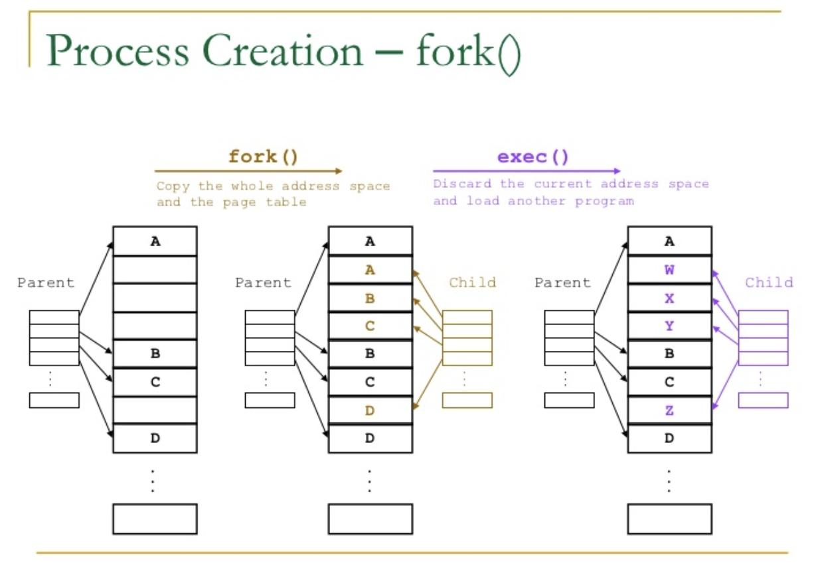
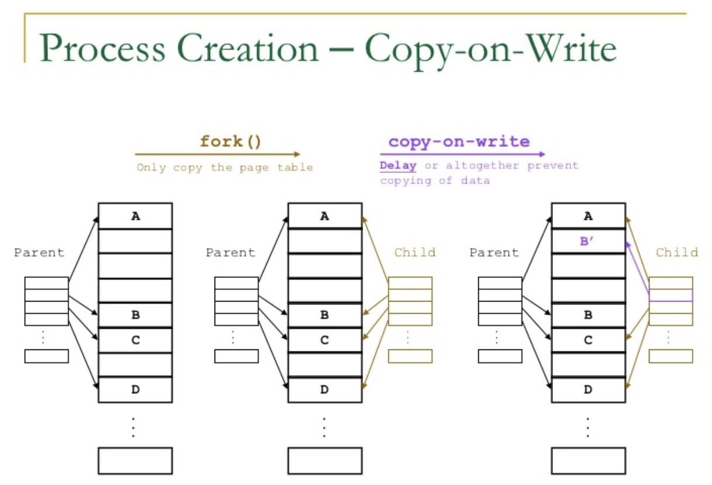
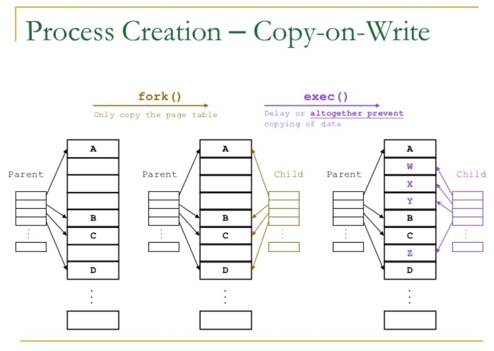
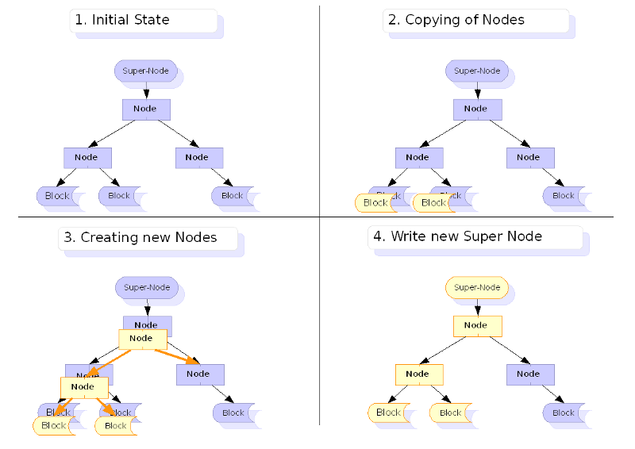
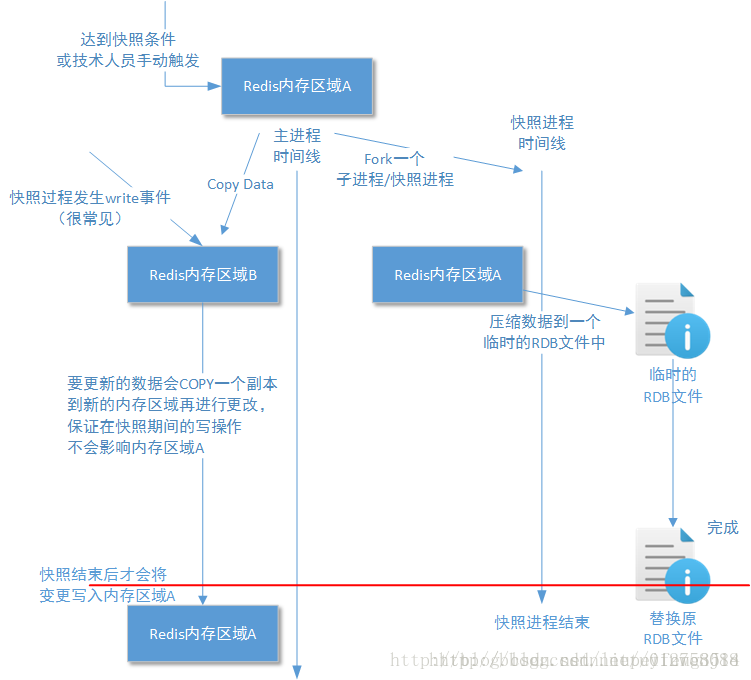

# 什么是 COW? (CopyOnWrite)

## 概念

> **写入时复制**（英语：**Copy-on-write**，简称**COW**）是一种计算机 [程序设计](https://zh.wikipedia.org/wiki/程式設計 "程序设计") 领域的优化策略。其核心思想是，如果有多个调用者（callers）同时请求相同资源（如内存或磁盘上的数据存储），他们会共同获取相同的指针指向相同的资源，直到某个调用者试图修改资源的内容时，系统才会真正复制一份专用副本（private copy）给该调用者，而其他调用者所见到的最初的资源仍然保持不变。这过程对其他的调用者都是 [透明](https://zh.wikipedia.org/wiki/透明 "透明") 的。此作法主要的优点是如果调用者没有修改该资源，就不会有副本（private copy）被创建，因此多个调用者只是读取操作时可以共享同一份资源。

COW 已有很多应用，比如在。Linux 等的文件管理系统也使用了写时复制策略。

## 应用

### Linux fork()

当通过 `fork()` 来创建一个子进程时，操作系统需要将父进程虚拟内存空间中的大部分内容全部复制到子进程中（主要是数据段、堆、栈；代码段共享）。这个操作不仅非常耗时，而且会浪费大量物理内存。特别是如果程序在进程复制后立刻使用 `exec` 加载新程序，那么负面效应会更严重，相当于之前进行的复制操作是完全多余的。

**因此引入了写时复制技术**。内核不会复制进程的整个地址空间，而是只复制其页表，`fork` 之后的父子进程的地址空间指向同样的物理内存页。

但是不同进程的内存空间应当是**私有**的。假如所有进程都只读取其内存页，那么就可以继续共享物理内存中的同一个副本；然而只要有一个进程试图写入共享区域的某个页面，那么就会为这个进程创建该页面的一个新副本。

如果是 fork()+exec() 的话，子进程被创建后就立即执行一个 executable，父进程内存中的数据对子进程而言没有意义——即父进程的页根本不会被子进程写入。在这种情况下可以完全避免复制，而是直接为子进程分配地址空间，如下图所示。

写时复制技术将内存页的复制延迟到第一次写入时，更重要的是，在很多情况下不需要复制。这节省了大量时间，充分使用了稀有的物理内存。

### 虚拟内存管理中的写时复制

虚拟内存管理中，一般把共享访问的页面标记为只读，当一个 task 试图向内存中写入数据时，内存管理单元（MMU）抛出一个异常，内核处理该异常时为该 task 分配一份物理内存并复制数据到此内存，重新向 MMU 发出执行该 task 的写操作

具体可以参考 [Linux 内存管理 ](../../Linux/Linux%20内存管理/Linux%20内存管理.md "Linux 内存管理 ")

### Linux 等的文件管理系统使用了写时复制策略

`ZFS`、`BTRFS` 两种写时复制文件系统，写时复制文件系统采用了日志式技术。

#### ZFS

[ZFS](https://pthree.org/2012/12/14/zfs-administration-part-ix-copy-on-write/ "ZFS") 文件系统的英文名称为 `Zettabyte File System`, 也叫动态文件系统（`Dynamic File System`）, 是第一个 `128` 位文件系统。最初是由 `Sun` 公司为 `Solaris 10` 操作系统开发的文件系统。作为 `OpenSolaris` 开源计划的一部分，`ZFS` 于 2005 年 11 月发布，被 `Sun` 称为是终极文件系统，经历了 `10` 年的活跃开发。而最新的开发将全面开放，并重新命名为 `OpenZFS`。

利用写时拷贝使 `ZFS` 的快照和事物功能的实现变得更简单和自然，快照功能更灵活。缺点是，`COW` 使碎片化问题更加严重，对于顺序写生成的大文件，如果以后随机的对其中的一部分进行了更改，那么这个文件在硬盘上的物理地址就变得不再连续，未来的顺序读会变得性能比较差。

#### BTRFS

`BTRFS`（通常念成 `Butter FS`），由 `Oracle` 于 2007 年宣布并进行中的 `COW`(`copy-on-write` 式）文件系统。目标是取代 `Linux ext3` 文件系统，改善 `ext3` 的限制，特别是单一文件大小的限制，总文件系统大小限制以及加入文件校验和特性。加入 `ext3/4` 未支持的一些功能，例如可写的磁盘快照 (`snapshots`)，以及支持递归的快照 (`snapshots of snapshots`)，内建磁盘阵列（`RAID`）支持，支持子卷 (`Subvolumes`) 的概念，允许在线调整文件系统大小。

首先是扩展性 (`scalability`) 相关的特性，`btrfs` 最重要的设计目标是应对大型机器对文件系统的扩展性要求。 `Extent`、`B-Tree` 和动态 `inode` 创建等特性保证了 `btrfs` 在大型机器上仍有卓越的表现，其整体性能而不会随着系统容量的增加而降低。其次是数据一致性 (`data integrity`) 相关的特性。系统面临不可预料的硬件故障，`Btrfs` 采用 `COW` 事务技术来保证文件系统的一致性。 `btrfs` 还支持 `checksum`，避免了 `silent corrupt` 的出现。而传统文件系统则无法做到这一点。第三是和多设备管理相关的特性。 `Btrfs` 支持创建快照 (`snapshot`)，和克隆 (`clone`) 。 `btrfs` 还能够方便的管理多个物理设备，使得传统的卷管理软件变得多余。最后是其他难以归类的特性。这些特性都是比较先进的技术，能够显著提高文件系统的时间/空间性能，包括延迟分配，小文件的存储优化，目录索引等。

### 数据库一般采用了写时复制策略，为用户提供一份 snapshot

**MySQL MVCC**

多版本并发控制（MVCC） 在一定程度上实现了**读写并发**，它只在 **可重复读（REPEATABLE READ）** 和 **提交读（READ COMMITTED）** 两个隔离级别下工作。其他两个隔离级别都和 MVCC 不兼容，因为 **未提交读（READ UNCOMMITTED）**，总是读取最新的数据行，而不是符合当前事务版本的数据行。而 **可串行化（SERIALIZABLE）** 则会对所有读取的行都加锁。

**行锁，并发，事务回滚**等多种特性都和 MVCC 相关。MVCC 实现的核心思路就是 Copy On Write

更多信息请参考 [MVCC](../../数据库/MySQL/MVCC/MVCC.md "MVCC")

### Java 中的写时复制应用

j.u.c 包中支持写时复制的线程安全的集合： [CopyOnWriteArrayList](../../JAVA%20技术栈/并发多线程/并发包-JUC/并发容器/CopyOnWriteArrayList/CopyOnWriteArrayList.md "CopyOnWriteArrayList")、[CopyOnWriteArraySet](../../JAVA%20技术栈/并发多线程/并发包-JUC/并发容器/CopyOnWriteArraySet/CopyOnWriteArraySet.md "CopyOnWriteArraySet")

与 fail-fast 的容器相比，fail-safe 的 COW 容器固然安全了很多，但是由于每次写都要复制整个数组，时间和空间的开销都更高，因此只适合读多写少的情景。在写入时，为了保证效率，也应尽量做批量插入或删除，而不是单条操作。并且它的正本和副本有可能不同步，因此无法保证读取的是最新数据，只能保证最终一致性。

### Redis&#x20;

**Redis 在生成 RDB 快照文件时不会终止对外服务**

Redis 重启后可以恢复数据。比如 RDB，是保存某个瞬间 Redis 的数据库快照。执行 bgsave 命令，Redis 就会保存一个 dump.rdb 文件，这个文件记录了这个瞬间整个数据库的所有数据。Redis 厉害的地方就是，在保存的同时，Redis 还能处理命令。那么有一个很有趣的问题——Redis 是怎么保证 dump.rdb 中数据的一致性的？Redis 一边在修改数据库，一边在把数据库保存到文件，就不担心脏读脏写问题吗？

Redis 有一个主进程，在写数据，这时候有一个命令过来了，说要把数据持久化到磁盘。我们知道 redis 的 worker 是单线程的，如果要持久化这个行为也放在单线程里，那么如果需要持久化数据特别多，将会影响用户的使用。所以单开（fork）一个进程（子进程）专门来做持久化的操作。

至于实现原理，是这样的：fork() 之后，kernel 把父进程中所有的内存页的权限都设为 read-only，然后子进程的地址空间指向父进程。当父子进程都只读内存时，相安无事。当其中某个进程写内存时，CPU 硬件检测到内存页是 read-only 的，于是触发页异常中断（page-fault），陷入 kernel 的一个中断例程。中断例程中，kernel 就会把触发的异常的页复制一份，于是父子进程各自持有独立的一份。

是父进程持有原品、子进程持有复制品，还是反之？

**谁修改内存，谁就持有复制品**

kernel 进行复制的单位是一个内存页吗？

**copy 的大小是一个页大小**

## 参考

*   [https://zh.wikipedia.org/wiki/寫入時複製](https://zh.wikipedia.org/wiki/寫入時複製 "https://zh.wikipedia.org/wiki/寫入時複製")

*   [https://imageslr.com/2020/copy-on-write.html](https://imageslr.com/2020/copy-on-write.html "https://imageslr.com/2020/copy-on-write.html")

*   [https://pthree.org/2012/12/14/zfs-administration-part-ix-copy-on-write/](https://pthree.org/2012/12/14/zfs-administration-part-ix-copy-on-write/ "https://pthree.org/2012/12/14/zfs-administration-part-ix-copy-on-write/")

*   [https://m.imooc.com/wiki/linuxlesson-copysystem](https://m.imooc.com/wiki/linuxlesson-copysystem "https://m.imooc.com/wiki/linuxlesson-copysystem")

*   [https://blog.51cto.com/u\_15091061/2856426](https://blog.51cto.com/u_15091061/2856426 "https://blog.51cto.com/u_15091061/2856426")

*   https://zhou-yuxin.github.io/articles/2017

*   [https://www.wildmanli.top/2019/05/21/redis-persistent-storage-analysis/](https://www.wildmanli.top/2019/05/21/redis-persistent-storage-analysis/ "https://www.wildmanli.top/2019/05/21/redis-persistent-storage-analysis/")
