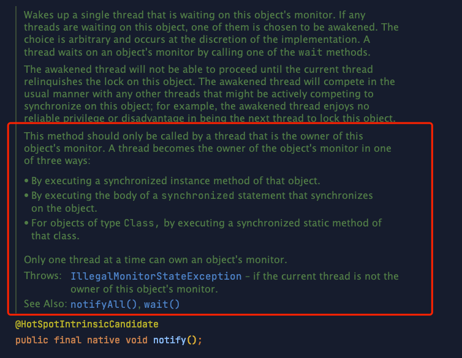

# 为什么wait() 和notify() 需要搭配synchonized关键字使用 ？

## 前知识

首先要了解 [moniter 监视器](../../JAVA%20技术栈/JVM/moniter%20监视器/moniter%20监视器.md "moniter 监视器")

## 剖析

```java
  public static void main(String[] args) {

        SynchronizedDemo obj = new SynchronizedDemo();
        obj.notify();
    }
```

如果我们直接执行对象的 notify/wait 等方法时会报错，报错信息如下：


这里显示异常类型为：  `IlleagalMonitorStateException`

我们看一下JDK对方法的注释



**意思是同一时刻只有一个线程可以获得对象的监视器锁（monitor），如果当前线程没有获得对象的监视器锁则抛出 IlleagalMonitorStateException   异常。**

**表明如果我们直接调用 wait/notify等方法是不能获得监视器锁的，只有先获得监视器锁才行，所以在使用 wait/notify 等方法时要配合 synchronized  先获得监视器锁（monitor），然后调用这些方法。**

**而一个线程获得对象监视器锁有三种方法，也就是加 synchronized 的三种方式：**

*   修饰普通方法

*   synchronized 代码块

*   修饰静态方法（给类加锁）

有关 `synchronized` 和 锁的内容，请参考 [synchronized 锁的是什么？](../synchronized%20锁的是什么？/synchronized%20锁的是什么？.md "synchronized 锁的是什么？") [JAVA 中的锁](../../JAVA%20技术栈/JVM/JAVA%20中的锁/JAVA%20中的锁.md "JAVA 中的锁")
