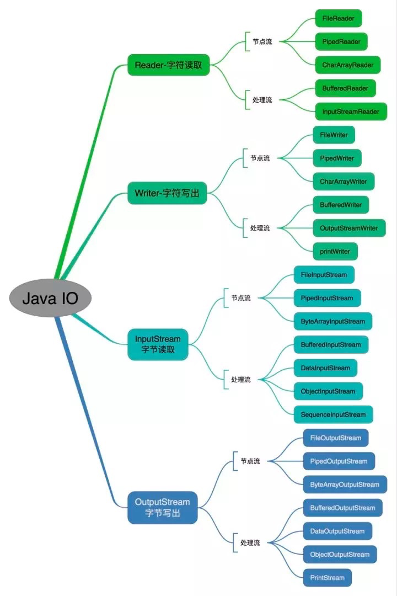
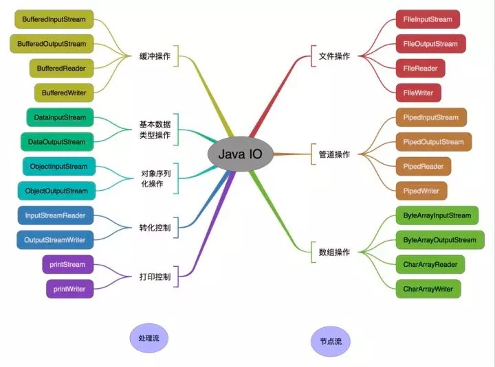
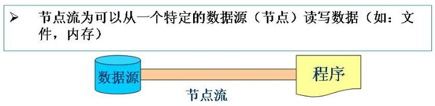
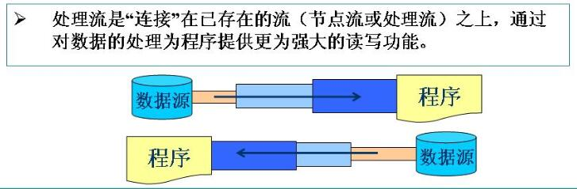
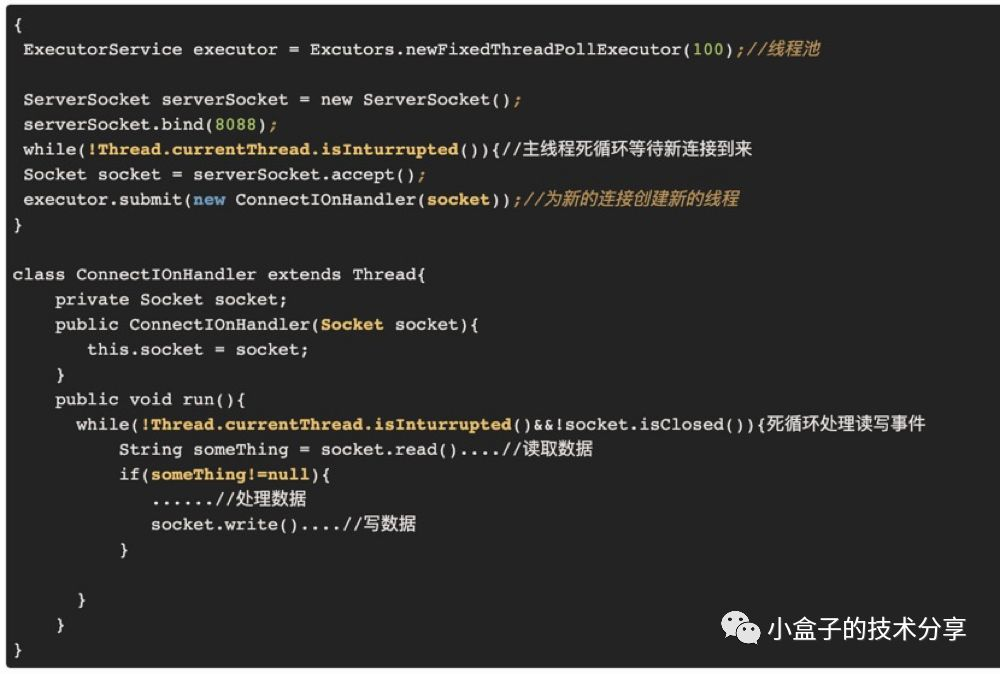
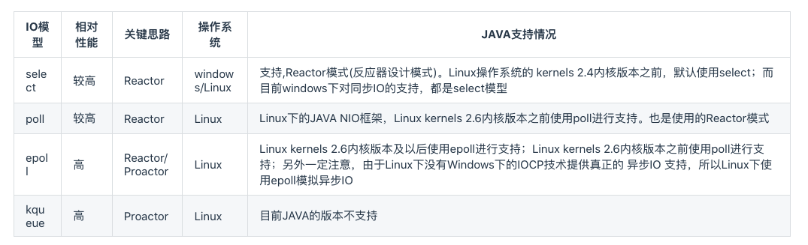
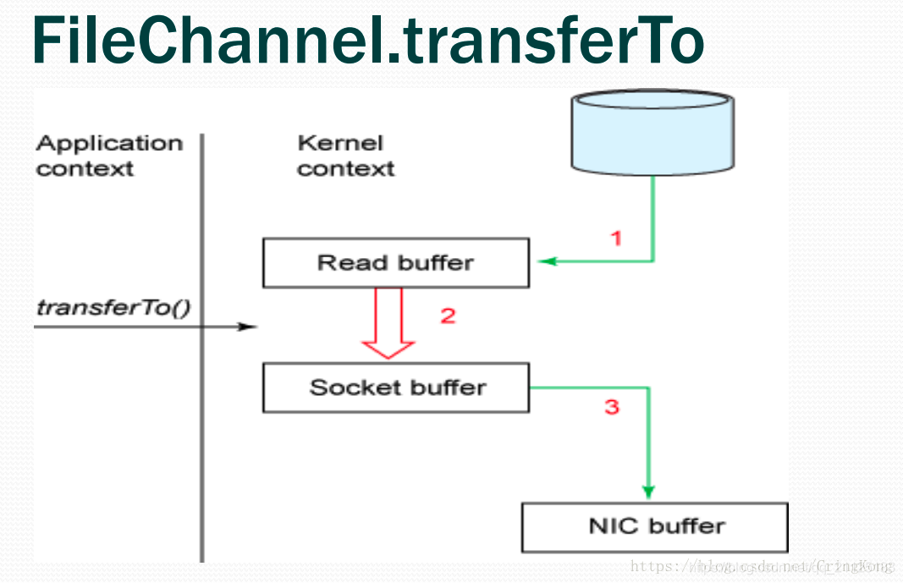
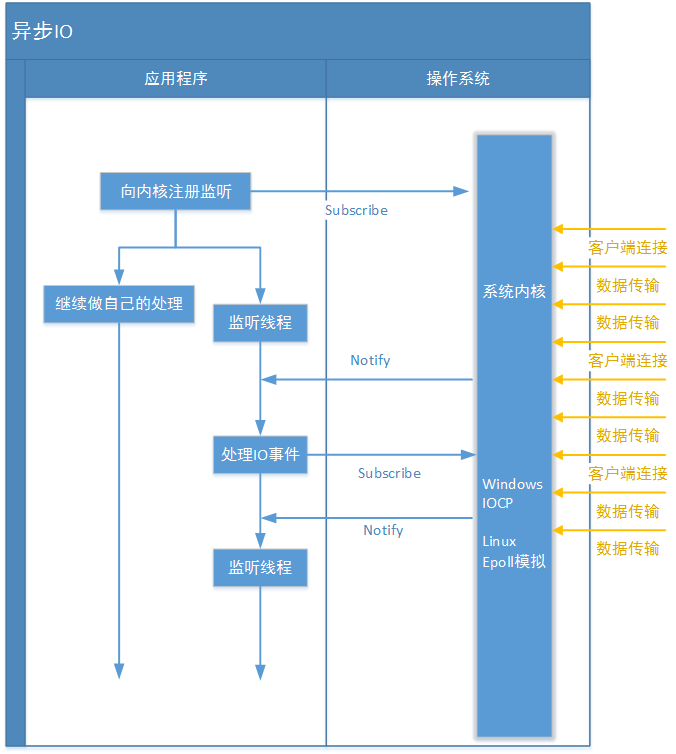

# I/O (input output)

## 概览

对 就那个各种outputStrem,inputStream的看上去很杂乱，但实际上很有规则的东西。借由两张图就能讲清楚





### IO流的分类

*   按照流的流向分，可以分为输入流和输出流；

*   按照操作单元划分，可以划分为字节流和字符流；

*   按照流的角色划分为节点流和处理流。

**java IO流共涉及40多个类，这些类看上去很杂乱，但实际上很有规则，而且彼此之间存在非常紧密的联系， Java IO流的40多个类都是从如下4个抽象类基类中派生出来的。**

*   InputStream/Reader: 所有的输入流的基类，前者是字节输入流，后者是字符输入流。

*   OutputStream/Writer: 所有输出流的基类，前者是字节输出流，后者是字符输出流。

### 节点流和处理流的区别

输入流和输出流、字节流和字符流的区别从字面上看就非常明显，但节点流和处理流的区别从字面上就不那么明显了。





*   节点流：**可以从或向一个特定的地方（节点）读写数据。如FileReader。**

*   处理流：用来包装节点流 ，是对一个已存在的流的连接和封装，通过所封装的流的功能调用实现数据读写。如BufferedReader.处理流的构造方法总是要带一个其他的流对象做参数。一个流对象经过其他流的多次包装，**称为流的链接**。


*   节点流：是**低级流,直接跟数据源相接**。

*   处理流：**也叫包装流**，把节点流包装了一层,属于修饰器设计模式，不会直接与数据源相连，通过处理流来包装节点流既可以消除不同节点流的实现差异，也可以提供更方便的方法来完成输入输出。

处理流的功能主要体现在以下两个方面:

1.  性能的提高: 主要以增加缓冲的方式来提高输入输出的效率。

2.  操作的便捷: 处理流可能提供了一系列便捷的方法来一次输入输出大批量的内容,而不是输入/输出一个或多个水滴，处理流可以嫁接在任何已存在的流的基础上。

## IO 网络通信

上面我们用两个图搞定了I/O,到这里你在本地处理个文件呀，处理个输入、输出通过API都没啥问题了。但是，我们发现现在的软件和应用越来越多的使用网络来传输数据，那也就是说我们I/O所要处理的对象可能没变，都是数据嘛，但是数据输入、输出的渠道很大程度上是通过网络，既然是网络，那结合网络就会有一些特点，比如网络的大量连接和高并发。至此我们从单纯的I/O处理变成已经和网络扯上关系了。

来看看这关系是怎么建立吧。分两块，先说网络，就是说数据要在网络中传输，我们用java的方式怎么编程实现？嗯，想起我们熟悉的java网络编程必备的Socket了。是的，就是它。例子太多就不写了，大致过程就是利用socket API建立两台主机的连接，然后一边发送数据，一边接收数据（当然也可以双向通信）。再说IO，数据的具体IO操作过程就是通过各种 InputStrem、OutputStrem、Reade**r Writer把数据读出来或写出去。至此，我们通过Socket+I/O就可以实现数据在网络中的两台主机间的传输，完成了广义上的通信了**。

## IO模型

到这里我们可以通过网络实现网络间的IO处理了，但问题来了，网络自身的特点上文提到了，比如大量连接和高并发。而现在我们的IO是同步阻塞I/O处理（也就是BIO，BlockingI/O），怎么讲? 说白了就是它在读、写操作时只能阻塞着等它完成，CPU中间不能干别的。这要是一两个连接那等就等吧，我们忍了，而网络的特点告诉我们连接会很多，那就不是等一会儿的事儿了，我们忍不了，得解决，于是有了下图的经典**BIO编程模型**。



图中为伪代码，这是一个经典的**每连接每线程**的模型，之所以使用多线程，主要原因在于`socket.accept()`、`socket.read()`、`socket.write()`三个主要函数都是同步阻塞的，当一个连接在处理I/O的时候，系统是阻塞的，如果是单线程的话必然就挂死在那里；但CPU是被释放出来的，开启多线程，就可以让CPU去处理更多的事情。其实这也是所有使用多线程的本质：

1.  利用多核

2.  当I/O阻塞系统，但CPU空闲的时候，可以利用多线程使用CPU资源。

现在的多线程一般都使用线程池，可以让线程的创建和回收成本相对较低。在活动连接数不是特别高（小于单机1000）的情况下，这种模型是比较不错的，可以让每一个连接专注于自己的I/O并且编程模型简单，也不用过多考虑系统的过载、限流等问题。线程池本身就是一个天然的漏斗，可以缓冲一些系统处理不了的连接或请求。

不过，这个模型最本质的问题在于，严重依赖于线程。但线程是很”贵”的资源，主要表现在：

1.  线程的创建和销毁成本很高，在Linux这样的操作系统中，线程本质上就是一个进程。创建和销毁都是重量级的系统函数。

2.  线程本身占用较大内存，像Java的线程栈，一般至少分配512K～1M的空间，如果系统中的线程数过千，恐怕整个JVM的内存都会被吃掉一半。

    1.  线程的切换成本是很高的。操作系统发生线程切换的时候，需要保留线程的上下文，然后执行系统调用。如果线程数过多，可能执行线程切换的时间甚至会大于线程执行的时间，这时候带来的表现往往是[系统load偏高]、[CPU sy使用率特别高]（超过20%以上)，导致系统几乎陷入不可用的状态。

    2.  容易造成锯齿状的系统负载。因为系统负载是用活动线程数或CPU核心数，一旦线程数量多但外部网络环境不是很稳定，就很容易造成大量请求的结果同时返回，激活大量阻塞线程从而使系统负载压力过大。

所以，**当面对十万甚至百万级连接的时候，传统的BIO模型是无能为力的**。随着移动端应用的兴起和各种网络游戏的盛行，百万级长连接日趋普遍，此时，必然需要一种更高效的I/O处理模型。

有关 IO模型，可以参考  [Unix 网络 IO 模型](../../Linux/IO/Unix%20网络%20IO%20模型/Unix%20网络%20IO%20模型.md "Unix 网络 IO 模型")

## NIO

### 引言

在 JDK 推出 Java NIO 之前，基于 Java 的所有 Socket 通信都采用了同步阻塞模式（BIO），这种一对一的通信模型虽然简化了开发的难度，但在性能和可靠性方面却存在这巨大的瓶颈，特别是无法处理高并发的场景，使得 Java 在服务器端应用十分有限。

正是由于 Java 传统 BIO 的拙劣表现，使得 Java 不得不去开发新版的 IO 模型，最终，JDK1.4 提供了新的 NIO 类库，Java可以支持非阻塞 IO；之后，JDK1.7 正式发布，不但对 NIO 进行了升级，还提供了 AIO 功能。Java NIO 部分，其底层原理就是 UNIX 的 IO 多路复用。

目前流程的多路复用IO实现主要包括四种: `select`、`poll`、`epoll`、`kqueue`。下表是他们的一些重要特性的比较:



正如我们文章开篇的那段BIO程序。传统 BIO 中，ServerSocket负责绑定 IP 地址，启动监听端口；Socket 负责发起连接操作，连接成功后，双方通过输入和输出流进行同步阻塞通信。**采用 BIO 通信模型的 Server，通常由一个独立的 Acceptor 线程负责监听 Client 端的连接，它接受到 Client 端连接请求后为每个 Client 创建一个新的线程进行处理，处理完之后，通过输出流返回给 Client 端，线程销毁**，过程如下图所示。


**这个模型最大的问题是：** 缺乏扩展性，不能处理高性能、高并发场景，线程是 JVM 中非常宝贵的资源，当线程数膨胀后，系统的性能就会急剧下降，随着并发访问量的继续增大，系统就会出现线程堆栈溢出、创建新线程失败等问题，导致 Server 不能对外提供服务。

为了改进这种一对一的连接模型，后来又**演进出了一种通过线程池或者消息队列实现 1 个或者多个线程处理所有 Client 请求的模型**，由于它底层依然是同步阻塞 IO，所以被称为【**伪异步 IO 模型**】。相比于传统 BIO 后端不断创建新的线程处理 Client 请求，它在后端使用一个线程池来代替，通过线程池可以灵活的调配线程资源，设置线程的最大值，防止由于海量并发接入导致线程资源耗尽，过程如下图所示：


看似这个模型解决了 BIO 面对的问题，实际上，由于它是面向数据流的模型，底层依然是同步阻塞模型，在处理一个 socket 输入流，它会一直阻塞下去，除非：有数据可读、可用数据读取完毕、有异常，否则会一直一直阻塞下去。这个模型最大的问题是：

**阻塞的时间取决于对应 IO 线程的处理速度和网络 IO 的传输速度，处理效率不可控。**

**那么如何破解上述难题？NIO将给出答案。**

Java NIO 是 Java IO 模型中最重要的 IO 模型，也是本文主要讲述的内容，正式由于 NIO 的出现，Java 才能在服务端获得跟 C 和C++ 一样的运行效率，NIO 是 New IO（或者 Non-block IO）的简称。

与 Socket 类和 ServerSocket 类相对应，NIO 也提供了 SocketChannel 和 ServerSocketChannel 两种不同套接字通道的实现，它们都支持阻塞和非阻塞两种模式。一般来说，低负载、低并发的应用程序可以选择同步阻塞 IO 以降低复杂度，但是高负载、高并发的网络应用，需要使用 NIO 的非阻塞模式进行开发。

**在 NIO 中有三种非常重要的概念**：

*   缓冲区Buffer

*   Channel

*   Selector

### Buffer

*   **Java IO是面向流的**，每次从流（InputStream/OutputStream）中读一个或多个字节，直到读取完所有字节，它们没有被缓存在任何地方。另外，它不能前后移动流中的数据，如需前后移动处理，需要先将其缓存至一个缓冲区。

*   **Java NIO面向缓冲**，数据会被读取到一个缓冲区，需要时可以在缓冲区中前后移动处理，这增加了处理过程的灵活性。但与此同时在处理缓冲区前需要检查该缓冲区中是否包含有所需要处理的数据，并需要确保更多数据读入缓冲区时，不会覆盖缓冲区内尚未处理的数据。

Buffer，本质上是一块内存区，可以用来读写数据，它包含一些要写入或者要读出的数据。在 NIO 中，所有数据都是通过 Buffer 处理的，读取数据时，它是直接读到缓冲区中，写入数据时，写入到缓冲区。

最常用的缓冲区是 ByteBuffer，一个 ByteBuffer 提供了一组功能用于操作 byte 数组，除了 ByteBuffer，还有其他的一些 Buffer，如：CharBuffer、IntBuffer 等，它们之间的关系如下图所示：


*   **HeapByteBuffer**：在调用ByteBuffer.allocate（）时使用。 它被称为堆，因为它保存在JVM的堆空间中，因此你可以获得所有优势，如GC支持和缓存优化。 但是，它不是页面对齐的，这意味着如果你需要通过JNI与本地代码交谈，JVM将不得不复制到对齐的缓冲区空间。MappedByteBuffer将文件直接映射到内存。可以映射整个文件，如果文件比较大的话可以考虑分段进行映射，只要指定文件的感兴趣部分就可以。

*   **MappedByteBuffer**：在调用FileChannel.map（）时使用。 与DirectByteBuffer类似，这也是JVM堆外部的情况。 使用 `FileChannel.map()` 映射,分配堆空间之外的内存空间。本质上就是围绕`mmap()`的系统调用，让我们的java代码可以直接操纵映射的内存数据。

*   **DirectByteBuffer**：在调用ByteBuffer.allocateDirect（）时使用。 JVM将使用malloc（）在堆空间之外分配内存空间。

    *   &#x20;因为它不是由JVM管理的，所以你的内存空间是页面对齐的，不受GC影响，这使得它成为处理本地代码的完美选择。

    *   DirectByteBuffer是通过**虚引用**(Phantom Reference)来实现堆外内存的释放的，参考 [运行时数据区](../JVM/运行时数据区/运行时数据区.md "运行时数据区")。

    *   DirectByteBuffer 是 MappedByteBuffer 的具体实现类，DirectByteBuffer 在 MappedByteBuffer 的基础上提供了内存映像文件的随机读取 get() 和写入 write() 的操作。

    *   由于MappedByteBuffer申请的是堆外内存，因此**不受Minor GC控制**，只能在发生Full GC时才能被回收。而`DirectByteBuffer`改善了这一情况，它是MappedByteBuffer类的子类，同时它实现了DirectBuffer接口，维护一个Cleaner对象来完成内存回收。因此它既可以通过**Full GC**来回收内存，也可以调用`clean()`方法来进行回收。

    *   directbuffer底层用的malloc，malloc分配大内存的时候用的mmap 所以，DirectByteBuffer 也实现了[零拷贝](<../../Linux/Linux 内存管理/零拷贝/零拷贝.md> "零拷贝")

Buffer 基本用法（读写数据过程）：

1.  把数据写入 Buffer；

2.  调用 flip()，Buffer 由写模式变为读模式；

3.  Buffer 中读取数据；

4.  调用 clear() 清空buffer，等待下次写入。

示例如下：

```java
byte[] req = "QUERY TIME ORDER".getBytes();
ByteBuffer byteBuffer = ByteBuffer.allocate(req.length);
byteBuffer.put(req);
byteBuffer.flip();
while (byteBuffer.hasRemaining()){
     System.out.println((char)byteBuffer.get());
}
byteBuffer.clear();
```

这里重点讲下`flip()`方法, Buffer 中的`flip()` 方法涉及到 Buffer 中的`capacity`、`position`、`limit`三个概念。

*   capacity：在读/写模式下都是固定的，就是我们分配的缓冲大小（容量）。

*   position：类似于读/写指针，表示当前读(写)到什么位置。

*   limit：在写模式下表示最多能写入多少数据，此时和capacity相同。在读模式下表示最多能读多少数据，此时和缓存中的实际数据大小相同。

**Buffer有两种模式，写模式和读模式**。在写模式下调用flip()之后，Buffer从写模式变成读模式。如下图所示：


下图显示了flip()在读写过程中position、limit、capacity是怎样变化的：


Buffer 常用方法：

*   flip()：把 buffer 从模式调整为读模式，在读模式下，可以读取所有已经写入的数据

*   clear()：清空整个 buffer

*   compact()：只清空已读取的数据，未被读取的数据会被移动到 buffer 的开始位置，写入位置则紧跟着未读数据之后

*   rewind()：将 position 置为0，这样我们可以重复读取 Buffer 中的数据，limit 保持不变

*   mark()和reset()：通过mark方法可以标记当前的position，通过reset来恢复mark的位置

*   equals()：判断两个 Buffer 是否相等，需满足：类型相同、Buffer 中剩余字节数相同、所有剩余字节相等

*   compareTo()：compareTo 比较 Buffer 中的剩余元素，只不过这个方法适用于比较排序的

### Channel

*   **Java IO的各种流是阻塞的**。当某个线程调用read()或write()方法时，该线程被阻塞，直到有数据被读取到或者数据完全写入。阻塞期间该线程无法处理任何其它事情。

*   **Java NIO为非阻塞模式**。读写请求并不会阻塞当前线程，在数据可读/写前当前线程可以继续做其它事情，所以一个单独的线程可以管理多个输入和输出通道。

Channel与流的不同之处在于Channel 是**全双工**的，可以比流更好地映射底层操作系统的 API。流只是在一个方向上移动（一个流必须 是InputStream或者Outputstream的子类）。而通道可以用于读、写或者二者同时进行。通道可以**异步读写**；它是基于缓冲区（Buffer）进行读写的；

在 Java 中提供以下几种Channel：

*   FileChannel：用于文件的读写；

*   DatagramChannel：用于UDP 数据读写；

*   SocketChannel：用于Socket 数据读写；

*   ServerSocketChannel：监听 TCP 连接请求。

这些 Channel 类之间的继承关系如下图所示：


`FileChannel 的 transferTo()` 方法，可以将文件缓冲区的数据直接传输到目标 Channel，避免内核缓冲区和用户态缓冲区之间的数据拷贝，**这属于操作系统级别的** [零拷贝](<../../Linux/Linux 内存管理/零拷贝/零拷贝.md> "零拷贝")。 **transferTo()的实现方式就是通过系统调用sendfile()**，同理transferFrom()也是这种实现方式。



Java NIO 发布时内置了对 `scatter/gather`的支持：

*   Scattering read 指的是从通道读取的操作能把数据写入多个 Buffer，也就是 sctters 代表了数据从一个 Channel 到多个 Buffer的过程。

*   Gathering write 则正好相反，表示的是从多个 Buffer 把数据写入到一个 Channel中。


代码示例如下：

```java
// Scattering read
ByteBuffer header = ByteBuffer.allocate(128);
ByteBuffer body   = ByteBuffer.allocate(1024);

ByteBuffer[] bufferArray = { header, body };
channel.read(bufferArray);

// Gathering write
ByteBuffer header =ByteBuffer.allocate(128);
ByteBuffer body   = ByteBuffer.allocate(1024);

ByteBuffer[] bufferArray = { header, body};
channel.write(bufferArray);
```

### Selector

Selector 是 Java NIO 核心部分。

简单来说，**它的作用就是：Selector 不断轮询注册在其上的 Channel，如果某个 Channel 上面有新的 TCP 连接、读和写事件，这个 Channel 就处于就绪状态，会被 Selector 轮询出来，然后通过 SelectorKey() 可以获取就绪 Channel 的集合，进行后续的 IO 操作**。

一个 Selector 可以轮询多个 Channel，由于 JDK 底层使用了 epoll() 实现，它并没有最大连接句柄 1024/2048 的限制，这就意味着只需要一个线程负责 Selector 的轮询，就可以连接上千上万的 Client。（Java NIO的选择器允许一个单独的线程同时监视多个通道，可以注册多个通道到同一个选择器上，然后使用一个单独的线程来“选择”已经就绪的通道。这种“选择”机制为一个单独线程管理多个通道提供了可能。）

用原生NIO api进行开发是比较复杂，门槛比较高，所以出现了[Netty](../框架&库类\&tools/Netty/Netty.md "Netty") 这样好用、强大的NIO框架。

### Demo

服务端

```java
import java.io.IOException;
import java.net.InetSocketAddress;
import java.nio.ByteBuffer;
import java.nio.channels.SelectionKey;
import java.nio.channels.Selector;
import java.nio.channels.ServerSocketChannel;
import java.nio.channels.SocketChannel;
import java.util.Iterator;
import java.util.Set;

public class ChannelServer {
    public static void main(String[] args) {
        Selector selector = null;
        try {
            // 1. 创建 Selector 实例
            selector = Selector.open();
            // 2. 创建 ServerSocketChannel 实例，配置为非阻塞模式，绑定本地端口。
            ServerSocketChannel ssc = ServerSocketChannel.open();
            ssc.configureBlocking(false);
            ssc.bind(new InetSocketAddress(8899));
            // 3. 把 ServerSocketChannel实例 注册到 Selector 实例中
            ssc.register(selector, SelectionKey.OP_ACCEPT);

            while (true) {
                // 4. 这里设置了3秒超时时间，也就是阻塞3秒
                if (selector.select(3000) == 0) {
                    continue;
                }
                // 5. 获取选中的 SelectionKey 的集合
                Set<SelectionKey> selectionKeys = selector.selectedKeys();
                Iterator<SelectionKey> iterator = selectionKeys.iterator();
                // 6. 处理 SelectionKey 的感兴趣的操作。注册到 selector 中的 serverSocketChannel 只能是
                // isAcceptable() ，因此通过它的 accept() 方法，
                // 我们可以获取到客户端的请求 SocketChannel 实例，然后再把这个 socketChannel 注册到 selector
                // 中，设置为可读的操作。那么下次遍历 selectionKeys 的时候，就可以处理那么可读的操作
                while (iterator.hasNext()) {
                    SelectionKey key = iterator.next();

                    // 准备好连接
                    if (key.isAcceptable()) {
                        ServerSocketChannel serverSocketChannel = (ServerSocketChannel) key.channel();
                        SocketChannel clientChannel = serverSocketChannel.accept();
                        clientChannel.configureBlocking(false);
                        clientChannel.register(key.selector(), SelectionKey.OP_READ);
                    }

                    // 准备好读的操作
                    if (key.isReadable()) {
                        SocketChannel clientChannel = (SocketChannel) key.channel();
                        ByteBuffer readBuffer = ByteBuffer.allocate(10);
                        int readBytes = clientChannel.read(readBuffer);
                        if (readBytes == -1) {
                            System.out.println("closed.......");
                            clientChannel.close();
                        } else if (readBytes > 0) {
                            String s = new String(readBuffer.array());
                            System.out.println("Client said: " + s);
                            if (s.trim().equalsIgnoreCase("Hello")) {
                                // attachment is content used to write
                                key.interestOps(SelectionKey.OP_WRITE);
                                key.attach("Welcome maizi !!!");
                            }
                        }
                    }

                    if (key.isValid() && key.isWritable()) {
                        SocketChannel clientChannel = (SocketChannel) key.channel();
                        String content = (String) key.attachment();
                        // write content to socket channel
                        clientChannel.write(ByteBuffer.wrap(content.getBytes()));
                        key.interestOps(SelectionKey.OP_READ);
                    }

                    // remove handled key from selected keys
                    iterator.remove();
                }
            }
        } catch (IOException e) {
            e.printStackTrace();
        } finally {
            // close selector
            if (selector != null) {
                try {
                    selector.close();
                } catch (IOException e) {
                    e.printStackTrace();
                }
            }
        }
    }
}

```

客户端

```java
import java.io.IOException;
import java.net.InetAddress;
import java.net.InetSocketAddress;
import java.net.SocketException;
import java.nio.ByteBuffer;
import java.nio.channels.SocketChannel;

public class ChannelClient {
    public static void main(String[] args) {
        byte[] data = "hello".getBytes();
        SocketChannel channel = null;
        try {
            // 1. 创建 SocketChannel 实例，并配置为非阻塞模式，只有在非阻塞模式下，任何在 SocketChannel 实例上的 I/O
            // 操作才是非阻塞的。这样我们的客户端就是一个非阻塞式客户端，也就可以提升客户端性能。
            channel = SocketChannel.open();
            channel.configureBlocking(false);
            // 2. 用 connect() 方法连接服务器，同时用 while 循环不断检测并完全连接。 其实我们可以不用这样盲等，这里只是为了演示连接的过程。
            // 当你在需要马上进行 I/O 操作前，必须要用 finishConnect() 完成连接过程。
            if (!channel.connect(new InetSocketAddress(InetAddress.getLocalHost(), 8899))) {
                while (!channel.finishConnect()) {
                    System.out.print("正在尝试连接服务器.....");
                }
            }

            System.out.println("服务器连接成功!");

            ByteBuffer writeBuffer = ByteBuffer.wrap(data);
            ByteBuffer readBuffer = ByteBuffer.allocate(1024);
            int totalBytesReceived = 0;
            int bytesReceived;
            // 3. 用 ByteBuffer 读写字节，这里我们为何和一个 while 循环不断地读写呢？ 还记得前面讲 SelectableChannel
            // 非阻塞时的特性吗？ 如果一个 SelectableChannel 为非阻塞模式，它的 I/O 操作读写的字节数可能比实际的要少，甚至没有。
            // 所以我们这里用循环不断的读写，保证读写完成。
            while (totalBytesReceived < data.length) {
                if (writeBuffer.hasRemaining()) {
                    channel.write(writeBuffer);
                }
                if ((bytesReceived = channel.read(readBuffer)) == -1) {
                    throw new SocketException("Connection closed prematurely");
                }
                totalBytesReceived += bytesReceived;
                System.out.println("等待服务器回应.....");
            }
            System.out.println("Server said: " + new String(readBuffer.array()));
        } catch (IOException e) {
            e.printStackTrace();
        } finally {
            // 4 .close socket channel
            try {
                if (channel != null) {
                    channel.close();
                }
            } catch (IOException e) {
                e.printStackTrace();
            }
        }
    }
}
```

## AIO

*NIO 2.0 中引入异步通道的概念*\*，\****并提供了异步文件通道和异步套接字通道的实现，它是真正的异步非阻塞I IO，底层是利用事件驱动（AIO）实现，不需要多路复用器（Selector）对注册的通道进行轮循操作即可实现异步读写。***

AIO 全程 Asynchronous I/O，它是异步的，客户端发起请求之后不需要等待服务端响应可以做其他的事情，然后服务端业务逻辑处理完之后会将处理结果通知客户端。客户端这个时候会到指定的缓冲区获取数据。



和同步IO一样，异步IO也是由操作系统进行支持的：

*   windows系统提供了一种异步IO技术: **IOCP**(I/O Completion Port，I/O完成端口)

*   Linux下使用的是**epoll**(上文介绍过的一种多路复用IO技术的实现)对异步IO进行模拟。

### Demo

服务端

```java
package net.haicoder.server;
import java.net.InetSocketAddress;
import java.nio.ByteBuffer;
import java.nio.channels.AsynchronousChannelGroup;
import java.nio.channels.AsynchronousServerSocketChannel;
import java.nio.channels.AsynchronousSocketChannel;
import java.nio.channels.CompletionHandler;
import java.util.concurrent.ExecutorService;
import java.util.concurrent.Executors;
public class AioServer {
    private final int port;
    public static void main(String[] args) {
        int port = 9999;
        new AioServer(port);
    }
    public AioServer(int port) {
        this.port = port;
        listen();
        while (true) {
            try {
                Thread.sleep(1000000);
            } catch (InterruptedException e) {
            }
        }
    }
    private void listen() {
        try {
            ExecutorService executorService = Executors.newCachedThreadPool();
            AsynchronousChannelGroup threadGroup = AsynchronousChannelGroup.withCachedThreadPool(executorService, 1);
            final AsynchronousServerSocketChannel serverSocketChannel = AsynchronousServerSocketChannel.open(threadGroup);
            serverSocketChannel.bind(new InetSocketAddress(port));
            System.out.println("服务已经启动，监听端口：" + port);
            serverSocketChannel.accept(null, new CompletionHandler<AsynchronousSocketChannel, Object>() {
                final ByteBuffer byteBuffer = ByteBuffer.allocate(1024);
                @Override
                public void completed(AsynchronousSocketChannel result, Object attachment) {
                    System.out.println("I/O 操作成功，开始获取数据");
                    try {
                        byteBuffer.clear();
                        result.read(byteBuffer).get();
                        byteBuffer.flip();
                        System.out.println("服务端接收到数据：" + new String(byteBuffer.array()).trim());
                        result.write(byteBuffer);
                        byteBuffer.flip();
                    } catch (Exception e) {
                        e.printStackTrace();
                    } finally {
                        try {
                            result.close();
                            serverSocketChannel.accept(null, this);
                        } catch (Exception e) {
                            e.printStackTrace();
                        }
                    }
                    System.out.println("操作完成");
                }
                @Override
                public void failed(Throwable exc, Object attachment) {
                    System.out.println("I/O 操作失败:" + exc);
                }
            });
            Thread.sleep(1000);
        } catch (Exception e) {
            e.printStackTrace();
        }
    }
}
```

客户端

```java
package net.haicoder.client;
import java.net.InetSocketAddress;
import java.nio.ByteBuffer;
import java.nio.channels.AsynchronousSocketChannel;
import java.nio.channels.CompletionHandler;
public class AioClient {
    private AsynchronousSocketChannel clientChannel;
    private static final String host = "127.0.0.1";
    private static final Integer port = 9999;
    public AioClient() throws Exception {
        clientChannel = AsynchronousSocketChannel.open();
    }
    public void connect(String host, int port) {
        try {
            clientChannel.connect(new InetSocketAddress(host, port), null, new CompletionHandler<Void, Void>() {
                @Override
                public void completed(Void result, Void attachment) {
                    try {
                        clientChannel.write(ByteBuffer.wrap("你好嗨客网，客户端链接成功了".getBytes())).get();
                        System.out.println("数据已经发送成功!");
                    } catch (Exception e) {
                        e.printStackTrace();
                    }
                }
                @Override
                public void failed(Throwable exc, Void attachment) {
                }
            });
        } catch (Exception e) {
            e.printStackTrace();
        }
        try {
            Thread.sleep(1000);
        } catch (InterruptedException e) {
            e.printStackTrace();
        }
        // 定义一个ByteBuffer准备读取数据
        final ByteBuffer byteBuffer = ByteBuffer.allocate(1024);
        clientChannel.read(byteBuffer, null, new CompletionHandler<Integer, Object>() {
            @Override
            public void completed(Integer result, Object attachment) {
                System.out.println("I/O操作完成" + result);
                System.out.println("获取返回结果：" + new String(byteBuffer.array()).trim());
            }
            @Override
            public void failed(Throwable exc, Object attachment) {
                exc.printStackTrace();
            }
        });
    }
    public static void main(String[] args) throws Exception {
        AioClient aioClient = new AioClient();
        aioClient.connect(host, port);
    }
}
```

**在JAVA NIO框架中，我们说到了一个重要概念“selector”(选择器)。它负责代替应用查询中所有已注册的通道到操作系统中进行IO事件轮询、管理当前注册的通道集合，定位发生事件的通道等操操作；但是在JAVA AIO框架中，由于应用程序不是“轮询”方式，而是订阅-通知方式，所以不再需要“selector”(选择器)了，改由channel通道直接到操作系统注册监听**。

AIO 是完全异步非阻塞的模型，当客户端向服务端发起请求之后，客户端不需要等待也不需要轮询结果，服务端执行完之后会通知客户端让客户端进行处理。

主要涉及到的类：

*   `AsynchronousServerSocketChannel`（服务器接收请求通道）

*   `AsynchronousSocketChannel`（Socket 通讯通道）

*   `CompletionHandler`（异步处理类）。

## 参考

*   [https://blog.csdn.net/jingzi123456789/article/details/72123937](https://blog.csdn.net/jingzi123456789/article/details/72123937 "https://blog.csdn.net/jingzi123456789/article/details/72123937")

*   [https://zhuanlan.zhihu.com/p/69341619](https://zhuanlan.zhihu.com/p/69341619 "https://zhuanlan.zhihu.com/p/69341619")

*   [https://cloud.tencent.com/developer/article/1488120](https://cloud.tencent.com/developer/article/1488120 "https://cloud.tencent.com/developer/article/1488120")

*   [https://pdai.tech/md/java/io/java-io-aio.html](https://pdai.tech/md/java/io/java-io-aio.html "https://pdai.tech/md/java/io/java-io-aio.html")

*   [https://cloud.tencent.com/developer/article/1488087](https://cloud.tencent.com/developer/article/1488087 "https://cloud.tencent.com/developer/article/1488087")

*   [https://pdai.tech/md/java/io/java-io-nio-zerocopy.html#directbytebuffer](https://pdai.tech/md/java/io/java-io-nio-zerocopy.html#directbytebuffer "https://pdai.tech/md/java/io/java-io-nio-zerocopy.html#directbytebuffer")


[序列化](序列化/序列化.md "序列化")