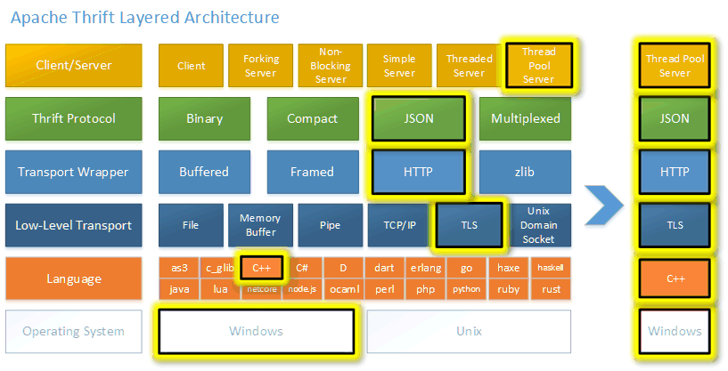
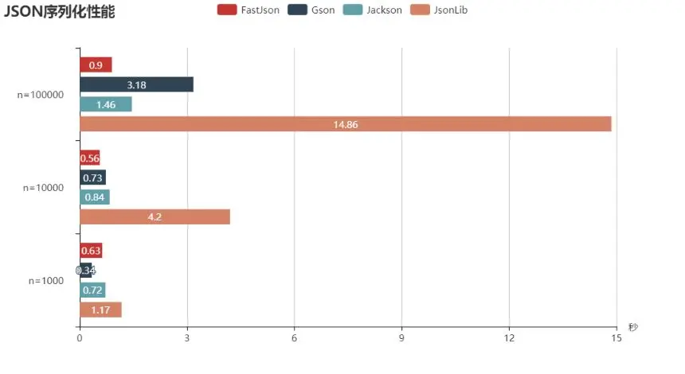
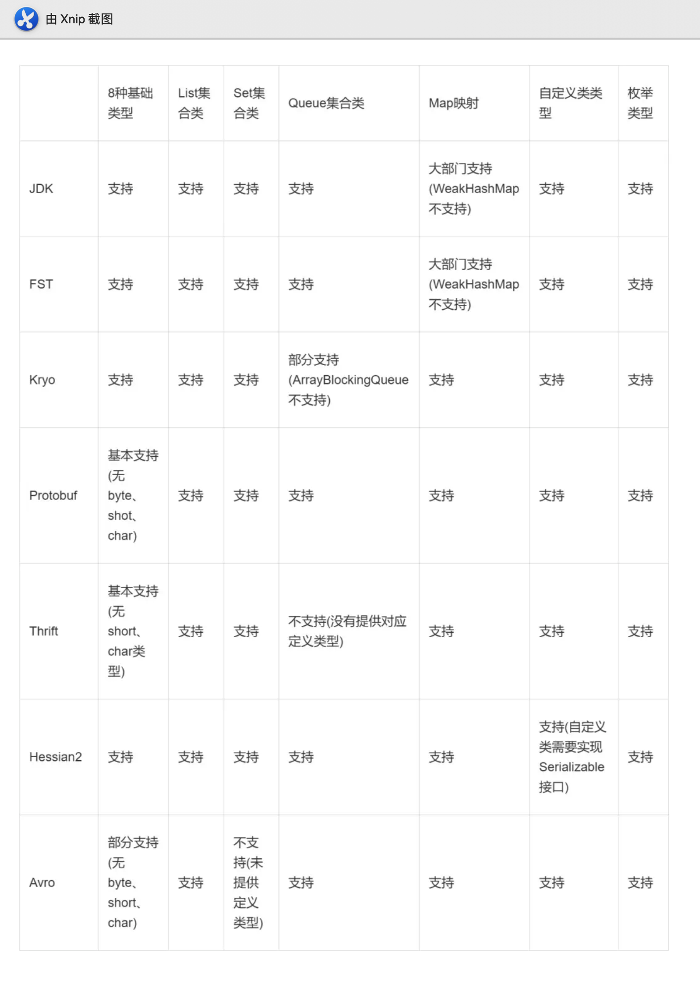

# 序列化

## Questions

### 序列化与反序列化是什么？

*   **序列化：** 对象序列化的最主要的用处就是在传递和保存对象的时候，保证对象的完整性和可传递性。序列化是把对象转换成有序字节流，以便在网络上传输或者保存在本地文件中。核心作用是对象状态的保存与重建。

*   **反序列化：** 客户端从文件中或网络上获得序列化后的对象字节流，根据字节流中所保存的对象状态及描述信息，通过反序列化重建对象。

### 为什么需要序列化与反序列化？

*   **对象序列化可以实现分布式对象。**

    主要应用例如：RMI(即远程调用Remote Method Invocation)要利用对象序列化运行远程主机上的服务，就像在本地机上运行对象时一样。

*   **java对象序列化不仅保留一个对象的数据，而且递归保存对象引用的每个对象的数据。**

    可以将整个对象层次写入字节流中，可以保存在文件中或在网络连接上传递。利用对象序列化可以进行对象的"深复制"，即复制对象本身及引用的对象本身。序列化一个对象可能得到整个对象序列。

*   **序列化可以将内存中的类写入文件或数据库中。**

    比如：将某个类序列化后存为文件，下次读取时只需将文件中的数据反序列化就可以将原先的类还原到内存中。也可以将类序列化为流数据进行传输。

    总的来说就是将一个已经实例化的类转成文件存储，下次需要实例化的时候只要反序列化即可将类实例化到内存中并保留序列化时类中的所有变量和状态。

*   **对象、文件、数据，有许多不同的格式，很难统一传输和保存。**

    序列化以后就都是字节流了，无论原来是什么东西，都能变成一样的东西，就可以进行通用的格式传输或保存，传输结束以后，要再次使用，就进行反序列化还原，这样对象还是对象，文件还是文件。

## 如何实现Java序列化与反序列化

只有实现Serializable或Externalizable接口的类的对象才能被序列化

### 实现 Serializabel接口

让可序列化的对象实现 Serializable 接口，然后再创建一个` ObjectOutputStream` 输出流，再调用 `ObjectOutputStream `对象的 `writeObject()` 方法进行输出可序列化对象即可

```java
public class Person implements Serializable {

    private String name;

    private int age;

    public Person() {
    }

    public Person(String name, int age) {
        this.name = name;
        this.age = age;
    }

    @Override
    public String toString() {
        return "Person{" +
                "name='" + name + '\'' +
                ", age=" + age +
                '}';
    }
    
     public static void main(String[] args) throws IOException {

        Person person = new Person("张三", 18);

        ObjectOutputStream oos = new ObjectOutputStream(new FileOutputStream("/Users/xxx/logs/person.txt"));
        // 写入对象
        oos.writeObject(person);
        oos.close();
    }
}


```

此外，在实现 Serializable 接口的同时，还可以重写 writeObject() 和 readObject() 方法，这样一旦对象被序列化或被反序列化，就会自动的调用这两个方法，而不会使用默认的序列化机制。

```java
private void writeObject(ObjectOutputStream out) throws IOException{
      out.defaultWriteObject();
      //...
      System.out.println("自定义序列化方法");
 }
 
  private void readObject(ObjectInputStream in) throws IOException, ClassNotFoundException{
      in.defaultReadObject();
      //...
     System.out.println("自定义反序列化方法");
 }

```

还有其他三个方法，可供我们定制自己的序列化反序列化过程：

*   readObjectNoData() :用于初始化反序列化对象，当发生一些情况导致反序列化对象不能获得数据时调用；

*   writeReplace() ：指派其他对象写入序列化的流中；

*   readResolve()：返回的对象替换反序列化创建的实例；

**反序列化对象时**，需要创建一个 `ObjectInputStream `输入流，然后调用`  ObjectInputStream  `对象的 `readObject() `方法得到序列化的对象即可。

```java
  ObjectInputStream ois = new ObjectInputStream(new FileInputStream("/Users/helong/logs/person.txt"));
  Person p = (Person) ois.readObject();
  System.out.println(p);
```

需要注意的是：

*   反序列化的对象是由 JVM 自己生成的对象，而不会通过构造方法生成。

*   如果对统一对象执行多次序列化操作，并不会得到多个对象。因为保存到磁盘的对象都有一个序列化编号，当程序试图进行序列化时，会检查该对象是否序列化过，只有该对象从未被序列化过，才会将此对象序列化为字节序列，如果此对象已经序列化过，则直接输出其序列化编号

*   如果一个可序列化的类的成员不是基本类型，而是引用类型，则这个引用类型也必须实现 Serializable 接口。

### transient

对于不想序列化的字段可以再字段类型之前加上transient关键字修饰（反序列化时会被赋予默认值）

```java
 private transient int age;
```

此时将其进行反序列化后，如果该属性是引用数据类型，则返回的是 null，如果该属性是基本数据类型（如 int 类型），则会返回默认值 0（boolean 的默认值是 false）

服务器端给客户端发送序列化对象数据时，对象中有一些数据是敏感的（比如密码字符串等），如果希望对该密码字段在序列化时进行加密，而客户端如果拥有解密的密钥，只有在客户端进行反序列化时，才可以对密码进行读取，这样可以一定程度保证序列化对象的数据安全。

### serialVersionUID

在进行序列化时，会把当前类的`serialVersionUID`写入到字节序列中（也会写入序列化的文件中），在反序列化时会将字节流中的`serialVersionUID`同本地对象中的`serialVersionUID`进行对比，一样的话进行反序列化，不一致则失败报错（报`InvalidCastException`异常）

`serialVersionUID `如果不显式指定,VM默认生成一个(耗费资源)，如同上文中的程序。

`serialVersionUID`的生成有三种方式（`private static final long serialVersionUID = -85899347900852467L`）：

1.  显式声明：默认的1L

2.  显式声明：根据包名、类名、继承关系、非私有的方法和属性以及参数、返回值等诸多因素计算出的64位的hash值

3.  隐式声明：未显式的声明`serialVersionUID`时java序列化机制会根据Class自动生成一个`serialVersionUID`（最好不要这样，因为如果Class发生变化，比如新增或修改了属性，自动生成的`serialVersionUID`可能会随之发生变化，导致匹配不上）

序列化类增加属性时，最好不要修改`serialVersionUID`，避免反序列化失败

### Externalizable

自定义序列化的策略

如果我们在序列化的过程中有一些别的需求，或者说，我们希望对象的一部分可以被序列化，而另一部分不被序列化，此时可以实现 Externalizable 接口，并且实现它的两个方法：writeExternal() 和 readExternal()，这两个方法会在序列化和反序列化的过程中被自动调用以便执行一些特殊的操作。

需要注意的是：

*   如果一个类实现了 Serializable 接口，此时对于 Serializable 对象，其对象是与二进制位的构建有关的，而不会调用构造器（正如之前的例子可知）；

*   而对于一个 Externalizable 对象，其所有的构造函数都会被调用，因此需要给出类的无参和有参构造才可以。

```java
import java.io.*;

public class ExPerson implements Externalizable {
    private String name;
    private int age;

    public ExPerson() {
        System.out.println("无参构造.");
    }

    public ExPerson(String name, int age) {
        this.name = name;
        this.age = age;
        System.out.println("有参构造.");
    }

    @Override
    public String toString() {
        return name + age;
    }

    @Override
    public void writeExternal(ObjectOutput out) throws IOException {
        System.out.println("writeExternal() method.");
        out.writeObject(name);
        out.writeInt(age);
    }

    @Override
    public void readExternal(ObjectInput in) throws IOException, ClassNotFoundException {
        System.out.println("readExternal() method.");
        name = (String) in.readObject();
        age = in.readInt();
    }

    public static void main(String[] args) throws IOException, ClassNotFoundException {
        ExPerson exPerson = new ExPerson("zhangsan", 25);
        System.out.println(exPerson);
        // 序列化
        ObjectOutputStream oos = new ObjectOutputStream(new FileOutputStream("123.txt"));
        System.out.println("保存对象：");
        oos.writeObject(exPerson);
        oos.close();

        // 反序列化
        ObjectInputStream ois = new ObjectInputStream(new FileInputStream("123.txt"));
        System.out.println("接收对象：");
        exPerson = (ExPerson) ois.readObject();
        System.out.println(exPerson);
    }
}
```

总结：使用Externalizable进行序列化时，当读取对象时，会调用被序列化类的无参构造器去创建一个新的对象，然后再将被保存对象的字段的值分别填充到新对象中。因此，必须提供一个无参构造器，访问权限为public；否则会抛出java.io.InvalidClassException 异常。

### 静态变量

**对象序列化时并不会序列化静态变量**，这是因为对象序列化操作是序列化的是对象的状态，而静态变量属于类变量，也就是类的状态。因此，对象序列化并不会保存静态的变量。**序列化保存的是对象的状态，而静态变量属于类的状态**。

### 对单例的影响&#x20;

**序列化会通过反射调用无参的构造方法创建一个新的对象**，所以序列化会破坏单例模式。

解决办法是：在单例类中手写readResolve()函数，直接返回单例对象：

```java
public class Singleton implements Serializable {

    private static final long serialVersionUID = -1576643344804979563L;

    private Singleton() {
    }

    private static class SingletonHolder {
        private static final Singleton singleton = new Singleton();
    }

    public static synchronized Singleton getSingleton() {
        return SingletonHolder.singleton;
    }
 
    private Object readResolve() {
        return SingletonHolder.singleton;
    }
}

```

这样一来，当反序列化从流中读取对象时，readResolve()会被调用，用其中返回的对象替代反序列化新建的对象。

## 其他序列化方式

### JSON序列化

主流的库有

*   Gson

*   fastJson

*   Jackson

[**fastJson**](https://github.com/alibaba/fastjson "fastJson")是阿里巴巴的开源JSON解析库。

```java
  Person person = new Person("张三", 18);
  String str = JSON.toJSONString(person);
  System.out.println(str);

  Person person1 = JSON.parseObject(str, Person.class);
  System.out.println(person1);
  
  输出 ========
  {"age":18,"name":"张三"}
  Person(name=张三, age=18)
```

[**Gson**](https://github.com/google/gson "Gson")是Google公司发布的一个开源的Java库，也是一个高效的JAVA对象序列化、反序列化框架

```java
  Person person = new Person("张三", 18);
  
  Gson gson=new Gson();
  String json=gson.toJson(person);
  log.info("json={}",json);
  
  Person person2=gson.fromJson(json,Person.class);
  log.info("person2={}",person2);
```

[**Jackson**](https://github.com/FasterXML/jackson-databind "Jackson")也是java语言实现的开源工具，它是Spring中Json的默认实现，虽然多年未维护了，但依旧使用广泛。

有三个核心模块

*   Streaming (jackson-core包)：定义了低级流式API，包括了特定json的实现。

*   Annotations (jackson-annotations包)：包含标准的Jackson注解。

*   Databind (jackson-databind包)：实现了数据绑定，依赖于Streaming和Annotations。（导入jackson-databind包会自动导入其他两个包）

```java
  Person person = new Person("张三", 18);

  ObjectMapper objectMapper = new ObjectMapper();
  String str = objectMapper.writeValueAsString(person);
  
  log.info("str = {}", str);
  
  Person person1 = objectMapper.readValue(str, Person.class);
  log.info("person1 = {}", person1);
```

### Hessian

[**Hessian**](http://hessian.caucho.com/ "Hessian")是一个基于二进制的协议，Hessian支持很多种语言，例如Java、python、c++,、net/c#、D、Erlang、PHP、Ruby、object-c等，它的序列化和反序列化也是非常高效，与Java原生序列化一样，被序列化/反序列化的对象也必须实现Serializable接口，实现代码的写法也很像Java原生序列化。

注意：

*   hessian 是一个轻量级的RPC框架，序列化只是其中的功能之一，其通讯效率高于 WebService 和 Java 自带的序列化

*   hessian 同时也是一个远程通信的协议，Dubbo基于Hessian实现了自己的Hessian协议，可以直接通过Dubbo进行远程调用

```java
  Person person = new Person("张三", 18);

  ByteArrayOutputStream os = new ByteArrayOutputStream();
  //Hessian的序列化输出
  HessianOutput ho = new HessianOutput(os);
  ho.writeObject(person);
  byte[] bytes = os.toByteArray();
  log.info("bytes={}", bytes);

  //Hessian的反序列化输出
  ByteArrayInputStream is = new ByteArrayInputStream(bytes);
  HessianInput ho2 = new HessianInput(is);
  Person person2 = (Person) ho2.readObject();
  log.info("person2={}", person2);
 
```

### Kryo

[**Kryo**](https://github.com/EsotericSoftware/kryo "Kryo")是一个快速高效的Java序列化框架，旨在提供快速、高效和易用的API。无论文件、数据库或网络数据Kryo都可以随时完成序列化。Kryo还可以执行自动深拷贝（克隆）、浅拷贝（克隆）。这是对象到对象的直接拷贝，而不是对象->字节->对象的拷贝。

Kryo是一种非常成熟的序列化实现，已经在Twitter、Groupon、Yahoo以及多个著名开源项目（如Hive、Storm）中广泛的使用。

dubbo RPC默认的序列化用的是 hessian2，未来，当Kryo或者FST在dubbo中当应用足够成熟之后，dubbo很可能会将dubbo RPC的默认序列化从hessian2改为它们中间的某一个。

```java
 Person person = new Person("张三", 18);

  Kryo kryo = new Kryo();
  kryo.register(Person.class);

  Output output = new Output(1024, -1);
  kryo.writeObject(output, person);

  Input input = new Input(output.getBuffer(), 0, output.position());
  Person object2 = kryo.readObject(input, Person.class);
  log.info("object2 = {}", object2);
```

Kryo自带了很多 java 基本类的Serializer，所以尽管不知道Serializer，Kryo也会自动匹配：

```java
    Kryo kryo=new Kryo();      
    HashMap h=new HashMap();
    h.put("k1", "v1");
    h.put("k2", "v2");
    Output output=new Output(1, 1024);    
    kryo.writeObject(output, h);
    output.close();
    byte[] data=output.toBytes();
    
    Input i=new Input(data);
    i.close();
    HashMap h2= (HashMap)kryo.readObject(i, HashMap.class);
    System.out.println(h2.get("k2"));  
```

虽然kryo的性能很好，但目前来看在类似SpringBoot SpringCloud的应用中还没有实践，例如 springCloud默认是利用 jackson（当然你也可以换成fastJson）来进行的序列化。可能的是因为：

*   有改造成本，而且越底层的东西改造成本越高，搞不好就崩了，不能轻易动

*   远程通信的量在没有那么大情况下，一般来说json的性能并不是瓶颈。所以在序列化不是瓶颈的情况下也没有驱动力改。但如果序列化是瓶颈的地方，可能也就不用Json而改换其他协议了，比如二进制协议。

目前来看kryo的应用可以在与Redis的应用交互上。 像 Redis 这样的存储工具，是可以安全地存储二进制数据的，所以可以直接把 Kryo 序列化出来的数据存进去。[这里](https://blog.csdn.net/jian876601394/article/details/108260546 "这里")有一个例子。

### MessagePack

> It’s like JSON.but fast and small.

[MessagePack](https://msgpack.org/ "MessagePack") 是一个高效的二进制序列化格式。它让你像 JSON 一样可以在各种语言之间交换数据。但是它比 JSON 更快、更小。小的整数会被编码成一个字节，短的字符串仅仅只需要比它的长度多一字节的大小。

注意，使用messagePack 需要加 @message 注释

```java
@Data
@Message
public class Person implements Serializable {

    private static final long serialVersionUID = -2008259768794734414L;

    private String name;

    private int age;

    public Person() {
    }

    public Person(String name, int age) {
        this.name = name;
        this.age = age;
    }
}
```

```java
 Person person = new Person("张三", 18);

  MessagePack messagePack = new MessagePack();
  //序列化
  byte[] bs = messagePack.write(person);
  System.out.println("byte array's length is : " + bs.length);
  //反序列化
  Person person1 = messagePack.read(bs, Person.class);
  System.out.println(person1);
```

### FST

[FST ](https://github.com/RuedigerMoeller/fast-serialization "FST ")序列化全称是 Fast Serialization Tool，它是对 Java 序列化的替换实现。既然前文中提到 Java 序列化的两点严重不足，在 FST 中得到了较大的改善，FST 的特征如下：

*   JDK 提供的序列化提升了 10 倍，体积也减少 3-4 倍多

*   支持堆外 Maps，和堆外 Maps 的持久化

*   支持序列化为 JSON

```java
FSTConfiguration conf = FSTConfiguration.createAndroidDefaultConfiguration();
        
  Person person = new Person("张三", 18);
  byte[] bytes = conf.asByteArray(person);
  Person newObject = (Person) conf.asObject(bytes);
  System.out.println("deSerialization, " + newObject);
```

Dubbo中对FstObjectInput和FstObjectOutput重新包装解决了序列化和反序列化空指针的问题。

并且构造了FstFactory工厂类，使用工厂模式生成FstObjectInput和FstObjectOutput。其中同时使用单例模式，控制整个应用中FstConfiguration是单例，并且在初始化时将需要序列化的对象全部注册到FstConfiguration。

对外提供了同一的序列化接口FstSerialization，提供serialize和deserialize能力。

### Protobuf

[Protocol buffers](https://developers.google.com/protocol-buffers/ "Protocol buffers") 是由Google公司发布的数据交换格式，提供跨语言、跨平台的序列化和反序列化实现，底层由C++实现

基于java 使用 protobuf 还是有些麻烦的，可以参考：[https://developers.google.com/protocol-buffers/docs/javatutorial](https://developers.google.com/protocol-buffers/docs/javatutorial "https://developers.google.com/protocol-buffers/docs/javatutorial")

步骤是：

*   定义 `.proto` 文件

*   编译 proto 文件

*   利用 protobuf API 开始读写

引入

```xml
<properties>
    <protoc.version>3.17.2</protoc.version>
</properties>

<dependencies>

    <dependency>
        <groupId>com.google.protobuf</groupId>
        <artifactId>protobuf-java</artifactId>
        <version>${protoc.version}</version>
    </dependency>
</dependencies>
```

在src/main下新建目录proto，proto目录下新建文件`student.proto`

```protocol&#x20;buffers
syntax="proto3";

option java_package="com.example.proto";
option java_multiple_files = false;
option java_outer_classname="StudentProto";

message Student {

    int32 id = 1;

    string name = 2;

    string email = 3;

    string friends = 4;
}

message StudentArray {
    repeated Student student = 1;
}
```

下载protoc，使用protoc命令编译proto文件，  编译到java目录下

```bash
protoc student.proto --java_out=../java/

```

使用 `mvn protobuf:compile`编译proto文件

```xml
<properties>
    <protoc.version>3.17.2</protoc.version>
</properties>

<dependencies>

    <dependency>
        <groupId>com.google.protobuf</groupId>
        <artifactId>protobuf-java</artifactId>
        <version>${protoc.version}</version>
    </dependency>
</dependencies>

<build>
    <extensions>
        <extension>
            <groupId>kr.motd.maven</groupId>
            <artifactId>os-maven-plugin</artifactId>
            <version>1.5.0.Final</version>
        </extension>
    </extensions>
    <plugins>
        <plugin>
            <groupId>org.xolstice.maven.plugins</groupId>
            <artifactId>protobuf-maven-plugin</artifactId>
            <version>0.5.1</version>
            <extensions>true</extensions>
            <configuration>
                <protocArtifact>com.google.protobuf:protoc:${protoc.version}:exe:${os.detected.classifier}</protocArtifact>
                <pluginId>protoc-java</pluginId>
                <protoSourceRoot>${project.basedir}/src/main/proto</protoSourceRoot>
                <outputDirectory>${project.build.sourceDirectory}</outputDirectory>
                <clearOutputDirectory>false</clearOutputDirectory>
            </configuration>
            <executions>
                <execution>
                    <goals>
                        <goal>compile</goal>
                    </goals>
                </execution>
            </executions>
        </plugin>
    </plugins>
</build>
```

使用

```java
@Test
public void test1() throws InvalidProtocolBufferException {
    StudentProto.Student student1 = StudentProto.Student.newBuilder()
            .setId(10)
            .setName("zhangsan")
            .setEmail("activepirate@163.com")
            .setFriends("lisi")
            .build();

    // byte[] studentBytes1 = student1.toByteArray();
    // System.out.println(new String(studentBytes1));

    StudentProto.Student student2 = StudentProto.Student.newBuilder()
            .setId(11)
            .setName("zhangsan")
            .setEmail("activepirate@163.com")
            .setFriends("lisi")
            .build();

    StudentProto.StudentArray studentArray = StudentProto.StudentArray.newBuilder()
            .addStudent(student1)
            .addStudent(student2)
            .build();

    byte[] bytes = studentArray.toByteArray();
    System.out.println(new String(bytes));

    List<StudentProto.Student> studentList = StudentProto.StudentArray.newBuilder().mergeFrom(bytes).build().getStudentList();
}
```

*protobuf优缺点：*

**优点**：

*   性能好/效率高

    时间开销： XML格式化（序列化）的开销还好；但是XML解析（反序列化）的开销就不敢恭维了。 但是protobuf在这个方面就进行了优化。可以使序列化和反序列化的时间开销都减短。空间开销：也减少了很多

*   有代码生成机制

    比如你你写个一下类似结构体的内容

    ```protocol&#x20;buffers
     message testA  
     {  

      required int32 m_testA = 1;  

      } 
    ```

    像写一个这样的结构，protobuf可以自动生成它的.h 文件和点.cpp文件。  protobuf将对结构体testA的操作封装成一个类。

*   支持向后兼容和向前兼容

    当客户端和服务器同事使用一块协议的时候， 当客户端在协议中增加一个字节，并不会影响客户端的使用

*   支持多种编程语言

    在Google官方发布的源代码中包含了c++、java、Python三种语言

**缺点**

*   二进制格式导致可读性差

    为了提高性能，protobuf采用了二进制格式进行编码。这直接导致了可读性差。这个直接影响开发测试时候的效率。当然，一般情况下，protobuf非常可靠，并不会出现太大的问题。

*   缺乏自描述

    一般来说，XML是自描述的，而protobuf格式则不是。 给你一段二进制格式的协议内容，不配合你写的结构体是看不出来什么作用的。

*   通用性差

    protobuf虽然支持了大量语言的序列化和反序列化，但仍然并不是一个跨平台和语言的传输标准。在多平台消息传递中，对其他项目的兼容性并不是很好，需要做相应的适配改造工作。相比json 和 XML，通用性还是没那么好。

### Protostuff

*   使用protobuf，我们还要写proto文件，并且我们还要使用工具来编译生成java文件，实在太麻烦。`protostuff`能够很好的解决这个问题。

*   [protostuff](https://github.com/protostuff/protostuff "protostuff")也是谷歌的产品，它是基于protobuf发展而来的，相对于protobuf提供了更多的功能和更简易的用法。

*   其实protostuff也是有局限性的，比如说在序列化的文件在10M以下的时候，还是使用java自带的序列化机制比较好，但是文件比较大的时候还是protostuff好一点，这里的10M不是严格的界限。

```java
 Person person = new Person("张三", 18);

  Schema<Person> schema = RuntimeSchema.getSchema(Person.class);

  // Re-use (manage) this buffer to avoid allocating on every serialization
  LinkedBuffer buffer = LinkedBuffer.allocate(512);

  // 序列化
  final byte[] protostuff;
  try {
      protostuff = ProtostuffIOUtil.toByteArray(person, schema, buffer);
  } finally {
      buffer.clear();
  }

  // 反序列化
  Person personParsed = schema.newMessage();
  ProtostuffIOUtil.mergeFrom(protostuff, personParsed, schema);
  System.out.println(personParsed.toString());
```

### Thrift

Thrift是一套包含序列化功能和支持服务通信的RPC框架，主要包含三大部分：代码生成、序列化框架、RPC框架，大致相当于protoc + protobuffer + grpc，并且支持大量语言，保证常用功能在跨语言间功能一致，是一套全栈式的RPC解决方案。Thrift最初由FaceBook开发，之后由ASF管理。



Thrift支持多种序列化协议，常用的有: Binary、Compact、JSON

thrift的序列化和反序列化步骤： &#x20;

1.  创建thrift接口定义文件；

2.  将thrift的定义文件转换为对应语言的源代码；

3.  选择相应的protocol，进行序列化和反序列化

看起来步骤有点儿像 protobuf，所以还是相对麻烦的。这里就不做代码演示了。

### Avro

Avro（读音类似于\[ævrə]）是Hadoop的一个子项目，由Hadoop的创始人Doug Cutting（也是Lucene，Nutch等项目的创始人）牵头开发。Avro是一个基于二进制数据传输高性能的中间件。在Hadoop的其他项目中 例如HBase和Hive的Client端与服务端的数据传输也采用了这个工具。Avro是一个数据序列化的系统。Avro可以将数 据结构或对象转化成便于存储或传输的格式。Avro设计之初就**用来支持数据密集型应用**，适合于远程或本地大规模数据的存储和交换。它的主要特点有：

*   丰富的数据结构类型；

*   快速可压缩的二进制数据形式，对数据二进制序列化后可以节约数据存储空间和网络传输带宽；

*   存储持久数据的文件容器；

*   可以实现远程过程调用RPC；

*   简单的动态语言结合功能。

Avro提供了两种序列化和反序列化的方式，一种是通过Schema文件来生成代码的方式，一种是不生成代码的通用方式。

## 性能对比

#### 解析性能


#### 序列化之空间开销


### Json序列化性能比较



三种Json序列化实现里，fastJson最好，jackson其次，gson最差

### 各序列化框架对Java数据类型支持的对比



## 选型建议

以上描述的序列化和反序列化协议都各自具有相应的特点，适用于不同的场景：

1.  基于Web browser的Ajax，以及Mobile app与服务端之间的通讯，JSON协议是首选。对于性能要求不太高，或者以动态类型语言为主，或者传输数据载荷很小的的运用场景，JSON也是非常不错的选择。

2.  对于调试环境比较恶劣的场景，采用JSON或XML能够极大的提高调试效率，降低系统开发成本。

3.  当对性能和简洁性有极高要求的场景，Protobuf，Thrift，Avro之间具有一定的竞争关系。

4.  对于T级别的数据的持久化应用场景，Protobuf和Avro是首要选择。如果持久化后的数据存储在Hadoop子项目里，Avro会是更好的选择。

5.  由于Avro的设计理念偏向于动态类型语言，对于动态语言为主的应用场景，Avro是更好的选择。

6.  对于持久层非Hadoop项目，以静态类型语言为主的应用场景，Protobuf会更符合静态类型语言工程师的开发习惯。

7.  如果需要提供一个完整的RPC解决方案，Thrift是一个好的选择。

8.  如果序列化之后需要支持不同的传输层协议，或者需要跨防火墙访问的高性能场景，Protobuf可以优先考虑。

## 附录

以上代码中所有相关库的maven依赖如下：

```xml
    <!-- fastjson -->
    <dependency>
        <groupId>com.alibaba</groupId>
        <artifactId>fastjson</artifactId>
        <version>1.2.80</version>
    </dependency>

    <!-- gson -->
    <dependency>
        <groupId>com.google.code.gson</groupId>
        <artifactId>gson</artifactId>
        <version>2.8.6</version>
    </dependency>

    <!-- jackson-databind -->
    <dependency>
        <groupId>com.fasterxml.jackson.core</groupId>
        <artifactId>jackson-databind</artifactId>
        <version>2.13.2.2</version>
    </dependency>

    <!-- hessian -->
    <dependency>
        <groupId>com.caucho</groupId>
        <artifactId>hessian</artifactId>
        <version>4.0.66</version>
    </dependency>

    <!-- kryo -->
    <dependency>
        <groupId>com.esotericsoftware</groupId>
        <artifactId>kryo</artifactId>
        <version>5.3.0</version>
    </dependency>

    <!-- msgPack -->
    <dependency>
        <groupId>org.msgpack</groupId>
        <artifactId>msgpack</artifactId>
        <version>0.6.12</version>
    </dependency>

    <!-- protostuff-->
    <dependency>
        <groupId>io.protostuff</groupId>
        <artifactId>protostuff-core</artifactId>
        <version>1.7.4</version>
    </dependency>
    <dependency>
        <groupId>io.protostuff</groupId>
        <artifactId>protostuff-runtime</artifactId>
        <version>1.7.4</version>
    </dependency>
    <!-- FST -->
    <dependency>
        <groupId>de.ruedigermoeller</groupId>
        <artifactId>fst</artifactId>
        <version>2.56</version>
    </dependency>

```

## 参考

*   [https://blog.activepirate.com/491.html](https://blog.activepirate.com/491.html "https://blog.activepirate.com/491.html")

*   [https://andrewpqc.github.io/2019/02/24/thrift/](https://andrewpqc.github.io/2019/02/24/thrift/ "https://andrewpqc.github.io/2019/02/24/thrift/")

*   [https://www.cnblogs.com/lxyit/p/12511625.html](https://www.cnblogs.com/lxyit/p/12511625.html "https://www.cnblogs.com/lxyit/p/12511625.html")

*   [http://www.kolhuang.top/posts/java-serialization/](http://www.kolhuang.top/posts/java-serialization/ "http://www.kolhuang.top/posts/java-serialization/")

*   [https://www.cnblogs.com/niuben/p/14212711.html](https://www.cnblogs.com/niuben/p/14212711.html "https://www.cnblogs.com/niuben/p/14212711.html")

*   [https://www.cnblogs.com/javazhiyin/p/11841374.html](https://www.cnblogs.com/javazhiyin/p/11841374.html "https://www.cnblogs.com/javazhiyin/p/11841374.html")

*   [https://blog.csdn.net/jian876601394/article/details/108260546](https://blog.csdn.net/jian876601394/article/details/108260546 "https://blog.csdn.net/jian876601394/article/details/108260546")

*   [https://tech.meituan.com/2015/02/26/serialization-vs-deserialization.html](https://tech.meituan.com/2015/02/26/serialization-vs-deserialization.html "https://tech.meituan.com/2015/02/26/serialization-vs-deserialization.html")

*   [https://dyfloveslife.github.io/2020/03/21/Serialization-and-Deserialization-in-Java/](https://dyfloveslife.github.io/2020/03/21/Serialization-and-Deserialization-in-Java/ "https://dyfloveslife.github.io/2020/03/21/Serialization-and-Deserialization-in-Java/")
