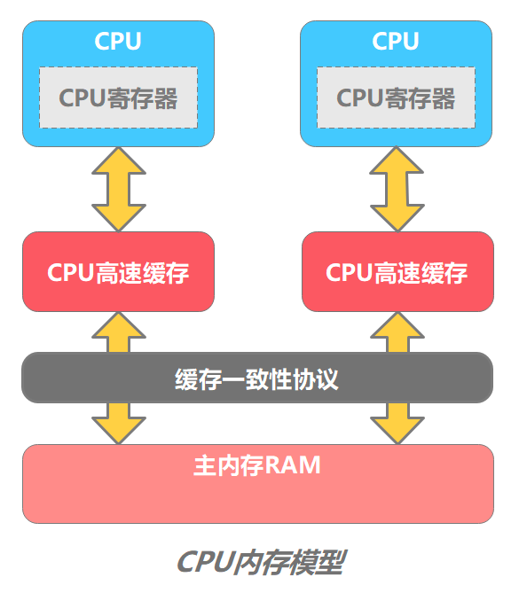
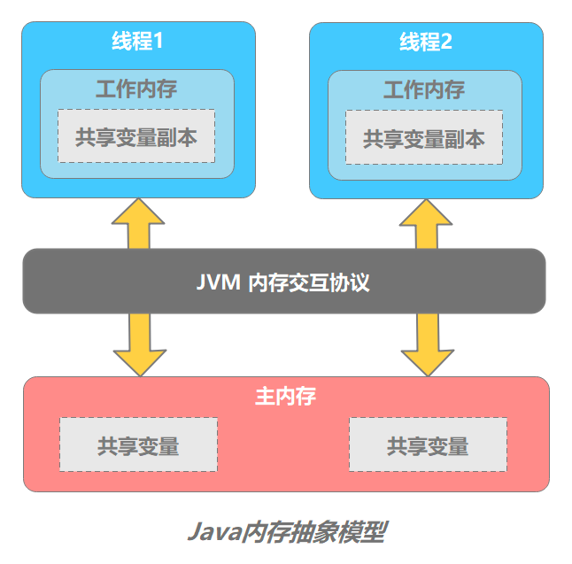
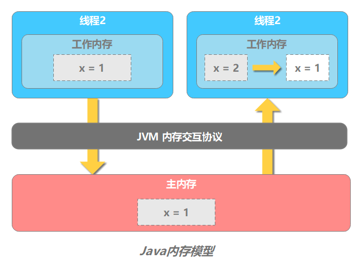
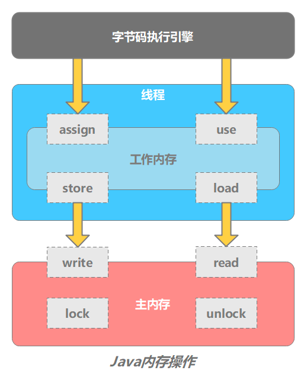
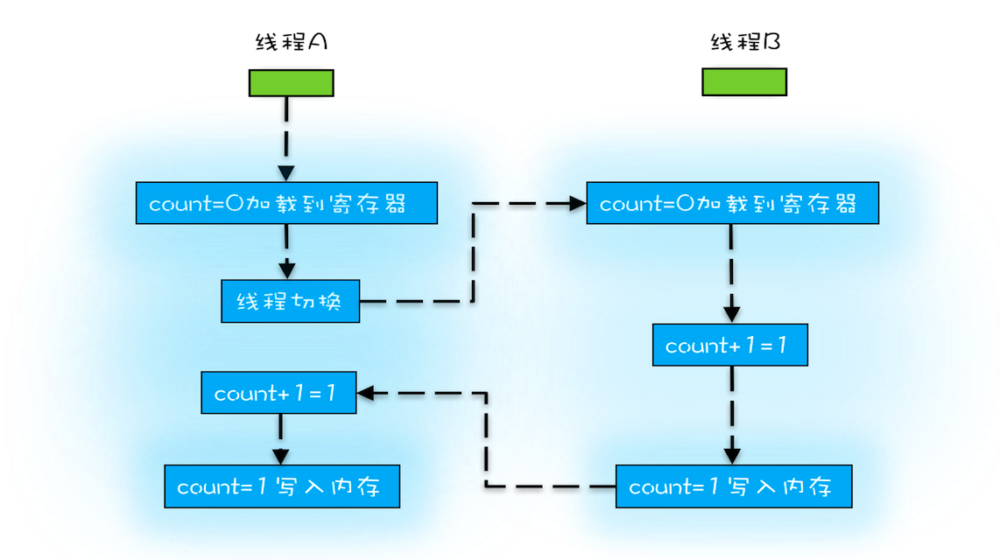
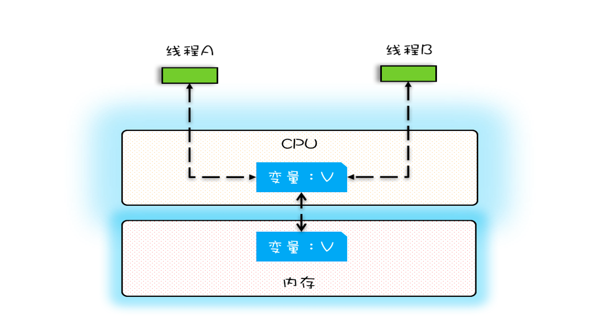
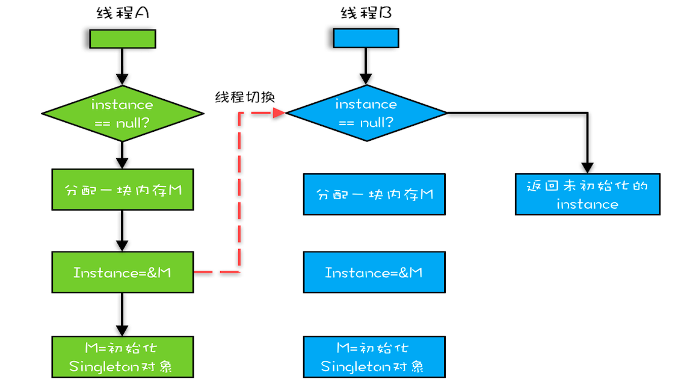

# JMM（Java Memory Model）

## 物理计算机中的并发问题

在了解JMM知识之前，先介绍下物理计算机中的并发问题。

### 硬件的处理效率与缓存一致性

*   绝大多数的运算任务都不可能只靠处理器“计算”就能完成，处理器至少需要与**内存交互**，如读取运算数据、存储运算结果，这个 I/O 操作是很难消除的（无法仅靠[寄存器](../../计算机组成原理/寄存器/寄存器.md "寄存器")完成所有运算任务）。

*   **由于计算机的存储设备与处理器的运算速度有几个数量级的差距** ，这种速度上的矛盾，会降低硬件的处理效率。所以，现代计算机都不得不 **加入高速缓存（Cache） 来作为内存和处理器之间的缓冲**。将需要用到的数据复制到缓存中，让运算能快速进行，当运算结束后再从缓存同步会内存中，这样处理器就无需等待缓慢的内存读写了。

高速缓存解决了 **硬件效率问题**，但是引入了一个新的问题：**缓存一致性（Cache Coherence）**。

在多处理器系统中，每个处理器都有自己的高速缓存，而它们又共享同一主内存。当多个处理器的运算任务都涉及同一块主内存区域时，将可能导致各自的缓存数据不一致。为了解决缓存一致性问题，**需要各个处理器访问缓存时都遵循一些协议，在读写时要根据协议来进行操作**。



这些协议包括&#x20;

*   MSI

*   MESI[缓存一致性协议-MESI](../../标准和协议/缓存一致性协议-MESI/缓存一致性协议-MESI.md "缓存一致性协议-MESI")

*   MOSI

*   Synapse

*   Firefly

*   Dragon Protocol

现在通用的协议是MESI（最早由Intel开始支持），具体参考 :[http://en.wikipedia.org/wiki/MESI\_protocol](http://en.wikipedia.org/wiki/MESI_protocol "http://en.wikipedia.org/wiki/MESI_protocol")

## 内存模型

这个概念。我们可以理解为：**在特定的操作协议下，对特定的内存或高速缓存进行读写访问的过程抽象**。不同架构的物理计算机可以有不一样的内存模型，JVM 也有自己的内存模型。

Java虚拟机规范中定义了Java内存模型（Java Memory Model，JMM），用于屏蔽掉各种硬件和操作系统的内存访问差异，以实现让Java程序在各种平台下都能达到一致的并发效果，**JMM规范了Java虚拟机与计算机内存是如何协同工作的：规定了一个线程如何和何时可以看到由其他线程修改过后的共享变量的值，以及在必须时如何同步的访问共享变量**。 **具体来说，这些方法包括 volatile、synchronized 和 final 三个关键字，以及 Happens-Before 规则**

### 主内存和工作内存

JMM 的主要目标是 **定义程序中各个变量的访问规则，即在虚拟机中将变量存储到内存和从内存中取出变量这样的底层细节**。此处的变量（Variables）与 Java 编程中所说的变量有所区别，它包括了实例字段、静态字段和构成数值对象的元素，但不包括局部变量与方法参数，因为后者是线程私有的，不会被共享，自然就不会存在竞争问题。为了获得较好的执行效能，JMM 并没有限制执行引擎使用处理器的特定寄存器或缓存来和主存进行交互，也没有限制即使编译器进行调整代码执行顺序这类优化措施。

`JMM`  规定了**所有的变量都存储在主内存（Main Memory）中**。

每条线程还有自己的工作内存（Working Memory），**工作内存中保留了该线程使用到的变量的主内存的副本**。工作内存是 JMM 的一个抽象概念，并不真实存在，它涵盖了缓存，写缓冲区，寄存器以及其他的硬件和编译器优化。



线程对变量的所有操作都必须在工作内存中进行，而不能直接读写主内存中的变量。不同的线程间也无法直接访问对方工作内存中的变量，**线程间变量值的传递均需要通过主内存来完成**。



### JMM 内存操作的问题

**类似于物理内存模型面临的问题** JMM 存在以下两个问题：

*   **工作内存数据一致性** - 各个线程操作数据时会保存使用到的主内存中的共享变量副本，当多个线程的运算任务都涉及同一个共享变量时，将导致各自的的共享变量副本不一致。如果真的发生这种情况，数据同步回主内存以谁的副本数据为准？ Java 内存模型主要通过一系列的数据同步协议、规则来保证数据的一致性。

*   **指令重排序优化** - Java 中重排序通常是编译器或运行时环境为了优化程序性能而采取的对指令进行重新排序执行的一种手段。重排序分为两类：**编译期重排序和运行期重排序**，分别对应编译时和运行时环境。 同样的，指令重排序不是随意重排序，它需要满足以下两个条件：

    *   在单线程环境下不能改变程序运行的结果。即时编译器（和处理器）需要保证程序能够遵守 `as-if-serial` 属性。通俗地说，就是在单线程情况下，要给程序一个顺序执行的假象。即经过重排序的执行结果要与顺序执行的结果保持一致。

    *   存在数据依赖关系的不允许重排序。

    *   多线程环境下，如果线程处理逻辑之间存在依赖关系，有可能因为指令重排序导致运行结果与预期不同

**为了解决这些问题，**

JMM 定义了 8 个操作来完成主内存和工作内存之间的交互操作。JVM 实现时必须保证下面介绍的每种操作都是 **原子的**（对于 double 和 long 型的变量来说，load、store、read、和 write 操作在某些平台上允许有例外 ）。

*   `lock` (锁定) - 作用于**主内存**的变量，它把一个变量标识为一条线程独占的状态。

*   `unlock` (解锁) - 作用于**主内存**的变量，它把一个处于锁定状态的变量释放出来，释放后的变量才可以被其他线程锁定。

*   `read` (读取) - 作用于**主内存**的变量，它把一个变量的值从主内存**传输**到线程的工作内存中，以便随后的 `load` 动作使用。

*   `write` (写入) - 作用于**主内存**的变量，它把 store 操作从工作内存中得到的变量的值放入主内存的变量中。

*   `load` (载入) - 作用于**工作内存**的变量，它把 read 操作从主内存中得到的变量值放入工作内存的变量副本中。

*   `use` (使用) - 作用于**工作内存**的变量，它把工作内存中一个变量的值传递给执行引擎，每当虚拟机遇到一个需要使用到变量的值得字节码指令时就会执行这个操作。

*   `assign` (赋值) - 作用于**工作内存**的变量，它把一个从执行引擎接收到的值赋给工作内存的变量，每当虚拟机遇到一个给变量赋值的字节码指令时执行这个操作。

*   `store` (存储) - 作用于**工作内存**的变量，它把工作内存中一个变量的值传送到主内存中，以便随后 `write` 操作使用。

如果要把一个变量从主内存中复制到工作内存，就需要按序执行 `read` 和 `load` 操作；如果把变量从工作内存中同步回主内存中，就需要按序执行 `store` 和 `write` 操作。但 Java 内存模型只要求上述操作必须按顺序执行，而没有保证必须是连续执行。

JMM 还规定了上述 8 种基本操作，需要满足以下规则：

*   **read 和 load 必须成对出现**；**store 和 write 必须成对出现**。即不允许一个变量从主内存读取了但工作内存不接受，或从工作内存发起回写了但主内存不接受的情况出现。

*   **不允许一个线程丢弃它的最近 assign 的操作**，即变量在工作内存中改变了之后必须把变化同步到主内存中。

*   **不允许一个线程无原因的（没有发生过任何 assign 操作）把数据从工作内存同步回主内存中**。

*   一个新的变量只能在主内存中诞生，不允许在工作内存中直接使用一个未被初始化（load 或 assign ）的变量。换句话说，就是对一个变量实施 use 和 store 操作之前，必须先执行过了 load 或 assign 操作。

*   一个变量在同一个时刻只允许一条线程对其进行 lock 操作，但 lock 操作可以被同一条线程重复执行多次，多次执行 lock 后，只有执行相同次数的 unlock 操作，变量才会被解锁。所以 **lock 和 unlock 必须成对出现**。

*   如果对一个变量执行 lock 操作，将会清空工作内存中此变量的值，在执行引擎使用这个变量前，需要重新执行 load 或 assign 操作初始化变量的值。

*   如果一个变量事先没有被 lock 操作锁定，则不允许对它执行 unlock 操作，也不允许去 unlock 一个被其他线程锁定的变量。

*   对一个变量执行 unlock 操作之前，必须先把此变量同步到主内存中（执行 store 和 write 操作）



## 并发编程的三个特征

并发安全需要保证几个基本特性：

*   **可见性** - 可见性是指当多个线程访问同一个变量时，一个线程修改了这个变量的值，其他线程能够立即看得到修改的值

*   [**原子性**](https://docs.oracle.com/javase/tutorial/essential/concurrency/atomic.html "原子性") - 即一个操作或者多个操作，要么全部执行并且执行的过程不会被任何因素打断，要么就都不执行。

*   **有序性** - 即程序执行的顺序按照代码的先后顺序执行。

满足这三个特征，是对并发编程安全上的要求。换句话说，满足这些特征才能保证并发安全。

而这三大特性，归根结底，是为了实现多线程的 **数据一致性**，使得程序在多线程并发，指令重排序优化的环境中能如预期运行。

那java 是如何保证这三个特性的呢？

### 原子性

**原子性问题是怎么来的？（线程切换带来的原子性问题）**

由于 IO 太慢，早期的操作系统就发明了多进程，操作系统允许某个进程执行一小段时间（称为 **时间片**）。

在一个时间片内，如果一个进程进行一个 IO 操作，例如读个文件，这个时候该进程可以把自己标记为“休眠状态”并出让 CPU 的使用权，待文件读进内存，操作系统会把这个休眠的进程唤醒，唤醒后的进程就有机会重新获得 CPU 的使用权了。

这里的进程在等待 IO 时之所以会释放 CPU 使用权，是为了让 CPU 在这段等待时间里可以做别的事情，这样一来 CPU 的使用率就上来了；此外，如果这时有另外一个进程也读文件，读文件的操作就会排队，磁盘驱动在完成一个进程的读操作后，发现有排队的任务，就会立即启动下一个读操作，这样 IO 的使用率也上来了。

早期的操作系统基于进程来调度 CPU，不同进程间是不共享内存空间的，所以进程要做任务切换就要切换内存映射地址，而一个进程创建的所有线程，都是共享一个内存空间的，所以线程做任务切换成本就很低了。现代的操作系统都基于更轻量的线程来调度，现在我们提到的“任务切换”都是指“线程切换”。

Java 并发程序都是基于多线程的，自然也会涉及到任务切换，也许你想不到，任务切换竟然也是并发编程里诡异 Bug 的源头之一。任务切换的时机大多数是在时间片结束的时候，我们现在基本都使用高级语言编程，高级语言里一条语句往往需要多条 CPU 指令完成，例如代码 `count += 1`，至少需要三条 CPU 指令。

*   指令 1：首先，需要把变量 count 从内存加载到 CPU 的寄存器；

*   指令 2：之后，在寄存器中执行 +1 操作；

*   指令 3：最后，将结果写入内存（缓存机制导致可能写入的是 CPU 缓存而不是内存）。

操作系统做任务切换，可以发生在任何一条**CPU 指令**执行完，是的，是 CPU 指令，而不是高级语言里的一条语句。对于上面的三条指令来说，我们假设 count=0，如果线程 A 在指令 1 执行完后做线程切换，线程 A 和线程 B 按照下图的序列执行，那么我们会发现两个线程都执行了 count+=1 的操作，但是得到的结果不是我们期望的 2，而是 1。



**java如何保证原子性？**

在多线程环境下，Java对基本数据类型的简单读写都是原子的，而简单读写就是赋值和return语句

在32位的JDK环境下，对64位数据的读取不是原子性操作，如long、double

**要想在多线程环境下保证原子性，则可以通过锁、synchronized来确保。volatile是无法保证****复合操作****的原子性。**

### 可见性

**缓存导致的可见性问题**

在单核时代，所有的线程都是在一颗 CPU 上执行，CPU 缓存与内存的数据一致性容易解决。因为所有线程都是操作同一个 CPU 的缓存，一个线程对缓存的写，对另外一个线程来说一定是可见的。例如在下面的图中，线程 A 和线程 B 都是操作同一个 CPU 里面的缓存，所以线程 A 更新了变量 V 的值，那么线程 B 之后再访问变量 V，得到的一定是 V 的最新值（线程 A 写过的值）。



多核时代，每颗 CPU 都有自己的缓存，这时 CPU 缓存与内存的数据一致性就没那么容易解决了，当多个线程在不同的 CPU 上执行时，这些线程操作的是不同的 CPU 缓存。比如下图中，线程 A 操作的是 CPU-1 上的缓存，而线程 B 操作的是 CPU-2 上的缓存，很明显，这个时候线程 A 对变量 V 的操作对于线程 B 而言就不具备可见性了。


**可见性是指当多个线程访问同一个变量时，一个线程修改了这个变量的值，其他线程能够立即看得到修改的值**。

JMM 是通过 **"变量修改后将新值同步回主内存**， **变量读取前从主内存刷新变量值"** 这种依赖主内存作为传递媒介的方式来实现的。

Java 实现多线程可见性的方式有：

*   `volatile`

*   `synchronized`

*   `final`&#x20;

&#x20;final 关键字的可见性是指：被 final 修饰的字段在声明时或者构造器中，一旦初始化完成，那么在其他线程无须同步就能正确看见 final 字段的值。这是因为一旦初始化完成，final 变量的值立刻回写到主内存。更多细节参考：[语法](../语法/语法.md "语法")&#x20;

### 有序性

**编译优化带来的有序性问题**

编译器调整了语句的顺序，但是不影响程序的最终结果。不过有时候编译器及解释器的优化可能导致意想不到的 Bug，比如下面这段程序：

```java
public class Singleton {
  static Singleton instance;
  static Singleton getInstance(){
    if (instance == null) {
      synchronized(Singleton.class) {
        if (instance == null)
          instance = new Singleton();
        }
    }
    return instance;
  }
} 
```

我们以为的 new 操作应该是：

1.  分配一块内存 M

2.  在内存 M 上初始化 Singleton 对象

3.  然后 M 的地址赋值给 instance 变量

但是实际上优化后的执行路径却是这样的：

1.  分配一块内存 M

2.  将 M 的地址赋值给 instance 变量

3.  最后在内存 M 上初始化 Singleton 对象

我们假设线程 A 先执行 getInstance() 方法，当执行完指令 2 时恰好发生了线程切换，切换到了线程 B 上；如果此时线程 B 也执行 getInstance() 方法，那么线程 B 在执行第一个判断时会发现 `instance != null` ，所以直接返回 instance，而此时的 instance 是没有初始化过的，如果我们这个时候访问 instance 的成员变量就可能触发空指针异常。



有序性规则表现在以下两种场景: 线程内和线程间

*   线程内 - 从某个线程的角度看方法的执行，指令会按照一种叫“串行”（`as-if-serial`）的方式执行，此种方式已经应用于顺序编程语言。

*   线程间 - 这个线程“观察”到其他线程并发地执行非同步的代码时，由于指令重排序优化，任何代码都有可能交叉执行。唯一起作用的约束是：对于同步方法，同步块（`synchronized` 关键字修饰）以及 `volatile` 字段的操作仍维持相对有序。

在 Java 中，可以使用 `synchronized` 和 `volatile` 来保证多线程之间操作的有序性。实现方式有所区别：

*   `volatile` 关键字会禁止指令重排序。

*   `synchronized` 关键字通过互斥保证同一时刻只允许一条线程操作

如果`JMM` 中所有的有序性都仅仅靠 `volatile` 和 `synchronized` 来完成，那么有一些操作会变得很繁琐，但是我们在编写java 并发代码时并没有感觉到这一点，这是因为 java 语言中有一个 “先行发生”（`happens-before`） 的原则 。这个原则非常重要，它是判断数据是否存在竞争、线程是否安全的主要依据，依靠这个原则，**我们可以通过几条规则一揽子地解决并发环境下两个操作之间是否可能存在冲突的问题。**

**Happens-Before** 是指 **前面一个操作的结果对后续操作是可见的**。

*   **程序次序规则** ：一个线程内，按照代码顺序，书写在前面的操作先行发生于书写在后面的操作。

*   **锁定规则** ： 一个 `unLock` 操作先行发生于后面对同一个锁的 `lock` 操作。

*   **volatile 变量规则** ：对一个 `volatile` 变量的写操作先行发生于后面对这个变量的读操作。

*   **线程启动规则** ： `Thread` 对象的 `start()` 方法先行发生于此线程的每个一个动作。

*   **线程终止规则** ：线程中所有的操作都先行发生于线程的终止检测，我们可以通过 `Thread.join()` 方法结束、`Thread.isAlive()` 的返回值手段检测到线程已经终止执行。

*   **线程中断规则** ：对线程 `interrupt()` 方法的调用先行发生于被中断线程的代码检测到中断事件的发生，可以通过 `Thread.interrupted()` 方法检测到是否有中断发生。

*   **对象终结规则** ：一个对象的初始化完成先行发生于它的 `finalize()` 方法的开始。

*   **传递性** ： 如果操作 A 先行发生于 操作 B，而操作 B 又 先行发生于 操作 C，则可以得出操作 A 先行发生于 操作 C

## 内存屏障

**Java 中如何保证底层操作的有序性和可见性？可以通过内存屏障（memory barrier）**

内存屏障是被插入两个 CPU 指令之间的一种指令，用来禁止处理器指令发生重排序（像屏障一样），从而保障**有序性**的。另外，为了达到屏障的效果，它也会使处理器写入、读取值之前，将主内存的值写入高速缓存，清空无效队列，从而保障**可见性**。

举个例子：

```text
Store1;

Store2;

Load1;

StoreLoad;  //内存屏障

Store3;

Load2;

Load3; 
```

对于上面的一组 CPU 指令（Store 表示写入指令，Load 表示读取指令），StoreLoad 屏障之前的 Store 指令无法与 StoreLoad 屏障之后的 Load 指令进行交换位置，即**重排序**。但是 StoreLoad 屏障之前和之后的指令是可以互换位置的，即 Store1 可以和 Store2 互换，Load2 可以和 Load3 互换。

常见有 4 种屏障

*   `LoadLoad` 屏障 - 对于这样的语句 `Load1; LoadLoad; Load2`，在 Load2 及后续读取操作要读取的数据被访问前，保证 Load1 要读取的数据被读取完毕。

*   `StoreStore` 屏障 - 对于这样的语句 `Store1; StoreStore; Store2`，在 Store2 及后续写入操作执行前，保证 Store1 的写入操作对其它处理器可见。

*   `LoadStore` 屏障 - 对于这样的语句 `Load1; LoadStore; Store2`，在 Store2 及后续写入操作被执行前，保证 Load1 要读取的数据被读取完毕。

*   `StoreLoad` 屏障 - 对于这样的语句 `Store1; StoreLoad; Load2`，在 Load2 及后续所有读取操作执行前，保证 Store1 的写入对所有处理器可见。它的开销是四种屏障中最大的（冲刷写缓冲器，清空无效化队列）。在大多数处理器的实现中，这个屏障是个万能屏障，兼具其它三种内存屏障的功能。

Java 中对内存屏障的使用在一般的代码中不太容易见到，常见的有 `volatile` 和 `synchronized` 关键字修饰的代码块，还可以通过 `Unsafe` 这个类来使用内存屏障。

## 参考&#x20;

*   [https://dunwu.github.io/javacore/concurrent/Java内存模型.html](https://dunwu.github.io/javacore/concurrent/Java内存模型.html "https://dunwu.github.io/javacore/concurrent/Java内存模型.html")
