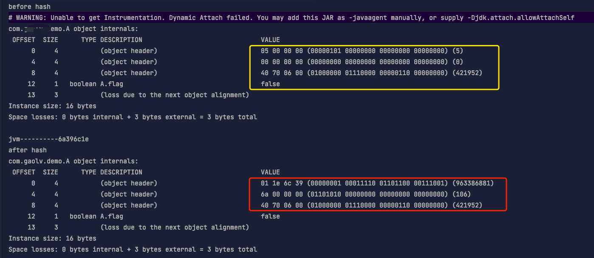
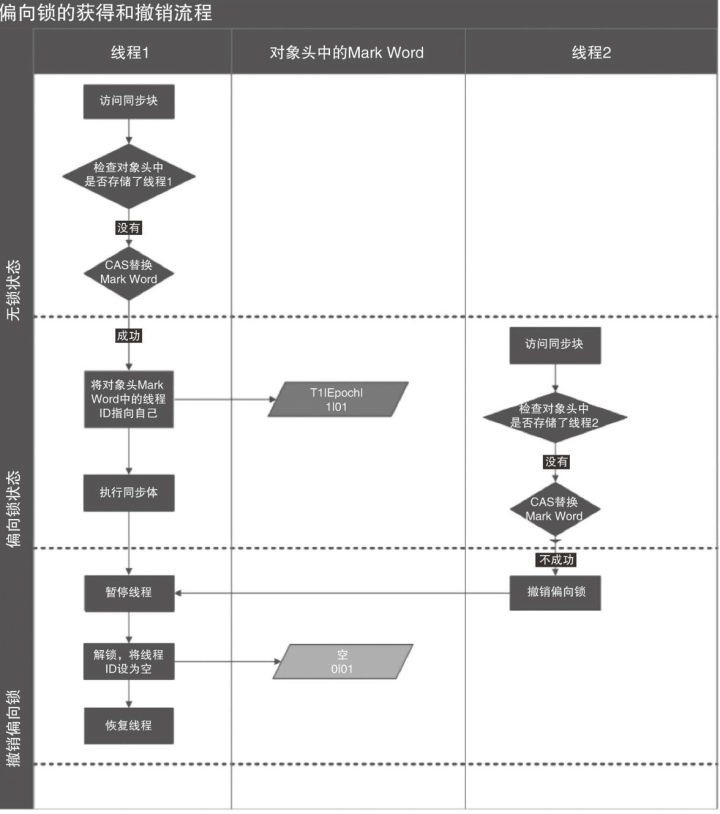
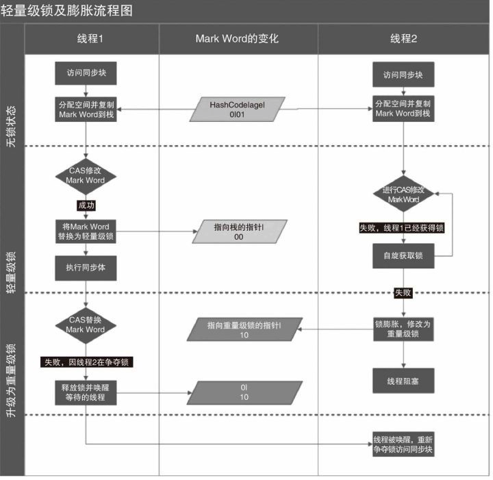
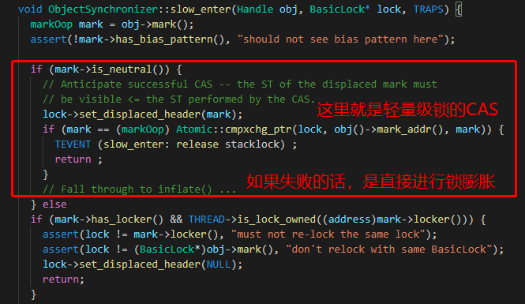
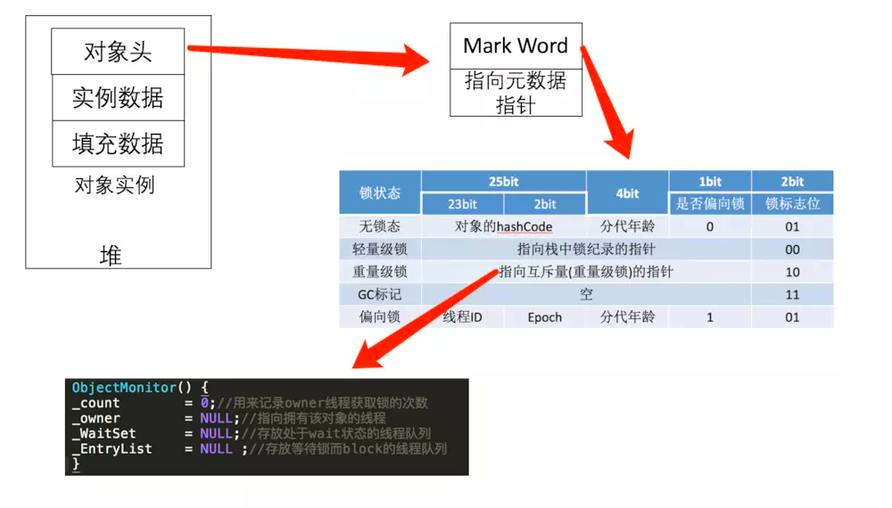
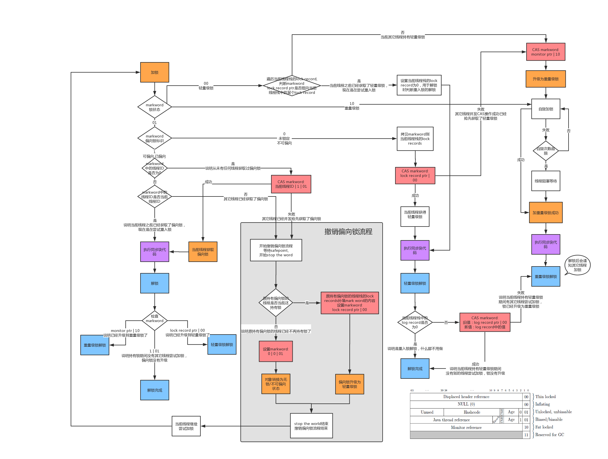

# JAVA 中的锁

## 偏向锁

#### 作用

偏向锁是为了消除无竞争情况下的同步原语，进一步提升程序性能。其目标就是在只有一个线程执行同步代码块时能够提高性能。

#### 与轻量级锁的区别

轻量级锁是在无竞争的情况下使用`CAS`操作来代替互斥量的使用， 从而实现同步；而偏向锁是在无竞争的情况下完全取消同步。

#### 与轻量级锁的相同点

它们都是乐观锁，都认为同步期间不会有其他线程竞争锁。

#### 撤消

偏向锁的撤销，需要等待全局安全点（在这个时间点上没有字节码正在执行），它会首先暂停拥有偏向锁的线程，判断锁对象是否处于被锁定状态。撤销偏向锁后恢复到无锁（标志位为“01”）或轻量级锁（标志位为“00”）的状态。

#### 偏向锁的延迟

虚拟机在启动的时候对于偏向锁有延迟。为什么要延迟呢？

JVM刚启动的时候，一定是有很多的线程在运行，操作系统也是知道的，所以明明知道有高并发的场景，所以就延迟了4s。

#### 原理

当线程请求到锁对象后， 将锁对象的状态标志位改为01， 即偏向模式。然后使用`CAS`操作将线程的ID记录在锁对象的Mark Word中。

以后该线程可以直接进入同步块， 连`CAS`操作都不需要。但是，一旦有第二条线程需要竞争锁，那么偏向模式立即结束，进入轻量级锁的状态。

#### 优点

偏向锁可以提高有同步但没有竞争的程序性能。但是如果锁对象时常被多条线程竟争，那偏向锁就是多余的。

#### 匿名偏向

刚刚new完这个对象还没有任何线程持有这把锁，那它偏向谁呢，这种的谁也不偏向，叫做匿名偏向。

我们刚刚new出来的对象，如果偏向锁启动是匿名偏向，没有启动就是普通对象。

```java
public class A {

    //占一个字节的boolean字段
    private boolean flag;

    public static void main(String[] args) throws InterruptedException {

        //延迟5s
        // TimeUnit.SECONDS.sleep(5);

        A a = new A();

        out.println("before hash");
        out.println(ClassLayout.parseInstance(a).toPrintable());

        //jvm计算HashCode
        out.println("jvm----------" + Integer.toHexString(a.hashCode()));

        //当计算完HashCode之后，我们可以查看对象头的信息变化
        out.println("after hash");
        out.println(ClassLayout.parseInstance(a).toPrintable());
    }
} 
```



&#x20;

这里要联系对象头一起理解 [对象头（mark word）](<../对象头（mark word）/对象头（mark word）.md> "对象头（mark word）")

#### JVM 参数

```text
-XX:BiasedLockingBulkRebiasThreshold = 20   // 默认偏向锁批量重偏向阈值
-XX:BiasedLockingBulkRevokeThreshold = 40   // 默认偏向锁批量撤销阈值
-XX:+UseBiasedLocking // 使用偏向锁，jdk6之后默认开启
-XX:BiasedLockingStartupDelay = 0 // 延迟偏向时间, 默认不为0，意思为jvm启动多少ms以后开启偏向锁机制（此处设为0，不延迟）

```

> *偏向锁可以通过虚拟机的参数来控制它是否开启。*

#### 批量重偏向与批量撤消

**渊源**  从偏向锁的加锁解锁过程中可看出，当只有一个线程反复进入同步块时，偏向锁带来的性能开销基本可以忽略，但是当有其他线程尝试获得锁时，就需要等到safe point时，再将偏向锁撤销为无锁状态或升级为轻量级，会消耗一定的性能，所以在多线程竞争频繁的情况下，偏向锁不仅不能提高性能，还会导致性能下降。于是，就有了批量重偏向与批量撤销的机制。

**原理**：以class为单位，为每个class维护一个偏向锁撤销计数器，每一次该class的对象发生偏向撤销操作时，该计数器+1，当这个值达到重偏向阈值（默认20）时，JVM就认为该class的偏向锁有问题，因此会进行批量重偏向。

每个class对象会有一个对应的**epoch**字段(**可以理解为是第几代偏向锁**)，每个处于偏向锁状态对象的Mark Word中也有该字段，其初始值为创建该对象时class中的epoch的值。每次发生批量重偏向时，就将该值+1，同时遍历JVM中所有线程的栈，找到该class所有正处于加锁状态的偏向锁，将其epoch字段改为新值。下次获得锁时，发现当前对象的epoch值和class的epoch不相等，那就算当前已经偏向了其他线程，也不会执行撤销操作，而是直接通过CAS操作将其Mark Word的Thread Id 改成当前线程Id。当达到重偏向阈值后 ，假设该class计数器继续增长，当其达到批量撤销的阈值后（默认40），JVM就认为该class的使用场景存在多线程竞争，会标记该class为不可偏向，之后，对于该class的锁，直接走轻量级锁的逻辑。

**解决场景**：批量重偏向（bulk rebias）机制是为了解决：一个线程创建了大量对象并执行了初始的同步操作，后来另一个线程也来将这些对象作为锁对象进行操作，这样会导致大量的偏向锁撤销操作。批量撤销（bulk revoke）机制是为了解决：在明显多线程竞争剧烈的场景下使用偏向锁是不合适的。

具体例子可以参考：[https://www.cnblogs.com/LemonFive/p/11248248.html](https://www.cnblogs.com/LemonFive/p/11248248.html "https://www.cnblogs.com/LemonFive/p/11248248.html")

#### 流程



## 轻量级锁

`轻量级锁` 是相对于`重量级锁` 而言的，而重量级锁就是传统的锁。

### 本质

使用CAS取代互斥同步。

### 轻量级锁与重量级锁的比较：&#xA;

重量级锁是一种悲观锁，它认为总是有多条线程要竞争锁，所以它每次处理共享数据时，不管当前系统中是否真的有线程在竞争锁，它都会使用互斥同步来保证线程的安全；

而轻量级锁是一种乐观锁，它认为锁存在竞争的概率比较小，所以它不使用互斥同步，而是使用CAS操作来获得锁， 这样能减少互斥同步所使用的『互斥量』带来的性能开销。

### 实现原理

当线程请求锁时， 若该锁对象的Mark Word中标志位为01(未锁定状态) ， 则在该线程的栈帧中创建一块名为`锁记录` 的空间， 然后将锁对象的Mark Word拷贝至该空间；最后通过CAS操作将锁对象的Mark Word指向该锁记录；

若CAS操作成功， 则轻量级锁的上锁过程成功；·若CAS操作失败， 再判断当前线程是否已经持有了该轻量级锁； 若已经持有， 则直接进入同步块；若尚未持有，则表示该锁已经被其他线程占用，此时轻量级锁就要膨胀成重量级锁。

### 前提

轻量级锁比重量级锁性能更高的前提是，在轻量级锁被占用的整个同步周期内，不存在其他线程的竞争。若在该过程中一旦有其他线程竞争，那么就会膨胀成重量级锁，从而除了使用互斥量以外， 还额外发生了CAS操作， 因此更慢!

### 流程



注意：轻量级锁没有自旋这个动作（至少 1.8 源码是这样的），从源码来看**轻量级锁 CAS 失败并不会自旋而是直接膨胀成重量级锁**。



这段代码在 synchronizer.cpp 中

### 有偏向锁为什么还要用轻量级锁呢？

**轻量级锁设计之初是为了应对线程之间交替获取锁的场景，而偏向锁的场景则是用于一个线程不断获取锁的场景**。

通过源码我们可以看出当一个线程获取偏向锁后，这个锁就会永久偏向这个线程，因为一旦发生偏向锁撤销，就代表锁要升级成为轻量级锁。虽然偏向锁在加锁时会进行一次cas操作，但是后续的获取只会进行简单的判断，不会再进行cas操作。但是轻量级锁的加锁和释放都需要进行cas操作。

我们看下如果把轻量级锁使用在偏向锁的场景下对比：


我们可以看到轻量级锁情况下每次获取都需要进行加锁和释放，每次加锁和释放都会进行cas操作，所以单个线程获取锁的情况使用偏向锁效率更高。

在看下如果把偏向锁使用在轻量级锁的场景下对比：


## 重量级锁

升级为重量级锁时，锁标志的状态值变为“10”，此时Mark Word中存储的是指向重量级锁的指针，此时等待锁的线程都会进入阻塞状态。

**java对象与monitor的关联图**



## 锁升级

整体的锁状态升级流程如下：




## 锁粗化和锁消除

*   锁粗化就是将多个连续的加锁、解锁操作连接在一起，扩展成一个范围更大的锁，避免频繁的加锁解锁操作。

*   Java虚拟机在JIT编译时(可以简单理解为当某段代码即将第一次被执行时进行编译，又称即时编译)，通过对运行上下文的扫描，经过逃逸分析，去除不可能存在共享资源竞争的锁，通过这种方式消除没有必要的锁，可以节省毫无意义的请求锁时间

## 总结

偏向锁通过对比Mark Word解决加锁问题，避免执行CAS操作。而轻量级锁是通过用CAS操作和自旋来解决加锁问题，避免线程阻塞和唤醒而影响性能。重量级锁是将除了拥有锁的线程以外的线程都阻塞。

## 参考：

*   [https://www.cnblogs.com/LemonFive/p/11248248.html](https://www.cnblogs.com/LemonFive/p/11248248.html "https://www.cnblogs.com/LemonFive/p/11248248.html")

*   [https://www.zhihu.com/question/55075763](https://www.zhihu.com/question/55075763 "https://www.zhihu.com/question/55075763")

*   [https://www.heapdump.cn/article/2966044](https://www.heapdump.cn/article/2966044 "https://www.heapdump.cn/article/2966044")

*   [https://tech.meituan.com/2018/11/15/java-lock.html](https://tech.meituan.com/2018/11/15/java-lock.html "https://tech.meituan.com/2018/11/15/java-lock.html")

*   [https://www.cnblogs.com/yescode/p/14474104.html](https://www.cnblogs.com/yescode/p/14474104.html "https://www.cnblogs.com/yescode/p/14474104.html")
