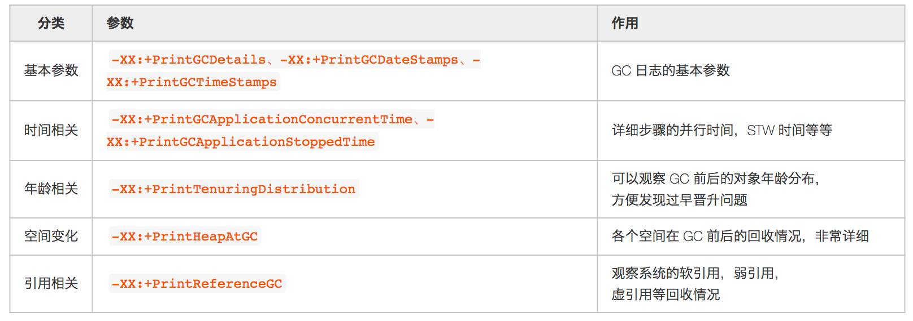

# JVM 调优

### GC 参数

&#x20;如果堆、栈确实无法第一时间保留，一定要保留 GC 日志，这样我们最起码可以看到 GC Cause，有一个大概的排查方向。可以提高我们分析问题的效率。



### 如何理解 gc 日志&#x20;

*   [https://yaoyinglong.github.io/Blog/Java/VM/理解GC日志/](https://yaoyinglong.github.io/Blog/Java/VM/理解GC日志/ "https://yaoyinglong.github.io/Blog/Java/VM/理解GC日志/")

### 在gc 前后 dump  日志&#x20;

共有三个VM参数需要设置：

*   HeapDumpBeforeFullGC 实现在Full GC前dump。

*   HeapDumpAfterFullGC 实现在Full GC后dump。

*   HeapDumpPath               设置Dump保存的路径

比如 ：

```bash
java -Xms200m -Xmx200m -Xmn50m -XX:PermSize=30m -XX:+HeapDumpBeforeFullGC -XX:+HeapDumpAfterFullGC -XX:HeapDumpPath=e:\dump testgc.Main
```

[JVM调优之G1换CMS](JVM调优之G1换CMS/JVM调优之G1换CMS.md "JVM调优之G1换CMS")

[JVM 调优之 glibc 引发的内存泄露](JVM%20调优之%20glibc%20引发的内存泄露/JVM%20调优之%20glibc%20引发的内存泄露.md "JVM 调优之 glibc 引发的内存泄露")
