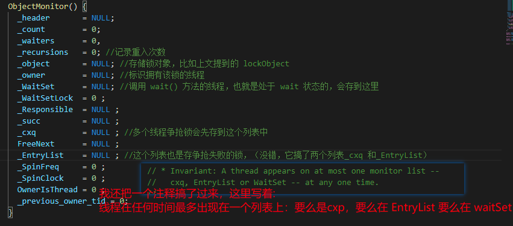
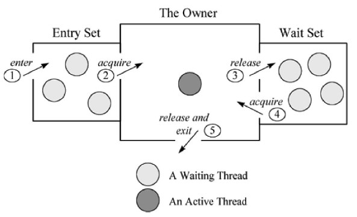
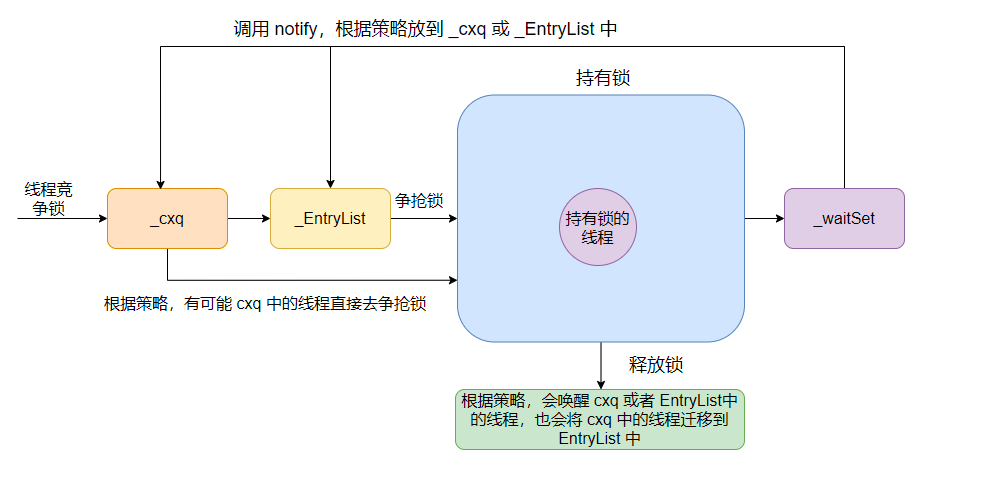

# moniter 监视器

每个对象都存在着一个 Monitor对象与之关联。执行 monitorenter 指令就是线程试图去获取 Monitor 的所有权，抢到了就是成功获取锁了；执行 monitorexit 指令则是释放了Monitor的所有权。

## ObjectMonitor类

monitor是用c++实现的叫objectmonitor。

java实例对象里面记录了指向这个monitor的地址，这个c++的monitor对象里面记录了当前持有这个锁的线程id。

在HotSpot虚拟机中，Monitor是基于C++的**ObjectMonitor类**实现的，其主要成员包括：

*   \_owner：指向持有ObjectMonitor对象的线程

*   \_WaitSet：存放处于wait状态的线程队列，即调用wait()方法的线程

*   \_EntryList：存放处于等待锁block状态的线程队列

*   \_count：约为\_WaitSet 和 \_EntryList 的节点数之和

*   \_cxq: 多个线程争抢锁，会先存入这个单向链表

*   \_recursions: 记录重入次数

```c++
ObjectMonitor() {
    _header       = NULL;
    _count        = 0;
    _waiters      = 0,
    _recursions   = 0;  // 线程重入次数
    _object       = NULL;  // 存储Monitor对象
    _owner        = NULL;  // 持有当前线程的owner
    _WaitSet      = NULL;  // wait状态的线程列表
    _WaitSetLock  = 0 ;
    _Responsible  = NULL ;
    _succ         = NULL ;
    _cxq          = NULL ;  // 单向列表
    FreeNext      = NULL ;
    _EntryList    = NULL ;  // 处于等待锁状态block状态的线程列表
    _SpinFreq     = 0 ;
    _SpinClock    = 0 ;
    OwnerIsThread = 0 ;
    _previous_owner_tid = 0;
  }
```



更多源码分析 ，可以参考 [这里](https://xiaomi-info.github.io/2020/03/24/synchronized/ "这里")。

### moniter对象是什么时候实例化的？

在Java对象实例化的时候，ObjectMonitor对象和Java对象一同创建和销毁。

## 协作

监视器Monitor有两种同步方式：互斥与协作。多线程环境下线程之间如果需要共享数据，需要解决互斥访问数据的问题，监视器可以确保监视器上的数据在同一时刻只会有一个线程在访问。

什么时候需要协作？ 比如：

> 一个线程向缓冲区写数据，另一个线程从缓冲区读数据，如果读线程发现缓冲区为空就会等待，当写线程向缓冲区写入数据，就会唤醒读线程，这里读线程和写线程就是一个合作关系。JVM通过Object类的`wait`方法来使自己等待，在调用`wait`方法后，该线程会释放它持有的监视器，直到其他线程通知它才有执行的机会。一个线程调用`notify`方法通知在等待的线程，这个等待的线程并不会马上执行，而是要通知线程释放监视器后，它重新获取监视器才有执行的机会。如果刚好唤醒的这个线程需要的监视器被其他线程抢占，那么这个线程会继续等待。Object类中的`notifyAll`方法可以解决这个问题，它可以唤醒所有等待的线程，总有一个线程执行。



如上图所示，一个线程通过1号门进入Entry Set(入口区)，如果在入口区没有线程等待，那么这个线程就会获取监视器成为监视器的Owner，然后执行监视区域的代码。如果在入口区中有其它线程在等待，那么新来的线程也会和这些线程一起等待。线程在持有监视器的过程中，有两个选择，一个是正常执行监视器区域的代码，释放监视器，通过5号门退出监视器；还有可能等待某个条件的出现，于是它会通过3号门到Wait Set（等待区）休息，直到相应的条件满足后再通过4号门进入重新获取监视器再执行。

注意：

> 当一个线程释放监视器时，在入口区和等待区的等待线程都会去竞争监视器，如果入口区的线程赢了，会从2号门进入；如果等待区的线程赢了会从4号门进入。只有通过3号门才能进入等待区，在等待区中的线程只有通过4号门才能退出等待区，也就是说一个线程只有在持有监视器时才能执行wait操作，处于等待的线程只有再次获得监视器才能退出等待状态。



*   在获取锁时，是将当前线程插入到cxq的头部。

*   在释放锁时默认策略（QMode=0）:如果EntryList为空，则将cxq中的元素按原有顺序插入到EntryList，并唤醒第一个线程，也就是当EntryList为空时，是后来的线程先获取锁。\_EntryList不为空，直接从\_EntryList中唤醒线程。

## 其他问题

#### notify执行之后立马唤醒线程吗?

其实hotspot里真正的实现是: 退出同步块的时候才会去真正唤醒对应的线程; 不过这个也是个默认策略，也可以改成在notify之后立马唤醒相关线程。

**notify()或者notifyAll()调用时并不会真正释放对象锁, 必须等到synchronized方法或者语法块执行完才真正释放锁.**

## 参考

*   [https://tech.youzan.com/javasuo-yu-xian-cheng-de-na-xie-shi/](https://tech.youzan.com/javasuo-yu-xian-cheng-de-na-xie-shi/ "https://tech.youzan.com/javasuo-yu-xian-cheng-de-na-xie-shi/")

*   [https://xiaomi-info.github.io/2020/03/24/synchronized/](https://xiaomi-info.github.io/2020/03/24/synchronized/ "https://xiaomi-info.github.io/2020/03/24/synchronized/")

*   [https://www.cnblogs.com/aspirant/p/11470858.html](https://www.cnblogs.com/aspirant/p/11470858.html "https://www.cnblogs.com/aspirant/p/11470858.html")

*   [https://www.cnblogs.com/zfcq/p/15811936.html](https://www.cnblogs.com/zfcq/p/15811936.html "https://www.cnblogs.com/zfcq/p/15811936.html")
