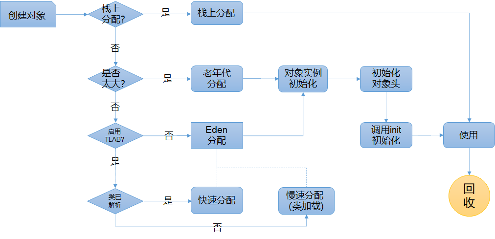

# 内存区域与对象创建

## 分配对象空间

### TLAB(Thread-local allocation buffer)

JVM在内存新生代Eden Space中开辟了一小块线程私有的区域，称作TLAB（Thread-local allocation buffer）。默认设定为占用Eden Space的1%。

*   对于单线程应用，每次分配内存，会记录上次分配对象内存地址末尾的指针，之后分配对象会从这个指针开始检索分配。这个机制叫做 `bump-the-pointer` （撞针）。

*   对于多线程应用来说，内存分配需要考虑线程安全。最直接的想法就是通过全局锁，但是这个性能会很差。为了优化这个性能，我们考虑可以每个线程分配一个线程本地私有的内存池，然后采用 `bump-the-pointer` 机制进行内存分配。这个线程本地私有的内存池，就是 TLAB

在Java程序中很多对象都是小对象且用过即丢，它们不存在线程共享也适合被快速GC，所以对于小对象通常JVM会优先分配在TLAB上，并且TLAB上的分配由于是线程私有所以没有锁开销。因此在实践中分配多个小对象的效率通常比分配一个大对象的效率要高。也就是说，Java中每个线程都会有自己的缓冲区称作TLAB（Thread-local allocation buffer），每个TLAB都只有一个线程可以操作，TLAB结合`bump-the-pointer`技术可以实现快速的对象分配，而不需要任何的锁进行同步，也就是说，**在对象分配的时候不用锁住整个堆，而只需要在自己的缓冲区分配即可**。

**TLAB生命周期：** 线程初始化的时候，如果 JVM 启用了 TLAB（默认是启用的， 可以通过`-XX:-UseTLAB` 关闭），则会创建并初始化 TLAB。同时，在 GC 扫描对象发生之后，线程第一次尝试分配对象的时候，也会创建并初始化 TLAB。在 TLAB 已经满了或者接近于满了的时候，TLAB 可能会被释放回 Eden。GC 扫描对象发生时，TLAB 会被释放回 Eden。TLAB 的生命周期期望只存在于一个 GC 扫描周期内。在 JVM 中，一个 GC 扫描周期，就是一个`epoch`。那么，可以知道，TLAB 内分配内存一定是线性分配的、

**TLAB 的最大大小**：不同的 GC 中不同，G1 GC 中为大对象（humongous object）大小，也就是 G1 region 大小的一半。因为开头提到过，在 G1 GC 中，大对象不能在 TLAB 分配，而是老年代。ZGC 中为页大小的 8 分之一

## 创建流程

## mark word

[对象头（mark word）](../对象头（mark%20word）/对象头（mark%20word）.md "对象头（mark word）")

## 一些经验

如果OOM之后发现DUMP文件很小，有可能是DirectMemory导致的内存溢出

## 参考

*   [https://juejin.cn/post/6921147623713800206](https://juejin.cn/post/6921147623713800206 "https://juejin.cn/post/6921147623713800206")

*   [https://www.infoq.cn/article/OpenJDK-HotSpot-What-the-JIT/](https://www.infoq.cn/article/OpenJDK-HotSpot-What-the-JIT/ "https://www.infoq.cn/article/OpenJDK-HotSpot-What-the-JIT/")

*   [https://tech.meituan.com/2020/11/12/java-9-cms-gc.html](https://tech.meituan.com/2020/11/12/java-9-cms-gc.html "https://tech.meituan.com/2020/11/12/java-9-cms-gc.html")
