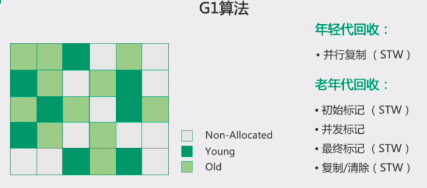

# JVM G1(Garbage First)垃圾收集器浅析

Garbage First（简称G1）收集器是垃圾收集器技术发展历史上的里程碑式的成果，它开创了收集器面向局部收集的设计思路和基于Region的内存布局形式。被Oracle官方称为“全功能的垃圾收集器”（Fully-Featured GarbageCollector）。JDK 9服务端模式下的**默认垃圾收集器**，而CMS则沦落至被声明为不推荐使用（Deprecate）的收集器。本文将对G1进行简单的介绍。

## 回顾G1之前的垃圾收集器(经典垃圾收集器)


上图展示了七种作用于不同分代的收集器，如果两个收集器之间存在连线，就说明它们可以搭配使用，图中收集器所处的区域，则表示它是属于新生代收集器抑或是老年代收集器。 &#x20;

对以上除G1外的收集器进行下简单介绍：

### Serial收集器

*   Serial 新生代收集器 单线程工作的收集器 使用**复制算法**

*   Serial Old是Serial收集器的老年代版本  单线程收集器，使用**标记-整理算法**


Serial/Serial Old收集器运行示意图 &#x20;

### ParNew 收集器

新生代收集器，就是Serial收集器的多线程版本。除了serial收集器外，**目前只有它能与CMS收集器配合工作**。


ParNew/Serial Old收集器运行示意图 &#x20;

### Parallel Scavenge收集器

*   新生代收集器，基于标记-复制算法（ 常被称复制算法）实现，也是能够并行收集的多线程收集器

*   自适应调节策略是Parallel Scavenge收集器与ParNew收集器的一个重要区别&#x20;

    \-XX:+UseAdaptiveSizePolicy是一个开关参数，当这个参数打开之后，就不需要手工指定新生代的大小（-Xmn）、Eden与Survivor区的比例（-XX:SurvivorRatio）、晋升老年代对象年龄（-XX:PretenureSizeThreshold）等细节参数了，虚拟机会根据当前系统的运行情况收集性能监控信息，动态调整这些参数以提供最合适的停顿时间或最大的吞吐量，这种调节方式称为GC自适应的调节策略（GC Ergonomics）。

*   更关注可控制的吞吐量 Throughput

    

    如果虚拟机完成某个任务，用户代码加上垃圾收集总共耗费了100分钟，其中垃圾收集花掉1分钟，那吞吐量就是99%

*   应用场景(高吞吐量为目标，即**减少垃圾收集时间**，让用户代码获得更长的运行时间)

    高吞吐量可以最高效率的利用CPU时间，尽快的完成程序的运算任务等，当应用程序运行在具有多个CPU上，对暂停时间没有特别高的要求时，即程序主要在后台进行计算，而不需要与用户进行太多交互；例如，那些执行批量处理、订单处理、工资支付、科学计算的应用程序（**停顿时间越短就越适合需要与用户交互或需要保证服务响应质量的程序，良好的响应速度能提升用户体验，此种场景CMS效果更好**）

### Parallel Old 收集器

Parallel Old是Parallel Scavenge收集器的老年代版本，支持多线程并发收集，基于标记-整理算法实现。 &#x20;


### CMS 收集器 &#x20;

JDK9 被标记弃用，JDK14 被删除，详情可见 [JEP 363](https://openjdk.java.net/jeps/363 "JEP 363")。

*   CMS（Concurrent Mark Sweep）收集器是一种以**获取最短回收停顿时间**为目标的收集器。 目前很大一部分的Java应用集中在互联网网站或者基于浏览器的B/S系统的服务端上，这类应用通常都会较为关注服务的响应速度，希望系统停顿时间尽可能短，以给用户带来良好的交互体验。CMS收集器就非常符合这类应用的需求。从名字（包含“Mark Sweep”）上就可以看出CMS收集器是基于标记-清除算法实现的，它的运作过程相对于前面几种收集器来说要更复杂一些，整个过程分为四个步骤，包括：

*   初始标记（CMS initial mark）

*   并发标记（CMS concurrent mark）

*   重新标记（CMS remark）

*   并发清除（CMS concurrent sweep）

**其中初始标记、重新标记这两个步骤仍然需要“Stop The World”**。初始标记仅仅只是标记一下GC Roots能直接关联到的对象，速度很快；并发标记阶段就是从GC Roots的直接关联对象开始遍历整个对象图的过程，这个过程耗时较长但是不需要停顿用户线程，可以与垃圾收集线程一起并发运行；而重新标记阶段则是为了修正并发标记期间，因用户程序继续运作而导致标记产生变动的那一部分对象的标记记录，这个阶段的停顿时间通常会比初始标记阶段稍长一些，但也远比并发标记阶段的时间短；最后是并发清除阶段，清理删除掉标记阶段判断的已经死亡的对象，由于不需要移动存活对象，所以这个阶段也是可以与用户线程同时并发的。


Concurrent Mark Sweep收集器运行示意图 &#x20;

*   CMS是老年代垃圾收集器，在收集过程中可以与用户线程并发操作。它可以与Serial收集器和Parallel New收集器搭配使用。CMS牺牲了系统的吞吐量来追求收集速度，适合追求垃圾收集速度的服务器上。

*   CMS是一款基于标记-清除算法实现的收集器，这意味着收集结束时会有大量空间碎片产生

*   在2019年12月，已经被最新的JDK移除了（[https://openjdk.java.net/jeps/363）](https://openjdk.java.net/jeps/363） "https://openjdk.java.net/jeps/363）")

    

## 初识G1

下面这个是G1的官方文档，想学习G1垃圾回收器的，看官方文档是最靠谱的 &#x20;

[https://docs.oracle.com/javase/9/gctuning/garbage-first-garbage-collector.htm#JSGCT-GUID-ED3AB6D3-FD9B-4447-9EDF-983ED2F7A573](https://docs.oracle.com/javase/9/gctuning/garbage-first-garbage-collector.htm#JSGCT-GUID-ED3AB6D3-FD9B-4447-9EDF-983ED2F7A573 "https://docs.oracle.com/javase/9/gctuning/garbage-first-garbage-collector.htm#JSGCT-GUID-ED3AB6D3-FD9B-4447-9EDF-983ED2F7A573")

2004年发布的那篇论文在这里：[http://citeseerx.ist.psu.edu/viewdoc/download?doi=10.1.1.63.6386\&rep=rep1\&type=pdf](http://citeseerx.ist.psu.edu/viewdoc/download?doi=10.1.1.63.6386\&rep=rep1\&type=pdf "http://citeseerx.ist.psu.edu/viewdoc/download?doi=10.1.1.63.6386\&rep=rep1\&type=pdf")


2017年，G1成为jdk9之后默认的垃圾收回器了


## 为什么需要G1？ &#x20;

Hotspot之前已经携带了Serial, Paralel, CMS等收集器，为什么还需要研发一个新的G1呢？垃圾收集的三个性能指标: footprint（内存占用）, max pause time（最大停顿时间）, throughput（吞吐量）似乎像CAP一样不能同时满足。在服务端更注重的是短停顿时间，也就是stop-the-world的时间，一段时间内的总停顿时间也是一个衡量指标。Mark-Sweep, Mark-Compact均需要和清理区域大小成比例的工作量，而Copying算法则需要一般是一半的空间用于存放每次copy的活对象。CMS的Initial Marking和Remarking两个STW阶段在Heap区越来越大的情况下需要的时间越长，并且由于内存碎片，需要压缩的话也会造成较长停顿时间。**所以需要一种高吞吐量的短暂停时间的收集器，而不管堆内存多大**（*现代的堆越来越大了，32G，64G的很平常*）。

而G1正是达成了这种目标的垃圾收集器，它在官方文档是这样描述的：

“Garbage-First（G1）垃圾收集器的目标是具有大量内存的多处理器计算机。 它尝试以极高的可能性满足垃圾收集暂停时间目标，同时几乎不需要配置即可实现高吞吐量。G1的目标是使用当前的目标应用程序和环境在延迟和吞吐量之间达到最佳平衡，其特点包括：

*   堆大小最大为 10 GB或更大，其中超过 50％ 的Java堆占用实时数据。

*   对象分配和升级的速率可能会随时间而显着变化。

*   堆中有大量碎片。

*   可预测的暂停时间目标不超过几百毫秒，避免了长时间的垃圾收集暂停。

G1取代了并发标记清除（CMS）收集器。 它也是默认的收集器。”

## 内存布局

传统的GC收集器将连续的内存空间划分为新生代、老年代和永久代（JDK 8去除了永久代，引入了元空间Metaspace）


*   如上图所示，G1将堆分成若干个等大的区域（region）。每个Region占有一块连续的虚拟内存地址.每个Region的大小可以通过参数-XX：G1HeapRegionSize设定，取值范围为1MB～32MB，且应为2的N次幂。默认将整堆划分为2048个分区。

*   新年代和老年代不再物理隔离，都是逻辑概念。在G1中有一种特殊的区域，叫**Humongous**区域。如果一个对象占用的空间超过了Region容量**50%以上，G1收集器就认为这是一个巨型对象。G1划分了一个**Humongous区，它用来专门存放巨型对象。如果一个H区装不下一个巨型对象，那么G1会寻找连续的H分区来存储。G1的大多数行为都把Humongous Region作为老年代的一部分来进行看待。

*   每一个Region都可以根据需要，扮演新生代的Eden空间、Survivor空间，或者老年代空间。收集器能够对扮演不同角色的Region采用不同的策略去处理，这样无论是新创建的对象还是已经存活了一段时间、熬过多次收集的旧对象都能获取很好的收集效果。 &#x20;

## 内部细节

G1收集器之所以能建立可预测的停顿时间模型，是因为它将Region作为单次回收的最小单元，即每次收集到的内存空间都是Region大小的整数倍，这样可以有计划地避免在整个Java堆中进行全区域的垃圾收集。更具体的处理思路是让G1收集器去跟踪各个Region里面的垃圾堆积的“价值”大小，价值即回收所获得的空间大小以及回收所需时间的经验值，然后在后台维护一个优先级列表，每次根据用户设定允许的收集停顿时间（使用参数-XX：MaxGCPauseMillis指定，默认值是200毫秒），优先处理回收价值收益最大的那些Region，这也就是“Garbage First”名字的由来。这种使用Region划分内存空间，以及具有优先级的区域回收方式，保证了G1收集器在有限的时间内获取尽可能高的收集效率。

但有一些问题需要解决，比如： &#x20;

**1  将Java堆分成多个独立Region后，Region里面存在的跨代或跨Region引用对象如何解决？**


这里我们引入几个概念

1.  Card Table ,Region内部的数据结构，每个 Region 有多个，每个大小为512字节的 card ，例如我们的一个Region是 1M，那么这个Region中应该有2000张卡。

2.  Remebered Set (RS)

    

    如上图所示，有3个Region,每个Region都有一个对应的Rset。蓝色竖条就是Card。

    RSet记录了其他Region中的对象引用本Region中对象的关系，属于points-into结构（**谁引用了我的对象**）。比如Region2的RSet中记录着Region1和Region3都引用了它的对象。

    而Card Table则是一种points-out（**我引用了谁的对象**）的结构，每个Card 覆盖一定范围的Heap（一般为512Bytes）。G1的RSet是在Card Table的基础上实现的：每个Region会记录下别的Region有指向自己的指针，并标记这些指针分别在哪些Card的范围内。这个RSet其实是一个Hash Table，Key是别的Region的起始地址，Value是一个集合，里面的元素是Card Table的Index。

    例如，当回收Region2的时候，发现Region2的RSet中有Region1和Region3的两个card在引用它。这时候只需要扫描那两张card里的对象就可以了。这是一种典型的空间换时间的方法，避免了整个堆的扫描，提高效率。你看这个名字，Remebered Set “**记住谁引用了我，以后我垃圾回收的时候，我好找它去** ！” 

3.  Cset &#x20;

    收集集合(CSet)代表每次GC暂停时回收的一系列目标分区。在任意一次收集暂停中，CSet所有分区都会被释放，内部存活的对象都会被转移到分配的空闲分区中。因此无论是年轻代收集，还是混合收集，工作的机制都是一致的。年轻代收集CSet只容纳年轻代分区，而混合收集会通过启发式算法，在老年代候选回收分区中，筛选出回收收益最高的分区添加到CSet中。

    

    一个card的内存中通常包含不止一个对象，只要卡页内有一个（或更多）对象的字段存在着跨代指针，那就将对应卡表的数组元素的值标识为1，称为这个元素变脏（Dirty），没有则标识为0。在垃圾收集发生时，只要筛选出卡表中变脏的元素，就能轻易得出哪些卡页内存块中包含跨代指针，把它们加入GC Roots中一并扫描。我们已经解决了如何使用`RemeberedSet`来缩减GC Roots扫描范围的问题，但还没有解决卡表元素如何维护的问题，例如它们何时变脏、谁来把它们变脏等。答案是:**Write barrier**

    我们首先介绍一下栅栏(Barrier)的概念。栅栏是指在原生代码片段中，当某些语句被执行时，栅栏代码也会被执行（**用过Spring AOP的秒懂**）。而G1主要在赋值语句中，使用写前栅栏(Pre-Write Barrrier)和写后栅栏(Post-Write Barrrier)。

    

    *   写前栅栏 Pre-Write Barrrier

        即将执行一段赋值语句时，等式左侧对象将修改引用到另一个对象，那么等式左侧对象原先引用的对象所在分区将因此丧失一个引用，那么JVM就需要在赋值语句生效之前，记录丧失引用的对象。JVM并不会立即维护RSet，而是通过批量处理，在将来RSet更新

    *   写后栅栏 Post-Write Barrrier

        当执行一段赋值语句后，等式右侧对象获取了左侧对象的引用，那么等式右侧对象所在分区的RSet也应该得到更新。同样为了降低开销，写后栅栏发生后，RSet也不会立即更新，同样只是记录此次更新日志，在将来批量处理。

**2  在并发标记阶段如何保证收集线程与用户线程互不干扰地运行？**


这里要解决的是用户线程改变对象引用关系时，必须保证其不能打破原本的对象图结构，导致标记结果出现错误。**G1收集器是通过原始快照（SATB）算法来实现的。**

**SATB全称是Snapshot-At-The-Beginning**，由字面理解，是GC开始时活着的对象的一个快照。它是通过Root Tracing得到的，作用是维持并发GC的正确性。那么它是怎么维持并发GC的正确性的呢？**根据三色标记算法**：

把遍历对象图过程中遇到的对象，按照“是否访问过”这个条件标记成以下三种颜色

*   白：对象没有被标记到，标记阶段结束后，会被当做垃圾回收掉。&#x20;

*   灰：对象被标记了，但是它的field还没有被标记或标记完。&#x20;

*   黑：对象被标记了，且它的所有field也被标记完了。

如果用户线程与收集器是并发工作，收集器在对象图上标记颜色，同时用户线程在修改引用关系——即修改对象图的结构，这样可能出现两种后果。一种是把原本消亡的对象错误标记为存活，这不是好事，但其实是可以容忍的，只不过产生了一点逃过本次收集的浮动垃圾而已，下次收集清理掉就好。另一种是把原本存活的对象错误标记为已消亡，这就是非常致命的后果了，程序肯定会因此发生错误，下面表演示了这样的致命错误具体是如何产生的。


Wilson于1994年在理论上证明了，当且仅当以下两个条件同时满足时，会产生“对象消失”的问题，即原本应该是黑色的对象被误标为白色：

*   赋值器插入了一条或多条从黑色对象到白色对象的新引用；

*   赋值器删除了全部从灰色对象到该白色对象的直接或间接引用。

因此，我们要解决并发扫描时的对象消失问题，只需破坏这两个条件的任意一个即可。由此分别产生了两种解决方案：增量更新（Incremental Update）和原始快照（Snapshot At TheBeginning，SATB）。

*   增量更新要破坏的是第一个条件，当黑色对象插入新的指向白色对象的引用关系时，就将这个新插入的引用记录下来，等并发扫描结束之后，再将这些记录过的引用关系中的黑色对象为根，重新扫描一次。这可以简化理解为，黑色对象一旦新插入了指向白色对象的引用之后，它就变回灰色对象了。

*   原始快照要破坏的是第二个条件，当灰色对象要删除指向白色对象的引用关系时，就将这个要删除的引用记录下来，在并发扫描结束之后，再将这些记录过的引用关系中的灰色对象为根，重新扫描一次。**这也可以简化理解为，无论引用关系删除与否，都会按照刚刚开始扫描那一刻的对象图快照来进行搜索。** &#x20;

以上无论是对引用关系记录的插入还是删除，虚拟机的记录操作都是通过写屏障实现的。在HotSpot虚拟机中，增量更新和原始快照这两种解决方案都有实际应用，譬如，**CMS是基于增量更新来做并发标记的，G1、Shenandoah则是用原始快照来实现**。

简单总结：SATB是在并发收集周期的第一个阶段（初始标记）是STW的，会给所有的分区做个快照，后面的扫描都是按照这个快照进行；在并发标记周期的第二个阶段，并发标记，这是收集线程和应用线程同时进行的，这时候应用线程就可能修改了某些引用的值，导致上面那个快照不是完整的，因此G1就想了个办法，我把在这个期间对对象引用的修改都记录动作都记录下来，有点像mysql的操作日志。

**关于三色标记的更多信息请参考：**[**https://zhuanlan.zhihu.com/p/340530051**](https://zhuanlan.zhihu.com/p/340530051 "https://zhuanlan.zhihu.com/p/340530051")

**3 怎样建立起可靠的停顿预测模型？**

用户通过-XX：MaxGCPauseMillis参数指定的停顿时间只意味着垃圾收集发生之前的期望值，但G1收集器要怎么做才能满足用户的期望呢？G1收集器的停顿预测模型是以衰减均值（Decaying Average）为理论基础来实现的，在垃圾收集过程中，G1收集器会记录每个Region的回收耗时、每个Region记忆集里的脏卡数量等各个可测量的步骤花费的成本，并分析得出平均值、标准偏差、置信度等统计信息。这里强调的“衰减平均值”是指它会比普通的平均值更容易受到新数据的影响，平均值代表整体平均状态，但衰减平均值更准确地代表“最近的”平均状态。换句话说，Region的统计状态越新越能决定其回收的价值。然后通过这些信息预测现在开始回收的话，由哪些Region组成回收集才可以在不超过期望停顿时间的约束下获得最高的收益。

## GC收集

**和一般的分代式收集不同，G1中除了普通的Young GC，还有Mixed GC。**

### Young Garbage Collection

当Eden区域无法申请新的对象时（满了），就会进行Young GC, Young GC将Eden和Survivor区域的Region(称为Collection Set, CSet)中的活对象Copy到一些新Region中(即新的Survivor)，当对象的GC年龄达到阈值后会Copy到Old Region中。由于采取的是Copying算法，所以就避免了内存碎片的问题，不再需要单独的压缩。


### Mixed Garbage Collection

G1对于老年代的GC比较特殊，本质上不是只针对老年代，也有部分年轻代，所以又叫MixGC。当old区Heap的对象占总Heap的比例超过InitiatingHeapOccupancyPercent之后，就会开始ConcurentMarking, 完成了Concurrent Marking后，G1会从Young GC切换到Mixed GC, 在Mixed GC中，G1可以增加若干个Old区域的Region到CSet中。Mixed GC的次数根据候选的Old CSet和每次回收的。来看下过程：

**初次标记，也是标记GCroot直接引的对象和所在Region，但是与CMS不同的是，这里不止标记O区。注意初次标记一般和YGC同时发生，利用YGC的STW时间，顺带把这事给干了。日志格式如下**

```bash
[GC pause (G1 Evacuation Pause) (young) (initial-mark), 0.0062656 secs]

```

RootRegion扫描，扫描GCroot所在的region到Old区的引用。日志格式

```bash
1.362: [GC concurrent-root-region-scan-start]
1.364: [GC concurrent-root-region-scan-end, 0.0028513 secs]
```

并发标记，类似CMS，但是标记的是整个堆，而不是只有O区。这期间如果发现某个region所有对象都是'垃圾'则标记为X。日志格式

```bash

1.364: [GC concurrent-mark-start]
1.645: [GC concurrent-mark-end, 0.2803470 secs]
```


重新标记，类似CMS，但也是整个堆，并且上一步中的X区被删除。另外采用了初始标记阶段的SATB，重新标记的速度变快。日志格式

```bash
1.645: [GC remark 1.645: [Finalize Marking, 0.0009461 secs] 
1.646: [GC ref-proc, 0.0000417 secs]
1.646: [Unloading, 0.0011301 secs], 0.0074056 secs]
[Times: user=0.01 sys=0.00, real=0.01 secs]
```


复制/清理，选择所有Y区reigons和'对象存活率较低'的O区regions组成Csets，进行复制清理。日志格式：

```bash
1.652: [GC cleanup 1213M->1213M(1885M), 0.0030492 secs]
[Times: user=0.01 sys=0.00, real=0.00 secs]
```


### 总结

G1收集器的运作大致可划分为以下几个步骤（看上去很像CMS）：

1、初始标记（Initial Making） **STW**

2、并发标记（Concurrent Marking）

3、最终标记（Final Marking） **STW**

4、筛选回收（Live Data Counting and Evacuation）**STW**



### Full GC

和CMS一样，G1的一些收集过程是和应用程序并发执行的，所以可能还没有回收完成，是由于申请内存的速度比回收速度快，新的对象就占满了所有空间，在CMS中叫做Concurrent Mode Failure, 在G1中称为Allocation Failure，也会降级为一个STW的fullgc。

## 最佳实践

*   不要设置年轻代的大小

    通过-Xmn显式设置年轻代的大小，会干扰G1收集器的默认行为：

    1）G1不再以设定的暂停时间为目标，换句话说，如果设置了年轻代的大小，就无法实现自适应的调整来达到指定的暂停时间这个目标

    2） G1不能按需扩大或缩小年轻代的大小

*   响应时间度量

    不要根据平均响应时间（ART）来设置-XX:MaxGCPauseMillis=n这个参数，应该设置希望90%的GC都可以达到的暂停时间。这意味着90%的用户请求不会超过这个响应时间，记住，这个值是一个目标，但是G1并不保证100%的GC暂停时间都可以达到这个目标

## G1 GC的参数选项

|                                      |                                                                                            |                                        |
| ------------------------------------ | ------------------------------------------------------------------------------------------ | -------------------------------------- |
| 参数名                                  | 含义                                                                                         | 默认值                                    |
| -XX:+UseG1GC                         | 使用G1收集器                                                                                    | JDK1.8中还需要显式指定                         |
| -XX:MaxGCPauseMillis=n               | 设置一个期望的最大GC暂停时间，这是一个柔性的目标，JVM会尽力去达到这个目标                                                    | 200                                    |
| -XX:InitiatingHeapOccupancyPercent=n | 当整个堆的空间使用百分比超过这个值时，就会触发一次并发收集周期，记住是整个堆                                                     | 45                                     |
| -XX:NewRatio=n                       | 新生代和老年代的比例                                                                                 | 2                                      |
| -XX:SurvivorRatio=n                  | Eden空间和Survivor空间的比例                                                                       | 8                                      |
| -XX:MaxTenuringThreshold=n           | 对象在新生代中经历的最多的新生代收集，或者说最大的岁数                                                                | G1中是15                                 |
| -XX:ParallelGCThreads=n              | 设置垃圾收集器的并行阶段的垃圾收集线程数                                                                       | 不同的平台有不同的值                             |
| -XX:ConcGCThreads=n                  | 设置垃圾收集器并发执行GC的线程数                                                                          | n一般是ParallelGCThreads的四分之一             |
| -XX:G1ReservePercent=n               | 设置作为空闲空间的预留内存百分比，以降低目标空间溢出（疏散失败）的风险。默认值是 10%。增加或减少这个值，请确保对总的 Java 堆调整相同的量                  | 10                                     |
| -XX:G1HeapRegionSize=n               | 分区的大小                                                                                      | 堆内存大小的1/2000，单位是MB，值是2的幂，范围是1MB到32MB之间 |
| -XX:G1HeapWastePercent=n             | 设置您愿意浪费的堆百分比。如果可回收百分比小于堆废物百分比，JavaHotSpotVM不会启动混合垃圾回收周期（注意，这个参数可以用于调整混合收集的频率）。             | JDK1.8是5                               |
| -XX:G1MixedGCCountTarget=8           | 设置并发周期后需要执行多少次混合收集，如果混合收集中STW的时间过长，可以考虑增大这个参数。（注意：这个可以用来调整每次混合收集中回收掉老年代分区的多少，即调节混合收集的停顿时间） | 8                                      |
| -XX:G1MixedGCLiveThresholdPercent=n  | 一个分区是否会被放入mix GC的CSet的阈值。对于一个分区来说，它的存活对象率如果超过这个比例，则改分区不会被列入mixed gc的CSet中                  | JDK1.6和1.7是65，JDK1.8是85                |

## 参考资料&#x20;

*   [https://github.com/gaoxingliang/goodutils/blob/master/gc\_handbook\_zh.md](https://github.com/gaoxingliang/goodutils/blob/master/gc_handbook_zh.md "https://github.com/gaoxingliang/goodutils/blob/master/gc_handbook_zh.md")

*   [https://docs.oracle.com/javase/9/gctuning/](https://docs.oracle.com/javase/9/gctuning/ "https://docs.oracle.com/javase/9/gctuning/")

*   garbage-first-garbage-collector.htm#JSGCT-GUID-C268549C-7D95-499C-9B24-A6670B44E49C

*   [https://www.oracle.com/technetwork/tutorials/tutorials-1876574.html](https://www.oracle.com/technetwork/tutorials/tutorials-1876574.html "https://www.oracle.com/technetwork/tutorials/tutorials-1876574.html")

*   [https://tech.meituan.com/2016/09/23/g1.html](https://tech.meituan.com/2016/09/23/g1.html "https://tech.meituan.com/2016/09/23/g1.html")

*   [http://www.javaadu.online/?p=465](http://www.javaadu.online/?p=465 "http://www.javaadu.online/?p=465")

*   [https://www.bilibili.com/video/av89885794?t=713\&p=2](https://www.bilibili.com/video/av89885794?t=713\&p=2 "https://www.bilibili.com/video/av89885794?t=713\&p=2")

*   [https://ouyblog.com/2018/04/G1收集器](https://ouyblog.com/2018/04/G1收集器 "https://ouyblog.com/2018/04/G1收集器")

*   [https://zhuanlan.zhihu.com/p/340530051](https://zhuanlan.zhihu.com/p/340530051 "https://zhuanlan.zhihu.com/p/340530051")

*   [https://www.cnblogs.com/zeussbook/p/12726824.html](https://www.cnblogs.com/zeussbook/p/12726824.html "https://www.cnblogs.com/zeussbook/p/12726824.html")

*   [http://citeseerx.ist.psu.edu/viewdoc/download?doi=10.1.1.63.6386\&rep=rep1\&type=pdf](http://citeseerx.ist.psu.edu/viewdoc/download?doi=10.1.1.63.6386\&rep=rep1\&type=pdf "http://citeseerx.ist.psu.edu/viewdoc/download?doi=10.1.1.63.6386\&rep=rep1\&type=pdf")
