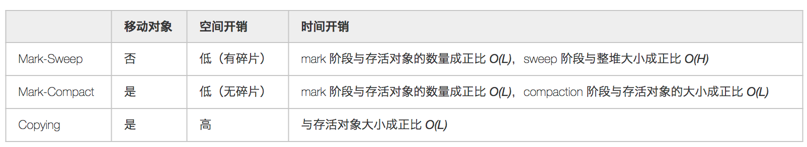
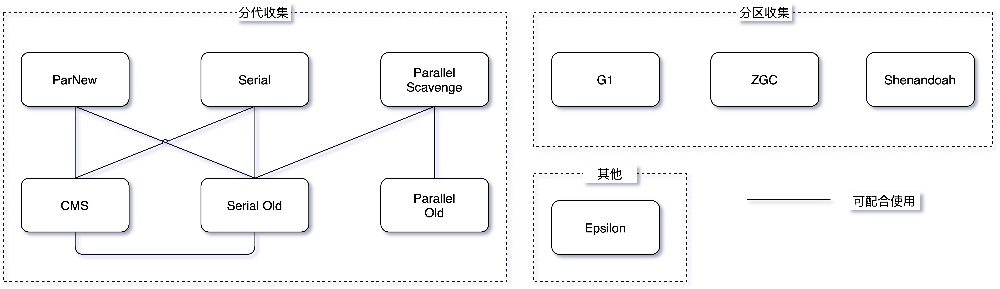
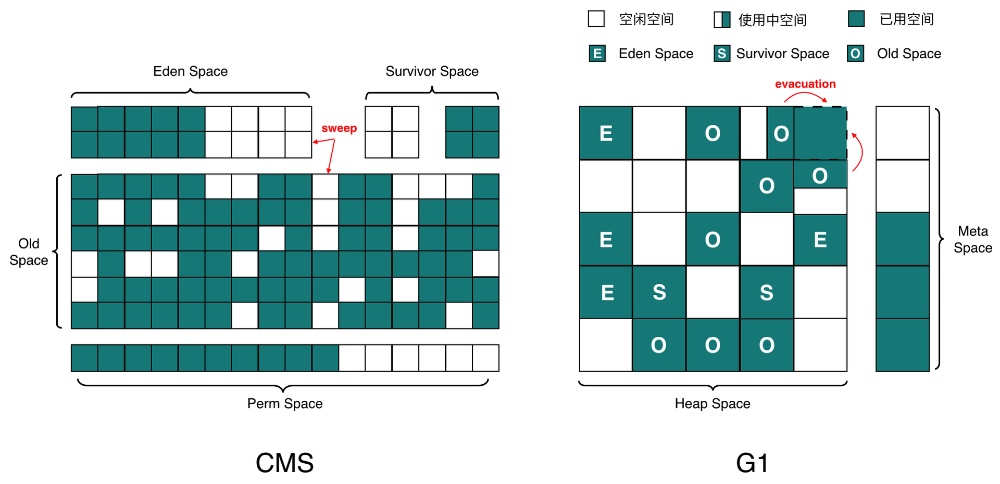
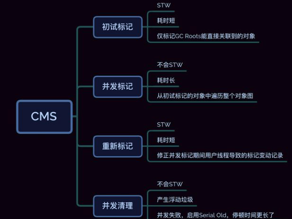
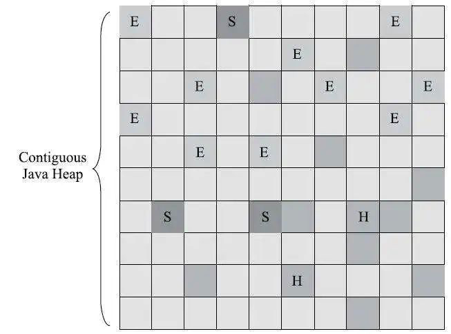

# 垃圾回收

## 如何确定对象已死？

### 引用计数算法

引用计数无法解决循环引用的问题，事实上已经使用[**Recycler**](https://microbiomejournal.biomedcentral.com/articles/10.1186/s40168-021-01068-z "Recycler")算法解决了。现在现在，高并发的场景下，引用计数变更也要进行昂贵的同步操作，性能较低，现在的语言不使用。

### 可达性分析算法

用GC Roots 作为起点，当一个对象到GC Roots没有任何引用链相连，就可回收（**枚举GCRoots会导致“stop the world ”**）

以下对象被标记成Root: 

*   Java 线程中，当前所有正在被调用的方法的引用类型参数、局部变量、临时值等。也就是与我们栈帧相关的各种引用。

*   所有当前被加载的 Java 类。

*   Java 类的引用类型静态变量。

*   运行时常量池里的引用类型常量（String 或 Class 类型）。

*   JVM 内部数据结构的一些引用，比如 sun.jvm.hotspot.memory.Universe 类。

*   用于同步的监控对象，比如调用了对象的 wait() 方法。

*   JNI handles，包括 global handles 和 local handles。

### 对象引用&#x20;

*   强引用：new 出来的一般对象，只要引用在就不会被回收

*   软引用: 将要发生内存溢出之前回收

*   弱引用: 生存到下一次垃圾收集发生之前

*   虚引用：目的是对象被收集器回收时收到一个系统通知

## 垃圾回收算法

### 复制-Cpoying

将内存分成两块，一块用完了，将可用的放到另一块，第一块全部回收，缺点，只能用一半的内存代价太高。

在新生代中，每次垃圾收集时都发现有大批对象死去，只有少量存活，选用：复制算法在老年代中因为对象存活率高、没有额外空间对它进行分配担保，就必须使用“标记-清除”或者“标记-整理”算法来进行回收。

### 标记清除-Mark-Sweep

先标记后清除
缺点：
1 效率不高
2 内存碎片导致提前触发回收

### 标记整理-Mark-Compact

将存活的对象向一端移动，直接清理掉边界以外的内存

以上三种算法在是否移动对象、空间和时间方面的一些对比，假设存活对象数量为 *L*、堆空间大小为 *H*，则：

### 算法实现

hotspot的算法实现 ,如何发起回收&#x20;

*   枚举根节点

*   安全点 safepoint&#x20;

*   安全区域safeRegion

## 垃圾收集器

**目前在 Hotspot VM 中主要有分代收集和分区收集两大类，不过未来会逐渐向分区收集发展**。具体可以看下面的这个图

JDK11 后提供了一个不执行任何垃圾回收动作的回收器 Epsilon（A No-Op Garbage Collector）用作性能分析。另外一个就是 Azul 的 Zing JVM，其 C4（Concurrent Continuously Compacting Collector）收集器也在业内有一定的影响力

### Serial收集器（分代）

*   serial --新生代

*   serial old --老年代

是虚拟机运行中Client模式下的默认新生代收集器，serial收集器对于运行在Client模式下的虚拟机来说是一个很好的选择

### ParNew 收集器- 新生代（分代）

就是Serial收集器的多线程版本，采用复制算法，主要工作在 Young 区，可以通过 `-XX:ParallelGCThreads` 参数来控制收集的线程数，整个过程都是 STW 的，常与 CMS 组合使用。

除了serial收集器外，目前只有它能与CMS收集器配合工作

### Parallel Scavenge --新生代,复制算法（分代）

*   自适应调节策略是Parallel Scavenge收集器与ParNew收集器的一个重要区别

    *   \-XX:+UseAdaptiveSizePolicy是一个开关参数，当这个参数打开之后，就不需要手工指定新生代的大小（-Xmn）、Eden与Survivor区的比例（-XX:SurvivorRatio）、晋升老年代对象年龄（-XX:PretenureSizeThreshold）等细节参数了，虚拟机会根据当前系统的运行情况收集性能监控信息，动态调整这些参数以提供最合适的停顿时间或最大的吞吐量，这种调节方式称为GC自适应的调节策略（GC Ergonomics）。

*   更关注可控制的吞吐量 Throughput，主要适合在后台运算而不需要太多交互的分析任务

### Parallel Old 收集器--老年代（分代）

是parallel Scavenge收集器的老年代版本，基于标记-整理算法实现。

### CMS(Concurrent Mark Sweep)  老年代 并发收集器（分代）

是一种以获取最短回收停顿时间为目标的收集器，目前使用最多的是 CMS 和 G1 收集器，二者都有分代的概念，主要内存结构如下：

CMS 并发清理失败可能会导致，收集器退化

### G1： Garbage First（分区）

*   JDK1.9已经成为默认的收集器

*   它可以面向堆内存任何部分来组成回收集（Collection Set，一般简称CSet）进行回收，衡量标准不再是它属于哪个分代，而是哪块内存中存放的垃圾数量最多，回收收益最大，这就是G1收集器的Mixed GC模式。

*   G1开创的基于Region的堆内存布局是它能够实现这个目标的关键。虽然G1也仍是遵循分代收集理论设计的，但其堆内存的布局与其他收集器有非常明显的差异：G1不再坚持固定大小以及固定数量的分代区域划分，而是把连续的Java堆划分为多个大小相等的独立区域（Region），每一个Region都可以根据需要，扮演新生代的Eden空间、Survivor空间，或者老年代空间。收集器能够对扮演不同角色的Region采用不同的策略去处理，这样无论是新创建的对象还是已经存活了一段时间、熬过多次收集的旧对象都能获取很好的收集效果。

更多垃圾回收器细节，参考 [JVM G1(Garbage First)垃圾收集器浅析](<JVM G1(Garbage First)垃圾收集器浅析/JVM G1(Garbage First)垃圾收集器浅析.md> "JVM G1(Garbage First)垃圾收集器浅析")

### ZGC （分区）

&#x20;JDK11 中推出的一款低延迟垃圾回收器，适用于大内存低延迟服务的内存管理和回收，SPECjbb 2015 基准测试，在 128G 的大堆下，最大停顿时间才 1.68 ms，停顿时间远胜于 G1 和 CMS

ZGC 和 G1 一样是基于 reigon 的，**几乎所有阶段都是并发的，整堆扫描，部分收集**。而且 ZGC 还不分代，就是没分新生代和老年代

更多内容参考：

*   [https://www.cnblogs.com/yescode/p/13997822.html](https://www.cnblogs.com/yescode/p/13997822.html "https://www.cnblogs.com/yescode/p/13997822.html")

*   [https://wiki.openjdk.java.net/display/zgc/Main](https://wiki.openjdk.java.net/display/zgc/Main "https://wiki.openjdk.java.net/display/zgc/Main")

*   [https://logosty.github.io/2020/07/27/zgc.html](https://logosty.github.io/2020/07/27/zgc.html "https://logosty.github.io/2020/07/27/zgc.html")

### Shenandoah（分区）

由 Red Hat 的一个团队负责开发，与 G1 类似，基于 Region 设计的垃圾收集器，但不需要 Remember Set 或者 Card Table 来记录跨 Region 引用，停顿时间和堆的大小没有任何关系。停顿时间与 ZGC 接近。

## Minor GC、Major GC、Full GC 区别

JVM 在进行 GC 时，并非每次都对堆内存（新生代、老年代；方法区）区域一起回收的，大部分时候回收的都是指新生代。

针对 HotSpot VM 的实现，它里面的 GC 按照回收区域又分为两大类：部分收集（Partial GC），整堆收集（Full GC）

*   部分收集：不是完整收集整个 Java 堆的垃圾收集。其中又分为：

    *   新生代收集（Minor GC/Young GC）：只是新生代的垃圾收集

    *   老年代收集（Major GC/Old GC）：只是老年代的垃圾收集

        *   目前，只有 CMS GC 会有单独收集老年代的行为

        *   很多时候 Major GC 会和 Full GC 混合使用，需要具体分辨是老年代回收还是整堆回收

    *   混合收集（Mixed GC）：收集整个新生代以及部分老年代的垃圾收集

        *   目前只有 G1 GC 会有这种行为

*   整堆收集（Full GC）：收集整个 Java 堆和方法区的垃圾

## 参考

*   &#x20;[https://help.eclipse.org/latest/index.jsp?topic=%2Forg.eclipse.mat.ui.help%2Fconcepts%2Fgcroots.html\&cp=37\_2\_3](https://help.eclipse.org/latest/index.jsp?topic=/org.eclipse.mat.ui.help/concepts/gcroots.html\&cp=37_2_3 "https://help.eclipse.org/latest/index.jsp?topic=%2Forg.eclipse.mat.ui.help%2Fconcepts%2Fgcroots.html\&cp=37_2_3")

&#x20;

[JVM G1(Garbage First)垃圾收集器浅析](JVM%20G1(Garbage%20First)垃圾收集器浅析/JVM%20G1(Garbage%20First)垃圾收集器浅析.md "JVM G1(Garbage First)垃圾收集器浅析")
