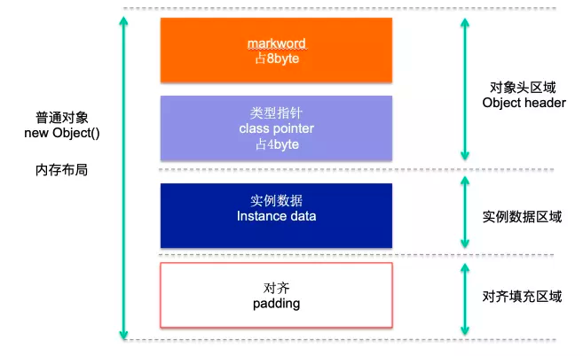
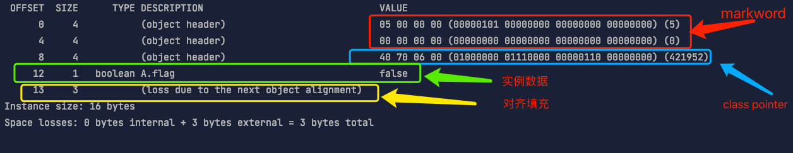
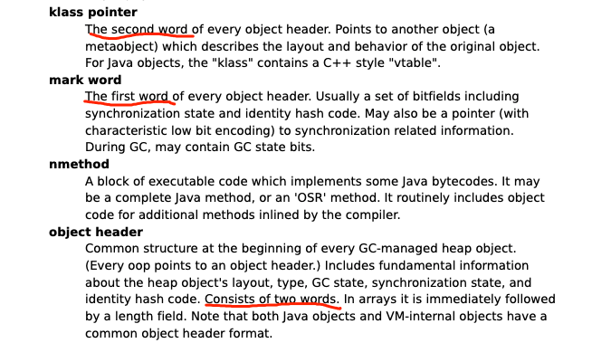
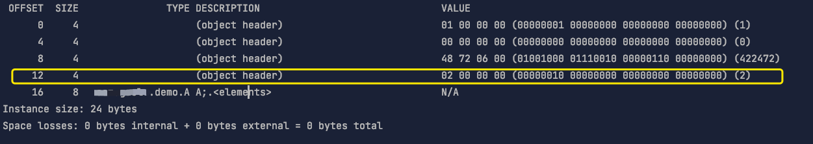
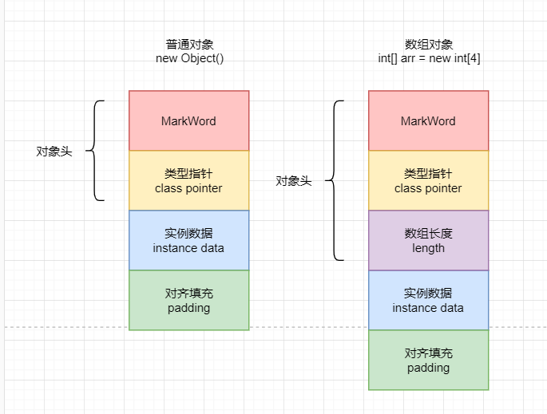
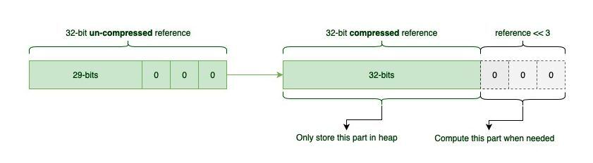
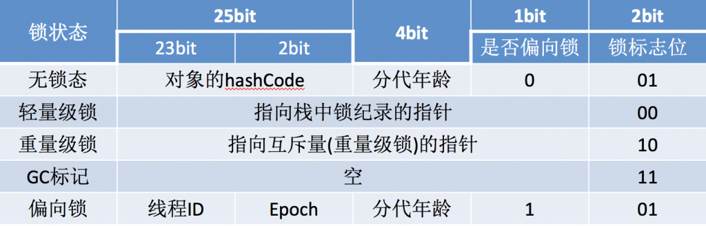
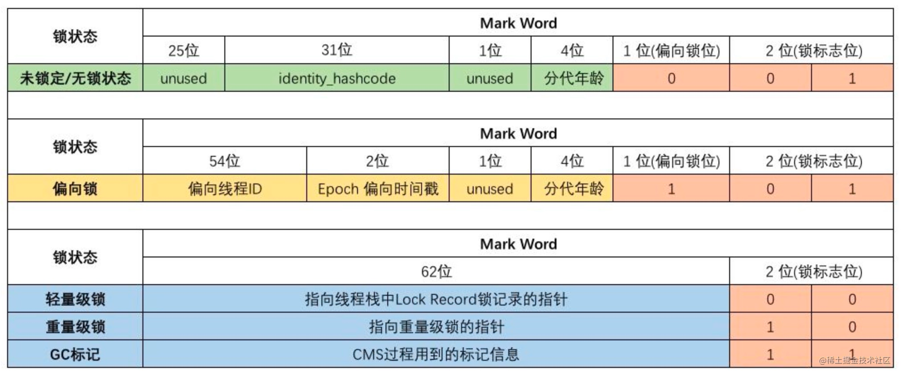
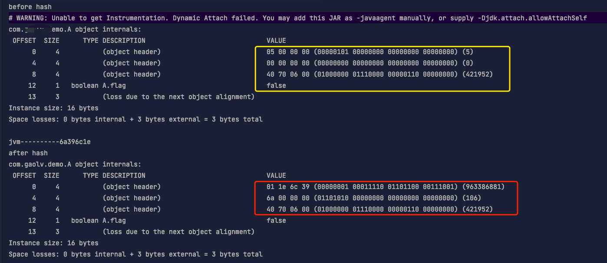
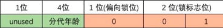

# 对象头（mark word）

## 前知识

### 内存布局

我们知道 java 对象的内存布局如下图所示：



而其中对象头区域包含  `markword` 和 `class pointer` &#x20;

### 利用 JOL 可以分析内存中的对象布局

> JOL 的全称是 Java Object Layout。是一个用来分析 JVM 中 Object 布局的小工具。包括 Object 在内存中的占用情况，实例对象的引用情况等等。

添加依赖

```xml
<dependency>
    <groupId>org.openjdk.jol</groupId>
    <artifactId>jol-core</artifactId>
    <version>0.10</version>
</dependency>
```

```java
public class A {

    //占一个字节的 boolean 字段
    private boolean flag;

    public static void main(String[] args) {
        A a = new A();

        //打印对应的对象头信息
        System.out.println(ClassLayout.parseInstance(a).toPrintable());
    }
}
```

我们利用上面的程序对对象头的内存情况进行一下探究。上面程序执行后的结果如下图：



这里 一共 16 个字节&#x20;

*   mark word 占了 8 个字节

*   class pointer 类型指针占了 4 个字节

*   实例数据 1 个字节

*   对齐填充部分 3 个字节

其中由于 JVM 开启了指针压缩，所以 class pointer  是 4 个字节，如果关闭指针压缩（添加 vm 参数：`-XX:-UseCompressedOops`），则是 8 个字节。

另外，64 位虚拟机上对象的大小必须是 **8 的倍数**，上图中一共 16 个字节，是 8 的倍数。

## 对象头

根据  [文档](< http://openjdk.java.net/groups/hotspot/docs/HotSpotGlossary.html> "文档") 得知 对象头有两个 word , 其一为 markword ，另一为 klass pointer



通过上面的例子我们已经知道了，在开启指针压缩的情况下 对象头（mark workd + klass pointer） 一般占 12 个字节。

但是，如果对象是数组，情况就不一样了。**当对象是一个数组对象时，那么在对象头中有一个保存数组长度的空间，占用 4 字节（32bit）空间**

```java
public class A {

    //占一个字节的 boolean 字段
    private boolean flag;

    public static void main(String[] args) {

        A[] a = new A[2];

        //打印对应的对象头信息
        System.out.println(ClassLayout.parseInstance(a).toPrintable());
    }
}
```



可以看到 对象头（object header）又多了 4 个字节用于存放数组长度。



### klass pointer&#x20;

`Klass Pointer`是一个指向方法区中`Class`信息的指针，虚拟机通过这个指针确定该对象属于哪个类的实例。

在 64 位的 JVM 中，支持指针压缩功能，根据是否开启指针压缩，`Klass Pointer`占用的大小将会不同：

*   未开启指针压缩时，类型指针占用 8B (64bit)

*   开启指针压缩情况下，类型指针占用 4B (32bit)

### 指针压缩原理

我们将程序从 32 位移到 64 位是为了程序性能的提升，但是涉及 JVM 的情况并非总是如此，造成这种性能下降的主要原因是 64 位对象引用。

64 位引用占用的空间是 32 位引用的两倍，这通常导致更多的内存消耗和更频繁的 GC 周期，而且对象的引用完全用不到 64 位，因为 64 位代表的内存大小为 2^64，其内存大小完全达不到，因此就需要压缩指针来获取性能上的提升。

> 内存寻址是以字节为单位 ，32 位寻址空间约 4GB （4 \* 1024  \* 1024 \* 1024 Byte） = 2 的 32 次方。同理 64 位理论上可以达到 2 的 64 次方字节，2097152T

我们知道 JVM 对象对齐会使对象的大小都是 8 字节的倍数，这会使 oops 的最后三位始终为零，这是因为 8 的倍数始终以二进制 000 结尾。

这 3 位 000 在堆中的存储是完全没有意义的，因此**我们可以将这 3 位用来存储更多的内存地址，相当于 35 位的地址压缩在 32 位地址上使用，这样我们内存使用就从原来的 2^32=4G 提升为 2^35=32G。**



#### 何为 Oop?

Oop(ordinary object pointer)，可以翻译为普通对象指针，指向的是 Java 对象在内存中的引用。

#### 哪些对象会被压缩？

如果配置 JVM 参数 UseCompressedOops 为 true，则代表启用压缩指针，则将压缩堆中的以下 oops：

*   每个对象头的 klass 字段

*   每个 oop 实例字段

*   oop 数组（objArray）的每个元素

需要注意的是，在 UseCompressedOops 已经开启的基础上，klass 可以通过 UseCompressedClassPointers 单独设置是否开启。UseCompressedClassPointers 必须基于 UseCompressedOops 开启的情况下才可以设置是否开启，如果 UseCompressedOops 设为 false，则 UseCompressedClassPointers 无法设置为 ture。

### mark word

具体来看一下 `markword`  的内部结构



根据 JVM 源码 [http://hg.openjdk.java.net/jdk8/jdk8/hotspot/file/87ee5ee27509/src/share/vm/oops/markOop.hpp](http://hg.openjdk.java.net/jdk8/jdk8/hotspot/file/87ee5ee27509/src/share/vm/oops/markOop.hpp "http://hg.openjdk.java.net/jdk8/jdk8/hotspot/file/87ee5ee27509/src/share/vm/oops/markOop.hpp")



具体我们写代码看一下：

```java
public class A {

    //占一个字节的 boolean 字段
    private boolean flag;

    public static void main(String[] args) {

        A a = new A();

        out.println("before hash");
        out.println(ClassLayout.parseInstance(a).toPrintable());

        //jvm 计算 HashCode
        out.println("jvm----------" + Integer.toHexString(a.hashCode()));

        //当计算完 HashCode 之后，我们可以查看对象头的信息变化
        out.println("after hash");
        out.println(ClassLayout.parseInstance(a).toPrintable());
    }
}
```



可以看到我们在没有进行 hashcode 运算的时候，所有的值都是空的。当我们计算完了 hashcode，对象头就是有了数据。因为是**小端存储**，所以你看的值是倒过来的。前 25bit 没有使用所以都是 0，后面 31bit 存的 hashcode。这跟 [上图](https://www.wolai.com/isYZXNGkKfrMT3wSFRhFGQ#dx2akyVReAYCUuARpK4Tna "上图") 64 位 markword 所描述的一样。

那么在无锁状态下  `ojbect header`  第一个字节 8 位存储的就是：



即 `00000001` 。

&#x20; 最后一位代表的锁标志为 1 ，表示该对象 **无锁**。

> **然而锁标志位 2bit 只能表示 4 种状态（00,01,10,11）JVM 的做法将偏向锁和无锁的状态表示为同一个状态，然后根据** [**上图**](https://www.wolai.com/isYZXNGkKfrMT3wSFRhFGQ#dx2akyVReAYCUuARpK4Tna "上图") **中偏向锁的标识再去标识是无锁还是偏向锁状态。**

Java 的对象头在对象的不同的状态下会有不同的表现形式，主要有三种状态

*   无锁状态

*   加锁状态

*   GC 标记状态

那么就可以理解** Java 当中的上锁其实可以理解给对象上锁**，也就是改变对象头的状态 [synchronized 锁的是什么？](../../../面试题/synchronized%20锁的是什么？/synchronized%20锁的是什么？.md "synchronized 锁的是什么？")

有关锁相关的（偏向锁、轻量级锁、重量级锁等），参考 [JAVA 中的锁](../JAVA%20中的锁/JAVA%20中的锁.md)

### 当 Java 处在偏向锁、重量级锁状态时，hashcode 值存储在哪？

> 简单 [答案](https://www.zhihu.com/question/52116998 "答案") 是：
>
> *   当一个对象已经计算过 identity hash code，它就无法进入偏向锁状态； &#x20;
>
> *   当一个对象当前正处于偏向锁状态，并且需要计算其 identity hash code 的话，则它的偏向锁会被撤销，并且锁会膨胀为重量锁；
>
> *   重量锁的实现中，ObjectMonitor 类里有字段可以记录非加锁状态下的 mark word，其中可以存储 identity hash code 的值。或者简单说就是重量锁可以存下 identity hash code。
>
> 请一定要注意，这里讨论的 hash code 都只针对 identity hash code。用户自定义的 hashCode() 方法所返回的值跟这里讨论的不是一回事。
>
> Identity hash code 是未被覆写的 java.lang.Object.hashCode() 或者 java.lang.System.identityHashCode(Object) 所返回的值。

## 参考

*   [https://blog.csdn.net/qq\_36434742/article/details/106854061](https://blog.csdn.net/qq_36434742/article/details/106854061 "https://blog.csdn.net/qq_36434742/article/details/106854061")

*   [http://chickenman.cn/archives/708](http://chickenman.cn/archives/708 "http://chickenman.cn/archives/708")

*   [https://www.zhihu.com/question/52116998](https://www.zhihu.com/question/52116998 "https://www.zhihu.com/question/52116998")
