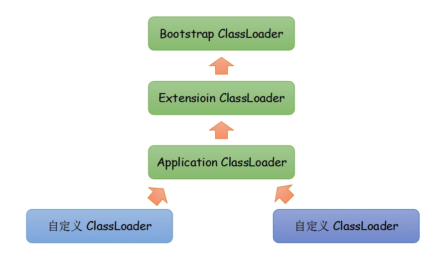

# 类加载

## 类加载机制

虚拟机把描述类的数据从Class文件加载 到内存，并对数据进行校验、转换解析和初始化，最终形成可以被虚拟机直接使用的JAVA类型，这就是虚拟机的类加载机制。

### 加载

*   一个类必须与类加载器一起确定唯一性

*   加载阶段完成后，虚拟机外部的二进制字节流就按照虚拟机所需的格式存储在方法区之中。

### 验证

可以使用 -Xverify:none参数来关闭大部分的类验证措施，以缩短虚拟机类加载的时间。

### 准备

准备阶段是正式为类变量分配内存并设置类变量初始值的阶段，这些变量所使用的内存都将在方法区中进行分配。

## 类加载器

虚拟机设计团队把类加载阶段中的“通过一个类的全限定名来获取描述此类的二进制字节流”这个动作放到JAVA虚拟机外部去实现，以便让应用程序自己决定如何去获取所需要的类。实现这个动作的代码模块称为“**类加载器**”

*   启动类加载器（Bootstrap ClassLoader）,加载\<JAVA\_HOME>\lib 目录中的类库&#x20;

*   扩展类加载器(Extension ClassLoader),加载\<JAVA\_HOME>\lib\ext目录中的类库&#x20;

*   应用程序类加载器(Application ClassLoader)，加载用户类路径（ClassPath）上所指定的类库

**比较两个类是否“相等”，只有在这两个类是由同一个类加载器加载的前提下才有意义。**

## 双亲委派模型

如果一个类加载器收到类加载的请求，它首先不会自己去尝试加载这个类，而是把这个请求委派给父类加载器完成。每个类加载器都是如此，只有当父加载器在自己的搜索范围内找不到指定的类时（即ClassNotFoundException），子加载器才会尝试自己去加载

### 破坏双亲委派模型

*   JNDI、JDBC等

*   OSGI

### SPI

PI 全称为 (Service Provider Interface) ,是JDK内置的一种服务提供发现机制。 目前有不少框架用它来做服务的扩展发现， 简单来说，它就是一种动态替换发现的机制， 举个例子来说， 有个接口，想运行时动态的给它添加实现，你只需要添加一个实现。 具体是在JAR包的"src/META-INF/services/"目录下建立一个文件，文件名是接口的全限定名，文件的内容可以有多行，每行都是该接口对应的具体实现类的全限定名

[java的spi 的简单应用 ](https://www.cnblogs.com/huzi007/p/6679215.html "java的spi 的简单应用 ")
