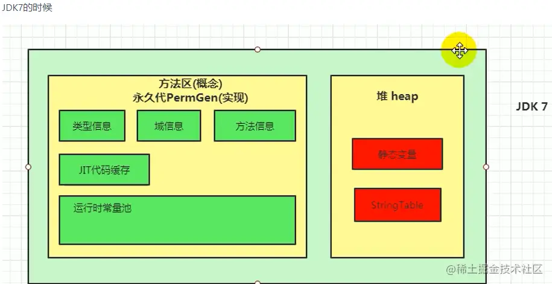

# 深入理解堆外内存 Metaspace

在之前介绍的分代垃圾回收算法中，我们一直有一个**永久代**存在，叫 PermGen，内存上它是挨着堆的。为了垃圾回收方便，HotSpot 在永久代上一直是使用老年代的垃圾回收算法。

永久代主要存放以下数据：

*   JVM internal representation of classes and their metadata

*   Class statics

*   Interned strings

从 JDK7 开始，JDK 开发者们就有消灭永久代的打算了。有部分数据移到永久代之外了：

*   Symbols => native memory

*   Interned strings => Java Heap

*   Class statics => Java Heap

到了 JDK8，这个工作终于完成了，彻底废弃了 PermGen，Metaspace 取而代之。

本文的内容主要是翻译 Thomas Stüfe 的 [Metaspace 系列文章](https://stuefe.de/posts/metaspace/what-is-metaspace/ "Metaspace 系列文章")，他是 OpenJDK Committer/Reviewer. JVM developer at SAP，一看 Title 就很靠谱，因为他是 JVM 开发者，当然主要是内容也写得非常棒。

当然了，我不是一字一句翻译，文中会删掉部分累赘的内容，讲清楚就可以了。同时，原文第五篇是介绍使用 jcmd 工具观察 Metaspace 的空间使用情况，这一节我觉得没有必要介绍，所以没有加进来。

## 1、什么是 Metaspace

Metaspace 区域位于堆外，所以它的最大内存大小取决于系统内存，而不是堆大小，我们可以指定 MaxMetaspaceSize 参数来限定它的最大内存。

Metaspace 是用来存放 class metadata 的，class metadata 用于记录一个 Java 类在 JVM 中的信息，包括但不限于 [JVM class file format](https://docs.oracle.com/javase/specs/jvms/se8/html/jvms-4.html "JVM class file format") 的运行时数据：

1.  Klass 结构，这个非常重要，把它理解为一个 Java 类在虚拟机内部的表示吧；

2.  method metadata，包括方法的字节码、局部变量表、异常表、参数信息等；

3.  常量池；

4.  注解；

5.  方法计数器，记录方法被执行的次数，用来辅助 JIT 决策；

6.  其他

虽然每个 Java 类都关联了一个 `java.lang.Class` 的实例，而且它是一个贮存在堆中的 Java 对象。但是类的 class metadata 不是一个 Java 对象，它不在堆中，而是在 Metaspace 中。

### 什么时候分配 Metaspace 空间

当一个类被加载时，它的类加载器会负责在 Metaspace 中分配空间用于存放这个类的元数据。

上面这个示意图非常简单，可以看到在 `Id` 这个类加载器第一次加载类 `X` 和 `Y` 的时候，在 Metaspace 中为它们开辟空间存放元信息。

### 什么时候回收 Metaspace 空间

分配给一个类的空间，是归属于这个类的类加载器的，只有当这个类加载器卸载的时候，这个空间才会被释放。

所以，只有当这个类加载器加载的所有类都没有存活的对象，并且没有到达这些类和类加载器的引用时，相应的 Metaspace 空间才会被 GC 释放。看下图：

所以，一个 Java 类在 Metaspace 中占用的空间，它是否释放，取决于这个类的类加载器是否被卸载。

### 内存通常会被保留

释放 Metaspace 的空间，并不意味着将这部分空间还给系统内存，这部分空间通常会被 JVM 保留下来。

这部分被保留的空间有多大，取决于 Metaspace 的碎片化程度。另外，Metaspace 中有一部分区域 Compressed Class Space 是一定不会还给操作系统的。

这里先了解概念，后面都会展开来说。

### 配置 Metaspace 空间

我们只需要关心两个配置参数：

*   `-XX:MaxMetaspaceSize`：Metaspace 总空间的最大允许使用内存，默认是不限制。

*   `-XX:CompressedClassSpaceSize`：Metaspace 中的 Compressed Class Space 的最大允许内存，默认值是 1G，这部分会在 JVM 启动的时候向操作系统申请 1G 的虚拟地址映射，但不是真的就用了操作系统的 1G 内存。

### Metaspace 和 GC

Metaspace 只在 GC 运行并且卸载类加载器的时候才会释放空间。当然，在某些时候，需要主动触发 GC 来回收一些没用的 class metadata，即使这个时候对于堆空间来说，还达不到 GC 的条件。

Metaspace 可能在两种情况下触发 GC：

1、分配空间时：虚拟机维护了一个阈值，如果 Metaspace 的空间大小超过了这个阈值，那么在新的空间分配申请时，虚拟机首先会通过收集可以卸载的类加载器来达到复用空间的目的，而不是扩大 Metaspace 的空间，这个时候会触发 GC。这个阈值会上下调整，和 Metaspace 已经占用的操作系统内存保持一个距离。

2、碰到 Metaspace OOM：Metaspace 的总使用空间达到了 MaxMetaspaceSize 设置的阈值，或者 Compressed Class Space 被使用光了，如果这次 GC 真的通过卸载类加载器腾出了很多的空间，这很好，否则的话，我们会进入一个糟糕的 GC 周期，即使我们有足够的堆内存。

所以大家千万不要把 MaxMetaspaceSize 设置得太小。

## 2、Metaspace 的架构

这一节将深入到 Metaspace 的架构实现，将描述它的每一层和每一个组件，以及它们是怎么工作的。

对于开发者来说，这一定是非常有趣的一件事情，我们大部分开发者都不可能去开发 JDK，但是了解这些总是充满着乐趣。

Metaspace 在实现上分为多层。最底层，负责向操作系统申请大块的内存；中间的一层，负责分出一小块一小块给每个类加载器；最顶层，类加载器负责把这些申请到的内存块用来存放 class metadata。

### 最底层：the space list

在最底层，JVM 通过 `mmap(3)` 接口向操作系统申请内存映射，在 64 位平台上，每次申请 **2MB** 空间。

当然，这里的 2MB 不是真的就消耗了主存的 2MB，只有之后在使用的时候才会真的消耗内存。这里是虚拟内存映射。

每次申请过来的内存区域，放到一个链表中 [*VirtualSpaceList*](http://hg.openjdk.java.net/jdk/jdk11/file/1ddf9a99e4ad/src/hotspot/share/memory/metaspace/virtualSpaceList.hpp#l39 "VirtualSpaceList")，作为其中的一个 Node。看下图。

一个 Node 是 2MB 的空间，前面说了在使用的时候再向操作系统申请实际的内存，但是频繁的系统调用会降低性能，所以 Node 内部需要维护一个水位线，当 Node 内已使用内存快达到水位线的时候，向操作系统要新的内存页。并且相应地提高水位线。

直到一个 Node 被完全用完，会分配一个新的 Node，并且将其加入到链表中，老的 Node 就 “退休” 了。下图中，前面的三个 Node 就是退休状态了。

从一个 Node 中分配内存，每一块称为 MetaChunk，chunk 有三种规格，在 64 位系统中分别为 1K、4K、64K。

链表 VirtualSpaceList 和每个节点 Node 是全局的，而 Node 内部的一个个 MetaChunk 是分配给每个类加载器的。所以一个 Node 通常由分配给多个类加载器的 chunks 组成。

当一个类加载器和它加载的所有的类都卸载的时候，它占用的 chunks 就会加入到一个全局的空闲列表中：[*ChunkManager*](http://hg.openjdk.java.net/jdk/jdk11/file/1ddf9a99e4ad/src/hotspot/share/memory/metaspace/chunkManager.hpp#l44 "ChunkManager")，看下图：

这些 chunks 会被复用：如果其他的类加载器加载新的类，它可能就会得到一个空闲列表中的 chunk，而不是去 Node 中申请一个新的 chunk。

后面会说到，如果刚好把整个 Node 都清空了，那么这整个 Node 的内存会直接还给操作系统。

当然，由这个 Node 进入到空闲列表的节点也要删除。

### 中间层：Metachunk

通常一个类加载器在申请 Metaspace 空间用来存放 metadata 的时候，也就需要几十到几百个字节，但是它会得到一个 Metachunk，一个比要求的内存大得多的内存块。

为什么？因为前面说了，要从全局的 `VirtualSpaceList` 链表的 Node 中分配内存是昂贵的操作，需要加锁。我们不希望这个操作太频繁，所以一次性给一个大的 MetaChunk，以便于这个类加载器之后加载其他的类，这样就可以做到多个类加载器并发分配了。只有当这个 chunk 用完了，类加载器才需要又去 `VirtualSpaceList` 申请新的 chunk。

前面说了，chunk 有三种规格，那 Metaspace 的分配器怎么知道一个类加载器每次要多大的 chunk 呢？这当然是基于猜测的：

*   通常，一个标准的类加载器在第一次申请空间时，会得到一个 4K 的 chunk，直到它达到了一个随意设置的阈值（4），此时分配器失去了耐心，之后会一次性给它一个 64K 的大 chunk。

*   bootstrap classloader 是一个公认的会加载大量的类的加载器，所以分配器会给它一个巨大的 chunk，一开始就会给它 4M。可以通过 InitialBootClassLoaderMetaspaceSize 进行调优。

*   反射类类加载器 (`jdk.internal.reflect.DelegatingClassLoader`) 和匿名类类加载器只会加载一个类，所以一开始只会给它们一个非常小的 chunk（1K），因为给它们太多就是一种浪费。

类加载器申请空间的时候，每次都给类加载器一个 chunk，这种优化，是建立在假设它们立马就会需要新的空间的基础上的。这种假设可能正确也可能错误，可能在拿到一个很大的 chunk 后，这个类加载器恰巧就不再需要加载新的类了。

对于这部分可能的空间浪费，可以在后面介绍的系统工具中观察到。

### 最顶层：Metablock

在 Metachunk 上，我们有一个二级分配器（class-loader-local allocator），它将一个 Metachunk 分割成一个个小的单元，这些小的单元称为 Metablock，它们是实际分配给每个调用者的。

这个二级分配器非常原始，它的速度也非常快：

前面说过，class metadata 的生命周期是和类加载器绑定的，所以在类加载器卸载的时候，JVM 可以大块大块地释放这些空间。

下面展示一个 Metachunk 的结构：

这个 chunk 诞生的时候，它只有一个 header，之后的分配都只要在顶部进行分配就行。

由于这个 chunk 是归属于一个类加载器的，所以如果它不再加载新的类，那么 unused 空间就将真的浪费掉。

### ClassloaderData and ClassLoaderMetaspace

在 JVM 内部，一个类加载器以一个 [*ClassLoaderData*](http://hg.openjdk.java.net/jdk/jdk11/file/1ddf9a99e4ad/src/hotspot/share/classfile/classLoaderData.hpp#l176 "ClassLoaderData") 结构标识，这个结构引用了一个 [*ClassLoaderMetaspace*](http://hg.openjdk.java.net/jdk/jdk11/file/1ddf9a99e4ad/src/hotspot/share/memory/metaspace.hpp#l230 "ClassLoaderMetaspace") 结构，它维护了该加载器使用的所有的 Metachunk。

当这个类加载器被卸载的时候，这个 `ClassLoaderData` 和 `ClassLoaderMetaspace` 会被删除。并且会将所有的这个加载器用到的 chunks 归还到空闲列表中。这部分内存是否可以直接归还给操作系统取决于是否满足其他条件，后面会介绍。

就是前面提过的，如果恰好把整个 Node 都清空了，那么这个 Node 的内存直接还给操作系统

### 匿名类

`ClassloaderData != ClassLoaderMetaspace`

注意，我们前面说，“Metaspace 内存是属于类加载器的”，但是，这里其实撒了一个小谎，如果将匿名类考虑进去，那就更加复杂了：

当类加载器加载一个匿名类时，这个类有自己独立的 `ClassLoaderData`，它的生命周期是跟随着这个匿名类的，而不是这个类加载器（所以，和它相关的空间可以在类加载器卸载前得到释放）。所以，一个类加载器有一个主要的 ClassLoaderData 结构用来服务所有的正常的类，对于每一个匿名类，还有一个二级的 ClassLoaderData 结构来维护。

这样做的目的之一，其实就是没有必要扩大大量的 Lambdas 和 method  handlers 在 Metaspace 中的空间的生命周期。

### 内存什么时候会还给操作系统

当一个 VirtualSpaceListNode 中的所有 chunk 都是空闲的时候，这个 Node 就会从链表 VirtualSpaceList 中移除，它的 chunks 也会从空闲列表中移除，这个 Node 就没有被使用了，会将其内存归还给操作系统。

对于一个空闲的 Node 来说，拥有其上面的 chunks 的所有的类加载器必然都是被卸载了的。

至于这个情况是否可能发生，主要就是取决于碎片化：

一个 Node 是 2M，chunks 的大小为 1K, 4K 或 64K，所以通常一个 Node 上有约 150-200 个 chunks，如果这些 chunks 全部由同一个类加载器拥有，回收这个类加载器就可以一次性回收这个 Node，并且把它的空间还给操作系统。

但是，如果这些 chunks 分配给不同的类加载器，每个类加载器都有不同的生命周期，那么什么都不会被释放。这也许就是在告诉我们，要小心对待大量的小的类加载器，如那些负责加载匿名类或反射类的加载器。

同时也要清楚，Metaspace 中的 *Compressed Class Space* 是永远不会将内存还给操作系统的。我们马上就要介绍这部分内容了。

### 本节小结

*   每次向操作系统申请 2M 的虚拟空间映射，放置到全局链表中，待需要使用的时候申请内存。

*   一个 Node 会分割为一个个的 chunks，分配给类加载器，一个 chunk 属于一个类加载器。

*   chunk 再细分为一个个 Metablock，这是分配给调用者的最小单元。

*   当一个类加载器被卸载，它占有的 chunks 会进入到空闲列表，以便复用，如果运气好的话，有可能会直接把内存归还给操作系统。

## 3、什么是 Compressed Class Space

在 64 位平台上，HotSpot 使用了两个压缩优化技术，**Compressed Object Pointers** (*“CompressedOops”*) 和 **Compressed Class Pointers**。

压缩指针，指的是在 64 位的机器上，使用 32 位的指针来访问数据（堆中的对象或 Metaspace 中的元数据）的一种方式。

这样有很多的好处，比如 32 位的指针占用更小的内存，可以更好地使用缓存，在有些平台，还可以使用到更多的寄存器。

当然，在 64 位的机器中，最终还是需要一个 64 位的地址来访问数据的，所以这个 32 位的值是相对于一个基准地址的值。

CompressedOops 说的是对象引用的压缩，它不在本文的讨论范围内。

在 64 位平台上，本质上还是需要使用 64 位地址来引用每一个对象的，但是这项技术使得可以只使用 32 位地址来实现引用。大家可以参考一下评论区的讨论，这里就不展开了。

由于本文在描述的是 Metaspace，所以我们这里不关心 **Compressed Object Pointers**，下面将描述 **Compressed Class Pointers**：

每个 Java 对象，在它的头部，有一个引用指向 Metaspace 中的 Klass 结构。

当使用了 compressed class pointers，这个引用是 32 位的值，为了找到真正的 64 位地址，需要加上一个 base 值：

上面的内容应该很好理解，这项技术对 Klass 的分配带来的问题是：由于 32 位地址只能访问到 4G 的空间，所以**最大只允许 4G** 的 Klass 地址。这项限制也意味着，JVM 需要向 Metaspace 分配一个**连续的地址空间**。

当从系统申请内存时，通过调用系统接口 malloc(3) 或 mmap(3)，操作系统可能返回任意一个地址值，所以在 64位系统中，它并不能保证在 4G 的范围内。

所以，我们只能用一个 mmap() 来申请一个区域单独用来存放 Klass 对象。我们需要提前知道这个区域的大小，而且不能超过 4G。显然，这种方式是不能扩展的，因为这个地址后面的内存可能是被占用的。

只有 Klass 结构有这个限制，对于其他的 class metadata 没有这个必要: 因为只有 Klass 实例是通过 Java 对象 header  中的压缩指针访问的。其他的 metadata 都是通过 64 位的地址进行访问的，所以它们可以被放到任意的地址上。

所以，我们决定将 Metaspace 分为两个区域：non-class part 和 class part。

*   class part：存放 Klass 对象，需要一个连续的不超过 4G 的内存

*   non-class part：包含其他的所有 metadata

class part 被称作 **Compressed Class Space**，这个名字会有点怪，因为 Klass 本身其实没有使用压缩技术，而是引用它们的指针被压缩了。

compressed class space 空间的大小，是通过 -XX:CompressedClassSpaceSize 指定的。

我们需要提前知道自己需要多少内存，它的**默认值是 1G**。当然这个 1G 并不是真的使用了操作系统的 1G，而是虚拟地址映射。

### 实现

为了复用已有的 Metaspace 空间，使用了一个小技巧：

在 Class Space 和 Non-Class Space 中，分别都有 VirtualSpaceList 和 ChunkManager 两个结构。

但是对于 Class Space，既然我们需要一个连续的空间我们不能使用一个链表来存放所有的 Node，所以这个链表退化为只有一个节点，并且不能扩展。这个 Node 就是 compressed class space，和 Non-Class Space 中的 Node 相比，它可是巨大无比。

ClassLoaderMetaspace（记录当前类加载器持有哪些 chunks）需要两个链表，一个用于记录 Class Space 中的 chunks，一个用于记录 Non-Class Space 中的 chunks。

到这里应该也很好理解，就是对于一个类加载器来说，它需要知道自己使用了 non-class part 中的哪些 chunks 和 class part 中的哪些 chunks。

### 开关: UseCompressedClassPointers, UseCompressedOops

`-XX:+UseCompressedOops` 允许对象指针压缩。

`-XX:+UseCompressedClassPointers` 允许类指针压缩。

它们默认都是开启的，可以手动关闭它们。

如果不允许类指针压缩，那么将没有 compressed class space 这个空间，并且`-XX:CompressedClassSpaceSize` 这个参数无效。

`-XX:-UseCompressedClassPointers` 需要搭配 `-XX:+UseCompressedOops`，但是反过来不是: 我们可以只压缩对象指针，不压缩类指针。

这里面为什么这么规定我也不懂，但是从直觉上来说，压缩对象指针显然是比较重要的，能获得较大的收益。也许就是基于这种考量吧：你连对象指针都不压缩，类指针压缩不压缩又有什么关系呢？

注意，对象指针压缩要求堆小于 32G，所以如果堆大于等于 32G，那么对象指针压缩和类指针压缩都会被关闭。

32G 可不是一个掐指一算随便指定的数字，看下评论区就知道原因了。

## 4、度量 Metaspace

前面我们介绍过，**MaxMetaspaceSize** 和 **CompressedClassSpaceSize** 是控制 Metaspace 的两个配置。

回顾一下：

*   **MaxMetaspaceSize** &#x20;

    最大允许 Metaspace 使用的内存，包括 Class Space 和 Non-Class Space，默认是不限制。

*   **CompressedClassSpaceSize** &#x20;

    在启动的时候就限制 Class Space 的大小，默认值是 1G，启动后不可以修改。再说一遍，它是 reserved 不是 committed 的内存。

下图展示了它们是怎么工作的：

红色部分是 Metaspace 中已使用的系统内存，包括 Non-Class Space 链表中的红色部分和 Class Space 中大 Node 的红色部分。这个总和受到 `-XX:MaxMetaspaceSize` 的限制，超出将抛出 **OutOfMemoryError(“Metaspace”)**。

`-XX:CompressedClassSpaceSize` 限制了下方的 Class Space 中，这个大 Node 的大小，包括了红色已使用的内存和蓝色未使用的内存。如果这个 Node 被用完了，会抛出 **OutOfMemoryError(“Compressed Class Space”)**。

### 所以这意味着什么？

当一个 Java 类被加载后，它需要 Non-Class Space 和 Class Space 的空间，而且后者通常都是被限制的(默认 1G)，所以我们总是有那么一个上限存在，即使 -XX:MaxMetaspaceSize 没有配置。

所以，是否会触及到这个上限，取决于 Non-Class Space 和 Class Space 的使用比例。

对于每个类，我们假设这个比例是 1: 5 （class:non-class） 。

这意味着，对于 -XX:CompressedClassSpaceSize 的 1G 的默认值，我们的上限约 6G，1G 的 Class Space 再加约 5G 的 Non-Class Space。

### 一个类大概需要多大的 Metaspace 空间

对于一个被加载到虚拟机中的类，Metaspace 需要分配 class 和 non-class 空间，那么这些空间花在哪里了呢？看下图：

#### 深入 Class Space：

最大的一部分是 Klass 结构，它是固定大小的。

然后紧跟着两个可变大小的 vtable 和 itable，前者由类中方法的数量决定，后者由这个类所实现接口的方法数量决定。

随后是一个 map，记录了类中引用的 Java 对象的地址，尽管该结构一般都很小，不过也是可变的。

vtable 和 itable 通常也很小，但是对于一些巨大的类，它们也可以很大，一个有 30000 个方法的类，vtable 的大小会达到 240k，如果类派生自一个拥有 30000 个方法的接口，也是同理。但是这些都是测试案例，除了自动生成代码，你从来不会看到这样的类。

#### 深入 Non-Class Space

这个区域有很多的东西，下面这些占用了最多的空间：

*   常量池，可变大小；

*   每个成员方法的 metadata：ConstMethod 结构，包含了好几个可变大小的内部结构，如方法字节码、局部变量表、异常表、参数信息、方法签名等；

*   运行时数据，用来控制 JIT 的行为；

*   注解

Metaspace 中的结构都继承自 [MetaspaceObj](http://hg.openjdk.java.net/jdk/jdk11/file/1ddf9a99e4ad/src/hotspot/share/memory/allocation.hpp#l239 "MetaspaceObj")，所以查看它的类继承结构能了解更详细的信息。

#### Class space 和 Non-Class Space 比例

下面看一下在一些典型的应用中，它们之间的大小比例数据。

下面是 WildFly 应用服务器，16.0.0，运行在 SAPMachine 11 平台上，没有加载任何应用。我们检查下总共需要多少 Metaspace 空间，然后计算平均每个类所需要的空间。我们使用 `jcmd VM.metaspace` 进行度量。

|           |          |                                   |                                |                       |
| --------- | -------- | --------------------------------- | ------------------------------ | --------------------- |
| loader    | #classes | non-class space *(avg per class)* | class space *(/avg per class)* | ratio non-class/class |
| all       | 11503    | 60381k *(5.25k)*                  | 9957k *(0.86k)*                | 6.0 : 1               |
| bootstrap | 2819     | 16720k *(5.93k)*                  | 1768k *(0.62k)*                | 9.5 : 1               |
| app       | 185      | 1320k *(7.13k)*                   | 136k *(0.74k)*                 | 9.7 : 1               |
| anonymous | 869      | 1013k *(1.16k)*                   | 475k *(0.55k)*                 | 2.1 : 1               |

这个表告诉我们：

*   对于正常的类（我们假设通过 bootstrap 和 app 加载的类是正常的），我可以得到平均每个类需要约 5-7k 的 Non-Class Space 和 600-900 bytes 的 Class Space。

*   匿名类要小得多，但是也有一个有趣的事情，Class 和 Non-Class Space 之间的比例，相对的，我们需要更多的 Class Space。这也不奇怪，因为诸如 Lambda 类都是很小的，但是它的 Klass 结构不可能小于 sizeof(Klass)。所以，我们得到 1k Non-Class Space 和 0.5k Class Space。

注意，在我们的案例中，匿名类的数据可能没有代表性，需要收集更多的匿名类，才能得到更准确的数据。

### Metaspace 默认大小

如果我们完全不设置限制 Metaspace 的大小，那么 Metaspace 可以容纳多少类呢？

MaxMetaspaceSize 默认是没有限制的，CompressedClassSpaceSize 默认是 1G，所以我们唯一会触碰到的是 Class Space 空间的上限。

使用上面的数据，每个类约 5-7k 的 Non-Class Space 和 600-900 bytes 的 Class Space，我们可以估算出大约 1-1.5 百万的类（假设没有碎片、没有浪费）以后会触碰到 Class Space 的 OOM。这是一个很大的数值了。

### 限制 Metaspace 空间大小

**免责声明：不要盲目使用你在网络上找到的规则，尤其是这些数据并非来自生产数据。**

其实我们没有什么选择，你确实可以限制 Metaspace 的空间增长，但是如果你的程序需要更多的空间用来存放 class metadata，那么你就会碰到 OOM，除了让你的代码加载更少的类，否则，你几乎是无能为力。

和堆进行比较：你可以增加和减少堆的大小，而不必影响代码功能，所以堆的配置是比较灵活的，而 Metaspace 不具备这个特性。

那么你为什么要限制 Metaspace 的大小呢？

*   告警系统需要知道，为什么 Metaspace 空间以一个异常的速度在消耗，需要有人去看一下发生了什么。

*   有时候需要限制虚拟内存地址的大小。通常我们感兴趣的是实际消耗内存，但是虚拟内存大小可能会导致虚拟机进程达到系统限制。

注意：JDK 版本依赖：与 JDK 11或更高版本相比，JDK 8 中的元空间受到碎片的影响更大。所以在 JDK 8 环境下分配的时候，需要设置更多的缓冲。

如果要限制 Metaspace 大小使得系统更容易被监控，同时不用在乎虚拟地址空间的大小，那么最好只设置 MaxMetaspaceSize 而不用设置 CompressedClassSpaceSize。如果要单独设置，那么最好设置 CompressedClassSpaceSize 为 MaxMetaspaceSize 的 80% 左右。

除了 MaxMetaspaceSize 之外，**减小 CompressedClassSpaceSize 的唯一原因是减小虚拟机进程的虚拟内存大小**。 但是，如果将 CompressedClassSpaceSize 设置得太低，则可能在用完 MaxMetaspaceSize 之前先用完了 Compressed Class Space。 在大多数情况下，比率为1：2（CompressedClassSpaceSize = MaxMetaspaceSize / 2）应该是安全的。

那么，你应该将 MaxMetaspaceSize 设置为多大呢？ 首先应该是计算预期的 Metaspace 使用量。你可以使用上面给出的数字，然后给每个类约 1K 的 Class Space 和 3\~8K 的 Non-Class Space 作为缓冲。

因此，如果你的应用程序计划加载10000个类，那么从理论上讲，你只需要 10M 的 Class Space 和 80M Non-Class Space。

然后，你需要考虑安全系数。在大多数情况下，因子 2 是比较安全的。你当然也可以碰运气，设置低一点，但是要做好在碰到 OOM 后调大 Metaspace 空间的准备。

如果设置安全因子为 2，那么需要 20M 的 Class Space 和 160M 的 Non-Class Space，也就是总大小为 180M。因此，在这里 `-XX:MaxMetaspaceSize=180M` 是一个很好的选择。
