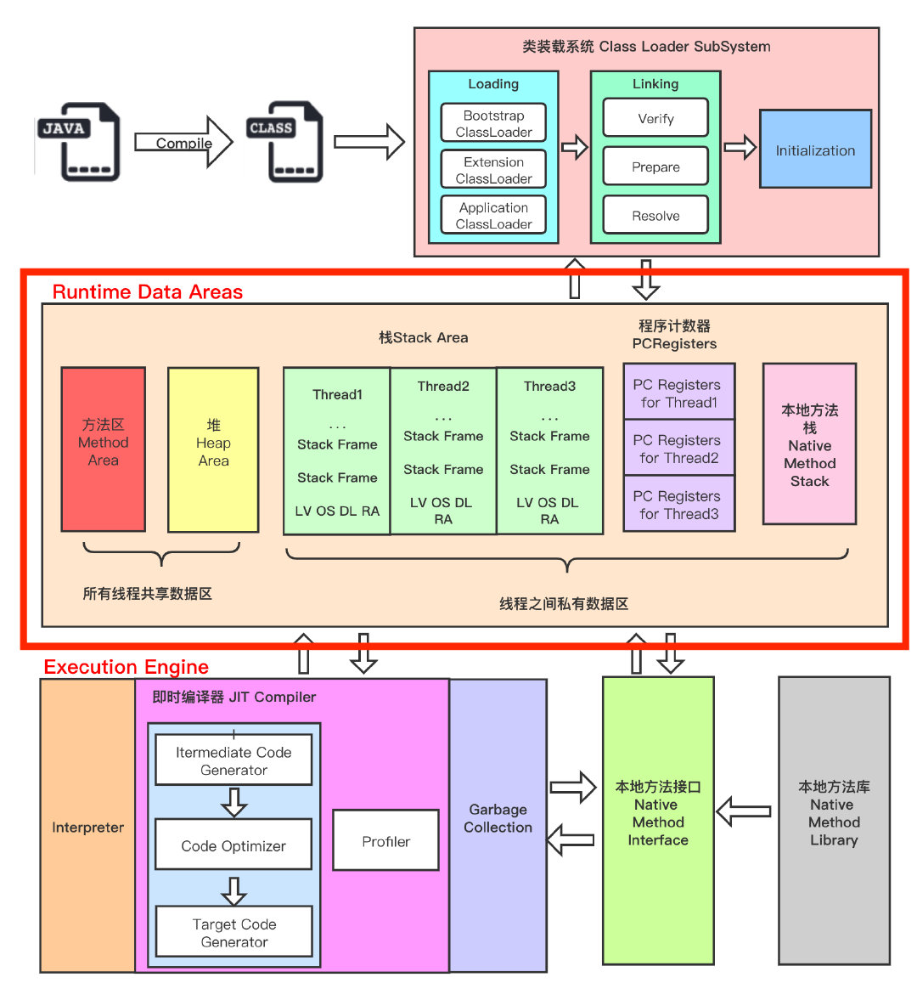
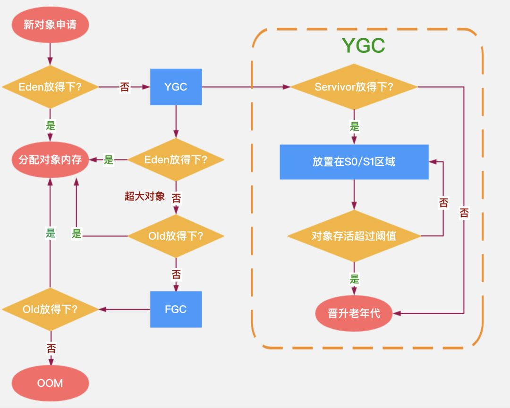
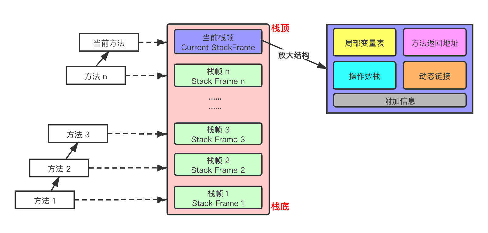
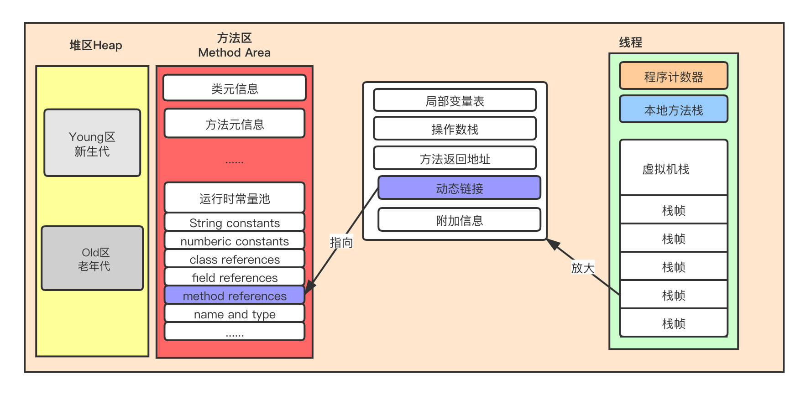
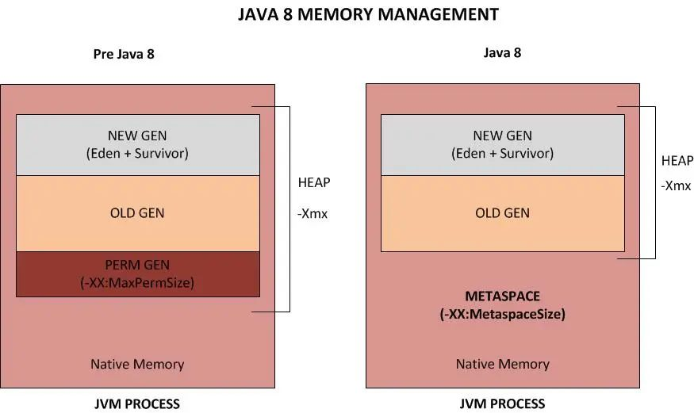
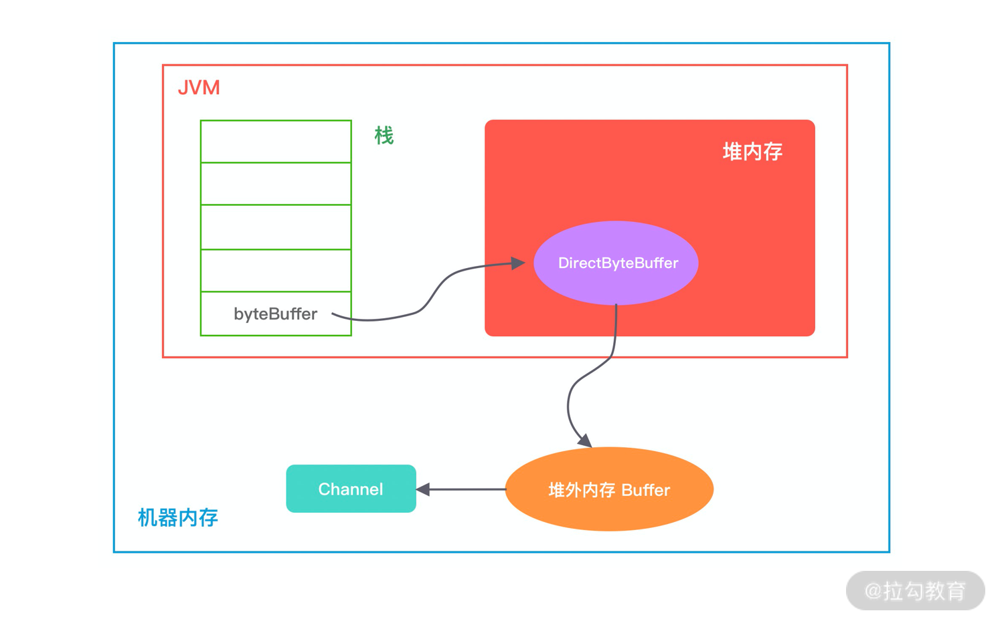

# 运行时数据区



## 堆&#x20;

**栈是运行时的单位，而堆是存储的单位**。

栈解决程序的运行问题，即程序如何执行，或者说如何处理数据。堆解决的是数据存储的问题，即数据怎么放、放在哪。

为了进行高效的垃圾回收，虚拟机把堆内存**逻辑上**划分成三块区域（分代的唯一理由就是优化 GC 性能）：

*   新生带（年轻代）：新对象和没达到一定年龄的对象都在新生代

*   老年代（养老区）：被长时间使用的对象，老年代的内存空间应该要比年轻代更大

*   元空间（JDK1.8 之前叫永久代）：像一些方法中的操作临时对象等，JDK1.8 之前是占用 JVM 内存，JDK1.8 之后直接使用物理内存


#### 年轻代 (Young Generation)

年轻代是所有新对象创建的地方。当填充年轻代时，执行垃圾收集。这种垃圾收集称为 **Minor GC**。年轻一代被分为三个部分——伊甸园（**Eden Memory**）和两个幸存区（**Survivor Memory**，被称为from/to或s0/s1），默认比例是`8:1:1`

*   大多数新创建的对象都位于 Eden 内存空间中

*   当 Eden 空间被对象填充时，执行**Minor GC**，并将所有幸存者对象移动到一个幸存者空间中

*   Minor GC 检查幸存者对象，并将它们移动到另一个幸存者空间。所以每次，一个幸存者空间总是空的

*   经过多次 GC 循环后存活下来的对象被移动到老年代。通常，这是通过设置年轻一代对象的年龄阈值来实现的，然后他们才有资格提升到老一代

#### 老年代(Old Generation)

旧的一代内存包含那些经过许多轮小型 GC 后仍然存活的对象。通常，垃圾收集是在老年代内存满时执行的。老年代垃圾收集称为 主GC（Major GC），通常需要更长的时间。

大对象直接进入老年代（大对象是指需要大量连续内存空间的对象）。这样做的目的是避免在 Eden 区和两个Survivor 区之间发生大量的内存拷贝


#### 元空间

不管是 JDK8 之前的永久代，还是 JDK8 及以后的元空间，都可以看作是 Java 虚拟机规范中方法区的实现。

虽然 Java 虚拟机规范把方法区描述为堆的一个逻辑部分，但是它却有一个别名叫 Non-Heap（非堆），目的应该是与 Java 堆区分开。

这部分内部可参考 [深入理解堆外内存 Metaspace](<深入理解堆外内存 Metaspace/深入理解堆外内存 Metaspace.md> "深入理解堆外内存 Metaspace")

### 对象晋升和GC过程&#x20;


整体流程如图：



新生代：

*   存活对象会反复在S0和S1之间移动，当对象从Eden移动到Survivor或者在Survivor之间移动时，对象的GC年龄自动累加，当GC年龄超过默认阈值15时，会将该对象移动到老年代，可以通过参数-XX:MaxTenuringThreshold 对GC年龄的阈值进行设置。

*   &#x20;大对象直接进入老年代 所谓大对象就是大量连续内存空间的对象  -XX:PretenureSizeThreshold参数，令大于这个值的对象直接进入老年代

*   空间分配担保：当 JVM 无法为一个新的对象分配空间时会触发 Minor GC，比如当 Eden 区满了就会进行MinorGC,在MinorGC之前 检查老年代最大连续可用空间是否大于新生代所有对象空间总和。

*   Minor GC触发条件：当Eden区满时，触发Minor GC。

老年代：

*   Major GC：清理老年代内存空间。 Major GC是俗称,Major GC通常是跟full GC是等价的，收集整个GC堆

*   老年代的对象比较稳定，所以MajorGC不会频繁执行。在进行MajorGC前一般都先进行了一次MinorGC，使得有新生代的对象晋升入老年代，导致空间不够用时才触发。当无法找到足够大的连续空间分配给新创建的较大对象时也会提前触发一次MajorGC进行垃圾回收腾出空间

FullGC: 针对新生代、老生代、元空间（Metaspace，Java 8 版本取代 PermGen ）的全局范围 GC 。

**FullGC  什么时候发产生？**

*   System.gc()方法的调用

*   老年代代空间不足

*   永生区空间不足

*   CMS GC时出现promotion failed和concurrent mode failure

*   统计得到的Minor GC晋升到旧生代的平均大小大于老年代的剩余空间

*   堆中分配很大的对象

stop the world (STW) 不管是新生代老生代都会产生STW,重点是时间长多久

## 栈

Java 虚拟机栈(Java Virtual Machine Stacks)，早期也叫 Java 栈。每个线程在创建的时候都会创建一个虚拟机栈，其内部保存一个个的栈帧(Stack Frame），对应着一次次 Java 方法调用，是线程私有的，生命周期和线程一致。

**作用**：主管 Java 程序的运行，它保存方法的局部变量、部分结果，并参与方法的调用和返回。

jdk8默认栈大小为1M，可以设置JVM 启动参数，使用 `-Xss1M` ：设置每个线程的堆栈大小

```bash
❯ java -XX:+PrintFlagsFinal -version | grep -i 'stack'
     intx CompilerThreadStackSize                   = 0                                   {pd product}
    uintx GCDrainStackTargetSize                    = 64                                  {product}
     bool JavaMonitorsInStackTrace                  = true                                {product}
    uintx MarkStackSize                             = 4194304                             {product}
    uintx MarkStackSizeMax                          = 536870912                           {product}
     intx MaxJavaStackTraceDepth                    = 1024                                {product}
     bool OmitStackTraceInFastThrow                 = true                                {product}
     intx OnStackReplacePercentage                  = 140                                 {pd product}
     intx StackRedPages                             = 1                                   {pd product}
     intx StackShadowPages                          = 20                                  {pd product}
     bool StackTraceInThrowable                     = true                                {product}
     intx StackYellowPages                          = 2                                   {pd product}
     intx ThreadStackSize                           = 1024                                {pd product}
     bool UseOnStackReplacement                     = true                                {pd product}
     intx VMThreadStackSize                         = 1024                                {pd product}
java version "1.8.0_231"
Java(TM) SE Runtime Environment (build 1.8.0_231-b11)
Java HotSpot(TM) 64-Bit Server VM (build 25.231-b11, mixed mode)
 
```

**栈中可能出现的异常**：

Java 虚拟机规范允许 **Java虚拟机栈的大小是动态的或者是固定不变的**

*   如果采用固定大小的 Java 虚拟机栈，那每个线程的 Java 虚拟机栈容量可以在线程创建的时候独立选定。如果线程请求分配的栈容量超过 Java 虚拟机栈允许的最大容量，Java 虚拟机将会抛出一个 **StackOverflowError** 异常

*   如果 Java 虚拟机栈可以动态扩展，并且在尝试扩展的时候无法申请到足够的内存，或者在创建新的线程时没有足够的内存去创建对应的虚拟机栈，那 Java 虚拟机将会抛出一个**OutOfMemoryError**异常

可以通过参数`-Xss`来设置线程的最大栈空间，栈的大小直接决定了函数调用的最大可达深度。

官方提供的参考工具，可查一些参数和操作：[https://docs.oracle.com/javase/8/docs/technotes/tools/windows/java.html#BGBCIEFC](https://docs.oracle.com/javase/8/docs/technotes/tools/windows/java.html#BGBCIEFC "https://docs.oracle.com/javase/8/docs/technotes/tools/windows/java.html#BGBCIEFC")

### 栈帧的内部结构

每个栈帧（Stack Frame）中存储着：&#x20;

*   局部变量表（Local Variables）&#x20;

*   操作数栈（Operand Stack）(或称为表达式栈)&#x20;

*   动态链接（Dynamic Linking）：指向运行时常量池的方法引用&#x20;

*   方法返回地址（Return Address）：方法正常退出或异常退出的地址&#x20;

*   一些附加信息



*   **局部变量表中的变量也是重要的垃圾回收根节点，只要被局部变量表中直接或间接引用的对象都不会被回收**

*   局部变量表第0位索引存储的是所属对象实例的引用 ，即this

*   操作数栈，**主要用于保存计算过程的中间结果，同时作为计算过程中变量临时的存储空间，Java虚拟机的解释引擎是基于栈的执行引擎**，其中的栈指的就是操作数栈

### 动态链接

*   **每一个栈帧内部都包含一个指向运行时常量池中该栈帧所属方法的引用**。包含这个引用的目的就是为了支持当前方法的代码能够实现动态链接(Dynamic Linking)。

*   在 Java 源文件被编译到字节码文件中时，所有的变量和方法引用都作为**符号引用**（Symbolic Reference）保存在 Class 文件的常量池中。比如：描述一个方法调用了另外的其他方法时，就是通过常量池中指向方法的符号引用来表示的，那么**动态链接的作用就是为了将这些符号引用转换为调用方法的直接引用**



在 JVM 中，将符号引用转换为调用方法的直接引用与方法的绑定机制有关

*   **静态链接**：当一个字节码文件被装载进 JVM 内部时，如果被调用的**目标方法在编译期可知**，且运行期保持不变时。这种情况下将调用方法的符号引用转换为直接引用的过程称之为静态链接

*   **动态链接**：如果被调用的方法在编译期无法被确定下来，也就是说，只能在程序运行期将调用方法的符号引用转换为直接引用，由于这种引用转换过程具备动态性，因此也就被称之为动态链接

对应的方法的绑定机制为：早期绑定（Early Binding）和晚期绑定（Late Binding）。**绑定是一个字段、方法或者类在符号引用被替换为直接引用的过程，这仅仅发生一次**。

*   早期绑定：**早期绑定就是指被调用的目标方法如果在编译期可知，且运行期保持不变时**，即可将这个方法与所属的类型进行绑定，这样一来，由于明确了被调用的目标方法究竟是哪一个，因此也就可以使用静态链接的方式将符号引用转换为直接引用。

*   晚期绑定：如果被调用的方法在编译器无法被确定下来，只能够在程序运行期根据实际的类型绑定相关的方法，这种绑定方式就被称为晚期绑定。

### 方法调用&#x20;

方法调用不同于方法执行，方法调用阶段的唯一任务就是确定被调用方法的版本（即调用哪一个方法），暂时还不涉及方法内部的具体运行过程。

Class 文件的编译过程中不包括传统编译器中的连接步骤，一切方法调用在 Class文件里面存储的都是符号引用，而不是方法在实际运行时内存布局中的入口地址（直接引用）。也就是需要在类加载阶段，甚至到运行期才能确定目标方法的直接引用。

#### 解析

所有方法调用中的目标方法在Class文件里面都是一个常量池中的符号引用 ，在类加载的解析阶段，会将其中一部分符号引用转化为直接引用 ，这种解析能成立的前提是：方法在程序真正运行之前就有一个可确定 的调用版本，并且这个方法的调用版本在运行期是不可改变的。换句话说，调用目标在程序代码写好、编译器进行编译时就必须确定下来，这类方法的调用 称为 解析（Resolution）

#### 分派

解析调用一定是个静态的过程 ，在编译期间就完全确定，在类装载的解析阶段就会把涉及的符号引用全部转变为可确定的直接引用 ，不会延迟到运行期再去完成。而分派调用则可能是静态的也可能是动态的。可参参考： [java 方法重载与静态分派](<../../语法/java 方法重载与静态分派/java 方法重载与静态分派.md> "java 方法重载与静态分派")

## 本地方法栈

简单的讲，一个 Native Method 就是一个 Java 调用非 Java 代码的接口。我们知道的 Unsafe 类就有很多本地方法。

### 为什么要使用本地方法（Native Method）?

Java 使用起来非常方便，然而有些层次的任务用 Java 实现起来也不容易，或者我们对程序的效率很在意时，问题就来了&#x20;

*   与 Java 环境外交互：有时 Java 应用需要与 Java 外面的环境交互，这就是本地方法存在的原因。&#x20;

*   与操作系统交互：JVM 支持 Java 语言本身和运行时库，但是有时仍需要依赖一些底层系统的支持。通过本地方法，我们可以实现用 Java 与实现了 jre 的底层系统交互， JVM 的一些部分就是 C 语言写的。&#x20;

*   Sun's Java：Sun的解释器就是C实现的，这使得它能像一些普通的C一样与外部交互。jre大部分都是用 Java 实现的，它也通过一些本地方法与外界交互。比如，类 java.lang.Thread 的 setPriority() 的方法是用Java 实现的，但它实现调用的是该类的本地方法 setPrioruty()，该方法是C实现的，并被植入 JVM 内部。

## 程序计数器

程序计数寄存器（**Program Counter Register**）

*   程序计数器是一块较小的内存空间，可以看作是当前线程所执行的字节码的**行号指示器**。

*   PC 寄存器用来存储指向下一条指令的地址，即将要执行的指令代码。由执行引擎读取下一条指令。

**使用PC寄存器存储字节码指令地址有什么用呢？为什么使用PC寄存器记录当前线程的执行地址呢？**

&#x20;因为CPU需要不停的切换各个线程，这时候切换回来以后，就得知道接着从哪开始继续执行。JVM的字节码解释器就需要通过改变PC寄存器的值来明确下一条应该执行什么样的字节码指令。&#x20;

**PC寄存器为什么会被设定为线程私有的？**

多线程在一个特定的时间段内只会执行其中某一个线程方法，CPU会不停的做任务切换，这样必然会导致经常中断或恢复。为了能够准确的记录各个线程正在执行的当前字节码指令地址，所以为每个线程都分配了一个PC寄存器，每个线程都独立计算，不会互相影响。

## 方法区

方法区存放的是什么数据？



METASPACE 存在于非堆空间。这部分可以参考 [深入理解堆外内存 Metaspace](<深入理解堆外内存 Metaspace/深入理解堆外内存 Metaspace.md> "深入理解堆外内存 Metaspace")

方法区（method area）只是 JVM 规范中定义的一个概念，用于存储类信息、常量池、静态变量、JIT编译后的代码等数据，并没有规定如何去实现它，不同的厂商有不同的实现。而永久代（PermGen）是 Hotspot 虚拟机特有的概念， Java8 的时候又被元空间取代了，永久代和元空间都可以理解为方法区的落地实现。

### 方法区在 JDK6、7、8中的演进细节

只有 HotSpot 才有永久代的概念

| jdk1.6及之前 | 有永久代，静态变量存放在永久代上                                    |
| --------- | --------------------------------------------------- |
| jdk1.7    | 有永久代，但已经逐步“去永久代”，字符串常量池、静态变量移除，保存在堆中                |
| jdk1.8及之后 | 取消永久代，类型信息、字段、方法、常量保存在本地内存的元空间，**但字符串常量池、静态变量仍在堆中** |

## 堆外内存


GC 主要工作在 Heap 区和 MetaSpace 区（上图蓝色部分），在 Direct Memory 中，如果使用的是 **DirectByteBuffer**（它有着[零拷贝](../../../Linux/Linux%20内存管理/零拷贝/零拷贝.md "零拷贝")等特点），那么在分配内存不够时则是 GC 通过 `Cleaner#clean` 间接管理。

有关堆外内存之的Metaspace部分可以参考 [深入理解堆外内存 Metaspace](深入理解堆外内存%20Metaspace/深入理解堆外内存%20Metaspace.md "深入理解堆外内存 Metaspace")

**堆外内存和堆内内存各有利弊，这里我针对其中重要的几点进行说明。**

1.  堆内内存由 JVM GC 自动回收内存，降低了 Java 用户的使用心智，但是 GC 是需要时间开销成本的，堆外内存由于不受 JVM 管理，所以在一定程度上可以降低 GC 对应用运行时带来的影响。

2.  堆外内存需要手动释放，这一点跟 C/C++ 很像，稍有不慎就会造成应用程序内存泄漏，当出现内存泄漏问题时排查起来会相对困难。

3.  当进行网络 I/O 操作、文件读写时，堆内内存都需要转换为堆外内存，然后再与底层设备进行交互，这一点在介绍 writeAndFlush 的工作原理中也有提到，所以直接使用堆外内存可以减少一次内存拷贝。

4.  堆外内存可以实现进程之间、JVM 多实例之间的数据共享。

由此可以看出，如果你想实现高效的 I/O 操作、缓存常用的对象、降低 JVM GC 压力，堆外内存是一个非常不错的选择。

**Java 中堆外内存的分配方式有两种：ByteBuffer#allocateDirect和Unsafe#allocateMemory。**

如下图所示，描述了 DirectByteBuffer 的内存引用情况，方便你更好地理解上述源码的初始化过程。在堆内存放的 DirectByteBuffer 对象并不大，仅仅包含堆外内存的地址、大小等属性，同时还会创建对应的 Cleaner 对象，通过 ByteBuffer 分配的堆外内存不需要手动回收，它可以被 JVM 自动回收。当堆内的 DirectByteBuffer 对象被 GC 回收时，Cleaner 就会用于回收对应的堆外内存。



### 堆外内存的回收

因为 JVM 并不知道堆外内存是不是已经不足了，所以我们最好通过 JVM 参数 -XX:MaxDirectMemorySize 指定堆外内存的上限大小，当堆外内存的大小超过该阈值时，就会触发一次 Full GC 进行清理回收，如果在 Full GC 之后还是无法满足堆外内存的分配，那么程序将会抛出 OOM 异常。

此外在 ByteBuffer.allocateDirect 分配的过程中，如果没有足够的空间分配堆外内存，在 Bits.reserveMemory 方法中也会主动调用 System.gc() 强制执行 Full GC，但是在生产环境一般都是设置了 -XX:+DisableExplicitGC，System.gc() 是不起作用的，所以依赖 System.gc() 并不是一个好办法。

DirectByteBuffer 在初始化时会创建一个 Cleaner 对象，它会负责堆外内存的回收工作，那么 Cleaner 是如何与 GC 关联起来的呢？

当初始化堆外内存时，内存中的对象引用情况如下图所示，first 是 Cleaner 类中的静态变量，Cleaner 对象在初始化时会加入 Cleaner 链表中。DirectByteBuffer 对象包含堆外内存的地址、大小以及 Cleaner 对象的引用，ReferenceQueue 用于保存需要回收的 Cleaner 对象。


当发生 GC 时，DirectByteBuffer 对象被回收，内存中的对象引用情况发生了如下变化：


此时 Cleaner 对象不再有任何引用关系，在下一次 GC 时，该 Cleaner 对象将被添加到 ReferenceQueue 中，并执行 clean() 方法。clean() 方法主要做两件事情：

1.  将 Cleaner 对象从 Cleaner 链表中移除；

2.  调用 unsafe.freeMemory 方法清理堆外内存。

## 参考

*   [https://pdai.tech/md/java/jvm/java-jvm-struct.html](https://pdai.tech/md/java/jvm/java-jvm-struct.html "https://pdai.tech/md/java/jvm/java-jvm-struct.html")

*   &#x20;[http://blog.csdn.net/chenleixing/article/details/46706039](http://blog.csdn.net/chenleixing/article/details/46706039 "http://blog.csdn.net/chenleixing/article/details/46706039")

*   [https://www.zhihu.com/question/41922036](https://www.zhihu.com/question/41922036 "https://www.zhihu.com/question/41922036")

*   https://learn.lianglianglee.com

[深入理解堆外内存 Metaspace](深入理解堆外内存%20Metaspace/深入理解堆外内存%20Metaspace.md "深入理解堆外内存 Metaspace")
