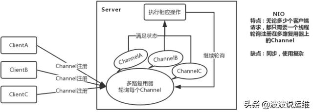
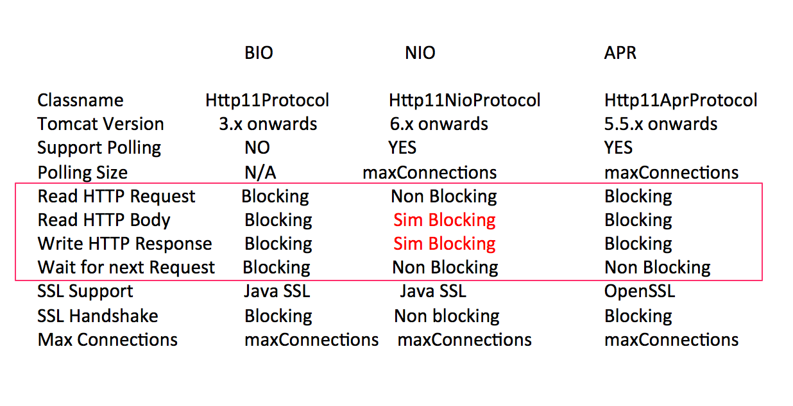
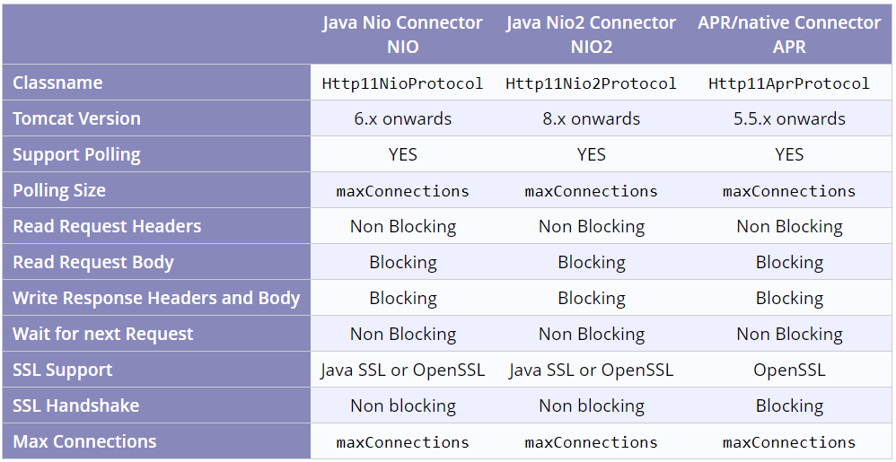

# tomcat

## 四种运行模式（BIO, NIO, APR,AIO）

四种运行模式 ，也可以称为线程模型

### BIO

阻塞IO，没经过任何优化和处理，几百并发性能极低下。

Tomcat8.0起已经默认nio模式，不需要做修改，BIO模式也已经抛弃

配置server.xml

```xml
<Connector port="8080" protocol="HTTP/1.1" 
 connectionTimeout="20000" 
 redirectPort="8443"  
URIEncoding="UTF-8"/> 
```

BIO方式适用于连接数目比较小且固定的架构，这种方式对服务器资源要求比较高，并发局限于应用中，JDK1.4以前的唯一选择，但程序直观简单易理解。

### NIO

利用java的异步io技术,no blocking IO技术

配置server.xml

```xml
<Connector port="8080" protocol="org.apache.coyote.http11.Http11NioProtocol" 
 connectionTimeout="20000" 
 redirectPort="8443"  
URIEncoding="UTF-8"/> 
```

NIO方式适用于连接数目多且连接比较短(轻操作)的架构，比如聊天服务器，并发局限于应用中，编程比较复杂，JDK1.4开始支持。



### APR(Apache Portable Runtime/Apache 可移植运行库)

安装最困难，操作系统级别的控制，但也是在Tomcat上运行高并发应用的模式

> **APR(Apache Portable Runtime/Apache 可移植运行库)**，它是用 C 语言实现的，其目的是向上层应用程序提供一个跨平台的操作系统接口库。Tomcat可以用它来处理包括文件和网络 I/O，从而提升性能。Tomcat 支持的连接器有 NIO、NIO.2 和 APR。跟NioEndpoint 一样，AprEndpoint 也实现了非阻塞 I/O，它们的区别是：NioEndpoint 通过调用 Java 的NIO API 来实现非阻塞 I/O，而 AprEndpoint 是通过 JNI 调用 APR 本地库而实现非阻塞 I/O 的那同样是非阻塞 I/O，为什么 Tomcat 会提示使用 APR 本地库的性能会更好呢？这是因为在某些场景下，比如需要频繁与操作系统进行交互，Socket 网络通信就是这样一个场景，特别是如果你的 Web 应用使用了 TLS 来加密传输，我们知道 TLS 协议在握手过程中有多次网络交互，在这种情况下 Java 跟 C 语言程序相比还是有一定的差距，而这正是 APR 的强项。

配置server.xml

```xml
<Connector port="8080" protocol="org.apache.coyote.http11.Http11AprProtocol" 
 connectionTimeout="20000" 
 redirectPort="8443"  
URIEncoding="UTF-8"/> 
```

配置apr模式之后还需要安装 apr 、 apr-utils 、tomcat-native包

### AIO

真正的异步 IO ，也叫 NIO2

### 小结

**BIO：**

*   一个线程处理一个请求。缺点：并发量高时，线程数较多，浪费资源。

*   Tomcat7或以下，在Linux系统中默认使用这种方式。

**NIO：**

*   利用Java的异步IO处理，可以通过少量的线程处理大量的请求。

*   Tomcat8在Linux系统中默认使用这种方式。

**APR：**

*   即Apache Portable Runtime，从操作系统层面解决io阻塞问题。

*   Tomcat7或Tomcat8在Win7或以上的系统中启动默认使用这种方式。

\*\*AIO: \*\*

*   异步非阻塞 (NIO2)，tomcat8.0后支持。多用于连接数目多且连接比较长（重操作）的架构，比如相册服务器，充分调用OS参与并发操作，编程比较复杂，JDK7开始支持。 &#x20;

*   使用方法(配置server.xml)：protocol ="org.apache.coyote.http11.Http11Nio2Protocol"

*   AIO 和 NIO2 是一个东西

对比：



一些区别：



### springboot&#x20;

在Springboot中内嵌的Tomcat默认启动开启的是NIO模式，可以通过log看到Connector使用的是哪一种运行模式，线程名叫http-nio-8080-exec-1之类的

springboot 下开启APR 可以参考：[https://blog.csdn.net/w57685321/article/details/109358717](https://blog.csdn.net/w57685321/article/details/109358717 "https://blog.csdn.net/w57685321/article/details/109358717")

## 配置

### 最大连接数

tomcat的最大连接数参数是`maxConnections`，这个值表示最多可以有多少个socket连接到tomcat上。

*   BIO模式下默认最大连接数是它的最大线程数(缺省是200)

*   NIO模式下默认是10000

*   APR模式则是8192(windows上则是低于或等于maxConnections的1024的倍数)。

*   如果设置为-1则表示不限制

&#x20;

### acceptCount

### maxThreads

## 问题

### tomcat能解决c10k 问题吗？

看[文档](https://tomcat.apache.org/tomcat-8.5-doc/config/http.html "文档")：

> The maximum number of connections that the server will accept and process at any given time. When this number has been reached, the server will accept, but not process, one further connection. This additional connection be blocked until the number of connections being processed falls below **maxConnections** at which point the server will start accepting and processing new connections again. Note that once the limit has been reached, the operating system may still accept connections based on the `acceptCount` setting. The default value varies by connector type. For NIO and NIO2 the default is `10000`. For APR/native, the default is `8192`.
>
> For NIO/NIO2 only, setting the value to -1, will disable the maxConnections feature and connections will not be counted.

要看选用的是哪个模式以及`maxConnections`  的配置

*   BIO，肯定不行，NIO和APR模式默认配置也不行

*   在 NIO及NIO2模式下，`maxConnections` 配置为 -1 可以

## 参考

*   [https://time.geekbang.org/column/article/101201](https://time.geekbang.org/column/article/101201 "https://time.geekbang.org/column/article/101201")

*   [https://www.cnblogs.com/kismetv/p/7806063.html#t22](https://www.cnblogs.com/kismetv/p/7806063.html#t22 "https://www.cnblogs.com/kismetv/p/7806063.html#t22")

*   [https://stackoverflow.com/questions/42219637/spring-boot-tomcat-is-able-to-offer-only-lesser-than-10-000-connections](https://stackoverflow.com/questions/42219637/spring-boot-tomcat-is-able-to-offer-only-lesser-than-10-000-connections "https://stackoverflow.com/questions/42219637/spring-boot-tomcat-is-able-to-offer-only-lesser-than-10-000-connections")
