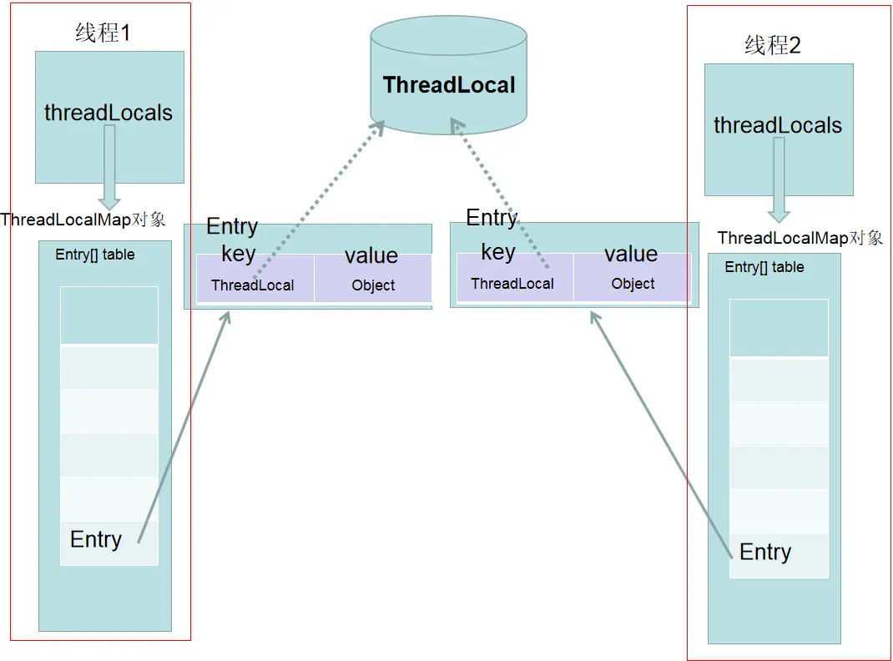
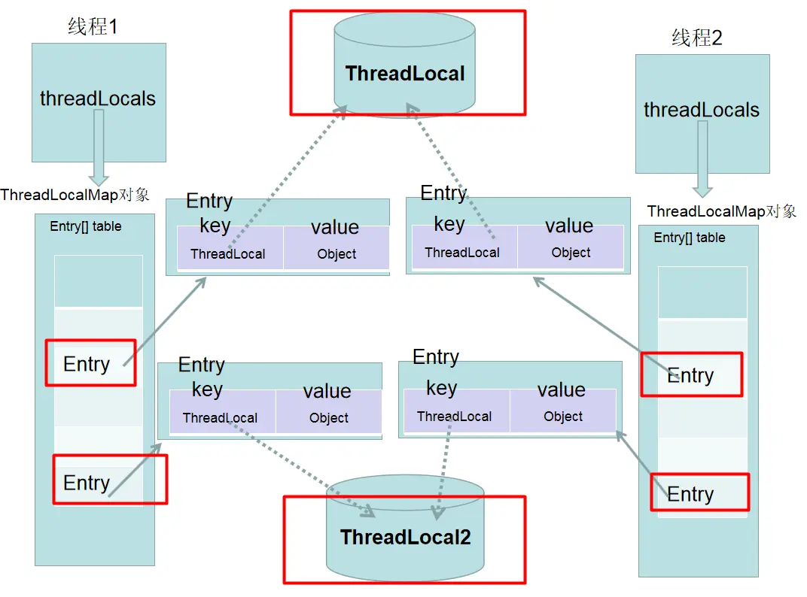
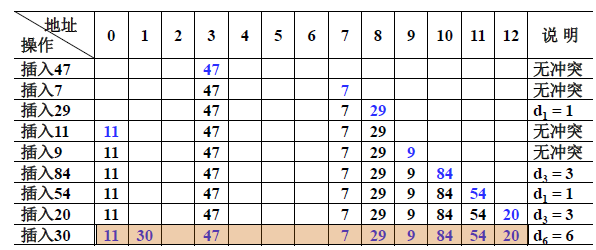
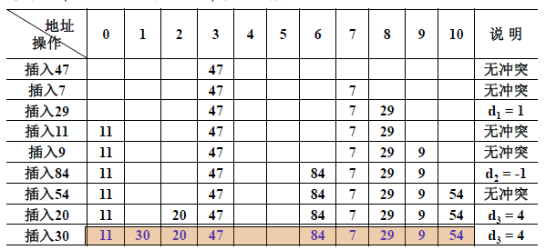

# ThreadLocal

## 定义

> Each thread holds an implicit reference to its copy of a thread-local variable as long as the thread is alive and the ThreadLocal instance is accessible; after a thread goes away, all of its copies of thread-local instances are subject to garbage collection (unless other references to these copies exist).
>
> 只要线程处于活动状态并且 ThreadLocal实例可访问，那么每个线程都持有对其线程局部变量（thread-local）副本的`隐式`引用。在线程消失后，它的所有线程局部变量（thread-local）副本都将被垃圾回收（**除非存在对这些副本的其他引用**）

每个线程都持有对其线程局部变量（thread-local）副本的`隐式`引用 ？

从线程的角度看，**每一个线程Thread对象，都有一个threadLocals属性**，以下为`Thread` 类源码：

```java
    /* ThreadLocal values pertaining to this thread. This map is maintained
     * by the ThreadLocal class. */
    ThreadLocal.ThreadLocalMap threadLocals = null;
    /*
     * InheritableThreadLocal values pertaining to this thread. This map is
     * maintained by the InheritableThreadLocal class.
     */
    ThreadLocal.ThreadLocalMap inheritableThreadLocals = null; 
```

> This class provides thread-local variables. These variables differ from their normal counterparts in that each thread that accesses one (via its get or set method) has its own, independently initialized copy of the variable. ThreadLocal instances are typically private static fields in classes that wish to associate state with a thread (e.g., a user ID or Transaction ID).
>
> ThreadLocal 实例通常是希望将**状态**与线程相关联的类中的私有静态字段（例如，用户 ID 或事务 ID）。

比如下面这段代码，为每个线程生产一个唯一ID，线程的 id 在第一次调用 ThreadId.get() 时被分配，并且在后续调用中保持不变。

```java
 import java.util.concurrent.atomic.AtomicInteger;
  
   public class ThreadId {
       // Atomic integer containing the next thread ID to be assigned
       private static final AtomicInteger nextId = new AtomicInteger(0);
  
       // Thread local variable containing each thread's ID
       private static final ThreadLocal<Integer> threadId =
           new ThreadLocal<Integer>() {
               @Override protected Integer initialValue() {
                   return nextId.getAndIncrement();
           }
       };
  
       // Returns the current thread's unique ID, assigning it if necessary
       public static int get() {
           return threadId.get();
       }
   }
   
```

### 总结

*   **Thread**: `ThreadLocal` 顾名思义，它不是一个线程，而是线程的一个本地化对象。当工作于多线程中的对象使用 `ThreadLocal` 维护变量时，`ThreadLocal` 为每个使用该变量的线程分配一个独立的变量副本。

*   **Local** ThreadLocal 类允许我们创建只能被同一个线程读写的变量。因此，**如果一段代码含有一个 ThreadLocal 变量的引用，即使两个线程同时执行这段代码，它们也无法访问到对方的 ThreadLocal 变量。所以每一个线程都可以独立地改变自己的副本，而不会影响其他线程所对应的副本。从线程的角度看，这个变量就像是线程的本地变量，这也是类名中 “Local” 所要表达的意思。

*   **线程的数据隔离**：**`ThreadLocal` 提供了线程的局部变量副本，每个线程都可以通过`set()`和`get()`来对这个局部变量进行操作，但不会和其他线程的局部变量进行冲突。其实就是你创建了一个 `Threadlocal` 变量，每个访问 `Threadlocal` 变量的线程都有一个本地副本，往`ThreadLocal `中填充的变量属于**当前线程，该变量对其他线程而言是隔离的。

*   **有状态数据同**步：`ThreadLocal`的作用是提供线程内的局部变量，这种变量在线程的生命周期内起作用，减少同一个线程内多个函数或者组件之间一些公共变量的传递的复杂度。**并不是解决多线程问题的，而是解决单个线程内部的变量共享的问题**

## 数据结构



**一个 ThreadLocal 只能存储一个 Object 对象，如果需要存储多个 Object 对象那么就需要多个 ThreadLocal**，如下图：



## ThreadLocalMap

`ThreadLocalMap`有点类似`HashMap`的结构，只是`HashMap`是由**数组+链表**实现的，而`ThreadLocalMap`中并没有**链表**结构。

### 如何解决hash冲突 ？

首先了解一下 ThreadLocalMap的hash算法 `int i = key.threadLocalHashCode & (len-1)`

`ThreadLocalMap`中`hash`算法很简单，这里`i`就是当前 key 在散列表中对应的数组下标位置。这里最关键的就是`threadLocalHashCode`值的计算，`ThreadLocal`中有一个属性为`HASH_INCREMENT = 0x61c88647`。这个值很特殊，它是**斐波那契数** 也叫 **黄金分割数**。`hash`增量为 这个数字，带来的好处就是 `hash` **分布非常均匀**。

由于ThreadLocalMap的数据结构 和 HashMap不一样，所以解决冲突的方法也不同，HashMap是利用链地址法解决的，而ThreadLocalMap是利用开放地址法。

开放地址法：

> 当我们往哈希表中插入数据时，如果某个数据经过哈希函数之后，存储位置已经被占用了，我们就从当前位置开始，依次往后查找，看是否有空闲位置，直到找到为止。

开放地址法下不同的解决冲突方案：

*   线性探测法

*   平方探测法

*   双散列

**线性探测法**

举例：

> 32 ％ 7 = 4 ；&#x20;
> 13 ％ 7 = 6 ；&#x20;
> 49 ％ 7 = 0 ；  &#x20;
> 55 ％ 7 = 6 发生冲突，下一个存储地址（ 6 ＋ 1 ）％ 7 ＝ 0 ，仍然发生冲突，
> 再下一个存储地址：（ 6 ＋ 2 ）％ 7 ＝ 1 未发生冲突，可以存入。

线性探测法要求hash表空间足够大，另外它还有一个问题：如果计算散列地址时，较多的元素计算出同一个散列地址，那么就会出现 `一次聚集（primary clustering）` 现象，明明还有空间，却都往一个地方挤。聚集地方的冲突会越来越多，探测时间也越来越长。如下图：



**平方探测法**

为了解决聚集的问题，平方探测法的思路是：探测时不一个挨着一个地向后探测，跳跃着探测。

跳跃着探测，这样就避免了一次聚集



但是它也有一个小问题，就是关键字key散列到同一位置后**探测时的路径是一样的**。这样对于许多落在同一位置的关键字而言，越是后面插入的元素，探测的时间就越长。这种现象被称作 `二次聚集(secondary clustering)`

**双散列**

`二次聚集(secondary clustering)` 出现的原因是由于对于落在同一个位置的关键字我们采取了一个依赖的函数（平方函数）来进行探测，它不会因为关键字的不同或其他因素而改变探测的路径。

*   那么可以让探测的方法依赖于关键字，再另外建一个Hash函数（hash2），对落在同一个位置的关键字进行再次的Hash,探测的时候就用依赖这个Hash值去探测，即为双散列。

*   由于Hash2函数不同于Hash1,所以两个不同的关键字Hash1值和Hash2值同时相同的概率就会变得非常低。这样就避免了二次聚集，但同时也付出了计算另一个散列函数Hash2的代价。

**再散列（Rehashing）**

*   当散列表元素太多（即装填因子α太大）时，查找效率会下降；最大装填因子一般取 0.5 <= α<= 0.85&#x20;

*   当装填因子过大时，解决的方法是加倍扩大散列表，这个过程叫做“再散列（Rehashing）”

注意：散列表扩大时，原有元素需要重新计算放置到新表中

**ThreadLocalMap处理哈希冲突时使用的是****线性探测法****,因此删除key的时候不能直接简单把entry置为null; 它采用的方法是把后续每个不为null的entry进行rehash, 放在合适的位置,保证不会因为删除导致线性探测失效中断。**

具体参考源码：

```java
 private void set(ThreadLocal<?> key, Object value) {

            // We don't use a fast path as with get() because it is at
            // least as common to use set() to create new entries as
            // it is to replace existing ones, in which case, a fast
            // path would fail more often than not.

            Entry[] tab = table;
            int len = tab.length;
            int i = key.threadLocalHashCode & (len-1);

            for (Entry e = tab[i];
                 e != null;
                 e = tab[i = nextIndex(i, len)]) {
                ThreadLocal<?> k = e.get();
  
            ...
  }
            
  private static int nextIndex(int i, int len) {
            return ((i + 1 < len) ? i + 1 : 0);
  } 
```

### 如何扩容？

ThreadLocalMap 在进行扩容之前会先进行清理工作，

有两种清除方式:

*   expungeStaleEntry()  探测式清理

*   cleanSomeSlots() 启发式清除

**探测式清理**： 是以当前遇到的 GC 元素开始，向后不断的清理。直到遇到 null 为止&#x20;

```java
private int expungeStaleEntry(int staleSlot) {
            Entry[] tab = table;
            int len = tab.length;

            // 首先将 tab[staleSlot] 槽位的数据清空
            // 然后设置 然后设置size--
            tab[staleSlot].value = null;
            tab[staleSlot] = null;
            size--;

            // Rehash until we encounter null
            Entry e;
            int i;
            // 以 staleSlot 位置往后迭代
            for (i = nextIndex(staleSlot, len);
                 (e = tab[i]) != null;
                 i = nextIndex(i, len)) {
                ThreadLocal<?> k = e.get();
                // 如果遇到 key == null 的 过期数据，也是清空该槽位数据，然后 size--
                if (k == null) {
                    e.value = null;
                    tab[i] = null;
                    size--;
                } else {
                  // 如果 key != null 表示key没有过期，重新计算当前key的下标位置是不是当前槽位下标位置
                  // 如果不是 h != i ，那么说明产生了 hash 冲突 ，此时以新计算出来正确的槽位位置往后迭代
                  // 找到最后一个存放 entry 的位置
                    int h = k.threadLocalHashCode & (len - 1);
                    if (h != i) {
                        tab[i] = null;
            // Unlike Knuth 6.4 Algorithm R, we must scan until
                        // null because multiple entries could have been stale.
            ----------   翻译   ----------
            /**
             * 这段话提及了Knuth的 R算法 我们和 R算法的不同
             * 我们必须扫描到null，因为可能多个条目可能过期
             * ThreadLocal使用了弱引用，即有多种状态，（已回收、未回收）所以不能安全按照R算法实现
             */
                        while (tab[h] != null)
                            h = nextIndex(h, len);
                        tab[h] = e;
                    }
                }
            }
            return i;
        }

```

探测式清理结束后，数组中过期的元素应该会被部分清除，而且之前发生 `Hash冲突` 的Entry元素的位置应该更接近真实hash出来的位置。提升了查找的效率，这里探测式清理并不能全部清除数组中的过期元素，而是从传入的下标清理到第一个 `Entry==null` 为止。部分清除。其余的部分，需要通过 **启发式清**除

**启发式清除：**

> Heuristically scan some cells looking for stale entries. This is invoked when either a new element is added, or another stale one has been expunged. It performs a logarithmic number of scans, as a balance between no scanning (fast but retains garbage) and a number of scans proportional to number of elements, that would find all garbage but would cause some insertions to take O(n) time.
>
> 试探的扫描一些单元格，寻找过期元素，也就是被垃圾回收的元素。当添加新元素或删除另一个过时元素时，将调用此函数。它执行对数扫描次数，作为不扫描（快速但保留垃圾）和与元素数量成比例的扫描次数之间的平衡，这将找到所有垃圾，但会导致一些插入花费 O（n）时间。

```java
private boolean cleanSomeSlots(int i, int n) {
            boolean removed = false;
            Entry[] tab = table;
            int len = tab.length;
            // do while 循环 循环中不断的右移进行寻找被清理的过期元素 
            // 最终都会使用expungeStaleEntry 进行处理
            do {
                i = nextIndex(i, len);
                Entry e = tab[i];
                if (e != null && e.get() == null) {
                    n = len;
                    removed = true;
                    i = expungeStaleEntry(i);
                }
            } while ( (n >>>= 1) != 0);
            return removed;
}

```

**注：ThreadLocal调用 set(), get(), remove()  都会对 key = null 进行清除 value 操作**

在ThreadLocalMap.set() 方法最后，如果执行完成启发式清理工作后，未清理到任何数据，且当前散列数组中 Entry 的数量已经达到了列表的扩容阀值 就开始执行 `rehash()` 逻辑。

```java
 if (!cleanSomeSlots(i, sz) && sz >= threshold)
       rehash();
```

**Entry\[] 数组的扩容阈值是 `len * 2 / 3`，数组长度的三分之二**

```java
// ThreadLocalMap 的初始容量是 16
private static final int INITIAL_CAPACITY = 16;

private void setThreshold(int len) {
     threshold = len * 2 / 3;
}

```

数组扩容之前会进行一次 **全面的清理**，直接用 `fori` 全部遍历数组中的每一个元素，如果发现过期的Entry就进行探测式清理。

```java
private void rehash() {
    expungeStaleEntries();
    if (size >= threshold - threshold / 4)
        resize();
}

private void expungeStaleEntries() {
    Entry[] tab = table;
    int len = tab.length;
    for (int j = 0; j < len; j++) {
        Entry e = tab[j];
        if (e != null && e.get() == null)
            expungeStaleEntry(j);
    }
} 
```

全面清理结束之后，会进一步判断数组的长度是否满足 `size >= threshold - threshold / 4`，也就是说，扩容前真正的阈值判断是 `len * 2/3 * 3/4`，也就是阈值真正的值是 **数组长度的1/2**。

每次扩容会将数组长度扩容至原来的2倍，然后遍历老数组，将老数组中的元素重新计算下标，并插入新数组。  插入时如果发生Hash冲突，那就向后遍历寻找空位。

```java
private void resize() {

      Entry[] oldTab = table;
      int oldLen = oldTab.length;
      int newLen = oldLen * 2;
      Entry[] newTab = new Entry[newLen];
      int count = 0;

      for (Entry e : oldTab) {
          if (e != null) {
              ThreadLocal<?> k = e.get();
              if (k == null) {
                  e.value = null; // Help the GC
              } else {
                  int h = k.threadLocalHashCode & (newLen - 1);
                  while (newTab[h] != null)
                      h = nextIndex(h, newLen);
                  newTab[h] = e;
                  count++;
              }
          }
      }

      setThreshold(newLen);
      size = count;
      table = newTab;
  }
```

### 如何清理过期key ?

&#x20;ThreadLocalMap 的 set 方法通过调用 replaceStaleEntry 方法（其内部也是调用了`启发示清除` 和 `探测式清除`）回收键为 null 的 Entry 对象的值（即为具体实例）以及 Entry 对象本身从而防止内存泄漏&#x20;

```java
 private void set(ThreadLocal<?> key, Object value) {

            // We don't use a fast path as with get() because it is at
            // least as common to use set() to create new entries as
            // it is to replace existing ones, in which case, a fast
            // path would fail more often than not.

            Entry[] tab = table;
            int len = tab.length;
            int i = key.threadLocalHashCode & (len-1);

            for (Entry e = tab[i];
                 e != null;
                 e = tab[i = nextIndex(i, len)]) {
                ThreadLocal<?> k = e.get();

                if (k == key) {
                    e.value = value;
                    return;
                }

                if (k == null) {
                    replaceStaleEntry(key, value, i);
                    return;
                }
            }
            ...
```

**应该在我们不使用的时候，主动调用 remove 方法进行清理。**

```java
try {
    // 其它业务逻辑
} finally {
    threadLocal对象.remove();
}
```

### 弱引用

ThreadLocalMap 的 Entry 对 ThreadLocal 的引用为弱引用（数据结构那节图中的虚线），弱引用的对象在 GC 时会被回收，避免了 ThreadLocal 对象无法被回收的问题&#x20;

这里复习一下java的对象引用&#x20;

*   强引用：new 出来的一般对象，只要引用在就不会被回收

*   软引用: 将要发生内存溢出之前回收

*   弱引用: 生存到下一次垃圾收集发生之前

*   虚引用：目的是对象被收集器回收时收到一个系统通知

```java
  /**
     * ThreadLocalMap is a customized hash map suitable only for
     * maintaining thread local values. No operations are exported
     * outside of the ThreadLocal class. The class is package private to
     * allow declaration of fields in class Thread.  To help deal with
     * very large and long-lived usages, the hash table entries use
     * WeakReferences for keys. However, since reference queues are not
     * used, stale entries are guaranteed to be removed only when
     * the table starts running out of space.
     */
    static class ThreadLocalMap {

        /**
         * The entries in this hash map extend WeakReference, using
         * its main ref field as the key (which is always a
         * ThreadLocal object).  Note that null keys (i.e. entry.get()
         * == null) mean that the key is no longer referenced, so the
         * entry can be expunged from table.  Such entries are referred to
         * as "stale entries" in the code that follows.
         */
        static class Entry extends WeakReference<ThreadLocal<?>> {
            /** The value associated with this ThreadLocal. */
            Object value;

            Entry(ThreadLocal<?> k, Object v) {
                super(k);
                value = v;
            }
        }
```

每个线程在往`ThreadLocal`里放值的时候，都会往自己的`ThreadLocalMap`里存，读也是以`ThreadLocal`作为引用，在自己的`map`里找对应的`key`，从而实现了**线程隔离**。

### ThreadLocal 类型变量为何声明为 static  ？

ThreadLocal 类的目的是为每个线程单独维护一个变量的值，避免线程间对同一变量的竞争访问，适用于一个变量在每个线程中需要有自己独立的值的场合。

如果把 ThreadLocal 声明为非静态，则在含有 ThreadLocal 变量的的每个实例中都会产生一个新对象，这是毫无意义的，只是增加了内存消耗。

## InheritableThreadLocal

ThreadLocal  固然很好，**但是子线程并不能取到父线程的 ThreadLocal 的变量**：

```java
 private static ThreadLocal<Integer> integerThreadLocal = new ThreadLocal<>();
   
    public static void main(String[] args) throws InterruptedException {
        integerThreadLocal.set(1001); // father
       
        new Thread(() -> System.out.println(Thread.currentThread().getName() + ":"
                + integerThreadLocal.get())).start();
    }
//output:
Thread-0:null
```

使用 ThreadLocal 不能继承父线程的 ThreadLocal 的内容，而使用 `InheritableThreadLocal` 时可以做到的，这就可以很好的在父子线程之间传递数据了。inheritableThreadLocal 继承了 ThreadLocal。

```java
private static InheritableThreadLocal<Integer> inheritableThreadLocal =
            new InheritableThreadLocal<>();
    public static void main(String[] args) throws InterruptedException {
  
        inheritableThreadLocal.set(1002); // father
        new Thread(() -> System.out.println(Thread.currentThread().getName() + ":"
                + inheritableThreadLocal.get())).start();
    }
//output:
Thread-0:1002 
```

这是如何实现的呢？ 实现父子线程间的局部变量共享需要追溯到 Thread 对象的构造方法：

```java
   private Thread(ThreadGroup g, Runnable target, String name,
                   long stackSize, AccessControlContext acc,
                   boolean inheritThreadLocals) {
        if (name == null) {
            throw new NullPointerException("name cannot be null");
        }
        
        ...
        
        this.group = g;
        this.daemon = parent.isDaemon();
        this.priority = parent.getPriority();
        if (security == null || isCCLOverridden(parent.getClass()))
            this.contextClassLoader = parent.getContextClassLoader();
        else
            this.contextClassLoader = parent.contextClassLoader;
        this.inheritedAccessControlContext =
                acc != null ? acc : AccessController.getContext();
        this.target = target;
        setPriority(priority);
        if (inheritThreadLocals && parent.inheritableThreadLocals != null)
            this.inheritableThreadLocals =
                ThreadLocal.createInheritedMap(parent.inheritableThreadLocals);
        /* Stash the specified stack size in case the VM cares */
        this.stackSize = stackSize;

        /* Set thread ID */
        this.tid = nextThreadID();
        
        ...      
  }
```

### 其他 ThreadLocal 实现

**Netty 的** **FastThreadLocal** ：

对 JDK 中 ThreadLocal 进行优化，由于 ThreadLocal 底层存储数据是一个 ThreadLocalMap  结构，是一个数组结构，通过 threadLocalHashCode 查找在数组中的元素 Entry ,  当 hash 冲突时，继续向前检测查找, 所以当 Hash 冲突时，检索的效率就会降低。而 FastThreadLocal 则正是处理了这个问题，使其时间复杂度一直为O(1)。可参考：[这里](https://www.cnblogs.com/stevenczp/p/7667719.html "这里")

**TransmittableThreadLocal：**

TransmittableThreadLocal 是Alibaba开源的、用于解决 **在使用线程池等会缓存线程的组件情况下传递 ThreadLocal**  问题的 InheritableThreadLocal 扩展。

> `TransmittableThreadLocal`(`TTL`)：在使用线程池等会池化复用线程的执行组件情况下，提供`ThreadLocal`值的传递功能，解决异步执行时上下文传递的问题。一个`Java`标准库本应为框架/中间件设施开发提供的标配能力，本库功能聚焦 & 0依赖，支持`Java` 17/16/15/14/13/12/11/10/9/8/7/6。

`JDK`的[InheritableThreadLocal](https://docs.oracle.com/javase/10/docs/api/java/lang/InheritableThreadLocal.html "InheritableThreadLocal")类可以完成父线程到子线程的值传递。但对于使用线程池等会池化复用线程的执行组件的情况，线程由线程池创建好，并且线程是池化起来反复使用的；这时父子线程关系的`ThreadLocal`值传递已经没有意义，应用需要的实际上是把 **任务提交给线程池时**的`ThreadLocal`值传递到 **任务执行时**。

## 内存泄露

ThreadLocalMap 使用 ThreadLocal 的弱引用作为key，如果一个 ThreadLocal 没有外部强引用来引用它，那么系统 GC 的时候，这个 ThreadLocal 势必会被回收，这样一来，ThreadLocalMap 中就会出现key为 null 的 Entry，就没有办法访问这些key 为null 的 Entry 的 value ，如果当前线程再迟迟不结束的话，这些 key 为 null 的 Entry 的 value 就会一直存在一条强引用链：

`Thread Ref -> Thread -> ThreaLocalMap -> Entry ->value `

永远无法回收，可能造成内存泄漏。

简单来说，就是因为 ThreadLocalMap 的 key 是弱引用，当 ThreadLocal 外部没有强引用时，就被回收，此时会出现ThreadLocalMap\<null,value> 的情况，而线程没有结束的情况下，导致这个 null 对应的 value 一直无法回收，可能导致泄漏。

**ThreadLocal 内存泄漏的根源是：由于 ThreadLocalMap 的生命周期跟 Thread一样长，如果没有手动删除对应 key 就会导致内存泄漏，而不是因为弱引用。**

虽然通过上文的介绍，ThreadLocalMap 通过 `replaceStaleEntry`  以及`启发式清除` 、 `探测式清除` 等方法很大程度上解决了潜在的内存泄露问题，但对于开发者最好还是养成习惯。**应该在我们不使用的时候，主动调用 remove 方法进行清理。**

## Spring 相关

spring 框架内部很多地方使用 ThreadLocal 来辅助实现，如事务管理。但是Spring 根本就没有对 bean 的多线程安全问题做出任何保证与措施。

*   对于每个bean 的线程安全问题，根本原因是每个 bean 自身的设计。

*   不要在 bean 中声明任何有状态的实例变量或类变量，如果必须如此，那么就使用 ThreadLocal把变量变为线程私有的，

*   如果 bean 的实例变量或类变量需要在多个线程之间共享，那么就只能使用 synchronized、lock、CAS 等这些实现线程同步的方法了。

## 最佳实践

*   **ThreadLocal 并不解决多线程 共享 变量的问题**

*   **如果要同时满足变量在线程间的隔离与方法间的共享，ThreadLocal 再合适不过**

*   **保存线程上下文信息，在任意需要的地方可以获取**

*   **线程安全的，避免某些情况需要考虑线程安全必须同步带来的性能损失**

*   **应该在我们不使用的时候，主动调用 remove 方法进行清理。**

## 参考

*   [https://github.com/Snailclimb/JavaGuide/blob/main/docs/java/concurrent/threadlocal.md](https://github.com/Snailclimb/JavaGuide/blob/main/docs/java/concurrent/threadlocal.md "https://github.com/Snailclimb/JavaGuide/blob/main/docs/java/concurrent/threadlocal.md")

*   [https://www.cnblogs.com/crazymakercircle/p/14491965.html](https://www.cnblogs.com/crazymakercircle/p/14491965.html "https://www.cnblogs.com/crazymakercircle/p/14491965.html")

*   [https://juejin.cn/post/6844903860792721415](https://juejin.cn/post/6844903860792721415 "https://juejin.cn/post/6844903860792721415")

*   [https://www.cnblogs.com/zhjh256/p/11704463.html](https://www.cnblogs.com/zhjh256/p/11704463.html "https://www.cnblogs.com/zhjh256/p/11704463.html")

*   [https://yloopdaed.icu/2020/12/13/threadlocal2/](https://yloopdaed.icu/2020/12/13/threadlocal2/ "https://yloopdaed.icu/2020/12/13/threadlocal2/")

*   [https://github.com/alibaba/transmittable-thread-local](https://github.com/alibaba/transmittable-thread-local "https://github.com/alibaba/transmittable-thread-local")

*   [https://www.cnblogs.com/stevenczp/p/7667719.html](https://www.cnblogs.com/stevenczp/p/7667719.html "https://www.cnblogs.com/stevenczp/p/7667719.html")
