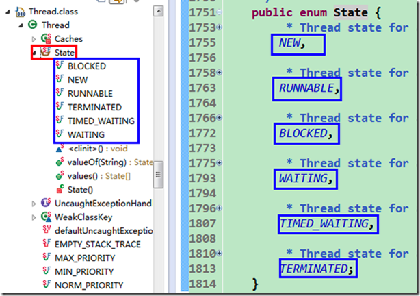
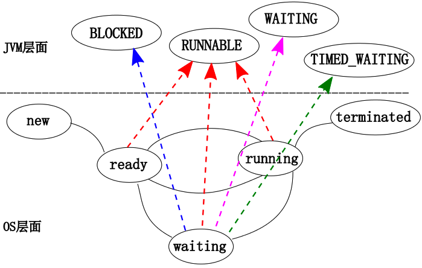
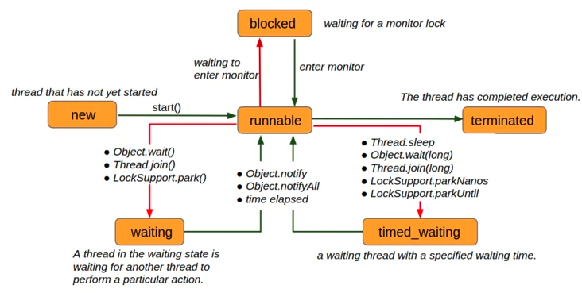
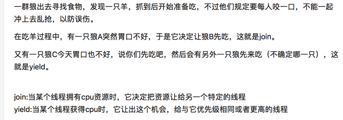

# java 线程

### 线程状态



可以看到，线程有如下几种状态：

*   `NEW` (**新建**)       &#x20;

    一个尚未启动的线程处于这一状态。(A thread that has not yet started is in this state.)

*   `RUNNABLE` (**可运行**)       &#x20;

    一个正在 Java 虚拟机中执行的线程处于这一状态。(A thread executing in the Java virtual machine is in this state.)

*   `BLOCKED` (**阻塞**)       &#x20;

    一个正在阻塞等待一个监视器锁的线程处于这一状态。(A thread that is blocked waiting for a monitor lock is in this state.)

*   `WAITING` (**等待**)       &#x20;

    一个正在无限期等待另一个线程执行一个特别的动作的线程处于这一状态。(A thread that is waiting indefinitely for another thread to perform a particular action is in this state.)

*   `TIMED_WAITING` (**计时等待**)       &#x20;

    一个正在限时等待另一个线程执行一个动作的线程处于这一状态。(A thread that is waiting for another thread to perform an action for up to a specified waiting time is in this state.)

*   `TERMINATED` (**终止**)       &#x20;

    一个已经退出的线程处于这一状态。(A thread that has exited is in this state.)

跟传统进（线）程状态划分的一个最终对比



### 线程间的状态转换



## 线程的基本方法

### join

*   thread.Join把指定的线程加入到当前线程，可以将两个交替执行的线程合并为顺序执行的线程。

*   相当于方法调用

> *之前看join代码，一直有个疑惑，就是join里面有一个wait()，我找遍rt.jar也没有一个notify的地方，直到我看了jvm源码，我才发现，奶奶的线程执行完毕了exit过程有一个notifyall操作，解了我多年的困惑。。。。。。*

### yield&#x20;

join 和yield 的区别



### wait notify  notifyAll

*   调用wait,notify,notifyall的任务在调用这些方法前必须“拥有”（获取）对象的锁。

*   [为什么wait() 和notify() 需要搭配synchonized关键字使用 ？](../../../面试题/为什么wait()%20和notify()%20需要搭配syncho/为什么wait()%20和notify()%20需要搭配synchonized关键字使用%20？.md "为什么wait() 和notify() 需要搭配synchonized关键字使用 ？")

## 线程中断

*   中断只是一种协作机制，Java没有给中断增加任何语法，中断的过程完全需要程序员自己实现。若要中断一个线程，你需要手动调用该线程的interrupted方法，该方法也仅仅是将线程对象的中断标识设成true；接着你需要自己写代码不断地检测当前线程的标识位；如果为true，表示别的线程要求这条线程中断，此时究竟该做什么需要你自己写代码实现。

*   每个线程对象中都有一个标识，用于表示线程是否被中断；该标识位为true表示中断，为false表示未中断；

*   通过调用线程对象的interrupt方法将该线程的标识位设为true；可以在别的线程中调用，也可以在自己的线程中调用。

**一个线程调用了Thread.interrupt()到底意味着什么？**

参考：[https://www.zhihu.com/question/41048032/answer/89431513](https://www.zhihu.com/question/41048032/answer/89431513 "https://www.zhihu.com/question/41048032/answer/89431513")

> 首先，一个线程不应该由其他线程来强制中断或停止，而是应该由线程自己自行停止。所以，Thread.stop, Thread.suspend, Thread.resume 都已经被废弃了。
>
> 而 Thread.interrupt 的作用其实也不是中断线程，而是**通知线程**应该中断了，具体到底中断还是继续运行，应该由被通知的线程自己处理。
>
> 具体来说，当对一个线程，调用 interrupt() 时:
>
> 1\.  如果线程处于被阻塞状态（例如处于sleep, wait, join 等状态），那么线程将立即退出被阻塞状态，并抛出一个InterruptedException异常。仅此而已。
> 2\. 如果线程处于正常活动状态，那么会将该线程的中断标志设置为 true，仅此而已。被设置中断标志的线程将继续正常运行，不受影响。
>
> **interrupt() 并不能真正的中断线程，需要被调用的线程自己进行配合才行**。也就是说，一个线程如果有被中断的需求，那么就可以这样做。
>
> 1\.  在正常运行任务时，经常检查本线程的中断标志位，如果被设置了中断标志就自行停止线程。
> 2\.  在调用阻塞方法时正确处理InterruptedException异常。（例如，catch异常后就结束线程。）

```java
Thread thread = new Thread(() -> {

  while (!Thread.interrupted()) {

    // do more work.

  }

});

thread.start();

// 一段时间以后

thread.interrupt(); 
```

> Thread.interrupted()清除标志位是为了下次继续检测标志位。
> 如果一个线程被设置中断标志后，选择结束线程那么自然不存在下次的问题
> 如果一个线程被设置中断标识后，进行了一些处理后选择继续进行任务，而且这个任务也是需要被中断的，那么当然需要清除标志位了。

**当我们捕获到中断状态后，究竟如何处理呢？**

*   Java类库中提供的一些可能会发生阻塞的方法都会抛`InterruptedException`异常，如：BlockingQueue#put、BlockingQueue#take、Object#wait、Thread#sleep。

*   当你在某一条线程中调用这些方法时，这个方法可能会被阻塞很长时间，你可以在别的线程中调用当前线程对象的interrupt方法触发这些函数抛出`InterruptedException`异常。

*   当一个函数抛出`InterruptedException`异常时，表示这个方法阻塞的时间太久了，别人不想等它执行结束了。

*   当你的捕获到一个`InterruptedException`异常后，亦可以处理它，或者向上抛出。

*   抛出时要注意：当你捕获到`InterruptedException`异常后，当前线程的中断状态已经被修改为false(表示线程未被中断)；此时你若能够处理中断，则不用理会该值；但如果你继续向上抛`InterruptedException`异常，你需要再次调用interrupt方法，将当前线程的中断状态设为true。

*   **注意**：绝对不能“吞掉中断”！即捕获了`InterruptedException`而不作任何处理。这样违背了中断机制的规则，别人想让你线程中断，然而你自己不处理，也不将中断请求告诉调用者，调用者一直以为没有中断请求。

## 线程间的协作

主要利用了 monitor 监视器来实现的，请参考 [moniter 监视器](../../JVM/moniter%20监视器/moniter%20监视器.md "moniter 监视器")

wait()/notify()方法定义在Object类中。如果线程要调用对象的wait()方法，必须首先获得该对象的监视器锁，调用wait()之后，当前线程又立即释放掉锁，线程随后进入WAIT\_SET（等待池）中。

如果线程要调用对象的notify()/notifyAll()方法，也必须先获得对象的监视器锁，调用方法之后，立即释放掉锁，然后处于Wait\_set的线程被转移到Entry\_set（等锁池）中，去竞争锁资源。

The Winner Thread，也就是成功获得了对象的锁的线程，就是对象锁的拥有者，会进入runnable状态。由于需要获得锁之后才能够调用wait()/notify()方法，因此必须将它们放到同步代码块中。

### notifyall 和 notify的区别

参考：[https://tech.youzan.com/javasuo-yu-xian-cheng-de-na-xie-shi/](https://tech.youzan.com/javasuo-yu-xian-cheng-de-na-xie-shi/ "https://tech.youzan.com/javasuo-yu-xian-cheng-de-na-xie-shi/")

所谓唤醒线程，另一种解释可以说是将线程由等待池移动到锁池，notifyAll调用后，会将全部线程由等待池移到锁池，然后参与锁的竞争，竞争成功则继续执行，如果不成功则留在锁池等待锁被释放后再次参与竞争。而notify只会唤醒一个线程。

> 通过object获得objectMonitor \[[moniter 监视器](../../JVM/moniter%20监视器/moniter%20监视器.md "moniter 监视器")]，调用objectMonitor的`notify`方法。这个notify最后会走到`ObjectMonitor::DequeueWaiter`方法，获取waitSet列表中的第一个ObjectWaiter节点。并根据不同的策略，将取出来的ObjectWaiter节点，加入到`EntryList`或`cxq`中。 `notifyAll`的实现类似于`notify`，主要差别在多了个for循环。

## callable、runnable、future、futureTask

*   Callable与Runnable的功能大致相似,但是call()函数有返回值

*   Callable一般是和ExecutorService配合来使用的

*   Future就是对于具体的Runnable或者Callable任务的执行结果进行取消、查询是否完成，参考[CompletableFuture](../并发包-JUC/CompletableFuture/CompletableFuture.md "CompletableFuture") 的Future部分

    Future只实现了异步，而没有实现回调，主线程get时会阻塞，可以轮询以便获取异步调用是否完成。
    在实际的使用中建议使用Guava ListenableFuture来实现异步非阻塞，目的就是多任务异步执行，通过回调的方方式来获取执行结果而不需轮询任务状态。或者使用 [CompletableFuture](../并发包-JUC/CompletableFuture/CompletableFuture.md "CompletableFuture")

**FutureTask 例子：**

常用使用方式：

*   第一种方式: Future + ExecutorService

*   第二种方式: FutureTask + ExecutorService

*   第三种方式: FutureTask + Thread

```java

public class FutureDemo {
      public static void main(String[] args) {
          ExecutorService executorService = Executors.newCachedThreadPool();
          Future future = executorService.submit(new Callable<Object>() {
              @Override
              public Object call() throws Exception {
                  Long start = System.currentTimeMillis();
                  while (true) {
                      Long current = System.currentTimeMillis();
                     if ((current - start) > 1000) {
                         return 1;
                     }
                 }
             }
         });
  
         try {
             Integer result = (Integer)future.get();
             System.out.println(result);
         }catch (Exception e){
             e.printStackTrace();
         }
     }
}

FutureTask+Thread例子 

import java.util.concurrent.*;
 
public class CallDemo {
 
    public static void main(String[] args) throws ExecutionException, InterruptedException {
 
        /**
         * 第一种方式:Future + ExecutorService
         * Task task = new Task();
         * ExecutorService service = Executors.newCachedThreadPool();
         * Future<Integer> future = service.submit(task1);
         * service.shutdown();
         */
 
 
        /**
         * 第二种方式: FutureTask + ExecutorService
         * ExecutorService executor = Executors.newCachedThreadPool();
         * Task task = new Task();
         * FutureTask<Integer> futureTask = new FutureTask<Integer>(task);
         * executor.submit(futureTask);
         * executor.shutdown();
         */
 
        /**
         * 第三种方式:FutureTask + Thread
         */
 
        // 2. 新建FutureTask,需要一个实现了Callable接口的类的实例作为构造函数参数
        FutureTask<Integer> futureTask = new FutureTask<Integer>(new Task());
        // 3. 新建Thread对象并启动
        Thread thread = new Thread(futureTask);
        thread.setName("Task thread");
        thread.start();
 
        try {
            Thread.sleep(1000);
        } catch (InterruptedException e) {
            e.printStackTrace();
        }
 
        System.out.println("Thread [" + Thread.currentThread().getName() + "] is running");
 
        // 4. 调用isDone()判断任务是否结束
        if(!futureTask.isDone()) {
            System.out.println("Task is not done");
            try {
                Thread.sleep(2000);
            } catch (InterruptedException e) {
                e.printStackTrace();
            }
        }
        int result = 0;
        try {
            // 5. 调用get()方法获取任务结果,如果任务没有执行完成则阻塞等待
            result = futureTask.get();
        } catch (Exception e) {
            e.printStackTrace();
        }
 
        System.out.println("result is " + result);
 
    }
 
    // 1. 继承Callable接口,实现call()方法,泛型参数为要返回的类型
    static class Task  implements Callable<Integer> {
 
        @Override
        public Integer call() throws Exception {
            System.out.println("Thread [" + Thread.currentThread().getName() + "] is running");
            int result = 0;
            for(int i = 0; i < 100;++i) {
                result += i;
            }
 
            Thread.sleep(3000);
            return result;
        }
    }
}
  
```

## 参考

*   [https://my.oschina.net/goldenshaw?tab=newest\&catalogId=3277710](https://my.oschina.net/goldenshaw?tab=newest\&catalogId=3277710 "https://my.oschina.net/goldenshaw?tab=newest\&catalogId=3277710")

*   [https://www.zhihu.com/question/41048032/answer/89431513](https://www.zhihu.com/question/41048032/answer/89431513 "https://www.zhihu.com/question/41048032/answer/89431513")

*   [https://yasinshaw.com/articles/100](https://yasinshaw.com/articles/100 "https://yasinshaw.com/articles/100")

*   [https://pdai.tech/md/java/thread/java-thread-x-juc-executor-FutureTask.html](https://pdai.tech/md/java/thread/java-thread-x-juc-executor-FutureTask.html "https://pdai.tech/md/java/thread/java-thread-x-juc-executor-FutureTask.html")

[JVM最多可以创建多少线程？](JVM最多可以创建多少线程？/JVM最多可以创建多少线程？.md "JVM最多可以创建多少线程？")
