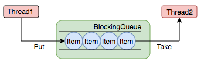

# Executor框架

## 概述

Executor作为一个灵活且强大的异步执行框架，其支持多种不同类型的任务执行策略，提供了一种标准的方法将任务的提交过程和执行过程进行了解耦开发，基于生产者和消费者模型，还提供了对生命周期的支持，以及统计信息收集，应用程序管理机制和性能检测等机制。

成员分为四个部分：任务、任务执行、任务执行结果以及任务执行工具类

*   任务：实现Callable接口或Runnable接口

*   任务执行部分：ThreadPoolExecutor以及ScheduledThreadPoolExecutor

*   任务执行结果：Future接口以及FutureTask实现类

*   任务执行工厂类：Executors

### Executor

Java的线程既是工作单元也是执行单元&#x20;

```java
 new Thread(new Runnable() {
     @Override
     public void run() {
         log.info("hello");
     }
 }).start();
```

从JDK5开始，**把工作单元与执行机制分离开来**，工作单元包括Runnable和Callable,而执行机制由Executor框架提供。

Executor接口解耦了任务和任务的执行，该接口只有一个方法

```java
public interface Executor {
    /**
     * 执行给定的Runnable任务.
     * 根据Executor的实现不同, 具体执行方式也不相同.
     *
     * @param command the runnable task
     * @throws RejectedExecutionException if this task cannot be accepted for execution
     * @throws NullPointerException       if command is null
     */
    void execute(Runnable command);
} 
```

我们可以像下面这样执行任务，而**不是显示的创建线程**（`new Thread(new RunnableTask()).start()`）：

```java
Executor executor = anExecutor();
executor.execute(new RunnableTask1());
executor.execute(new RunnableTask2());
...

```

Executor仅仅是一个接口，所以根据其实现的不同，执行任务的具体方式也不尽相同。Executor 接口**并不严格要求执行是异步的**，也就是说可以是同步的或者异步的：

*   同步

    ```java
     class DirectExecutor implements Executor {
       public void execute(Runnable r) {
         r.run();
       }
     }
    ```

    DirectExecutor是一个同步任务执行器，对于传入的任务，只有执行完成后execute才会返回。

*   异步&#x20;

    ```java
    class ThreadPerTaskExecutor implements Executor {
       public void execute(Runnable r) {
         new Thread(r).start();
       }
     }
    ```

    ThreadPerTaskExecutor是一个异步任务执行器，对于每个任务，执行器都会创建一个新的线程去执行任务

**许多 Executor 实现对任务的调度方式和时间施加了某种限制**，通过下面这个例子我们其实可以看到线程池的雏形。

```java
 class SerialExecutor implements Executor {
   final Queue<Runnable> tasks = new ArrayDeque<>();
   final Executor executor;
   Runnable active;

   SerialExecutor(Executor executor) {
     this.executor = executor;
   }

   public synchronized void execute(Runnable r) {
     tasks.add(() -> {
       try {
         r.run();
       } finally {
         scheduleNext();
       }
     });
     if (active == null) {
       scheduleNext();
     }
   }

   protected synchronized void scheduleNext() {
     if ((active = tasks.poll()) != null) {
       executor.execute(active);
     }
   }
 }
```

**总结：Executor 的目的是为了解耦任务本身和任务的执行**

### ExecutorService

ExecutorService继承了Executor，它在Executor的基础上**增强**了对任务的控制，同时包括对自身生命周期的管理，主要有四类：

1.  关闭执行器，禁止任务的提交；

2.  监视执行器的状态；

3.  提供对异步任务的支持；

4.  提供对批处理任务的支持。

```java
public interface ExecutorService extends Executor {

    /**
     * 关闭执行器, 主要有以下特点:
     * 1. 已经提交给该执行器的任务将会继续执行, 但是不再接受新任务的提交;
     * 2. 如果执行器已经关闭了, 则再次调用没有副作用.
     */
    void shutdown();

    /**
     * 立即关闭执行器, 主要有以下特点:
     * 1. 尝试停止所有正在执行的任务, 无法保证能够停止成功, 但会尽力尝试(例如, 通过 Thread.interrupt中断任务, 但是不响应中断的任务可能无法终止);
     * 2. 暂停处理已经提交但未执行的任务;
     *
     * @return 返回已经提交但未执行的任务列表
     */
    List<Runnable> shutdownNow();

    /**
     * 如果该执行器已经关闭, 则返回true.
     */
    boolean isShutdown();

    /**
     * 判断执行器是否已经【终止】.
     * <p>
     * 仅当执行器已关闭且所有任务都已经执行完成, 才返回true.
     * 注意: 除非首先调用 shutdown 或 shutdownNow, 否则该方法永远返回false.
     */
    boolean isTerminated();

    /**
     * 阻塞调用线程, 等待执行器到达【终止】状态.
     *
     * @return {@code true} 如果执行器最终到达终止状态, 则返回true; 否则返回false
     * @throws InterruptedException if interrupted while waiting
     */
    boolean awaitTermination(long timeout, TimeUnit unit) throws InterruptedException;

    /**
     * 提交一个具有返回值的任务用于执行.
     * 注意: Future的get方法在成功完成时将会返回task的返回值.
     *
     * @param task 待提交的任务
     * @param <T>  任务的返回值类型
     * @return 返回该任务的Future对象
     * @throws RejectedExecutionException 如果任务无法安排执行
     * @throws NullPointerException       if the task is null
     */
    <T> Future<T> submit(Callable<T> task);

    /**
     * 提交一个 Runnable 任务用于执行.
     * 注意: Future的get方法在成功完成时将会返回给定的结果(入参时指定).
     *
     * @param task   待提交的任务
     * @param result 返回的结果
     * @param <T>    返回的结果类型
     * @return 返回该任务的Future对象
     * @throws RejectedExecutionException 如果任务无法安排执行
     * @throws NullPointerException       if the task is null
     */
    <T> Future<T> submit(Runnable task, T result);

    /**
     * 提交一个 Runnable 任务用于执行.
     * 注意: Future的get方法在成功完成时将会返回null.
     *
     * @param task 待提交的任务
     * @return 返回该任务的Future对象
     * @throws RejectedExecutionException 如果任务无法安排执行
     * @throws NullPointerException       if the task is null
     */
    Future<?> submit(Runnable task);

    /**
     * 执行给定集合中的所有任务, 当所有任务都执行完成后, 返回保持任务状态和结果的 Future 列表.
     * <p>
     * 注意: 该方法为同步方法. 返回列表中的所有元素的Future.isDone() 为 true.
     *
     * @param tasks 任务集合
     * @param <T>   任务的返回结果类型
     * @return 任务的Future对象列表，列表顺序与集合中的迭代器所生成的顺序相同，
     * @throws InterruptedException       如果等待时发生中断, 会将所有未完成的任务取消.
     * @throws NullPointerException       任一任务为 null
     * @throws RejectedExecutionException 如果任一任务无法安排执行
     */
    <T> List<Future<T>> invokeAll(Collection<? extends Callable<T>> tasks) throws InterruptedException;

    /**
     * 执行给定集合中的所有任务, 当所有任务都执行完成后或超时期满时（无论哪个首先发生）, 返回保持任务状态和结果的 Future 列表.
     */
    <T> List<Future<T>> invokeAll(Collection<? extends Callable<T>> tasks, long timeout, TimeUnit unit) throws InterruptedException;

    /**
     * 执行给定集合中的任务, 只有其中某个任务率先成功完成（未抛出异常）, 则返回其结果.
     * 一旦正常或异常返回后, 则取消尚未完成的任务.
     */
    <T> T invokeAny(Collection<? extends Callable<T>> tasks) throws InterruptedException, ExecutionException;

    /**
     * 执行给定集合中的任务, 如果在给定的超时期满前, 某个任务已成功完成（未抛出异常）, 则返回其结果.
     * 一旦正常或异常返回后, 则取消尚未完成的任务.
     */
    <T> T invokeAny(Collection<? extends Callable<T>> tasks, long timeout, TimeUnit unit)
        throws InterruptedException, ExecutionException, TimeoutException;
}
```

### ScheduledExecutorService

ScheduledExecutorService 在ExecutorService的基础上提供了一系列schedule方法，可以在给定的延迟后执行提交的任务，或者每个指定的周期执行一次提交的任务

举例

```java
import static java.util.concurrent.TimeUnit.*;

/**
* 利用scheduleAtFixedRate方法提交了一个“蜂鸣”任务，每隔10s该任务会执行一次， 1小时后, 取消蜂鸣任务 
*/

 class BeeperControl {
   private final ScheduledExecutorService scheduler =
     Executors.newScheduledThreadPool(1);

   public void beepForAnHour() {
     Runnable beeper = () -> System.out.println("beep");
     ScheduledFuture<?> beeperHandle =
       scheduler.scheduleAtFixedRate(beeper, 10, 10, SECONDS);
     Runnable canceller = () -> beeperHandle.cancel(false);
     scheduler.schedule(canceller, 1, HOURS);
   }
 }
```

**ScheduledExecutorService**完整的接口声明如下：

```java
public interface ScheduledExecutorService extends ExecutorService {
 
    /**
     * 提交一个待执行的任务, 并在给定的延迟后执行该任务.
     *
     * @param command 待执行的任务
     * @param delay   延迟时间
     * @param unit    延迟时间的单位
     */
    public ScheduledFuture<?> schedule(Runnable command, long delay, TimeUnit unit);
 
    /**
     * 提交一个待执行的任务（具有返回值）, 并在给定的延迟后执行该任务.
     *
     * @param command 待执行的任务
     * @param delay   延迟时间
     * @param unit    延迟时间的单位
     * @param <V>     返回值类型
     */
    public <V> ScheduledFuture<V> schedule(Callable<V> callable, long delay, TimeUnit unit);
 
    /**
     * 提交一个待执行的任务.
     * 该任务在 initialDelay 后开始执行, 然后在 initialDelay+period 后执行, 接着在 initialDelay + 2 * period 后执行, 依此类推.
     *
     * @param command      待执行的任务
     * @param initialDelay 首次执行的延迟时间
     * @param period       连续执行之间的周期
     * @param unit         延迟时间的单位
     */
    public ScheduledFuture<?> scheduleAtFixedRate(Runnable command, long initialDelay, long period, TimeUnit unit);
 
    /**
     * 提交一个待执行的任务.
     * 该任务在 initialDelay 后开始执行, 随后在每一次执行终止和下一次执行开始之间都存在给定的延迟.
     * 如果任务的任一执行遇到异常, 就会取消后续执行. 否则, 只能通过执行程序的取消或终止方法来终止该任务.
     *
     * @param command      待执行的任务
     * @param initialDelay 首次执行的延迟时间
     * @param delay        一次执行终止和下一次执行开始之间的延迟
     * @param unit         延迟时间的单位
     */
    public ScheduledFuture<?> scheduleWithFixedDelay(Runnable command, long initialDelay, long delay, TimeUnit unit);
}
```

### 小结

1.  ***Executor***：提交普通的可执行任务

2.  ***ExecutorService***：提供对线程池生命周期的管理、异步任务的支持

3.  ***ScheduledExecutorService***：提供对任务的周期性执行支持

以上介绍的类，Executor  ExecutorService  ScheduledExecutorService   都是接口的定义，下面看一下具体的实现。

上面提到的接口和类的关系如下图所示：


1.  **Executor** &#x20;

    执行器接口，也是最顶层的抽象核心接口， 分离了任务和任务的执行。

2.  **ExecutorService** &#x20;

    在Executor的基础上提供了执行器生命周期管理，任务异步执行等功能。

3.  **ScheduledExecutorService** &#x20;

    在ExecutorService基础上提供了任务的延迟执行/周期执行的功能。

4.  **Executors** &#x20;

    生产具体的执行器的静态工厂

5.  **ThreadFactory** &#x20;

    线程工厂，用于创建单个线程，减少手工创建线程的繁琐工作，同时能够复用工厂的特性。

6.  **AbstractExecutorService** &#x20;

    ExecutorService的抽象实现，为各类执行器类的实现提供基础。

7.  **ThreadPoolExecutor** &#x20;

    线程池Executor，也是最常用的Executor，可以以线程池的方式管理线程。

8.  **ScheduledThreadPoolExecutor** &#x20;

    在ThreadPoolExecutor基础上，增加了对周期任务调度的支持。

9.  **ForkJoinPool** &#x20;

    Fork/Join线程池，在JDK1.7时引入，时实现Fork/Join框架的核心类。

**Executor执行流程如下：**


## Executors

Executors提供一个简单工厂和一系列工具方法，它的所有方法都是static的，用户可以根据需要，选择需要创建的执行器实例，Executors一共提供了**五类**方法：

*   创建和返回设置了具有常用配置的 `ExecutorService` 实例的方法

*   创建和返回设置了具有常用配置的 `ScheduledExecutorService`  实例的方法

*   创建和返回 `ExecutorService` 的包装类实例的方法，这些类可以隐藏子类的特殊实现，只暴露父类的方法

*   创建和返回 将新创建的线程设置为已知状态的`ThreadFactory` 实例的方法

*   从其他类似闭包的形式中创建和返回 Callable 实例的方法，它们可以在需要 Callable 的方法中使用。

我们从如下图的方法签名上也大致看的出来：


**为什么要有包装类**？

因为如果直接返回如 ThreadPoolExecutor这样的类，会包括一些设置线程池的方法，比如 setCorePoolSize，但有时候我们不希望使用者强制转换后使用这些方法（比如：newSingleThreadExecutor），就需要包装一下，让它返回的类只暴露ExecutorService本身的方法

*   `DelegatedExecutorService` 就是对ExecutorService的一种包装，仅仅只给使用者暴露 ExecutorService的接口方法，屏蔽掉具体实现类的独有方法。

*   `DelegatedScheduledExecutorService`是对ScheduledExecutorService的包装，仅仅只给使用者暴露 ScheduledExecutorService的接口方法，而FinalizableDelegatedExecutorService是在对ExecutorService的包装基础上，增加了自动线程池回收的功能，其finalize方法会在虚拟机gc清理对象时被调用，从而将用户忘记关闭的无用线程池关闭并回收。

## ThreadPoolExecutor

Executor在日常使用中最常见的场景就是线程池了。

### 什么是线程池？

线程池（Thread Pool）是一种基于池化思想管理线程的工具

### 线程池的作用是什么？

> 线程池做的工作主要是控制运行的线程的数量，处理过程中将任务放入队列，然后在线程创建后启动这些任务，如果线程数量超过了最大数量超出数量的线程排队等候，等其它线程执行完毕，再从队列中取出任务来执行。他的主要特点为：线程复用；控制最大并发数；管理线程。

### 利用线程池的好处是什么？

利用线程池能够对线程进行统一分配，调优和监控:

*   **降低资源消耗**：通过池化技术重复利用已创建的线程，降低线程创建和销毁造成的损耗。

*   **提高响应速度**：任务到达时，无需等待线程创建即可立即执行。

*   **提高线程的可管理性**：线程是稀缺资源，如果无限制创建，不仅会消耗系统资源，还会因为线程的不合理分布导致资源调度失衡，降低系统的稳定性。使用线程池可以进行统一的分配、调优和监控。

*   **提供更多更强大的功能**：线程池具备可拓展性，允许开发人员向其中增加更多的功能。比如延时定时线程池ScheduledThreadPoolExecutor，就允许任务延期执行或定期执行。

### 线程池解决的问题是什么？

线程池解决的核心问题就是资源管理问题。在并发环境下，系统不能够确定在任意时刻中，有多少任务需要执行，有多少资源需要投入。这种不确定性将带来以下若干问题：

1.  频繁申请/销毁资源和调度资源，将带来额外的消耗，可能会非常巨大。

2.  对资源无限申请缺少抑制手段，易引发系统资源耗尽的风险。

3.  系统无法合理管理内部的资源分布，会降低系统的稳定性。

为解决资源分配这个问题，线程池采用了“池化”（Pooling）思想。

> Pooling is the grouping together of resources (assets, equipment, personnel, effort, etc.) for the purposes of maximizing advantage or minimizing risk to the users. The term is used in finance, computing and equipment management.——wikipedia

池化，顾名思义，是为了最大化收益并最小化风险，而将资源统一在一起管理的一种思想。

池化思想不仅仅能应用在计算机领域，在金融、设备、人员管理、工作管理等领域也有相关的应用。

在计算机领域中的表现为：统一管理IT资源，包括服务器、存储、和网络资源等等。通过共享资源，使用户在低投入中获益。

除去线程池，还有其他比较典型的几种使用策略包括：

1.  内存池(Memory Pooling)：预先申请内存，提升申请内存速度，减少内存碎片。

2.  连接池(Connection Pooling)：预先申请数据库连接，提升申请连接的速度，降低系统的开销。

3.  实例池(Object Pooling)：循环使用对象，减少资源在初始化和释放时的昂贵损耗。

Executors 提供了一系列工厂方法用于创建线程池，暂时放下不表，我们看一看核心的类 `ThreadPoolExecutor`，然后回来再看。

### ThreadPoolExecutor是如何运行，如何同时维护线程和执行任务的呢？

其运行机制如下图所示：


**线程池在内部实际上构建了一个生产者消费者模型，将线程和任务两者解耦**，并不直接关联，从而良好的缓冲任务，复用线程。

线程池的运行主要分成两部分：

*   任务管理

*   线程管理

任务管理部分充当生产者的角色，当任务提交后，线程池会判断该任务后续的流转：

1.  直接申请线程执行该任务；

2.  缓冲到队列中等待线程执行；

3.  拒绝该任务。线程管理部分是消费者，它们被统一维护在线程池内，根据任务请求进行线程的分配，当线程执行完任务后则会继续获取新的任务去执行，最终当线程获取不到任务的时候，线程就会被回收。

### 线程池如何维护自身状态？

线程池运行的状态，并不是用户显式设置的，而是伴随着线程池的运行，由内部来维护。线程池内部使用一个变量维护两个值：运行状态(runState)和线程数量 (workerCount)。在具体实现中，线程池将运行状态(runState)、线程数量 (workerCount)两个关键参数的维护放在了一起，如下代码所示：

```java
private final AtomicInteger ctl = new AtomicInteger(ctlOf(RUNNING, 0));

```

`ctl`这个AtomicInteger类型，是对线程池的运行状态和线程池中有效线程的数量进行控制的一个字段， 它同时包含两部分的信息：线程池的运行状态 (runState) 和线程池内有效线程的数量 (workerCount)，高3位保存runState，低29位保存workerCount，两个变量之间互不干扰。用一个变量去存储两个值，可避免在做相关决策时，出现不一致的情况，不必为了维护两者的一致，而占用锁资源。通过阅读线程池源代码也可以发现，经常出现要同时判断线程池运行状态和线程数量的情况。线程池也提供了若干方法去供用户获得线程池当前的运行状态、线程个数。这里都使用的是位运算的方式，相比于基本运算，速度也会快很多。

关于内部封装的获取生命周期状态、获取线程池线程数量的计算方法如以下代码所示:

```java
private static int runStateOf(int c)     { return c & ~CAPACITY; } //计算当前运行状态
private static int workerCountOf(int c)  { return c & CAPACITY; }  //计算当前线程数量
private static int ctlOf(int rs, int wc) { return rs | wc; }   //通过状态和线程数生成ctl
```

ThreadPoolExecutor的运行状态有5种，分别为：


其生命周期转换如下入所示：


### 任务调度流程是怎样的？

任务调度是线程池的主要入口，当用户提交了一个任务，接下来这个任务将如何执行都是由这个阶段决定的。了解这部分就相当于了解了线程池的核心运行机制。首先，所有任务的调度都是由execute方法完成的，这部分完成的工作是：检查现在线程池的运行状态、运行线程数、运行策略，决定接下来执行的流程，是直接申请线程执行，或是缓冲到队列中执行，亦或是直接拒绝该任务。其执行过程如下：

1.  首先检测线程池运行状态，如果不是RUNNING，则直接拒绝，线程池要保证在RUNNING的状态下执行任务。

2.  如果workerCount < corePoolSize，则创建并启动一个线程来执行新提交的任务。

3.  如果workerCount >= corePoolSize，且线程池内的阻塞队列未满，则将任务添加到该阻塞队列中。

4.  如果workerCount >= corePoolSize && workerCount < maximumPoolSize，且线程池内的阻塞队列已满，则创建并启动一个线程来执行新提交的任务。

5.  如果workerCount >= maximumPoolSize，并且线程池内的阻塞队列已满, 则根据拒绝策略来处理该任务, 默认的处理方式是直接抛异常。

其执行流程如下图所示：


### 任务是如何缓冲的？

任务缓冲模块是线程池能够管理任务的核心部分。线程池的本质是对任务和线程的管理，而做到这一点最关键的思想就是将任务和线程两者解耦，不让两者直接关联，才可以做后续的分配工作。线程池中是以生产者消费者模式，通过一个阻塞队列来实现的。阻塞队列缓存任务，工作线程从阻塞队列中获取任务。

阻塞队列(BlockingQueue)是一个支持两个附加操作的队列。这两个附加的操作是：在队列为空时，获取元素的线程会等待队列变为非空。当队列满时，存储元素的线程会等待队列可用。阻塞队列常用于生产者和消费者的场景，生产者是往队列里添加元素的线程，消费者是从队列里拿元素的线程。阻塞队列就是生产者存放元素的容器，而消费者也只从容器里拿元素。

下图中展示了线程1往阻塞队列中添加元素，而线程2从阻塞队列中移除元素



使用不同的队列可以实现不一样的任务存取策略：


线程需要从任务缓存模块中不断地取任务执行，帮助线程从阻塞队列中获取任务，实现线程管理模块和任务管理模块之间的通信。这部分策略由getTask方法实现，其执行流程如下图所示：


### 任务是如何拒绝的？

任务拒绝模块是线程池的保护部分，线程池有一个最大的容量，当线程池的任务缓存队列已满，并且线程池中的线程数目达到maximumPoolSize时，就需要拒绝掉该任务，采取任务拒绝策略，保护线程池。

用户可以通过实现这个接口去定制拒绝策略，

```java
public interface RejectedExecutionHandler {
    void rejectedExecution(Runnable r, ThreadPoolExecutor executor);
} 

```

也可以选择JDK提供的四种已有拒绝策略，其特点如下：


### 线程是怎么管理的？

说白了就是一个线程集合workerSet和一个阻塞队列workQueue。当用户向线程池提交一个任务(也就是线程)时，线程池会先将任务放入workQueue中。workerSet中的线程会不断的从workQueue中获取线程然后执行。当workQueue中没有任务的时候，worker就会阻塞，直到队列中有任务了就取出来继续执行。


Worker执行任务的模型如下图所示：


### 核心参数

了解了以上这些，再来看 `ThreadPoolExecutor` 的构造方法和核心参数就很容易理解了：

*   corePoolSize：核心线程数。

*   maximumPoolSize：最大线程数。

*   keepAliveTime：线程存活时间。

*   unit：keepAliveTime的单位

*   workQueue：Runnable的阻塞队列。若线程池已经被占满，则该队列用于存放无法再放入线程池中的Runnable。

*   threadFactory：线程工厂

*   handler：拒绝策略

```java
 /**
     * Creates a new {@code ThreadPoolExecutor} with the given initial
     * parameters.
     *
     * @param corePoolSize the number of threads to keep in the pool, even
     *        if they are idle, unless {@code allowCoreThreadTimeOut} is set
     * @param maximumPoolSize the maximum number of threads to allow in the
     *        pool
     * @param keepAliveTime when the number of threads is greater than
     *        the core, this is the maximum time that excess idle threads
     *        will wait for new tasks before terminating.
     * @param unit the time unit for the {@code keepAliveTime} argument
     * @param workQueue the queue to use for holding tasks before they are
     *        executed.  This queue will hold only the {@code Runnable}
     *        tasks submitted by the {@code execute} method.
     * @param threadFactory the factory to use when the executor
     *        creates a new thread
     * @param handler the handler to use when execution is blocked
     *        because the thread bounds and queue capacities are reached
     * @throws IllegalArgumentException if one of the following holds:<br>
     *         {@code corePoolSize < 0}<br>
     *         {@code keepAliveTime < 0}<br>
     *         {@code maximumPoolSize <= 0}<br>
     *         {@code maximumPoolSize < corePoolSize}
     * @throws NullPointerException if {@code workQueue}
     *         or {@code threadFactory} or {@code handler} is null
     */
 public ThreadPoolExecutor(int corePoolSize,
                              int maximumPoolSize,
                              long keepAliveTime,
                              TimeUnit unit,
                              BlockingQueue<Runnable> workQueue,
                              ThreadFactory threadFactory,
                              RejectedExecutionHandler handler) {
        if (corePoolSize < 0 ||
            maximumPoolSize <= 0 ||
            maximumPoolSize < corePoolSize ||
            keepAliveTime < 0)
            throw new IllegalArgumentException();
        if (workQueue == null || threadFactory == null || handler == null)
            throw new NullPointerException();
        this.corePoolSize = corePoolSize;
        this.maximumPoolSize = maximumPoolSize;
        this.workQueue = workQueue;
        this.keepAliveTime = unit.toNanos(keepAliveTime);
        this.threadFactory = threadFactory;
        this.handler = handler;
    }
```

有几点需要注意的：

*   一般情况下，`corePoolSize`和`maxiunmPoolSize`只是在构建的时候进行初始化，但是可以通过setCorePoolSize(int)和 setMaximumPoolSize(int)来动态更改。

*   默认情况下，即使核心线程最初只是在新任务需要时才创建和启动的。但是我们可以使用 `prestartCoreThread()`（创建一个空闲任务线程等待任务的到达) 和 `prestartAllCoreThreads()` （创建核心线程池数量的空闲任务线程等待任务的到达）方法动态调整。

*   如果一个池中现在运行的线程数多于`corePoolSize`，如果多出的线程保持空闲的时间大于`keepAliveTime`，那么这些线程就会被关闭。这样可以在线程池不活跃的时候降低资源的消耗。默认情况下，keep-alive 策略仅适用于大于 `corePoolSize `线程数的线程，即非核心线程，但方法allowCoreThreadTimeOut(boolean) 也可用于将此超时策略应用到核心线程，只要 keepAliveTime 值非零.

*   ThreadPoolExecutor提供了每个任务执行前后提供了钩子方法，重写`beforeExecute(Thread，Runnable)`和`afterExecute(Runnable，Throwable)`方法来操纵执行环境； 例如，重新初始化ThreadLocals，收集统计信息或记录日志等。`terminated()`方法也可以被覆盖，在线程池完全终止的时候，你可以通过这个方法做一些特殊的处理。

### 如何合理配置线程数量

业界的一些线程池参数配置方案，总体来说，都不一定靠谱，还是要根据自己业务的实际情况来决定。


### 如何关闭

当一个线程池不再被其他程序引用，并且池中没有线程的时候，就会自动shutdown。

具体代码在这里：

```java
private void processWorkerExit(Worker w, boolean completedAbruptly) {
    if (completedAbruptly) // If abrupt, then workerCount wasn't adjusted
        decrementWorkerCount();

    final ReentrantLock mainLock = this.mainLock;
    mainLock.lock();
    try {
        completedTaskCount += w.completedTasks;
        // 实际这里就是回收线程的主要操作了，移除线程池对该线程的引用，使其可以被JVM正常地回收
        workers.remove(w);
    } finally {
        mainLock.unlock();
    }

    tryTerminate();
    // 由于引起线程回收的可能性有很多，线程池还要判断是什么引发了这次回收，
    // 是否要改变线程池的现阶段状态，是否要根据新状态，重新分配线程，于是就有了下面这部分逻辑
    int c = ctl.get();
    if (runStateLessThan(c, STOP)) {
        if (!completedAbruptly) {
            int min = allowCoreThreadTimeOut ? 0 : corePoolSize;
            if (min == 0 && ! workQueue.isEmpty())
                min = 1;
            if (workerCountOf(c) >= min)
                return; // replacement not needed
        }
        addWorker(null, false);
    }
}

```

也可以手动，如下：

*   shutdown

    将线程池状态置为SHUTDOWN,并不会立即停止：

    1.  停止接收外部submit的任务

    2.  内部正在跑的任务和队列里等待的任务，会执行完

    3.  等到第二步完成后，才真正停止

*   shutdownNow

    将线程池状态置为STOP。企图立即停止，事实上不一定：

    1.  跟shutdown()一样，先停止接收外部提交的任务

    2.  忽略队列里等待的任务

    3.  尝试将正在跑的任务interrupt中断

    4.  返回未执行的任务列表

    它试图终止线程的方法是通过调用Thread.interrupt()方法来实现的，但是这种方法的作用有限，如果线程中没有sleep 、wait、Condition、定时锁等应用, interrupt()方法是无法中断当前的线程的。所以，shutdownNow()并不代表线程池就一定立即就能退出，它也可能必须要等待所有正在执行的任务都执行完成了才能退出。  但是大多数时候是能立即退出的

*   awaitTermination(long timeOut, TimeUnit unit)

    当前线程阻塞，直到

    1.  等所有已提交的任务（包括正在跑的和队列中等待的）执行完

    2.  或者等超时时间到

    3.  或者线程被中断，抛出InterruptedException  然后返回true（shutdown请求后所有任务执行完毕）或false（已超时）

注意：

*   shuntdown()和awaitTermination()效果差不多，方法执行之后，都要等到提交的任务全部执行完才停。

*   shutdown()后，不能再提交新的任务进去；但是awaitTermination()后，可以继续提交

*   awaitTermination()是阻塞的，返回结果是线程池是否已停止（true/false）；shutdown()不阻塞

### 如何优雅关闭？

**第一种方法**

首先看下源码注释：

> A pool that is no longer referenced in a program AND has no remaining threads may be reclaimed (garbage collected) without being explicitly shutdown. You can configure a pool to allow all unused threads to eventually die by setting appropriate keep-alive times, using a lower bound of zero core threads and/or setting allowCoreThreadTimeOut(boolean).

如果程序中不再持有线程池的引用，并且线程池中没有线程时，线程池将会自动关闭。

线程池自动关闭的两个条件：

*   线程池的引用不可达；

*   线程池中没有线程。

这里对于条件2解释一下，线程池中没有线程是指线程池中的所有线程都已运行完自动消亡。然而如果我们ThreadPool的核心线程没有超时策略，线程池并不会自动关闭。

所以需要设置：

```java
//线程池在执行完任务后，经过超时时间，将所有空闲的线程都释放掉，进程池这样进程就可以退出
pool.allowCoreThreadTimeOut(true);
```

**第二种方法**

利用Runtime.*getRuntime**()* .addShutdownHook 和guava的方法优雅关闭

```java
static {
    Runtime.getRuntime().addShutdownHook(new Thread(new Runnable() {
      @Override
      public void run() {
        System.out.println("====开始关闭线程池");
        CommonThreadPool.gracefulShutdown(pool, 10, TimeUnit.SECONDS);
        System.out.println("====结束关闭线程池");
      }
    }));
  }
public static boolean gracefulShutdown(ExecutorService threadPool, int shutdownTimeout,
      TimeUnit timeUnit) {
    return threadPool == null || MoreExecutors
        .shutdownAndAwaitTermination(threadPool, shutdownTimeout, timeUnit);
  }
```

**误区**

不要将线程池线程设置为守护线程，虽然**守护线程不会阻止 JVM 退出，** 但这样做有问题，如果有还未执行完的任务就会出现异常了，（任务还没执行完就退出）

### Executors 创建线程池

**利用**\*\*\*\***的静态方法可以创建不同类型的线程池，但不推荐使用。**

*   newFixedThreadPool(int nThreads) -- 创建固定数目线程的线程池

    *   任意时间点，最多只能有固定数目的活动线程存在，此时如果有新的线程要建立，只能放在另外的队列(是一个无界队列 LinkedBlockingQueue，容量上限为 Integer.MAX\_VALUE)中等待，直到当前的线程中某个线程终止直接被移出池子。 多数针对一些很稳定很固定的正规并发线程，多用于服务器。

*   newSingleThreadExecutor 创建一个单线程化的Executor

    *   当向SingleThreadExecutor提交了多个任务，那么这些任务将排队。

*   newCachedThreadPool-- 创建一个可缓存的线程池，调用execute将重用以前构造的线程（如果线程可用）。如果现有线程没有可用的，则创建一个新线 程并添加到池中。终止将从缓存中移除那些已有 60 秒钟未被使用的线程。

*   newScheduledThreadPool(int corePoolSize) 创建一个支持定时及周期性的任务执行的线程池，多数情况下可用来替代Timer类

## 其他问题

### 为什么线程池不允许使用Executors去创建? 推荐方式是什么?

Executors 返回的线程池对象的弊端如下：

1\) FixedThreadPool 和 SingleThreadPool:

允许的请求队列长度为 Integer.MAX\_VALUE，可能会堆积大量的请求，从而导致 OOM。

2\) CachedThreadPool 和 ScheduledThreadPool:

允许的创建线程数量为 Integer.MAX\_VALUE，可能会创建大量的线程，从而导致 OOM。

线程池不允许使用 Executors 去创建，而是通过 ThreadPoolExecutor 的方式，这样的处理方式让写的同学更加明确线程池的运行规则，规避资源耗尽的风险。

## 参考

*   [https://nullwy.me/2017/03/java-executor/](https://nullwy.me/2017/03/java-executor/ "https://nullwy.me/2017/03/java-executor/")

*   [https://www.jianshu.com/p/f54b224e24f6](https://www.jianshu.com/p/f54b224e24f6 "https://www.jianshu.com/p/f54b224e24f6")

*   [https://segmentfault.com/a/1190000016586578](https://segmentfault.com/a/1190000016586578 "https://segmentfault.com/a/1190000016586578")

*   [https://www.cnblogs.com/liuyishi/p/10508596.html](https://www.cnblogs.com/liuyishi/p/10508596.html "https://www.cnblogs.com/liuyishi/p/10508596.html")

*   [https://juejin.cn/post/6922069411981426702](https://juejin.cn/post/6922069411981426702#heading-4 "https://juejin.cn/post/6922069411981426702")

*   [https://pdai.tech/md/java/thread/java-thread-x-juc-executor-ThreadPoolExecutor.html](https://pdai.tech/md/java/thread/java-thread-x-juc-executor-ThreadPoolExecutor.html "https://pdai.tech/md/java/thread/java-thread-x-juc-executor-ThreadPoolExecutor.html")

*   [https://tech.meituan.com/2020/04/02/java-pooling-pratice-in-meituan.html](https://tech.meituan.com/2020/04/02/java-pooling-pratice-in-meituan.html "https://tech.meituan.com/2020/04/02/java-pooling-pratice-in-meituan.html")
