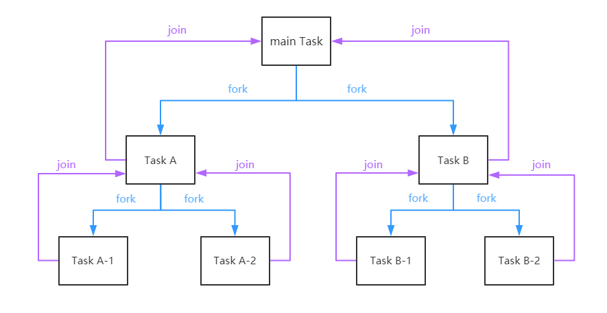
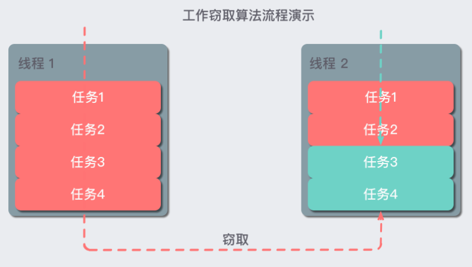

# Fork/Join 框架

## 什么是 Fork/Join 框架

Fork/Join任务的原理：判断一个任务是否足够小，如果是，直接计算，否则，就分拆成几个小任务分别计算。这个过程可以反复“裂变”成一系列小任务。

Fork/Join 的运行流程图如下



## 工作窃取算法

工作窃取（work-stealing）算法是指某个线程从其他队列里窃取任务来执行。工作窃取的运行流程图如下：



### 为什么需要使用工作窃取算法呢？

假如我们需要做一个比较大的任务，我们可以把这个任务分割为若干互不依赖的子任务，为了减少线程间的竞争，于是把这些子任务分别放到不同的队列里，并为每个队列创建一个单独的线程来执行队列里的任务，线程和队列一一对应，比如 A 线程负责处理 A 队列里的任务。但是有的线程会先把自己队列里的任务干完，而其他线程对应的队列里还有任务等待处理。干完活的线程与其等着，不如去帮其他线程干活，于是它就去其他线程的队列里窃取一个任务来执行。而在这时它们会访问同一个队列，所以为了减少窃取任务线程和被窃取任务线程之间的竞争，通常会使用双端队列，被窃取任务线程永远从双端队列的头部拿任务执行，而窃取任务的线程永远从双端队列的尾部拿任务执行。

工作窃取算法的优点是充分利用线程进行并行计算，并减少了线程间的竞争，其缺点是在某些情况下还是存在竞争，比如双端队列里只有一个任务时。并且消耗了更多的系统资源，比如创建多个线程和多个双端队列。

## 框架理解

我们已经很清楚 Fork/Join 框架的需求了，那么我们可以思考一下，如果让我们来设计一个 Fork/Join 框架，该如何设计？这个思考有助于你理解 Fork/Join 框架的设计。

第一步分割任务。首先我们需要有一个 fork 类来把大任务分割成子任务，有可能子任务还是很大，所以还需要不停的分割，直到分割出的子任务足够小。

第二步执行任务并合并结果。分割的子任务分别放在双端队列里，然后几个启动线程分别从双端队列里获取任务执行。子任务执行完的结果都统一放在一个队列里，启动一个线程从队列里拿数据，然后合并这些数据。

Fork/Join 使用两个类来完成以上两件事情：

*   ForkJoinTask：我们要使用 ForkJoin 框架，必须首先创建一个 ForkJoin 任务。它提供在任务中执行 fork() 和 join() 操作的机制，通常情况下我们不需要直接继承 ForkJoinTask 类，而只需要继承它的子类，Fork/Join 框架提供了以下两个子类：

    *   `RecursiveAction`：用于没有返回结果的任务。

    *   `RecursiveTask` ：用于有返回结果的任务。

*   `ForkJoinPool` ：ForkJoinTask 需要通过 ForkJoinPool 来执行，任务分割出的子任务会添加到当前工作线程所维护的双端队列中，进入队列的头部。当一个工作线程的队列里暂时没有任务时，它会随机从其他工作线程的队列的尾部获取一个任务。

总结来说，Fork/Join框架主要包含三个模块:

*   任务对象: `ForkJoinTask` (包括`RecursiveTask`、`RecursiveAction` 和 `CountedCompleter`)

*   执行Fork/Join任务的线程: `ForkJoinWorkerThread`

*   线程池: `ForkJoinPool`

这三者的关系是: ForkJoinPool可以通过池中的ForkJoinWorkerThread来处理ForkJoinTask任务。

### 框架执行流程


### ForkJoinPool

`ForkJoinPool` 是 fork/join 框架的核心，是ExecutorService的一个实现，它提供了对工作线程和线程池的一些便利管理方法，用于管理 `ForkJoinWorkerThread` 类型的工作线程。`ForkJoinPool` 线程池并不会为每个子任务创建一个单独的线程，相反，池中的每个线程都有自己的双端队列用于存储任务 （ double-ended queue ）

ForkJoinPool是用于执行ForkJoinTask任务的执行（线程）池。ForkJoinPool管理着执行池中的线程和任务队列，此外，执行池是否还接受任务，显示线程的运行状态也是在这里处理。

最常见的方法就是使用ForkJoinPool.commonPool()来创建，commonPool()为所有的ForkJoinTask提供了一个公共默认的线程池。

```java
ForkJoinPool forkJoinPool = ForkJoinPool.commonPool();

```

另外一种方式是使用构造函数：

```java
ForkJoinPool forkJoinPool = new ForkJoinPool(2);

```

这里的参数是并行级别，2指的是线程池将会使用2个处理器核心。

**使用Executors工具类创建ForkJoinPool，Java8在Executors工具类中新增了两个工厂方法:**

```java
// parallelism定义并行级别
public static ExecutorService newWorkStealingPool(int parallelism);
// 默认并行级别为JVM可用的处理器个数
// Runtime.getRuntime().availableProcessors()
public static ExecutorService newWorkStealingPool();

```

### ForkJoinWorkerThread&#x20;

**ForkJoinWorkerThread** 是被ForkJoinPool管理的工作线程，在创建出来之后都被设置成为了守护线程，由它来执行ForkJoinTasks。

ForkJoinWorkerThread的首要任务就是执行自己的这个双端任务队列中的任务，其次是窃取其他线程的工作队列

### ForkJoinTask

通常情况下，在创建任务的时候我们一般不直接继承ForkJoinTask，而是继承它的子类**RecursiveAction**和**RecursiveTask**

两个都是ForkJoinTask的子类，**RecursiveAction**可以看做是无返回值的ForkJoinTask，**RecursiveRask**是有返回值的ForkJoinTask。

此外，两个子类都有执行主要计算的方法compute()，当然，RecursiveAction的compute()返回void，RecursiveTask的compute()有具体的返回值。

**fork 方法（安排任务异步执行）**

fork() 做的工作只有一件事，既是**把任务推入当前工作线程的工作队列里（安排任务异步执行）**

```java
public final ForkJoinTask<V> fork() {
    Thread t;
    if ((t = Thread.currentThread()) instanceof ForkJoinWorkerThread)
        ((ForkJoinWorkerThread)t).workQueue.push(this);
    else
        ForkJoinPool.common.externalPush(this);
    return this;
}

```

该方法其实就是将任务通过push方法加入到当前工作线程的工作队列或者提交队列（外部非ForkJoinWorkerThread线程通过submit、execute方法提交的任务），等待被线程池调度执行，这是一个非阻塞的立即返回方法。

\*\*join 方法（等待执行结果）
\*\*

join() 的工作则复杂得多，也是 join() 可以使得线程免于被阻塞的原因——不像同名的 Thread.join()。

执行流程：

1.  检查调用 join() 的线程是否是 ForkJoinThread 线程。如果不是（例如 main 线程），则阻塞当前线程，等待任务完成。如果是，则不阻塞。

2.  查看任务的完成状态，如果已经完成，直接返回结果。

3.  如果任务尚未完成，但处于自己的工作队列内，则完成它。

4.  如果任务已经被其他的工作线程偷走，则窃取这个小偷的工作队列内的任务（以 FIFO 方式），执行，以期帮助它早日完成欲 join 的任务。

5.  如果偷走任务的小偷也已经把自己的任务全部做完，正在等待需要 join 的任务时，则找到小偷的小偷，帮助它完成它的任务。

6.  递归地执行第5步。

**get 方法（获取异步任务结果）**

既然ForkJoinTask也是Future的子类，那么Future最重要的获取异步任务结果的get方法也必然要实现

get方法也是通过实现join方法的doJoin方法实现的，不同的是，调用get方法的线程如果被中断的话，get方法会立即抛出InterruptedException异常，而join方法则不会；另外任务异常完成的的相关异常，get方法会将相关异常都封装成ExecutionException异常，而join方法则是原样抛出相关的异常不会被封装成ExecutionException异常。get方法采用的wait/notifyAll这种线程通信机制来实现阻塞与唤醒。另外还有超时版本的get方法也类似，由此可见get支持可中断和/或定时等待完成。

**invoke 方法（立即执行任务，并等待返回结果）**

invoke的实现会利用当前调用invoke的线程立即执行exec方法，当然如果exec方法的实现使用了fork/join，其还是会利用ForkJoinPool线程池的递归调度执行策略，等待子任务执行完成，一步步的合并成最终的任务结果，并返回。值得注意的是，该方法不会因为线程被中断而立即返回，而必须在等到任务执行有了结果之后才会对中断状态进行补偿。

**invoke和 join的区别**

invoke()方法会直接执行当前任务；而join()方法则是在当前任务在队列 top 位时(通过tryUnpush方法判断)才能执行，如果当前任务不在 top 位或者任务执行失败调用ForkJoinPool.awaitJoin方法帮助执行或阻塞当前 join 任务。(所以在官方文档中建议了我们对ForkJoinTask任务的调用顺序，一对 fork-join操作一般按照如下顺序调用: a.fork(); b.fork(); b.join(); a.join();。因为任务 b 是后面进入队列，也就是说它是在栈顶的(top 位)，在它fork()之后直接调用join()就可以直接执行而不会调用ForkJoinPool.awaitJoin方法去等待。)

**invokeAll 方法（批量执行任务，并等待它们执行结束）**

批量任务的执行其实现都是排在前面的任务（只有两个参数是，第一个参数就是排在前面的任务，是数组或者队列时，索引越小的就是排在越前面的）由当前线程执行，后面的任务交给线程池调度执行，如果有多个任务都出现异常，只会抛出排在最前面那个任务的异常。

### WorkQueue

双端队列，ForkJoinTask存放在这里。

当工作线程在处理自己的工作队列时，会从队列尾取任务来执行（LIFO）；如果是窃取其他队列的任务时，窃取的任务位于所属任务队列的队首（FIFO）。

ForkJoinPool与传统线程池最显著的区别就是它维护了一个**工作队列数组**（volatile WorkQueue\[] workQueues，ForkJoinPool中的**每个工作线程都维护着一个工作队列**）。

### runState

ForkJoinPool的运行状态。**SHUTDOWN**状态用负数表示，其他用2的幂次表示。

## 使用

下面我们用一个计算斐波那契数列第n项的例子来看一下Fork/Join的使用：

> 斐波那契数列数列是一个线性递推数列，从第三项开始，每一项的值都等于前两项之和：
> 1, 1, 2, 3, 5, 8, 13, 21, 34, 55, 89······
> 如果设f(n）为该数列的第n项（n∈N\*），那么有：f(n) = f(n-1) + f(n-2)。

```java
public class FibonacciTest {

    class Fibonacci extends RecursiveTask<Integer> {

        int n;

        public Fibonacci(int n) {
            this.n = n;
        }

        // 主要的实现逻辑都在compute()里
        @Override
        protected Integer compute() {
            // 这里先假设 n >= 0
            if (n <= 1) {
                return n;
            } else {
                // f(n-1)
                Fibonacci f1 = new Fibonacci(n - 1);
                f1.fork();
                // f(n-2)
                Fibonacci f2 = new Fibonacci(n - 2);
                f2.fork();
                // f(n) = f(n-1) + f(n-2)
                return f1.join() + f2.join();
            }
        }
    }

    @Test
    public void testFib() throws ExecutionException, InterruptedException {
        ForkJoinPool forkJoinPool = new ForkJoinPool();
        System.out.println("CPU核数：" + Runtime.getRuntime().availableProcessors());
        long start = System.currentTimeMillis();
        Fibonacci fibonacci = new Fibonacci(40);
        Future<Integer> future = forkJoinPool.submit(fibonacci);
        System.out.println(future.get());
        long end = System.currentTimeMillis();
        System.out.println(String.format("耗时：%d millis", end - start));
    }


}
```

此外，也并不是所有的任务都适合Fork/Join框架，比如上面的例子任务划分过于细小反而体现不出效率，上面的例子用普通的递归来求f(n)的值要比使用Fork/Join快。为什么？ **因为Fork/Join是使用多个线程协作来计算的，所以会有线程通信和线程切换的开销**。如果要计算的任务比较简单（比如我们案例中的斐波那契数列），那当然是直接使用单线程会更快一些。但如果要计算的东西比较复杂，计算机又是多核的情况下，就可以充分利用多核CPU来提高计算速度。

### 采用Fork/Join来异步计算1+2+3+…+10000的结果

```java
public class Test {
  static final class SumTask extends RecursiveTask<Integer> {
    private static final long serialVersionUID = 1L;
    
    final int start; //开始计算的数
    final int end; //最后计算的数
    
    SumTask(int start, int end) {
      this.start = start;
      this.end = end;
    }

    @Override
    protected Integer compute() {
      //如果计算量小于1000，那么分配一个线程执行if中的代码块，并返回执行结果
      if(end - start < 1000) {
        System.out.println(Thread.currentThread().getName() + " 开始执行: " + start + "-" + end);
        int sum = 0;
        for(int i = start; i <= end; i++)
          sum += i;
        return sum;
      }
      //如果计算量大于1000，那么拆分为两个任务
      SumTask task1 = new SumTask(start, (start + end) / 2);
      SumTask task2 = new SumTask((start + end) / 2 + 1, end);
      //执行任务
      task1.fork();
      task2.fork();
      //获取任务执行的结果
      return task1.join() + task2.join();
    }
  }
  
  public static void main(String[] args) throws InterruptedException, ExecutionException {
    ForkJoinPool pool = new ForkJoinPool();
    ForkJoinTask<Integer> task = new SumTask(1, 10000);
    pool.submit(task);
    System.out.println(task.get());
  }
}

```

### 注意

**注意fork()、compute()、join()的顺序。** 为了两个任务并行，三个方法的调用顺序需要万分注意。

```java
right.fork(); // 计算右边的任务
long leftAns = left.compute(); // 计算左边的任务(同时右边任务也在计算)
long rightAns = right.join(); // 等待右边的结果
return leftAns + rightAns; 
```

**避免不必要的fork()**

划分成两个子任务后，不要同时调用两个子任务的fork()方法。

表面上看上去两个子任务都fork()，然后join()两次似乎更自然。但事实证明，直接调用compute()效率更高。因为直接调用子任务的compute()方法实际上就是在当前的工作线程进行了计算(线程重用)，这比“将子任务提交到工作队列，线程又从工作队列中拿任务”快得多。

> 当一个大任务被划分成两个以上的子任务时，尽可能使用前面说到的三个衍生的invokeAll方法，因为使用它们能避免不必要的fork()。

## 参考

*   [https://www.liaoxuefeng.com/wiki/1252599548343744/1306581226487842](https://www.liaoxuefeng.com/wiki/1252599548343744/1306581226487842 "https://www.liaoxuefeng.com/wiki/1252599548343744/1306581226487842")

*   [https://www.infoq.cn/article/fork-join-introduction](https://www.infoq.cn/article/fork-join-introduction "https://www.infoq.cn/article/fork-join-introduction")

*   [https://juejin.cn/post/6906424424967667725](https://juejin.cn/post/6906424424967667725 "https://juejin.cn/post/6906424424967667725")

*   [https://redspider.gitbook.io/concurrent/di-san-pian-jdk-gong-ju-pian/18](https://redspider.gitbook.io/concurrent/di-san-pian-jdk-gong-ju-pian/18 "https://redspider.gitbook.io/concurrent/di-san-pian-jdk-gong-ju-pian/18")

*   [https://github.com/wmyskxz/MoreThanJava/blob/master/java-base/java7.md](https://github.com/wmyskxz/MoreThanJava/blob/master/java-base/java7.md "https://github.com/wmyskxz/MoreThanJava/blob/master/java-base/java7.md")
