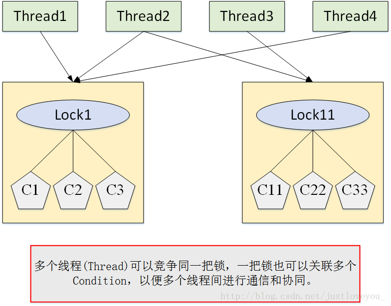
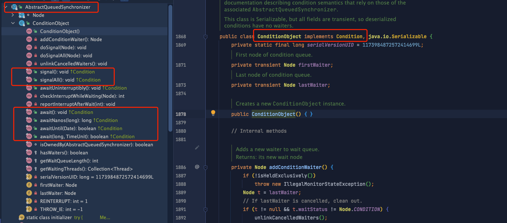
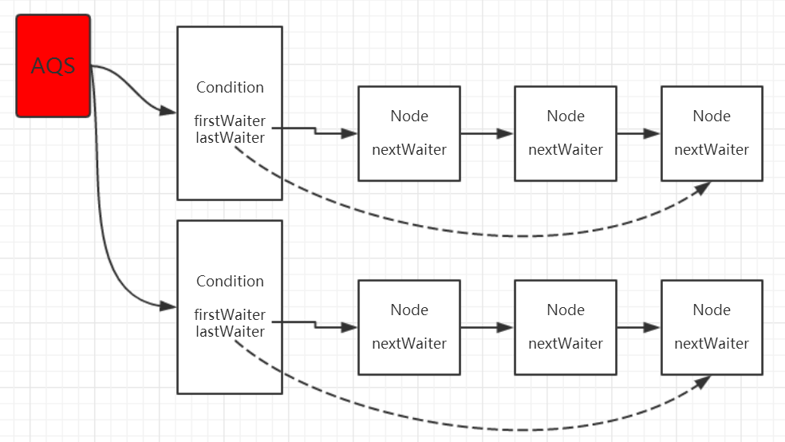
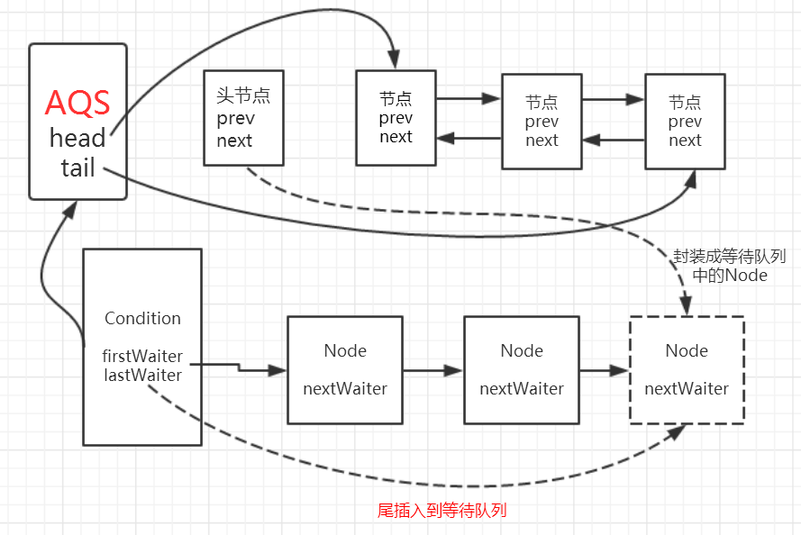
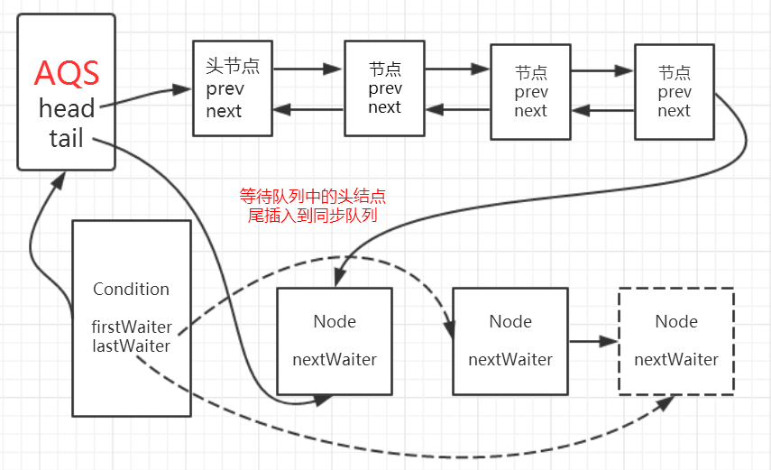
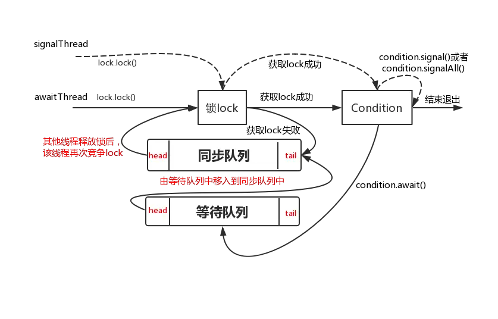
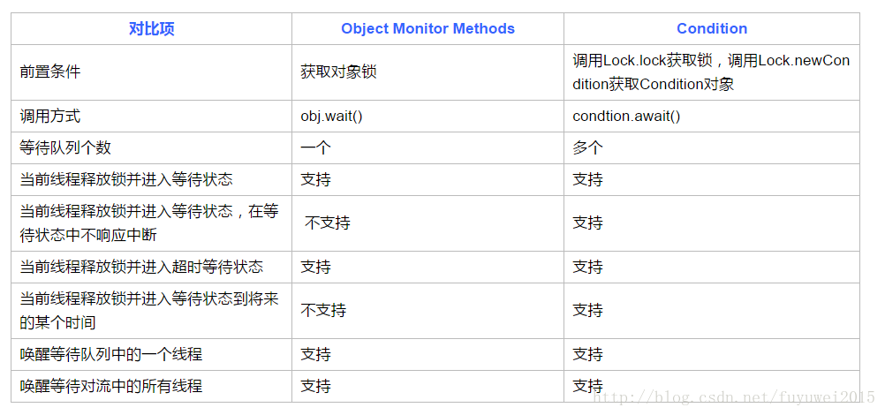

# condition

## 概述

使用`ReentrantLock`比直接使用`synchronized`更安全，可以替代`synchronized`进行线程同步。

但是，`synchronized`可以配合`wait`和`notify`实现线程在条件不满足时等待，条件满足时唤醒，用`ReentrantLock`我们怎么编写`wait`和`notify`的功能呢？答案是使用`Condition`对象来实现`wait`和`notify`的功能。

要想了解 `Condition` 的原理，要先了解 `AQS` 以及 `ReentrantLock`  ，路径如下：

> [彻底理解 AQS（AbstractQueuedSynchronizer）](../彻底理解%20AQS（AbstractQueuedSynchro/彻底理解%20AQS（AbstractQueuedSynchronizer）.md> "彻底理解 AQS（AbstractQueuedSynchronizer）")—>[ReentrantLock](../锁/ReentrantLock/ReentrantLock.md "ReentrantLock")—>Condition

## 介绍

> Condition factors out the Object monitor methods (wait, notify and notifyAll) into distinct objects to give the effect of having multiple wait-sets per object, by combining them with the use of arbitrary Lock implementations. Where a Lock replaces the use of synchronized methods and statements, a Condition replaces the use of the Object monitor methods.
> Conditions (also known as condition queues or condition variables) provide a means for one thread to suspend execution (to "wait") until notified by another thread that some state condition may now be true. Because access to this shared state information occurs in different threads, it must be protected, so a lock of some form is associated with the condition. The key property that waiting for a condition provides is that it atomically releases the associated lock and suspends the current thread, just like Object.wait.

**下面是翻译**

***

Condition把隐式锁的wait notify notifyAll功能提取出来，赋予确切的对象，让一个对象有个多等待集(wait-sets)，这些condition也是和Lock实例绑定的，换句话说，Lock对象代替了synchronized，condition代替了wait、notify(notifyAll)等方法。 &#x20;
因为一个Lock可以生成多个Condition，所以condition可以让所有的因Lock等待的线程分成几个相互等待的子集合，也就是前面提到的wait-sets.

Condtions（也可以叫condition队列，或者是condition变量），它提供一个方法，让一个线程在其它活着（condition状态为true）的线程在通知它之前，一直处于等待状态。因为不同的线程访问共享资源，必须是在获取锁的情况下。所以Condition的使用要在Lock内。这就是condition的一个重要特性，原子的释放锁，并且挂起线程。和Object.wait效果一样。



**官方例子**

> 官方示例的场景是一个关于生产者消费者的模式。有多个生产者和消费者。但是只有一个仓库。  首先我们要保证在同一时间只有一个人在生产或者消费。 &#x20;
> 其次我们希望当一个消费者在消费完最后一个物品的时候，去通知任意一个生产者来生产，同样，我们希望当一个生产者把仓库填满的时候，通知任意一个在等待的消费者来消费,而不会通知其它生产者继续生产。

```java
class BoundedBuffer {
   final Lock lock = new ReentrantLock();
   final Condition notFull  = lock.newCondition(); 
   final Condition notEmpty = lock.newCondition(); 
 
   final Object[] items = new Object[100];
   int putptr, takeptr, count;
 
   public void put(Object x) throws InterruptedException {
     lock.lock(); //锁1
     try {
       while (count == items.length)
         notFull.await();//锁2
       items[putptr] = x;
       if (++putptr == items.length) putptr = 0;
       ++count; //生产
       notEmpty.signal(); //通知1
     } finally {
       lock.unlock();
     }
   }
 
   public Object take() throws InterruptedException {
     lock.lock();//锁3
     try {
       while (count == 0)
         notEmpty.await();//锁4
       Object x = items[takeptr];
       if (++takeptr == items.length) takeptr = 0;
       --count;
       notFull.signal();//通知2
       return x;//消耗
     } finally {
       lock.unlock();
     }
   }
 }
```

## 原理

> **Condition 实现了一种分组机制，将所有对临界资源进行访问的线程进行分组，以便实现线程间更精细化的协作，例如通知部分线程。**

*   在Condition中，用await()替换wait()，用signal()替换notify()，用signalAll()替换notifyAll()，传统线程的通信方式。

*   Condition的强大之处在于**它可以为多个线程间建立不同的Condition**



condition是一个接口，其实现为 AQS 内部 的ConditionObject，有关ConditionObject(等待队列可以参考[彻底理解 AQS（AbstractQueuedSynchronizer）](../彻底理解%20AQS（AbstractQueuedSynchro/彻底理解%20AQS（AbstractQueuedSynchronizer）.md> "彻底理解 AQS（AbstractQueuedSynchronizer）"))

### 数据结构

复用了 `AQS`  中的 `Node` 类

AQS内部维护了一个同步队列，如果是独占式锁的话，所有获取锁失败的线程的尾插入到**同步队列**，同样的，condition内部也是使用同样的方式，内部维护了一个 **等待队列**，所有调用condition.await方法的线程会加入到等待队列中，并且线程状态转换为等待状态。

**可以多次调用lock.newCondition()方法创建多个condition对象，也就是一个lock可以持有多个等待队列**



**当调用condition.await()方法后会使得当前获取lock的线程进入到等待队列，如果该线程能够从await()方法返回的话一定是该线程获取了与condition相关联的lock**

await方法示意图如下图：



**调用condition的signal或者signalAll方法可以将等待队列中等待时间最长的节点移动到同步队列中**。

**调用condition的signal的前提条件是当前线程已经获取了lock，该方法会使得等待队列中的头节点即等待时间最长的那个节点移入到同步队列，而移入到同步队列后才有机会使得等待线程被唤醒，即从await方法中的LockSupport.park(this)方法中返回，从而才有机会使得调用await方法的线程成功退出**。



await和signal和signalAll方法就像一个开关控制着线程A（等待方）和线程B（通知方）。它们之间的关系可以用下面一个图来表现得更加贴切：



### 与 objectMonitor 的对比



synchronized与wait()和nitofy()/notifyAll()方法相结合可以实现等待/通知模型，ReentrantLock同样可以，但是需要借助Condition，且Condition有更好的灵活性，具体体现在：

&#x20;1、一个Lock里面可以创建多个Condition实例，实现多路通知&#x20;

2、notify()方法进行通知时，被通知的线程是Java虚拟机随机选择的。但是ReentrantLock结合Condition可以实现有选择性地通知，这是非常重要的

### API&#x20;

`Condition`提供的`await()`、`signal()`、`signalAll()`原理和`synchronized`锁对象的`wait()`、`notify()`、`notifyAll()`是一致的，并且其行为也是一样的：

参照Object的wait和notify/notifyAll方法，Condition也提供了同样的方法：

> **针对Object的wait方法**

1.  void await() throws InterruptedException:当前线程进入等待状态，如果其他线程调用condition的signal或者signalAll方法并且当前线程获取Lock从await方法返回，如果在等待状态中被中断会抛出被中断异常；

2.  long awaitNanos(long nanosTimeout)：当前线程进入等待状态直到被通知，中断或者**超时**；

3.  boolean await(long time, TimeUnit unit)throws InterruptedException：同第二种，支持自定义时间单位

4.  boolean awaitUntil(Date deadline) throws InterruptedException：当前线程进入等待状态直到被通知，中断或者**到了某个时间**

> **针对Object的notify/notifyAll方法**

1.  void signal()：唤醒一个等待在condition上的线程，将该线程从**等待队列**中转移到**同步队列**中，如果在同步队列中能够竞争到Lock则可以从等待方法中返回。

2.  void signalAll()：与1的区别在于能够唤醒所有等待在condition上的线程

## 应用&#x20;

常应用于解决类 `生产者消费者模式`  的问题，参考 [生产者消费者模式的多种实现方式？](../../../../面试题/生产者消费者模式的多种实现方式？/生产者消费者模式的多种实现方式？.md "生产者消费者模式的多种实现方式？")

## 参考

*   [https://github.com/CL0610/Java-concurrency/blob/master/12.详解Condition的await和signal等待通知机制/详解Condition的await和signal等待通知机制.md](https://github.com/CL0610/Java-concurrency/blob/master/12.详解Condition的await和signal等待通知机制/详解Condition的await和signal等待通知机制.md "https://github.com/CL0610/Java-concurrency/blob/master/12.详解Condition的await和signal等待通知机制/详解Condition的await和signal等待通知机制.md")
