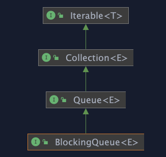
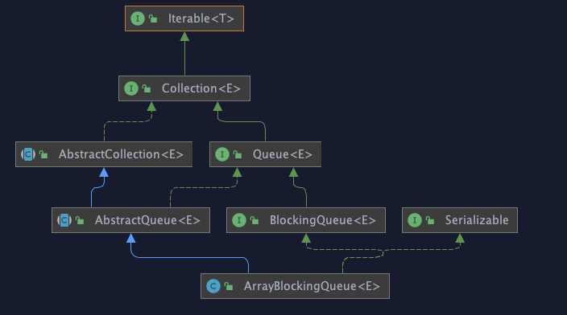
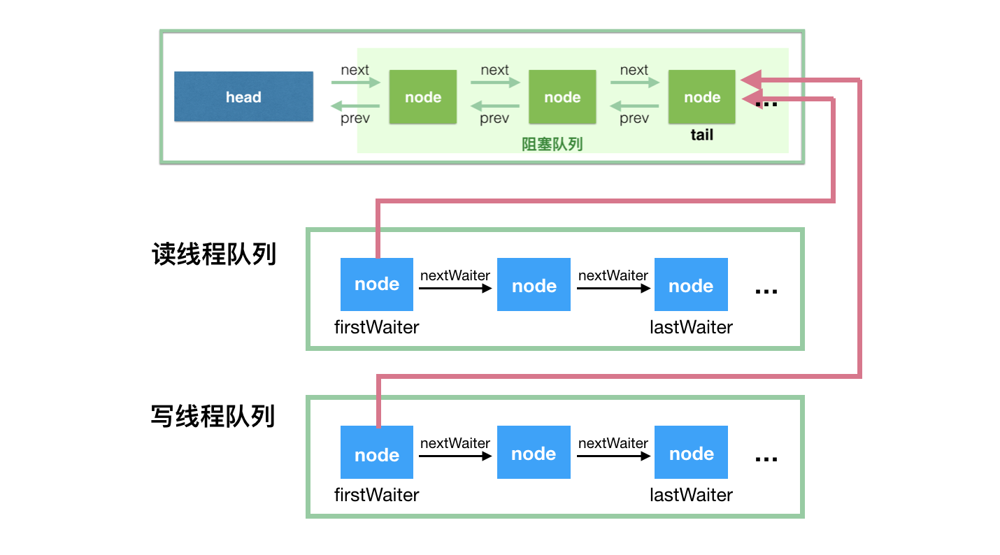
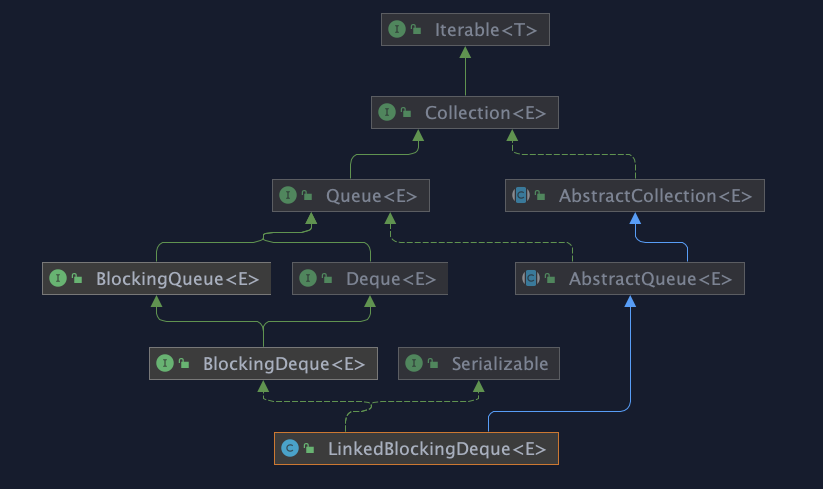
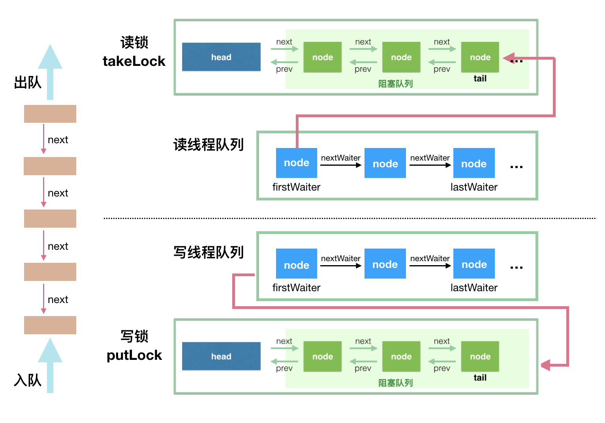
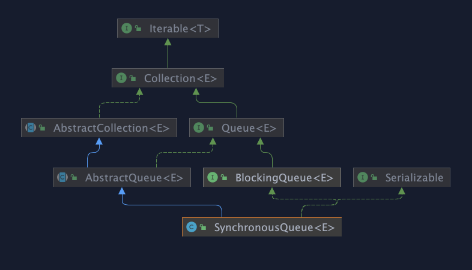
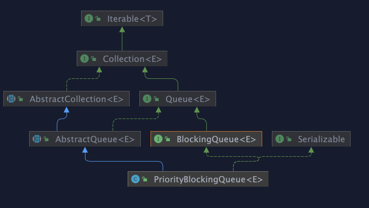

# BlockingQueue

## 简介

BlockingQueue 支持：

*   获取队列元素时，如果队列为空，会阻塞等待队列中有元素再返回

*   添加元素时，如果队列已满，那么等到队列可以放入新元素时再放入

BlockingQueue 是一个接口，它的接口继承体系如下：



BlockingQueue 对插入操作、移除操作、获取元素操作提供了四种不同的方法用于不同的场景中使用：

1.  抛出异常

2.  返回特殊值（null 或 true/false，取决于具体的操作)

3.  阻塞等待此操作，直到这个操作成功

4.  阻塞等待此操作，直到成功或者超时指定时间

|             | Throws exception | *Special value* | *Blocks*         | *Times out*          |
| ----------- | ---------------- | --------------- | ---------------- | -------------------- |
| **Insert**  | add(e)           | offer(e)        | **put(e)**       | offer(e, time, unit) |
| **Remove**  | remove()         | poll()          | **take()**       | poll(time, unit)     |
| **Examine** | element()        | peek()          | *not applicable* | *not applicable*     |

> 我们的关注点应该在 put(e) 和 take() 这两个阻塞方法

BlockingQueue `add` 、 `offer` 、 `put` 方法都不接受 null 值的插入，插入 null 值会报 `NullPointerException`  异常。null 值在BlockingQueue中只用于在队列为空时调用  `poll` 方法删除元素返回。**如果允许插入 null 值的话，那获取的时候，就不能很好地用 null 来判断到底是代表失败，还是获取的值就是 null 值。**

BlockingQueue 可能有界的，如果发现队列满了，那么 put 操作将会阻塞。 无界队列也不是真正的无界，它的容量是 Integer.MAX\_VALUE

BlockingQueue 主要用于实现生产者-消费者模式，还支持 Collection 接口。 因此可以使用 remove(x) 从队列中删除任意元素。 但是，此类操作通常不会非常有效地执行，并且仅用于偶尔使用，例如取消排队的消息时。

BlockingQueue 的实现都是线程安全的，但是批量的集合操作如 `addAll`, `containsAll`, `retainAll` 和 `removeAll` 不一定是原子操作。如 addAll(c) 有可能在添加了一些元素后中途抛出异常，此时 BlockingQueue 中已经添加了部分元素，这个是允许的，取决于具体的实现。

BlockingQueue 不支持 close 或 shutdown 等**关闭**操作，因为开发者可能希望不会有新的元素添加进去，此特性取决于具体的实现，不做强制约束。

BlockingQueue 在生产者-消费者的场景中，是支持多消费者和多生产者的，例如：

```java
  
 class Producer implements Runnable {
   private final BlockingQueue queue;
   Producer(BlockingQueue q) { queue = q; }
   public void run() {
     try {
       while (true) { queue.put(produce()); }
     } catch (InterruptedException ex) { ... handle ...}
   }
   Object produce() { ... }
 }

 class Consumer implements Runnable {
   private final BlockingQueue queue;
   Consumer(BlockingQueue q) { queue = q; }
   public void run() {
     try {
       while (true) { consume(queue.take()); }
     } catch (InterruptedException ex) { ... handle ...}
   }
   void consume(Object x) { ... }
 }

 class Setup {
   void main() {
     BlockingQueue q = new SomeQueueImplementation();
     Producer p = new Producer(q);
     Consumer c1 = new Consumer(q);
     Consumer c2 = new Consumer(q);
     new Thread(p).start();
     new Thread(c1).start();
     new Thread(c2).start();
   }
 } 
```

## 实现&#x20;

### ArrayBlockingQueue



ArrayBlockingQueue 是 BlockingQueue 接口的有界队列实现类，底层采用数组来实现。所以创建的时候一定要队列容量，如

```java
BlockingQueue arrayBlockingQueue = new ArrayBlockingQueue(10);

```

ArrayBlockingQueue 的并发控制采用 可重入锁来控制，其内部利用 一个 [ReentrantLock](../../锁/ReentrantLock/ReentrantLock.md "ReentrantLock") 和相应的两个 [condition](../../condition/condition.md "condition")来实现

```java
    /*
     * Concurrency control uses the classic two-condition algorithm
     * found in any textbook.
     */

    /** Main lock guarding all access */
    final ReentrantLock lock;

    /** Condition for waiting takes */
    private final Condition notEmpty;

    /** Condition for waiting puts */
    private final Condition notFull;
```

如果你对 AQS 以及 ReentrantLock 和 Condition比较了解的话就很容易理解 BlockingQueue的实现了，如果不了解的话，建议学习路径为:

AQS —> ReentrantLock—>Condition

ArrayBlockingQueue 实现并发同步的原理就是，读操作和写操作都需要获取到 AQS 独占锁才能进行操作。

*   如果队列为空，这个时候读操作的线程进入到**读线程等待队列**排队，等待写线程写入新的元素后，唤醒读线程队列的第一个等待线程。

*   如果队列已满，这个时候写操作的线程进入到**写线程等待队列**排队，等待读线程将队列元素移除腾出空间后，唤醒写线程队列的第一个等待线程。



### LinkedBlockingDeque



底层基于单向链表实现的阻塞队列，可以当做无界队列也可以当做有界队列来使用

```java
    /**
     * Creates a {@code LinkedBlockingDeque} with a capacity of
     * {@link Integer#MAX_VALUE}.
     */
    public LinkedBlockingDeque() {
        this(Integer.MAX_VALUE);
    }

    /**
     * Creates a {@code LinkedBlockingDeque} with the given (fixed) capacity.
     *
     * @param capacity the capacity of this deque
     * @throws IllegalArgumentException if {@code capacity} is less than 1
     */
    public LinkedBlockingDeque(int capacity) {
        if (capacity <= 0) throw new IllegalArgumentException();
        this.capacity = capacity;
    }

    /**
     * Creates a {@code LinkedBlockingDeque} with a capacity of
     * {@link Integer#MAX_VALUE}, initially containing the elements of
     * the given collection, added in traversal order of the
     * collection's iterator.
     *
     * @param c the collection of elements to initially contain
     * @throws NullPointerException if the specified collection or any
     *         of its elements are null
     */
    public LinkedBlockingDeque(Collection<? extends E> c) {
        this(Integer.MAX_VALUE);
        addAll(c);
    }

```

主要属性

```java

    /**
     * Pointer to first node.
     * Invariant: (first == null && last == null) ||
     *            (first.prev == null && first.item != null)
     */
    transient Node<E> first;

    /**
     * Pointer to last node.
     * Invariant: (first == null && last == null) ||
     *            (last.next == null && last.item != null)
     */
    transient Node<E> last;

    /** Number of items in the deque */
    private transient int count;

    /** Maximum number of items in the deque */
    private final int capacity;

    /** Main lock guarding all access */
    final ReentrantLock lock = new ReentrantLock();

    /** Condition for waiting takes */
    private final Condition notEmpty = lock.newCondition();

    /** Condition for waiting puts */
    private final Condition notFull = lock.newCondition();

   
```

这里用了两个锁，两个 Condition，简单介绍如下：

**takeLock 和 notEmpty 怎么搭配**： 如果要获取（take）一个元素，需要获取 takeLock 锁，但是获取了锁还不够，如果队列此时为空，还需要队列不为空（notEmpty）这个条件（Condition）。

**putLock 需要和 notFull 搭配**： 如果要插入（put）一个元素，需要获取 putLock 锁，但是获取了锁还不够，如果队列此时已满，还需要队列不是满的（notFull）这个条件（Condition）。



至于为什么 ArrayBlockingQueue 用一把锁，LinkedBlockingQueue用两把锁，这里有一个讨论：[https://stackoverflow.com/questions/11015571/arrayblockingqueue-uses-a-single-lock-for-insertion-and-removal-but-linkedblocki](https://stackoverflow.com/questions/11015571/arrayblockingqueue-uses-a-single-lock-for-insertion-and-removal-but-linkedblocki "https://stackoverflow.com/questions/11015571/arrayblockingqueue-uses-a-single-lock-for-insertion-and-removal-but-linkedblocki")

`Executors.newFixedThreadPool()` 使用了这个队列

### SynchronousQueue



一个不存储元素的阻塞队列。每个插入操作必须等到另一个线程调用移除操作，否则插入操作一直处于阻塞状态，吞吐量通常要高于LinkedBlockingQueue，静态工厂方法 `Executors.newCachedThreadPool`使用了这个队列。

> A blocking queue in which each insert operation must wait for a corresponding remove operation by another thread, and vice versa. A synchronous queue does not have any internal capacity, not even a capacity of one. You cannot peek at a synchronous queue because an element is only present when you try to remove it; you cannot insert an element (using any method) unless another thread is trying to remove it; you cannot iterate as there is nothing to iterate. The head of the queue is the element that the first queued inserting thread is trying to add to the queue; if there is no such queued thread then no element is available for removal and poll() will return null. For purposes of other Collection methods (for example contains), a SynchronousQueue acts as an empty collection. This queue does not permit null elements.

它是一个特殊的队列，它的名字其实就蕴含了它的特征 - - 同步的队列。为什么说是同步的呢？这里说的并不是多线程的并发问题，而是因为当一个线程往队列中写入一个元素时，写入操作不会立即返回，需要等待另一个线程来将这个元素拿走；同理，当一个读线程做读操作的时候，同样需要一个相匹配的写线程的写操作。这里的 Synchronous 指的就是读线程和写线程需要同步，一个读线程匹配一个写线程。

你不能在 SynchronousQueue 中使用 peek 方法（在这里这个方法直接返回 null），peek 方法的语义是只读取不移除，显然，这个方法的语义是不符合 SynchronousQueue 的特征的。SynchronousQueue 也不能被迭代，因为根本就没有元素可以拿来迭代的。虽然 SynchronousQueue 间接地实现了 Collection 接口，但是如果你将其当做 Collection 来用的话，那么集合是空的。当然，这个类也是不允许传递 null 值的（并发包中的容器类好像都不支持插入 null 值，因为 null 值往往用作其他用途，比如用于方法的返回值代表操作失败）。

**因为SynchronousQueue没有存储功能，因此put和take会一直阻塞，直到有另一个线程已经准备好参与到交付过程中。仅当有足够多的消费者，并且总是有一个消费者准备好获取交付的工作时，才适合使用同步队列。**

举例：  插入数据的线程和获取数据的线程，交替执行

```java
public class SynchronousQueueExample {

    static class SynchronousQueueProducer implements Runnable {

        protected BlockingQueue<String> blockingQueue;
        final Random random = new Random();

        public SynchronousQueueProducer(BlockingQueue<String> queue) {
            this.blockingQueue = queue;
        }

        @Override
        public void run() {
            while (true) {
                try {
                    String data = UUID.randomUUID().toString();
                    System.out.println("Put: " + data);
                    blockingQueue.put(data);
                    Thread.sleep(1000);
                } catch (InterruptedException e) {
                    e.printStackTrace();
                }
            }
        }

    }

    static class SynchronousQueueConsumer implements Runnable {

        protected BlockingQueue<String> blockingQueue;

        public SynchronousQueueConsumer(BlockingQueue<String> queue) {
            this.blockingQueue = queue;
        }

        @Override
        public void run() {
            while (true) {
                try {
                    String data = blockingQueue.take();
                    System.out.println(Thread.currentThread().getName()
                            + " take(): " + data);
                    Thread.sleep(2000);
                } catch (InterruptedException e) {
                    e.printStackTrace();
                }
            }
        }

    }

    public static void main(String[] args) {
        final BlockingQueue<String> synchronousQueue = new SynchronousQueue<String>();

        SynchronousQueueProducer queueProducer = new SynchronousQueueProducer(
                synchronousQueue);
        new Thread(queueProducer).start();

        SynchronousQueueConsumer queueConsumer1 = new SynchronousQueueConsumer(
                synchronousQueue);
        new Thread(queueConsumer1).start();

        SynchronousQueueConsumer queueConsumer2 = new SynchronousQueueConsumer(
                synchronousQueue);
        new Thread(queueConsumer2).start();

    }
}
```

SynchronousQueue的以下方法很有趣：

*   iterator() 永远返回空，因为里面没东西。

*   peek() 永远返回null。

*   put() 往queue放进去一个element以后就一直wait直到有其他thread进来把这个element取走。

*   offer() 往queue里放一个element后立即返回，如果碰巧这个element被另一个thread取走了，offer方法返回true，认为offer成功；否则返回false。

*   offer(2000, TimeUnit.SECONDS) 往queue里放一个element但是等待指定的时间后才返回，返回的逻辑和offer()方法一样。

*   take() 取出并且remove掉queue里的element（认为是在queue里的。。。），取不到东西他会一直等。

*   poll() 取出并且remove掉queue里的element（认为是在queue里的。。。），只有到碰巧另外一个线程正在往queue里offer数据或者put数据的时候，该方法才会取到东西。否则立即返回null。

*   poll(2000, TimeUnit.SECONDS) 等待指定的时间然后取出并且remove掉queue里的element,其实就是再等其他的thread来往里塞。

*   isEmpty()永远是true。

*   remainingCapacity() 永远是0。

*   remove()和removeAll() 永远是false。

**Executors.newCachedThreadPool 为什么使用 SynchronousQueue ？**

在使用SynchronousQueue作为工作队列的前提下，客户端代码向线程池提交任务时，而线程池中又没有空闲的线程能够从SynchronousQueue队列实例中取一个任务，那么相应的offer方法调用就会失败（即任务没有被存入工作队列）。此时，ThreadPoolExecutor会新建一个新的工作者线程用于对这个入队列失败的任务进行处理（假设此时线程池的大小还未达到其最大线程池大小maximumPoolSize）

可以参考ThreadPoolExecutor 的源码

```java
 public void execute(Runnable command) {
        if (command == null)
            throw new NullPointerException();
        /*
         * Proceed in 3 steps:
         *
         * 1. If fewer than corePoolSize threads are running, try to
         * start a new thread with the given command as its first
         * task.  The call to addWorker atomically checks runState and
         * workerCount, and so prevents false alarms that would add
         * threads when it shouldn't, by returning false.
         *
         * 2. If a task can be successfully queued, then we still need
         * to double-check whether we should have added a thread
         * (because existing ones died since last checking) or that
         * the pool shut down since entry into this method. So we
         * recheck state and if necessary roll back the enqueuing if
         * stopped, or start a new thread if there are none.
         *
         * 3. If we cannot queue task, then we try to add a new
         * thread.  If it fails, we know we are shut down or saturated
         * and so reject the task.
         */
        int c = ctl.get();
        if (workerCountOf(c) < corePoolSize) {
            if (addWorker(command, true))
                return;
            c = ctl.get();
        }
        if (isRunning(c) && workQueue.offer(command)) {
            int recheck = ctl.get();
            if (! isRunning(recheck) && remove(command))
                reject(command);
            else if (workerCountOf(recheck) == 0)
                addWorker(null, false);
        }
        else if (!addWorker(command, false))
            reject(command);
    }
```

**再重复一遍：SynchronousQueue它将任务直接提交给线程而不保持它们。如果不存在可用于立即运行任务的线程，则试图把任务加入队列将失败，因此会构造一个新的线程。**

**线程数会随着任务数量变化自动扩张和缩减，可以灵活回收空闲线程（**ThreadPoolExecutor回收工作线程，一条线程getTask()返回null，就会被回收**。），用SynchronousQueue队列整好保证了CachedTheadPool的特点。**

### 小结

不像ArrayBlockingQueue或LinkedListBlockingQueue，SynchronousQueue内部并没有数据缓存空间，你不能调用peek()方法来看队列中是否有数据元素，因为数据元素只有当你试着取走的时候才可能存在，不取走而只想偷窥一下是不行的，当然遍历这个队列的操作也是不允许的。队列头元素是第一个排队要插入数据的**线程**，而不是要交换的数据。数据是在配对的生产者和消费者线程之间直接传递的，并不会将数据缓冲数据到队列中。可以这样来理解：生产者和消费者互相等待对方，握手，然后**一起**离开。

SynchronousQueue的一个使用场景是在线程池里。Executors.newCachedThreadPool()就使用了SynchronousQueue，这个线程池根据需要（新任务到来时）创建新的线程，如果有空闲线程则会重复使用，线程空闲了60秒后会被回收。

### PriorityBlockingQueue



PriorityBlockingQueue是一个无限容量的阻塞队列,PriorityBlockingQueue 指定初始的队列大小后，后面插入元素的时候，如果空间不够的话会自动扩容。

内部实现是数组，最长也不会超过 Integer.MAX\_VALUE - 8

```java

    /**
     * The maximum size of array to allocate.
     * Some VMs reserve some header words in an array.
     * Attempts to allocate larger arrays may result in
     * OutOfMemoryError: Requested array size exceeds VM limit
     */
    private static final int MAX_ARRAY_SIZE = Integer.MAX_VALUE - 8;
 
```

其并发控制采用的是 ReentrantLock。

简单地说，它就是 PriorityQueue 的线程安全版本。不可以插入 null 值，同时，插入队列的对象必须是可比较大小的（comparable），否则报 ClassCastException 异常。它的插入操作 put 方法不会 block，因为它是无界队列（take 方法在队列为空的时候会阻塞）。

PriorityBlockingQueue排序是通过最小堆实现的，可以通过堆排序[排序算法（十大经典排序算法）](../../../../../算法和数据结构/算法/排序算法（十大经典排序算法）/排序算法（十大经典排序算法）.md "排序算法（十大经典排序算法）")了解下堆的实现。

小结

*   PriorityBlockingQueue是一个数组实现的无限制容量的优先级阻塞队列

*   默认初始容量为11，容量不够时可进行扩容操作

*   通过平衡二叉最小堆实现优先级排列

*   take、poll方法出队或drainTo转移的集合才是有序的

## 总结

JDK 8 中提供了七个阻塞队列可供使用

*   &#x20;`ArrayBlockingQueue` ：一个由数组结构组成的有界阻塞队列。

*   `LinkedBlockingQueue` ：一个由链表结构组成的无界阻塞队列。

*   `PriorityBlockingQueue` ：一个支持优先级排序的无界阻塞队列。

*   `DelayQueue`：一个使用优先级队列实现的无界阻塞队列。

*   `SynchronousQueue`：一个不存储元素的阻塞队列。

*   `LinkedTransferQueue`：一个由链表结构组成的无界阻塞队列。

*   `LinkedBlockingDeque`：一个由链表结构组成的双向阻塞队列。

## 参考

*   [https://javadoop.com/post/java-concurrent-queue](https://javadoop.com/post/java-concurrent-queue "https://javadoop.com/post/java-concurrent-queue")

*   [https://zacard.net/2021/01/19/java-linked-queue/](https://zacard.net/2021/01/19/java-linked-queue/ "https://zacard.net/2021/01/19/java-linked-queue/")

