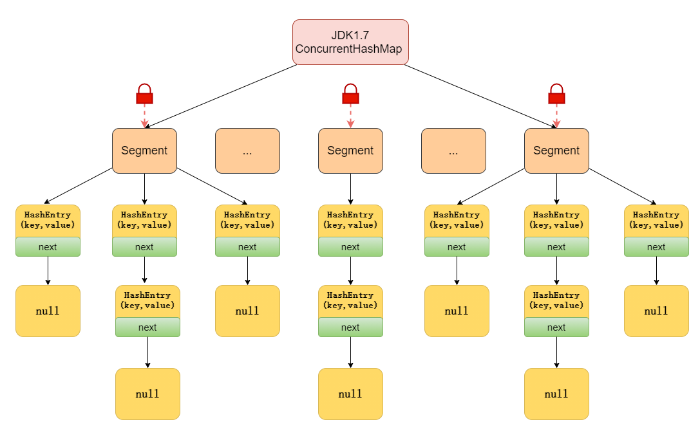
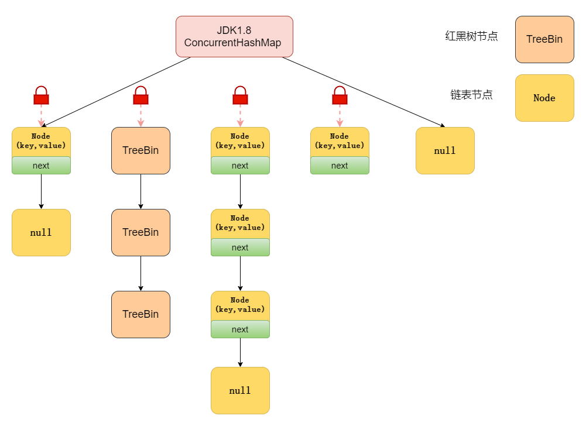
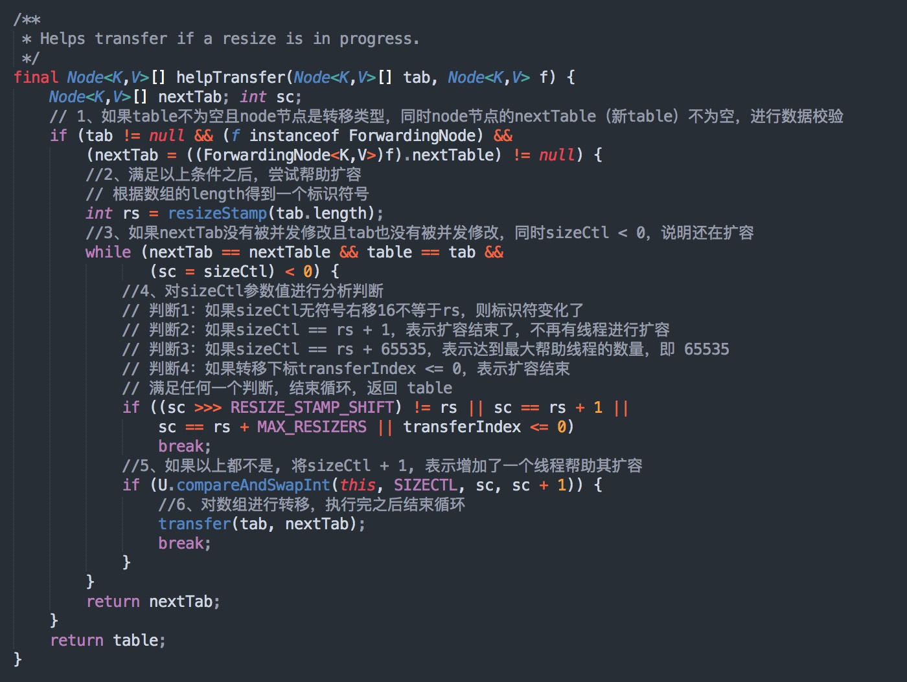
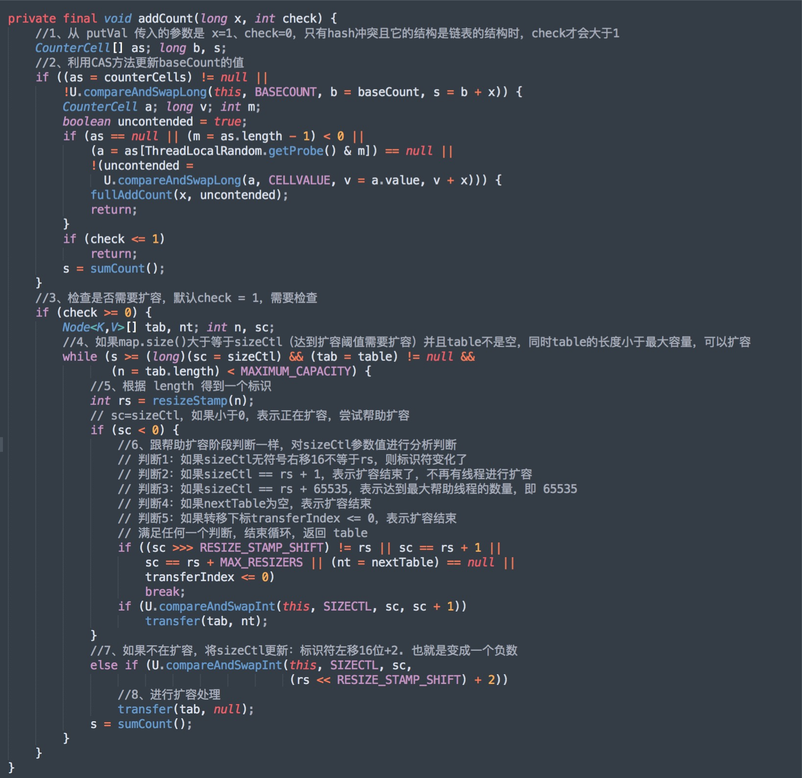
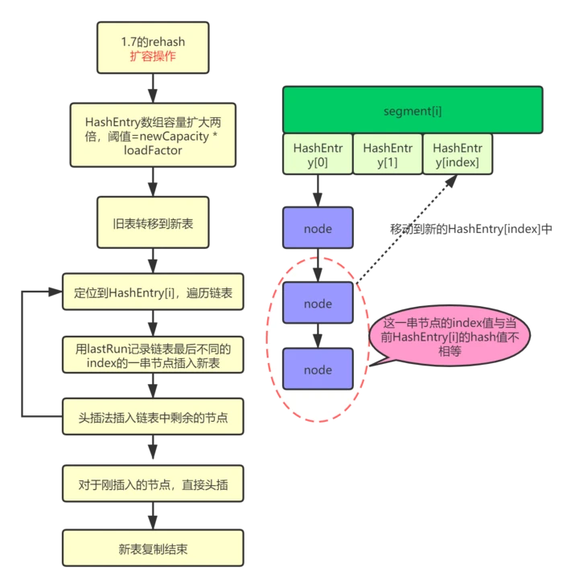
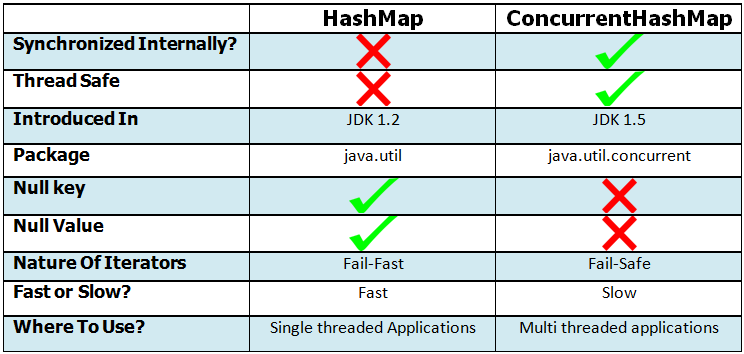
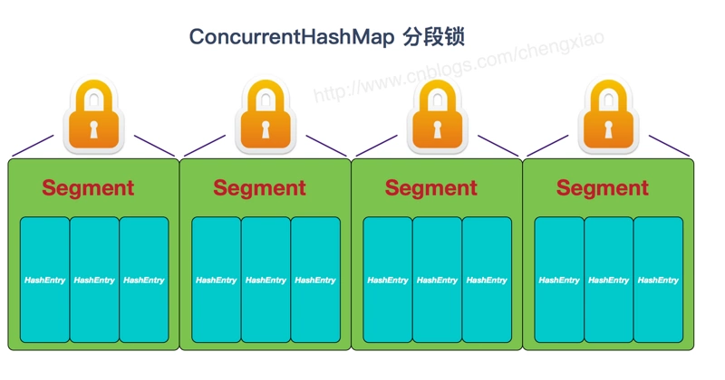
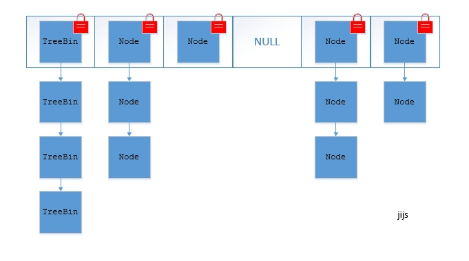

# ConcurrentHashMap

## 介绍

*   ConcurrentHashMap是一个支持并发的 hash 表，且可调整预期的并发度

*   拥有HashTable 所有的方法实现版本，在只考虑线程安全不考虑同步细节的情况下可与 HashTable 互换。

*   不但是线程安全的，而且在检索时不需要加锁

*   检索操作（包括 get）通常不会阻塞，因此可能与更新操作（包括  put和remove)重叠。这就意味着它**不是实时**的，只会得到最近时刻的一个结果，从数据一致性上看是**弱一致**的，不是强一致的。同理，并发检索可能仅反映插入或删除某些条目。

*   迭代器和枚举返回反映哈希表在创建迭代器/枚举时或创建以来的某个时间点的状态的元素。它们不会引发 ConcurrentModificationException。但是，迭代器被设计为一次只能由一个线程使用。

*   并发度（**程序运行时能够同时更新 ConccurentHashMap 且不产生锁竞争的最大线程数**）默认为 16，且可以在构造函数中设置。

    *   理想情况下，应该选择一个值来容纳同时修改表的线程数。使用明显高于所需值会浪费空间和时间，而明显较低的值可能会导致线程争用。但是，在一个数量级内的高估和低估通常不会产生太多明显的影响。当已知只有一个线程将修改而所有其他线程将仅读取时，值为 1 是合适的。此外，调整此哈希表或任何其他类型的哈希表的大小是一个相对较慢的操作，因此，在可能的情况下，最好在构造函数中提供预期表大小的估计值。

*   与 Hashtable 类似，但与 HashMap 不同，**此类不允许将 null 用作键或值**。

## JDK1.7

### 数据结构

JDK1.7之前的ConcurrentHashMap使用**分段锁**机制实现，采用Segment + HashEntry + ReentrantLock的方式进行实现。

ConcurrentHashMap在对象中保存了一个Segment数组，即

*   将整个Hash表划分为多个分段

*   而每个Segment元素，即每个分段则类似于一个Hashtable

*   这样，在执行put操作时首先根据hash算法定位到元素属于哪个Segment，然后对该Segment加锁即可

所以每次需要加锁的操作锁住的是一个 segment，这样只要保证每个 Segment 是线程安全的，也就实现了全局的线程安全。



### 内部字段

*   Segment 通过继承 ReentrantLock 来进行加锁 。Segment 默认为 16（16个段），也就是并发度为 16

*   Segment数组的长度最大为65536，最大容量 1 << 30。

*   Segment 数组**不可以扩容**，所谓的扩容 是 segment 数组某个位置内部的数组 HashEntry\<K,V>\[] 进行扩容

```java
    /**
     * The default concurrency level for this table, used when not
     * otherwise specified in a constructor.
     */
   
    static final int DEFAULT_CONCURRENCY_LEVEL = 16;
    /**
     * The maximum number of segments to allow; used to bound
     * constructor arguments. Must be power of two less than 1 << 24.
     */
    static final int MAX_SEGMENTS = 1 << 16; // slightly conservative 
    
    /**
     * The maximum capacity, used if a higher value is implicitly
     * specified by either of the constructors with arguments.  MUST
     * be a power of two <= 1<<30 to ensure that entries are indexable
     * using ints.
     */
    static final int MAXIMUM_CAPACITY = 1 << 30;
```

HashEntry中，用 volatile 修饰了 HashEntry 的数据 value 和 下一个节点 next，保证了多线程环境下数据获取时的**可见性**

```java
static final class HashEntry<K,V> {
        final int hash;
        final K key;
        volatile V value;
        volatile HashEntry<K,V> next;
```

initialCapacity 初始容量，这个值指的是整个 ConcurrentHashMap 的初始容量，实际操作的时候需要平均分给每个 Segment，默认每个Segment里的table容量最小为2

```java
  public ConcurrentHashMap(int initialCapacity,
                             float loadFactor, int concurrencyLevel) {
        if (!(loadFactor > 0) || initialCapacity < 0 || concurrencyLevel <= 0)
            throw new IllegalArgumentException();
        if (concurrencyLevel > MAX_SEGMENTS)
            concurrencyLevel = MAX_SEGMENTS;
        // Find power-of-two sizes best matching arguments
        int sshift = 0;
        int ssize = 1;
        while (ssize < concurrencyLevel) {
            ++sshift;
            ssize <<= 1;
        }
        this.segmentShift = 32 - sshift;
        this.segmentMask = ssize - 1;
        if (initialCapacity > MAXIMUM_CAPACITY)
            initialCapacity = MAXIMUM_CAPACITY;
        int c = initialCapacity / ssize;
        if (c * ssize < initialCapacity)
            ++c;
        int cap = MIN_SEGMENT_TABLE_CAPACITY; //这个值默认为 2 且必须为2的幂次方
        while (cap < c)
            cap <<= 1;
        // create segments and segments[0]
        Segment<K,V> s0 =
                new Segment<K,V>(loadFactor, (int)(cap * loadFactor),
                        (HashEntry<K,V>[])new HashEntry[cap]);
        Segment<K,V>[] ss = (Segment<K,V>[])new Segment[ssize];
        UNSAFE.putOrderedObject(ss, SBASE, s0); // ordered write of segments[0]
        this.segments = ss;
    }
```

loadFactor: 负载因子，Segment 数组不可以扩容，所以这个负载因子是给每个 Segment 内部使用的。

### 初始化

我们就当是用 new ConcurrentHashMap() 无参构造函数进行初始化的，那么初始化完成后:

*   Segment 数组长度为 16，不可以扩容

*   Segment\[i] 的默认大小为 2，负载因子是 0.75，得出初始阈值为 1.5，也就是以后插入第一个元素不会触发扩容，插入第二个会进行第一次扩容

*   这里初始化了 segment\[0]，其他位置还是 null

*   当前 segmentShift 的值为 32 - 4 = 28，segmentMask 为 16 - 1 = 15

### 弱一致性

在JDK 1.7 的版本中，你看到代码中的相关字段是用 `volatile` 声明的

虽然引用类型（数组类型）的变量tab是volatile的，但tab中的元素不是volatile的

```java
static final class HashEntry<K,V> {
        final int hash;
        final K key;
        volatile V value;
        volatile HashEntry<K,V> next;
 ...
       
  final V put(K key, int hash, V value, boolean onlyIfAbsent) {
            HashEntry<K,V> node = tryLock() ? null :
                    scanAndLockForPut(key, hash, value);
            V oldValue;
            try {
                HashEntry<K,V>[] tab = table;
                int index = (tab.length - 1) & hash;
                HashEntry<K,V> first = entryAt(tab, index);
                for (HashEntry<K,V> e = first;;) {
                    if (e != null) {
                        K k;
                        if ((k = e.key) == key ||
                                (e.hash == hash && key.equals(k))) {
                            oldValue = e.value;
                            if (!onlyIfAbsent) {
                                e.value = value;
                                ++modCount;
                            }
                            break;
                        }
                        e = e.next;
                    }
                    else {
                        if (node != null)
                            node.setNext(first);
                        else
                            node = new HashEntry<K,V>(hash, key, value, first);
                        int c = count + 1;
                        if (c > threshold && tab.length < MAXIMUM_CAPACITY)
                            rehash(node);
                        else
                            setEntryAt(tab, index, node);
                        ++modCount;
                        count = c;
                        oldValue = null;
                        break;
                    }
                }
            } finally {
                unlock();
            }
            return oldValue;
        }       
```

因为get操作几乎所有时候都是一个无锁操作（get中有一个readValueUnderLock调用，不过这句执行到的几率极小），使得同一个Segment实例上的put和get可以同时进行，这就是get操作是弱一致的根本原因。Java API中对此有一句简单的描述:

> Retrievals reflect the results of the most recently ***completed*** update operations holding upon their onset.

也就是说API上保证get操作一定能看到**已完成**的put操作。已完成的put操作肯定在get读取数据之前对数据做了写入操作。

在遍历过程中，如果已经遍历的数组上的内容变化了，迭代器不会抛出ConcurrentModificationException异常。如果未遍历的数组上的内容发生了变化，则有可能反映到迭代过程中。这就是ConcurrentHashMap迭代器弱一致的表现。

**JDK1.8源码中查看，重要的实现在Traverser中**

KeyIterator在调用next方法时，最终会作用在Traverser类的advance方法中，advance方法负责寻找下一个元素。此方法中不会抛出ConcurrentModificationException；advance方法中通过不断循环遍历，其中考虑到table的大小发生变化，并且节点的组织方式可能是链表也可能是红黑树，遍历的过程中可能会有部分数据遍历不到，此为弱一致性的表现。

```java
static class Traverser<K,V> {
        Node<K,V>[] tab;        // current table; updated if resized
        Node<K,V> next;         // the next entry to use
        TableStack<K,V> stack, spare; // to save/restore on ForwardingNodes
        int index;              // index of bin to use next
        int baseIndex;          // current index of initial table
        int baseLimit;          // index bound for initial table
        final int baseSize;     // initial table size

        Traverser(Node<K,V>[] tab, int size, int index, int limit) {
            this.tab = tab;
            this.baseSize = size;
            this.baseIndex = this.index = index;
            this.baseLimit = limit;
            this.next = null;
        }

        /**
         * Advances if possible, returning next valid node, or null if none.
         */
        final Node<K,V> advance() {
            Node<K,V> e;
            if ((e = next) != null)
                e = e.next;
            for (;;) {
                Node<K,V>[] t; int i, n;  // must use locals in checks
                if (e != null)
                    return next = e;
                if (baseIndex >= baseLimit || (t = tab) == null ||
                    (n = t.length) <= (i = index) || i < 0)
                    return next = null;
                if ((e = tabAt(t, i)) != null && e.hash < 0) {
                    if (e instanceof ForwardingNode) {
                        tab = ((ForwardingNode<K,V>)e).nextTable;
                        e = null;
                        pushState(t, i, n);
                        continue;
                    }
                    else if (e instanceof TreeBin)
                        e = ((TreeBin<K,V>)e).first;
                    else
                        e = null;
                }
                if (stack != null)
                    recoverState(n);
                else if ((index = i + baseSize) >= n)
                    index = ++baseIndex; // visit upper slots if present
            }
        }
    }


```

**在JDK1.8以上的版本中，虽然数据结构和实现不太一样，但结论是一致的，仍然是弱一致性。**

```java
static class Node<K,V> implements Map.Entry<K,V> {
        final int hash;
        final K key;
        volatile V val;
        volatile Node<K,V> next;
```

ConcurrentHashMap提供的迭代器不会抛出ConcurentModificationException，也就是说迭代器如果发现数据被修改了，它会尽量去访问到对Map已做的修改，但这个不能保证。所以它读到的可能是过期的数据，也就是存在“弱一致性”问题。 对于一个被 并发访问的ConcurrentHashMap来说，size()和isEmpty()往往是不准确的。

ConcurrentHashMap的弱一致性主要是为了提升效率，是一致性与效率之间的一种权衡。要成为强一致性，就得到处使用锁，甚至是全局锁，这就与Hashtable和同步的HashMap一样了。

## JDK1.8

### 数据结构

**JDK1.8 选择了与HashMap类似的数组+链表+红黑树的方式实现，而加锁则采用CAS和synchronized实现**。虽然在 JDK1.8 中还能看到 Segment 的数据结构，但是已经简化了属性，只是为了兼容旧版本。



### 内部字段

**sizeCtl**&#x20;

在初始化时的场景

```java
    /**
     * Table initialization and resizing control.  When negative, the
     * table is being initialized or resized: -1 for initialization,
     * else -(1 + the number of active resizing threads).  Otherwise,
     * when table is null, holds the initial table size to use upon
     * creation, or 0 for default. After initialization, holds the
     * next element count value upon which to resize the table.
     */
    private transient volatile int sizeCtl;
    
    public ConcurrentHashMap(int initialCapacity) {
      if (initialCapacity < 0)
          throw new IllegalArgumentException();
      int cap = ((initialCapacity >= (MAXIMUM_CAPACITY >>> 1)) ?
                 MAXIMUM_CAPACITY :
                 tableSizeFor(initialCapacity + (initialCapacity >>> 1) + 1));
      this.sizeCtl = cap;
    }
```

通过提供初始容量，计算了 sizeCtl，sizeCtl = 【 (1.5 \* initialCapacity + 1)，然后向上取最近的 2 的 n 次方】。如 initialCapacity 为 10，那么得到 sizeCtl 为 16，如果 initialCapacity 为 11，得到 sizeCtl 为 32。

### 重要方法流程

**put** 方法流程

```java

final V putVal(K key, V value, boolean onlyIfAbsent) {
    if (key == null || value == null) throw new NullPointerException();
    // 得到 hash 值
    int hash = spread(key.hashCode());
    // 用于记录相应链表的长度
    int binCount = 0;
    for (Node<K,V>[] tab = table;;) {
        Node<K,V> f; int n, i, fh;
        // 如果数组"空"，进行数组初始化
        if (tab == null || (n = tab.length) == 0)
            // 初始化数组，后面会详细介绍
            tab = initTable();

        // 找该 hash 值对应的数组下标，得到第一个节点 f
        else if ((f = tabAt(tab, i = (n - 1) & hash)) == null) {
            // 如果数组该位置为空，
            //    用一次 CAS 操作将这个新值放入其中即可，这个 put 操作差不多就结束了，可以拉到最后面了
            //          如果 CAS 失败，那就是有并发操作，进到下一个循环就好了
            if (casTabAt(tab, i, null,
                         new Node<K,V>(hash, key, value, null)))
                break;                   // no lock when adding to empty bin
        }
        // hash 居然可以等于 MOVED，这个需要到后面才能看明白，不过从名字上也能猜到，肯定是因为在扩容
        else if ((fh = f.hash) == MOVED)
            // 帮助数据迁移，这个等到看完数据迁移部分的介绍后，再理解这个就很简单了
            tab = helpTransfer(tab, f);

        else { // 到这里就是说，f 是该位置的头节点，而且不为空

            V oldVal = null;
            // 获取数组该位置的头节点的监视器锁
            synchronized (f) {
                if (tabAt(tab, i) == f) {
                    if (fh >= 0) { // 头节点的 hash 值大于 0，说明是链表
                        // 用于累加，记录链表的长度
                        binCount = 1;
                        // 遍历链表
                        for (Node<K,V> e = f;; ++binCount) {
                            K ek;
                            // 如果发现了"相等"的 key，判断是否要进行值覆盖，然后也就可以 break 了
                            if (e.hash == hash &&
                                ((ek = e.key) == key ||
                                 (ek != null && key.equals(ek)))) {
                                oldVal = e.val;
                                if (!onlyIfAbsent)
                                    e.val = value;
                                break;
                            }
                            // 到了链表的最末端，将这个新值放到链表的最后面
                            Node<K,V> pred = e;
                            if ((e = e.next) == null) {
                                pred.next = new Node<K,V>(hash, key,
                                                          value, null);
                                break;
                            }
                        }
                    }
                    else if (f instanceof TreeBin) { // 红黑树
                        Node<K,V> p;
                        binCount = 2;
                        // 调用红黑树的插值方法插入新节点
                        if ((p = ((TreeBin<K,V>)f).putTreeVal(hash, key,
                                                       value)) != null) {
                            oldVal = p.val;
                            if (!onlyIfAbsent)
                                p.val = value;
                        }
                    }
                }
            }

            if (binCount != 0) {
                // 判断是否要将链表转换为红黑树，临界值和 HashMap 一样，也是 8
                if (binCount >= TREEIFY_THRESHOLD)
                    // 这个方法和 HashMap 中稍微有一点点不同，那就是它不是一定会进行红黑树转换，
                    // 如果当前数组的长度小于 64，那么会选择进行数组扩容，而不是转换为红黑树
                    //    具体源码我们就不看了，扩容部分后面说
                    treeifyBin(tab, i);
                if (oldVal != null)
                    return oldVal;
                break;
            }
        }
    }
    // 
    addCount(1L, binCount);
    return null;
}
```

1.  如果没有初始化，就调用 initTable() 方法来进行初始化；

2.  如果没有 hash 冲突就直接 CAS 无锁插入；

3.  如果需要扩容，就先进行扩容；

4.  如果存在 hash 冲突，就加锁来保证线程安全，两种情况：一种是链表形式就直接遍历到尾端插入，一种是红黑树就按照红黑树结构插入；

5.  如果该链表的数量大于阀值 8，就要先转换成红黑树的结构，break 再一次进入循环

6.  如果添加成功就调用 addCount() 方法统计 size，并且检查是否需要扩容。

**get** 方法流程

```java
public V get(Object key) {
    Node<K,V>[] tab; Node<K,V> e, p; int n, eh; K ek;
    int h = spread(key.hashCode());
    if ((tab = table) != null && (n = tab.length) > 0 &&
        (e = tabAt(tab, (n - 1) & h)) != null) {
        // 判断头节点是否就是我们需要的节点
        if ((eh = e.hash) == h) {
            if ((ek = e.key) == key || (ek != null && key.equals(ek)))
                return e.val;
        }
        // 如果头节点的 hash 小于 0，说明 正在扩容，或者该位置是红黑树
        else if (eh < 0)
            // 参考 ForwardingNode.find(int h, Object k) 和 TreeBin.find(int h, Object k)
            return (p = e.find(h, key)) != null ? p.val : null;

        // 遍历链表
        while ((e = e.next) != null) {
            if (e.hash == h &&
                ((ek = e.key) == key || (ek != null && key.equals(ek))))
                return e.val;
        }
    }
    return null;
}
```

*   计算 hash 值

*   根据 hash 值找到数组对应位置: (n - 1) & h

*   根据该位置处结点性质进行相应查找

    *   如果该位置为 null，那么直接返回 null 就可以了

    *   如果该位置处的节点刚好就是我们需要的，返回该节点的值即可

    *   如果该位置节点的 hash 值小于 0，说明正在扩容，或者是红黑树

    *   如果以上 3 条都不满足，那就是链表，进行遍历比对即可

扩容方法 transfer()：默认容量为 16，扩容时，容量变为原来的两倍。

**helpTransfer**()：调用多个工作线程一起帮助进行扩容，这样的效率就会更高。



这个过程，操作步骤如下：

*   第1步，对 table、node 节点、node 节点的 nextTable，进行数据校验；

*   第2步，根据数组的length得到一个标识符号；

*   第3步，进一步校验 nextTab、tab、sizeCtl 值，如果 nextTab 没有被并发修改并且 tab 也没有被并发修改，同时 `sizeCtl < 0`，说明还在扩容；

*   第4步，对 sizeCtl 参数值进行分析判断，如果不满足任何一个判断，将`sizeCtl + 1`, 增加了一个线程帮助其扩容;

**addCount 扩容判断**



这个过程，操作步骤如下：

*   第1步，利用CAS将方法更新baseCount的值

*   第2步，检查是否需要扩容，默认check = 1，需要检查；

*   第3步，如果满足扩容条件，判断当前是否正在扩容，如果是正在扩容就一起扩容；

*   第4步，如果不在扩容，将sizeCtl更新为负数，并进行扩容处理；

put 的流程基本分析完了，可以从中发现，里面大量的使用了`CAS`方法，CAS 表示比较与替换，里面有3个参数，分别是**目标内存地址、旧值、新值**，每次判断的时候，会将旧值与目标内存地址中的值进行比较，如果相等，就将新值更新到内存地址里，如果不相等，就继续循环，直到操作成功为止！

### 扩容



在Map扩容时，ConcurrentHashMap会将原来的数组按照长度切割成多个段，每个线程占用其中的一个段，负责将其中的数组元素包含的节点转移到扩容后的新数组中，当修改Map时如果发现对应的数组元素的hash值是MOVED，就认为当前正在扩容，会尝试去申请一个段，如果所有的段都分配了，则自旋等待扩容完成，数组元素的hash值变成非MOVED，最后一个完成转移任务的线程会负责将扩容后已经完成节点转移的临时数组设置成Map的有效数组。注意原数组中的数组元素及其节点关系都未发生变更，即此时其他线程可以继续在原数组中遍历，直到感知到了临时数组被设置成新数组了。如果没有线程访问原数组，原数组因为没有根节点引用，就会整体被垃圾回收掉。

*   图解

    **触发扩容的操作：**

    假设目前数组长度为8，数组的元素的个数为5。再放入一个元素就会触发扩容操作。 &#x20;

    

    总结一下扩容条件：

    (1) 元素个数达到扩容阈值。

    (2) 调用 putAll 方法，但目前容量不足以存放所有元素时。

    (3) 某条链表长度达到8，但数组长度却小于64时。

    **CPU核数与迁移任务hash桶数量分配(步长)的关系**

    

    **单线程下线程的任务分配与迁移操作**

    

    **多线程如何分配任务？**

    

    **普通链表如何迁移？**

    

    **什么是 lastRun 节点？**

    

    **红黑树如何迁移？**

    

    **hash桶迁移中以及迁移后如何处理存取请求？**

    

    **多线程迁移任务完成后的操作**

    

    

### 原子操作

*   `put()`与`get()`操作是线程安全的

*   `putIfAbsent()` 实现get()、put()原子性操作，因为 ConcurrentHashMap#putIfAbsent() 方法内部加了synchronized锁


`computeIfAbsent`  复合原子操作，实现上类似putIfAbsent，此方法首先判断缓存MAP中是否存在指定key的值，如果不存在，会自动调用mappingFunction(key)计算key的value，然后将key = value放入到缓存Map。如果mappingFunction(key)返回的值为null或抛出异常，则不会有记录存入map

```java
 ConcurrentHashMap<String, Integer> map = new ConcurrentHashMap<>();

        //JDK8之前这样写
        if (map.get("hello") == null) {

            map.put("hello", 123);
        }
        //以后这么写
        map.computeIfAbsent("hello", key -> 123);
 
```

复合原子操作举例：

```java
boolean register(User user) {
    if (userMap.containsKey(user.getUsername)) {
      log.info("用户已存在");
      return false;
    } else {
      userMap.put(user.getUsername, user);
            log.info("用户注册成功, {}, {}", user.getUsername(), user.getAge());      
      return true;
    }
  } 
```

以上方法中的代码存在对 ConcurrentMap的`复合操作`  ，它不是原子的，所以会有问题。可以改为下面的实现：

```java
boolean register(User user) {
    User hasMapped = userMap.putIfAbsent(user.getUsername, user);
    if (hasMapped != null) {
      log.info("用户已存在");
      return false;
    } else {
            log.info("用户注册成功, {}, {}", user.getUsername(), user.getAge());      
      return true;
    }
  } 
```

## 其他问题

### 与HashMap 区别



*   ConcurrentHashMap线程安全，而HashMap非线程安全

*   HashMap允许Key和Value为null，而ConcurrentHashMap不允许

*   HashMap不允许通过Iterator遍历的同时通过HashMap修改，而ConcurrentHashMap允许该行为，并且该更新对后续的遍历可见

### 在 JDK 1.8 中，为什么要使用内置锁 synchronized 来代替重入锁 ReentrantLock？

*   粒度降低了(看下图感觉下锁粒度的变化)

*   JVM 开发团队没有放弃 synchronized，而且基于 JVM 的 synchronized 优化空间更大，更加自然。

*   在大量的数据操作下，对于 JVM 的内存压力，基于 API 的 ReentrantLock 会开销更多的内存。





### get方法是否要加锁，为什么？

不需要。get没有加锁的话，ConcurrentHashMap是如何保证读到的数据不是脏数据的呢？

get操作全程不需要加锁是因为Node的成员val是用volatile修饰的。

### 如何计算 size

**size()方法返回的是一个不精确的值**

我们先来看一下jdk1.8的代码注释：

**大致的意思是：返回容器的大小。这个方法应该被用来代替size()方法，因为 ConcurrentHashMap的容量大小可能会大于int的最大值。返回的值是一个估计值;如果有并发插入或者删除操作，则实际的数量可能有所不同。**

```java
/**
     * Returns the number of mappings. This method should be used
     * instead of {@link #size} because a ConcurrentHashMap may
     * contain more mappings than can be represented as an int. The
     * value returned is an estimate; the actual count may differ if
     * there are concurrent insertions or removals.
     *（大致的意思是：返回容器的大小。这个方法应该被用来代替size()方法，因为
     * ConcurrentHashMap的容量大小可能会大于int的最大值。
     * 返回的值是一个估计值;如果有并发插入或者删除操作，则实际的数量可能有所不同。）
     * @return the number of mappings
     * @since 1.8
     */
    public long mappingCount() {
        long n = sumCount();
        return (n < 0L) ? 0L : n; // ignore transient negative values
    }
```

**1.7**中 Segment继承ReentrantLock，这样就很容易对每个Segment加锁了。类似于get或remove这些操作，都只需要在操作前对一个Segment加锁。但是有些操作需要跨段，比如size()、containsValue()和isEmpty()方法，因此为了保证并发效率，**允许size返回的是一个近似值而不是精确值。**

**1.7**的 put、remove和get操作只需要关心一个Segment，而size操作需要遍历所有的Segment才能算出整个Map的大小。一个简单的方案是，先锁住所有Sgment，计算完后再解锁。但这样做，在做size操作时，不仅无法对Map进行写操作，同时也无法进行读操作，不利于对Map的并行操作。为更好支持并发操作，ConcurrentHashMap会在不上锁的前提逐个Segment计算3次size  如果某相邻两次计算获取的所有Segment的更新次数（每个Segment都与HashMap一样通过modCount跟踪自己的修改次数，Segment每修改一次其modCount加一）相等，说明这两次计算过程中无更新操作，则这两次计算出的总size相等，可直接作为最终结果返回。如果这三次计算过程中Map有更新，则对所有Segment加锁重新计算Size。

**jdk 1.8** put方法和remove方法都会通过addCount方法维护Map的size。size方法通过sumCount获取由addCount方法维护的Map的size。

```java
final long sumCount() {
        CounterCell[] as = counterCells; CounterCell a;
        long sum = baseCount;
        if (as != null) {
            for (int i = 0; i < as.length; ++i) {
                if ((a = as[i]) != null)
                    sum += a.value;
            }
        }
        return sum;
    }


 private final void addCount(long x, int check) {
        CounterCell[] as; long b, s;
        if ((as = counterCells) != null ||
            !U.compareAndSwapLong(this, BASECOUNT, b = baseCount, s = b + x)) {
            CounterCell a; long v; int m;
            boolean uncontended = true;
            if (as == null || (m = as.length - 1) < 0 ||
                (a = as[ThreadLocalRandom.getProbe() & m]) == null ||
                !(uncontended =
                  U.compareAndSwapLong(a, CELLVALUE, v = a.value, v + x))) {
                fullAddCount(x, uncontended);
                return;
            }
            if (check <= 1)
                return;
            s = sumCount();
        }
```

注意两个属性 ：baseCount 和 counterCells。

*   baseCount 一个 volatile 的变量，在 addCount 方法中会使用它，而 addCount 方法在 put 结束后会调用。在 addCount 方法中，会对这个变量做 CAS 加法。

*   counterCells 一种用于分配计数的填充单元。改编自LongAdder和Striped64

小结

*   JDK1.7 和 JDK1.8 对 size 的计算是不一样的。1.7 中是先不加锁计算三次，如果三次结果不一样在加锁

*   JDK1.8 size 是通过对 baseCount 和 counterCell 进行 CAS 计算，最终通过 baseCount 和 遍历 CounterCell 数组得出 size。

*   JDK 8 推荐使用mappingCount 方法，因为这个方法的返回值是 long 类型，不会因为 size 方法是 int 类型限制最大值。

### 是否会出现死循环？

是的，当你不当地使用computeIfAbsent 方法时

```java
/**
     * If the specified key is not already associated with a value,
     * attempts to compute its value using the given mapping function
     * and enters it into this map unless {@code null}.  The entire
     * method invocation is performed atomically, so the function is
     * applied at most once per key.  Some attempted update operations
     * on this map by other threads may be blocked while computation
     * is in progress, so the computation should be short and simple,
     * and must not attempt to update any other mappings of this map.


```

上面的computeIfAbsent 方法注释也得很清楚了，**应该绝对避免在computeIfAbsent中有递归，或者修改map的任何操作。所以如果你在调用此方法并有上述操作时就会出现死循环问题。** 至于为什么会出现这种问题，有兴趣的可以读读其他资料或源代码，本文就不详述了。好在这个问题在java 1.9中已经基本修复了。（[https://bugs.openjdk.java.net/browse/JDK-8172951](https://bugs.openjdk.java.net/browse/JDK-8172951 "https://bugs.openjdk.java.net/browse/JDK-8172951") ）

问题如何规避？既然官方给出这么强烈的提示了，不作死就不会死。或者升级到JDK1.9

### 扩容过程中，读访问能否访问的到数据？怎么实现的？

可以的。当数组在扩容的时候，会对当前操作节点进行判断，如果当前节点还没有被设置成fwd节点，那就可以进行读写操作，如果该节点已经被处理了，那么当前线程也会加入到扩容的操作中去。

### CAS 算法在 ConcurrentHashMap 中的应用

*   CAS是一种乐观锁，在执行操作时会判断内存中的值是否和准备修改前获取的值相同，如果相同，把新值赋值给对象，否则赋值失败，整个过程都是原子性操作，无线程安全问题

*   ConcurrentHashMap 的put操作是结合自旋用到了CAS，如果hash计算出的位置的槽点值为空，就采用CAS +自旋进行赋值，如果赋值时检查值为空，就赋值，如果不为空说明有其他线程先赋值了，放弃本次操作，进入下一轮循环

### ConcurrentHashMap 和HashMap的扩容有什么不同？

*   HashMap的扩容是创建一个新数组，将值直接放入新数组中，JDK7采用头链接法，会出现死循环，JDK8采用尾链接法，不会造成死循环

*   ConcurrentHashMap 扩容是从数组队尾开始拷贝，拷贝槽点时会锁住槽点，拷贝完成后将槽点设置为转移节点。所有槽点拷贝完成后将新数组赋值给容器

### ConcurrentHashMap 是如何发现当前槽点正在扩容的？

ConcurrentHashMap 新增了一个节点类型，叫做转移节点，当我们发现当前槽点是转移节点时（转移节点的 hash 值是 -1），即表示 Map 正在进行扩容.

### 用了ConcurrentHashMap 就一定是线程安全的吗？

**不一定**

ConcurrenetHashMap 只能保证提供的原子性读写操作是线程安全的，换句话说，如果你的读写操作不是原子性的，那么无法保证绝对的线程安全。如果你希望在一整段业务逻辑中，对容器的操作都保持整体一致性的话，需要另外加锁处理。

**ConcurrentHashMap 对外提供的方法或能力的限制：**

*   使用了 ConcurrentHashMap，不代表对它的多个操作之间的状态是一致的，是没有其他线程在操作它的，如果需要确保需要手动加锁。

*   诸如 `size`、`isEmpty` 和 `containsValue` 等聚合方法，在并发情况下可能会反映 ConcurrentHashMap 的中间状态。因此在并发情况下，这些方法的返回值只能用作参考，而不能用于流程控制。

*   诸如 putAll 这样的聚合方法也不能确保原子性，在 putAll 的过程中去获取数据可能会获取到部分数据。

## 参考

*   [https://javabypatel.blogspot.com/2016/09/concurrenthashmap-interview-questions.html](https://javabypatel.blogspot.com/2016/09/concurrenthashmap-interview-questions.html "https://javabypatel.blogspot.com/2016/09/concurrenthashmap-interview-questions.html")

*   [https://pdai.tech/md/java/thread/java-thread-x-juc-collection-ConcurrentHashMap.html](https://pdai.tech/md/java/thread/java-thread-x-juc-collection-ConcurrentHashMap.html "https://pdai.tech/md/java/thread/java-thread-x-juc-collection-ConcurrentHashMap.html")

*   [http://ifeve.com/concurrenthashmap-weakly-consistent/](http://ifeve.com/concurrenthashmap-weakly-consistent/ "http://ifeve.com/concurrenthashmap-weakly-consistent/")

*   [http://www.blog.ailey.cn/archives/concurrenthashmap弱一致性](http://www.blog.ailey.cn/archives/concurrenthashmap弱一致性 "http://www.blog.ailey.cn/archives/concurrenthashmap弱一致性")

*   [http://www.justdojava.com/2019/12/18/java-collection-15.1/](http://www.justdojava.com/2019/12/18/java-collection-15.1/ "http://www.justdojava.com/2019/12/18/java-collection-15.1/")

*   [https://blog.csdn.net/zzu\_seu/article/details/106698150](https://blog.csdn.net/zzu_seu/article/details/106698150 "https://blog.csdn.net/zzu_seu/article/details/106698150")
