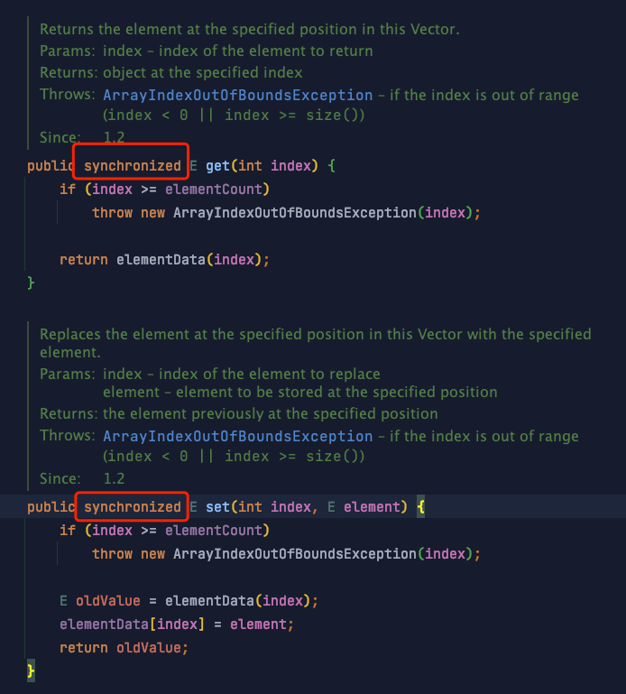
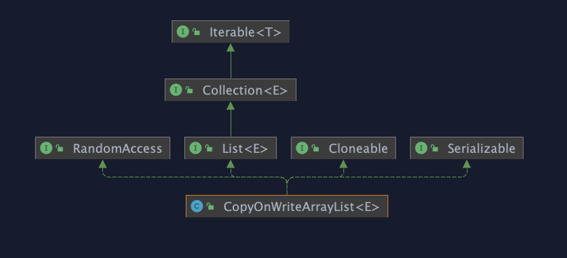
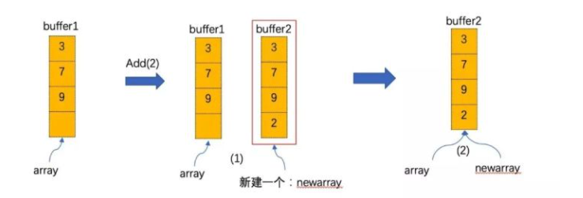

# CopyOnWriteArrayList

## 历史

在 CopyOnWriteArrayList 出现之前，我们已经有了 `ArrayList` 和 `LinkedList` 作为 List 的数组和链表的实现，而且也有了线程安全的 `Vector` 和 `Collections.synchronizedList）` 可以使用。

### Vector

锁的粒度比较大，在并发量高的时候，很容易发生竞争，并发效率相对比较低。在这一点上，Vector 和 Hashtable 很类似。



## 原理

首先要了解下什么是COW   [什么是 COW? (CopyOnWrite)](<../../../../../程序设计/什么是 COW- (CopyOnWrite)/什么是 COW- (CopyOnWrite).md> "什么是 COW? (CopyOnWrite)")

### 类继承体系



CopyOnWriteArrayList 的所有修改操作（add，set等）都是通过创建底层数组的新副本来实现的，所以 CopyOnWrite 容器也是一种读写分离的思想体现，读和写使用不同的容器。

### 线程安全

*   JDK8 使用Reentrantlock +   Arrays.copyOf  来实现线程安全&#x20;

*   JDK8 以上使用 synchronized + Array.copyOf 来实现线程安全&#x20;

可见后文中的代码

### 添加

java8 的实现中利用可重入锁对写线程加锁，高版本的JDK实现中使用的是 `Synchronized`&#x20;

```java

    public boolean add(E e) {
        final ReentrantLock lock = this.lock;
        lock.lock(); //上锁，只允许一个线程进入
        try {
            Object[] elements = getArray(); // 获得当前数组对象
            int len = elements.length;
            Object[] newElements = Arrays.copyOf(elements, len + 1);//拷贝到一个新的数组中
            newElements[len] = e;//插入数据元素
            setArray(newElements);//将新的数组对象设置回去
            return true;
        } finally {
            lock.unlock();//释放锁
        }
    }
 
```

**需要注意的就是在添加元素时，首先复制了一个快照，然后在快照上进行添加，而不是直接在原来数组上进行**。



### 遍历

*CopyOnWriteArrayList* 下有一个子类 *COWIterator* 来实现迭代器。*COWIterator* 中持有一个 *CopyOnWriteArrayList* 的快照——即 *COWIterator* 创建时刻 *CopyOnWriteArrayList* 中的 array。

由于快照并不具有实时性，`remove()`  `set()`  `add()` 这些涉及到实时操作的都不能得到支持。也正是因为这个原因，即使迭代同时进行修改也不会报出 `ConcurrentModificationException`

CopyOnWriteArrayList 具有弱一致性，所谓弱一致性是指返回迭代器后，其他线程对 list 的增删改对迭代器是不可见的。看下代码是如何实现的：

```java
 static final class COWIterator<E> implements ListIterator<E> {
        /** Snapshot of the array */
        private final Object[] snapshot;
        /** Index of element to be returned by subsequent call to next.  */
        private int cursor;

        COWIterator(Object[] es, int initialCursor) {
            cursor = initialCursor;
            snapshot = es;
        }

        public boolean hasNext() {
            return cursor < snapshot.length;
        }

        public boolean hasPrevious() {
            return cursor > 0;
        }

        @SuppressWarnings("unchecked")
        public E next() {
            if (! hasNext())
                throw new NoSuchElementException();
            return (E) snapshot[cursor++];
        }

        @SuppressWarnings("unchecked")
        public E previous() {
            if (! hasPrevious())
                throw new NoSuchElementException();
            return (E) snapshot[--cursor];
        }

        public int nextIndex() {
            return cursor;
        }

        public int previousIndex() {
            return cursor - 1;
        }

        /**
         * Not supported. Always throws UnsupportedOperationException.
         * @throws UnsupportedOperationException always; {@code remove}
         *         is not supported by this iterator.
         */
        public void remove() {
            throw new UnsupportedOperationException();
        }

        /**
         * Not supported. Always throws UnsupportedOperationException.
         * @throws UnsupportedOperationException always; {@code set}
         *         is not supported by this iterator.
         */
        public void set(E e) {
            throw new UnsupportedOperationException();
        }

        /**
         * Not supported. Always throws UnsupportedOperationException.
         * @throws UnsupportedOperationException always; {@code add}
         *         is not supported by this iterator.
         */
        public void add(E e) {
            throw new UnsupportedOperationException();
        }

        @Override
        public void forEachRemaining(Consumer<? super E> action) {
            Objects.requireNonNull(action);
            final int size = snapshot.length;
            int i = cursor;
            cursor = size;
            for (; i < size; i++)
                action.accept(elementAt(snapshot, i));
        }
    } 
```

如果在遍历期间其他线程对该 list 进行了增删改，那么 snapshot 就是快照了，因为增删改后 list 里面的数组被新数组替换了，这时候`老数组被snapshot引用`。这也说明获取迭代器后，使用该迭代器元素时，其他线程对该 list 进行的增删改不可见，因为它们操作的是**两个不同的数组**，这就是`弱一致性`。

### 缺点

*   在元素较多或者复杂的情况下，复制的开销很大 (可以考虑换用 ConCurrentHashMap)

*   数据一致性问题。由于 CopyOnWrite 容器的修改是先修改副本，所以这次修改对于其他线程来说，并不是实时能看到的，只有在修改完之后才能体现出来。如果你希望写入的的数据马上能被其他线程看到，CopyOnWrite 容器是不适用的。

## 适用场景

*   读多写少的场景用空间换取时间

## 使用注意

1.  减少扩容开销。根据实际需要，初始化CopyOnWriteMap的大小，避免写时CopyOnWriteMap扩容的开销。

2.  使用批量添加。因为每次添加，容器每次都会进行复制，所以减少添加次数，可以减少容器的复制次数。如使用上面代码里的addBlackList方法。

## 总结

1.  CopyOnWriteArrayList 采用读写分离，写时复制方式实现线程安全，**具有弱一致性**。

2.  CopyOnWriteArrayList 因为每次写入时都要扩容复制数组，写入性能不佳。

3.  CopyOnWriteArrayList 在修改元素时，为了保证 volatile 语义，即使元素没有任何变化也会重新赋值，

4.  在高版 JDK 中，得益于 synchronized 锁升级策略， CopyOnWriteArrayList 的加锁方式采用了 synchronized

可以用下面这些问题检验你理解的怎么样：

*   请先说说非并发集合中[Fail-fast机制](https://www.cnblogs.com/54chensongxia/p/12470446.html "Fail-fast机制")?

*   再为什么说ArrayList查询快而增删慢?

*   对比ArrayList说说CopyOnWriteArrayList的增删改查实现原理? COW基于拷贝

*   再说下弱一致性的迭代器原理是怎么样的? `COWIterator<E>`

*   CopyOnWriteArrayList为什么并发安全且性能比Vector好?

*   CopyOnWriteArrayList有何缺陷，说说其应用场景?
