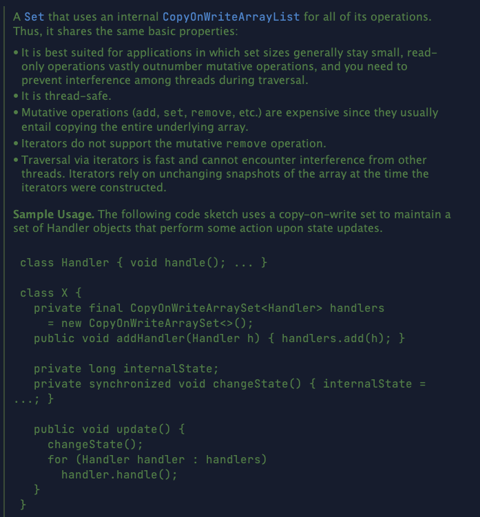
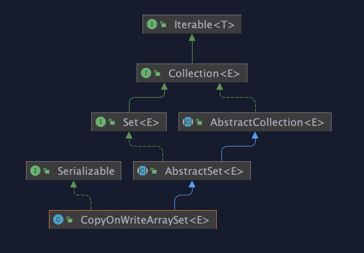

# CopyOnWriteArraySet

HashSet是通过[“散列表](http://www.cnblogs.com/skywang12345/p/3310835.html "“散列表")(HashMap)”实现的，而CopyOnWriteArraySet则是通过“[动态数组(CopyOnWriteArrayList)](http://www.cnblogs.com/skywang12345/p/3498483.html "动态数组(CopyOnWriteArrayList)")”实现的，并不是散列表。

CopyOnWriteArraySet使用 [CopyOnWriteArrayList](../CopyOnWriteArrayList/CopyOnWriteArrayList.md "CopyOnWriteArrayList")来做代理，它的所有api都是依赖于CopyOnWriteArrayList来实现的

set是一种不允许有重复元素的简单数据结构，所以和CopyOnWriteArrayList不同，CopyOnWriteArraySet需要add在插入新元素的时候多做一些判断，而CopyOnWriteArraySet在实现上使用了CopyOnWriteArrayList的addIfAbsent方法，这个方法的意思就是如果存在就不再插入，如果不存在再进行插入。

## 总结&#x20;

1.  它最适合于具有以下特征的应用程序：Set 大小通常保持很小，只读操作远多于可变操作，需要在遍历期间防止线程间的冲突。 &#x20;

2.  它是线程安全的。 &#x20;

3.  因为通常需要复制整个基础数组，所以可变操作（add()、set() 和 remove() 等等）的开销很大。 &#x20;

4.  迭代器支持hasNext(), next()等不可变操作，但不支持可变 remove()等 操作。 &#x20;

5.  使用迭代器进行遍历的速度很快，并且不会与其他线程发生冲突。在构造迭代器时，迭代器依赖于不变的数组快照
