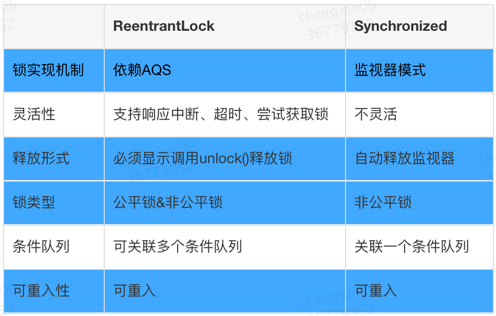
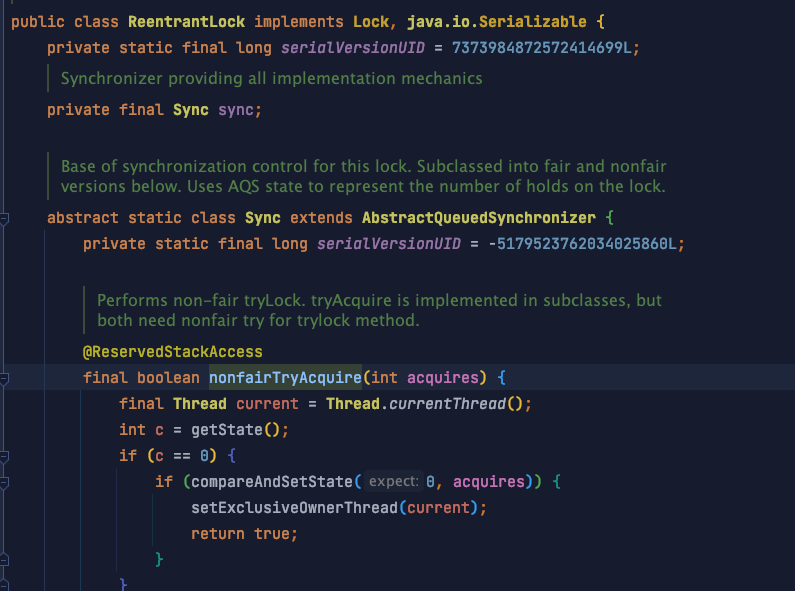
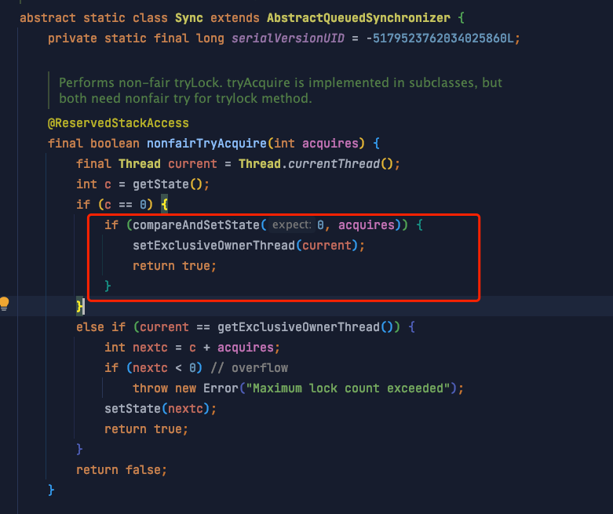
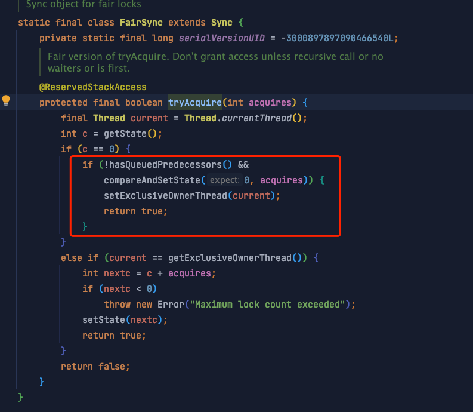

# ReentrantLock

## 前言

了解 `ReentrantLock` 前，要先了解 `AQS` [彻底理解 AQS（AbstractQueuedSynchronizer）](../../彻底理解%20AQS（AbstractQueuedSynchro/彻底理解%20AQS（AbstractQueuedSynchronizer）.md "彻底理解 AQS（AbstractQueuedSynchronizer）") 的知识，借助 了解 `AQS` 的知识能够更好地理解 `ReentrantLock`

## 定义

*   ReentrantLock意思为可重入锁，**指的是一个线程能够对一个临界资源重复加锁。**

*   ReentrantLock**支持同一个线程在未释放锁的情况下重复获取锁。**

更多锁的定义参考 [Lock（并发编程的锁机制）](../Lock（并发编程的锁机制）/Lock（并发编程的锁机制）.md "Lock（并发编程的锁机制）")

## 作用

每一个东西的出现一定是有价值的。既然已经有了元老级的synchronized，而且synchronized也支持重入，为什么Doug Lea还要专门写一个ReentrantLock呢？

### ReentrantLock与synchronized的比较



## 原理

可以看到 `ReentrantLock` 内部的同步器实现了 `AQS`&#x20;



AQS知识 请参考 [彻底理解 AQS（AbstractQueuedSynchronizer）](../../彻底理解%20AQS（AbstractQueuedSynchro/彻底理解%20AQS（AbstractQueuedSynchronizer）.md "彻底理解 AQS（AbstractQueuedSynchronizer）") ，也就是说 `ReentrantLock` 的实现原理内部就是 `AQS` ，所以等于讨论的是 `AQS` 的实现原理。

### 可重入原理

```java
// acquires的值是1
final boolean nonfairTryAcquire(int acquires) {
    // 获取当前线程
    final Thread current = Thread.currentThread();
    // 获取state的值
    int c = getState();
    // 如果state的值等于0，表示当前没有线程持有锁
    // 尝试将state的值改为1，如果修改成功，则成功获取锁，并设置当前线程为持有锁的线程，返回true
    if (c == 0) {
        if (compareAndSetState(0, acquires)) {
            setExclusiveOwnerThread(current);
            return true;
        }
    }
    // state的值不等于0，表示已经有其他线程持有锁
    // 判断当前线程是否等于持有锁的线程，如果等于，将state的值+1，并设置到state上，获取锁成功，返回true
    // 如果不是当前线程，获取锁失败，返回false
    else if (current == getExclusiveOwnerThread()) {
        int nextc = c + acquires;
        if (nextc < 0) // overflow
            throw new Error("Maximum lock count exceeded");
        setState(nextc);
        return true;
    }
    return false;
} 
```

其原理大致为：当某一线程获取锁后，将state值+1，并记录下当前持有锁的线程，再有线程来获取锁时，判断这个线程与持有锁的线程是否是同一个线程，如果是，将state值再+1，如果不是，阻塞线程。 当线程释放锁时，将state值-1，当state值减为0时，表示当前线程彻底释放了锁，然后将记录当前持有锁的线程的那个字段设置为null，并唤醒其他线程，使其重新竞争锁。

### 公平&非公平锁

非公平锁( `ReentrantLock`  默认为非公平锁 )



*   若通过CAS设置变量State（同步状态）成功，也就是获取锁成功，则将当前线程设置为独占线程。

*   若通过CAS设置变量State（同步状态）失败，也就是获取锁失败，则进入Acquire方法进行后续处理。


公平锁



hasQueuedPredecessors（）方法：

*   返回  `true`  如果在当前线程之前有一个排队线程

*   返回  `false` 如果当前线程在队列的头部或队列为空&#x20;

**所以就是在没有队列排队且能通过 CAS 获得锁的情况下才线程才能独占，否则就去队列排队（队尾）**

## 使用

使用ReentrantLock类的时，一定要注意三点&#x20;

*   在finally中释放锁，目的是保证在获取锁之后，最终能够被释放

*   不要将获取锁的过程写在try块内，因为如果在获取锁时发生了异常，异常抛出的同时，也会导致锁无故被释放。

*   ReentrantLock提供了一个newCondition的方法，以便用户在同一锁的情况下可以根据不同的情况执行等待或唤醒的动作。

使用上文中所述的优点来替代`synchronized `

```java
public class Counter {
    private int count;

    public void add(int n) {
        synchronized(this) {
            count += n;
        }
    }
}
```

```java
public class Counter {
    private final Lock lock = new ReentrantLock();
    private int count;

    public void add(int n) {
        lock.lock();
        try {
            count += n;
        } finally {
            lock.unlock();
        }
    }
}
```

*   `ReentrantLock`可以替代`synchronized`进行同步；

*   `ReentrantLock`获取锁更安全；

*   必须先获取到锁，再进入`try {...}`代码块，最后使用`finally`保证释放锁；

*   可以使用`tryLock()`尝试获取锁。

## 参考&#x20;

*   [https://tech.meituan.com/2019/12/05/aqs-theory-and-apply.html](https://tech.meituan.com/2019/12/05/aqs-theory-and-apply.html "https://tech.meituan.com/2019/12/05/aqs-theory-and-apply.html")

*   [https://zhuanlan.zhihu.com/p/82992473](https://zhuanlan.zhihu.com/p/82992473 "https://zhuanlan.zhihu.com/p/82992473")
