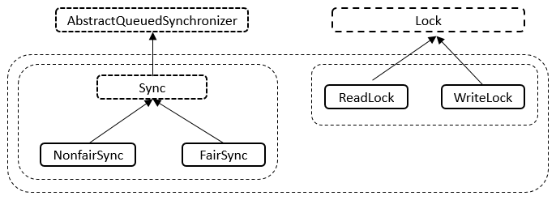
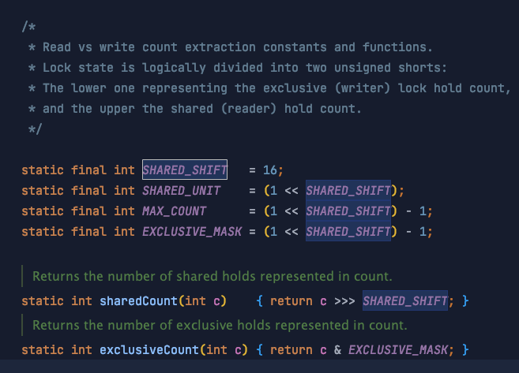
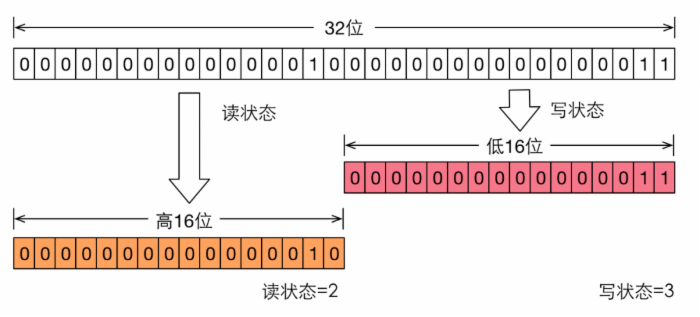

# ReentrantReadWriteLock

## 前提

了解 `AQS` 原理 [彻底理解 AQS（AbstractQueuedSynchronizer）](../../彻底理解%20AQS（AbstractQueuedSynchro/彻底理解%20AQS（AbstractQueuedSynchronizer）.md "彻底理解 AQS（AbstractQueuedSynchronizer）")

&#x20;现实中有这样一种场景：对共享资源有读和写的操作，且写操作没有读操作那么频繁。在没有写操作的时候，多个线程同时读一个资源没有任何问题，所以应该允许多个线程同时读取共享资源；但是如果一个线程想去写这些共享资源，就不应该允许其他线程对该资源进行读和写的操作了。

## 简介

**JAVA的并发包提供了读写锁ReentrantReadWriteLock，它表示两个锁，一个是读操作相关的锁，称为共享锁；一个是写相关的锁，称为排他锁**

线程进入读锁的前提条件：

*   没有其他线程的写锁，

*   没有写请求或者**有写请求，但调用线程和持有锁的线程是同一个。**

线程进入写锁的前提条件：

*   没有其他线程的读锁

*   没有其他线程的写锁

而读写锁有以下重要的特性：

1.  公平选择性：支持非公平（默认）和公平的锁获取方式，吞吐量还是非公平优于公平。

    > Non-fair mode (default)
    > When constructed as non-fair (the default), the order of entry to the read and write lock is unspecified, subject to reentrancy constraints. A nonfair lock that is continuously contended may indefinitely postpone one or more reader or writer threads, but will normally **have higher throughput than a fair lock**.

2.  重进入：读锁和写锁都支持线程重进入。

3.  锁降级：遵循获取写锁、获取读锁再释放写锁的次序，写锁能够降级成为读锁。

4.  此锁最多支持 **65535** 个递归写锁和 **65535** 个读锁。 尝试超过这些限制会导致锁定方法抛出错误。

5.  WriteLock支持Condition并且与ReentrantLock语义一致，而**ReadLock则不能使用Condition**，否则抛出UnsupportedOperationException异常。

## 原理

实现上很像 `ReentrantLock`  [ReentrantLock](../ReentrantLock/ReentrantLock.md "ReentrantLock")

> An implementation of ReadWriteLock supporting similar semantics to ReentrantLock.

### 内部结构



Sync继承自AQS、NonfairSync继承自Sync类、FairSync继承自Sync类（通过构造函数传入的布尔值决定要构造哪一种Sync实例）；ReadLock实现了Lock接口、WriteLock也实现了Lock接口。



```java
abstract static class Sync extends AbstractQueuedSynchronizer {
    // 版本序列号
    private static final long serialVersionUID = 6317671515068378041L;        
    // 高16位为读锁，低16位为写锁
    static final int SHARED_SHIFT   = 16;
    // 读锁单位
    static final int SHARED_UNIT    = (1 << SHARED_SHIFT);
    // 读锁最大数量
    static final int MAX_COUNT      = (1 << SHARED_SHIFT) - 1;
    // 写锁最大数量
    static final int EXCLUSIVE_MASK = (1 << SHARED_SHIFT) - 1;
    // 本地线程计数器
    private transient ThreadLocalHoldCounter readHolds;
    // 缓存的计数器
    private transient HoldCounter cachedHoldCounter;
    // 第一个读线程
    private transient Thread firstReader = null;
    // 第一个读线程的计数
    private transient int firstReaderHoldCount;
}
```

读写锁对于同步状态的实现是在一个整形变量上通过“按位切割使用”：将变量切割成两部分，高16位表示读，低16位表示写。



### 锁降级

**锁降级指的是把持住(当前拥有的)写锁，再获取到读锁，随后释放(先前有用的)写锁的过程。**

*   当线程获取读锁的时候，可能有其他线程同时也在持有读锁，因此不能把获取读锁的线程“升级”为写锁；而对于获得写锁的线程，它一定独占了读写锁，因此可以继续让它获取读锁，当它同时获取了写锁和读锁后，还可以先释放写锁继续持有读锁，这样一个写锁就“降级”为了读锁。

*   一个线程要想同时持有写锁和读锁，必须先获取写锁再获取读锁；写锁可以“降级”为读锁；读锁不能“升级”为写锁。

下面是一个官方注释的例子

```java
 class CachedData {
   Object data;
   boolean cacheValid;
   final ReentrantReadWriteLock rwl = new ReentrantReadWriteLock();

   void processCachedData() {
     rwl.readLock().lock();
     if (!cacheValid) {
       // Must release read lock before acquiring write lock
       rwl.readLock().unlock();
       rwl.writeLock().lock();
       try {
         // Recheck state because another thread might have
         // acquired write lock and changed state before we did.
         if (!cacheValid) {
           data = ...
           cacheValid = true;
         }
         // Downgrade by acquiring read lock before releasing write lock
         rwl.readLock().lock();
       } finally {
         rwl.writeLock().unlock(); // Unlock write, still hold read
       }
     }

     try {
       use(data);
     } finally {
       rwl.readLock().unlock();
     }
   }
 }
```

## 例子

假如有多个线程要同时进行读操作的话，先看一下synchronized达到的效果：

```java
public class Test {
    private ReentrantReadWriteLock rwl = new ReentrantReadWriteLock();
     
    public static void main(String[] args)  {
        final Test test = new Test();
         
        new Thread(){
            public void run() {
                test.get(Thread.currentThread());
            };
        }.start();
         
        new Thread(){
            public void run() {
                test.get(Thread.currentThread());
            };
        }.start();
         
    }  
     
    public synchronized void get(Thread thread) {
        long start = System.currentTimeMillis();
        while(System.currentTimeMillis() - start <= 1) {
            System.out.println(thread.getName()+"正在进行读操作");
        }
        System.out.println(thread.getName()+"读操作完毕");
    }
}
```

这段程序的输出结果会是，直到thread1执行完读操作之后，才会打印thread2执行读操作的信息。

而改成用读写锁的话：

```java
public class Test {
    private ReentrantReadWriteLock rwl = new ReentrantReadWriteLock();
     
    public static void main(String[] args)  {
        final Test test = new Test();
         
        new Thread(){
            public void run() {
                test.get(Thread.currentThread());
            };
        }.start();
         
        new Thread(){
            public void run() {
                test.get(Thread.currentThread());
            };
        }.start();
         
    }  
     
    public void get(Thread thread) {
        rwl.readLock().lock();
        try {
            long start = System.currentTimeMillis();
             
            while(System.currentTimeMillis() - start <= 1) {
                System.out.println(thread.getName()+"正在进行读操作");
            }
            System.out.println(thread.getName()+"读操作完毕");
        } finally {
            rwl.readLock().unlock();
        }
    }
}
```

thread1和thread2在同时进行读操作。这样就大大提升了读操作的效率。

不过要注意的是

*   如果有一个线程已经占用了读锁，则此时其他线程如果要申请写锁，则申请写锁的线程会一直等待释放读锁。

*   如果有一个线程已经占用了写锁，则此时其他线程如果申请写锁或者读锁，则申请的线程会一直等待释放写锁。

## 应用

适用于读多写少的场景，如缓存设计
