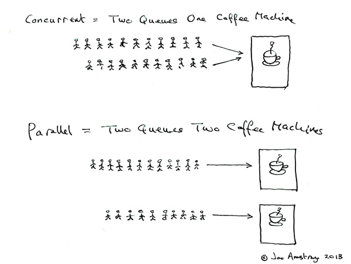

# 并发多线程

### 并发和并行的区别

并发是两个队列**交替**使用一台咖啡机，并行是两个队列**同时**使用两台咖啡机，如果串行，一个队列使用一台咖啡机，那么哪怕前面那个人便秘了去厕所呆半天，后面的人也只能死等着他回来才能去接咖啡，这效率无疑是最低的。

[java 线程](java%20线程/java%20线程.md "java 线程")

[并发包-JUC](并发包-JUC/并发包-JUC.md "并发包-JUC")

[ThreadLocal](ThreadLocal/ThreadLocal.md "ThreadLocal")
