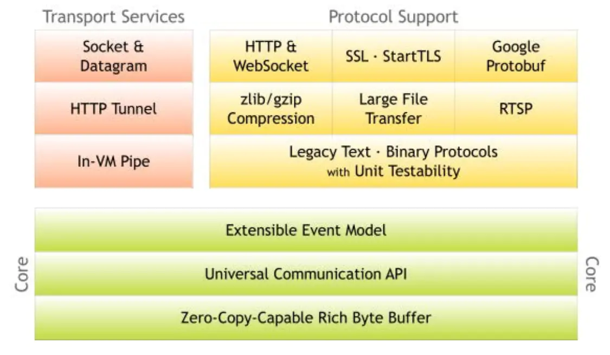
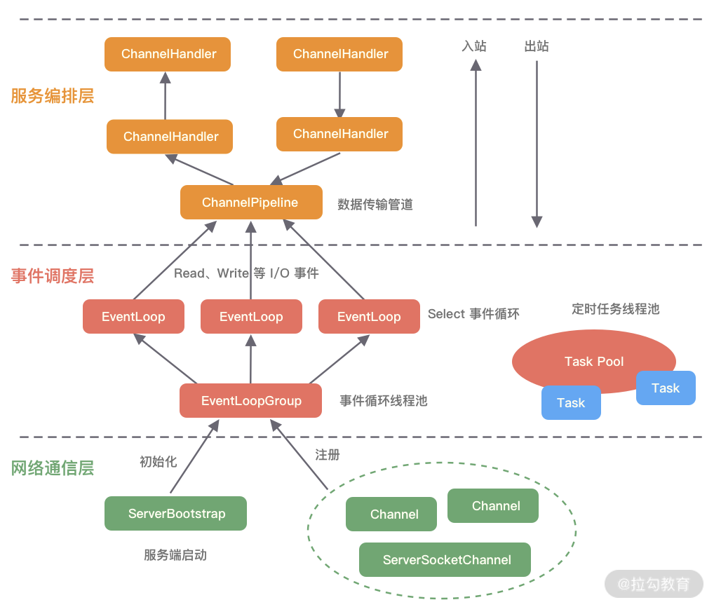
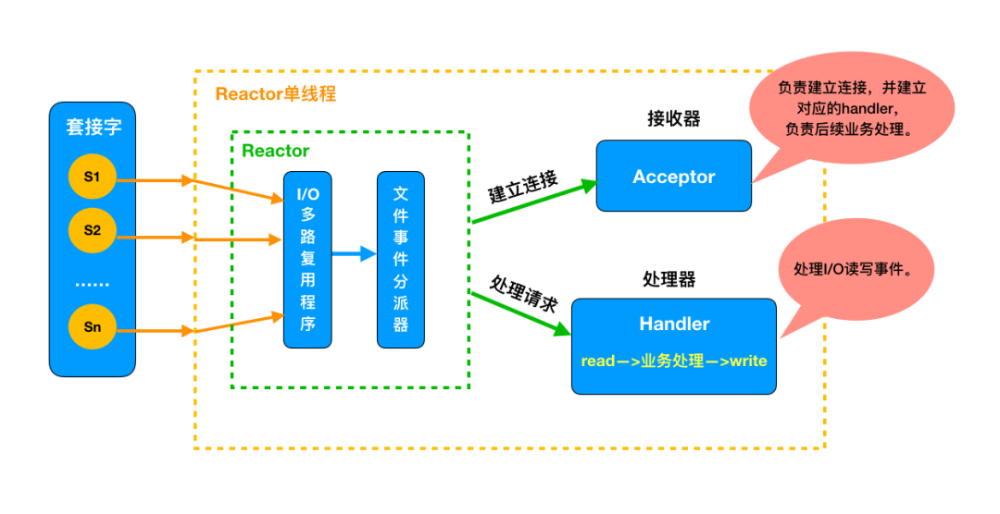
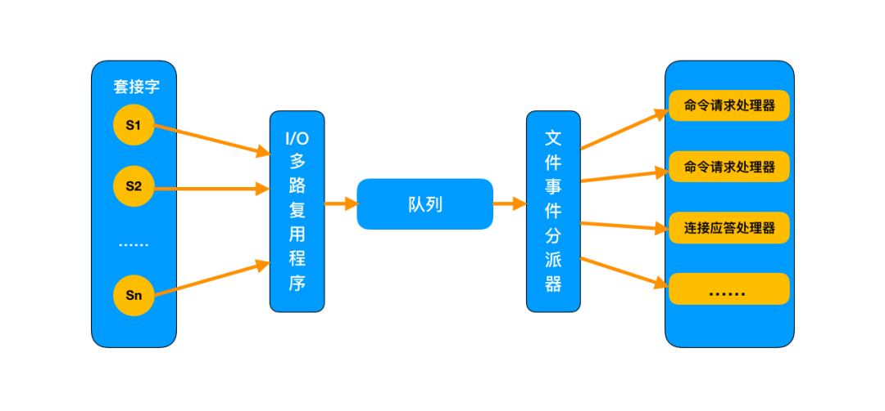
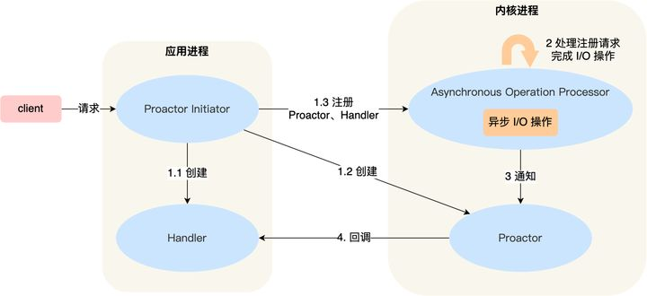
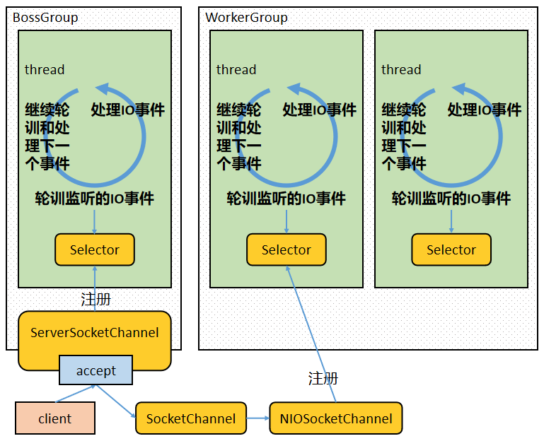
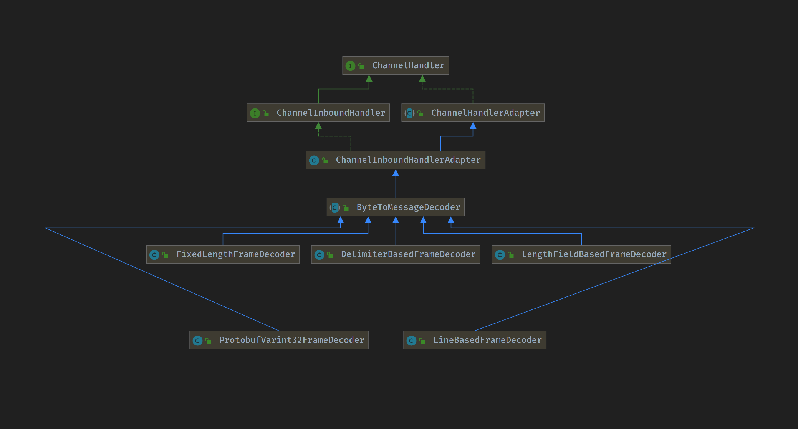
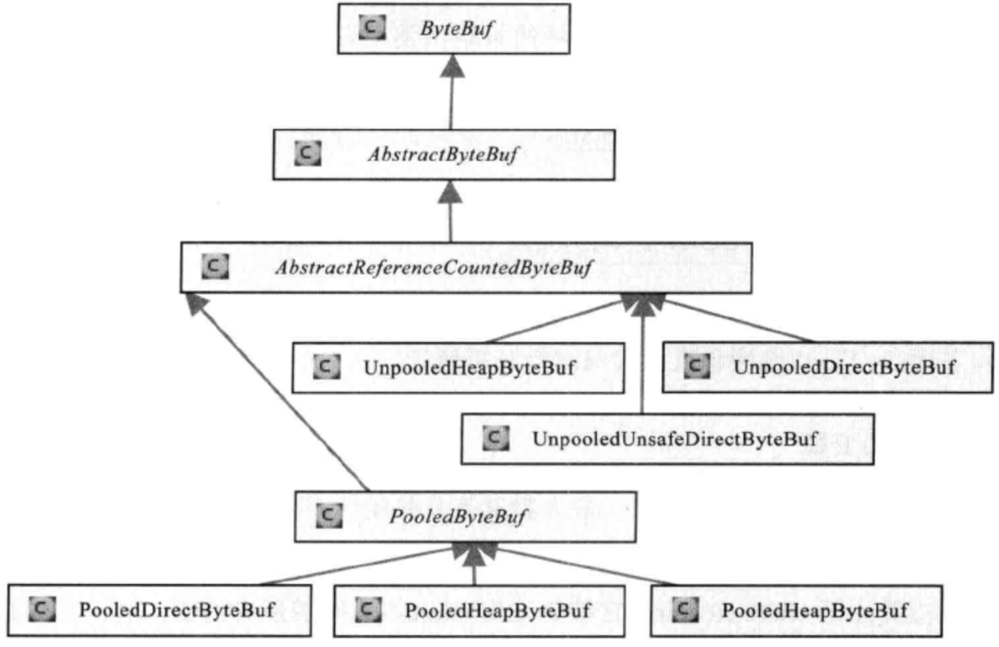
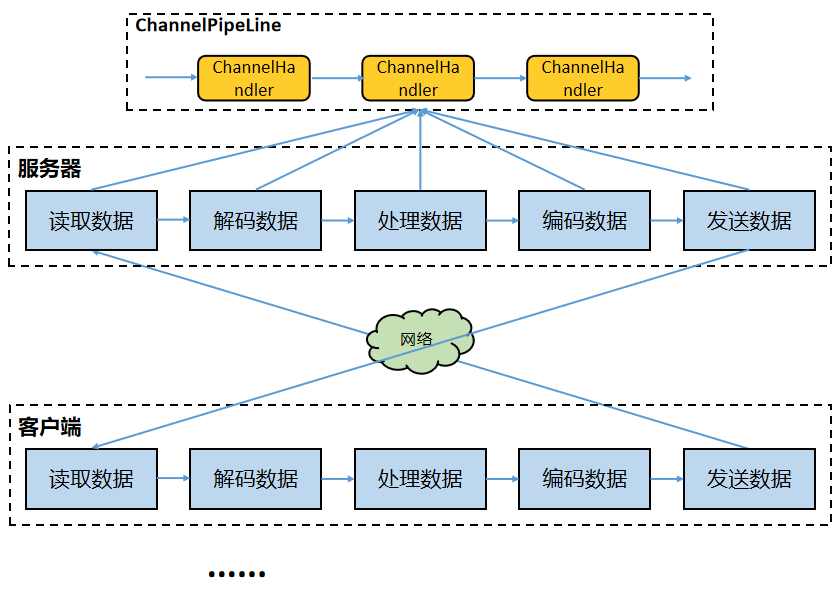

# Netty

### 为什么还要用 Netty

既然 JAVA NIO / JAVA AIO 已经实现了各主流操作系统的底层支持，那么为什么现在主流的 JAVA NIO 技术会是 Netty 和 MINA 呢？答案很简单：因为更好用，这里举几个方面的例子：

*   虽然 JAVA NIO 和 JAVA AIO 框架提供了 多路复用 IO/异步 IO 的支持，但是并没有提供上层“信息格式”的良好封装。例如前两者并没有提供针对 Protocol Buffer、JSON 这些信息格式的封装，但是 Netty 框架提供了这些数据格式封装（基于责任链模式的编码和解码功能）

*   要编写一个可靠的、易维护的、高性能的（注意它们的排序） NIO/AIO 服务器应用。除了框架本身要兼容实现各类操作系统的实现外。更重要的是它应该还要处理

## 架构

整体架构



逻辑架构



## 线程模型

**在高性能的 I/O 设计中，有两个著名的模型：Reactor 模型和 Proactor 模型，其中 Reactor 模型用于同步 I/O，而 Proactor 模型运用于异步 I/O 操作。实际上 Netty 线程模型就是 Reactor 模型的一个实现。**

### 什么是 Reactor

> The reactor design pattern is an event handling pattern for handling service requests delivered concurrently to a service handler by one or more inputs. The service handler then demultiplexes the incoming requests and dispatches them synchronously to the associated request handlers.

Reactor 设计模式是一种事件处理模式，用于处理由一个或多个输入同时传递到服务处理程序的服务请求。然后，服务处理程序对传入的请求进行**解复用**，并将它们同步分派给关联的请求处理程序。

以上来自 wiki, **我们可以看到以下重点**。

1.  事件驱动（event handling）

2.  可以处理一个或多个输入源（one or more inputs）

3.  通过 Service Handler 同步的将输入事件（Event）采用多路复用分发给相应的 Request Handler（多个）处理

根据 Doug Lea 在 《[Scalable IO in Java](http://gee.cs.oswego.edu/dl/cpjslides/nio.pdf "Scalable IO in Java") 》中的介绍，**Reacotr 模型主要分为三个角色**：

1.  **Reactor**：把 IO 事件分配给对应的 handler 处理

2.  **Acceptor**：处理客户端连接事件

3.  **Handler**：处理非阻塞的任务

**Reactor 处理请求的流程**：

1.  同步的等待多个事件源到达（采用 select() 实现）

2.  将事件多路分解以及分配相应的事件服务进行处理，这个分派采用 server 集中处理（dispatch）

3.  分解的事件以及对应的事件服务应用从分派服务中分离出去（handler）

**为什么使用 Reactor？**

传统**阻塞 IO 模型**的不足

*   每个连接都需要独立线程处理，当并发数大时，创建线程数多，占用资源

*   采用阻塞 IO 模型，连接建立后，若当前线程没有数据可读，线程会阻塞在读操作上，造成资源浪费

针对传统阻塞 IO 模型的两个问题，可以采用如下的方案

*   基于池化思想，避免为每个连接创建线程，连接完成后将业务处理交给线程池处理

*   基于 IO 复用模型，多个连接共用同一个阻塞对象，不用等待所有的连接。遍历到有新数据可以处理时，操作系统会通知程序，线程跳出阻塞状态，进行业务逻辑处理

**Reactor 线程模型分类**

根据 Reactor 的数量和处理资源的线程数量的不同，分为三类：

*   单 Reactor 单线程模型

*   单 Reactor 多线程模型

*   多 Reactor 多线程模型

### 单 Reactor 单线程模型


**消息处理流程：**

1.  Reactor 对象通过 select 监控连接事件，收到事件后通过 dispatch 进行转发。

2.  如果是连接建立的事件，则由 acceptor 接受连接，并创建 handler 处理后续事件。

3.  如果不是建立连接事件，则 Reactor 会分发调用 Handler 来响应。

4.  handler 会完成 read->业务处理->send 的完整业务流程。

**该线程模型的不足**

1.  仅用一个线程处理请求，对于多核资源机器来说是有点浪费的

2.  当处理读写任务的线程负载过高后，处理速度下降，事件会堆积，严重的会超时，可能导致客户端重新发送请求，性能越来越差

3.  单线程也会有可靠性的问题

Redis 是由 C 语言实现的，它采用的正是「单 Reactor 单进程」的方案，因为 Redis 业务处理主要是在内存中完成，操作的速度是很快的，性能瓶颈不在 CPU 上，所以 Redis 对于命令的处理是单进程的方案。

对于单线程的 Redis 来说，基于内存，且命令操作时间复杂度低，因此读写速率是非常快的。





针对上面的种种不足，就有了下面的线程模型

### 单 Reactor 多线程模型


**消息处理流程：**

1.  Reactor 对象通过 Select 监控客户端请求事件，收到事件后通过 dispatch 进行分发。

2.  如果是建立连接请求事件，则由 acceptor 通过 accept 处理连接请求，然后创建一个 Handler 对象处理连接完成后续的各种事件。

3.  如果不是建立连接事件，则 Reactor 会分发调用连接对应的 Handler 来响应。

4.  Handler 只负责响应事件，不做具体业务处理，通过 Read 读取数据后，会分发给后面的 Worker 线程池进行业务处理。

5.  Worker 线程池会分配独立的线程完成真正的业务处理，然后将响应结果发给 Handler 进行处理。

6.  Handler 收到响应结果后通过 send 将响应结果返回给 Client。

相对于第一种模型来说，在处理业务逻辑，也就是获取到 IO 的读写事件之后，交由线程池来处理，handler 收到响应后通过 send 将响应结果返回给客户端。**这样可以降低 Reactor 的性能开销，从而更专注的做事件分发工作了，提升整个应用的吞吐**。

但是这个模型存在的问题：

1.  多线程数据共享和访问比较复杂。如果子线程完成业务处理后，把结果传递给主线程 Reactor 进行发送，就会涉及共享数据的互斥和保护机制。

2.  Reactor 承担所有事件的监听和响应，只在主线程中运行，可能会存在性能问题。例如并发百万客户端连接，或者服务端需要对客户端握手进行安全认证，但是认证本身非常损耗性能。

为了解决性能问题，产生了第三种主从 Reactor 多线程模型。

### 主从 Reactor 多线程模型


比起第二种模型，它是将 Reactor 分成两部分：

1.  mainReactor 负责监听 server socket，用来处理网络 IO 连接建立操作，将建立的 socketChannel 指定注册给 subReactor。

2.  subReactor 主要做和建立起来的 socket 做数据交互和事件业务处理操作。通常，subReactor 个数上可与 CPU 个数等同。

**Nginx、Memcached 和 Netty 都是采用这种实现。**

**消息处理流程：**

1.  从**主线程池**中随机选择一个 Reactor 线程作为 acceptor 线程，用于绑定监听端口，接收客户端连接

2.  acceptor 线程接收客户端连接请求之后创建新的 SocketChannel，将其注册到主线程池的其它 Reactor 线程上，由其负责接入认证、IP 黑白名单过滤、握手等操作

3.  步骤 2 完成之后，业务层的链路正式建立，将 SocketChannel 从主线程池的 Reactor 线程的多路复用器上摘除，重新注册到 Sub 线程池的线程上，并创建一个 Handler 用于处理各种连接事件

4.  当有新的事件发生时，SubReactor 会调用连接对应的 Handler 进行响应

5.  Handler 通过 Read 读取数据后，会分发给后面的 Worker 线程池进行业务处理

6.  Worker 线程池会分配独立的线程完成真正的业务处理，如何将响应结果发给 Handler 进行处理

7.  Handler 收到响应结果后通过 Send 将响应结果返回给 Client

**Reactor 三种模式形象比喻**

餐厅一般有接待员和服务员，接待员负责在门口接待顾客，服务员负责全程服务顾客

Reactor 的三种线程模型可以用接待员和服务员类比

1.  单 Reactor 单线程模型：接待员和服务员是同一个人，一直为顾客服务。客流量较少适合

2.  单 Reactor 多线程模型：一个接待员，多个服务员。客流量大，一个人忙不过来，由专门的接待员在门口接待顾客，然后安排好桌子后，由一个服务员一直服务，一般每个服务员负责一片中的几张桌子

3.  多 Reactor 多线程模型：多个接待员，多个服务员。这种就是客流量太大了，一个接待员忙不过来了

### 什么是 Proactor



Proactor 正是采用了异步 I/O 技术，所以被称为异步网络模型。

无论是 Reactor，还是 Proactor，都是一种基于「事件分发」的网络编程模式，区别在于 **Reactor 模式是基于「待完成」的 I/O 事件，而 Proactor 模式则是基于「已完成」的 I/O 事件**。

在 Linux 下的异步 I/O 是不完善的， `aio` 系列函数是由 POSIX 定义的异步操作接口，不是真正的操作系统级别支持的，而是在用户空间模拟出来的异步，并且仅仅支持基于本地文件的 aio 异步操作，网络编程中的 socket 是不支持的，这也使得基于 Linux 的高性能网络程序都是使用 Reactor 方案。

而 Windows 里实现了一套完整的支持 socket 的异步编程接口，这套接口就是 `IOCP`，是由操作系统级别实现的异步 I/O，真正意义上异步 I/O，因此在 Windows 里实现高性能网络程序可以使用效率更高的 Proactor 方案。

### 线程模型的应用

**Redis**

Redis 是典型的单 Reactor 单线程类型。Redis 主要通过 aeMain、aeProcessEvents，以及 aeCreateFileEvent 三个关键函数来实现 Reactor 模型，对源码 (Linux 系统）的整理如下：

| 源码文件      | 函数                | 被调用点                   | 主要功能           |
| --------- | ----------------- | ---------------------- | -------------- |
| ae.c/ae.h | aeMain()          | server.c 的 main()        | 事件捕获，分发和循环处理   |
| ae.c/ae.h | aeProcessEvents() | ae.c 的 aeMain()          | 根据事件类型进行响应的处理  |
| ae.c/ae.h | aeApiPoll()       | ae.c 的 aeProcessEvents() | 调用操作系统的 IO 多路方法  |
| Linux 内核文件 | epoll\_wait()     | ae.c 的 aeApiPoll()       | 检测并返回内核中网络 IO 事件 |

**nginx**

nginx 是多进程模型，master 进程不处理网络 IO，每个 Wroker 进程是一个独立的单 Reacotr 单线程模型。详情参考官方文档：[Inside NGINX: Designed for Performance & Scalability](https://link.zhihu.com/?target=https://www.nginx.com/blog/inside-nginx-how-we-designed-for-performance-scale/ "Inside NGINX: Designed for Performance & Scalability")

**Netty**

Netty 的线程模型主要是基于 Reactor 模型，但是可以灵活配置，单 reactor 单线程，单 reactor 多线程，和多 reactor 多线程模型。

**kafka**

kafka 采用的是主从 Reactor 多线程模型，因为 Kafka 主要与磁盘 IO 交互，因此真正的读写数据不是从 Reactor 处理的，而是有一个 worker 线程池，专门处理磁盘 IO，从 Reactor 负责网络 IO，然后把任务交给 worker 线程池处理。

## Netty 线程模型

上文说 Netty 就是采用 Reactor 模型实现的。下面是 Netty 使用中很常见的一段代码

```java
public class Server {
    public static void main(String[] args) throws Exception {
        EventLoopGroup bossGroup = new NioEventLoopGroup(1);
        EventLoopGroup workerGroup = new NioEventLoopGroup();
        try {
            ServerBootstrap b = new ServerBootstrap();
            b.group(bossGroup, workerGroup)
                    .channel(NioServerSocketChannel.class)
                    .childOption(ChannelOption.TCP_NODELAY, true)
                    .childAttr(AttributeKey.newInstance("childAttr"), "childAttrValue")
                    .handler(new ServerHandler())
                    .childHandler(new ChannelInitializer<SocketChannel>() {
                        @Override
                        public void initChannel(SocketChannel ch) {
                        }
                    });
            ChannelFuture f = b.bind(8888).sync();
            f.channel().closeFuture().sync();
        } finally {
            bossGroup.shutdownGracefully();
            workerGroup.shutdownGracefully();
        }
    }
}
```

**boss 线程池作用：**

1.  接收客户端的连接，初始化 Channel 参数。

2.  将链路状态变更时间通知给 ChannelPipeline。

**worker 线程池作用：**

1.  异步读取通信对端的数据报，发送读事件到 ChannelPipeline。

2.  异步发送消息到通信对端，调用 ChannelPipeline 的消息发送接口。

3.  执行系统调用 Task。

4.  执行定时任务 Task。

**通过配置 boss 和 worker 线程池的线程个数以及是否共享线程池等方式，Netty 的线程模型可以在以上三种 Reactor 模型之间进行切换**。




netty 通过 Reactor 模型基于多路复用器接收并处理用户请求，内部实现了两个线程池，boss 线程池和 work 线程池：

*   其中 boss 线程池的线程负责处理请求的 accept 事件，当接收到 accept 事件的请求时，把对应的 socket 封装到一个 NioSocketChannel 中，并交给 worker 线程池

*   其中 worker 线程池负责请求的 read 和 write 事件&#x20;


## 零拷贝

Netty 的接收和发送 ByteBuffer 采用 DIRECT BUFFERS，使用堆外内存直接读写。

Netty 中的零拷贝和传统 Linux 的零拷贝不太一样。Netty 中的零拷贝技术除了操作系统级别的功能封装，更多的是面向用户态的数据操作优化，主要体现在以下 5 个方面：

*   堆外内存，避免 JVM 堆内存到堆外内存的数据拷贝。

*   CompositeByteBuf 类，可以组合多个 Buffer 对象合并成一个逻辑上的对象，避免通过传统内存拷贝的方式将几个 Buffer 合并成一个大的 Buffer。

*   通过 Unpooled.wrappedBuffer 可以将 byte 数组包装成 ByteBuf 对象，包装过程中不会产生内存拷贝。

*   ByteBuf.slice 操作与 Unpooled.wrappedBuffer 相反，slice 操作可以将一个 ByteBuf 对象切分成多个 ByteBuf 对象，切分过程中不会产生内存拷贝，底层共享一个 byte 数组的存储空间。

*   Netty 使用 FileRegion 实现文件传输，FileRegion 底层封装了 `FileChannel#transferTo()` 方法，可以将文件缓冲区的数据直接传输到目标 Channel，避免内核缓冲区和用户态缓冲区之间的数据拷贝，**这属于操作系统级别的零拷贝**。

**堆外内存**

如果在 JVM 内部执行 I/O 操作时，必须将数据拷贝到堆外内存，才能执行系统调用。这是所有 VM 语言都会存在的问题。那么为什么操作系统不能直接使用 JVM 堆内存进行 I/O 的读写呢？主要有两点原因：第一，操作系统并不感知 JVM 的堆内存，而且 JVM 的内存布局与操作系统所分配的是不一样的，操作系统并不会按照 JVM 的行为来读写数据。第二，同一个对象的内存地址随着 JVM GC 的执行可能会随时发生变化，例如 JVM GC 的过程中会通过压缩来减少内存碎片，这就涉及对象移动的问题了。

Netty 在进行 I/O 操作时都是使用的堆外内存，可以避免数据从 JVM 堆内存到堆外内存的拷贝。

## NIO epoll bug

JDK 的 NIO 类库有一个 epoll 死循环 bug，它会导致 Selector 空轮询，IO 线程 CPU 达到 100%，严重影响系统运行。

netty 从 api 使用层面对该 bug 进行了规避解决， 重建 Selector。当发生 epoll bug，则创建一个新的 Selector，将出现 bug 的 Selector 上的 channel 重新注册到新的 Selector 上，关闭 bug 的 Selector，使用新的 Selector 进行替换。

**具体策略：**

1.  对 Selector 的 select 操作周期进行统计。

2.  每完成一次空的 select 操作进行一次计数。

3.  在某个周期内如果连续 N 次空轮询，则说明触发了 JDK NIO 的 epoll 死循环 bug。

4.  创建新的 Selector，将出现 bug 的 Selector 上的 channel 重新注册到新的 Selector 上。

5.  关闭 bug 的 Selector，使用新的 Selector 进行替换。

如果发生 epoll 死循环 bug，那么当前 I/O 线程将停下来进行 bug 的修复，然后再继续进行逻辑处理，bug 的修复是非阻塞操作，处理速度非常快；而且 netty 线程池中一般设置有多个 I/O 线程，其中某个 I/O 线程中的 Selector 触发 bug 并不会影响其他 I/O 线程运行，所以 netty 通过这种策略，在几乎不影响性能的情况下从 api 使用层面规避解决了该 bug。

## 粘包拆包

TCP 层可能会出现当次接收到的数据是不完整数据的情况。出现粘包可能的原因有：

1.  发送方每次写入数据 < 套接字缓冲区大小；

2.  接收方读取套接字缓冲区数据不够及时。

出现半包的可能原因有：

1.  发送方每次写入数据 > 套接字缓冲区大小；

2.  发送的数据大于协议 MTU，所以必须要拆包。

解决问题肯定不是在 4 层来做而是在应用层，通过定义通信协议来解决粘包和拆包的问题。发送方 和 接收方约定某个规则：

1.  当发生粘包的时候通过某种约定来拆包；

2.  如果在拆包，通过某种约定来将数据组成一个完整的包处理。

#### 业界常用解决方案

**定长协议**

指定一个报文具有固定长度。比如约定一个报文的长度是 5 字节，那么：

报文：1234，只有 4 字节，但是还差一个怎么办呢，不足部分用空格补齐。就变为：1234 。

如果不补齐空格，那么就会读到下一个报文的字节来填充上一个报文直到补齐为止，这样粘包了。

定长协议的优点是使用简单，缺点很明显：浪费带宽。

Netty 中提供了 `FixedLengthFrameDecoder` ，支持把固定的长度的字节数当做一个完整的消息进行解码。

**特殊字符分割协议**

很好理解，在每一个你认为是一个完整的包的尾部添加指定的特殊字符，比如：\n，\r 等等。

需要注意的是：约定的特殊字符要保证唯一性，不能出现在报文的正文中，否则就将正文一分为二了。

Netty 中提供了 `DelimiterBasedFrameDecoder` 根据特殊字符进行解码，`LineBasedFrameDecoder`默认以换行符作为分隔符。

**变长协议**

变长协议的核心就是：**将消息分为消息头和消息体，消息头中标识当前完整的消息体长度。**

1.  发送方在发送数据之前先获取数据的二进制字节大小，然后在消息体前面添加消息大小；

2.  接收方在解析消息时先获取消息大小，之后必须读到该大小的字节数才认为是完整的消息。

Netty 中提供了 `LengthFieldBasedFrameDecoder` ，通过`LengthFieldPrepender` 来给实际的消息体添加 length 字段。

#### Netty 提供的能力

为了解决网络数据流的拆包粘包问题，Netty 为我们内置了如下的**解码器**：

*   ByteToMessageDecoder：如果想实现自己的半包解码器，实现该类；

*   MessageToMessageDecoder：一般作为二次解码器，当我们在 ByteToMessageDecoder 将一个 bytes 数组转换成一个 java 对象的时候，我们可能还需要将这个对象进行二次解码成其他对象，我们就可以继承这个类；

*   LineBasedFrameDecoder：通过在包尾添加回车换行符 `\r\n `来区分整包消息；

*   StringDecoder：字符串解码器；

*   DelimiterBasedFrameDecoder：特殊字符作为分隔符来区分整包消息；

*   FixedLengthFrameDecoder：报文大小固定长度，不够空格补全；

*   ProtoBufVarint32FrameDecoder：通过 Protobuf 解码器来区分整包消息；

*   ProtobufDecoder： Protobuf 解码器；

*   LengthFieldBasedFrameDecoder：指定长度来标识整包消息，通过在包头指定整包长度来约定包长。

Netty 还内置了如下的**编码器**：

*   ProtobufEncoder：Protobuf 编码器；

*   MessageToByteEncoder：将 Java 对象编码成 ByteBuf；

*   MessageToMessageEncoder：如果不想将 Java 对象编码成 ByteBuf，而是自定义类就继承这个；

*   LengthFieldPrepender：LengthFieldPrepender 是一个非常实用的工具类，如果我们在发送消息的时候采用的是：消息长度字段+原始消息的形式，那么我们就可以使用 LengthFieldPrepender。这是因为 LengthFieldPrepender 可以将待发送消息的长度（二进制字节长度）写到 ByteBuf 的前两个字节。



### UDP 是否会发生粘包或拆包的现象呢？

答案是不会。

UDP 是基于报文发送的，从 UDP 的帧结构可以看出，在 UDP 首部采用了 16bit 来指示 UDP 数据报文的长度，因此在应用层能很好的将不同的数据报文区分开，从而避免粘包和拆包的问题。

而** TCP 是基于字节流的**，虽然应用层和 TCP 传输层之间的数据交互是大小不等的数据块，但是 TCP 把这些数据块仅仅看成一连串无结构的字节流，没有边界；另外从 TCP 的帧结构也可以看出，在 TCP 的首部没有表示数据长度的字段，基于上面两点，在使用 TCP 传输数据时，才有粘包或者拆包现象发生的可能。

## API

### ByteBuf



ByteBuf 是一个字节容器，内部是一个字节数组。从逻辑上来分，字节容器内部，可以分为四个部分：


*   第一个部分是已经丢弃的字节，这部分数据是无效的；

*   第二部分是可读字节，这部分数据是 ByteBuf 的主体数据， 从 ByteBuf 里面读取的数据都来自这一部分；

*   第三部分的数据是可写字节，所有写到 ByteBuf 的数据都会写到这一段。

*   第四部分的字节，表示的是该 ByteBuf 最多还能扩容的大小。

**四个部分的逻辑功能，如下图所示**：


ByteBuf 通过三个整型的指针（index），有效地区分可读数据和可写数据，使得读写之间相互没有冲突。

这个三个指针，分别是：

*   readerIndex（读指针）

*   writerIndex（写指针）

*   maxCapacity（最大容量）


这三个指针，是三个 int 型的成员属性，定义在 AbstractByteBuf 抽象基类中。三个指针的代码截图，如下：


**readerIndex 读指针**

指示读取的起始位置。

每读取一个字节，readerIndex 自增 1 。一旦 readerIndex 与 writerIndex 相等，ByteBuf 不可读 。

**writerIndex 写指针**

指示写入的起始位置。

每写一个字节，writerIndex 自增 1。一旦增加到 writerIndex 与 capacity（） 容量相等，表示 ByteBuf 已经不可写了 。

> capacity（）容量不是一个成员属性，是一个成员方法。表示 ByteBuf 内部的总容量。 注意，这个不是最大容量。

**maxCapacity 最大容量**

指示可以 ByteBuf 扩容的最大容量。

当向 ByteBuf 写数据的时候，如果容量不足，可以进行扩容。

扩容的最大限度，直到 capacity（） 扩容到 maxCapacity 为止，超过 maxCapacity 就会报错。

> capacity（）扩容的操作，是底层自动进行的。

**从三个维度三大系列，介绍 ByteBuf 的常用 API 方法。**


第一组：容量系列

*   方法 一：capacity()

    表示 ByteBuf 的容量，包括丢弃的字节数、可读字节数、可写字节数。

*   方法二：maxCapacity()

    表示 ByteBuf 底层最大能够占用的最大字节数。当向 ByteBuf 中写数据的时候，如果发现容量不足，则进行扩容，直到扩容到 maxCapacity。

第二组：写入系列

*   方法一：isWritable()

    表示 ByteBuf 是否可写。如果 capacity（） 容量大于 writerIndex 指针的位置 ，则表示可写。否则为不可写。

    isWritable() 的源码，也是很简单的。具体如下：

    public boolean isWritable() {

    return this.capacity() > this.writerIndex;

    }&#x20;

> 注意：如果 isWritable() 返回 false，并不代表不能往 ByteBuf 中写数据了。 如果 Netty 发现往 ByteBuf 中写数据写不进去的话，会自动扩容 ByteBuf。

*   方法二：writableBytes()

    返回表示 ByteBuf 当前可写入的字节数，它的值等于 capacity（）- writerIndex。

    如下图所示： &#x20;

    

*   方法三：maxWritableBytes()

    返回可写的最大字节数，它的值等于 maxCapacity-writerIndex 。

*   方法四：writeBytes(byte\[] src)&#x20;

    把字节数组 src 里面的数据全部写到 ByteBuf。

    这个是最为常用的一个方法。

*   方法五：writeTYPE(TYPE value） 基础类型写入方法

    基础数据类型的写入，包含了 8 大基础类型的写入。

    具体如下：writeByte()、 writeBoolean()、writeChar()、writeShort()、writeInt()、writeLong()、writeFloat()、writeDouble() ，向 ByteBuf 写入基础类型的数据。

*   方法六：setType(TYPE value）基础类型写入，不改变指针值

    基础数据类型的写入，包含了 8 大基础类型的写入。

    具体如下：setByte()、 setBoolean()、setChar()、setShort()、setInt()、setLong()、setFloat()、setDouble() ，向 ByteBuf 写入基础类型的数据。

    > **setType 系列与 writeType 系列的不同**：
    >
    > setType 系列 **不会** 改变写指针 writerIndex ；
    >
    > writeTYPE 系列 **会** 改变写指针 writerIndex 的值。

*   方法七：markWriterIndex() 与 resetWriterIndex()

    这里两个方法一起介绍。

    前一个方法，表示把当前的写指针 writerIndex 保存在 markedWriterIndex 属性中；

    后一个方法，表示把当前的写指针 writerIndex 恢复到之前保存的 markedWriterIndex 值 。

    标记 markedWriterIndex 属性， 定义在 AbstractByteBuf 抽象基类中。

    截图如下：


第三组：读取系列

*   方法一：isReadable()

    表示 ByteBuf 是否可读。如果 writerIndex 指针的值大于 readerIndex 指针的值 ，则表示可读。否则为不可写。

    isReadable() 的源码，也是很简单的。具体如下：

    public boolean isReadable() {

    return this.writerIndex > this.readerIndex;

    }&#x20;

*   方法二：readableBytes()

    返回表示 ByteBuf 当前可读取的字节数，它的值等于 writerIndex - readerIndex 。

    如下图所示： &#x20;

    

*   方法三： **readBytes(byte\[] dst)**

    把 ByteBuf 里面的数据全部读取到 dst 字节数组中，这里 dst 字节数组的大小通常等于 readableBytes() 。 这个方法，也是最为常用的一个方法。

*   方法四：readType(） 基础类型读取

    基础数据类型的读取，可以读取 8 大基础类型。

    具体如下：readByte()、readBoolean()、readChar()、readShort()、readInt()、readLong()、readFloat()、readDouble() ，从 ByteBuf 读取对应的基础类型的数据。

*   方法五：getTYPE(TYPE value）基础类型读取，不改变指针值

    基础数据类型的读取，可以读取 8 大基础类型。

    具体如下：getByte()、 getBoolean()、getChar()、getShort()、getInt()、getLong()、getFloat()、getDouble() ，从 ByteBuf 读取对应的基础类型的数据。

    > **getType 系列与 readTYPE 系列的不同**：
    >
    > getType 系列 **不会** 改变读指针 readerIndex ；
    >
    > readTYPE 系列 **会** 改变读指针 readerIndex 的值。

*   方法六：markReaderIndex() 与 resetReaderIndex()

    前一个方法，表示把当前的读指针 ReaderIndex 保存在 markedReaderIndex 属性中。

    后一个方法，表示把当前的读指针 ReaderIndex 恢复到之前保存的 markedReaderIndex 值 。

    标记 markedReaderIndex 属性， 定义在 AbstractByteBuf 抽象基类中。

    截图如下：


### pipeline

*   ChannelPipeline 和 ChannelHandler 机制类似于 servlet 和 Filter 过滤器，这类拦截器实际上是职责链模式的一种变形，主要为了方便事件的拦截和用户业务逻辑的定制。

*   ChannelPipeline 实际上是一个 ChannelHandler 的容器，内部维护了一个 ChnnelHandler 的链表和迭代器，可以方便地实现 ChannelHandler 查找、添加、替换和删除。



## 参考

*   [https://pdai.tech/md/java/io/java-io-aio.html](https://pdai.tech/md/java/io/java-io-aio.html "https://pdai.tech/md/java/io/java-io-aio.html")

*   [https://mp.weixin.qq.com/s?\_\_biz=MzI3Njk5ODg4OQ==\&mid=2247484273\&idx=1\&sn=a63b992284766a920e0c15ed821e5b02\&chksm=eb6dbcf7dc1a35e176706dc3b54f3e4e6fbd53c552868e0162fe8c693ac9b42255d591c5d38a\&token=586356569\&lang=zh\_CN#rd](https://mp.weixin.qq.com/s?__biz=MzI3Njk5ODg4OQ==\&mid=2247484273\&idx=1\&sn=a63b992284766a920e0c15ed821e5b02\&chksm=eb6dbcf7dc1a35e176706dc3b54f3e4e6fbd53c552868e0162fe8c693ac9b42255d591c5d38a\&token=586356569\&lang=zh_CN#rd "https://mp.weixin.qq.com/s?__biz=MzI3Njk5ODg4OQ==\&mid=2247484273\&idx=1\&sn=a63b992284766a920e0c15ed821e5b02\&chksm=eb6dbcf7dc1a35e176706dc3b54f3e4e6fbd53c552868e0162fe8c693ac9b42255d591c5d38a\&token=586356569\&lang=zh_CN#rd")

*   [http://yuanjava.cn/archives/-zhong-bang-tui-jian--yi-wen-pou-xi-reactormo-xing](http://yuanjava.cn/archives/-zhong-bang-tui-jian--yi-wen-pou-xi-reactormo-xing "http://yuanjava.cn/archives/-zhong-bang-tui-jian--yi-wen-pou-xi-reactormo-xing")

*   [https://www.nginx.com/blog/inside-nginx-how-we-designed-for-performance-scale/](https://www.nginx.com/blog/inside-nginx-how-we-designed-for-performance-scale/ "https://www.nginx.com/blog/inside-nginx-how-we-designed-for-performance-scale/")

*   [https://www.artima.com/articles/comparing-two-high-performance-io-design-patterns](https://www.artima.com/articles/comparing-two-high-performance-io-design-patterns "https://www.artima.com/articles/comparing-two-high-performance-io-design-patterns")

*   [http://lse.sourceforge.net/io/aio.html](http://lse.sourceforge.net/io/aio.html "http://lse.sourceforge.net/io/aio.html")

*   [http://blogxin.cn/2017/03/20/Netty-epollbug/](http://blogxin.cn/2017/03/20/Netty-epollbug/ "http://blogxin.cn/2017/03/20/Netty-epollbug/")

*   [https://edgar615.github.io/netty-architecture.html](https://edgar615.github.io/netty-architecture.html "https://edgar615.github.io/netty-architecture.html")

*   [https://cloud.tencent.com/developer/article/1754078](https://cloud.tencent.com/developer/article/1754078 "https://cloud.tencent.com/developer/article/1754078")

*   [https://www.cnblogs.com/rickiyang/p/12904552.html](https://www.cnblogs.com/rickiyang/p/12904552.html "https://www.cnblogs.com/rickiyang/p/12904552.html")

*   [https://www.cnblogs.com/crazymakercircle/p/9979897.html](https://www.cnblogs.com/crazymakercircle/p/9979897.html "https://www.cnblogs.com/crazymakercircle/p/9979897.html")
