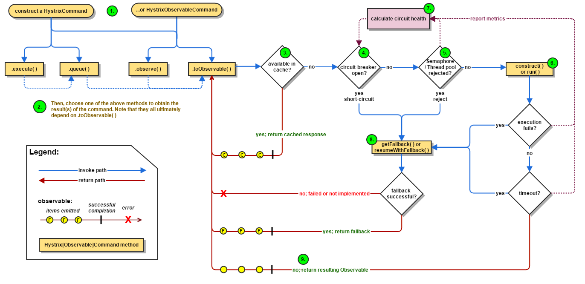
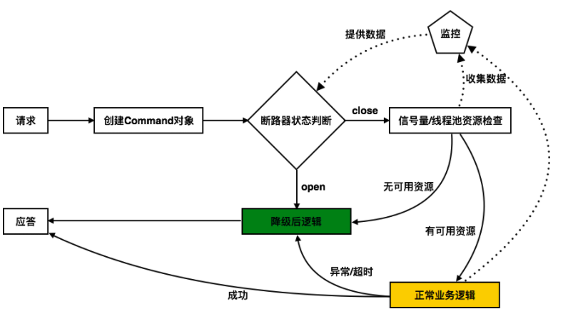
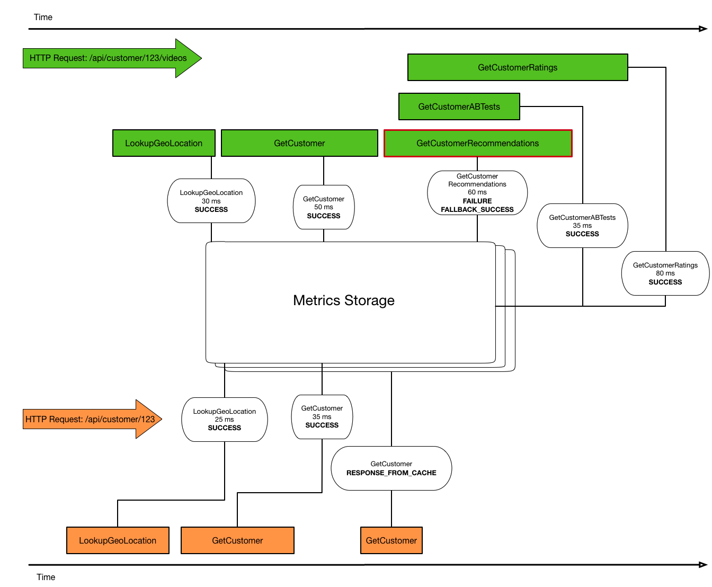

# Hystrix

## 什么是断路器

断路器模式源于Martin Fowler的Circuit Breaker一文。“断路器”本身是一种开关装置，用于在电路上保护线路过载，当线路中有电器发生短路时，“断路器”能够及时的切断故障电路，防止发生过载、发热、甚至起火等严重后果。

熔断器设计中有三种状态，closed（关闭状态，流量可以正常进入）、open（即熔断状态，一旦错误达到阈值，熔断器将打开，拒绝所有流量）和half-open(半开状态，open状态持续一段时间后将自动进入该状态，重新接收流量，一旦请求失败，重新进入open状态，但如果成功数量达到阈值，将进入closed状态)，见下图：


*   CLOSED关闭状态：允许流量通过。

*   OPEN打开状态：不允许流量通过，即处于降级状态，走降级逻辑。

*   HALF\_OPEN半开状态：允许某些流量通过，并关注这些流量的结果，如果出现超时、异常等情况，将进入OPEN状态，如果成功，那么将进入CLOSED状态。

## 总运行流程



The following sections will explain this flow in greater detail:

1.  [Construct a ](https://github.com/Netflix/Hystrix/wiki/How-it-Works#flow1 "Construct a ")[HystrixCommand](https://github.com/Netflix/Hystrix/wiki/How-it-Works#flow1 "HystrixCommand")[ or ](https://github.com/Netflix/Hystrix/wiki/How-it-Works#flow1 " or ")[HystrixObservableCommand](https://github.com/Netflix/Hystrix/wiki/How-it-Works#flow1 "HystrixObservableCommand")[ Object](https://github.com/Netflix/Hystrix/wiki/How-it-Works#flow1 " Object")

2.  [Execute the Command](https://github.com/Netflix/Hystrix/wiki/How-it-Works#flow2 "Execute the Command")

3.  [Is the Response Cached?](https://github.com/Netflix/Hystrix/wiki/How-it-Works#flow3 "Is the Response Cached?")

4.  [Is the Circuit Open?](https://github.com/Netflix/Hystrix/wiki/How-it-Works#flow4 "Is the Circuit Open?")

5.  [Is the Thread Pool/Queue/Semaphore Full?](https://github.com/Netflix/Hystrix/wiki/How-it-Works#flow5 "Is the Thread Pool/Queue/Semaphore Full?")

6.  [HystrixObservableCommand.construct()](https://github.com/Netflix/Hystrix/wiki/How-it-Works#flow6 "HystrixObservableCommand.construct()")[ or ](https://github.com/Netflix/Hystrix/wiki/How-it-Works#flow6 " or ")[HystrixCommand.run()](https://github.com/Netflix/Hystrix/wiki/How-it-Works#flow6 "HystrixCommand.run()")

7.  [Calculate Circuit Health](https://github.com/Netflix/Hystrix/wiki/How-it-Works#flow7 "Calculate Circuit Health")

8.  [Get the Fallback](https://github.com/Netflix/Hystrix/wiki/How-it-Works#flow8 "Get the Fallback")

9.  [Return the Successful Response](https://github.com/Netflix/Hystrix/wiki/How-it-Works#flow9 "Return the Successful Response")



所有的核心逻辑都由**AbstractCommand**（即HystrixCommand的父类，HystrixCommand只是对AbstractCommand进行了简单包装）抽象类串起来，从功能上来说，AbstractCommand必须将如下功能联系起来：


**策略配置**：Hystrix有两种降级模型，即信号量（同步）模型和线程池（异步）模型，这两种模型所有可定制的部分都体现在了HystrixCommandProperties和HystrixThreadPoolProperties两个类中。然而还是那句老话，Hystrix只提供了配置修改的入口，没有将配置界面化，如果想在页面上动态调整配置，还需要自己实现。

**数据统计**：Hystrix以命令模式的方式来控制业务逻辑以及熔断逻辑的调用时机，所以说数据统计对它来说不算难事，但如何高效、精准的在内存中统计数据，还需要一定的技巧。

**断路器**：断路器可以说是Hystrix内部最重要的状态机，是它决定着每个Command的执行过程。

**监控露出**：能通过某种可配置方式将统计数据展现在仪表盘上。

## 配置

[https://github.com/Netflix/Hystrix/wiki/Configuration#coreSize](https://github.com/Netflix/Hystrix/wiki/Configuration#coreSize "https://github.com/Netflix/Hystrix/wiki/Configuration#coreSize")

```text
hystrix.command.default和hystrix.threadpool.default中的default为默认CommandKey

Command Properties
Execution相关的属性的配置：
hystrix.command.default.execution.isolation.strategy 隔离策略，默认是Thread, 可选Thread｜Semaphore

hystrix.command.default.execution.isolation.thread.timeoutInMilliseconds 命令执行超时时间，默认1000ms

hystrix.command.default.execution.timeout.enabled 执行是否启用超时，默认启用true
hystrix.command.default.execution.isolation.thread.interruptOnTimeout 发生超时是是否中断，默认true
hystrix.command.default.execution.isolation.semaphore.maxConcurrentRequests 最大并发请求数，默认10，该参数当使用ExecutionIsolationStrategy.SEMAPHORE策略时才有效。如果达到最大并发请求数，请求会被拒绝。理论上选择semaphore size的原则和选择thread size一致，但选用semaphore时每次执行的单元要比较小且执行速度快（ms级别），否则的话应该用thread。
semaphore应该占整个容器（tomcat）的线程池的一小部分。
Fallback相关的属性
这些参数可以应用于Hystrix的THREAD和SEMAPHORE策略

hystrix.command.default.fallback.isolation.semaphore.maxConcurrentRequests 如果并发数达到该设置值，请求会被拒绝和抛出异常并且fallback不会被调用。默认10
hystrix.command.default.fallback.enabled 当执行失败或者请求被拒绝，是否会尝试调用hystrixCommand.getFallback() 。默认true
Circuit Breaker相关的属性
hystrix.command.default.circuitBreaker.enabled 用来跟踪circuit的健康性，如果未达标则让request短路。默认true
hystrix.command.default.circuitBreaker.requestVolumeThreshold 一个rolling window内最小的请求数。如果设为20，那么当一个rolling window的时间内（比如说1个rolling window是10秒）收到19个请求，即使19个请求都失败，也不会触发circuit break。默认20
hystrix.command.default.circuitBreaker.sleepWindowInMilliseconds 触发短路的时间值，当该值设为5000时，则当触发circuit break后的5000毫秒内都会拒绝request，也就是5000毫秒后才会关闭circuit。默认5000
hystrix.command.default.circuitBreaker.errorThresholdPercentage错误比率阀值，如果错误率>=该值，circuit会被打开，并短路所有请求触发fallback。默认50
hystrix.command.default.circuitBreaker.forceOpen 强制打开熔断器，如果打开这个开关，那么拒绝所有request，默认false
hystrix.command.default.circuitBreaker.forceClosed 强制关闭熔断器 如果这个开关打开，circuit将一直关闭且忽略circuitBreaker.errorThresholdPercentage
Metrics相关参数
hystrix.command.default.metrics.rollingStats.timeInMilliseconds 设置统计的时间窗口值的，毫秒值，circuit break 的打开会根据1个rolling window的统计来计算。若rolling window被设为10000毫秒，则rolling window会被分成n个buckets，每个bucket包含success，failure，timeout，rejection的次数的统计信息。默认10000
hystrix.command.default.metrics.rollingStats.numBuckets 设置一个rolling window被划分的数量，若numBuckets＝10，rolling window＝10000，那么一个bucket的时间即1秒。必须符合rolling window % numberBuckets == 0。默认10
hystrix.command.default.metrics.rollingPercentile.enabled 执行时是否enable指标的计算和跟踪，默认true
hystrix.command.default.metrics.rollingPercentile.timeInMilliseconds 设置rolling percentile window的时间，默认60000
hystrix.command.default.metrics.rollingPercentile.numBuckets 设置rolling percentile window的numberBuckets。逻辑同上。默认6
hystrix.command.default.metrics.rollingPercentile.bucketSize 如果bucket size＝100，window＝10s，若这10s里有500次执行，只有最后100次执行会被统计到bucket里去。增加该值会增加内存开销以及排序的开销。默认100
hystrix.command.default.metrics.healthSnapshot.intervalInMilliseconds 记录health 快照（用来统计成功和错误绿）的间隔，默认500ms
Request Context 相关参数
hystrix.command.default.requestCache.enabled 默认true，需要重载getCacheKey()，返回null时不缓存
hystrix.command.default.requestLog.enabled 记录日志到HystrixRequestLog，默认true

Collapser Properties 相关参数
hystrix.collapser.default.maxRequestsInBatch 单次批处理的最大请求数，达到该数量触发批处理，默认Integer.MAX_VALUE
hystrix.collapser.default.timerDelayInMilliseconds 触发批处理的延迟，也可以为创建批处理的时间＋该值，默认10
hystrix.collapser.default.requestCache.enabled 是否对HystrixCollapser.execute() and HystrixCollapser.queue()的cache，默认true

ThreadPool 相关参数
线程数默认值10适用于大部分情况（有时可以设置得更小），如果需要设置得更大，那有个基本得公式可以follow：
requests per second at peak when healthy × 99th percentile latency in seconds + some breathing room
每秒最大支撑的请求数 (99%平均响应时间 + 缓存值)
比如：每秒能处理1000个请求，99%的请求响应时间是60ms，那么公式是：
（0.060+0.012）

基本得原则时保持线程池尽可能小，他主要是为了释放压力，防止资源被阻塞。
当一切都是正常的时候，线程池一般仅会有1到2个线程激活来提供服务

hystrix.threadpool.default.coreSize 并发执行的最大线程数，默认10
hystrix.threadpool.default.maxQueueSize BlockingQueue的最大队列数，当设为－1，会使用SynchronousQueue，值为正时使用LinkedBlcokingQueue。该设置只会在初始化时有效，之后不能修改threadpool的queue size，除非reinitialising thread executor。默认－1。
hystrix.threadpool.default.queueSizeRejectionThreshold 即使maxQueueSize没有达到，达到queueSizeRejectionThreshold该值后，请求也会被拒绝。因为maxQueueSize不能被动态修改，这个参数将允许我们动态设置该值。if maxQueueSize == -1，该字段将不起作用
hystrix.threadpool.default.keepAliveTimeMinutes 如果corePoolSize和maxPoolSize设成一样（默认实现）该设置无效。如果通过plugin（https://github.com/Netflix/Hystrix/wiki/Plugins）使用自定义实现，该设置才有用，默认1.
hystrix.threadpool.default.metrics.rollingStats.timeInMilliseconds 线程池统计指标的时间，默认10000
hystrix.threadpool.default.metrics.rollingStats.numBuckets 将rolling window划分为n个buckets，默认10
```

Ribbon可以对单个服务配置负载均衡参数，[Hystrix](https://so.csdn.net/so/search?q=Hystrix\&spm=1001.2101.3001.7020 "Hystrix")可以对单个接口进行配置，对一些并发量高的项目可以增加Hystrix时间窗口和熔断触发条件的设置。

```yaml
feign:
  hystrix:
    # 启用熔断降级策略
    enabled: true

ribbon:
  # 请求建立连接超时时间，单位：毫秒，默认：2000
  ConnectTimeout: 3000
  # 读取数据超时时间长，单位：毫秒，默认：5000
  # 这里设置为10秒，表示请求发出后，超过10秒没有读取到数据时请求超时
  ReadTimeout: 10000
  # 对所有操作都进⾏重试，默认：false
  OkToRetryOnAllOperations: false
  # 对同一个实例的最大重试次数，默认：0
  MaxAutoRetries: 1
  # 切换实例重试的最大次数，默认：1
  MaxAutoRetriesNextServer: 1

hystrix:
  command:
    default:
      execution:
        timeout:
          # 配置HystrixCommand命令执行是否开启超时，默认：true。
          enabled: true
        isolation:
          # 隔离策略，分为THREAD和SEMAPHORE，默认为THREAD。
          strategy: THREAD
          semaphore:
            # 信号量大小，当隔离策略为信号量时，最大并发请求达到该设置值，后续的请求将被拒绝，默认：10
            maxConcurrentRequests: 100
          thread:
            # 表示设置是否在执行超时时，中断HystrixCommand.run() 的执行，默认：true
            interruptOnTimeout: true
            # hystrixCommand命令执行超时时间，单位：毫秒，默认：1000
            # 首先要考虑接口的响应时间，其次要考虑ribbon的超时时间和重试次数
            timeoutInMilliseconds: 30000

```

*   feign.hystrix.enabled：设置是否使用Hystrix进行熔断，需要就设置为true，不需要的话就设置为false。通常为了防止服务雪崩，都会启用熔断降级策略。

*   ribbon.ConnectTimeout：这是客户端发出Http请求，建立连接的超时时间。通常建立TCP连接是很快的，这个值不需要设置的太大，除非服务端连接被占满了。

*   ribbon.ReadTimeout：这是TCP连接建立成功后，客户端发出请求，等待服务端响应的超时时间，如果客户端超过这个时间没有收到服务端的响应数据，那么就超时了。这个值可以根据接口的响应时间进行设置，比正常响应时间大一点就可以了，如果设置的太长，在并发量高的情况下，一旦接口卡住会积压大量请求线程，导致服务拖垮；如果设置的太短，请求结果还没返回就超时，会导致客户端一直取不到数据。

*   ribbon.OkToRetryOnAllOperations：是否对所有的情况都进行重试。默认值是false，这时只会对连接建立失败进行重试，例如ConnectTimeout会重试，而ReadTimeout不会进行重试。如果设置为true，会对所有的异常进行重试。这个值建议设置为false，除非是只读的接口，对新增或修改的接口进行请求重试，可能会导致数据异常，比如转账，如果接口卡住，进行重试会导致重复转账。

*   ribbon.MaxAutoRetries：请求异常时，在当前实例上重试的次数。

*   ribbon.MaxAutoRetriesNextServer：切换到下一个实例进行重试的次数。在当前实例重试后依然失败时，切换到下一个服务实例进行请求，这个参数设置最多可以切换几个服务实例。

*   hystrix.command.default.execution.timeout.enabled：HystrixCommand命令执行是否开启超时，默认为true，即开启超时。需要注意的是这个超时设置只有在隔离策略为THREAD的时候才有效，如果隔离策略设置为SEMAPHORE，那么hystrixCommand命令执行超时不会起作用。

*   hystrix.command.default.execution.isolation.strategy：这个参数用来设置Hystix的线程隔离策略，有THREAD（线程池）和SEMAPHORE（[信号量](https://so.csdn.net/so/search?q=信号量\&spm=1001.2101.3001.7020 "信号量")）两种。THREAD：使用线程池中的线程执行hystrixCommand命令，异步执行，存在线程切换，会增加系统开销，并发量会受到线程池中的线程数影响。SEMAPHORE：使用调用线程执行hystrixCommand命令，同步执行，会被阻塞，适用于延迟低的情况，如果调用外部接口，响应慢的话就不太合适了。虽然使用调用线程执行，但是并发量会受到信号量的限制，超过信号量的调用会被拒绝。如果要使用SEMAPHORE策略的话，一定要根据实际并发量调整信号量的值。

*   hystrix.command.default.execution.isolation.semaphore.maxConcurrentRequests：这个参数用于设置信号量大小，只有当隔离策略为SEMAPHORE时有效，这个值决定了请求的并发量。

*   hystrix.command.default.execution.isolation.thread.interruptOnTimeout：这个参数用于设置当hystrixCommand命令执行超时，是否中断执行。需要注意的是这个参数只有在隔离策略为THREAD的时候有效。

*   hystrix.command.default.execution.isolation.thread.timeoutInMilliseconds：这个参数用于设置hystrixCommand命令执行超时时间，只有在隔离策略为THREAD的时候有效。这个值的设置需要考虑ribbon的超时时间和重试次数，同时要考虑并发量，线程被用完后会进入队列排队。

## 监控

说明：hystrix为每一个commandKey提供了计数器。原理：



Hystrix采用的是滑动窗口+分桶的形式来采集数据。

与常规的同步统计数据的方式不同，Hystrix采用的是RxJava来进行事件流的异步统计数据，类似于观察者模式，这样做的好处是降低统计时阻塞业务逻辑的风险，在某些情况下还能享受多核CPU所带来的性能上的收益。&#x20;

## 缓存

## 降级

将系统遇到“危险”时采取的整套应急方案和措施统一称为降级或服务降级。

Hystrix提供了三种降级策略：

*   并发

*   耗时

*   错误率

而Hystrix的设计本身就能很好的支持动态的调整这些策略（简单的说就是调整并发、耗时和错误率的阈值），当然，如何去动态调整需要用户自己来实现，Hystrix只提供了入口，就是说，Hystrix并没有提供一个服务端界面来动态调整这些策略，这多少有点让人遗憾。如果要了解Hystrix具体的策略配置，可以看看`HystrixCommandProperties` 和 `HystrixThreadPoolProperties`两个类。

被降级后的请求是应该返回null？还是默认值？还是抛异常？这些都要根据业务而定。Hystrix也在HystrixCommand提供了getFallback方法来方便用户返回降级后的结果。

### 服务降级与服务熔断区别

服务降级这里有两种场景:

*   当下游的服务因为某种原因**响应过慢**，下游服务主动停掉一些不太重要的业务，释放出服务器资源，增加响应速度！

*   当下游的服务因为某种原因**不可用**，上游主动调用本地的一些降级逻辑，避免卡顿，迅速返回给用户！

服务降级有很多种降级方式！如开关降级、限流降级、熔断降级! **服务熔断属于降级方式的一种**

区别：

*   触发原因不一样，服务熔断由链路上某个服务引起的，服务降级是从整体的负载考虑

*   管理目标层次不一样，服务熔断是一个框架层次的处理，服务降级是业务层次的处理

*   实现方式不一样，服务熔断一般是自我熔断恢复，服务降级相当于人工控制

*   触发原因不同 服务熔断一般是某个服务（下游服务）故障引起，而服务降级一般是从整体负荷考虑；

一句话：

服务熔断是应对系统服务雪崩的一种保险措施，给出的一种特殊降级措施。而服务降级则是更加宽泛的概念，主要是对系统整体资源的合理分配以应对压力。

### 配置

Hystrix提供了如下的几个关键参数，来对一个熔断器进行配置：

```纯文本
circuitBreaker.requestVolumeThreshold    //滑动窗口的大小，默认为20 
circuitBreaker.sleepWindowInMilliseconds //过多长时间，熔断器再次检测是否开启，默认为5000，即5s钟 
circuitBreaker.errorThresholdPercentage  //错误率，默认50%
```

3个参数放在一起，所表达的意思就是：

每当20个请求中，有50%失败时，熔断器就会打开，此时再调用此服务，将会直接返回失败，不再调远程服务。直到5s钟之后，重新检测该触发条件，判断是否把熔断器关闭，或者继续打开。

这里面有个很关键点，达到熔断之后，那么后面它就直接不去调该微服务。那么既然不去调该微服务或者调的时候出现异常，出现这种情况首先不可能直接把错误信息传给用户，所以针对熔断

我们可以考虑采取降级策略。所谓降级，就是当某个服务熔断之后，服务器将不再被调用，此时客户端可以自己准备一个本地的fallback回调，返回一个缺省值。 

这样做，虽然服务水平下降，但好歹可用，比直接挂掉要强，当然这也要看适合的业务场景。

### 降级方式&#x20;

*   延迟服务：比如发表了评论，重要服务，比如在文章中显示正常，但是延迟给用户增加积分，只是放到一个缓存中，等服务平稳之后再执行。&#x20;

*   在粒度范围内关闭服务（片段降级或服务功能降级）：比如关闭相关文章的推荐，直接关闭推荐区

*   页面异步请求降级：比如商品详情页上有推荐信息/配送至等异步加载的请求，如果这些信息响应慢或者后端服务有问题，可以进行降级；&#x20;

*   页面跳转（页面降级）：比如可以有相关文章推荐，但是更多的页面则直接跳转到某一个地址&#x20;

*   写降级：比如秒杀抢购，我们可以只进行Cache的更新，然后异步同步扣减库存到DB，保证最终一致性即可，此时可以将DB降级为Cache。&#x20;

*   读降级：比如多级缓存模式，如果后端服务有问题，可以降级为只读缓存，这种方式适用于对读一致性要求不高的场景。

## 资源隔离

[Hystrix实现资源隔离](Hystrix实现资源隔离/Hystrix实现资源隔离.md "Hystrix实现资源隔离")

## 总结

1.  Hystrix内部大量使用了响应式编程模型，通过RxJava库，把能异步做的都做成异步了。这似乎能降低代码复杂度（我是指对RxJava了解的人），并且在多核CPU的服务器上能带来意外性能收获。

2.  Hystrix能做到通过并发、耗时和异常来进行降级，并能在（并发、限流或内部产生的异常导致的）错误率达到一定阈值时进行服务熔断，并且还能做到从降级状态快速恢复。

3.  Hystrix通过Command模式来包装降级业务，这有时候提高了接入成本。

4.  Hystrix只提供了策略变更的入口，但具体的策略可视化和动态配置还是得用户来实现，这确实非常尴尬。

5.  Hystrix默认的仪表盘只提供了简单的实时数据显示，如果要持久化历史数据，也得用户来实现。

## 参考

*   [https://blog.csdn.net/shiyong1949/article/details/119201924](https://blog.csdn.net/shiyong1949/article/details/119201924 "https://blog.csdn.net/shiyong1949/article/details/119201924")

*   [https://www.cnblogs.com/duanxz/p/7521009.html](https://www.cnblogs.com/duanxz/p/7521009.html "https://www.cnblogs.com/duanxz/p/7521009.html")

*   [https://www.cnblogs.com/duanxz/p/9668011.html](https://www.cnblogs.com/duanxz/p/9668011.html "https://www.cnblogs.com/duanxz/p/9668011.html")

*   [https://www.cnblogs.com/duanxz/p/7526372.html](https://www.cnblogs.com/duanxz/p/7526372.html "https://www.cnblogs.com/duanxz/p/7526372.html")

*   [https://github.com/Netflix/Hystrix/wiki/How-it-Works](https://github.com/Netflix/Hystrix/wiki/How-it-Works#flow-chart "https://github.com/Netflix/Hystrix/wiki/How-it-Works")

*   [https://pdai.tech/md/arch/arch-y-reduce.html](https://pdai.tech/md/arch/arch-y-reduce.html "https://pdai.tech/md/arch/arch-y-reduce.html")

[Hystrix Feign 特定状态码不熔断](Hystrix%20Feign%20特定状态码不熔断/Hystrix%20Feign%20特定状态码不熔断.md "Hystrix Feign 特定状态码不熔断")

[Hystrix实现资源隔离](Hystrix实现资源隔离/Hystrix实现资源隔离.md "Hystrix实现资源隔离")
