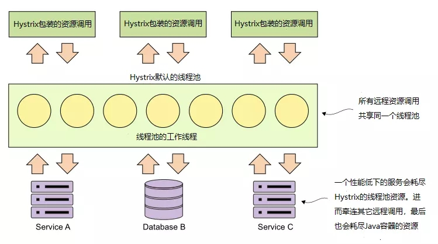
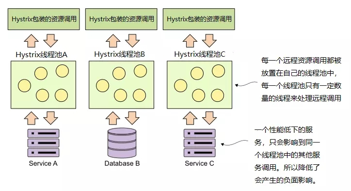
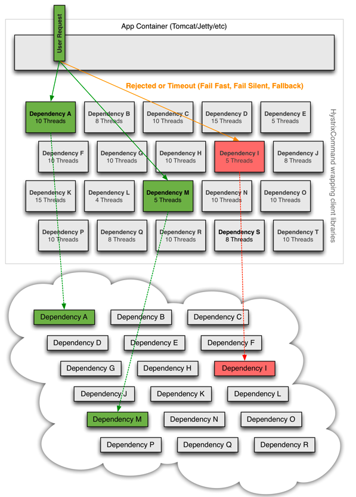

# Hystrix实现资源隔离

## 资源是什么？ 又为什么要隔离

我们设想一个这样的场景：

*   在某分布式微服务系统中的某个服务A ，它依赖外部的B 、C、D 三个服务，通过RPC 远程调用它们。

*   假设服务A是一个springboot 启动的java进程，内部wrap的web server是tomcat。

*   假设tomcat 采用的线程模型是NIO模式，它默认的最大连接数是 `10000` ，也就是最多同时接收处理`10000`个用户请求。

在正常情况下，只要同时请求数不超过`10000` 且服务A及内外部服务都正常运行就没有问题。（理论上虽然是这样，但实际情况可能不太严谨）

考虑这样一种情况：

假设依赖的B服务由于各种原因不正常了，比如出现了超时，而且B服务是一个业务核心依赖（基本所有请求都要过它）。那么这时候用户从A服务入口进来的正常请求线程将不能正常 `终止（terminated）`，而会 `阻塞（Blocked）` 或者 `等待(waiting)` 在B服务这里。

这时tomcat的可用线程数将下降，也就会导致用户对A服务的正常请求受到影响，如果B服务的情况不能得到改善，那么A服务将有可能面临

*   线程资源不足，A服务的非核心请求也受到影响 （不走B服务的）

*   `雪崩` 的风险，有可能会因为线程资源不足而hang死，产生连锁反应，导致A也不可用。

可见，我们并不想产生这样的影响，我们希望无论B服务是不是核心依赖，它出了问题，都尽量不要或最小范围影响我本服务。

**所以，总结来看，资源具体来说就是 `线程` ，而隔离的目的，是为了在依赖服务出问题的情况下，影响范围最小化。**

## Hystrix&#x20;

### Hystrix模型&#x20;

Hystrix将远程服务的请求托管在一个线程池中。即默认情况下，所有Hystrix命令(@HystrixCommand)共享同一个线程池来处理这些请求。该线程池中持有10个线程来处理各种远程服务请求，可以是REST服务调用、数据库访问等。如下图所示：



### 如何隔离

有两种策略分别是

*   线程池隔离

*   信号量隔离

两种隔离方式都是限制对共享资源的并发访问量，线程在就绪状态、运行状态、阻塞状态、终止状态间转变时需要由操作系统调度，占用很大的性能消耗；而信号量是在访问共享资源时，进行tryAcquire，tryAcquire成功才允许访问共享资源。

```java
HystrixCommandProperties.Setter().withExecutionisolationStrategy(ExecutionlsolationStrategy.THREAD)
HystrixCommandProperties.Setter().withExecutionisolationStrategy(ExecutionisolationStrategy.SEMAPHORE)

```

### 线程池隔离

@HystrixCommand的默认配置适用于只有少量远程调用的应用。幸运的是，Hystrix提供了简单易用的方法实现舱壁来隔离不同的远程资源调用。下图说明了Hystrix将不同的远程调用隔离在不同的“舱室”（线程池）中：



Hystrix可以为每一个依赖建立一个线程池，使之和其他依赖的使用资源隔离，同时限制他们的并发访问和阻塞扩张。每个依赖可以根据权重分配资源（这里主要是线程），每一部分的依赖出现了问题，也不会影响其他依赖的使用资源。



如果简单的使用异步线程来实现依赖调用会有如下问题：

*   线程的创建和销毁

*   线程上下文空间的切换，用户态和内核态的切换带来的性能损耗。

使用线程池的方式可以解决第一种问题，但是第二个问题计算开销是不能避免的。

**Netflix在使用过程中详细评估了使用异步线程和同步线程带来的性能差异，结果表明在99%的情况下，异步线程带来的几毫秒延迟的完全可以接受的。**

优点：

*   一个依赖可以给予一个线程池，这个依赖的异常不会影响其他的依赖。

*   使用线程可以完全隔离第三方代码,请求线程可以快速放回。

*   当一个失败的依赖再次变成可用时，线程池将清理，并立即恢复可用，而不是一个长时间的恢复。

*   **可以完全模拟异步调用，方便异步编程。**

*   使用线程池，可以有效的进行实时监控、统计和封装。

缺点：

*   使用线程池的缺点主要是增加了计算的开销。每一个依赖调用都会涉及到队列，调度，上下文切换，而这些操作都有可能在不同的线程中执行。

**线程池的创建和管理**

虽然Hystrix可以为每个依赖建立一个线程池，但是如果依赖成千上万，建立那么多线程池肯定是不可能的。所以默认情况下，Hystrix会为每一个Command Group建立一个线程池。Hystrix的线程池在HystrixConcurrencyStrategy初始化，线程池是由ThreadPoolExecutor实现的。每个线程池默认初始化10个线程。Hystrix有个静态类Factory，创建的线程池会被存储在Factory中的ConcurrentHashMap中。ConcurrentHashMap的Key则是上文说到的CommandGroupKey或者指定的ThreadPoolKey。每次命令执行的时候，都会根据ThreadPoolKey去找到对应的线程池。线程池拥有一个继承于rxjava中Scheduler的HystrixContextScheduler，用于在执行命令的时候，把命令在这个线程池上调度执行。

### 信号量隔离

> 每次调用线程，当前请求通过计数信号量进行限制，当信号大于了最大请求数（maxConcurrentRequests）时，进行限制，调用fallback接口快速返回。

信号量的资源隔离只是起到一个开关的作用，例如，服务X的信号量大小为10，那么同时只允许10个tomcat的线程(此处是tomcat的线程，而不是服务X的独立线程池里面的线程)来访问服务X，其他的请求就会被拒绝，从而达到限流保护的作用。

**信号量的调用是同步的**，也就是说，每次调用都得阻塞调用方的线程，直到结果返回。这样就导致了无法对访问做超时（只能依靠调用协议超时，无法主动释放）

**什么时候适合用信号量隔离而不是用线程池？**

1.  隔离的细粒度太高，数百个实例需要隔离，此时用线程池做隔离开销过大

2.  通常这种都是非网络调用的情况下

### 选用

两种策略对比

|      | 线程池隔离        | 信号量隔离       |
| ---- | ------------ | ----------- |
| 线程   | 与调用线程非相同线程   | 与调用线程相同     |
| 开销   | 排队、调度、上下文开销等 | 无线程切换，开销低   |
| 异步   | 支持           | 不支持         |
| 并发支持 | 支持（最大线程池大小）  | 支持（最大信号量上限） |

*   对于那些本来延迟就比较小的请求（例如访问本地缓存成功率很高的请求）来说，线程池带来的开销是非常高的，这时，你可以考虑采用其他方法，例如非阻塞信号量（不支持超时），来实现依赖服务的隔离，使用信号量的开销很小。**但绝大多数情况下，Netflix 更偏向于使用线程池来隔离依赖服务，因为其带来的额外开销可以接受，并且能支持包括超时在内的所有功能。**

*   当请求的服务网络开销比较大的时候，或者是请求比较耗时的时候，我们最好是使用线程隔离策略，这样的话，可以保证大量的容器(tomcat)线程可用，不会由于服务原因，一直处于阻塞或等待状态，快速失败返回。而当我们请求缓存这些服务的时候，我们可以使用信号量隔离策略，因为这类服务的返回通常会非常的快，不会占用容器线程太长时间，而且也减少了线程切换的一些开销，提高了缓存服务的效率。

```java
@HystrixCommand(
        commandProperties = { //利用commandProperties更改线程池的一些默认配置
            //选择“线程池”模式、"信号量"模式
            @HystrixProperty(name="execution.isolation.strategy",value = "THREAD"/"SEMAPHORE"), 
            //超时
            @HystrixProperty(name="execution.isolation.thread.timeoutInMilliseconds",value = "3000"),
            //信号量大小为10，那么同时只允许10个tomcat的线程(此处是tomcat的线程，而不是服务的独立线程池里面的线程)来访问服务，其他的请求就会被拒绝，从而达到限流保护的作用
            @HystrixProperty(name="execution.isolation.semaphore.maxConcurrentRequests",value = "10"),
        }，
)
public List<License> getLicensesByOrg(String organizationId){
    //....
}
```

**注意，如果选用线程池，要合理的设置线程池的大小，和超时时间。**

spring cloud 的yaml配置可以参考：

```yaml
feign:
  hystrix:
    # 启用熔断降级策略
    enabled: true

ribbon:
  # 请求建立连接超时时间，单位：毫秒，默认：2000
  ConnectTimeout: 3000
  # 读取数据超时时间长，单位：毫秒，默认：5000
  # 这里设置为10秒，表示请求发出后，超过10秒没有读取到数据时请求超时
  ReadTimeout: 10000
  # 对所有操作都进⾏重试，默认：false
  OkToRetryOnAllOperations: false
  # 对同一个实例的最大重试次数，默认：0
  MaxAutoRetries: 1
  # 切换实例重试的最大次数，默认：1
  MaxAutoRetriesNextServer: 1

hystrix:
  command:
    default:
      execution:
        timeout:
          # 配置HystrixCommand命令执行是否开启超时，默认：true。
          enabled: true
        isolation:
          # 隔离策略，分为THREAD和SEMAPHORE，默认为THREAD。
          strategy: THREAD
          semaphore:
            # 信号量大小，当隔离策略为信号量时，最大并发请求达到该设置值，后续的请求将被拒绝，默认：10
            maxConcurrentRequests: 100
          thread:
            # 表示设置是否在执行超时时，中断HystrixCommand.run() 的执行，默认：true
            interruptOnTimeout: true
            # hystrixCommand命令执行超时时间，单位：毫秒，默认：1000
            # 首先要考虑接口的响应时间，其次要考虑ribbon的超时时间和重试次数
            timeoutInMilliseconds: 30000
```

更多配置请 参考： [https://github.com/Netflix/Hystrix/wiki/Configuration](https://github.com/Netflix/Hystrix/wiki/Configuration "https://github.com/Netflix/Hystrix/wiki/Configuration")

## 参考

*   [https://github.com/Netflix/Hystrix/wiki/Configuration](https://github.com/Netflix/Hystrix/wiki/Configuration "https://github.com/Netflix/Hystrix/wiki/Configuration")

*   [http://www.baoguoding.com/2019/08/471-hystrix08.html](http://www.baoguoding.com/2019/08/471-hystrix08.html "http://www.baoguoding.com/2019/08/471-hystrix08.html")

*   [https://blog.csdn.net/shiyong1949/article/details/119201924](https://blog.csdn.net/shiyong1949/article/details/119201924 "https://blog.csdn.net/shiyong1949/article/details/119201924")
