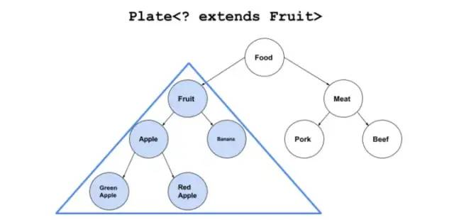

# 泛型

**泛型的设计初衷：是为了减少类型转换错误产生的安全隐患，而不是为了实现任意化。**

**泛型可以应用在类、接口和方法的创建中，分别称为泛型类、泛型接口和泛型方法**

泛型类在类名后面用尖括号表示泛型

```java

public class HelloWorld<T> {

    private T t;
    public T getValue() {
        return t;
    }
    public void setValue(T t) {
        this.t = t;
    }
} 
```

泛型方法在方法声明中加入泛型

```java

//这是泛型方法
static <T> void printHelloWorld(T t){
        LOGGER.info(t);
}
//这是一个普通方法
public T getT() {
        return t;
}
```

泛型接口跟类类似

```java

public interface Generator<T> {
    public T next();
}
```

**总结：**

*   **有\<T> 带尖括号的 才能表示是泛型类或方法或接口。而只有T的只能表示是泛型类型**

*   泛型类型的命名并不是必须为T，也可以使用其他字母，如X、K等，只要是命名为单个大写字即可。

*   虽然没有强制的命名规范，但是为了便于代码阅读，也形成了一些约定俗成的命名规范，如下：

|   |                                   |
| - | --------------------------------- |
| T | 通用泛型类型，通常作为第一个泛型类型                |
| S | 通用泛型类型，如果需要使用多个泛型类型，可以将S作为第二个泛型类型 |
| U | 通用泛型类型，如果需要使用多个泛型类型，可以将U作为第三个泛型类型 |
| V | 通用泛型类型，如果需要使用多个泛型类型，可以将V作为第四个泛型类型 |
| E | 集合元素 泛型类型，主要用于定义集合泛型类型            |
| K | 映射-键 泛型类型，主要用于定义映射泛型类型            |
| V | 映射-值 泛型类型，主要用于定义映射泛型类型            |
| N | 数值 泛型类型，主要用于定义数值类型的泛型类型           |

### 通配符、上下边界、无界

如果不对泛型类型做限制，则泛型类型可以实例化成任意类型，这种情况可能产生某些安全性隐患。 &#x20;

为了限制允许实例化的泛型类型，我们需要一种能够限制泛型类型的手段，即：有界泛型类型

```java
// 有界泛型类型语法 - 继承自某父类
<T extends ClassA>

//有界泛型类型语法 - 实现某接口
<T extends InterfaceB>

//有界泛型类型语法 - 多重边界
<T extends ClassA & InterfaceB & InterfaceC ... >

//示例
//N标识一个泛型类型，其类型只能是Number抽象类的子类
<N extends Number> 
//T标识一个泛型类型，其类型只能是Person类型的子类，并且实现了Comparable 和 Map接口
<T extends Person & Comparable & Map>
```

**上边界通配符（\<? extends 父类型>）**

*   上界：用 extends 关键字声明，表示参数化的类型可能是所指定的类型，或者是此类型的子类。

*   类型参数列表中如果有多个类型参数上限，用逗号分开

    ```java
    private <K extends A, E extends B> E test(K arg1, E arg2){}
    ```

*   上边界类型通配符可以确定父类型

*   在**获取数据**时，由于固定了上界，类型肯定是返回类型的子类型，可以通过向上转型成功获取。

*   在**写入数据**时，由于向下转型存在很大风险，Java泛型为了减低类型转换的安全隐患，不允许这种操作



```java

Plate<? extends Fruit> p=new Plate<Apple>(new Apple());

//不能存入任何元素
p.set(new Fruit());    //Error
p.set(new Apple());    //Error

//读取出来的东西只能存放在Fruit或它的基类里。
Fruit newFruit1=p.get();
Object newFruit2=p.get();
Apple newFruit3=p.get();    //Error
```

&#x20;原因是编译器只知道容器内是Fruit或者它的派生类，但具体是什么类型不知道。可能是Fruit？可能是Apple？也可能是Banana，RedApple，GreenApple？编译器在看到后面用Plate赋值以后，盘子里没有被标上有“苹果”。而是标上一个占位符：CAP#1，来表示捕获一个Fruit或Fruit的子类，具体是什么类不知道，代号CAP#1。然后无论是想往里插入Apple或者Meat或者Fruit编译器都不知道能不能和这个CAP#1匹配，所以就都不允许。

**下边界通配符（\<? super 子类型>）**

*   下界通配符\<? super T>不影响往里面存储，但是读取出来的数据只能是Object类型。

*   和上界相对的就是下界 ，语法表示为：\<? super T> &#x20;


```java
Plate<? super Fruit> p=new Plate<Fruit>(new Fruit());

//存入元素正常
p.set(new Fruit());
p.set(new Apple());

//读取出来的东西只能存放在Object类里。
Apple newFruit3=p.get();    //Error
Fruit newFruit1=p.get();    //Error
Object newFruit2=p.get();

```

因为下界规定了元素的最小粒度的下限，实际上是放松了容器元素的类型控制。既然元素是Fruit的基类，那往里存粒度比Fruit小的都可以。但往外读取元素就费劲了，只有所有类的基类Object对象才能装下。但这样的话，元素的类型信息就全部丢失。

1.  频繁往外读取内容的，适合用上界Extends。

2.  经常往里插入的，适合用下界Super。

**无边界通配符（\<?>）**

*   无边界通配符\<?> 等同于上边界通配符\<? extends Object>，所以关于无边界通配符（\<?>）就很好理解了。

*   因为可以确定父类型是Object，所以可以以Object去获取数据（向上转型）。但是不能写入数据。

### \<T>与\<?>的区别

？和 T 都表示不确定的类型，区别在于我们可以对 T 进行操作，但是对 ？不行，比如如下这种 ：

```java
// 可以
T t = operate();
// 不可以
？car = operate();
```

T 是一个 确定的类型，通常用于泛型类和泛型方法的定义

？是一个 不确定的类型，通常用于泛型方法的调用代码和形参，不能用于定义类和泛型方法。

类型参数 T 只具有 一种 类型限定方式：

```java
T extends A

```

但是通配符 ? 可以进行 两种限定：

```java
? extends A
? super A  
```

T 可以多重限定 而 ? 不行

```java
<T extends ClassA & InterfaceB & InterfaceC ... >

```

### 泛型使用的限制

泛型不能使用基本类型

```java
// 编译前类型检查报错
List<int> list = new List<int>();
```

泛型不允许进行实例化

```java
<T> void test(T t){
    //编译前类型检查报错
    t = new T();
}
```

泛型不允许进行静态化

```java
static class Demo<T>{
        // 编译前类型检查报错
        private static T t;

        // 编译前类型检查报错
        public static T getT() {
            return t;
        }
}    
```

泛型不允许直接进行类型转换（通配符可以）

```java
List<Integer> integerList = new ArrayList<Integer>();
List<Double> doubleList = new ArrayList<Double>();
//不能直接进行类型转换，类型检查报错
//integerList = doubleList; 
```

泛型不允许直接使用instanceof运算符进行运行时类型检查（通配符可以）

```java
List<String> stringList = new ArrayList<String >();
//不能直接使用instanceof，类型检查报错
//LOGGER.info(stringList instanceof ArrayList<Double>);
//我们可以通过通配符的方式进行instanceof运行期检查（不建议）：
//通过通配符实现运行时验证
LOGGER.info(stringList instanceof ArrayList<?>);
```

泛型不允许创建确切类型的泛型数组（通配符可以）

```java
//类型检查报错
//Demo6<Integer>[] iDemo6s = new Demo6<Integer>[2];
```

泛型不允许定义泛型异常类或者catch异常（throws可以）

*   不允许定义泛型异常类（直接或间接扩展Throwable类）

*   不允许捕获一个泛型异常

*   可以以异常类作为边界

*   可以throws泛型类型

泛型不允许作为参数进行重载

```java

static class Demo8<T>{
    void test(List<Integer> list){}
    //不允许作为参数列表进行重载
    //void test(List<Double> list){}
}
```

## 参考

*   [https://blog.csdn.net/hanchao5272/article/details/79346471](https://blog.csdn.net/hanchao5272/article/details/79346471 "https://blog.csdn.net/hanchao5272/article/details/79346471")

*   [https://stackoverflow.com/questions/2723397/what-is-pecs-producer-extends-consumer-super](https://stackoverflow.com/questions/2723397/what-is-pecs-producer-extends-consumer-super "https://stackoverflow.com/questions/2723397/what-is-pecs-producer-extends-consumer-super")

*   [https://guofeng007.com/2018/03/01/java-super-extends-template/#什么是下界](https://guofeng007.com/2018/03/01/java-super-extends-template/#什么是下界 "https://guofeng007.com/2018/03/01/java-super-extends-template/#什么是下界")

*   [https://blog.csdn.net/hanchao5272/article/details/79352321](https://blog.csdn.net/hanchao5272/article/details/79352321 "https://blog.csdn.net/hanchao5272/article/details/79352321")
