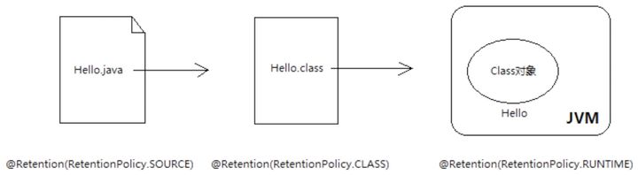

# 注解

## 概念

**注解本质上是个接口。**

Annontation是Java5开始引入的新特征。中文名称一般叫注解。它提供了一种安全的类似注释的机制，用来将任何的信息或元数据（metadata）与程序元素（类、方法、成员变量等）进行关联。

更通俗的意思是为程序的元素（类、方法、成员变量）加上更直观更明了的说明，这些说明信息是与程序的业务逻辑无关，并且是供指定的工具或框架使用的。

Annontation像一种修饰符一样，应用于包、类型、构造方法、方法、成员变量、参数及本地变量的声明语句中

## 原理

以前，『XML』是各大框架的青睐者，它以松耦合的方式完成了框架中几乎所有的配置，但是随着项目越来越庞大，『XML』的内容也越来越复杂，维护成本变高。

于是就有人提出来一种标记式高耦合的配置方式，『注解』。方法上可以进行注解，类上也可以注解，字段属性上也可以注解，反正几乎需要配置的地方都可以进行注解。

关于『注解』和『XML』两种不同的配置模式，争论了好多年了，各有各的优劣，注解可以提供更大的便捷性，易于维护修改，但耦合度高，而 XML 相对于注解则是相反的。

注解这个词可以将两个字分开理解：

*   注：一种特殊的注释

*   解：对这些注释的解析

**一个注解准确意义上来说，只不过是一种特殊的注释而已，如果没有解析它的代码，它可能连注释都不如。**

### 元注解

首先看下元注解，它是用于修饰注解的注解，通常用在注解的定义上。

JAVA 中有以下几个元注解：

*   @Target：注解的作用目标

*   @Retention：注解的生命周期

*   @Documented：注解是否应当被包含在 JavaDoc 文档中

*   @Inherited：是否允许子类继承该注解

**Target – 表示该注解用于什么地方。默认值为任何元素。可用的ElementType 参数包括**

*   `ElementType.CONSTRUCTOR`: 用于描述构造器

*   `ElementType.FIELD`: 成员变量、对象、属性（包括enum实例）

*   `ElementType.LOCAL_VARIABLE`: 用于描述局部变量

*   `ElementType.METHOD`: 用于描述方法

*   `ElementType.PACKAGE`: 用于描述包

*   `ElementType.PARAMETER`: 用于描述参数

*   `ElementType.TYPE`: 用于描述类、接口(包括注解类型) 或enum声明

**Retention – 定义该注解的生命周期**

*   `RetentionPolicy.SOURCE` : 在编译阶段丢弃。这些注解在编译结束之后就不再有任何意义，不会写入 class 文件。`@Override`, `@SuppressWarnings`都属于这类注解。

*   `RetentionPolicy.CLASS` : 类加载阶段丢弃，会写入 class 文件。注解默认使用这种方式

*   `RetentionPolicy.RUNTIME` : 永久保存，运行期也保留该注解，因此可以使用反射机制读取该注解的信息。我们自定义的注解通常使用这种方式。



**Documented – 一个简单的Annotations 标记注解，表示是否将注解信息添加在java 文档中**

**Inherited – 定义该注释和子类的关系**

`@Inherited` 元注解是一个标记注解，`@Inherited` 阐述了某个被标注的类型是被继承的。如果一个使用了`@Inherited` 修饰的`annotation` 类型被用于一个class，则这个`annotation` 将被用于该class 的子类。

### JAVA 的内置三大注解

*   @Override

*   @Deprecated

*   @SuppressWarnings

Override 是一种典型的『标记式注解』，仅被编译器可知，编译器在对 java 文件进行编译成字节码的过程中，一旦检测到某个方法上被修饰了该注解，就会去匹对父类中是否具有一个同样方法签名的函数，如果不是，自然不能通过编译。

Deprecated 依然是一种『标记式注解』，永久存在，可以修饰所有的类型，作用是，标记当前的类或者方法或者字段等已经不再被推荐使用了，可能下一次的 JDK 版本就会删除。

SuppressWarnings 主要用来压制 java 的警告，它有一个类型为`String[]` 的成员，这个成员的值为被禁止的警告名

```java
@SuppressWarning(value = "deprecated")
public static void main(String[] args) {
    Date date = new Date(2018, 7, 11);
}

```

这样，编译器不再检查 main 方法下是否有过时的方法调用，也就压制了编译器对于这种警告的检查。

### 自定义注解

**自定义注解类编写的一些规则:**

1.  `Annotation` 型定义为`@interface`, 所有的`Annotation` 会自动继承`java.lang.Annotation`这一接口,并且不能再去继承别的类或是接口.

2.  参数成员只能用public 或默认(default) 这两个访问权修饰

3.  参数成员只能用基本类型byte、short、char、int、long、float、double、boolean八种基本数据类型和String、Enum、Class、annotations等数据类型，以及这一些类型的数组.

4.  要获取类方法和字段的注解信息，必须通过Java的反射技术来获取 Annotation 对象，因为你除此之外没有别的获取注解对象的方法

5.  注解也可以没有定义成员，不过这样注解就没啥用了

例子：

```java

import java.lang.annotation.*;

@Retention(RetentionPolicy.RUNTIME)
@Documented
@Target(ElementType.TYPE)
public @interface Counter {

  int count() default 0;
}

```

### 解析方式

解析一个类或者方法的注解往往有两种形式，一种是`编译期直接的扫描`，一种是`运行期反射`。

**编译器的扫描**：

*   指的是编译器在对 java 代码编译字节码的过程中会检测到某个类或者方法被一些注解修饰，这时它就会对于这些注解进行某些处理。典型的就是注解 @Override，一旦编译器检测到某个方法被修饰了 @Override 注解，编译器就会检查当前方法的方法签名是否真正重写了父类的某个方法，也就是比较父类中是否具有一个同样的方法签名。

*   这一种情况只适用于那些编译器已经熟知的注解类，比如 JDK 内置的几个注解，而你自定义的注解，编译器是不知道你这个注解的作用的，当然也不知道该如何处理，往往只是会根据该注解的作用范围来选择是否编译进字节码文件，仅此而已。

如果你想要在编译期间处理注解相关的逻辑，你需要继承AbstractProcessor 并实现process方法。比如可以看到lombok就用AnnotationProcessor继承了AbstractProcessor

**运行期反射**：

注解本质上是一个接口，所以一定有代理类来进行实现，具体是`sun.reflect.annotation.AnnotationInvocationHandler`

AnnotationInvocationHandler里面封装了 注解的代理逻辑，其实所有对注解的方法调用，最终都是交给了`AnnotationInvocationHandler`

虚拟机规范定义了一系列和注解相关的属性表，也就是说，无论是字段、方法或是类本身，如果被注解修饰了，就可以被写进字节码文件。属性表有以下几种：

*   RuntimeVisibleAnnotations：运行时可见的注解

*   RuntimeInVisibleAnnotations：运行时不可见的注解

*   RuntimeVisibleParameterAnnotations：运行时可见的方法参数注解

*   RuntimeInVisibleParameterAnnotations：运行时不可见的方法参数注解

*   AnnotationDefault：注解类元素的默认值

对于一个类或者接口来说，Class 类中提供了以下一些方法用于反射注解。

*   getAnnotation：返回指定的注解

*   isAnnotationPresent：判定当前元素是否被指定注解修饰

*   getAnnotations：返回所有的注解

*   getDeclaredAnnotation：返回本元素的指定注解

*   getDeclaredAnnotations：返回本元素的所有注解，不包含父类继承而来的

当你进行反射的时候，虚拟机将所有生命周期在 RUNTIME 的注解取出来放到一个 map 中，并创建一个 AnnotationInvocationHandler 实例，把这个 map 传递给它。最后，虚拟机将采用 JDK 动态代理机制生成一个目标注解的代理类，并初始化好处理器。

### spring 注解实现原理

参考： [https://yijiyong.com/spring/annotation/03-springannprin.html](https://yijiyong.com/spring/annotation/03-springannprin.html "https://yijiyong.com/spring/annotation/03-springannprin.html")

## 总结

*   Annotations仅仅是元数据，和业务逻辑无关。

*   如果Annotations不包含业务逻辑，那么必须有人来实现这些逻辑。元数据的用户来做这个事情。Annotations仅仅提供它定义的属性(类/方法/包/域)的信息。

*   Annotations的用户(同样是一些代码)来读取这些信息并实现必要的逻辑。

*   当我们使用Java的标注Annotations(例如@Override)时，JVM就是一个用户，它在字节码层面工作。

*   Annotation其实是一种接口。通过java的反射机制相关的API来访问Annotation信息

## 参考

*   [https://juejin.cn/post/6844903636733001741](https://juejin.cn/post/6844903636733001741 "https://juejin.cn/post/6844903636733001741")

*   [https://yijiyong.com/spring/annotation/01-intro.html](https://yijiyong.com/spring/annotation/01-intro.html "https://yijiyong.com/spring/annotation/01-intro.html")

*   [https://cloud.tencent.com/developer/article/1522675](https://cloud.tencent.com/developer/article/1522675 "https://cloud.tencent.com/developer/article/1522675")

*   [https://www.cnblogs.com/throwable/p/9747595.html](https://www.cnblogs.com/throwable/p/9747595.html "https://www.cnblogs.com/throwable/p/9747595.html")
