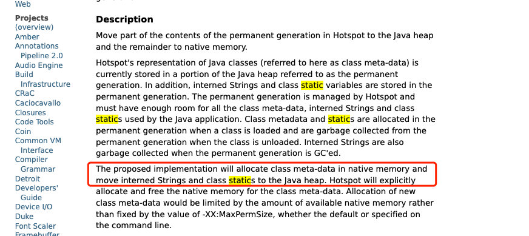
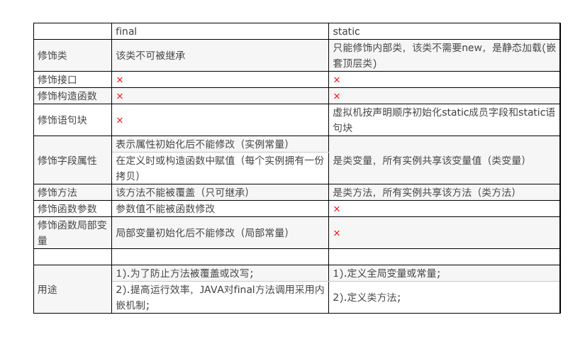

# 语法

### 多态

## 接口

### 接口中可以写方法实现

Java 8 开始是可以有方法实现的，可以在接口中添加默认方法和静态方法。

默认方法用 default 修饰，只能用在接口中，静态方法用 static 修饰，这个我们不陌生了。并且接口中的默认方法、静态方法可以同时有多个。

在接口中写实现方法一点也不稀奇，像这样的用法，从 Java 8 到 Java 14 已是遍地开花，到处都可以看到接口默认方法和静态方法的身影。

```java
// 比如  List 接口就有 sort方法

public interface List<E> extends Collection<E> {
    ...
    
    default void sort(Comparator<? super E> c) {
        Object[] a = this.toArray();
        Arrays.sort(a, (Comparator) c);
        ListIterator<E> i = this.listIterator();
        for (Object e : a) {
            i.next();
            i.set((E) e);
        }
    }
    
    ...
}

```

*   只要在一个接口添加了一个默认方法，所有的实现类就自动继承

## final&#x20;

*   使用final**修饰基本类型的变量**，一旦对该变量赋值之后，就不能重新赋值了。

*   但是**对于修饰引用类型变量**，他保存的只是引用，final只能保证引用类型变量所引用的地址不改变，但不保证这个对象不改变，这个对象完全可以发生改变。

*   final**修饰类**即表示此类已经是“最后的、最终的”含义。因此，用final修饰的类不能被继承，即不能拥有自己的子类。如果视图对一个已经用final修饰的类进行继承，在编译期间或发生错误

*   final**修饰的方法**表示此方法已经是“最后的、最终的”含义，亦即此方法不能被重写（可以重载多个final修饰的方法）。

注意： 没有在声明时初始化final变量的称为空白final变量(blank final variable)，它们必须在构造器中初始化，或者调用this()初始化。不这么做的话，编译器会报错“final变量(变量名)需要进行初始化”。

### 不可变对象

指所有的成员都是final并且成员**要么是基本类型，要么指向另一个不可变对象**。可以并发访问而无需使用同步机制。通过final引用读取“实际不可变”对象（指成员虽然实际并不是final，然而却从不会改变）也是安全的。

### 变量传递

在方法参数前面加final关键字就是为了防止数据在方法体中被修改

```java
public static void method(final int x) {          
  //此处的final 修饰的 x 随着方法使用完毕后回收 ，当再次调用时，重新分配空间
  System.out.println(x);
  // 赋值可以
  int y = x;
  // 修改会报错  The final local variable  cannot be assigned. It must be blank and not using a compound assignment
  x = 5;
}}
```

### final的初始化时机

在对象构造完毕前即可

### 实现原理

[内存屏障](https://www.wolai.com/5anK7Wv2JkXeWeUYxxnfBh#gReS8vJTgrXcbCTkmRfkf7 "内存屏障")

### 使用细节

只加final修饰的会存在堆中，加static的，存在方法区(JDK8之前)

### 关联知识&#x20;

final 也是 JMM  [JMM（Java Memory Model）](../JMM（Java%20Memory%20Model）/JMM（Java%20Memory%20Model）.md "JMM（Java Memory Model）") 对可见性的一种实现

## static&#x20;

### static关键字有哪些作用&#xA;&#xA;

&#x20;• static修饰变量、修饰方法

&#x20;• 静态块&#x20;

• 静态内部类 （普通类是不允许声明为静态的，只有**内部类**才可以）

• 静态导包

### 存储位置&#x20;

参考： [运行时数据区](../JVM/运行时数据区/运行时数据区.md "运行时数据区")

永久代的移除和元空间的引入是一个分步骤完成的过程：

1.  JDK7中，字符串字面量和类的静态变量首先被从永久代被移出到Java堆中;避免因为字符串字面量大量存储到字符串常量池中而导致的永久代内存溢出。

2.  JDK8中，JVM彻底移除了永久代，同时引入元空间(Metaspace)来管理原来的元数据，这些元数据被分配到本地内存中进行管理。元空间默认上限是本地内存大小，所以降低了元空间OOM的可能性。

根据 [http://openjdk.java.net/jeps/122](http://openjdk.java.net/jeps/122 "http://openjdk.java.net/jeps/122") JDK8 以上还是在堆中。



可以参考：

*   [https://stackoverflow.com/questions/18339707/permgen-elimination-in-jdk-8/22509753#22509753](https://stackoverflow.com/questions/18339707/permgen-elimination-in-jdk-8/22509753#22509753 "https://stackoverflow.com/questions/18339707/permgen-elimination-in-jdk-8/22509753#22509753")

### 静态初始化

1.父类的静态初始化块
2.子类的静态初始化块
3.父类的初始化块
4.父类的构造函数
5.子类的初始化块
6.子类的构造函数

对象的初始化顺序：

（1）类加载之后，按从上到下（从父类到子类）执行被static修饰的语句；

（2）当static语句执行完之后,再执行main方法；

（3）如果有语句new了自身的对象，将从上到下执行构造代码块、构造器（两者可以说绑定在一起）。

```java
class HelloA {

    public HelloA() {
        System.out.println("HelloA");
    }
    
    { System.out.println("I'm A class"); }
    
    static { System.out.println("static A"); }

}

public class HelloB extends HelloA {

    public HelloB() {
        System.out.println("HelloB");
    }
    
    { System.out.println("I'm B class"); }
    
    static { System.out.println("static B"); }
    
    public static void main(String[] args) { 
　　　　 new HelloB(); 
　　 }

}
```

答案

```text
static A
static B
I'm A class
HelloA
I'm B class
HelloB
```

### static块执行时机

**类被加载了不一定就会执行静态代码块**，只有一个类被主动使用的时候，静态代码才会被执行！ 　

当一个类被主动使用时，Java虚拟就会对其初始化，如下六种情况为主动使用：&#x20;

1.  当创建某个类的新实例时（如通过new或者反射，克隆，反序列化等）

2.  当调用某个类的静态方法时&#x20;

3.  当使用某个类或接口的静态字段时&#x20;

4.  当调用Java API中的某些反射方法时，比如类Class中的方法，或者java.lang.reflect中的类的方法时&#x20;

5.  当初始化某个子类时&#x20;

6.  当虚拟机启动某个被标明为启动类的类（即包含main方法的那个类）

### 注意

*   static 只是声明变量在主存上的唯一性，不能保证工作区与主存区变量值的一致性；除非变量的值是不可变的，即再加上final的修饰符，否则static声明的变量，不是线程安全的。

### 和final 的对比



## abstract

对于abstract方法，不能使用private修饰符（编译出错），不能使用package修饰符（编译正常，但是不合理，后患无穷），可以使用public和protected，大多数情况下都是使用public。

[多态](多态/多态.md "多态")

[数据类型](数据类型/数据类型.md "数据类型")

[java 方法重载与静态分派](java%20方法重载与静态分派/java%20方法重载与静态分派.md "java 方法重载与静态分派")

[泛型](泛型/泛型.md "泛型")
