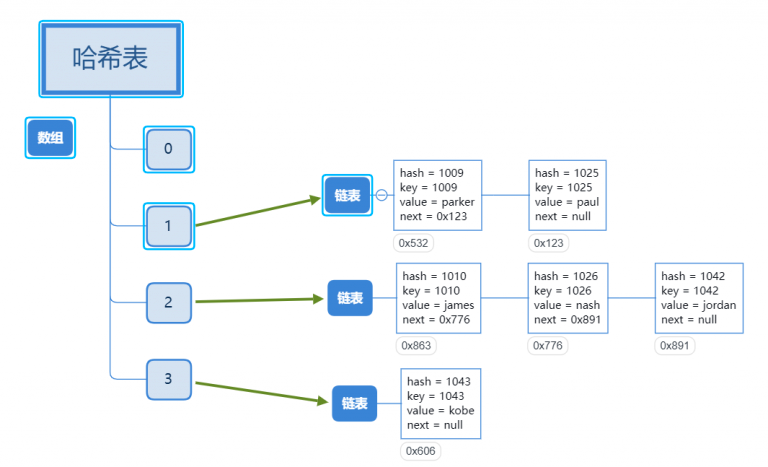
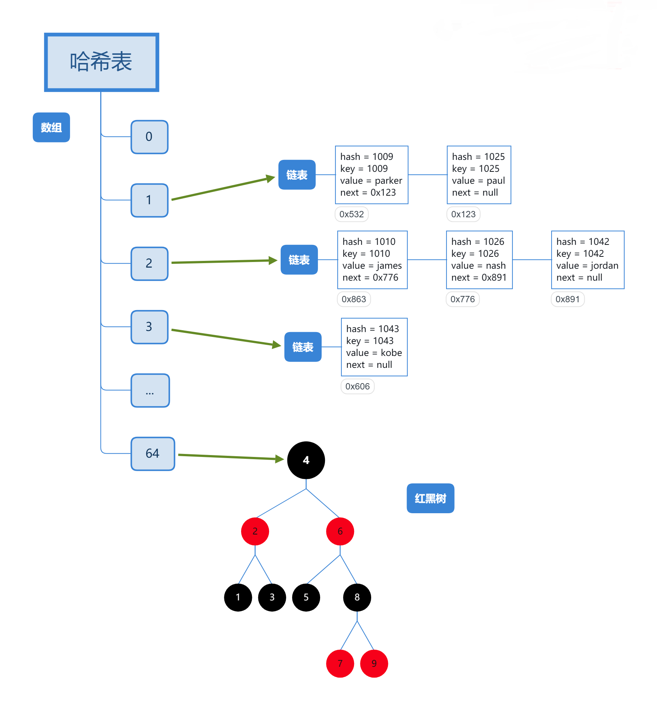
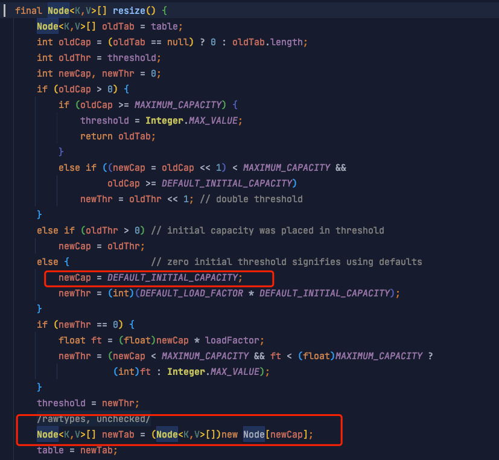
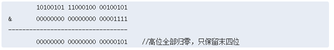
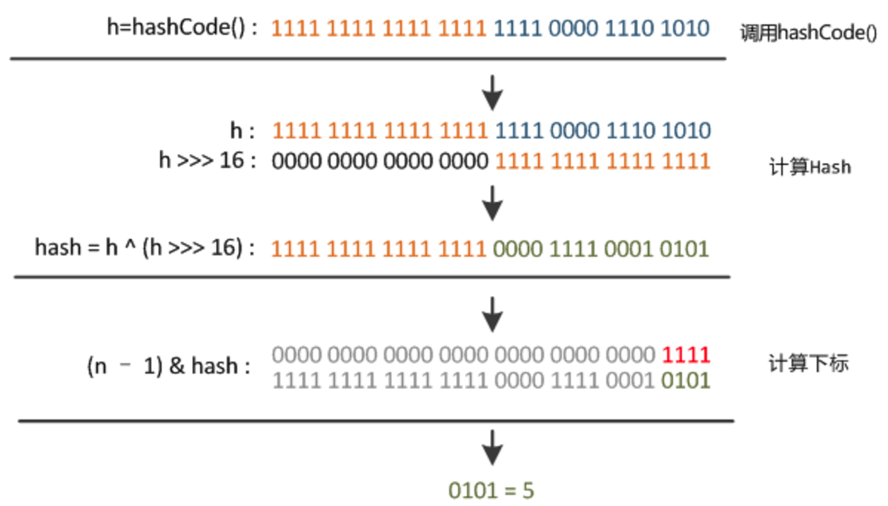
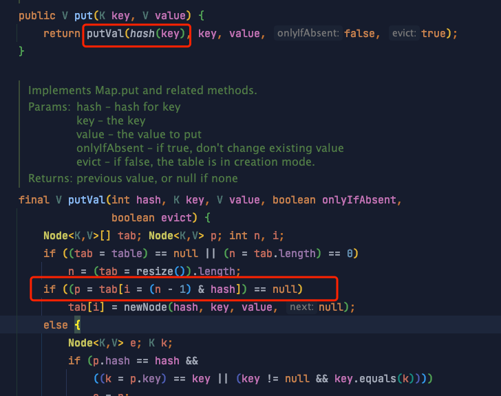
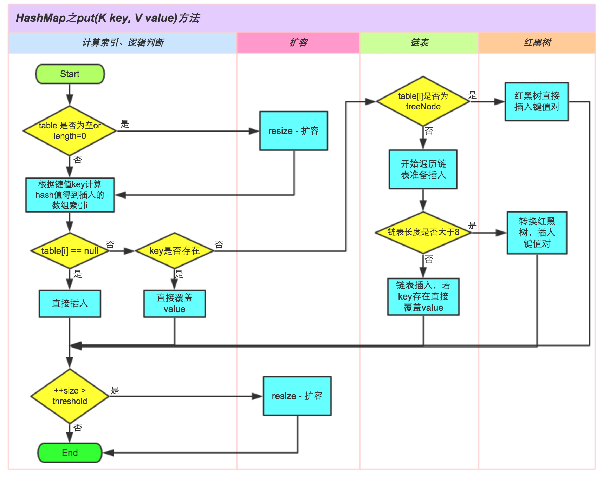
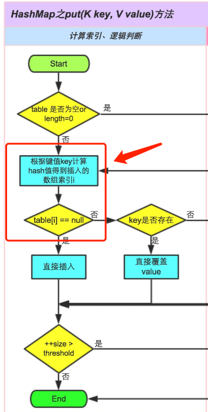
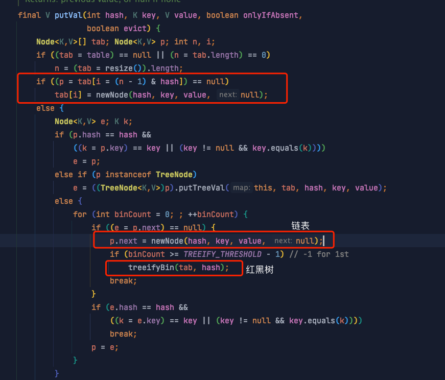

# HashMap

## 特点&#x20;

*   KV 结构，K、V 都允许 null 值&#x20;

*   线程不安全，运行速度快，存取速度快

HashMap 是非线程安全的，可以用 Collections 的 synchronizedMap 方法使 HashMap 具有线程安全的能力，或者使用 ConcurrentHashMap。

如果用 `Collections.synchronizedMap` 则与使用 `Hashtable`  类似，两者性能相近，但是 synchrnizedMap 可以用 null 作为 key 和 value。

## 数据结构

jdk1.7 是数组+链表的结构 



**jdk1.8 是数组+链表+红黑树**



## 数组长度定义为多少？

HashMap 类中有一个非常重要的字段，就是 Node\[] table，即哈希桶数组。上两图中的数组即为 Node 数组。以下为部分源码：

```java
static class Node<K,V> implements Map.Entry<K,V> {
        final int hash;    //用来定位数组索引位置
        final K key;
        V value;
        Node<K,V> next;   //链表的下一个 node

        Node(int hash, K key, V value, Node<K,V> next) { ... }
        public final K getKey(){ ... }
        public final V getValue() { ... }
        public final String toString() { ... }
        public final int hashCode() { ... }
        public final V setValue(V newValue) { ... }
        public final boolean equals(Object o) { ... }
} 
```

又根据 resize() 方法源码注释得知，Node 数组是在初始化或扩容时定义

> Initializes or doubles table size. If null, allocates in accord with initial capacity target held in field threshold. Otherwise, because we are using power-of-two expansion, the elements from each bin must either stay at same index, or move with a power of two offset in the new table.

具体看一下 resize() 方法对应源码：



可见初始化时默认 Node 数组大小为 **DEFAULT\_INITIAL\_CAPACITY** （16）

```java
static final int DEFAULT_INITIAL_CAPACITY = 1 << 4; // aka 16

```

*这个值必须为 2 的幂次方。*

## 数组何时扩容？

通过阅读 put 方法源码得知当 ` ++size > threshold` 条件为真为将进行数组扩容。

```java
final V putVal(int hash, K key, V value, boolean onlyIfAbsent,
                   boolean evict) {
        Node<K,V>[] tab; Node<K,V> p; int n, i;
        if ((tab = table) == null || (n = tab.length) == 0)
            n = (tab = resize()).length;
        if ((p = tab[i = (n - 1) & hash]) == null)
            tab[i] = newNode(hash, key, value, null);
        else {
            Node<K,V> e; K k;
            
            ... 省略
        }
        ++modCount;
        if (++size > threshold)
            resize();
        afterNodeInsertion(evict);
        return null;
    }
```

size 是什么？(HashMap 中实际存在的键值对数量）

> The number of key-value mappings contained in this map

threshold 是什么？（扩容阈值）

> The next size value at which to resize (capacity \* load factor).
> (The javadoc description is true upon serialization. 
> Additionally, if the table array has not been allocated, this  field holds the initial array capacity, or zero signifying  DEFAULT\_INITIAL\_CAPACITY.)

threshold  = capacity \* load factor 

*   capacity 容量  默认 16

*   load factor 装载因子 默认 0.75

如果按照默认值算的话，threshold 为 12，结合前面的知识，根据条件 ` ++size > threshold` ：如果 HashMap 初始容量为 16，则当实际存在的键值对到达 12 时，就进行扩容。

## 装载因子为什么是 0.75?

**装载因子越大，说明空闲位置越少，冲突越多，散列表的性能会下降**。所以如果装载因子是 1，显然不合适。

**那如果是 0.5 呢** ? 如果是 0.5 ， 那么每次达到容量的一半就进行扩容，默认容量是 16， 达到 8 就扩容成 32，达到 16 就扩容成 64， 最终使用空间和未使用空间的差值会逐渐增加，空间利用率低下，也不合适。

那么应该定成多少，又是为什么 ？

> As a general rule, the default load factor (.75) offers a good  tradeoff between time and space costs.  Higher values decrease the &#x20;
> space overhead but increase the lookup cost (reflected in most of  the operations of the {@code HashMap} class, including &#x20;
> {@code get} and {@code put}).  The expected number of entries in  the map and its load factor should be taken into account when &#x20;
> setting its initial capacity, so as to minimize the number of  rehash operations.  If the initial capacity is greater than the &#x20;
> maximum number of entries divided by the load factor, no rehash  operations will ever occur.

根据上面的源码注释，**0.75 只是一个在时间和空间上折中的选择** ( tradeoff between time and space costs )

## 什么时候链表转红黑树 ？

### 为什么要转红黑树？

在 jdk1.8 之后，HashMap 初始化的时候也是线性表+链表，只是当拉链过长，则会严重影响 HashMap 的性能 。

**链表的长度超过一定****数量****之后，会把链表转换成红黑树来增加代码运行时的性能**。

在源码中用`TREEIFY_THRESHOLD`这个参数来指定这个**数量**。

```java
/**
     * The bin count threshold for using a tree rather than list for a
     * bin.  Bins are converted to trees when adding an element to a
     * bin with at least this many nodes. The value must be greater
     * than 2 and should be at least 8 to mesh with assumptions in
     * tree removal about conversion back to plain bins upon
     * shrinkage.
     */
    static final int TREEIFY_THRESHOLD = 8;
    
    /**
     * The bin count threshold for untreeifying a (split) bin during a
     * resize operation. Should be less than TREEIFY_THRESHOLD, and at
     * most 6 to mesh with shrinkage detection under removal.
     */
    static final int UNTREEIFY_THRESHOLD = 6;
```

可见这个值为 8 ，**当链表长度太长（默认超过 8）时，链表就转换为红黑树，利用红黑树快速增删改查的特点提高 HashMap 的性能**

我们注意到上面源码注释中还有一个值 `UNTREEIFY_THRESHOLD`，它是一个**红黑树到链表的还原阈值**，当扩容时，桶中元素个数小于这个值，就会把树形的桶元素 还原（切分）为链表结构。把时间复杂度从 O（n）变成 O（logN）提高了效率）

### 为什么是 8 和 6 ？

如果选择 6 和 8（如果链表小于等于 6 树还原转为链表，大于等于 8 转为树），中间有个差值 7 可以**有效防止链表和树频繁转换**。假设一下，如果设计成链表个数超过 8 则链表转换成树结构，链表个数小于 8 则树结构转换成链表，如果一个 HashMap 不停的插入、删除元素，链表个数在 8 左右徘徊，就会频繁的发生树转链表、链表转树，效率会很低。

### 那 8 是怎么来的？

```java
* Because TreeNodes are about twice the size of regular nodes, we
     * use them only when bins contain enough nodes to warrant use
     * (see TREEIFY_THRESHOLD). And when they become too small (due to
     * removal or resizing) they are converted back to plain bins.  In
     * usages with well-distributed user hashCodes, tree bins are
     * rarely used.  Ideally, under random hashCodes, the frequency of
     * nodes in bins follows a Poisson distribution
     * (http://en.wikipedia.org/wiki/Poisson_distribution) with a
     * parameter of about 0.5 on average for the default resizing
     * threshold of 0.75, although with a large variance because of
     * resizing granularity. Ignoring variance, the expected
     * occurrences of list size k are (exp(-0.5) * pow(0.5, k) /
     * factorial(k)). The first values are:
     *
     * 0:    0.60653066
     * 1:    0.30326533
     * 2:    0.07581633
     * 3:    0.01263606
     * 4:    0.00157952
     * 5:    0.00015795
     * 6:    0.00001316
     * 7:    0.00000094
     * 8:    0.00000006
     * more: less than 1 in ten million
```

我们用白话文翻译一下，大概意思就是说：

> 因为树结构是链表结构的两倍大小左右，所以当节点足够多的时候我们才会转换为树结构存储，而当它节点足够少的时候，我们又从树结构转换为链表结构。当使用良好的哈希码时，树结构是很少使用到的，理想的情况下，在随机的哈希码下，节点在链表中出现的频率**符合泊松分布**，在数组调整阈值为 0.75 的时候，该泊松分布的平均参数约为 0.5，因为数组调整的阈值大小对平均参数有很大影响。如果忽略这个影响，列表长度 k 出现的次数按照泊松分布依次为：
>
> 0: 0.60653066；
> 1: 0.30326533；
> 2: 0.07581633；
> 3: 0.01263606；
> 4: 0.00157952；
> 5: 0.00015795；
> 6: 0.00001316；
> 7: 0.00000094；
> 8: 0.00000006；
> 更大：不足千万分之一；

因为长度出现 8 的概率已经足够足够小了，所以说，按照**泊松分布**，大部分的 HashMap 其实还是数组+链表结果，不会转换为红黑树。当链表长度为 8 的时候，概率的计算，就是把 8 带入到公式中，因为默认调整阈值是 0.75 的时候，平均值是 0.5，所以，求得的概率即为链表长度为 8 的概率。

**结论：容器中节点分布在 hash 桶中的频率遵循泊松分布，桶的长度超过 8 的概率非常非常小。所以作者应该是根据概率统计而选择了 8 作为阀值。**

有关泊松分布可以参考 [这里](http://www.ruanyifeng.com/blog/2015/06/poisson-distribution.html# "这里") 大概了解一下。

## hash 算法

我们先来说说 hash 算法的一般实现：

*   大数变小数-->取模

*   让结果的规律性不明显--> 异或、改变原始数据、移位

*   碰撞是存在的，主要是看解决碰撞的方案

java 中常用的 hashCode 算法：

*   Object 类的 hashCode。返回对象的经过处理后的内存地址。由于每个对象的内存地址都不一样，所以哈希码也不一样，这是个 native 方法。取决于 JVM 的内部设计，一般是某种 C 地址的偏移。

*   String 类的 hashCode, 根据 String 类包含的字符串的内容，根据一种特殊的算法返回哈希码，只要字符串的内容相同，返回的哈希码也相同。

*   Integer 等包装类，返回的哈希码就是 Integer 对象里所包含的那个整数的值，例如 Integer  i1 = new Integer(100), i1.hashCode() 的值就是 100。由此可见，两个一样大小的 Integer 对象，返回的哈希码也一样。

*   int、char 这样的基础类，它们不需要 hashCode, 如果需要存储时，将进行自动装箱操作，计算方法同上。

## 如何确定哈希桶数组索引位置？

无论增加、删除、查找键值对，定位到哈希桶数组的位置都是很关键的第一步。

首先想到的就是**把 hash 值对数组长度取模运算**，这样一来，元素的分布相对来说是比较均匀的。但是，模运算的消耗还是比较大的，在 HashMap 中是这样做的：调用下面的代码来计算该对象应该保存在 table 数组的哪个索引处。

先看下 JDK1.7 的实现

```java
 final int hash(Object k) {
        int h = hashSeed;
        if (0 != h && k instanceof String) {
            return sun.misc.Hashing.stringHash32((String) k);
        }
　　　　// 先取 key 的 hashCode 再和 hashSeed 进行异或运算
        h ^= k.hashCode();

        // This function ensures that hashCodes that differ only by
        // constant multiples at each bit position have a bounded
        // number of collisions (approximately 8 at default load factor).
        h ^= (h >>> 20) ^ (h >>> 12);
        return h ^ (h >>> 7) ^ (h >>> 4);
    }
    
    static int indexFor(int h, int length) {  
    
       return h & (length-1);  
    }
```

**这个方法非常巧妙，获得 hash 值后，它通过`h & (table.length -1)`来得到该对象的保存位，而 HashMap 底层 Node 数组的长度总是 2 的 n 次方，这是 HashMap 在速度上的优化。当 length 总是 2 的 n 次方时，`h & (length-1)` 运算等价于对 length 取模，也就是`h % length`，但是 & 比% 具有更高的效率。**

数组长度减 1 正好相当于一个“低位掩码”。“与”操作的结果就是散列值的高位全部归零，只保留低位值，用来做数组下标访问。

以初始长度 16 为例，16-1=15。2 进制表示是 00000000 00000000 00001111。和某散列值做“与”操作如下，结果就是截取了最低的四位值。



**`h & (length-1)` 当且仅当 length（即 capacity) 是 2 的整倍数的时候才等于` h % length`, 从这个角度也说明了 capacity 为什么一定要用 2 的整次幂。**

在 JDK1.8 的实现中，优化了 hash 算法，是通过 hashCode() 的高 16 位异或低 16 位实现的

```java

static final int hash(Object key) {   
     int h;
     // h = key.hashCode() 为第一步 取 hashCode 值
     // h ^ (h >>> 16)  为第二步 高位参与运算
     return (key == null) ? 0 : (h = key.hashCode()) ^ (h >>> 16);
}

 final V putVal(int hash, K key, V value, boolean onlyIfAbsent,
                   boolean evict) {
        Node<K,V>[] tab; Node<K,V> p; int n, i;
        if ((tab = table) == null || (n = tab.length) == 0)
            n = (tab = resize()).length;
        if ((p = tab[i = (n - 1) & hash]) == null) //第三步 取模运算
            tab[i] = newNode(hash, key, value, null);
        else {
        ...

```
**JDK 中为什么不直接用 key.hashCode() 获取哈希值，而是使用 `(h = key.hashCode()) ^ (h >>> 16) ` ？**

我们通过上文了解了 HashMap 如何计算出数组索引位置，但其实有一个问题，就是即使我的散列值分布再松散，要是只取最后几位的话，碰撞也会很严重。更要命的是如果散列本身做得不好，分布上成等差数列的漏洞，恰好使最后几个低位呈现规律性重复，就无比蛋疼。

这时候“**扰动函数**”的价值就体现出来了



右位移 16 位，正好是** 32bi**t 的一半，**自己的高半区和低半区做异或，就是为了混合原始哈希码的高位和低位，以此来加大低位的随机性**。**而且混合后的低位掺杂了高位的部分特征，这样高位的信息也被变相保留下来**。这么做可以在数组 table 的 length 比较小的时候，也能保证考虑到高低 Bit 都参与到 Hash 的计算中，同时不会有太大的开销。（JDK 7 做了 4 次右移，估计是边际效应的原因，JDK8 就只做了一次右移）

`(h = key.hashCode()) ^ (h >>> 16)` 这样写有点类似重写了 hashCode，确保得出的数足够的随机，因为进行 hash 计算的时候 确保它的数足够的分散，以便于计算数组下标的时候存放的值足够分散。

方法的具体调用过程，可以参考 put 方法：



## 如何解决 hash 冲突？&#x20;

解决哈希冲突的方法一般有：开放地址法、链地址法（拉链法）、再哈希法、建立公共溢出区等方法。

HashMap 是用**拉链法**解决的 Hash 冲突问题。HashMap 的数据结构 ：jdk1.7 是数组+链表的结构 ，jdk1.8 是数组+链表+红黑树。

正是为了解决 Hash 冲突以及平衡查询、插入等操作的效率 HashMap 的作者才将 HashMap 设计成这种数据结构。

下面通过 put 方法的流程来了解一下 hash 冲突&#x20;



Hash 冲突 发生在了这里：



从代码上看是这里：



当没有 hash 冲突的时候就直接 newNode 了，如果发生了冲突，即通过 hash 计算出的 Node 数组位置上已经有元素了，那么就要执行下面的流程了：

*   有可能转成链表

*   有可能转成红黑树

从第一个 else 条件开始就是 hashMap 解决 hash 冲突的过程。也就是所谓的“拉链法”

**需要注意的点：**

*   HashMap 采用的链表法的方式，链表是**单向链表**

*   当发生 hash 冲突，hashMap 的桶中形成链表的时候，新的元素插入到该链表的时候，**jdk1.7 使用的是“头插法” 即新元素在链表头，而 jdk1.8 使用的“尾插法” 即新元素在链表尾**。

**重写 equals() 时，为什么 必须重写 hashCode()**  ？

我们知道当往 HashMap put 相同 key 的元素的时候，会用新 value 替换老 value，那么 HashMap 是如何判断 key 是相同的呢？

```java
 if (p.hash == hash && ((k = p.key) == key || (key != null && key.equals(k))))

```

根据源码，是通过比较 hashcode 和 equals ，所以说当对一个对象重写 equals 时，也要重写 hashCode 或者反过来。不然可能会对像 HashMap 这种容器的判断产生影响 。 试想如果你的对象没有正确重写这两个方法，那么装在容器中一定会有问题。

## HashMap 线程不安全

结论：在多线程使用场景中，应该尽量避免使用线程不安全的 HashMap，而使用线程安全的 ConcurrentHashMap

在多线程环境下使用 HashMap 可能产生**环链（死循环）问题**，当然是在 jdk1.7 版本，jdk1.8 由于使用了“尾插法”就避免了这个问题。在使用 jdk1.7 的情况下，是 put 过程中的 resize 方法在调用 transfer 方法的时候导致的环链。

举例说明一下：

```java
public class HashMapInfiniteLoop {

    private static HashMap<Integer,String> map = new HashMap<Integer,String>(2，0.75f);  
    public static void main(String[] args) {  
        map.put(5， "C");

        new Thread("Thread1") {  
            public void run() {  
                map.put(7, "B");  
                System.out.println(map);  
            };  
        }.start();  
        new Thread("Thread2") {  
            public void run() {  
                map.put(3, "A);  
                System.out.println(map);  
            };  
        }.start();        
    }  
}
```

其中，map 初始化为一个长度为 2 的数组，loadFactor=0.75，threshold=2\*0.75=1，也就是说当 put 第二个 key 的时候，map 就需要进行 resize。下面代码是 jdk1.7 的

```java
void resize(int newCapacity) {   //传入新的容量
      Entry[] oldTable = table;    //引用扩容前的 Entry 数组
      int oldCapacity = oldTable.length;         
      if (oldCapacity == MAXIMUM_CAPACITY) {  //扩容前的数组大小如果已经达到最大 (2^30) 了
          threshold = Integer.MAX_VALUE; //修改阈值为 int 的最大值 (2^31-1)，这样以后就不会扩容了
          return;
      }
   
      Entry[] newTable = new Entry[newCapacity];  //初始化一个新的 Entry 数组
     transfer(newTable);                         //！！将数据转移到新的 Entry 数组里
     table = newTable;                           //HashMap 的 table 属性引用新的 Entry 数组
     threshold = (int)(newCapacity * loadFactor);//修改阈值
}

 void transfer(Entry[] newTable) {
      Entry[] src = table;                   //src 引用了旧的 Entry 数组
      int newCapacity = newTable.length;
      for (int j = 0; j < src.length; j++) { //遍历旧的 Entry 数组
          Entry<K,V> e = src[j];             //取得旧 Entry 数组的每个元素
          if (e != null) {
              src[j] = null;//释放旧 Entry 数组的对象引用（for 循环后，旧的 Entry 数组不再引用任何对象）
              do {
                  Entry<K,V> next = e.next;
                 int i = indexFor(e.hash, newCapacity); //！！重新计算每个元素在数组中的位置
                 e.next = newTable[i]; //标记 [1]
                 newTable[i] = e;      //将元素放在数组上
                 e = next;             //访问下一个 Entry 链上的元素
             } while (e != null);
         }
     }
 
```

通过设置断点让线程 1 和线程 2 同时 debug 到 transfer 方法的首行。注意此时两个线程已经成功添加数据。放开 thread1 的断点至 transfer 方法的“Entry next = e.next;” 这一行；然后放开线程 2 的断点，让线程 2 进行完 resize。结果如下图。


注意，Thread1 的 e 指向了 key(3)，而 next 指向了 key(7)，其在线程二 rehash 后，指向了线程二重组后的链表。

线程一被调度回来执行，先是执行 newTalbe\[i] = e， 然后是 e = next，导致了 e 指向了 key(7)，而下一次循环的 next = e.next 导致了 next 指向了 key(3)。


e.next = newTable\[i] 导致 key(3).next 指向了 key(7)。注意：此时的 key(7).next 已经指向了 key(3)， **环形链表就这样出现了**。


于是，当我们用线程一调用 map.get(11) 时，悲剧就出现了——Infinite Loop。

HashMap 有并发问题，并不单单指环链问题，而是在数据结构的设计上就没有考虑并发环境。HashMap 的设计目标是简洁高效，**没有采取任何措施保证 put、remove 操作的多线程安全**。put 方法的操作对象要么是整个散列表，要么是某个哈希桶里的链表或红黑树，而这些过程都没有采取措施保证多线程安全。在这个复杂的逻辑过程中，任何一个线程在这个过程中改动了散列表的结构，都有可能造成另一个线程的操作失败。

### HashMap 是线程不安全的，读写方法都不安全吗？

put 这种写操作肯定是线程不安全的，应该不用说。那 get 这种读呢？&#x20;

通过上面对 JDK7 死循环的分析知道

*   如果在读之前有多线程的写操作已经造成了“ Infinite Loop”  ，那么再进行 get 的话，会出现问题，在种情况下读也不安全。

*   但如果在读之前并没有多线程写操作，那么多线程读是没有问题的。

总结：同时并发读写，多线程 put 后可能导致 get 死循环 (**CPU 100%**)，只是并发读没问题。

**怎么解决？**

如果遇到并发场景还是要使用并发容器，如 `Collections.synchronizedMap` 或 `ConcurrentHashMap`

## 不考虑内存限制，HashMap 可以无限存储数据吗？

**不可以**，HashMap 是有最大容量上限的。我们还是来看下源码注释：

```java

    /**
     * The maximum capacity, used if a higher value is implicitly specified
     * by either of the constructors with arguments.
     * MUST be a power of two <= 1<<30.
     */
    static final int MAXIMUM_CAPACITY = 1 << 30;
```

如果构造函数传入的值大于 MAXIMUM\_CAPACITY ，那么替换成该数 MAXIMUM\_CAPACITY （1 << 30） 即 2 的 30 次方。

**为什么是 1 << 30？  1 <<31 不行吗？**

注意看这个值是 int 类型的。我们知道 int 的极限最大值 Integer.\_MAX\_VALUE 是 2 的 31 次方减 1，即、_2147483647，如果 1 << 30 改为 1 << 31 ，由于 int 是有符号数，这个值将为 -2147483648，而且 hashMap 的容量都是 2 的整数次幂，也就只能是 2 的 30 次方了。

**然而这并不是 HashMap 的最大容量**

看一源码关于扩容 resize 这部分的代码：

```java
  final Node<K,V>[] resize() {
        Node<K,V>[] oldTab = table;
        int oldCap = (oldTab == null) ? 0 : oldTab.length;
        int oldThr = threshold;
        int newCap, newThr = 0;
        if (oldCap > 0) {
            if (oldCap >= MAXIMUM_CAPACITY) {
                threshold = Integer.MAX_VALUE;
                return oldTab;
            }
            else if ((newCap = oldCap << 1) < MAXIMUM_CAPACITY &&
                     oldCap >= DEFAULT_INITIAL_CAPACITY)
                newThr = oldThr << 1; // double threshold
        }
        else if (oldThr > 0) // initial capacity was placed in threshold
            newCap = oldThr;
        else {               // zero initial threshold signifies using defaults
            newCap = DEFAULT_INITIAL_CAPACITY;
            newThr = (int)(DEFAULT_LOAD_FACTOR * DEFAULT_INITIAL_CAPACITY);
        }
        if (newThr == 0) {
            float ft = (float)newCap * loadFactor;
            newThr = (newCap < MAXIMUM_CAPACITY && ft < (float)MAXIMUM_CAPACITY ?
                      (int)ft : Integer.MAX_VALUE);
        }
        threshold = newThr;
        @SuppressWarnings({"rawtypes","unchecked"})
        Node<K,V>[] newTab = (Node<K,V>[])new Node[newCap];
        table = newTab;
```

**通过分析源码得到 `Integer.MAX_VALUE` 是 Node 数组理论上的最大值 。**

这只是 Node 数组的最大 容量，由于 HashMap 在 hash 冲突后的链表和红黑树的数据结构，如果之前有大量数据发生了冲突，数据在链表或红黑树上，那么整个 HashMap 的最大容量可能就不是上面的最大容量。

所以 HashMap 的最大容量总结如下：

*   准确来说有可能是无限大，但因为内存限制和使用场景的关系可能性极小。

*   一般来说是  Integer.MAX

不过一般不会有这种场景的，Integer.MAX 20 多亿，一般的内存扛不住的，不信你在自己的电脑上试试，内存小的都试不出来。

```java
HashMap<Integer, Byte> map = new HashMap<>(Integer.MAX_VALUE, 0.75F);
 for (int i = 0; i < Integer.MAX_VALUE; i++) {

                map.put(i, null);
 }
System.out.println(map.size());

```

当 HashMap 到达容量上限后占用的内存大小，已经很大了，所以一般情况下是内存溢出。

另外也没有那么多数据让你全部放到容器中，就算有，也可以分而治之。whatever，了解容器的边界是一个好的习惯。

## 参考

*   [https://tech.meituan.com/2016/06/24/java-hashmap.html](https://tech.meituan.com/2016/06/24/java-hashmap.html "https://tech.meituan.com/2016/06/24/java-hashmap.html")

*   [http://www.ruanyifeng.com/blog/2015/06/poisson-distribution.html#comment-356111](http://www.ruanyifeng.com/blog/2015/06/poisson-distribution.html#comment-356111 "http://www.ruanyifeng.com/blog/2015/06/poisson-distribution.html#comment-356111")

*   [https://coolshell.cn/articles/9606.html](https://coolshell.cn/articles/9606.html "https://coolshell.cn/articles/9606.html")

*   [https://coolshell.cn/articles/6424.html](https://coolshell.cn/articles/6424.html "https://coolshell.cn/articles/6424.html")
