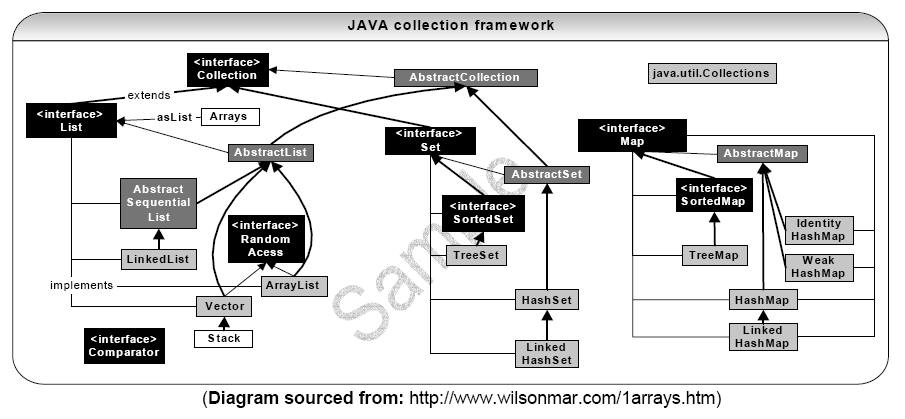
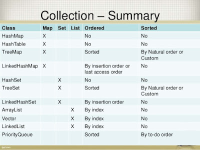
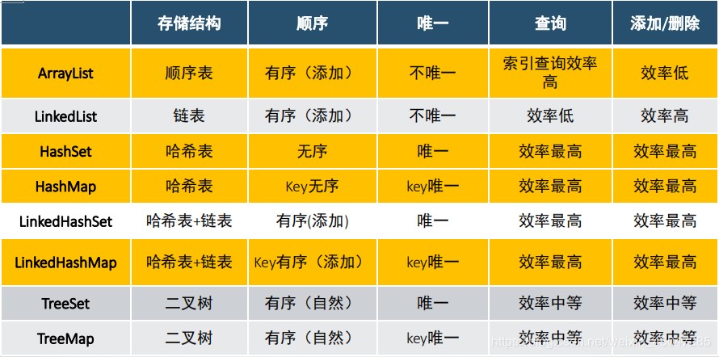
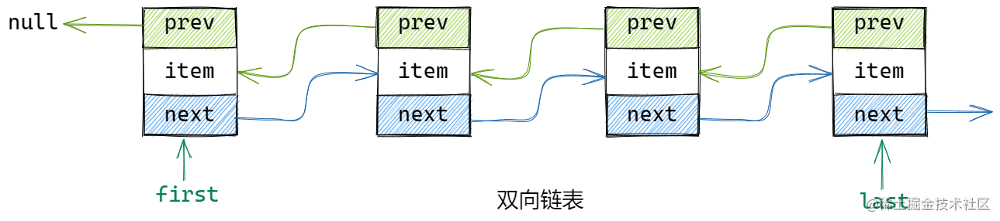
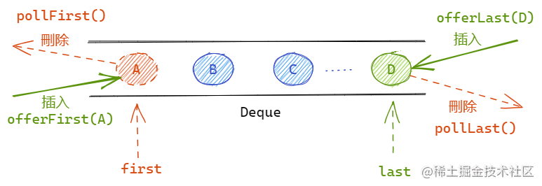
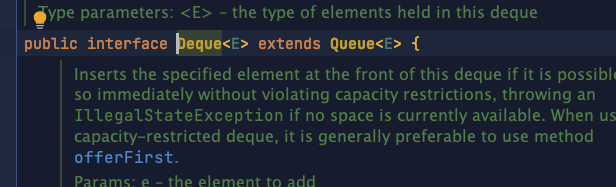
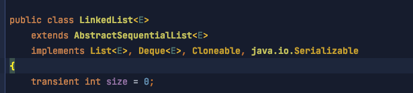

# 集合&容器

## 总览







### 集合 Collection 派系介绍

#### List 派系

1.  有序 (存、取的顺序相同-怎么存,怎么取）

2.  有索引（可以通过索引精准操作数据）

3.  允许存储重复元素

*   **ArrayList**

    *   底层数据结构是:一个长度可变的数组（数组本身长度不可变）, 初始化的长度是 10(可变原理: 通过对数组的复制进行扩容,扩容增长率: 50%)。

    *   线程不安全, 运行速度快

    *   查询速度快, 增删速度慢

*   **LinkedList**

    *   底层数据结构: 链表结构（采用对象之间的地址记录位置）

    *   线程不安全, 运行速度快

    *   查询速度慢, 增删速度快

*   **Vector**（ Vector 被 ArrayList 取代）

    *   底层数据结构是一个长度可变的数组（和ArrayList一样，不同的是扩容增长率: 100%）。

    *   线程安全, 运行速度慢

    *   查询速度快, 增删速度慢

#### Set 派系

1.  无序 （存、取顺序可能不一样）

2.  无索引

3.  不允许存储重复元素

*   **HashSet**（无序）

    *   单重链接列表

    *   底层数据结构：哈希表（实际上是一个HashMap实例, 根据底层源码可得: 底层是一个HashMap ）

    *   线程不安全、运行速度快

        *   **LinkedHashSet**（有序）

            *   LinkedHashSet始于JDK1.4，Set始于JDK1.2

            *   双重链接列表, 底层基于链表的哈希表实现

            *   具有可预知迭代顺序（存、取顺序一致）

            *   线程不安全, 运行速度快，存取速度快

*   **TreeSet**（有序且唯一）

    *   底层数据结构基于: 红黑树

    *   可以对存储的元素进行排序

    *   线程不安全, 运行速度快

### 集合 Map 派系

1.  采用了 Key-value键值对映射的方式进行存储。

2.  key是无序、唯一的，value是无序不唯一的。

*   **HashMap**（无序）

    *   底层数据结构：哈希表

    *   线程不安全，运行速度快，存取速度快

    *   允许 存储'null'值、'null'键

        *   LinkedHashMap

            *   底层数据结构：哈希表

            *   键有迭代顺序（存、取顺序一致）

            *   线程不安全，运行速度快

*   **TreeMap**（有序）

    *   底层结构：红黑树（可以按照对象的自然顺序进行排序）

    *   键(对象)：必须要有自然顺序，或采用比较器（作为键必须要有自然顺序或者使用了比较器，否则会报错）

    *   线程不安全，运行速度快

*   **HashTable**（ 无序，HashTable 被 HashMap 取代）

    *   底层数据结构：哈希表

    *   键(对象)：必须重写方法：hashCode()、equals()

    *   不允许存'null'（ 键、值 都不允许为'null', 若存'null',编译时期不报错,运行时期会抛出空指针异常 ）

    *   线程安全，运行速度慢

        *   **Properties**（无序）

            *   底层数据结构：哈希表

            *   不允许重复键

            *   存、取顺序不确定（无序）

            *   线程安全，运行速度慢

## ArrayList

*   采用数组的方式来存储对象

*   非线程安全

*   每次按照1.5倍（位运算）的比率通过copeOf的方式扩容

*   初始数组容量为10

### shuffle 方法

## LinkedList

*   基于双向链表机制实现

*   非线程安全的

*   有序（按插入顺序）

### 数据结构

`LinkedList`其实是由一个**双向链表**构成，并通过`first`和`last`分别表示链表的首尾节点。



offer方法插入元素的实现逻辑

```bash
public class LinkedList<E> .....{
  /**
   * 插入元素
   */
  public boolean offer(E e) {
    // 此处直接调用了add方法
    return add(e);
  }
  /**
   * 插入元素
   */
  public boolean add(E e) {
    // 调用linkLast方法
    linkLast(e);
    return true;
  }
  /**
   * 在链表尾部，添加一个新元素，并作为新的last节点
   */
  void linkLast(E e) {
    // 当前last节点
    final Node<E> l = last;
    // 创建新节点，prev节点指向当前last节点
    final Node<E> newNode = new Node<>(l, e, null);
    // 新节点作为新的last节点
    last = newNode;
    if (l == null)
      // 如果原last节点为null，表示该链表为空，则将节点同时作为first节点
      first = newNode;
    else
      // 链表不为空，则将新节点，作为原last节点的next节点
      l.next = newNode;
    // 元素数量+1
    size++;
    // 集合修改次数+1
    modCount++;
  }
}
```

## Queue -队列

### 方法

| 方法                   | 说明                                                           |
| -------------------- | ------------------------------------------------------------ |
| `boolean add(E e)`   | 向队列中添加一个元素；如果有空间则添加成功返回true，否则则抛出`IllegalStateException`异常   |
| `boolean offer(E e)` | 向队列中添加一个元素；如果有空间则添加成功返回true，否则返回false                        |
| `E remove()`         | 从队列中删除一个元素；如果元素存在则返回队首元素，否则抛出`NoSuchElementException`异常      |
| `E poll();`          | 从队列中删除一个元素；如果元素存在则返回队首元素，否则返回null                            |
| `E element()`        | 从队列获取一个元素，但是不删除；如果元素存在则返回队首元素，否则抛出`NoSuchElementException`异常 |
| `E peek()`           | 从队列获取一个元素，但是不删除；如果元素存在则返回队首元素，否则返回null                       |

|           | throw Exception | 返回false或null       |
| --------- | --------------- | ------------------ |
| 添加元素到队尾   | add(E e)        | boolean offer(E e) |
| 取队首元素并删除  | E remove()      | E poll()           |
| 取队首元素但不删除 | E element()     | E peek()           |

Queue的实现其实是**非线程安全**的，如果在多线程环境下进行Queue的入队和出队操作，会产生不一致的情况。所以Java也提供了线程安全的队列类——阻塞队列`BlockingQueue`

## Deque -双端队列

双端队列就是可以支持在队首或者队尾，都可以进行元素的插入和删除操作的队列，如下图所示。在双端队列中，分别使用`first`和`last`表示队列的首、尾两端，而在插入或删除元素时，可以通过指定在队列的哪一端进行操作。



**LinkedList** 实现了 队列和双端队列&#x20;





## HashMap

[HashMap](HashMap/HashMap.md "HashMap")

## LinkedHashMap

LinkedHashMap是HashMap的一个子类，保存了记录的插入顺序。

默认按插入顺序排序，也可以在构造时带参数，按照访问次序排序

插入顺序举例：

```java
 LinkedHashMap<Integer, Integer> linkedHashMap = new LinkedHashMap<>();

        linkedHashMap.put(1,1);
        linkedHashMap.put(2,1);
        linkedHashMap.put(3,1);

        linkedHashMap.forEach((k,v)-> System.out.println(k+" "+v));

// 打印 1 2 3         
```

访问顺序举例：

```java
 LinkedHashMap<Integer, Integer> linkedHashMap2 = new LinkedHashMap(16,0.75F,true);

        linkedHashMap2.put(1,1);
        linkedHashMap2.put(2,1);
        linkedHashMap2.put(3,1);
        linkedHashMap2.get(1);
        linkedHashMap2.forEach((k,v)-> System.out.println(k+" "+v));

 //打印 2 3 1       
```

借助 LinkedHashMap 可以很方便的实现一个 LRU 缓存数据结构，只需设置 accessOrder 为 true，并覆盖 removeEldestEntry 方法即可。

```java
final int MAX_CACHE_SIZE = 100;
LinkedHashMap<Object, Object> lru = new LinkedHashMap<Object, Object>(MAX_CACHE_SIZE, 0.75f, true) {
    private static final long serialVersionUID = 1L;
    protected boolean removeEldestEntry(Map.Entry<Object, Object> eldest) {
      return size() > MAX_CACHE_SIZE;
    }
}; 
```

## 参考

*   [https://www.cnblogs.com/io1024/p/11532696.html](https://www.cnblogs.com/io1024/p/11532696.html "https://www.cnblogs.com/io1024/p/11532696.html")

[HashMap](HashMap/HashMap.md "HashMap")

[Collections](Collections/Collections.md "Collections")
