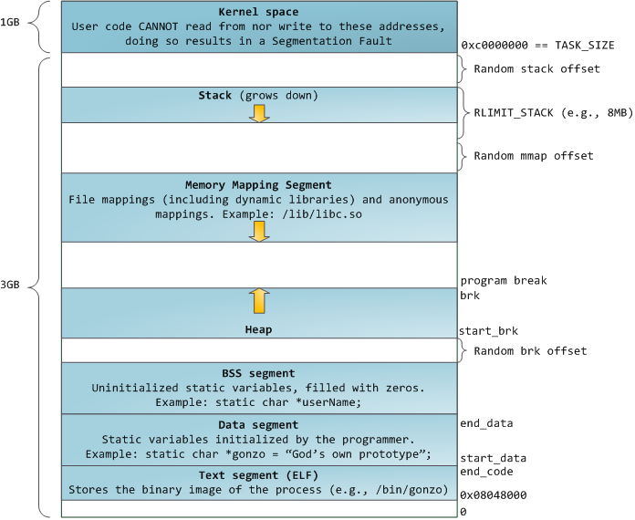
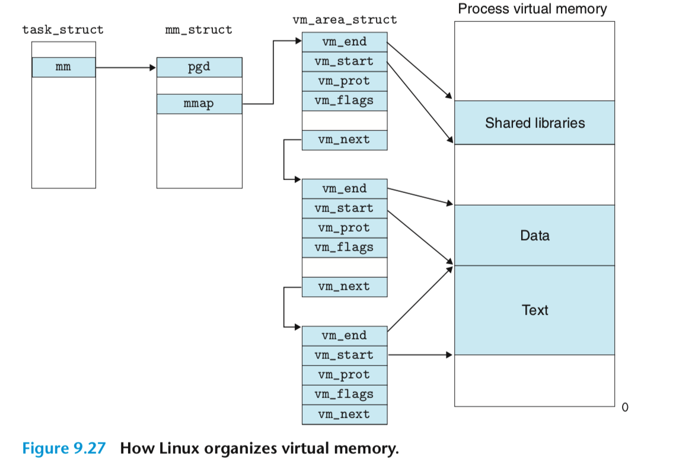
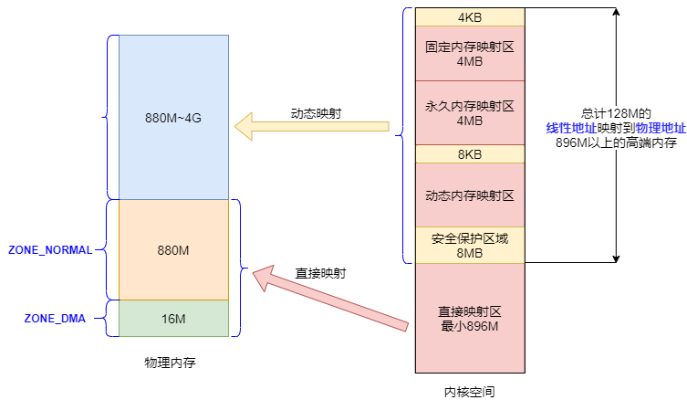
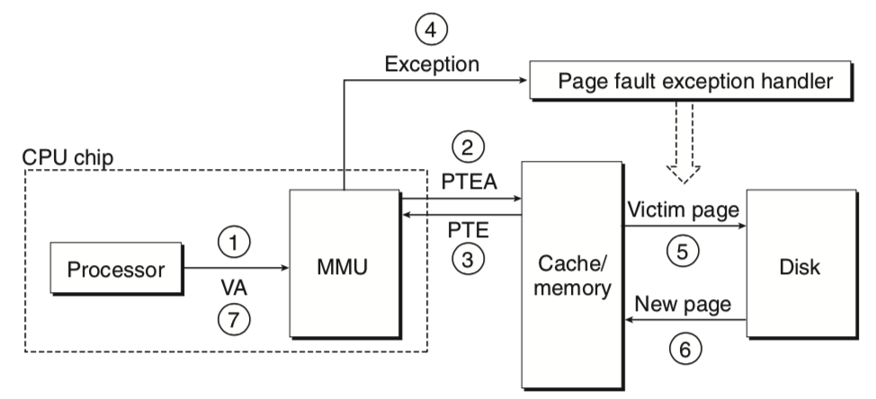
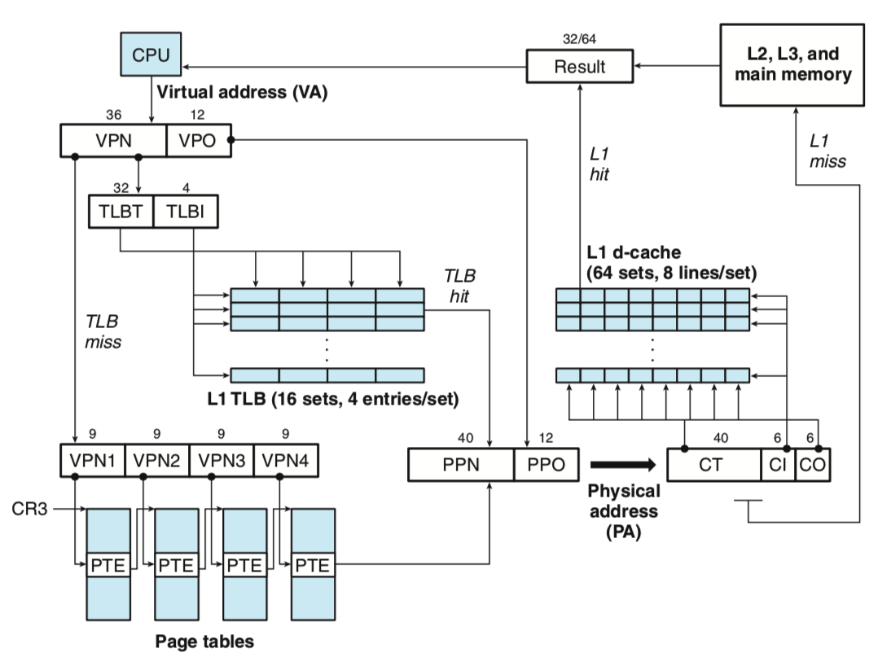
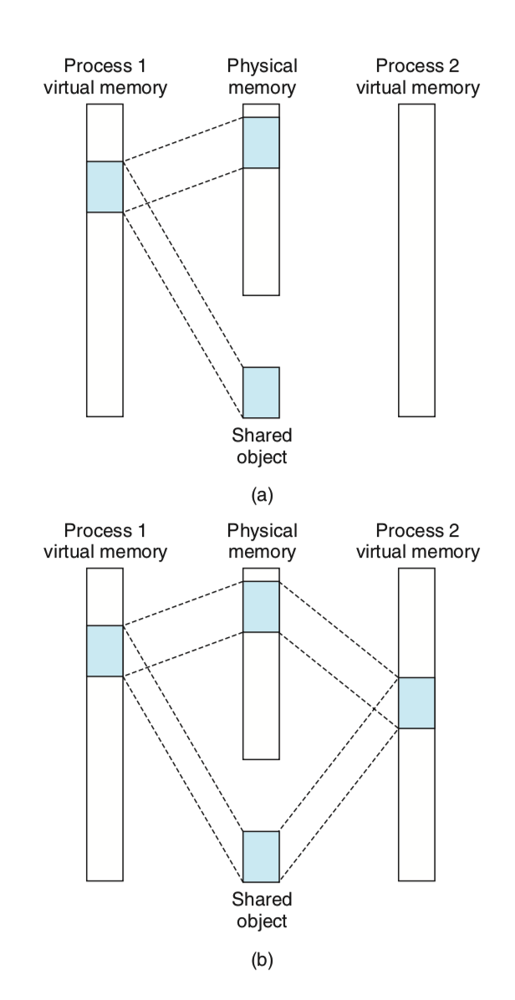
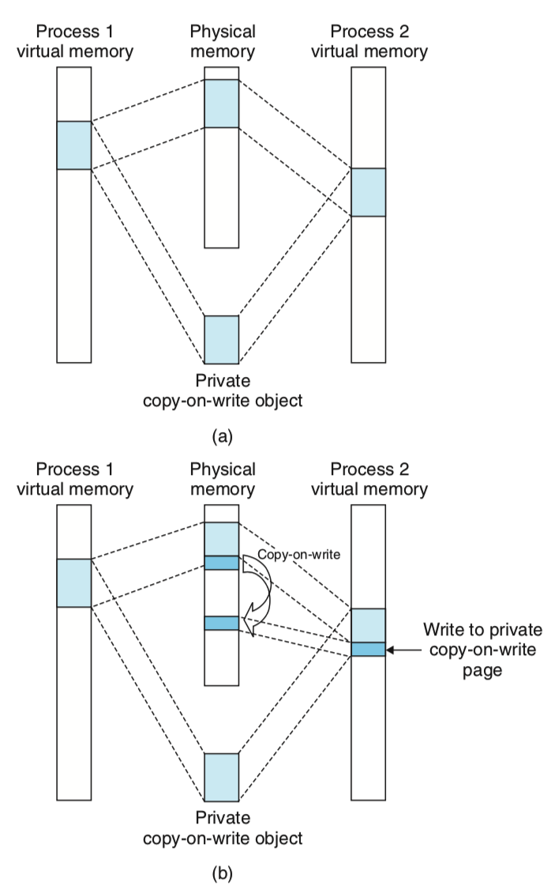
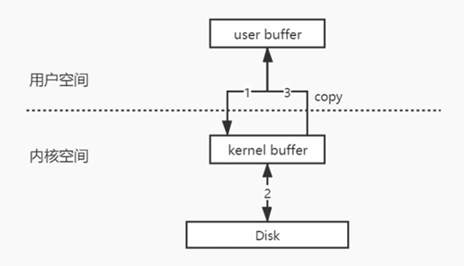
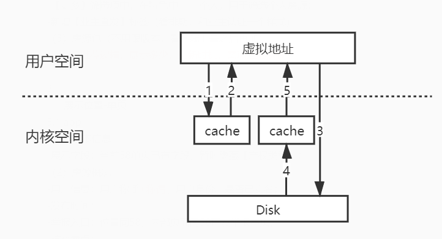

# Linux 内存管理&#x20;

## Linux 内存总览


## Linux 内存管理&#x20;

### 用户态地址空间划分

为了充分利用和管理系统内存资源，Linux采用`虚拟内存`管理技术, 在现代计算机系统中对物理内存做了一层抽象。

它为每一个进程都提供一块连续的私有地址空间，在32位模式下，每一块虚拟地址空间大小为4GB。&#x20;

Linux采用虚拟内存管理技术，利用虚拟内存技术让每个进程都有`4GB` 互不干涉的虚拟地址空间。

进程初始化分配和操作的都是基于这个「虚拟地址」，只有当进程需要实际访问内存资源的时候才会建立虚拟地址和物理地址的映射，调入物理内存页。

> 这个原理其实和现在的某某网盘一样。假如你的网盘空间是`1TB`，真以为就一口气给了你这么大空间吗？都是在你往里面放东西的时候才给你分配空间，你放多少就分多少实际空间给你，但你看起来就像拥有`1TB`空间一样。

进程（执行的程序）占用的**用户空间**按照 `访问属性一致的地址空间存放在一起` 的原则，划分成 `5`个不同的内存区域。访问属性指的是“可读、可写、可执行等。

*   代码段

    代码段是用来存放可执行文件的操作指令，可执行程序在内存中的镜像。代码段需要防止在运行时被非法修改，所以只准许读取操作，它是不可写的。

*   数据段

    数据段用来存放可执行文件中已初始化全局变量，换句话说就是存放程序静态分配的变量和全局变量。

*   BSS段

    `BSS`段包含了程序中未初始化的全局变量，在内存中 `bss` 段全部置零。

*   堆 `heap`

    堆是用于存放进程运行中被动态分配的内存段，它的大小并不固定，可动态扩张或缩减。当进程调用malloc等函数分配内存时，新分配的内存就被动态添加到堆上（堆被扩张）；当利用free等函数释放内存时，被释放的内存从堆中被剔除（堆被缩减）

*   栈 `stack`

    栈是用户存放程序临时创建的局部变量，也就是函数中定义的变量（但不包括 `static` 声明的变量，static意味着在数据段中存放变量）。除此以外，在函数被调用时，其参数也会被压入发起调用的进程栈中，并且待到调用结束后，函数的返回值也会被存放回栈中。由于栈的先进先出特点，所以栈特别方便用来保存/恢复调用现场。从这个意义上讲，我们可以把堆栈看成一个寄存、交换临时数据的内存区。



可以在linux下用`size` 命令查看编译后程序的各个内存区域大小：

```bash
# size /usr/local/sbin/sshd
   text     data      bss      dec      hex  filename
1924532    12412   426896  2363840   2411c0  /usr/local/sbin/sshd
```

**用户空间内存数据结构**



### 内核地址空间划分

在 `x86 32` 位系统里，Linux 内核地址空间是指虚拟地址从 `0xC0000000` 开始到 `0xFFFFFFFF` 为止的高端内存地址空间，总计 `1G` 的容量， 包括了内核镜像、物理页面表、驱动程序等运行在内核空间



#### 直接映射区

直接映射区 `Direct Memory Region`：从内核空间起始地址开始，最大`896M`的内核空间地址区间，为直接内存映射区。

直接映射区的896MB的「线性地址」直接与「物理地址」的前`896MB`进行映射，也就是说线性地址和分配的物理地址都是连续的。内核地址空间的线性地址`0xC0000001`所对应的物理地址为`0x00000001`，它们之间相差一个偏移量`PAGE_OFFSET = 0xC0000000`

该区域的线性地址和物理地址存在线性转换关系「线性地址 = `PAGE_OFFSET` + 物理地址」也可以用 `virt_to_phys()`函数将内核虚拟空间中的线性地址转化为物理地址。

#### 高端内存线性地址空间

内核空间线性地址\*\*从 896M 到 1G \*\*的区间，容量 128MB 的地址区间是高端内存线性地址空间，为什么叫高端内存线性地址空间？下面给你解释一下：

前面已经说过，内核空间的总大小 1GB，从内核空间起始地址开始的 896MB 的线性地址可以直接映射到物理地址大小为 896MB 的地址区间。

退一万步，即使内核空间的1GB线性地址都映射到物理地址，那也最多只能寻址 1GB 大小的物理内存地址范围。

内核空间拿出了最后的 128M 地址区间，划分成下面三个高端内存映射区，以达到对整个物理地址范围的寻址。而在 64 位的系统上就不存在这样的问题了，因为可用的线性地址空间远大于可安装的内存。

#### 动态内存映射区

`vmalloc Region` 该区域由内核函数`vmalloc`来分配，特点是：线性空间连续，但是对应的物理地址空间不一定连续。`vmalloc` 分配的线性地址所对应的物理页可能处于低端内存，也可能处于高端内存。

#### 永久内存映射区

`Persistent Kernel Mapping Region` 该区域可访问高端内存。访问方法是使用 `alloc_page (_GFP_HIGHMEM)` 分配高端内存页或者使用`kmap`函数将分配到的高端内存映射到该区域。

#### 固定映射区

`Fixing kernel Mapping Region` 该区域和 4G 的顶端只有 4k 的隔离带，其每个地址项都服务于特定的用途，如 `ACPI_BASE` 等。

### 虚拟地址的好处

*   避免用户直接访问物理内存地址，防止一些破坏性操作，保护操作系统

*   每个进程都被分配了4GB的虚拟内存，用户程序可使用比实际物理内存更大的地址空间

### 系统处理流程

系统将虚拟内存分割成一块块固定大小的虚拟页（Virtual Page），同样的，物理内存也会被分割成物理页（Physical Page），当进程访问内存时，CPU通过内存管理单元（MMU）根据页表（Page Table）将虚拟地址翻译成物理地址，最终取到内存数据。这样在每个进程内部都像是独享整个主存。



&#x20;当CPU拿到一个虚拟地址希望访存的时候，将其分为虚拟页框号和便宜两个部分，先拿着虚拟页框号查TLB，TLB命中就直接将物理页框号和偏移拼接起来得到物理地址。在拿着物理地址进行访存。访存的时候也是先看缓存汇总是否有，没有的话再访问下一级存储器。如果TLB没有命中的话，就利用`CR3`寄存器(存储当前进程的一级页表基址)逐级地查页表。



**当初始化一个进程的时候，Linux系统通过将虚拟地址空间和一个磁盘上的对象相关联来初始化这个进程的虚拟地址空间，这个过程称之为内存映射。**

可执行文件存储在磁盘中，其中有虚拟内存中的各个段的数据，比如代码段，数据段等。比如代码段，它在程序执行的过程中应该是不变的，而且在内存中的样子和在磁盘中是一样的，

**所以是如何加载到内存中的呢。**

Linux将内存的不同区域映射成下面两种磁盘文件中的一种：

1.  Linux文件系统的常规文件。比如可执行文件。文件的某一部分被划分为页大小的快，每一块包含一个虚拟地址页的初始内容。当某一块不足一页的时候，用零进行填充。但是操作系统并不会在一开始就将所有的内容真的放到内存中，而是CPU第一次访问发生了缺页的时候，才由缺页中断将这一页调入物理内存。（**当进程在申请的内存的时候，linux内核其实只分配一块虚拟内存地址，并没有分配实际的物理内存，相当于操作系统只给进程这一块地址的使用权。只有当程序真正使用这块内存时，会产生一个缺页异常，这时内核去真正为进程分配物理页，并建立对应的页表，从而将虚拟内存和物理内存建立一个映射关系，这样可以做到充分利用到物理内存。**）

2.  匿名文件。虚拟内存的一片区域也可以映射到由内核创建的一个匿名文件，如堆栈部分和未初始化的全局变量，在可实行文件中并没有实体，这些会映射到匿名文件。当CPU访问这些区域的时候，内核找到一个物理页，将它清空，然后更新进程的页表。这个过程没有发生磁盘到主存中间的数据交互。但是需要注意，在`C++`堆申请的内存不一定都是0，因为`C++`内部实现了堆内存管理，可能申请的内存并不是操作系统新分配的，而是之前分配了返回了，但是被`C++`内存管理部分保留了，这次申请又直接返回给了用户。

在上面两种情况下，**虚拟页被初始化之后，它会在交换空间和主存中进行换入换出。交换空间的大小限制了当前正在运行的进程的虚拟页的最大数量。交换空间的大小可以在安装操作系统的时候进行设置。**

### 内存映射与进程间共享对象(CopyOnWrite)

不同的进程可以共享对象。比如代码段是只读的，运行同一个可执行文件的进程可以共享虚拟内存的代码段，这样可以节省物理内存。还有进程间通信的共享内存机制。这些都可以在虚拟内存映射这个层次来实现。可以将不同进程的虚拟页映射到同一个物理页框，从而实现不同进程之间的内存共享。



同时为了节省物理内存，可以使用`copy-on-write`技术，来实现进程私有的地址空间共享。初始时刻让多个进程共享一个物理内存页，然后当有某一个进程对这个页进行写的时候，出发`copy-on-write`机制，将这个物理页进行复制，这样就实现了私有化。



## Linux 内存分配


### Buddy（伙伴）分配算法

`Linux` 内核引入了伙伴系统算法（Buddy system），什么意思呢？就是把相同大小的页框块用链表串起来，页框块就像手拉手的好伙伴，也是这个算法名字的由来。

具体的，所有的空闲页框分组为11个块链表，每个块链表分别包含大小为1，2，4，8，16，32，64，128，256，512和1024个连续页框的页框块。最大可以申请1024个连续页框，对应4MB大小的连续内存。


因为任何正整数都可以由 `2^n` 的和组成，所以总能找到合适大小的内存块分配出去，**减少了外部碎片产生** 。

> 外部碎片指的是还没有被分配出去（不属于任何进程），但由于太小了无法分配给申请内存空间的新进程的内存空闲区域。

### slab分配器

看到这里你可能会想，有了伙伴系统这下总可以管理好物理内存了吧？不，还不够，否则就没有slab分配器什么事了。

那什么是slab分配器呢？

一般来说，内核对象的生命周期是这样的：分配内存-初始化-释放内存，内核中有大量的小对象，比如文件描述结构对象、任务描述结构对象，如果按照伙伴系统按页分配和释放内存，对小对象频繁的执行「分配内存-初始化-释放内存」会非常消耗性能。

伙伴系统分配出去的内存还是以页框为单位，而对于内核的很多场景都是分配小片内存，远用不到一页内存大小的空间。`slab`分配器，**「通过将内存按使用对象不同再划分成不同大小的空间」，应用于内核对象的缓存**。

伙伴系统和slab不是二选一的关系，`slab` 内存分配器是对伙伴分配算法的补充。


### mmap（memory map）

mmap是POSIX规范接口中用来处理内存映射的一个系统调用，它本身的使用场景非常多：

*   可以用来申请大块内存

*   可以用来申请共享内存

*   也可以将文件或设备直接映射到内存中

进程可以像访问普通内存一样访问被映射的文件，在实际开发过程使用场景非常多

在LINUX中我们可以使用mmap用来在进程虚拟内存地址空间中分配地址空间，创建和物理内存的映射关系。

mmap是将一个文件直接映射到进程的地址空间，进程可以像操作内存一样去读写磁盘上的文件内容，而不需要再调用read/write等系统调用。

```c
int main(int argc, char **argv)  
{  
    char *filename = "/tmp/foo.data";  
    struct stat stat;  
    int fd = open(filename, O_RDWR, 0);  
    fstat(fd, &stat);  
    void *bufp = mmap(NULL, stat.st_size, PROT_READ | PROT_WRITE, MAP_SHARED, fd, 0);  
    memcpy(bufp, "Linuxdd", 7); 
    munmap(bufp, stat.st_size); 
    close(fd);
    return 0;  
}  
```

在mmap之后，并没有在将文件内容加载到物理页上，只上在虚拟内存中分配了地址空间。当进程在访问这段地址时，通过查找页表，发现虚拟内存对应的页没有在物理内存中缓存，则产生"缺页"，由内核的缺页异常处理程序处理，将文件对应内容，以页为单位(4096)加载到物理内存，注意是只加载缺页，但也会受操作系统一些调度策略影响，加载的比所需的多。

**所处空间**

一个进程的虚拟空间有多个部分组成，**mmap**的文件所处的内存空间在内存映射段中。

**mmap和read/write的区别**

read的系统调用的流程大概如下图所示：



a) 用户进程发起read操作； &#x20;
b) 内核会做一些基本的page cache判断，从磁盘中读取数据到kernel buffer中； &#x20;
c) 然后内核将buffer的数据再拷贝至用户态的user buffer； &#x20;
d) 唤醒用户进程继续执行；

**而mmap的流程如下图所示**



内核直接将内存暴露给用户态，用户态对内存的修改也直接反映到内核态，少了一次的内核态至用户态的内存拷贝，速度上会有一定的提升

mmap的优点有很多，相比传统的read/write等I/O方式，直接将虚拟地址的区域映射到文件，没有任何数据拷贝的操作，当发现有缺页时，通过映射关系将磁盘的数据加载到内存，用户态程序直接可见，提高了文件读取的效率。对索引数据这种大文件的读取、cache、换页等操作直接交由操作系统去调度，间接减少了用户程序的复杂度，并提高了运行效率。

**优缺点**

**优点如下：**

1.  对文件的读取操作跨过了页缓存，减少了数据的拷贝次数，用内存读写取代I/O读写，提高了文件读取效率。

2.  实现了用户空间和内核空间的高效交互方式。两空间的各自修改操作可以直接反映在映射的区域内，从而被对方空间及时捕捉。

3.  提供进程间共享内存及相互通信的方式。不管是父子进程还是无亲缘关系的进程，都可以将自身用户空间映射到同一个文件或匿名映射到同一片区域。从而通过各自对映射区域的改动，达到进程间通信和进程间共享的目的。同时，如果进程A和进程B都映射了区域C，当A第一次读取C时通过缺页从磁盘复制文件页到内存中；但当B再读C的相同页面时，虽然也会产生缺页异常，但是不再需要从磁盘中复制文件过来，而可直接使用已经保存在内存中的文件数据。

4.  可用于实现高效的大规模数据传输。内存空间不足，是制约大数据操作的一个方面，解决方案往往是借助硬盘空间协助操作，补充内存的不足。但是进一步会造成大量的文件I/O操作，极大影响效率。这个问题可以通过mmap映射很好的解决。换句话说，但凡是需要用磁盘空间代替内存的时候，mmap都可以发挥其功效。

**缺点如下:**

1.  文件如果很小，是小于4096字节的，比如10字节，由于内存的最小粒度是页，而进程虚拟地址空间和内存的映射也是以页为单位。虽然被映射的文件只有10字节，但是对应到进程虚拟地址区域的大小需要满足整页大小，因此mmap函数执行后，实际映射到虚拟内存区域的是4096个字节，11\~4096的字节部分用零填充。因此如果连续mmap小文件，会浪费内存空间。

2.  对变长文件不适合，文件无法完成拓展，因为mmap到内存的时候，你所能够操作的范围就确定了。

3.  如果更新文件的操作很多，会触发大量的脏页回写及由此引发的随机IO上。所以在随机写很多的情况下，mmap方式在效率上不一定会比带缓冲区的一般写快

## 参考：

*   [https://maben.me/2020/04/21/mmap-implementation/](https://maben.me/2020/04/21/mmap-implementation/ "https://maben.me/2020/04/21/mmap-implementation/")

*   [https://mp.weixin.qq.com/s/bKq-b9Ga2IA2nbhi9weZtw](https://mp.weixin.qq.com/s/bKq-b9Ga2IA2nbhi9weZtw "https://mp.weixin.qq.com/s/bKq-b9Ga2IA2nbhi9weZtw")

*   [https://wangdh15.github.io/2020/12/08/虚拟内存总结/](https://wangdh15.github.io/2020/12/08/虚拟内存总结/ "https://wangdh15.github.io/2020/12/08/虚拟内存总结/")

*   [https://spongecaptain.cool/SimpleClearFileIO/3. mmap.html](<https://spongecaptain.cool/SimpleClearFileIO/3. mmap.html> "https://spongecaptain.cool/SimpleClearFileIO/3. mmap.html")

*   [https://mp.weixin.qq.com/s/pYwDIbu4mlEBv7iO\_QUJ5A](https://mp.weixin.qq.com/s/pYwDIbu4mlEBv7iO_QUJ5A "https://mp.weixin.qq.com/s/pYwDIbu4mlEBv7iO_QUJ5A")

*   &#x20;[https://mp.weixin.qq.com/s?\_\_biz=MzAxODI5ODMwOA==\&mid=2666545689\&idx=1\&sn=c9216fab07323d42d9cfc700299eece6\&chksm=80dc86b2b7ab0fa4eaa4036cc08f1683bf596d6b438f057418297a8bbb840dfa3610a2892d9f\&scene=21#wechat\_redirect](https://mp.weixin.qq.com/s?__biz=MzAxODI5ODMwOA==\&mid=2666545689\&idx=1\&sn=c9216fab07323d42d9cfc700299eece6\&chksm=80dc86b2b7ab0fa4eaa4036cc08f1683bf596d6b438f057418297a8bbb840dfa3610a2892d9f\&scene=21#wechat_redirect "https://mp.weixin.qq.com/s?__biz=MzAxODI5ODMwOA==\&mid=2666545689\&idx=1\&sn=c9216fab07323d42d9cfc700299eece6\&chksm=80dc86b2b7ab0fa4eaa4036cc08f1683bf596d6b438f057418297a8bbb840dfa3610a2892d9f\&scene=21#wechat_redirect")

[零拷贝](零拷贝/零拷贝.md "零拷贝")

[页缓存（page cache）](<页缓存（page cache）/页缓存（page cache）.md> "页缓存（page cache）")
