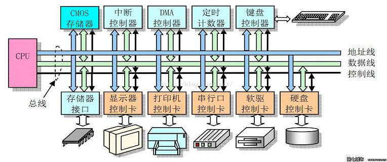
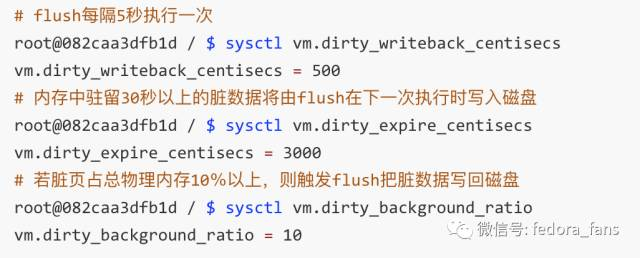

# 页缓存（page cache）

## 概述

页缓存（PageCache）是操作系统对文件的缓存，用来减少对磁盘的 I/O 操作，以页为单位的，内容就是磁盘上的物理块，页缓存能帮助程序对文件进行顺序读写的速度几乎接近于内存的读写速度，主要原因就是由于 OS 使用 PageCache 机制对读写访问操作进行了性能优化。

下图近似地表示出 32-bit Linux 系统中可能的一种 Page Cache 结构，其中 block size 大小为 1KB，page size 大小为 4KB。

Page Cache 中的每个文件都是一棵基数树（radix tree，本质上是多叉搜索树），树的每个节点都是一个页。根据文件内的偏移量就可以快速定位到所在的页，如下图所示：

## Page Cache 策略

**页缓存读取策略**：当进程发起一个读操作 （比如，进程发起一个 read() 系统调用），它首先会检查需要的数据是否在页缓存中：

*   **如果在**，则放弃访问磁盘，而直接从页缓存中读取。

*   **如果不在**，则内核调度块 I/O 操作从磁盘去读取数据，并读入紧随其后的少数几个页面（不少于一个页面，通常是三个页面），然后将数据放入页缓存中。

**页缓存写策略**：当进程发起 write 系统调用写数据到文件中，先写到页缓存，然后方法返回。此时数据还没有真正的保存到文件中去，Linux 仅仅将页缓存中的这一页数据标记为 “脏”，并且被加入到脏页链表中。

然后，由 flusher 回写线程周期性将脏页链表中的页写到磁盘，让磁盘中的数据和内存中保持一致，最后清理“脏”标识。在以下三种情况下，脏页会被写回磁盘：

1.  空闲内存低于一个特定阈值。

2.  脏页在内存中驻留超过一个特定的阈值时。

3.  当用户进程调用 sync() 和 fsync() 系统调用时。

## Page Cache  和其他 io机制的关系

**红色部分为 Page Cache。可见 Page Cache 的本质是由 Linux 内核管理的内存区域。我们通过 mmap 以及 buffered I/O 将文件读取到内存空间实际上都是读取到 Page Cache 中。**

**传统的 Buffered IO** 使用 read 读取文件的过程什么样的？假设要去读一个冷文件（Cache 中不存在），open 打开文件内核后建立了一系列的数据结构，接下来调用 read，到达文件系统这一层，发现 **Page Cache** 中不存在该位置的磁盘映射，然后创建相应的 Page Cache 并和相关的扇区关联。然后请求继续到达块设备层，在 IO 队列里排队，接受一系列的调度后到达设备驱动层，此时一般使用 **DMA** 方式读取相应的磁盘扇区到 Cache 中，然后 read 拷贝数据到用户提供的**用户态 buffer** 中去（read 的参数指出的）。 &#x20;

**整个过程有几次拷贝？** 从磁盘到 Page Cache 算第一次的话，从 Page Cache 到用户态 buffer 就是第二次了。而 mmap 做了什么？mmap 直接把 Page Cache 映射到了用户态的地址空间里了，所以 mmap 的方式读文件是没有第二次拷贝过程的。

**那 Direct IO 做了什么**？这个机制更狠，直接让用户态和块 IO 层对接，直接放弃 Page Cache，从磁盘直接和用户态拷贝数据。好处是什么？写操作直接映射进程的buffer到磁盘扇区，以 DMA 的方式传输数据，减少了原本需要到 Page Cache 层的一次拷贝，提升了写的效率。对于读而言，第一次肯定也是快于传统的方式的，但是之后的读就不如传统方式了（当然也可以在用户态自己做 Cache，有些商用数据库就是这么做的）。

## Page Cache 的劣势

page cache 也有其劣势，最直接的缺点是需要占用额外物理内存空间，物理内存在比较紧俏的时候可能会导致频繁的 swap 操作，最终导致系统的磁盘 I/O 负载的上升。

Page Cache 的另一个缺陷是对于应用层并没有提供很好的管理 API，几乎是透明管理。应用层即使想优化 Page Cache 的使用策略也很难进行。因此一些应用选择在用户空间实现自己的 page 管理，例如 MySQL InnoDB 存储引擎以 16KB 的页进行管理。

Page Cache 最后一个缺陷是在某些应用场景下比 Direct I/O 多一次磁盘读 I/O 以及磁盘写 I/O。

### swap 交换空间

Swap 机制存在的本质原因是 Linux 系统提供了虚拟内存管理机制，每一个进程认为其独占内存空间，因此所有进程的内存空间之和远远大于物理内存。所有进程的内存空间之和超过物理内存的部分就需要交换到磁盘上。

操作系统以 page 为单位管理内存，当进程发现需要访问的数据不在内存时，操作系统可能会将数据以页的方式加载到内存中。上述过程被称为**缺页中断**，当操作系统发生缺页中断时，就会通过系统调用将 page 再次读到内存中。

但主内存的空间是有限的，当主内存中不包含可以使用的空间时，操作系统会从选择合适的物理内存页驱逐回磁盘，为新的内存页让出位置，**选择待驱逐页的过程在操作系统中叫做页面替换（Page Replacement）**，替换操作又会触发 swap 机制。

如果物理内存足够大，那么可能不需要 Swap 机制，但是 Swap 在这种情况下还是有一定优势：对于有发生内存泄漏几率的应用程序（进程），Swap 交换分区更是重要，这可以确保内存泄露不至于导致物理内存不够用，最终导致系统崩溃。但内存泄露会引起频繁的 swap，此时非常影响操作系统的性能。

## Page Cache 与文件持久化的一致性&可靠性

现代 Linux 的 Page Cache 正如其名，是对磁盘上 page（页）的内存缓存，同时可以用于读/写操作。一切内存缓存都存在一致性问题：内存中的数据与磁盘中的数据不一致，例如用作分布式中间件缓存的 Redis 就与 MySQL 等数据库中的数据存在不一致

我们考虑如下一致性问题：如果发生写操作并且对应的数据在 Page Cache 中，那么写操作就会直接作用于 Page Cache 中，此时如果数据还没刷新到磁盘，那么内存中的数据就领先于磁盘，此时对应 page 就被称为 Dirty page。

当前 Linux 下以两种方式实现文件一致性：

1.  **Write Through（写穿）**：向用户层提供特定接口，应用程序可主动调用接口来保证文件一致性；

2.  **Write back（写回）**：系统中存在定期任务（表现形式为内核线程），周期性地同步文件系统中文件脏数据块，这是默认的 Linux 一致性方案；

上述两种方式最终都依赖于系统调用，主要分为如下三种系统调用：

| 方法                    | 含义                                                                                                    |
| --------------------- | ----------------------------------------------------------------------------------------------------- |
| **fsync(intfd)**      | fsync(fd)：将 fd 代表的文件的脏数据和脏元数据全部刷新至磁盘中。                                                                |
| **fdatasync(int fd)** | fdatasync(fd)：将 fd 代表的文件的脏数据刷新至磁盘，同时对必要的元数据刷新至磁盘中，这里所说的必要的概念是指：对接下来访问文件有关键作用的信息，如文件大小，而文件修改时间等不属于必要信息 |
| **sync()**            | sync()：则是对系统中所有的脏的文件数据元数据刷新至磁盘中                                                                       |

## 参考

*   [https://mp.weixin.qq.com/s/pLZAI57gn9FdYprHFqs5FA](https://mp.weixin.qq.com/s/pLZAI57gn9FdYprHFqs5FA "https://mp.weixin.qq.com/s/pLZAI57gn9FdYprHFqs5FA")
