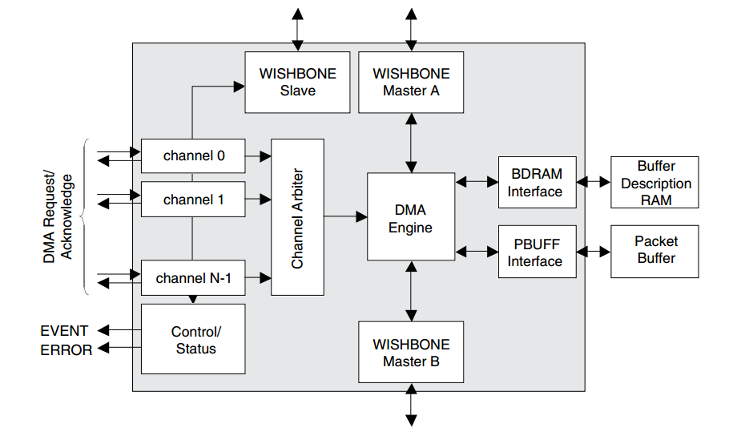

# 网络子系统

### DMA

DMA 的原意为 direct memory access，也就是直接内存访问(可以理解为读写)。

DMA 传 输实际上是 DMA 控制器将数据从一个设备拷贝到另一个设备的过程，**DMA 控制器的初始化需要 cpu 参与，但是数据传输过程是不需要 cpu 参与的**。

实际上 DMA 不只适用于有 内存参与下的数据传输，下表是 DMA 适用的数据传输场景

[ 命令工具](命令工具/命令工具.md " 命令工具")
