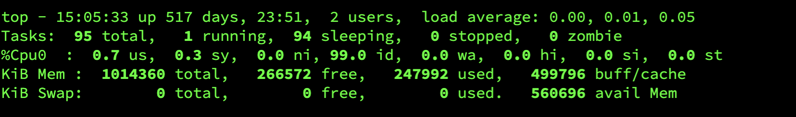
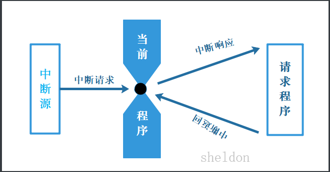
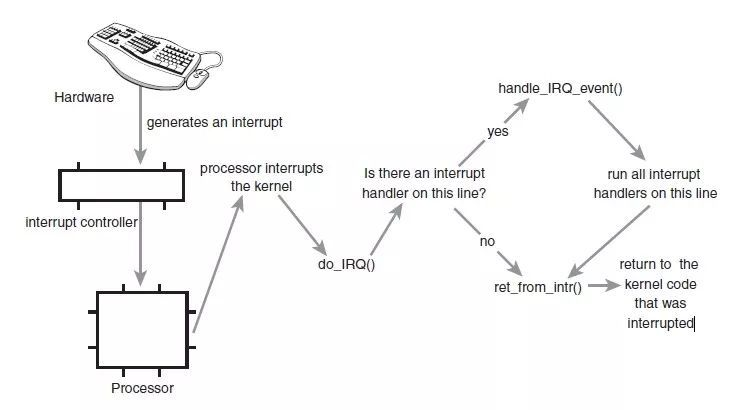
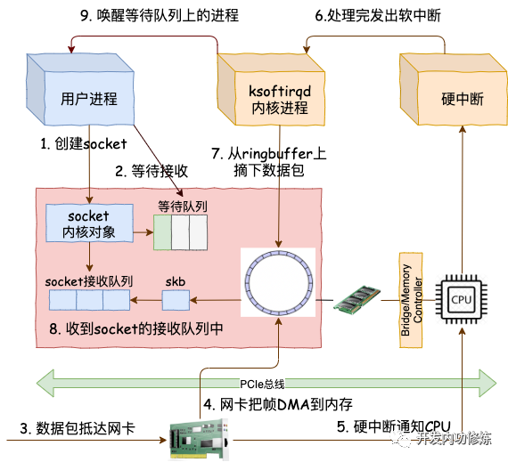

# top 命令

## CPU状态信息

&#x20;用 `top`  命令可以看到



主要看 `%Cpu0` 那行

### CPU 相关监控项

*   **us**: is meaning of "user CPU time" 用户空间占用CPU百分比

*   **sy**: is meaning of "system CPU time" 内核空间占用CPU百分比

*   **ni**: is meaning of" nice CPU time" 用户进程空间内改变过优先级的进程占用CPU百分比

*   **id**: is meaning of "idle" 空闲CPU百分比

*   **wa**: is meaning of "iowait"  等待输入输出的CPU时间百分比

*   **hi**：is meaning of "hardware irq" 硬件中断

*   **si** : is meaning of "software irq" 软件中断

*   \*\*st \*\*: is meaning of "steal time" ST为0表示流畅，CPU资源足够完全不需要等待，当数值增加时，表示服务器资源不够。

| 监控项名称              | 监控项含义           | 单位 | 说明                                           |
| ------------------ | --------------- | -- | -------------------------------------------- |
| Host.cpu.idle      | 当前空闲CPU百分比      | %  | 当前CPU处于空闲状态的百分比                              |
| Host.cpu.system    | 当前内核空间占用CPU百分比  | %  | 指系统上下文切换的消耗,该监控项数值比较高，说明服务器开了太多的进程或者线程       |
| Host.cpu.user      | 当前用户空间占用CPU百分比  | %  | 用户进程对CPU的消耗                                  |
| Host.cpu.iowait    | 当前等待IO操作的CPU百分比 | %  | 该项数值比较高说明有很频繁的IO操作                           |
| Host.cpu.other     | 其他占用CPU百分比      | %  | 其他消耗，计算方式为（Nice + SoftIrq + Irq + Stolen）的消耗 |
| Host.cpu.totalUsed | 当前消耗的总CPU百分比    | %  | 指以上各项CPU消耗的总和，通常用于报警                         |

### us

**用户空间占用CPU百分比**

用户 CPU 使用率，包括用户态 CPU使用率（user）和低优先级用户态 CPU使用率（nice），表示 CPU 在用户态运行的时间百分比

用户 CPU 使用率高，通常说明有应用程序比较繁忙。

### sy

**内核空间占用CPU百分比**

表示 CPU 在内核态运行时间百分比（不包括中断）。系统 CPU 使用率高，说明内核比较繁忙。

## 内存情况

| 物理内存     | 总内存           | 空闲内存         | 使用中的内存     | 用作内核缓存的内存         |
| -------- | ------------- | ------------ | ---------- | ----------------- |
| KiB Mem  | 2679236 total | 2465080 free | 99964 used | 114192 buff/cache |
|          |               |              |            |                   |
| 虚拟内存交换区  | 总交换区          | 空闲交换区        | 使用中的       | 缓冲的交换区总量          |
| KiB Swap | 262140 total, | 262140 free  | 0 used     | 2439240 avail Mem |

## 其他列

```bash
PID USER      PR  NI    VIRT    RES    SHR S  %CPU %MEM     TIME+ COMMAND
```

*   PID — 进程id

*   USER — 进程所有者

*   PR — 进程优先级

*   NI — nice值。负值表示高优先级，正值表示低优先级

*   VIRT — 进程使用的虚拟内存总量，单位kb。VIRT=SWAP+RES

*   RES — 进程使用的、未被换出的物理内存大小，单位kb。RES=CODE+DATA

*   SHR — 共享内存大小，单位kb

*   S — 进程状态。D=不可中断的睡眠状态 R=运行 S=睡眠 T=跟踪/停止 Z=僵尸进程

*   %CPU — 上次更新到现在的CPU时间占用百分比

*   %MEM — 进程使用的物理内存百分比

*   TIME+ — 进程占用的CPU时间总计，单位1/100秒

*   COMMAND — 进程名称（命令名/命令行）

| 列名      | 含义                                         |
| ------- | ------------------------------------------ |
| PID     | 进程id                                       |
| PPID    | 父进程id                                      |
| RUSER   | Real user name                             |
| UID     | 进程所有者的用户id                                 |
| USER    | 进程所有者的用户名                                  |
| GROUP   | 进程所有者的组名                                   |
| TTY     | 启动进程的终端名。不是从终端启动的进程则显示为 ?                  |
| PR      | 优先级                                        |
| NI      | nice值。负值表示高优先级，正值表示低优先级                    |
| P       | 最后使用的CPU，仅在多CPU环境下有意义                      |
| %CPU    | 上次更新到现在的CPU时间占用百分比                         |
| TIME    | 进程使用的CPU时间总计，单位秒                           |
| TIME+   | 进程使用的CPU时间总计，单位1/100秒                      |
| %MEM    | 进程使用的物理内存百分比                               |
| VIRT    | 进程使用的虚拟内存总量，单位kb。VIRT=SWAP+RES             |
| SWAP    | 进程使用的虚拟内存中，被换出的大小，单位kb。                    |
| RES     | 进程使用的、未被换出的物理内存大小，单位kb。RES=CODE+DATA       |
| CODE    | 可执行代码占用的物理内存大小，单位kb                        |
| DATA    | 可执行代码以外的部分(数据段+栈)占用的物理内存大小，单位kb            |
| SHR     | 共享内存大小，单位kb                                |
| nFLT    | 页面错误次数                                     |
| nDRT    | 最后一次写入到现在，被修改过的页面数。                        |
| S       | 进程状态： D=不可中断的睡眠状态，R=运行，S=睡眠，T=跟踪/停止，Z=僵尸进程 |
| COMMAND | 命令名/命令行                                    |
| WCHAN   | 若该进程在睡眠，则显示睡眠中的系统函数名                       |
| Flags   |                                            |

## 中断

从本质上来讲，中断是一种电信号，当设备有某种事件发生时，它就会产生中断，通过总线把电信号发送给中断控制器。

中断是指计算机运行过程中，出现某些意外情况需主机干预时，机器能自动停止正在运行的程序并转入处理新的程序，处理完毕后又返回原被暂停的程序继续运行。

**中断其实是一种异步的事件处理机制，可以提高系统的并发处理能力**。**为了减少对正常进程运行调度的影响，中断处理程序就需要尽可能快地运行**。

如果中断本身要做的事情不多，那么处理起来也不会有太大问题；但如果中断要处理的事情很多，中断服务程序就有可能要运行很长时间。
特别是，中断处理程序在响应中断时，还会临时关闭中断。这就会导致上一次中断处理完成之前，其他中断都不能响应，也就是说中断有可能会丢失。





事实上，为了解决中断处理程序执行过长和中断丢失的问题，Linux 将中断处理过程分成了两个阶段，也就是上半部和下半部：

*   上半部用来**快速处理中断**，它在中断禁止模式下运行，主要处理跟硬件紧密相关的或时间敏感的工作。

*   下半部用来**延迟处理**上半部未完成的工作，通常以内核线程的方式运行。

举个最常见的网卡接收数据包的例子，让你更好地理解。

> 网卡接收到数据包后，会通过硬件中断的方式，通知内核有新的数据到了。这时，内核就应该调用中断处理程序来响应它。你可以自己先想一下，这种情况下的上半部和下半部分别负责什么工作呢？
>
> 对上半部来说，既然是快速处理，其实就是要把网卡的数据读到内存中，然后更新一下硬件寄存器的状态（表示数据已经读好了），最后再发送一个软中断信号，通知下半部做进一步的处理。
> 而下半部被软中断信号唤醒后，需要从内存中找到网络数据，再按照网络协议栈，对数据进行逐层解析和处理，直到把它送给应用程序

所以，这两个阶段你也可以这样理解：

*   **上半部直接处理硬件请求，也就是我们常说的****硬中断****，特点是快速执行；**

*   **而下半部则是由内核触发，也就是我们常说的****软中断****，特点是延迟执行。**

实际上，上半部会打断 CPU 正在执行的任务，然后立即执行中断处理程序。

而下半部以内核线程的方式执行，并且每个 CPU 都对应一个软中断内核线程，名字为 “ksoftirqd/CPU 编号”，比如说， 0 号 CPU 对应的软中断内核线程的名字就是 ksoftirqd/0。

不过要注意的是，软中断不只包括了刚刚所讲的硬件设备中断处理程序的下半部，一些内核自定义的事件也属于软中断，比如内核调度和 RCU 锁（Read-Copy Update 的缩写，RCU 是 Linux 内核中最常用的锁之一）等。



Linux 中的软中断包括网络收发、定时、调度、RCU 锁等各种类型，可以通过查看 /proc/softirqs 来观察软中断的运行情况。

## 参考

*   [https://www.cnblogs.com/xuanbjut/p/13391578.html](https://www.cnblogs.com/xuanbjut/p/13391578.html "https://www.cnblogs.com/xuanbjut/p/13391578.html")

*   [https://blog.51cto.com/wenyule/2975928](https://blog.51cto.com/wenyule/2975928 "https://blog.51cto.com/wenyule/2975928")
