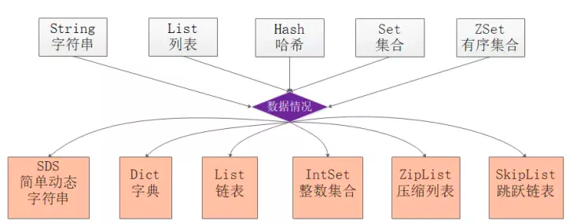
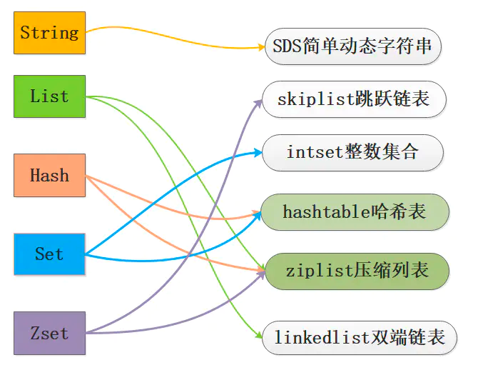
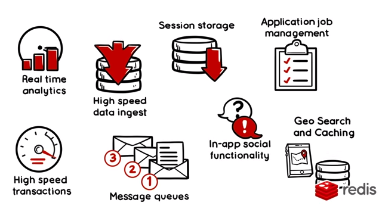

# Redis

官网：[https://redis.io](https://redis.io/commands/ "https://redis.io")

## 线程模型

**Reactor模式**

*   传统阻塞IO模型客户端与服务端线程1:1分配，不利于进行扩展。

*   伪异步IO模型采用线程池方式，但是底层仍然使用同步阻塞方式，限制了最大连接数。

*   Reactor 通过 I/O复用程序监控客户端请求事件，通过任务分派器进行分发。

**单线程时代**

基于 Reactor 单线程模式实现，通过IO多路复用程序接收到用户的请求后，全部推送到一个队列里，交给文件分派器进行处理。

**多线程时代** 

*   单线程性能瓶颈主要在网络IO上。

*   将网络数据读写和协议解析通过多线程的方式来处理 ，对于命令执行来说，仍然使用单线程操作。

Redis中列表的使用场景很多，在选择时可以参考以下口决：

*   lpush + lpop = Stack(栈)

*   lpush + rpop = Queue(队列)

*   lpush + ltrim = Capped Collection(有限集合)

*   lpush + brpop = Message Queue(消息队列)

## 数据结构

## 应用

## 参考

*   [https://javaguide.cn/database/redis/redis-questions-01/](https://javaguide.cn/database/redis/redis-questions-01/ "https://javaguide.cn/database/redis/redis-questions-01/")

*   [https://mp.weixin.qq.com/s/WXnAzYbVZ7GAT6AnOeFSgA](https://mp.weixin.qq.com/s/WXnAzYbVZ7GAT6AnOeFSgA "https://mp.weixin.qq.com/s/WXnAzYbVZ7GAT6AnOeFSgA")

*   [https://www.51cto.com/article/629701.html](https://www.51cto.com/article/629701.html "https://www.51cto.com/article/629701.html")

[分布式解决方案](分布式解决方案/分布式解决方案.md "分布式解决方案")

[缓存设计及常见问题](缓存设计及常见问题/缓存设计及常见问题.md "缓存设计及常见问题")

[内存回收策略](内存回收策略/内存回收策略.md "内存回收策略")

[一些常用命令](一些常用命令/一些常用命令.md "一些常用命令")
