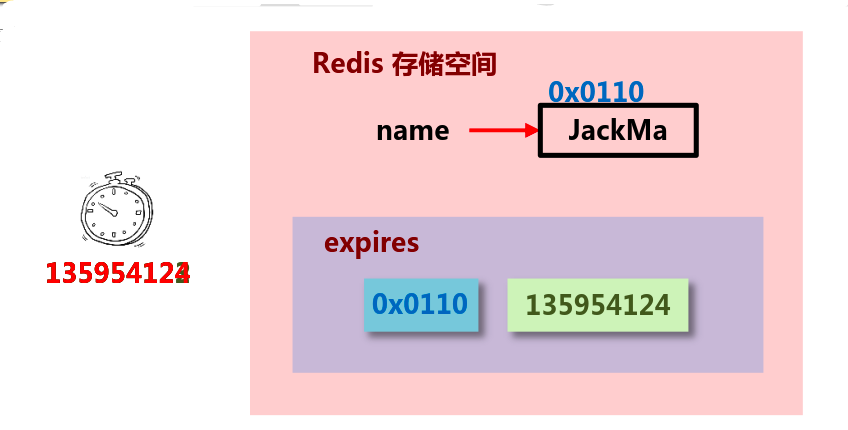
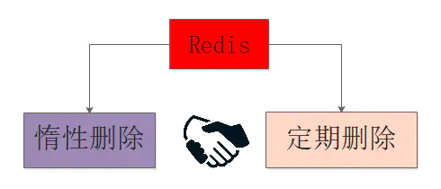
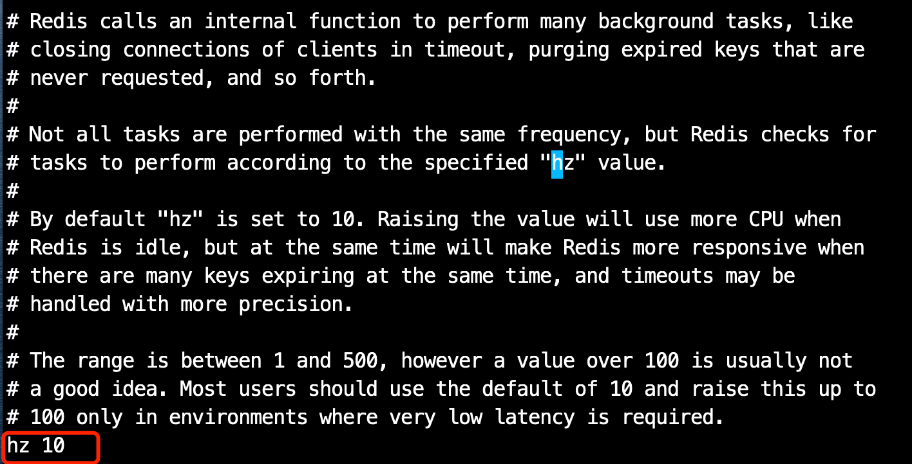
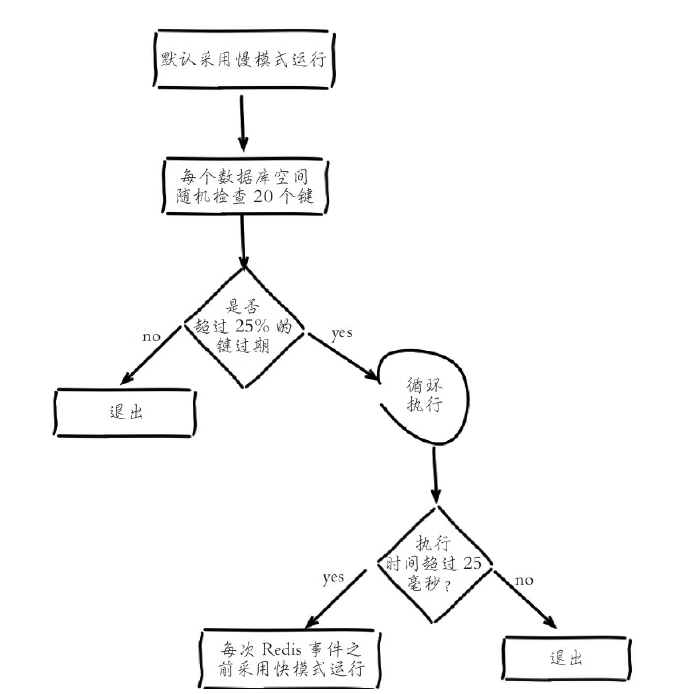
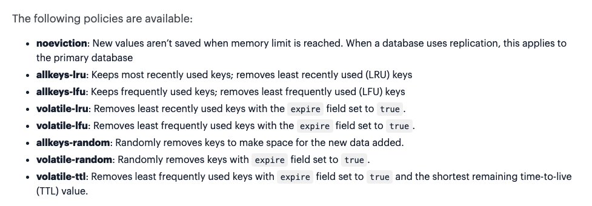
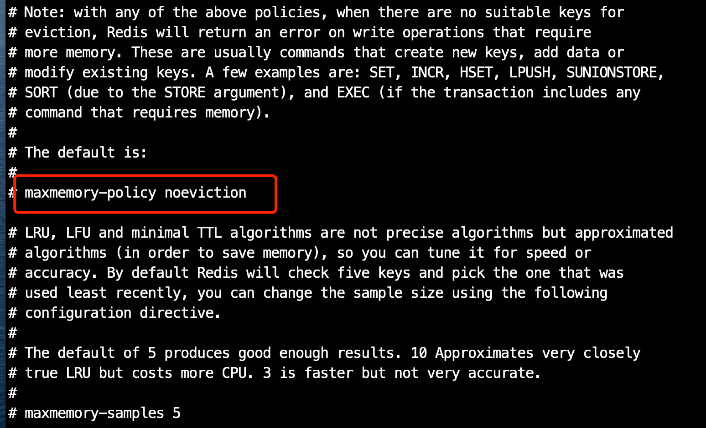
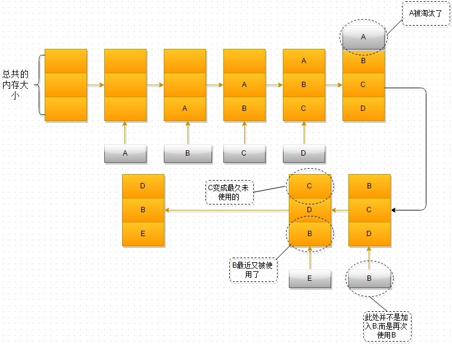
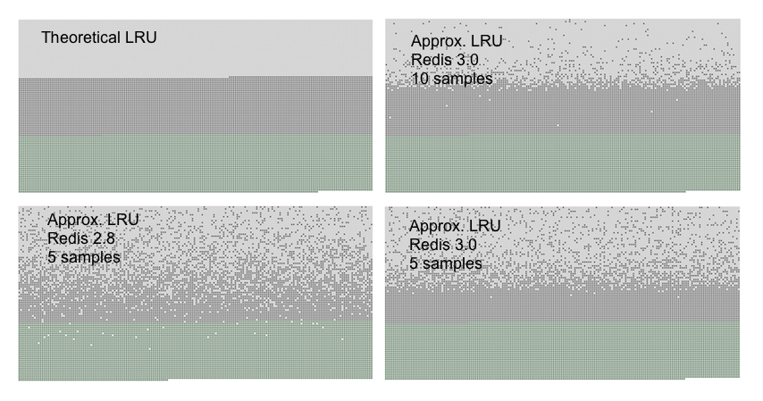

# 内存回收策略

Redis的内存回收机制主要体现在以下两个方面：

*   删除到达过期时间的键对象。

*   内存使用达到`maxmemory`上限时触发内存溢出控制策略。

## 过期删除策略

删除策略的目标：在内存占用与CPU占用之间寻找一种平衡，顾此失彼都会造成整体redis性能的下降，甚至引发服务器宕机或 &#x20;
内存泄露。

### 设置Redis键过期时间

先回顾一下Redis 提供的设置过期时间的命令：

*   EXPIRE \<key> \<ttl> ：表示将键 key 的生存时间设置为 ttl 秒。

*   PEXPIRE \<key> \<ttl> ：表示将键 key 的生存时间设置为 ttl 毫秒。

*   EXPIREAT \<key> \<timestamp> ：表示将键 key 的生存时间设置为 timestamp 所指定的秒数时间戳。

*   PEXPIREAT \<key> \<timestamp> ：表示将键 key 的生存时间设置为 timestamp 所指定的毫秒数时间戳。

**在Redis内部实现中，前面三个设置过期时间的命令最后都会转换成最后一个PEXPIREAT 命令来完成。**

其他相关命令还有：

*   **移除键的过期时间**  PERSIST \<key> ：表示将key的过期时间移除。

*   **返回键的剩余生存时间**

    *   TTL \<key> ：以秒的单位返回键 key 的剩余生存时间。

    *   PTTL \<key> ：以毫秒的单位返回键 key 的剩余生存时间。

在Redis内部，每当我们设置一个键的过期时间时，Redis就会将该键带上过期时间存放到一个**过期字典**中。当我们查询一个键时，Redis便首先检查该键是否存在过期字典中，如果存在，那就获取其过期时间。然后将过期时间和当前系统时间进行比对，比系统时间大，那就没有过期；反之判定该键过期。

此外：

*   **对于字符串类型键，执行set命令会去掉过期时间**，这个问题很容易在开发中被忽视

    *   如下是Redis源码中，set命令的函数setKey，可以看到最后执行了`removeExpire（db，key）`函数去掉了过期时间：

        ```c
        void setKey(redisDb *db, robj *key, robj *val) {
          if (lookupKeyWrite(db,key) == NULL) {
              dbAdd(db,key,val);
          } else {
              dbOverwrite(db,key,val);
          }
          incrRefCount(val);
          // 去掉过期时间
          removeExpire(db,key);
          signalModifiedKey(db,key);
        }
        ```

*   Redis不支持二级数据结构（例如哈希、列表）内部元素的过期功能，例如不能对列表类型的一个元素做过期时间设置。

*   setex命令作为set+expire的组合，不但是原子执行，同时减少了一次网络通讯的时间。

### 过期删除策略

通常删除某个key，我们有如下三种方式进行处理

**1 定时删除**

在设置某个key 的过期时间同时，我们创建一个定时器，让定时器在该过期时间到来时，立即执行对其进行删除的操作。



*   优点：定时删除对内存是最友好的，能够保存内存的key一旦过期就能立即从内存中删除。

*   缺点：对CPU最不友好，在过期键比较多的时候，删除过期键会占用一部分 CPU 时间，对服务器的响应时间和吞吐量造成影响。

**2 惰性删除**（Lazy delete）

设置该key 过期时间后，我们不去管它，当需要该key时，我们在检查其是否过期，如果过期，我们就删掉它，反之返回该key。

*   优点：对 CPU友好，我们只会在使用该键时才会进行过期检查，对于很多用不到的key不用浪费时间进行过期检查。

*   缺点：对内存不友好，如果一个键已经过期，但是一直没有使用，那么该键就会一直存在内存中，如果数据库中有很多这种使用不到的过期键，这些键便永远不会被删除，内存永远不会释放。从而造成内存泄漏。

**3 定期删除**

每隔一段时间，我们就对一些key进行检查，删除里面过期的key。

*   优点：可以通过限制删除操作执行的时长和频率来减少删除操作对 CPU 的影响。另外定期删除，也能有效释放过期键占用的内存。

*   缺点：难以确定删除操作执行的时长和频率。

    *   如果执行的太频繁，定期删除策略变得和定时删除策略一样，对CPU不友好。

    *   如果执行的太少，那又和惰性删除一样了，过期键占用的内存不会及时得到释放。

    *   另外最重要的是，在获取某个键时，如果某个键的过期时间已经到了，但是还没执行定期删除，那么就会返回这个键的值，这是业务不能忍受的错误

### Redis 使用的过期删除策略

Redis所有的键都可以设置过期属性，内部保存在过期字典中。由于进程内保存大量的键，维护每个键精准的过期删除机制会导致消耗大量的CPU，对于单线程的Redis来说成本过高，因此**Redis采用惰性删除和定时任务删除机制实现过期键的内存回收**。



**惰性删除**：Redis的惰性删除策略由 `db.c/expireIfNeeded` 函数实现，所有键读写命令执行之前都会调用 `expireIfNeeded` 函数对其进行检查，如果过期，则删除该键，然后执行键不存在的操作；未过期则不作操作，继续执行原有的命令。

**定期删除**：由`redis.c/activeExpireCycle` 函数实现，函数以一定的频率运行，每次运行时，都从一定数量的数据库中取出一定数量的随机键进行检查，并删除其中的过期键。注意：并不是一次运行就检查所有的库，所有的键，而是随机检查一定数量的键。

定期删除函数的运行频率，在Redis2.6版本中，规定每秒运行10次，大概100ms运行一次。在Redis2.8版本后，可以通过修改配置文件redis.conf 的 **hz** 选项来调整这个次数。　　



看上面对这个参数的解释，建议不要将这个值设置超过 100，否则会对CPU造成比较大的压力。

定时任务中删除过期键逻辑采用了自适应算法，根据键的过期比例、使用快慢两种速率模式回收键，流程如下图所示：



## 内存淘汰策略 （逐出算法）

当Redis所用内存达到`maxmemory`上限时会触发相应的溢出控制策略。

具体策略受`maxmemory-policy`参数控制，Redis支持8种策略（**有关LFU算法的，是从Redis4.0以后版本才有**）：



*   noeviction：默认策略，不会删除任何数据，拒绝所有写入操作并返回客户端错误信息（error）OOM command not allowed when used memory，此时Redis只响应读操作。 默认的内存策略是noeviction， 不删除任意数据(但redis还会根据引用计数器进行释放)，这时如果内存不够时，会直接返回错误  **生产一般不会选用**

*   **allkeys-lru** 利用LRU算法移除任何key （不管数据有没有设置超时属性，直到腾出足够空间为止）。

*   allkeys-lfu 利用LRU算法移除任何key （不管数据有没有设置超时属性，直到腾出足够空间为止）

*   volatile-lru：根据LRU算法删除设置了超时属性（expire）的键，直到腾出足够空间为止。如果没有可删除的键对象，回退到noeviction策略。

*   volatile-lfu:根据LFU算法删除设置了超时属性（expire）的键，直到腾出足够空间为止。如果没有可删除的键对象，回退到noeviction策略。

*   allkeys-random  无差别的随机移除，直到腾出足够空间为止。

*   volatile-random：随机删除过期键，直到腾出足够空间为止。

*   volatile-ttl：根据键值对象的ttl属性，删除最近将要过期数据。如果没有，回退到noeviction策略。

redis 根据以上策略确定驱逐某个键值对后，会删除这个数据，并将这个数据变更消息发布到本地（AOF 持久化）和从机（主从连接）

在redis.conf 配置文件中，可以设置淘汰方式：



内存溢出控制策略可以采用`config set maxmemory-policy{policy}`动态配置。Redis支持丰富的内存溢出应对策略，可以根据实际需求灵活定制，比如当设置volatile-lru策略时，保证具有过期属性的键可以根据LRU剔除，而未设置超时的键可以永久保留。还可以采用allkeys-lru策略把Redis变为纯缓存服务器使用。当Redis因为内存溢出删除键时，可以通过执行`info stats`命令查看evicted\_keys指标找出当前Redis服务器已剔除的键数量。

### LFU

**LFU 算法（Least Frequently Used，最不经常使用）**：淘汰最近一段时间被访问次数最少的数据，以次数作为参考。

需要指出的是 ： LRU 算法或者 TTL 算法都是不是很精确算法，而是一个近似的算法。 Redis 不会通过对全部的键值对进行比较来确定最精确的时间值，从而确定删除哪个键值对 ， 因为这将消耗太多的时间 ， 导致回收垃圾执行的时间太长 ， 造成服务停顿。

当存在热点数据时，LRU的效率很好，但偶发性的、周期性的批量操作会导致LRU命中率急剧下降，缓存污染情况比较严重。这时使用LFU可能更好点

### LRU

LRU算法， 最近最久未使用算法， Least Recently Used&#x20;

下图是一个淘汰的流程：



在Redis中LRU算法是一个近似算法，默认情况下，Redis随机挑选5个键，并且从中选取一个最近最久未使用的key进行淘汰，在配置文件中可以通过`maxmemory-samples`的值来设置redis需要检查key的个数,但是检查的越多，耗费的时间也就越久,但是结构越精确(也就是Redis从内存中淘汰的对象未使用的时间也就越久\~),设置多少，综合权衡吧\~\~\~

**Redis 3.0对这个近似算法的优化**

新算法会维护一个候选池（大小为16），池中的数据根据访问时间进行排序，第一次随机选取的key都会放入池中，随后每次随机选取的key只有在访问时间小于池中最小的时间才会放入池中，直到候选池被放满。当放满后，如果有新的key需要放入，则将池中最后访问时间最大（最近被访问）的移除。当需要淘汰时，需要从池中捞出最久没被访问的key淘汰掉就行了。

**新旧算法的对比**

下面的图片是Redis官方文档给出的新旧算法对比结果：



*   浅灰色是被淘汰的数据

*   灰色是没有被淘汰掉的老数据

*   绿色是新加入的数据

可以看到3.0的效果明显比2.8的要得多，并且取样数越大，越接近标准的LRU算法

**为什么Redis不使用真正的LRU** ?

原因很简单，理论的LRU需要你占用更大的内存(每个key还需要保存前后key的地址), 但你从上图就可以看出Redis 3.0使用的近似LRU算法使用起来的效果几乎与理论的LRU等效了。

**java实现LRU ？**

Java自带的集合框架非常强大，实现LRU算法可以直接使用LinkedHashMap集合框架，简单实现的话，只需要重写 `removeEldestEntry` 方法即可。

```java
import java.util.LinkedHashMap;
import java.util.Map.Entry;

public class LRUCache extends LinkedHashMap {
    private static final long serialVersionUID = 1L;
    private final int capacity;
    private long accessCount = 0;
    private long hitCount = 0;

    public LRUCache(int capacity) {
        super(capacity+1, 1.1f, true);
        this.capacity = capacity;
    }

    public String get(String key) {
        accessCount++;
        if (super.containsKey(key)) {
            hitCount++;
        }
        String value = (String)super.get(key);
        return value;
    }
      
      public boolean containsKey(String key) {
          accessCount++;
          if (super.containsKey(key)) {
              hitCount++;
              return true;
          } else {
              return false;
          }
      }

      protected boolean removeEldestEntry(Entry eldest) {
          return size() > capacity;
      }

      public long getAccessCount() {
          return accessCount;
      }

      public long getHitCount() {
          return hitCount;
      }
}
```

这是LinkedHashMap的一个构造函数，传入的第三个参数accessOrder为true的时候，就按访问顺序对LinkedHashMap排序，为false的时候就按插入顺序，默认是为false的。当把accessOrder设置为true后，就可以将最近访问的元素置于最前面。

```java
public LinkedHashMap(int initialCapacity,
                     float loadFactor,
                     boolean accessOrder) {
    super(initialCapacity, loadFactor);
    this.accessOrder = accessOrder;
}
```

这是LinkedHashMap中另外一个方法，当返回true的时候，就会remove其中最久的元素，可以通过重写这个方法来控制缓存元素的删除，当缓存满了后，就可以通过返回true删除最久未被使用的元素，达到LRU的要求。

```java
protected boolean removeEldestEntry(Map.Entry<K,V> eldest) {
    return false;
}
```

## 参考

*   《Redis 开发与运维》

*   [http://antirez.com/news/109](http://antirez.com/news/109 "http://antirez.com/news/109")

*   [https://redis.io/docs/manual/eviction/](https://redis.io/docs/manual/eviction/ "https://redis.io/docs/manual/eviction/")

*   [https://zhuanlan.zhihu.com/p/149528273](https://zhuanlan.zhihu.com/p/149528273 "https://zhuanlan.zhihu.com/p/149528273")

*   [https://blog.51cto.com/u\_15239532/2835914](https://blog.51cto.com/u_15239532/2835914 "https://blog.51cto.com/u_15239532/2835914")

*   [https://www.geekxh.com/1.99.其他补充题目/11.htm](https://www.geekxh.com/1.99.其他补充题目/11.htm "https://www.geekxh.com/1.99.其他补充题目/11.htm")

*   [https://www.cnblogs.com/ysocean/p/12422635.html](https://www.cnblogs.com/ysocean/p/12422635.html "https://www.cnblogs.com/ysocean/p/12422635.html")

*   [https://blog.csdn.net/weixin\_43230682/article/details/107670911](https://blog.csdn.net/weixin_43230682/article/details/107670911 "https://blog.csdn.net/weixin_43230682/article/details/107670911")
