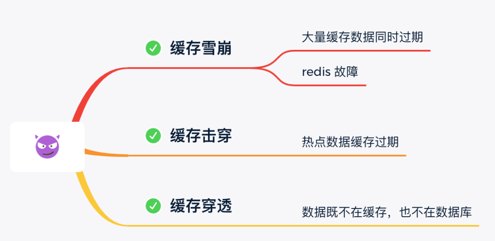
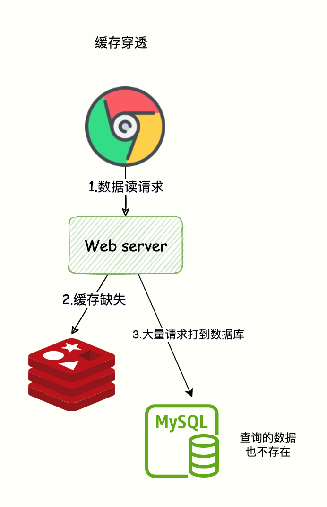
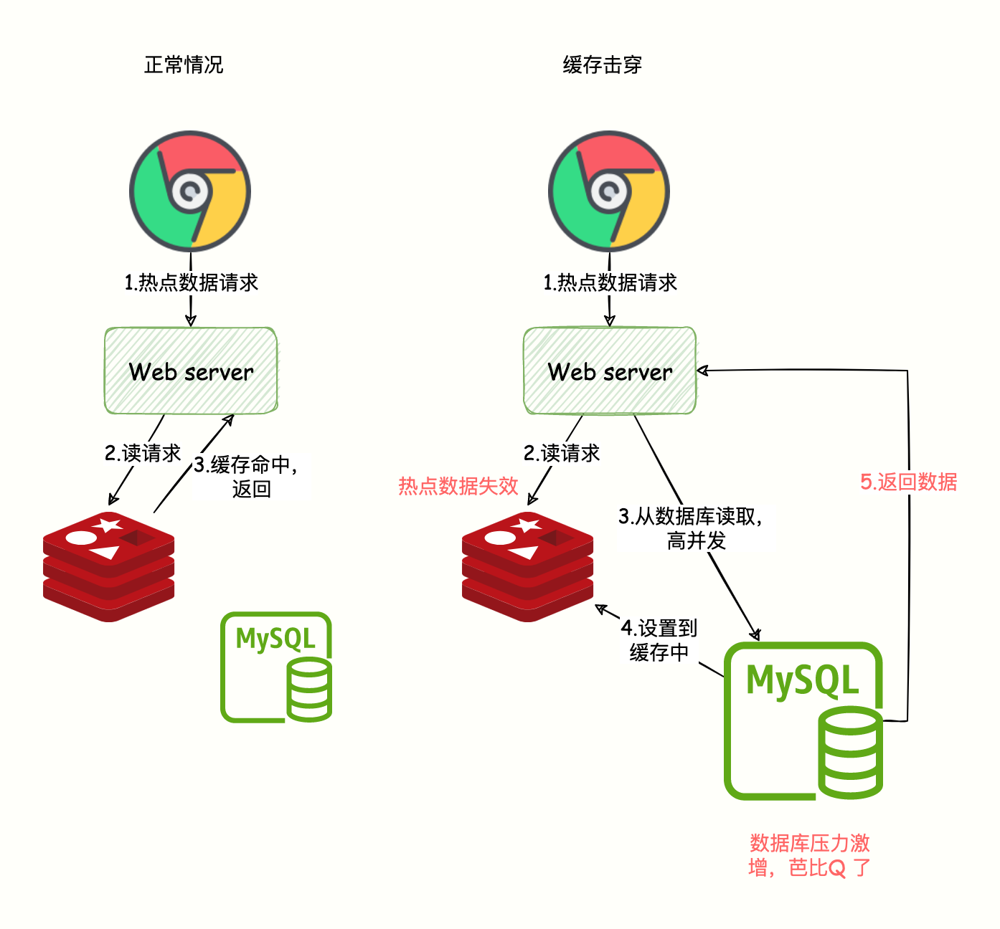

# 缓存设计及常见问题

## 常见问题



### 缓存穿透

查询的数据在数据库中根本不存在，缓存里自然也不会有，这类请求的流量每次都不会命中，每次都会触及到末端的数据库，缓存就起不到缓解压力的作用了，这**种查询数据即不存在 Redis 也不存在于数据库的现象被称为缓存穿透**。



**解决方案**有两种：

*   **缓存空对象**

*   **布隆过滤器**

缓存空对象：将对应Key的Value对写为null，这样就不走数据库了，如果后续业务在数据库中对该 Key 值插入了新记录，那应当在插入之后主动清理掉缓存的 Key 值。如果业务时效性允许的话，也可以对缓存设置一个较短的超时时间来自动处理，缓存有效时间可以设置短点，如30秒（设置太长会导致正常情况也没法使用）

布隆过滤器：（参考：[布隆过滤器](../../../算法和数据结构/算法/布隆过滤器/布隆过滤器.md "布隆过滤器") ）布隆过滤器是用最小的代价来判断某个元素是否存在于某个集合的办法。如果布隆过滤器给出的判定结果是请求的数据不存在，那就直接返回即可，连缓存都不必去查。如果存在，那就去查了DB刷新KV再return。

缓存空对象和布隆过滤器方案对比

| **解决缓存穿透** | **适用场景**                      | **维护成本**                                   |
| ---------- | ----------------------------- | ------------------------------------------ |
| 缓存空对象      | \* 数据命中不高&#xA;\* 数据频繁变化实时性高   | \*  代码维护简单&#xA;\*  需要过多的缓存空间&#xA;\*  数据不一致 |
| 布隆过滤器      | \* *数据命中不高&#xA;*\* 数据相对固定实时性低 | \*  代码维护复杂&#xA;\*  缓存空间占用少                 |

### 缓存击穿



**某些热点数据**（不是全部）忽然因某种原因失效了，譬如典型地由于超期而失效，此时又有多个针对该数据的请求同时发送过来，这些请求将全部未能命中缓存，都到达真实数据源中去，导致其压力剧增，这种现象被称为缓存击穿。

跟**缓存雪崩**有点像，但是又有一点不一样，缓存雪崩是因为大面积的缓存失效，打崩了DB，而缓存击穿不同的是**缓存击穿**是指一个Key非常热点，在不停的扛着大并发，大并发集中对这一个点进行访问，当这个Key在失效的瞬间，持续的大并发就穿破缓存，直接请求数据库，就像在一个完好无损的桶上凿开了一个洞。

**解决方案：**

*   **加锁同步**：以请求该数据的 Key 值为锁，使得只有第一个请求可以流入到真实的数据源中，其他线程采取阻塞或重试策略。如果是进程内缓存出现问题，施加普通互斥锁即可，如果是分布式缓存中出现的问题，就施加`分布式锁`，这样数据源就不会同时收到大量针对同一个数据的请求了。

*   **缓存失效时间随机**

*   预先把热门数据提前存入 Redis 中，并设**热门数据的过期时间超大值（或永不过期）**。

加锁同步：当发现缓存失效的时候，不是立即从数据库加载数据。而是先获取分布式锁，获取锁成功才执行数据库查询和写数据到缓存的操作，获取锁失败，则说明当前有线程在执行数据库查询操作，当前线程睡眠一段时间在重试。这样只让一个请求去数据库读取数据。

```java
public Object getData(String id) {
    String desc = redis.get(id);
        // 缓存为空，过期了
        if (desc == null) {
            // 互斥锁，只有一个请求可以成功
            if (redis(lockName)) {
                try 
                    // 从数据库取出数据
                    desc = getFromDB(id);
                    // 写到 Redis
                    redis.set(id, desc, 60 * 60 * 24);
                } catch (Exception ex) {
                    LogHelper.error(ex);
                } finally {
                    // 确保最后删除，释放锁
                    redis.del(lockName);
                    return desc;
                }
            } else {
                // 否则睡眠200ms，接着获取锁
                Thread.sleep(200);
                return getData(id);
            }
        }
}

```

### 缓存雪崩

缓存雪崩指的是**大量的请求无法在 Redis 缓存系统中处理，请求全部打到数据库，导致数据库压力激增**，甚至宕机。

出现该原因主要有两种：

*   大量热点数据同时过期，导致大量请求需要查询数据库并写到缓存；

*   Redis 故障宕机，缓存系统异常。

**相应的解决办法有：**

*   为应对大量热点数据同时过期

    *   设置随机的失效时间

        ```java
        setRedis（Key，value，time + Math.random() * 10000）；

        ```

    *   热点数据永远不过期

*   为应对redis 故障宕机，需要提升缓存系统可用性，建设分布式缓存的集群

*   依赖隔离组件为后端**限流并降级**

*   提前演练

### 热点key 重建优化

&#x20;上面缓存穿透、击穿、雪崩的解决方案中提到了热点key的重建优化，下面来对比一下：

| 解决方案   | 优点                   | 缺点                                             |
| ------ | -------------------- | ---------------------------------------------- |
| 简单分布式锁 | \* 思路简单&#xA;\* 保证一致性 | \*  代码复杂度增大&#xA;\*  存在死锁的风险&#xA;\*  存在线程池阻塞的风险 |
| 永远不过期  | 基本杜绝热点key 问题         | \*  不保证一致性&#xA;\*  逻辑过期时间增加代码维护成本和内存成本         |

## 批量操作

四种批量操作解决方案对比

|           |                                              |                                           |                     |
| --------- | -------------------------------------------- | ----------------------------------------- | ------------------- |
| 方案        | 优点                                           | 缺点                                        | 网络IO                |
| 串行命令      | 1.  编程简单&#xA;    &#xA;2\.  如果少量keys,性能可以满足要求 | 大量keys请求延迟严重                              | O(keys)             |
| 串行IO      | 1.  编程简单&#xA;    &#xA;2\.  少量节点，性能满足要求       | 大量node 延迟严重                               | O(nodes)            |
| 并行IO      | 利用并行特性，延迟取决于最慢的节点                            | 1.  编程复杂&#xA;    &#xA;2\.  由于多线程，问题定位可能较难 | O(max\_slow(nodes)) |
| hash\_tag | 性能最高                                         | 1.  业务维护成本较高&#xA;    &#xA;2\.  容易出现数据倾斜   | O(1)                |

## 参考

*   [http://icyfenix.cn/architect-perspective/general-architecture/diversion-system/cache-middleware.html](http://icyfenix.cn/architect-perspective/general-architecture/diversion-system/cache-middleware.html "http://icyfenix.cn/architect-perspective/general-architecture/diversion-system/cache-middleware.html")

*   [https://xie.infoq.cn/article/3a3906fed05bf26191788697e](https://xie.infoq.cn/article/3a3906fed05bf26191788697e "https://xie.infoq.cn/article/3a3906fed05bf26191788697e")
