# Kubernetes 基础知识培训

## 一 ：Kubernetes 相关概念：

### 1.1 Kubernetes 简称k8s

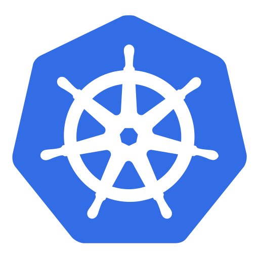

*趣闻: Kubernetes logo 中的七个辐条来源于项目原先的名称, “*[*Seven of Nine 项目*](https://link.zhihu.com/?target=https://cloudplatform.googleblog.com/2016/07/from-Google-to-the-world-the-Kubernetes-origin-story.html "Seven of Nine 项目")*”（LCTT 译注：Borg 是「星际迷航」中的一个宇宙种族，Seven of Nine 是该种族的一名女性角色）。*

**K8S历史：**

K8S是建立在谷歌内部有超过15年的历史，来源于谷歌内部的Borg系统，集结了Borg的精华。

2014年6月 谷歌云计算专家埃里克·布鲁尔（Eric Brewer）在旧金山的发布会为这款新的开源工具揭牌。

2015年7月22日K8S迭代到 v 1.0并正式对外公布

截止至到现在2021年8月25日最高版本是1.22版本。

**Kubernetes 主要功能：**

k8s能方便地管理跨机器运行容器化的应用 。提供应用部署、维护、扩展机制

&#x20;集群管理、安全防护、准入机制、多应用支撑、服务注册、服务发现、智能负载均衡、故障发现、自我修复、服务滚动升级、在线扩容、资源配额管理 使用Docker对应用程序包装、实例化、运行以集群的方式运行、管理跨机器的容器 解决Docker跨机器容器之间的通讯问题 。

k8s的自我修复机制使得容器集群总是运行在用户期望的状态&#x20;

**为什么使用kubernetes：**

*   全面拥抱微服务架构&#x20;

*   使用k8s我们系统可以随时的整体迁移&#x20;

*   k8s系统具备了超强的横向扩容能力&#x20;

*   k8s提供完善的管理工具，涵盖了包括开发、部署测试、运维监控在内的各个环节&#x20;

### 1.2 部署架构演变：

**传统部署**：最初，开发人员在单个物理服务器上部署应用程序。这种部署带来的问题是。物理资源的共享意味着一个应用程序可以占用服务器的大部分处理能力，从而限制了同一台服务器上其他应用程序的性能。

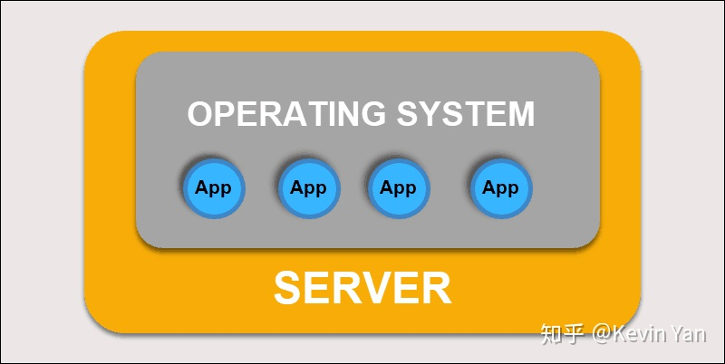

扩展硬件容量需要花费很长时间，增加很多成本。为了解决硬件限制，组织开始虚拟化物理机。

**虚拟化部署：**

&#x20;  虚拟化部署允许在单个物理服务器上创建隔离的虚拟环境，即虚拟机（VM）。该解决方案隔离了VM中的应用程序，限制了资源的使用并提高了安全性。一个应用程序不能再自由访问另一个应用程序处理的信息。

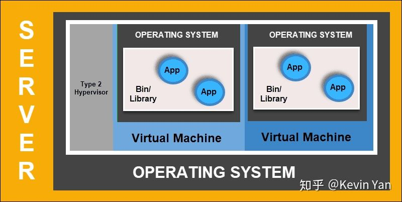

&#x20;  通过虚拟化部署，您可以快速扩展并分散单个物理服务器的资源，随意更新并控制硬件成本。每个VM都有其操作系统，并且可以在虚拟化硬件之上运行所有必要的系统。

**容器化部署：**

&#x20;   容器部署是创建更加灵活和高效的模型的下一步。就像虚拟机一样，容器具有单独的内存，系统文件和处理空间。但是，严格隔离不再是限制因素。现在，多个应用程序可以共享相同的基础操作系统。此功能使容器比成熟的VM效率更高。它们可跨越云，不同的设备以及几乎所有OS发行版进行移植。容器的结构还允许应用程序作为较小的独立部分运行。然后可以在多台计算机上动态部署和管理这些部分。复杂的结构和任务划分太复杂，无法手动管理。需要一个像Kubernetes这样的自动化解决方案，以有效管理此过程中涉及的所有活动部件。

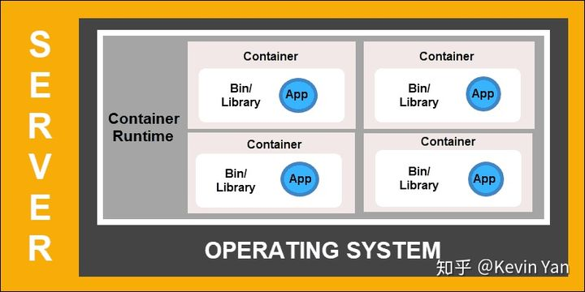

### 1.3 组件架构：

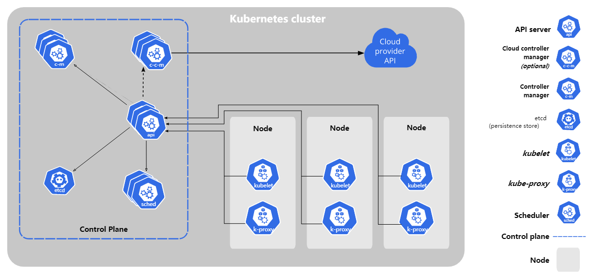

\*\*主节点（控制面板）：
\*\*

**kube-apiserver：** API Server是Kubernetes控制程序的前端，也是用户唯一可以直接进行交互的Kubernetes组件，内部系统组件以及外部用户组件均通过相同的API进行通信。

**etcd：** 键值存储（也称为etcd）是Kubernetes用来备份所有集群数据的数据库。它存储集群的整个配置和状态。主节点查询etcd以检索节点，容器和容器的状态参数。

**kube-schedue**l:调度程序会监视来自API Server的新请求，并将其分配给运行状况良好的节点。它对节点的质量进行排名，并将Pod部署到最适合的节点。如果没有合适的节点，则将Pod置于挂起状态，直到出现合适的节点。

**controlller**：控制器的作用是从API Server获得所需状态。它检查要控制的节点的当前状态，确定是否与所需状态存在任何差异，并解决它们（如果有）。

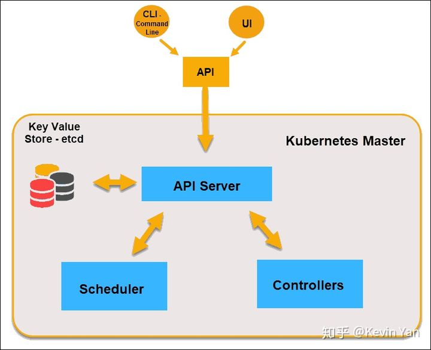

**node节点：** 工作节点监听API Server发送过来的新的工作分配；他们会执行分配给他们的工作，然后将结果报告给Kubernetes主节点。

\*\* kubelet\*\*：kubelet组件，用于管理节点，运行在每个Kubernetes节点上。kubelet组件用来接收、处理、上报kube-apiserver组件下发的任务。kubelet进程启动时会向kube-apiserver注册节点自身信息。它主要负责所在节点（Node）上的Pod资源对象的管理，例如Pod资源对象的创建、修改、监控、删除、驱逐及Pod生命周期管理等。kubelet组件会定期监控所在节点的资源使用状态并上报给kube-apiserver组件，这些资源数据可以帮助kube-scheduler调度器为Pod资源对象预选节点。kubelet也会对所在节点的镜像和容器做清理工作，保证节点上的镜像不会占满磁盘空间、删除的容器释放相关资源。

**kube-proxy：**

kube-proxy组件，作为节点上的网络代理，运行在每个Kubernetes节点上。它监控kube-apiserver的服务和端点资源变化，并通过iptables/ipvs等配置负载均衡器，为一组Pod提供统一的TCP/UDP流量转发和负载均衡功能。

kube-proxy组件是参与管理Pod-to-Service和External-to-Service网络的最重要的节点组件之一。

kube-proxy组件相当于代理模型，对于某个IP:Port的请求，负责将其转发给专用网络上的相应服务或应用程序。但是，kube-proxy组件与其他负载均衡服务的区别在于，kube-proxy代理只向Kubernetes服务及其后端Pod发出请求。

container runtime: 容器运行时从容器镜像库中拉取镜像，然后启动和停止容器。容器运行时由第三方软件或插件（例如Docker）担当。

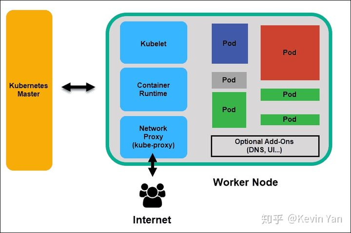

## 二 ：Kubernetes 安装

### 2.1 安装要求：

&#x20;    在开始之前，部署Kubernetes集群机器需要满足以下几个条件： . 一台或多台机器，操作系统 CentOS7.x-86\_x64 . 硬件配置：2GB或更多RAM，2个CPU或更多CPU，硬盘30GB或更多 . 集群中所有机器之间网络互通 . 可以访问外网，需要拉取镜像 . 禁止swap分区。

### 2.2 准备环境：

```bash
关闭防火墙：

$ systemctl stop firewalld
$ systemctl disable firewalld

关闭selinux：
$ sed -i 's/enforcing/disabled/' /etc/selinux/config 
$ setenforce 0

关闭swap：
$ swapoff -a $ 临时
$ vim /etc/fstab $ 永久

添加主机名与IP对应关系（记得设置主机名）：

$ cat /etc/hosts

192.168.31.61 k8s-master

192.168.31.62 k8s-node1

192.168.31.63 k8s-node2

将桥接的IPv4流量传递到iptables的链：

$ cat > /etc/sysctl.d/k8s.conf << EOF

net.bridge.bridge-nf-call-ip6tables = 1

net.bridge.bridge-nf-call-iptables = 1

EOF

$ sysctl --system
```

### 2.3 所有节点安装docker/kubeadmin/kubelet:

安装docker

```bash
$ wget https://mirrors.aliyun.com/docker-ce/linux/centos/docker-ce.repo -O /etc/yum.repos.d/docker-ce.repo

$ yum -y install docker-ce-18.06.1.ce-3.el7

$ systemctl enable docker && systemctl start docker

$ docker --version

Docker version 18.06.1-ce, build e68fc7a
```

添加阿里云YUM软件源

```bash
$ cat > /etc/yum.repos.d/kubernetes.repo << EOF

[kubernetes]

name=Kubernetes

baseurl=https://mirrors.aliyun.com/kubernetes/yum/repos/kubernetes-el7-x86_64

enabled=1

gpgcheck=0

repo_gpgcheck=0

gpgkey=https://mirrors.aliyun.com/kubernetes/yum/doc/yum-key.gpg https://mirrors.aliyun.com/kubernetes/yum/doc/rpm-package-key.gpg

EOF
```

&#x20;安装kubeadm，kubelet和kubectl: 由于版本更新频繁，这里指定版本号部署：

```bash
$ yum install -y kubelet-1.15.0 kubeadm-1.15.0 kubectl-1.15.0
$ systemctl enable kubelet
```

部署master节点

```bash
在192.168.31.61（Master）执行。

$ kubeadm init \

--apiserver-advertise-address=10.2.1.246 \

--image-repository registry.aliyuncs.com/google_containers \

--kubernetes-version v1.15.0 \

--service-cidr=10.1.0.0/16 \

--pod-network-cidr=10.244.0.0/16
```

由于默认拉取镜像地址k8s.gcr.io国内无法访问，这里指定阿里云镜像仓库地址。 使用kubectl工具：

```bash
mkdir -p $HOME/.kube

sudo cp -i /etc/kubernetes/admin.conf $HOME/.kube/config

sudo chown $(id -u):$(id -g) $HOME/.kube/config

$ kubectl get nodes

```

&#x20;安装pod网络插件（CNI）：

```bash
$ kubectl apply -f https://raw.githubusercontent.com/coreos/flannel/a70459be0084506e4ec919aa1c114638878db11b/Documentation/kube-flannel.yml
```

确保能够访问到quay.io这个registery。 如果下载失败，可以改成这个镜像地址：lizhenliang/flannel:v0.11.0-amd64

加入kubernetes node节点：

在192.168.31.62/63（Node）执行。 向集群添加新节点，执行在kubeadm init输出的kubeadm join命令：

```bash
$ kubeadm join 192.168.31.61:6443 --token esce21.q6hetwm8si29qxwn \
   --discovery-token-ca-cert-hash sha256:00603a05805807501d7181c3d60b478788408cfe6cedefedb1f97569708be9c5

```

测试kubernetes集群：

在Kubernetes集群中创建一个pod，验证是否正常运行：

```bash
$ kubectl create deployment nginx --image=nginx

$ kubectl expose deployment nginx --port=80 --type=NodePort

$ kubectl get pod,svc
```

访问地址：[http://NodeIP:Port](http://nodeip:Port/ "http://NodeIP:Port")

部署dashboard

```bash
$ kubectl apply -f https://raw.githubusercontent.com/kubernetes/dashboard/v1.10.1/src/deploy/recommended/kubernetes-dashboard.yaml
```

默认镜像国内无法访问，修改镜像地址为： lizhenliang/kubernetes-dashboard-amd64:v1.10.1 默认Dashboard只能集群内部访问，修改Service为NodePort类型，暴露到外部：

```yaml
kind: Service
apiVersion: v1
metadata:
  labels:
    k8s-app: kubernetes-dashboard
  name: kubernetes-dashboard
  namespace: kube-system
spec:
  type: NodePort
  ports:
    - port: 443
      targetPort: 8443
      nodePort: 30001
selector:
  k8s-app: kubernetes-dashboard
```

执行：\$ kubectl apply -f kubernetes-dashboard.yaml

访问地址：[http://NodeIP:30001](http://nodeip:30001/ "http://NodeIP:30001") 创建service account并绑定默认cluster-admin管理员集群角色：

```bash
$ kubectl create serviceaccount dashboard-admin -n kube-system

$ kubectl create clusterrolebinding dashboard-admin --clusterrole=cluster-admin --serviceaccount=kube-system:dashboard-admin

$ kubectl describe secrets -n kube-system $(kubectl -n kube-system get secret | awk '/dashboard-admin/{print $1}')
```

使用输出的token登录Dashboard。 参考文章：[详解Kubernetes架构 ](https://blog.csdn.net/M2l0ZgSsVc7r69eFdTj/article/details/106964429 "详解Kubernetes架构 ")

## 三 ：pod

### 3.1 pod概念

Pod是最小部署单元，一个Pod由一个或多个容器组成，Pod中容器共享存储和网络，在同一台Docker主机上运行。同一个Pod里的容器共享同一个网络命名空间，可以使用localhost互相通信。

*   每个Pod都有一个特殊的被称为“根容器”的Pause容器，还包含一个或多个紧密相关的用户业务容器；&#x20;

*   一个Pod里的容器与另外主机上的Pod容器能够直接通信；

*   &#x20;如果Pod所在的Node宕机，会将这个Node上的所有Pod重新调度到其他节点上；

*   普通Pod及静态Pod，前者存放在etcd中，后者存放在具体Node上的一个具体文件中，并且只能在此Node上启动运行；&#x20;

*   每个Pod可以设置限额的计算机资源有CPU和Memory；

    *   Limits，资源最大允许使用的量；

    *   Requests，资源的最小申请量&#x20;

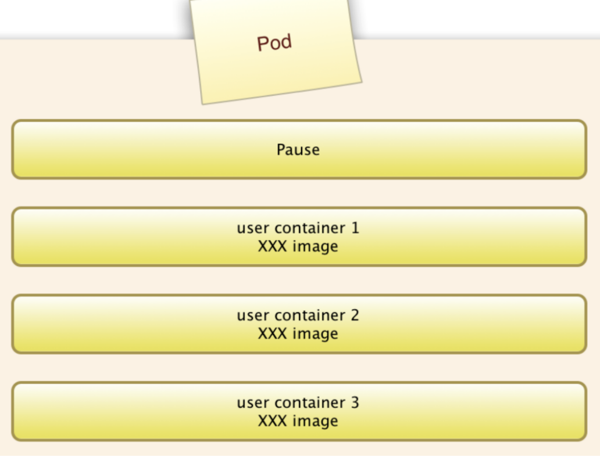

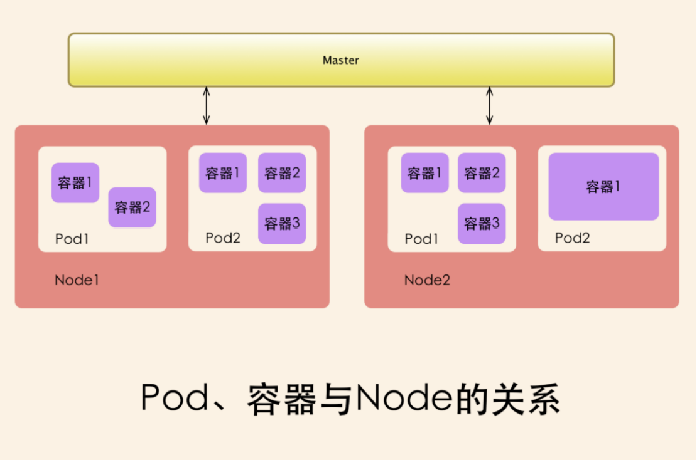

### 3.2 pod基本定义：

pod 模板例子：

```yaml
 
apiVersion: v1        　　          #必选，版本号，例如v1,版本号必须可以用 kubectl api-versions 查询到 .
kind: Pod       　　　　　　         #必选，Pod
metadata:       　　　　　　         #必选，元数据
  name: string        　　          #必选，Pod名称
  namespace: string     　　        #必选，Pod所属的命名空间,默认为"default"
  labels:       　　　　　　          #自定义标签
    - name: string      　          #自定义标签名字
  annotations:        　　                 #自定义注释列表
    - name: string
------------------------------------------------------------------------------------    
spec:         　　　　　　　            #必选，Pod中容器的详细定义
  containers:       　　　　            #必选，Pod中容器列表
  - name: string      　　                #必选，容器名称,需符合RFC 1035规范

    image: string     　　                #必选，容器的镜像名称

    imagePullPolicy: [ Always|Never|IfNotPresent ]  #获取镜像的策略 Alawys表示下载镜像 IfnotPresent表示优先使用本地镜像,否则下载镜像，Nerver表示仅使用本地镜像

    command: [string]     　　        #容器的启动命令列表，如不指定，使用打包时使用的启动命令

    args: [string]      　　             #容器的启动命令参数列表

    workingDir: string                     #容器的工作目录

    volumeMounts:     　　　　        #挂载到容器内部的存储卷配置

    - name: string      　　　        #引用pod定义的共享存储卷的名称，需用volumes[]部分定义的的卷名

      mountPath: string                 #存储卷在容器内mount的绝对路径，应少于512字符

      readOnly: boolean                 #是否为只读模式

    ports:        　　　　　　        #需要暴露的端口库号列表

    - name: string      　　　        #端口的名称

      containerPort: int                #容器需要监听的端口号

      hostPort: int     　　             #容器所在主机需要监听的端口号，默认与Container相同

      protocol: string                  #端口协议，支持TCP和UDP，默认TCP

 ----------------------------------------------------------------------------

    env:        　　　　　　            #容器运行前需设置的环境变量列表

    - name: string      　　            #环境变量名称

      value: string     　　            #环境变量的值---

-------------------------------------------------------------------------------  

    resources:        　　                #资源限制和请求的设置

      limits:       　　　　            #资源限制的设置

        cpu: string     　　            #Cpu的限制，单位为core数，将用于docker run --cpu-shares参数

        memory: string                  #内存限制，单位可以为Mib/Gib，将用于docker run --memory参数

      requests:       　　                #资源请求的设置

        cpu: string     　　            #Cpu请求，容器启动的初始可用数量

        memory: string                    #内存请求,容器启动的初始可用数量

-------------------------------------------------------------------------------   -----------------------------------------------------------------------

    livenessProbe:      　　            #对Pod内各容器健康检查的设置，当探测无响应几次后将自动重启该容器，检查方法有exec、httpGet和tcpSocket，对一个容器只需设置其中一种方法即可

      exec:       　　　　　　        #对Pod容器内检查方式设置为exec方式

        command: [string]               #exec方式需要制定的命令或脚本

      httpGet:        　　　　        #对Pod内个容器健康检查方法设置为HttpGet，需要制定Path、port

        path: string

        port: number

        host: string

        scheme: string

        HttpHeaders:

        - name: string

          value: string

      tcpSocket:      　　　　　　#对Pod内个容器健康检查方式设置为tcpSocket方式

         port: number

       initialDelaySeconds: 0       #容器启动完成后首次探测的时间，单位为秒

       timeoutSeconds: 0    　　    #对容器健康检查探测等待响应的超时时间，单位秒，默认1秒

       periodSeconds: 0     　　    #对容器监控检查的定期探测时间设置，单位秒，默认10秒一次

       successThreshold: 0

       failureThreshold: 0

       securityContext:

         privileged: false

    restartPolicy: [Always | Never | OnFailure] #Pod的重启策略，Always表示一旦不管以何种方式终止运行，kubelet都将重启，OnFailure表示只有Pod以非0退出码退出才重启，Nerver表示不再重启该Pod

    nodeSelector: obeject   　　    #设置NodeSelector表示将该Pod调度到包含这个label的node上，以key：value的格式指定

    imagePullSecrets:     　　　　#Pull镜像时使用的secret名称，以key：secretkey格式指定

      - name: string

    hostNetwork: false     　　    #是否使用主机网络模式，默认为false，如果设置为true，表示使用宿主机网络

------------------------------------------------------------------------------------    

  volumes:        　　　　　　    #在该pod上定义共享存储卷列表

    - name: string     　　 　　    #共享存储卷名称 （volumes类型有很多种）

      emptyDir: {}      　　　　    #类型为emtyDir的存储卷，与Pod同生命周期的一个临时目录。为空值

      hostPath: string      　　    #类型为hostPath的存储卷，表示挂载Pod所在宿主机的目录

        path: string      　　      #Pod所在宿主机的目录，将被用于同期中mount的目录

      secret:       　　　　　　    #类型为secret的存储卷，挂载集群与定义的secre对象到容器内部

        scretname: string  

        items:     

        - key: string

          path: string

      configMap:      　　　　            #类型为configMap的存储卷，挂载预定义的configMap对象到容器内部

        name: string

        items:

        - key: string

          path: string

      nfs:                           #类型为NFS的存储卷

        server: 192.168.66.50        #nfs服务器ip或是域名 

        path: "/test"                #nfs服务器共享的目录

      persistentVolumeClaim:          #类型为persistentVolumeClaim的存储卷

        claimName: test-pvc           #名字一定要正确，使用的是kind为PersistentVolumeClaim中的name
```

### 3.3 pod 基本配置：

同一个pod中容器共享网络和存储。网络通过localhot加端口号可以访问。

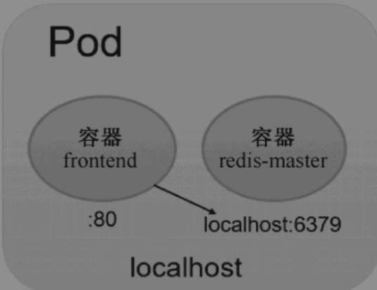

```yaml
apiVersion: v1

kind: Pod

metadata:

  labels:

    name: redis-php

  name: redis-php

spec:

  containers:

  - image: kubeguide/guestbook-php-frontend:localredis 

    name: frontend

    ports:

    - containerPort: 80

  - image: kubeguide/redis-master

    name: redis

    ports:

    - containerPort: 6379
```

创建pod

```bash
[root@k8s-master pod]# kubectl  create -f front-localredis-pod.yaml 

pod/redis-php created
```

查看pod

```bash
[root@k8s-master pod]# kubectl  get pod

NAME                         READY   STATUS    RESTARTS   AGE

redis-php                    2/2     Running   0          104s
```

查看pod创建过程

```bash
[root@k8s-master pod]# kubectl  describe pod redis-php 

Name:               redis-php

Namespace:          default

Priority:           0

PriorityClassName:  <none>

Node:               node1/10.22.9.187

Start Time:         Mon, 23 Aug 2021 17:50:56 +0800

Labels:             name=redis-php

Annotations:        <none>

Status:             Running

IP:                 10.244.3.14

Containers:

  frontend:

    Container ID:   docker://11d1d4e1813073bcfa6e55b16b2ba349631337214afab19cae6d58fc90a7727d

    Image:          kubeguide/guestbook-php-frontend:localredis

    Image ID:       docker-pullable://kubeguide/guestbook-php-frontend@sha256:37c2c1dcfcf0a51bf9531430fe057bcb1d4b94c64048be40ff091f01e384f81e

    Port:           80/TCP

    Host Port:      0/TCP

    State:          Running

      Started:      Mon, 23 Aug 2021 17:50:57 +0800

    Ready:          True

    Restart Count:  0

    Environment:    <none>

    Mounts:

      /var/run/secrets/kubernetes.io/serviceaccount from default-token-9r98x (ro)

  redis:

    Container ID:   docker://461ee0a8d35a0c03a454cde3af77390de0b95fc852b068fc8df70b95a366955d

    Image:          kubeguide/redis-master

    Image ID:       docker-pullable://kubeguide/redis-master@sha256:e11eae36476b02a195693689f88a325b30540f5c15adbf531caaecceb65f5b4d

    Port:           6379/TCP

    Host Port:      0/TCP

    State:          Running

      Started:      Mon, 23 Aug 2021 17:51:13 +0800

    Ready:          True

    Restart Count:  0

    Environment:    <none>

    Mounts:

      /var/run/secrets/kubernetes.io/serviceaccount from default-token-9r98x (ro)

Conditions:

  Type              Status

  Initialized       True 

  Ready             True 

  ContainersReady   True 

  PodScheduled      True 

Volumes:

  default-token-9r98x:

    Type:        Secret (a volume populated by a Secret)

    SecretName:  default-token-9r98x

    Optional:    false

QoS Class:       BestEffort

Node-Selectors:  <none>

Tolerations:     node.kubernetes.io/not-ready:NoExecute for 300s

                 node.kubernetes.io/unreachable:NoExecute for 300s

Events:

  Type    Reason     Age    From               Message

  ----    ------     ----   ----               -------

  Normal  Scheduled  3m54s  default-scheduler  Successfully assigned default/redis-php to node1

  Normal  Pulled     3m53s  kubelet, node1     Container image "kubeguide/guestbook-php-frontend:localredis" already present on machine

  Normal  Created    3m53s  kubelet, node1     Created container

  Normal  Started    3m53s  kubelet, node1     Started container

  Normal  Pulling    3m53s  kubelet, node1     pulling image "kubeguide/redis-master"

  Normal  Pulled     3m38s  kubelet, node1     Successfully pulled image "kubeguide/redis-master"

  Normal  Created    3m38s  kubelet, node1     Created container

  Normal  Started    3m37s  kubelet, node1     Started container
```

查看pod日志

```bash
[root@k8s-master pod]# kubectl  logs -f redis-php   -c  frontend

AH00558: apache2: Could not reliably determine the server's fully qualified domain name, using 10.244.3.14. Set the 'ServerName' directive globally to suppress this message

AH00558: apache2: Could not reliably determine the server's fully qualified domain name, using 10.244.3.14. Set the 'ServerName' directive globally to suppress this message

[Mon Aug 23 09:50:57.984881 2021] [mpm_prefork:notice] [pid 1] AH00163: Apache/2.4.10 (Debian) PHP/5.6.12 configured -- resuming normal operations

[Mon Aug 23 09:50:57.984904 2021] [core:notice] [pid 1] AH00094: Command line: 'apache2 -D FOREGROUND'
```

删除pod

```bash
[root@k8s-master pod]# kubectl  delete  -f front-localredis-pod.yaml 

pod "redis-php" deleted
```

### 3.4 pod 共享volume：

同一个pod中共享存储。

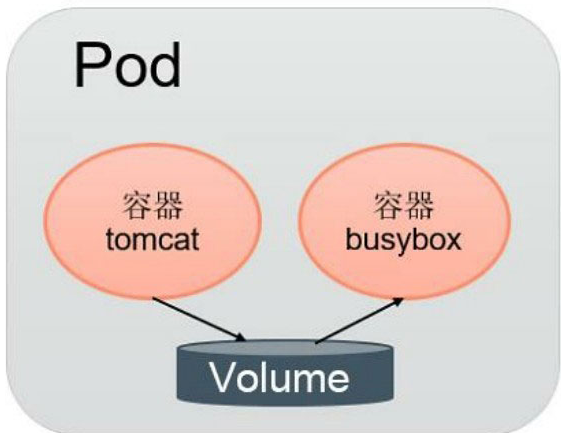

tomcat容器写入日志文件到volume，busybox用于从volume读取日志文件。

```yaml
apiVersion: v1

kind: Pod

metadata:

  labels:

    name: volume-pod

  name: volume-pod

spec:

  containers:

  - image: tomcat

    name: tomcat

    ports:

    - containerPort: 8080

    volumeMounts:

    - name: app-logs

      mountPath: /usr/local/tomcat/logs

  - image: busybox

    name: busybox

    command: ["sh","-c","tail -f /logs/catalina*.log"]

    volumeMounts:

    - name: app-logs

      mountPath: /logs

  volumes:

  - name: app-logs

    emptyDir: {}
```

### 3.4 pod  配置管理：

配置与程序隔离。是程序更好的复用。环境变量或者外挂的方式进行注入配置。

**configmap：**

用法：

&#x20; 生成为容器内环境变量

&#x20; 设置容器启动命令的启动参数（需设置为环境变量）

&#x20; 以Volume的形式挂载为容器内部的文件或目录

**以yaml文件方式创建config**

```yaml
apiVersion: v1

kind: ConfigMap

metadata:

  name: cm-appvars

  namespace: default

data:

  apploglevel: info

  appdir: /var/data
```

创建cm命令

```bash
[root@k8s-master pod]# kubectl  create -f cm-appvars.yaml 

configmap/cm-appvars created
```

查看cm&#x20;

```bash
[root@k8s-master pod]# kubectl  get cm

NAME         DATA   AGE

cm-appvars   2      41s

[root@k8s-master pod]# kubectl  get cm cm-appvars -oyaml

apiVersion: v1

data:

  appdir: /var/data

  apploglevel: info

kind: ConfigMap

metadata:

  creationTimestamp: "2021-08-24T06:06:35Z"

  name: cm-appvars

  namespace: default

  resourceVersion: "21459286"

  selfLink: /api/v1/namespaces/default/configmaps/cm-appvars

  uid: 702b942f-04a1-11ec-8db3-fa163ef72356 
```

**在pod中使用configmap：**

通过volumeMount使用ConfigMap，config配置文件内容：

```bash
[glops@hwc-bj04-glzh-dev-yum-01 ~]$ kubectl  get cm yapi-config  -oyaml

apiVersion: v1

data:

  config.json: |-

    {

      "port": "3000",

      "adminAccount": "sunkewei@gaolvgo.com",

      "db": {

        "connectString": "mongodb://mongodb.dev.glzhapp.com:8635/yapi",

        "user": "yapi",

        "pass": "3!QmcxlYpI10"

      },

       "mail": {

        "enable": true,

        "host": "smtp.126.com",

        "port": 465,

        "from": "sunkeweimail@126.com",

        "auth": {

          "user": "sunkeweimail@126.com",

          "pass": "REYJHIVWTCFQZNYM"

        }},

      "ldapLogin": {

        "enable": false,

        "server": "ldap://172.16.1.29",

        "baseDn": "CN=yapi,OU=ServiceAccount,OU=IT部,DC=test,DC=com",

        "bindPassword": "yapi123456",

        "searchDn": "OU=IT部,DC=test,DC=com",

        "searchStandard": "&(objectClass=user)(sAMAccountName=%s)",

        "usernameKey": "displayName",

        "emailKey": "mail"

      },

      "closeRegister":false

    }

kind: ConfigMap

metadata:

  annotations:

    description: ""

  creationTimestamp: "2021-03-12T09:17:35Z"

  name: yapi-config

  namespace: glzh-dev

  resourceVersion: "150221741"

  selfLink: /api/v1/namespaces/glzh-dev/configmaps/yapi-config

  uid: 258e1696-09c3-46ba-bce9-c58b6ac30e80
```

查看deployment配置文件：

```yaml
kind: Deployment
apiVersion: apps/v1
metadata:
  name: yapi
  namespace: glzh-dev
  selfLink: /apis/apps/v1/namespaces/glzh-dev/deployments/yapi
  uid: 0cf9f155-1ab8-4861-9882-0ec4f12d7816
  resourceVersion: '150221924'
  generation: 3
  creationTimestamp: '2021-08-16T10:10:34Z'
  labels:
    app: yapi
    release: yapi
  annotations:
    deployment.kubernetes.io/revision: '3'
    kubectl.kubernetes.io/last-applied-configuration: |
      {"apiVersion":"apps/v1","kind":"Deployment","metadata":{"annotations":{},"labels":{"app":"yapi","release":"yapi"},"name":"yapi","namespace":"glzh-dev"},"spec":{"revisionHistoryLimit":10,"selector":{"matchLabels":{"app":"yapi","release":"yapi"}},"template":{"metadata":{"labels":{"app":"yapi","release":"yapi"}},"spec":{"containers":[{"image":"swr.cn-north-4.myhuaweicloud.com/glzh-library/yapi:v1.9.3","imagePullPolicy":"Always","name":"yapi","ports":[{"containerPort":3000,"name":"yapi","protocol":"TCP"}],"resources":{"limits":{"cpu":"1000m","memory":"1024Mi"},"requests":{"cpu":"500m","memory":"512Mi"}},"volumeMounts":[{"mountPath":"/yapi/config.json","name":"config","subPath":"config.json"},{"mountPath":"/yapi/vendors","name":"datadirnew"}]}],"imagePullSecrets":[{"name":"default-secret"}],"volumes":[{"configMap":{"name":"yapi-config"},"name":"config"},{"name":"datadirnew","persistentVolumeClaim":{"claimName":"data-new"}}]}}}}
spec:
  replicas: 1
  selector:
    matchLabels:
      app: yapi
      release: yapi
  template:
    metadata:
      creationTimestamp: null
      labels:
        app: yapi
        release: yapi
    spec:
      volumes:
        - name: config
          configMap:
            name: yapi-config
            defaultMode: 420
        - name: datadirnew
          persistentVolumeClaim:
            claimName: data-new
      containers:
        - name: yapi
          image: 'swr.cn-north-4.myhuaweicloud.com/glzh-library/yapi:v1.9.3'
          ports:
            - name: yapi
              containerPort: 3000
              protocol: TCP
          resources:
            limits:
              cpu: '1'
              memory: 1Gi
            requests:
              cpu: 500m
              memory: 512Mi
          volumeMounts:
            - name: config
              mountPath: /yapi/config.json
              subPath: config.json
            - name: datadirnew
              mountPath: /yapi/vendors
          terminationMessagePath: /dev/termination-log
          terminationMessagePolicy: File
          imagePullPolicy: Always
      restartPolicy: Always
      terminationGracePeriodSeconds: 30
      dnsPolicy: ClusterFirst
      securityContext: {}
      imagePullSecrets:
        - name: default-secret
      schedulerName: default-scheduler
      dnsConfig:
        options:
          - name: single-request-reopen
  strategy:
    type: RollingUpdate
    rollingUpdate:
      maxUnavailable: 25%
      maxSurge: 25%
  revisionHistoryLimit: 10
  progressDeadlineSeconds: 600
status:
  observedGeneration: 3
  replicas: 1
  updatedReplicas: 1
  readyReplicas: 1
  availableReplicas: 1
  conditions:
    - type: Progressing
      status: 'True'
      lastUpdateTime: '2021-08-16T14:37:02Z'
      lastTransitionTime: '2021-08-16T10:10:34Z'
      reason: NewReplicaSetAvailable
      message: ReplicaSet "yapi-57c479d595" has successfully progressed.
    - type: Available
      status: 'True'
      lastUpdateTime: '2021-08-16T14:51:30Z'
      lastTransitionTime: '2021-08-16T14:51:30Z'
      reason: MinimumReplicasAvailable
      message: Deployment has minimum availability.  
```

### 3.5 pod  健康检测和可用性检测：

*   LivenessProbe探针：

    用于判断容器是否存活（Running状态），如果LivenessProbe探针探测到容器不健康，则kubelet将杀掉该容器，并根据容器的重启策略做相应的处理。如果一个容器不包含LivenessProbe探针，那么kubelet认为该容器的LivenessProbe探针返回的值永远是Success。

*   ReadinessProbe探针：

    用于判断容器服务是否可用（Ready状态），达到Ready状态的Pod才可以接收请求。对于被Service管理的Pod，Service与PodEndpoint的关联关系也将基于Pod是否Ready进行设置。如果在运行过程中Ready状态变为False，则系统自动将其从Service的后端Endpoint列表中隔离出去，后续再把恢复到Ready状态的Pod加回后端Endpoint列表。

**ExecAction：** 在容器内部执行一个命令，如果该命令的返回码为0，则表明容器健康。

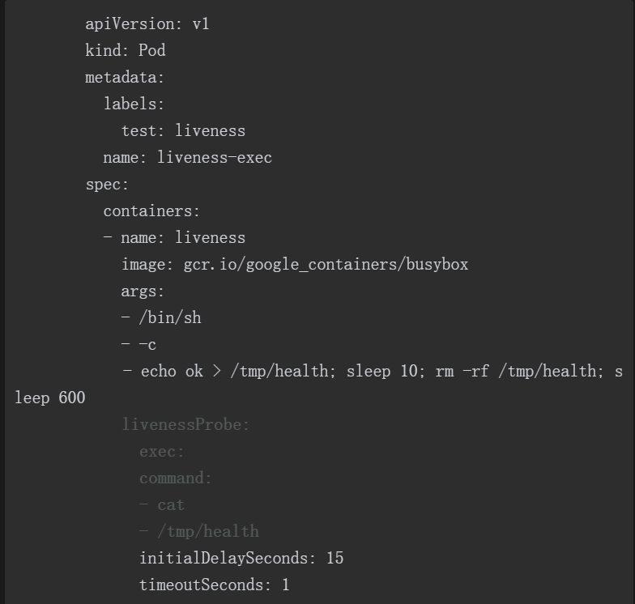

**TCPSocketAction**：通过容器的IP地址和端口号执行TCP检查，如果能够建立TCP连接，则表明容器健康。

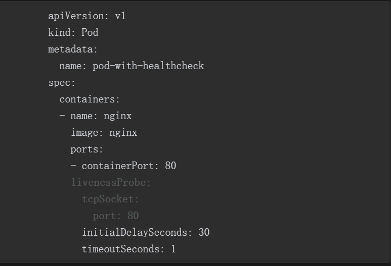

**HTTPGetAction：** 通过容器的IP地址、端口号及路径调用HTTP Get方法，如果响应的状态码大于等于200且小于400，则认为容器健康。

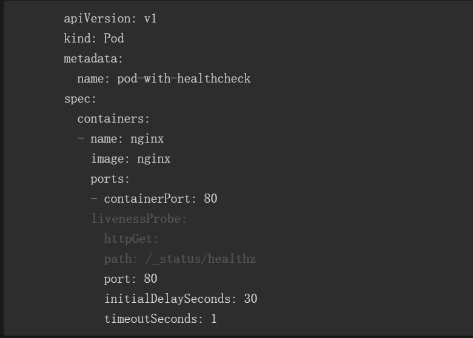

*   initialDelaySeconds：启动容器后进行首次健康检查的等待时间，单位为s。

*   timeoutSeconds：健康检查发送请求后等待响应的超时时间，单位为s。当超时发生时，kubelet会认为容器已经无法提供服务，将会重启该容器。

### 3.6 pod 调度相关：

### 3.7 pod 升级和回滚：

k8s通过滚动升级的方式进行升级。通过更改镜像地址版本号即可完成升级。

升级

```yaml
apiVersion: apps/v1

kind: Deployment

metadata:

  labels:

    app: nginx

  name: nginx

spec:

  replicas: 3

  selector:

    matchLabels:

      app: nginx

  template:

    metadata:

      labels:

        app: nginx

    spec:

      containers:

      - image: nginx:1.7.9

        name: nginx

        ports:

        - containerPort: 80
```

通过命令行升级

```bash
[root@k8s-master deployment]# kubectl  set  image  deployment/nginx   nginx=nginx:1.9.1

deployment.extensions/nginx image updated
```

通过编辑deployment 镜像地址升级。

```bash
[root@k8s-master deployment]# kubectl  get deployment

NAME         READY   UP-TO-DATE   AVAILABLE   AGE

k8s-tomcat   1/1     1            1           72d

nginx        3/3     3            3           6m44s

[root@k8s-master deployment]# kubectl  edit deploy nginx
```

查看更新过程

```bash
[root@k8s-master deployment]# kubectl  rollout status deployment/nginx

Waiting for deployment "nginx" rollout to finish: 1 out of 3 new replicas have been updated...

Waiting for deployment "nginx" rollout to finish: 1 out of 3 new replicas have been updated...

Waiting for deployment "nginx" rollout to finish: 1 out of 3 new replicas have been updated...

Waiting for deployment "nginx" rollout to finish: 2 out of 3 new replicas have been updated...

Waiting for deployment "nginx" rollout to finish: 2 out of 3 new replicas have been updated...

Waiting for deployment "nginx" rollout to finish: 2 out of 3 new replicas have been updated...

Waiting for deployment "nginx" rollout to finish: 1 old replicas are pending termination...

Waiting for deployment "nginx" rollout to finish: 1 old replicas are pending termination...
```

kubectl  describe pod nginx-596f75ffdb-8vq7v 可以查看最新更新的镜像版本。

更新过程描述

```bash
[root@k8s-master deployment]# kubectl  describe deployment  nginx 

Name:                   nginx

Namespace:              default

CreationTimestamp:      Tue, 24 Aug 2021 16:23:36 +0800

Labels:                 app=nginx

Annotations:            deployment.kubernetes.io/revision: 2

Selector:               app=nginx

Replicas:               3 desired | 3 updated | 3 total | 3 available | 0 unavailable

StrategyType:           RollingUpdate

MinReadySeconds:        0

RollingUpdateStrategy:  25% max unavailable, 25% max surge

Pod Template:

  Labels:  app=nginx

  Containers:

   nginx:

    Image:        nginx:1.9.1

    Port:         80/TCP

    Host Port:    0/TCP

    Environment:  <none>

    Mounts:       <none>

  Volumes:        <none>

Conditions:

  Type           Status  Reason

  ----           ------  ------

  Available      True    MinimumReplicasAvailable

  Progressing    True    NewReplicaSetAvailable

OldReplicaSets:  <none>

NewReplicaSet:   nginx-779fcd779f (3/3 replicas created)

Events:

  Type    Reason             Age   From                   Message

  ----    ------             ----  ----                   -------

  Normal  ScalingReplicaSet  22s   deployment-controller  Scaled up replica set nginx-76bf4969df to 3

  Normal  ScalingReplicaSet  6s    deployment-controller  Scaled up replica set nginx-779fcd779f to 1

  Normal  ScalingReplicaSet  4s    deployment-controller  Scaled down replica set nginx-76bf4969df to 2

  Normal  ScalingReplicaSet  4s    deployment-controller  Scaled up replica set nginx-779fcd779f to 2

  Normal  ScalingReplicaSet  2s    deployment-controller  Scaled down replica set nginx-76bf4969df to 1

  Normal  ScalingReplicaSet  2s    deployment-controller  Scaled up replica set nginx-779fcd779f to 3

  Normal  ScalingReplicaSet  1s    deployment-controller  Scaled down replica set nginx-76bf4969df to 0
```

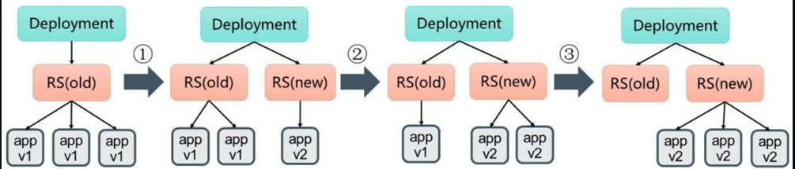

1 创建3个副本（old）

2 更新时，创建1个新的副本，保持2个旧的，剔除1个旧的。

3 更新时，创建2个新的副本，保持1个旧的，剔除2个旧的。

3 更新时，创建3个新的副本，保持0个旧的，剔除3个旧的。

**老版本：**

&#x20;     默认情况下，Deployment确保可用的Pod总数至少为所需的副本数量（DESIRED）减1，也就是最多1个不可用（maxUnavailable=1）。Deployment还需要确保在整个更新过程中Pod的总数量不会超过所需的副本数量太多。在默认情况下，Deployment确保Pod的总数最多比所需的Pod数多1个，也就是最多1个浪涌值（maxSurge=1）。

**Kubernetes从1.6版本：**

&#x20;    开始，maxUnavailable和maxSurge的默认值将从1、1更新为所需副本数量的25%、25%。

**回滚：**

```bash
[root@k8s-master deployment]# kubectl rollout history   deployment/nginx

deployment.extensions/nginx 

REVISION  CHANGE-CAUSE

1         kubectl create --filename=nginx-deployment.yaml --record=true

2         kubectl set image deployment/nginx nginx=nginx:1.9.1 --record=true
```

```bash
kubectl rollout undo  deployment/nginx  --to-revision=2
```

### 3.8 pod 扩缩容：

手动扩容：

1 编辑控制器文件，直接修改副本数。

2 通过命令行修改副本数。

```bash
kubectl  scale deployment nginx --replicas 2
```

自动扩容：

HPA

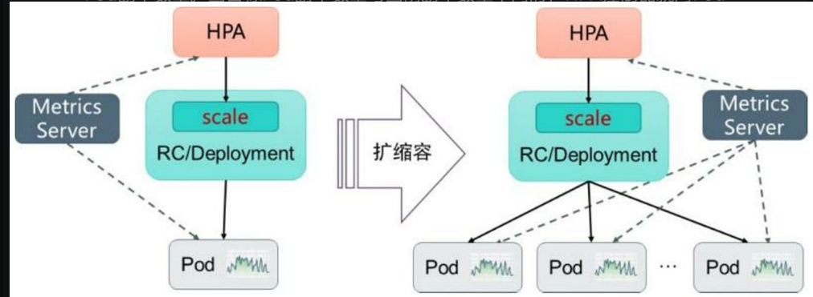

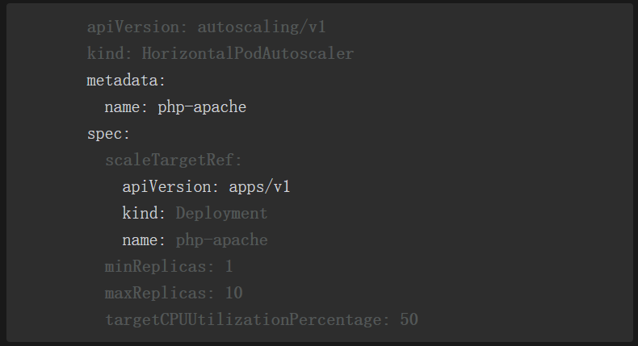

## 四：service

### 4.1  service：

Service一个应用服务抽象，定义了Pod逻辑集合和访问这个Pod集合的策略。

Service代理Pod集合对外表现是为一个访问入口，分配一个集群IP地址，来自这个IP的请求将负载均衡转发后端Pod中的容器。

Service通过LableSelector选择一组Pod提供服务。 在K8s集群中微服务的负载均衡是由Kube-proxy实现的，在K8s的每个节点上都有一个。


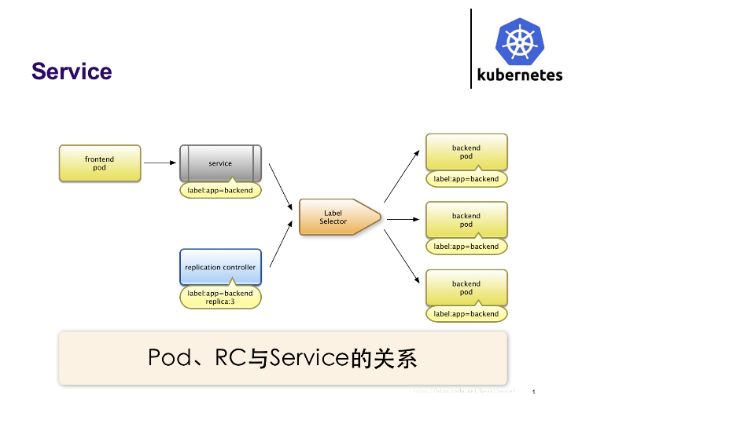

如上图示，每个Pod都提供了一个独立的Endpoint（Pod IP+ContainerPort）以被客户端访问，多个Pod副本组成了一个集群来提供服务，一般的做法是部署一个负载均衡器来访问它们，为这组Pod开启一个对外的服务端口如8000，并且将这些Pod的Endpoint列表加入8000端口的转发列表中，客户端可以通过负载均衡器的对外IP地址+服务端口来访问此服务。运行在Node上的kube-proxy其实就是一个智能的软件负载均衡器，它负责把对Service的请求转发到后端的某个Pod实例上，并且在内部实现服务的负载均衡与会话保持机制。Service不是共用一个负载均衡器的IP地址，而是每个Servcie分配一个全局唯一的虚拟IP地址，这个虚拟IP被称为Cluster IP。

### 4.2 service定义

```yaml
apiVersion: v1            #必须

kind: Service             #必须

metadata:                 #必须

  name: string              #必须

  namespace: string        #必须

  labels:

    - name: string

  annotations:

    - name: string

spec:                   #必须

  selector:            #必须

    key: volume        #必须

  type: string         #必须

  clusterIP: string

  sessionAffinity: string

  ports:

    - name: string

      protocol: string

      port: int

      targetPort: int

      nodePort: int

status:

  loadBalancer:

    ingress:

      ip: string

      hostname: string
```

**样例1**：

```yaml
apiVersion: apps/v1

kind: Deployment

metadata:

  labels:

    app: webapp

  name: webapp

spec:

  replicas: 3

  selector:

    matchLabels:

      app: webapp

  template:

    metadata:

      labels:

        app: webapp

    spec:

      containers:

      - image: tomcat

        name: webapp

        ports:

        - containerPort: 8080
```

命令行创建svc&#x20;

```bash
kubectl  expose deployment  webapp

```

通过yaml文件创建svc

```yaml
apiVersion: v1

kind: Service

metadata:

  labels:

    app: webapp

  name: webapp-8081

  namespace: default

spec:

  ports:

  - port: 8081

    protocol: TCP

    targetPort: 8080

  selector:

    app: webapp

  type: ClusterIP
```

Svc 负载方法：

RoundRobin：轮询模式，即轮询将请求转发到后端的各个Pod上。

&#x20;SessionAffinity：基于客户端IP地址进行会话保持的模式，即第1次将某个客户端发起的请求转发到后端的某个Pod上，之后从相同的客户端发起的请求都将被转发到后端相同的Pod上。

[Kubernetes的三种外部访问方式:NodePort、LoadBalancer 和 Ingress - DockOne.io](http://dockone.io/article/4884 "Kubernetes的三种外部访问方式:NodePort、LoadBalancer 和 Ingress - DockOne.io")

### 4.3 ClusterIP：

ClusterIP 服务是 Kubernetes 的默认服务。它给你一个集群内的服务，集群内的其它应用都可以访问该服务。集群外部无法访问它。

ClusterIP 服务的 YAML 文件类似如下：

```yaml
apiVersion: v1

kind: Service

metadata:  

name: my-internal-service

selector:    

app: my-app

spec:

type: ClusterIP

ports:  

- name: http

port: 80

targetPort: 80

protocol: TCP
```

如果 从Internet 没法访问 ClusterIP 服务，那么我们为什么要讨论它呢？那是因为我们可以通过 Kubernetes 的 proxy 模式来访问该服务！

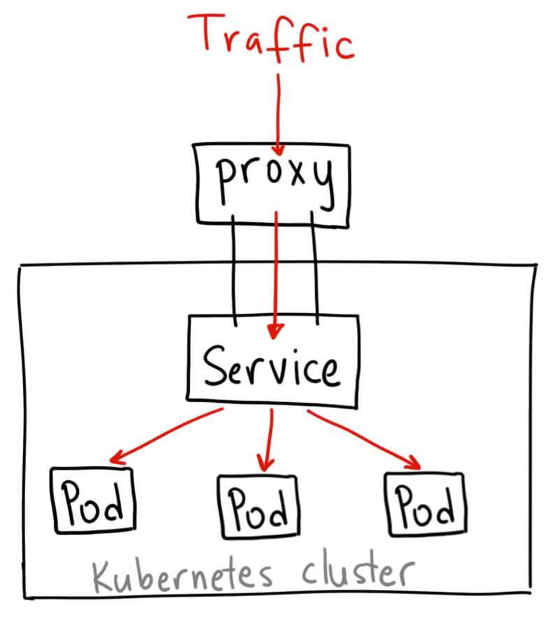

**何时使用：**

有一些场景下，你得使用 Kubernetes 的 proxy 模式来访问你的服务：

由于某些原因，你需要调试你的服务，或者需要直接通过笔记本电脑去访问它们。

容许内部通信，展示内部仪表盘等。

这种方式要求我们运行 kubectl 作为一个未认证的用户，因此我们不能用这种方式把服务暴露到 internet 或者在生产环境使用。

### 4.4 NodePort：

NodePort 服务是引导外部流量到你的服务的最原始方式。NodePort，正如这个名字所示，在所有节点（虚拟机）上开放一个特定端口，任何发送到该端口的流量都被转发到对应服务。

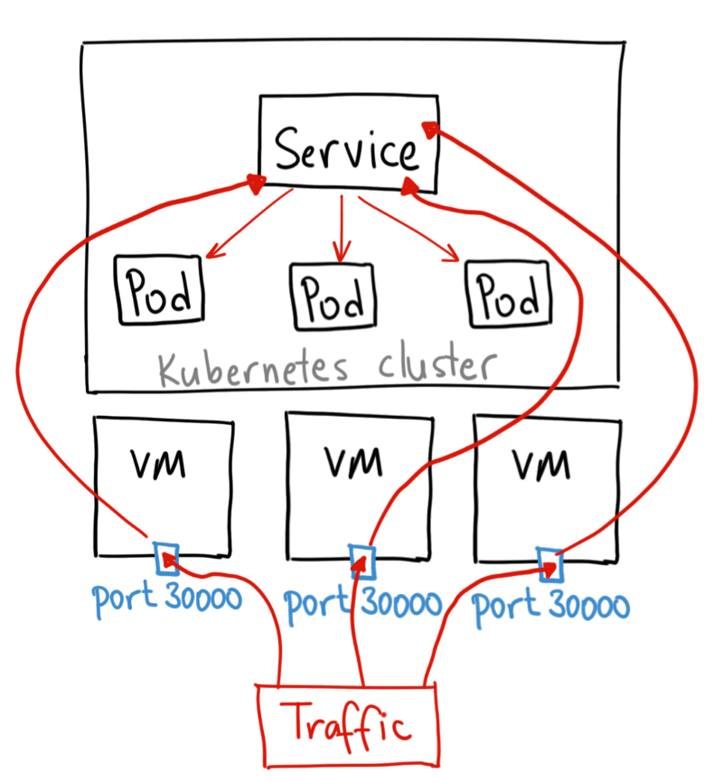

NodePort 服务的 YAML 文件类似如下：

```yaml
apiVersion: v1

kind: Service

metadata:  

name: my-nodeport-service

selector:    

app: my-app

spec:

type: NodePort

ports:  

- name: http

port: 80

targetPort: 80

nodePort: 30036

protocol: TCP
```

NodePort 服务主要有两点区别于普通的“ClusterIP”服务。第一，它的类型是“NodePort”。有一个额外的端口，称为 nodePort，它指定节点上开放的端口值 。如果你不指定这个端口，系统将选择一个随机端口。大多数时候我们应该让 Kubernetes 来选择端口，因为如评论中 thockin 所说，用户自己来选择可用端口代价太大。

**何时使用这种方式？**

这种方法有许多缺点：

每个端口只能是一种服务

端口范围只能是 30000-32767

如果节点/VM 的 IP 地址发生变化，你需要能处理这种情况。

基于以上原因，我不建议在生产环境上用这种方式暴露服务。如果你运行的服务不要求一直可用，或者对成本比较敏感，你可以使用这种方法。这样的应用的最佳例子是 demo 应用，或者某些临时应用。

\*\*4.5 LoadBalancer：
\*\*

LoadBalancer 服务是暴露服务到 internet 的标准方式。在 GKE 上，这种方式会启动一个 [Network Load Balancer](https://cloud.google.com/compute/docs/load-balancing/network/ "Network Load Balancer")，它将给你一个单独的 IP 地址，转发所有流量到你的服务。

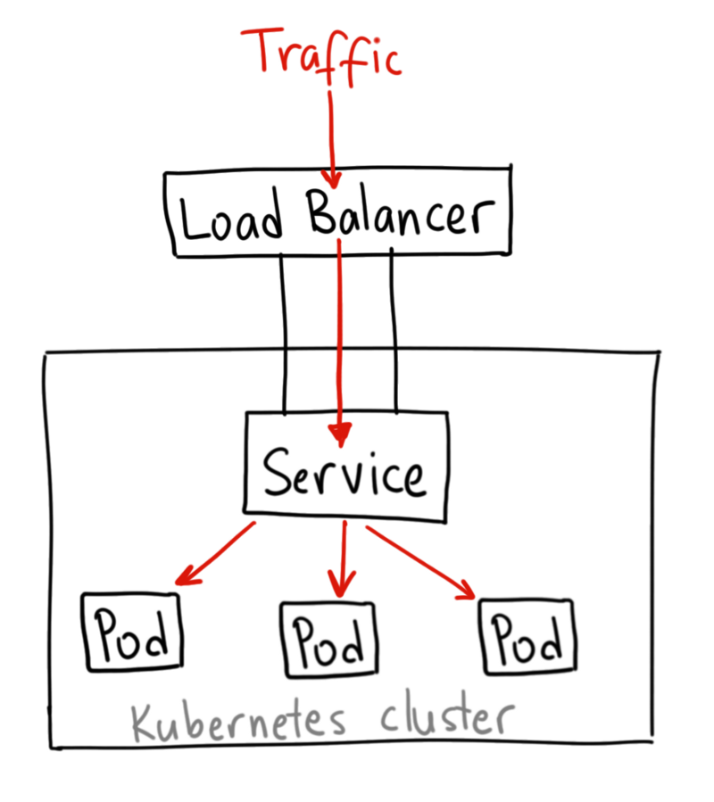

**何时使用**

如果你想要直接暴露服务，这就是默认方式。所有通往你指定的端口的流量都会被转发到对应的服务。它没有过滤条件，没有路由等。这意味着你几乎可以发送任何种类的流量到该服务，像 HTTP，TCP，UDP，Websocket，gRPC 或其它任意种类。

这个方式的最大缺点是每一个用 LoadBalancer 暴露的服务都会有它自己的 IP 地址，每个用到的 LoadBalancer 都需要付费，这将是非常昂贵的。

\*\*4.6 Ingress
\*\*

有别于以上所有例子，Ingress 事实上不是一种服务类型。相反，它处于多个服务的前端，扮演着“智能路由”或者集群入口的角色。

你可以用 Ingress 来做许多不同的事情，各种不同类型的 Ingress 控制器也有不同的能力。

GKE 上的默认 ingress 控制器是启动一个 [HTTP(S) Load Balancer](https://cloud.google.com/compute/docs/load-balancing/http/ "HTTP(S) Load Balancer")。它允许你基于路径或者子域名来路由流量到后端服务。例如，你可以将任何发往域名 foo.yourdomain.com 的流量转到 foo 服务，将路径 yourdomain.com/bar/path 的流量转到 bar 服务。


```yaml
apiVersion: extensions/v1beta1

kind: Ingress

metadata:

name: my-ingress

spec:

backend:

serviceName: other

servicePort: 8080

rules:

- host: foo.mydomain.com

http:

  paths:

  - backend:

      serviceName: foo

      servicePort: 8080

- host: mydomain.com

http:

  paths:

  - path: /bar/*

    backend:

      serviceName: bar

      servicePort: 8080
```

**何时使用**

Ingress 可能是暴露服务的最强大方式，但同时也是最复杂的。Ingress 控制器有各种类型，包括 [Google Cloud Load Balancer](https://cloud.google.com/kubernetes-engine/docs/tutorials/http-balancer "Google Cloud Load Balancer")， [Nginx](https://github.com/kubernetes/ingress-nginx "Nginx")，[Contour](https://github.com/heptio/contour "Contour")，[Istio](https://istio.io/docs/tasks/traffic-management/ingress.html "Istio")，等等。它还有各种插件，比如 [cert-manager](https://github.com/jetstack/cert-manager "cert-manager")，它可以为你的服务自动提供 SSL 证书。

如果你想要使用同一个 IP 暴露多个服务，这些服务都是使用相同的七层协议（典型如 HTTP），那么Ingress 就是最有用的。如果你使用本地的 GCP 集成，你只需要为一个负载均衡器付费，且由于 Ingress是“智能”的，你还可以获取各种开箱即用的特性（比如 SSL，认证，路由，等等）。

## 五：Kubernetes 资源清单

### 5.1 命名空间级别：

| **工作负载型类&#xA;**       | **服务发现&#xA;**     | **配置与存储型资源&#xA;**                | **特殊类型的资源卷&#xA;**                     |
| --------------------- | ----------------- | -------------------------------- | ------------------------------------- |
| replicaset&#xA;&#xA;  | service&#xA;&#xA; | volume(存储卷)CSI(容器存储接口)&#xA;&#xA; | configmap&#xA;&#xA;                   |
| deployment&#xA;&#xA;  | ingress&#xA;&#xA; | &#xA;&#xA;                       | secret&#xA;&#xA;                      |
| statefulset&#xA;&#xA; | &#xA;&#xA;        | &#xA;&#xA;                       | downwardapi（把外部环境中的信息输出给容器）&#xA;&#xA; |
| daemonset&#xA;&#xA;   | &#xA;&#xA;        | &#xA;&#xA;                       | &#xA;&#xA;                            |
| job&#xA;&#xA;         | &#xA;&#xA;        | &#xA;&#xA;                       | &#xA;&#xA;                            |
| cronjob&#xA;&#xA;     | &#xA;&#xA;        | &#xA;&#xA;                       | &#xA;&#xA;                            |

### 5.2 集群型资源：

namespace

node

role

clusterole

rolebinging

### 5.3 常用资源定义：

deployment定义实例

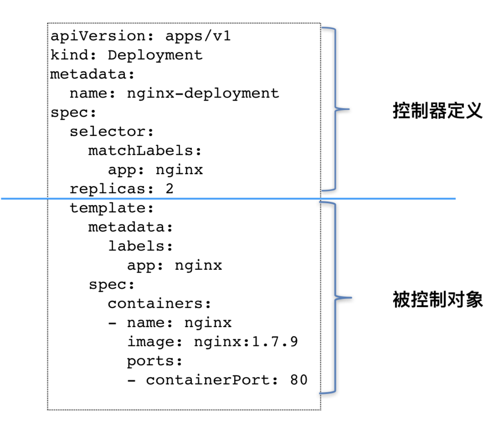

如上图所示，类似 Deployment 这样的一个控制器，实际上都是由上半部分的控制器定义（包括期望状态），加上下半部分的被控制对象的模板组成的。

这个 Deployment 定义的编排动作非常简单，即：确保携带了 app=nginx 标签的 Pod 的个数，永 远等于 spec.replicas 指定的个数，即 2 个。 这就意味着，如果在这个集群中，携带 app=nginx 标签的 Pod 的个数大于 2 的时候，就会有旧的 Pod 被删除；反之，就会有新的 Pod 被创建。

而被控制对象的定义，则来自于一个“模板”。比如，Deployment 里的 template 字段。可以看到，Deployment 这个 template 字段里的内容，跟一的 Pod 对象的 API 定义，丝毫不差。而所有被这个 Deployment 管理的 Pod 实例，其实都是根据这个 template 字段的内容创建出来的。像 Deployment 定义的 template 字段，在 Kubernetes 项目中有一个专有的名字，叫作PodTemplate（Pod 模板）。我们还会看到其他类型的对象模板，比如 Volume 的模板。

## 六：常用命令

*   kubectl get nodes　查看集群中有多少节点

*   kubectl create -f mysql-rc.yaml　创建

*   kubectl apply -f　mysql-rc.yaml　创建或更新&#x20;

*   kubectl delete -f mysql-rc.yaml　删除&#x20;

*   kuberctl delete pods --all 删除所有的pod&#x20;

*   kubectl get rc　查询RC

*   kubectl get pods 查询pod默认空间&#x20;

*   kubectl get pods —all-namespaces　所有空间

*   kubectl get pods --namespace kube-system　指定空间&#x20;

*   Kubectl get pod pod-name -o wide 显示更多信息

*   kubectl get pods  -o wide Kubectl get pod pod-name -o yaml　以yaml格式显示信息&#x20;

*   kubectl get pods -n kube-system | grep -v Running&#x20;

*   kubectl get service　查询service默认空间

*   kubectl get services --namespace kube-system&#x20;

*   kubectl get pods -n kube-system -o wide kubectl get deployments 查看&#x20;

*   kubectl logs -f pods/monitoring-grafana-xxxxxxx -n kube-system

*   kubectl describe node codename　查看节点的详细信息

*   kubectl logs pod-name 查看容器输出到控制台日志&#x20;
