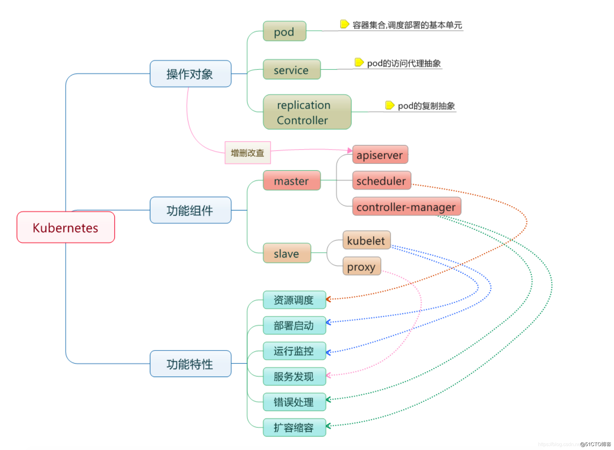
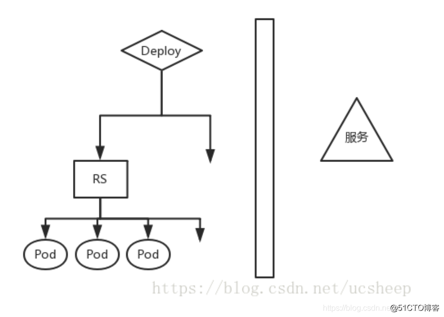
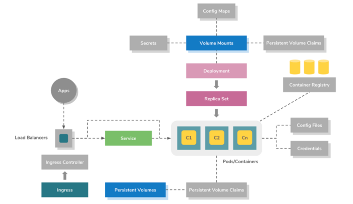
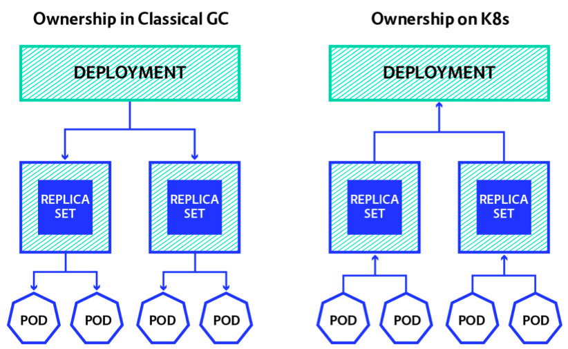

# k8s 基本概念和命令

# Kubernetes 组件


### 控制平面组件（Control Plane Components）

#### kube-apiserver

主节点上负责提供 Kubernetes API 服务的组件；它是 Kubernetes 控制面的前端。
kube-apiserver 在设计上考虑了水平扩缩的需要。 换言之，通过部署多个实例可以实现扩缩。 参见[构造高可用集群](https://v1-18.docs.kubernetes.io/docs/admin/high-availability/ "构造高可用集群")。

#### etcd

etcd 是兼具一致性和高可用性的键值数据库，可以作为保存 Kubernetes 所有集群数据的后台数据库。
您的 Kubernetes 集群的 etcd 数据库通常需要有个备份计划。要了解 etcd 更深层次的信息，请参考 [etcd 文档](https://etcd.io/docs "etcd 文档")。

#### kube-scheduler

主节点上的组件，该组件监视那些新创建的未指定运行节点的 Pod，并选择节点让 Pod 在上面运行。
调度决策考虑的因素包括单个 Pod 和 Pod 集合的资源需求、硬件/软件/策略约束、亲和性和反亲和性规范、数据位置、工作负载间的干扰和最后时限。

#### kube-controller-manager

在主节点上运行[控制器](https://v1-18.docs.kubernetes.io/docs/admin/kube-controller-manager/ "控制器")的组件。
从逻辑上讲，每个[控制器](https://v1-18.docs.kubernetes.io/docs/admin/kube-controller-manager/ "控制器")都是一个单独的进程，但是为了降低复杂性，它们都被编译到同一个可执行文件，并在一个进程中运行。
这些控制器包括:

*   节点控制器（Node Controller）: 负责在节点出现故障时进行通知和响应。

*   副本控制器（Replication Controller）: 负责为系统中的每个副本控制器对象维护正确数量的 Pod。

*   端点控制器（Endpoints Controller）: 填充端点(Endpoints)对象(即加入 Service 与 Pod)。

*   服务帐户和令牌控制器（Service Account & Token Controllers）: 为新的命名空间创建默认帐户和 API 访问令牌.

#### cloud-controller-manager

云控制器管理器是 1.8 的 alpha 特性。在未来发布的版本中，这是将 Kubernetes 与任何其他云集成的最佳方式。
cloud-controller-manager 进运行特定于云平台的控制回路。 如果你在自己的环境中运行 Kubernetes，或者在本地计算机中运行学习环境， 所部属的环境中不需要云控制器管理器。
与 kube-controller-manager 类似，cloud-controller-manager 将若干逻辑上独立的 控制回路组合到同一个可执行文件中，供你以同一进程的方式运行。 你可以对其执行水平扩容（运行不止一个副本）以提升性能或者增强容错能力。
下面的控制器都包含对云平台驱动的依赖：

*   节点控制器（Node Controller）: 用于在节点终止响应后检查云提供商以确定节点是否已被删除

*   路由控制器（Route Controller）: 用于在底层云基础架构中设置路由

*   服务控制器（Service Controller）: 用于创建、更新和删除云提供商负载均衡器

### Node 组件

节点组件在每个节点上运行，维护运行的 Pod 并提供 Kubernetes 运行环境。

#### kubelet

一个在集群中每个节点上运行的代理。它保证容器都运行在 Pod 中。
kubelet 接收一组通过各类机制提供给它的 PodSpecs，确保这些 PodSpecs 中描述的容器处于运行状态且健康。kubelet 不会管理不是由 Kubernetes 创建的容器。

#### kube-proxy

[kube-proxy](https://v1-18.docs.kubernetes.io/docs/reference/command-line-tools-reference/kube-proxy/ "kube-proxy") 是集群中每个节点上运行的网络代理,实现 Kubernetes [Service](https://v1-18.docs.kubernetes.io/zh/docs/concepts/services-networking/service/ "Service") 概念的一部分。
kube-proxy 维护节点上的网络规则。这些网络规则允许从集群内部或外部的网络会话与 Pod 进行网络通信。
如果操作系统提供了数据包过滤层并可用的话，kube-proxy会通过它来实现网络规则。否则，kube-proxy 仅转发流量本身。

#### 容器运行时（Container Runtime）

容器运行环境是负责运行容器的软件。
Kubernetes 支持多个容器运行环境: [Docker](http://www.docker.com/ "Docker")、 [containerd](https://containerd.io/ "containerd")、[cri-o](https://cri-o.io/ "cri-o")、 [rktlet](https://github.com/kubernetes-incubator/rktlet "rktlet") 以及任何实现 [Kubernetes CRI (容器运行环境接口)](https://github.com/kubernetes/community/blob/master/contributors/devel/sig-node/container-runtime-interface.md "Kubernetes CRI (容器运行环境接口)")。

## 对象关系



deploy控制RS，RS控制Pod，这一整套，向外提供稳定可靠的Service。







## 有关POD

**Pod 里的所有容器，共享的是同一个 Network Namespace，并且可以声明共享同一个 Volume**

### POD的生命周期

> 和一个个独立的应用容器一样，Pod 也被认为是相对临时性（而不是长期存在）的实体。 Pod 会被创建、赋予一个唯一的 ID（[UID](https://kubernetes.io/zh/docs/concepts/overview/working-with-objects/names/#uids "UID")）， 并被调度到节点，并在终止（根据重启策略）或删除之前一直运行在该节点。
> 如果一个[节点](https://kubernetes.io/zh/docs/concepts/architecture/nodes/ "节点")死掉了，调度到该节点 的 Pod 也被计划在给定超时期限结束后[删除](https://kubernetes.io/zh/docs/concepts/workloads/pods/pod-lifecycle/#pod-garbage-collection "删除")。

> Pod 自身不具有自愈能力。如果 Pod 被调度到某[节点](https://kubernetes.io/zh/docs/concepts/architecture/nodes/ "节点") 而该节点之后失效，或者调度操作本身失效，Pod 会被删除；与此类似，Pod 无法在节点资源 耗尽或者节点维护期间继续存活。Kubernetes 使用一种高级抽象，称作 [控制器](https://kubernetes.io/zh/docs/concepts/architecture/controller/ "控制器")，来管理这些相对而言 可随时丢弃的 Pod 实例。

> 任何给定的 Pod （由 UID 定义）从不会被“重新调度（rescheduled）”到不同的节点； 相反，这一 Pod 可以被一个新的、几乎完全相同的 Pod 替换掉。 如果需要，新 Pod 的名字可以不变，但是其 UID 会不同。

> 如果某物声称其生命期与某 Pod 相同，例如存储[卷](https://kubernetes.io/zh/docs/concepts/storage/volumes/ "卷")， 这就意味着该对象在此 Pod （UID 亦相同）存在期间也一直存在。 如果 Pod 因为任何原因被删除，甚至某完全相同的替代 Pod 被创建时， 这个相关的对象（例如这里的卷）也会被删除并重建。

POD中的容器可以是多个，但POD中的所有容器会跟随POD一起被调度到同一台机器上，而不可能把多个容器调度到多个机器节点上。

### 删除POD

[https://www.cnblogs.com/effortsing/p/10496547.html](https://www.cnblogs.com/effortsing/p/10496547.html "https://www.cnblogs.com/effortsing/p/10496547.html")

### 查看 Pod 中的容器详情

```bash
# Use 'kubectl describe pod/gl-app-activity-apprentice-54f5db9c9d-qltsd -n glzh-dev' to see all of the containers in this pod.


kubectl describe pod/gl-app-activity-apprentice-54f5db9c9d-qltsd -n glzh-dev

# 列出pod 中的所有容器
kubectl get pods -n glzh-dev -o=jsonpath="{.items[*].spec.containers[*].image}" -l app=gl-app-order | tr -s '[[:space:]]' '\n' | sort
```

### 进入 POD

```bash
## 进入pod
kubectl exec -it my-pod  -- /bin/bash
## 进入container
kubectl exec -it my-pod --container main-app -- /bin/bash
```

## 有关 DNS

kubedns 的 Service 的 ClusterIP，这个IP是虚拟IP，无法ping，但可以访问。

Kubernetes 中，域名的全称，必须是 `service-name.namespace.svc.cluster.local` 这种模式，服务名，就是Kubernetes中 Service 的名称。

查看容器内域名解析情况：

```bash
kubectl exec gl-app-activity-apprentice-54f5db9c9d-qltsd -- /bin/bash -c "cat /etc/resolv.conf"
```

*   普通的 Service：会生成 servicename.namespace.svc.cluster.local 的域名，会解析到 Service 对应的 ClusterIP 上，在 Pod 之间的调用可以简写成 servicename.namespace，如果处于同一个命名空间下面，甚至可以只写成 servicename 即可访问

*   Headless Service：无头服务，就是把 clusterIP 设置为 None 的，会被解析为指定 Pod 的 IP 列表，同样还可以通过  podname.servicename.namespace.svc.cluster.local 访问到具体的某一个 Pod。

参考：[https://hansedong.github.io/2018/11/20/9/](https://hansedong.github.io/2018/11/20/9/ "https://hansedong.github.io/2018/11/20/9/")

## 有关 statefulset

**pod 名称后面会跟一个整数序号**

对于具有 N 个副本的 StatefulSet，StatefulSet 中的每个 Pod 将被分配一个**整数序号**， 从 0 到 N-1，该序号在 StatefulSet 上是唯一的。出自： [https://kubernetes.io/zh/docs/concepts/workloads/controllers/statefulset/](https://kubernetes.io/zh/docs/concepts/workloads/controllers/statefulset/ "https://kubernetes.io/zh/docs/concepts/workloads/controllers/statefulset/")

## 资源管理常用命令

[https://kubernetes.io/zh/docs/concepts/cluster-administration/manage-deployment/](https://kubernetes.io/zh/docs/concepts/cluster-administration/manage-deployment/ "https://kubernetes.io/zh/docs/concepts/cluster-administration/manage-deployment/")


## 参考

*   [https://blog.51cto.com/shijianfeng/2914911](https://blog.51cto.com/shijianfeng/2914911 "https://blog.51cto.com/shijianfeng/2914911")
