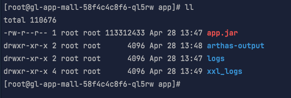
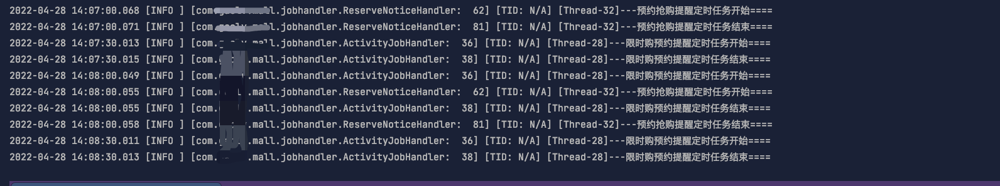
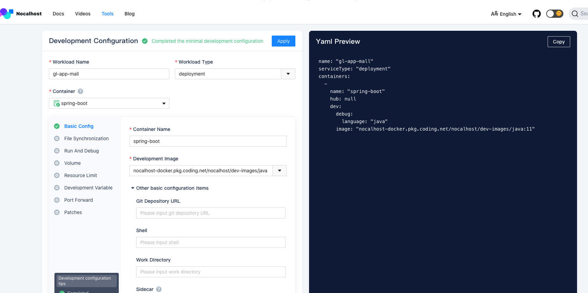

# nocalhost

[https://www.daxiblog.com/云原生环境是使用nocalhost开发调试spring-boot应用/](https://www.daxiblog.com/云原生环境是使用nocalhost开发调试spring-boot应用/ "https://www.daxiblog.com/云原生环境是使用nocalhost开发调试spring-boot应用/")

## 功能介绍

### open remote terminal&#x20;

打开远程控制台

这样不用打开 kubernetes  `dashboard`  就可以进入容器敲命令了。

### view logs&#x20;

查看日志（动态查看，类似 `tail -f` ）

### Dev Config&#x20;

提供一个工具可以利用GUI 配置应用容器 [https://nocalhost.dev/tools](https://nocalhost.dev/tools "https://nocalhost.dev/tools")

