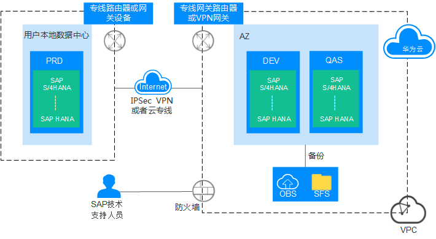
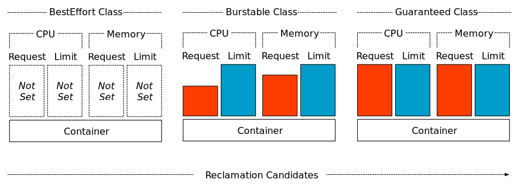

# 在线离线作业混合部署

#### 在线作业与离线作业

从业务是否一直在线的角度看，其类型可分为在线作业和离线作业。

*   **在线作业**：一般运行时间长，服务流量呈周期性，资源存在潮汐现象，但对服务SLA要求较高，如广告业务、电商业务等。

*   **离线作业**：往往运行时间短，计算需求大，可容忍较高的时延，如AI/大数据业务。

## k8s的 QoS

[**QoS（Quality of Service**](https://kubernetes.io/zh/docs/tasks/configure-pod-container/quality-service-pod/ "QoS（Quality of Service")**）**，大部分译为 “**服务质量等级**”，又译作 “服务质量保证”，是作用在 Pod 上的一个配置，当 Kubernetes 创建一个 Pod 时，它就会给这个 Pod 分配一个 QoS 等级。

我们使用的QoS等级主要有以下三个，他们所决定Pod的重要程度从上到下依次递减。

*   **Guaranteed**：Pod 里的每个容器都必须有内存/CPU 限制和请求，而且值必须相等。如果一个容器只指明limit而未设定request，则request的值等于limit值，是最严格的要求。

*   **Burstable**：Pod 里至少有一个容器有内存或者 CPU 请求且不满足 Guarantee 等级的要求，即内存/CPU 的值设置的不同。或者可以这么表达：在不满足Guaranteed的情况下，至少设置一个CPU或者内存的请求。

*   **BestEffort**：容器必须没有任何内存或者 CPU 的限制或请求，就很佛系。

那么QoS的作用体现在哪呢？我们举个例子，比方说计算机中的内存和磁盘资源是不可以被压缩的，而当资源紧俏时，kubelet会根据资源对象的QoS进行驱逐：

*   Guaranteed，最高优先级，最后kill。除非超过limit或者没有其他低优先级的Pod。

*   Burstable，第二个被kill。

*   BestEffort，最低优先级，第一个被kill。

这也就意味着如果一个Node中的内存和磁盘资源被多个Pod给抢占了，那么QoS为`BestEffort`的Pod显然是第一个被kill的。那么说到这里，想必各位读者对于上一节中存在的问题应该如何解决想必已经有了答案。我们在实际部署的时候，**可以把在线服务所使用的Pod的QoS设置为**\*\*\*\*\*\*，这样就避免了负载过大的离线任务占用过多资源把我们的在线Pod给挤掉的情况。\*\*

## 参考

*   [https://support.huaweicloud.com/usermanual-cce/cce\_01\_0384.html](https://support.huaweicloud.com/usermanual-cce/cce_01_0384.html "https://support.huaweicloud.com/usermanual-cce/cce_01_0384.html")

*   [https://blog.csdn.net/qq\_44584356/article/details/105014443?share\_token=52BF3115-0219-40D9-B916-8166C89E05D7\&tt\_from=weixin\&utm\_source=weixin\&utm\_medium=toutiao\_ios\&utm\_campaign=client\_share\&wxshare\_count=1](https://blog.csdn.net/qq_44584356/article/details/105014443?share_token=52BF3115-0219-40D9-B916-8166C89E05D7\&tt_from=weixin\&utm_source=weixin\&utm_medium=toutiao_ios\&utm_campaign=client_share\&wxshare_count=1 "https://blog.csdn.net/qq_44584356/article/details/105014443?share_token=52BF3115-0219-40D9-B916-8166C89E05D7\&tt_from=weixin\&utm_source=weixin\&utm_medium=toutiao_ios\&utm_campaign=client_share\&wxshare_count=1")

*   [https://help.aliyun.com/document\_detail/156239.html](https://help.aliyun.com/document_detail/156239.html "https://help.aliyun.com/document_detail/156239.html")

*   [https://help.aliyun.com/document\_detail/151991.html](https://help.aliyun.com/document_detail/151991.html "https://help.aliyun.com/document_detail/151991.html")
