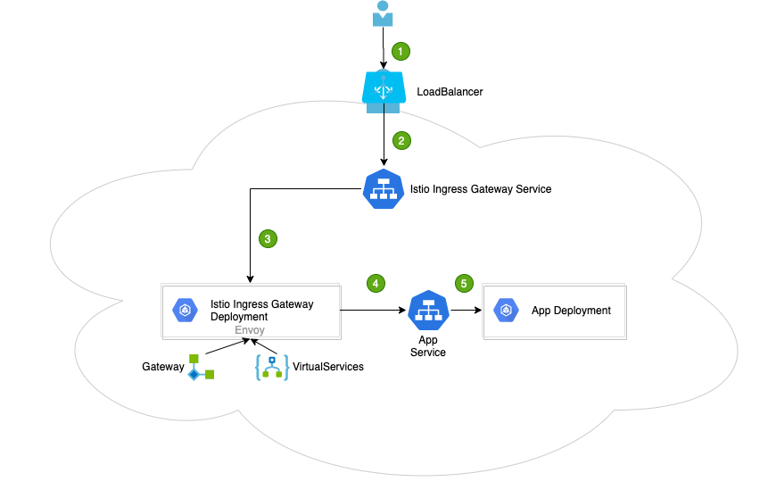

# istio 基础知识

## Istio 的架构分为控制平面和数据平面。

*   **数据平面**：由一组智能代理（Envoy）以 sidecar 模式部署，协调和控制所有服务之间的网络通信。

*   **控制平面**：负责管理和配置代理路由流量，以及在运行时执行的政策。

## 组件

*   istio-polit:服务发现，向数据平面下发规则，包括VirtualService、DestinationRule、Gateway、ServicEntry等流量治理规则，也包括认证授权等安全规则。

*   istio-telemetry:专门收集遥测数据的mixer服务组件。

*   Istio-policy:另外一个mixer服务，可以对接如配额、授权、黑白名单等不同的控制后端，对服务间的访问进行控制。

*   Istio-citadel:核心安全组件，提供了自动生成、分发、轮换与撤销秘钥和证书的功能。

*   Istio-galley:配置管理的组件，验证配置信息的格式和内容的正确性，并将这些配置信息提供给管理面的Pilot和Mixer使用。

*   Istio-sidecar-injector:负责自动注入的组件。

*   Istio-proxy:数据面的轻量代理。

*   Istio-ingressgateway:入口处的gateway。

## sidecar 容器

*   在k8s1.18 之前，这两种容器从k8s管理的角度来看，并没有什么区别。只不过人为从功能上做了区分。

### istio sidecar

istio默认sidecar注入规则是，namespace带有标签**istio-injection: enabled**才会注入sidecar

```bash
#查看 namespace 下的 istio-injection 标签 
kubectl get namespace -L istio-injection

NAME                 STATUS   AGE     ISTIO-INJECTION
cicd                 Active   88d     
default              Active   457d    enabled
devops               Active   400d    
gitlab               Active   114d    
glzh-dev             Active   450d    enabled
glzh-test            Active   402d    enabled
istio-system         Active   457d    disabled
kube-node-lease      Active   422d    
kube-public          Active   457d    
kube-system          Active   457d    
kube-users           Active   3d11h   
logging              Active   422d    
monitoring           Active   420d    
ops                  Active   213d    
voting-app-env-dev   Active   2d19h   
voting-app-env-qa    Active   2d19h   
zadig                Active   7d1h 
```

默认是没有设置的，可以通过以下命令设置

```bash
kubectl label namespace default istio-injection=enabled --overwrite
```

如果POD配置了注解、neverInjectSelector/alwaysInjectSelector也都配置了，默认策略也配置了，那么他们之间的优先级参考如下：

Pod Annotations → NeverInjectSelector → AlwaysInjectSelector → Default Policy
\[

]\([https://blog.csdn.net/wzy\_168/article/details/103694078](https://blog.csdn.net/wzy_168/article/details/103694078 "https://blog.csdn.net/wzy_168/article/details/103694078"))
[https://blog.csdn.net/wzy\_168/article/details/103694078](https://blog.csdn.net/wzy_168/article/details/103694078 "https://blog.csdn.net/wzy_168/article/details/103694078")

#### 动态准入 WEB hook

Istio 使用 ValidatingAdmissionWebhooks 验证 Istio 配置，使用 MutatingAdmissionWebhooks 自动将 Sidecar 代理注入至用户 Pod。

[https://istio.io/latest/zh/docs/ops/configuration/mesh/webhook/](https://istio.io/latest/zh/docs/ops/configuration/mesh/webhook/ "https://istio.io/latest/zh/docs/ops/configuration/mesh/webhook/")

#### 注入原理

两种方法

*   手动  手动注入直接修改配置，如 deployment，并将代理配置注入其中。

*   自动  当 pod 所属namespace启用自动注入后，自动注入器会使用准入控制器在创建 Pod 时自动注入代理配置。

init 初始化容器

istio-init 用于设置 iptables 规则，以便将入站/出站流量通过 Sidecar 代理

该容器存在的意义就是让 sidecar 代理可以拦截所有的进出 pod 的流量，15090 端口（Mixer 使用）和 15092 端口（Ingress Gateway）除外的所有入站（inbound）流量重定向到 15006 端口（sidecar），再拦截应用容器的出站（outbound）流量经过 sidecar 处理（通过 15001 端口监听）后再出站。关于 Istio 中端口用途请参考 [Istio 官方文档](https://istio.io/zh/docs/ops/deployment/requirements/ "Istio 官方文档")。

```yaml
apiVersion: v1
kind: Pod
metadata:
  annotations:
    prometheus.io/path: /v1/message/actuator/prometheus
    prometheus.io/port: "8800"
    prometheus.io/scrape: "true"
    sidecar.istio.io/inject: "true"
    sidecar.istio.io/proxyCPU: 10m
    sidecar.istio.io/status: '{"version":"e606374caf7d0b5a4483bb4f35ceed164e8f85e7d18efc285dad0665da4eff32","initContainers":["istio-init"],"containers":["istio-proxy"],"volumes":["istio-envoy","istio-certs"],"imagePullSecrets":null}'
  creationTimestamp: "2021-08-19T09:30:11Z"
  generateName: gl-bs-message-65dcd76cbb-
  labels:
    app: gl-bs-message
    group: backend
    lang: java
    pod-template-hash: 65dcd76cbb
    version: v1
  name: gl-bs-message-65dcd76cbb-5fg7d
  namespace: glzh-dev
  ownerReferences:
  - apiVersion: apps/v1
    blockOwnerDeletion: true
    controller: true
    kind: ReplicaSet
    name: gl-bs-message-65dcd76cbb
    uid: 83c52a49-2241-45aa-9eb4-6f34aa0f4ed8
  resourceVersion: "152458914"
  selfLink: /api/v1/namespaces/glzh-dev/pods/gl-bs-message-65dcd76cbb-5fg7d
  uid: 13560a86-b369-4dbc-9e0e-f4d452527a28
spec:
  containers:
  - env:
    - name: BUILD_NUMBER
      value: "335"
    - name: NODE_NAME
      valueFrom:
        fieldRef:
          apiVersion: v1
          fieldPath: spec.nodeName
    - name: APP_NAME
      valueFrom:
        fieldRef:
          apiVersion: v1
          fieldPath: metadata.labels['app']
    - name: POD_NAME
      valueFrom:
        fieldRef:
          apiVersion: v1
          fieldPath: metadata.name
    - name: POD_NAMESPACE
      valueFrom:
        fieldRef:
          apiVersion: v1
          fieldPath: metadata.namespace
    - name: POD_IP
      valueFrom:
        fieldRef:
          apiVersion: v1
          fieldPath: status.podIP
    - name: JAVA_OPTS
    - name: SPRING_PROFILES_ACTIVE
      value: dev
    - name: TZ
      value: Asia/Shanghai
    image: swr.cn-north-4.myhuaweicloud.com/glzh-dev/gl-bs-message:f1b36e8f
    imagePullPolicy: Always
    lifecycle:
      preStop:
        exec:
          command:
          - curl
          - -X POST
          - http://127.0.0.1:8800/v1/message/actuator/shutdown
    livenessProbe:
      failureThreshold: 2
      httpGet:
        path: /v1/message/actuator/health
        port: 8800
        scheme: HTTP
      initialDelaySeconds: 60
      periodSeconds: 5
      successThreshold: 1
      timeoutSeconds: 1
    name: spring-boot
    readinessProbe:
      failureThreshold: 3
      httpGet:
        path: /v1/message/actuator/health
        port: 8800
        scheme: HTTP
      periodSeconds: 2
      successThreshold: 3
      timeoutSeconds: 1
    resources:
      limits:
        cpu: "1"
        memory: 1Gi
      requests:
        cpu: 10m
        memory: 256Mi
    terminationMessagePath: /dev/termination-log
    terminationMessagePolicy: File
    volumeMounts:
    - mountPath: /app/logs
      name: log-volume
      subPathExpr: $(POD_NAMESPACE)/$(APP_NAME)/$(POD_NAME)
    - mountPath: /var/run/secrets/kubernetes.io/serviceaccount
      name: default-token-2lf9r
      readOnly: true
  - args:
    - proxy
    - sidecar
    - --domain
    - $(POD_NAMESPACE).svc.cluster.local
    - --configPath
    - /etc/istio/proxy
    - --binaryPath
    - /usr/local/bin/envoy
    - --serviceCluster
    - gl-bs-message.$(POD_NAMESPACE)
    - --drainDuration
    - 45s
    - --parentShutdownDuration
    - 1m0s
    - --discoveryAddress
    - istio-pilot.istio-system:15011
    - --zipkinAddress
    - zipkin.istio-system:9411
    - --proxyLogLevel=warning
    - --proxyComponentLogLevel=misc:error
    - --connectTimeout
    - 10s
    - --proxyAdminPort
    - "15000"
    - --concurrency
    - "2"
    - --controlPlaneAuthPolicy
    - MUTUAL_TLS
    - --dnsRefreshRate
    - 300s
    - --statusPort
    - "15020"
    - --applicationPorts
    - ""
    - --controlPlaneBootstrap=false
    env:
    - name: POD_NAME
      valueFrom:
        fieldRef:
          apiVersion: v1
          fieldPath: metadata.name
    - name: POD_NAMESPACE
      valueFrom:
        fieldRef:
          apiVersion: v1
          fieldPath: metadata.namespace
    - name: INSTANCE_IP
      valueFrom:
        fieldRef:
          apiVersion: v1
          fieldPath: status.podIP
    - name: HOST_IP
      valueFrom:
        fieldRef:
          apiVersion: v1
          fieldPath: status.hostIP
    - name: ISTIO_META_POD_NAME
      valueFrom:
        fieldRef:
          apiVersion: v1
          fieldPath: metadata.name
    - name: ISTIO_META_CONFIG_NAMESPACE
      valueFrom:
        fieldRef:
          apiVersion: v1
          fieldPath: metadata.namespace
    - name: ISTIO_META_INTERCEPTION_MODE
      value: REDIRECT
    - name: ISTIO_META_INCLUDE_INBOUND_PORTS
    - name: ISTIO_METAJSON_ANNOTATIONS
      value: |
        {"prometheus.io/path":"/v1/message/actuator/prometheus","prometheus.io/port":"8800","prometheus.io/scrape":"true","sidecar.istio.io/inject":"true","sidecar.istio.io/proxyCPU":"10m"}
    - name: ISTIO_METAJSON_LABELS
      value: |
        {"app":"gl-bs-message","group":"backend","lang":"java","pod-template-hash":"65dcd76cbb","version":"v1"}
    image: 100.125.0.78:20202/istio/proxyv2:1.3.0-r6
    imagePullPolicy: Always
    name: istio-proxy
    ports:
    - containerPort: 15090
      name: http-envoy-prom
      protocol: TCP
    readinessProbe:
      failureThreshold: 30
      httpGet:
        path: /healthz/ready
        port: 15020
        scheme: HTTP
      initialDelaySeconds: 1
      periodSeconds: 2
      successThreshold: 1
      timeoutSeconds: 1
    resources:
      requests:
        cpu: 10m
    securityContext:
      readOnlyRootFilesystem: true
      runAsGroup: 1337
      runAsUser: 1337
    terminationMessagePath: /dev/termination-log
    terminationMessagePolicy: File
    volumeMounts:
    - mountPath: /etc/istio/proxy
      name: istio-envoy
    - mountPath: /etc/certs/
      name: istio-certs
      readOnly: true
    - mountPath: /var/run/secrets/kubernetes.io/serviceaccount
      name: default-token-2lf9r
      readOnly: true
  dnsConfig:
    options:
    - name: timeout
      value: "2"
    - name: ndots
      value: "5"
    - name: single-request-reopen
  dnsPolicy: ClusterFirst
  enableServiceLinks: true
  imagePullSecrets:
  - name: default-secret
  initContainers:
  - command:
    - /usr/local/bin/istio-iptables.sh
    - -p
    - "15001"
    - -z
    - "15006"
    - -u
    - "1337"
    - -m
    - REDIRECT
    - -i
    - '*'
    - -x
    - ""
    - -b
    - ""
    - -d
    - "15020"
    image: 100.125.0.78:20202/istio/proxy_init:1.3.0-r6
    imagePullPolicy: Always
    name: istio-init
    resources:
      limits:
        cpu: 100m
        memory: 50Mi
      requests:
        cpu: 10m
        memory: 10Mi
    securityContext:
      capabilities:
        add:
        - NET_ADMIN
      runAsNonRoot: false
      runAsUser: 0
    terminationMessagePath: /dev/termination-log
    terminationMessagePolicy: File
    volumeMounts:
    - mountPath: /var/run/secrets/kubernetes.io/serviceaccount
      name: default-token-2lf9r
      readOnly: true
  nodeName: 10.20.7.125
  priority: 0
  restartPolicy: Always
  schedulerName: default-scheduler
  securityContext: {}
  serviceAccount: default
  serviceAccountName: default
  terminationGracePeriodSeconds: 30
  tolerations:
  - effect: NoExecute
    key: node.kubernetes.io/not-ready
    operator: Exists
    tolerationSeconds: 300
  - effect: NoExecute
    key: node.kubernetes.io/unreachable
    operator: Exists
    tolerationSeconds: 300
  volumes:
  - hostPath:
      path: /var/log/k8s
      type: DirectoryOrCreate
    name: log-volume
  - name: default-token-2lf9r
    secret:
      defaultMode: 420
      secretName: default-token-2lf9r
  - emptyDir:
      medium: Memory
    name: istio-envoy
  - name: istio-certs
    secret:
      defaultMode: 420
      optional: true
      secretName: istio.default
status:
  conditions:
  - lastProbeTime: null
    lastTransitionTime: "2021-08-23T01:52:24Z"
    status: "True"
    type: Initialized
  - lastProbeTime: null
    lastTransitionTime: "2021-08-19T09:30:58Z"
    status: "True"
    type: Ready
  - lastProbeTime: null
    lastTransitionTime: "2021-08-19T09:30:58Z"
    status: "True"
    type: ContainersReady
  - lastProbeTime: null
    lastTransitionTime: "2021-08-19T09:30:11Z"
    status: "True"
    type: PodScheduled
  containerStatuses:
  - containerID: docker://2df09196413fa405bed2a017104ee1fd8df19bd395b9bdeeb2fcca51c409a23e
    image: 100.125.0.78:20202/istio/proxyv2:1.3.0-r6
    imageID: docker-pullable://100.125.0.78:20202/istio/proxyv2@sha256:88937c34bfb1fc49ca2d1ff76fbe1faed16f5aefccf4319d127fc861f4ee595d
    lastState: {}
    name: istio-proxy
    ready: true
    restartCount: 0
    state:
      running:
        startedAt: "2021-08-19T09:30:24Z"
  - containerID: docker://bc3e4f7f1c4d4a4e339aca272dde0f92fbdd7792913a78175bf4a974fcc73713
    image: swr.cn-north-4.myhuaweicloud.com/glzh-dev/gl-bs-message:f1b36e8f
    imageID: docker-pullable://swr.cn-north-4.myhuaweicloud.com/glzh-dev/gl-bs-message@sha256:04ac249a6e2f85e78d567049261ca7b57ab7c6f468d77c8010b57c437e4a0cb4
    lastState: {}
    name: spring-boot
    ready: true
    restartCount: 0
    state:
      running:
        startedAt: "2021-08-19T09:30:23Z"
  hostIP: 10.20.7.125
  initContainerStatuses:
  - containerID: docker://be87a5d058add2867fbe1dd4e2946f9dba7bdbdd29e5e1a958cbf824f694a6a0
    image: 100.125.0.78:20202/istio/proxy_init:1.3.0-r6
    imageID: docker-pullable://100.125.0.78:20202/istio/proxy_init@sha256:65bb8f75fb0eac708735b894a3f31b43f15ee8e731d02b2911238845cb71aeab
    lastState: {}
    name: istio-init
    ready: true
    restartCount: 0
    state:
      terminated:
        containerID: docker://be87a5d058add2867fbe1dd4e2946f9dba7bdbdd29e5e1a958cbf824f694a6a0
        exitCode: 0
        finishedAt: "2021-08-23T01:52:13Z"
        reason: Completed
        startedAt: "2021-08-23T01:52:12Z"
  phase: Running
  podIP: 172.16.0.56
  podIPs:
  - ip: 172.16.0.56
  qosClass: Burstable
  startTime: "2021-08-19T09:30:11Z"
```

**自动注入**

**总结：可以看到，整个注入过程实际就是原本的Pod配置反解析成Pod对象，把需要注入的Yaml内容(如:Sidecar)反序列成对象然后append到对应Pod (如：Container)上，然后再把修改后的Pod重新解析成yaml 内容返回给k8s的api server，然后k8s 拿着修改后内容再将这两个容器调度到同一台机器进行部署，至此就完成了对应Sidecar的注入。**


# istio gateway



基于istio的网关选型：

*   [https://zhaohuabing.com/post/2019-03-29-how-to-choose-ingress-for-service-mesh/](https://zhaohuabing.com/post/2019-03-29-how-to-choose-ingress-for-service-mesh/ "https://zhaohuabing.com/post/2019-03-29-how-to-choose-ingress-for-service-mesh/")

*   [https://www.servicemesher.com/blog/service-mesh-and-api-gateway/](https://www.servicemesher.com/blog/service-mesh-and-api-gateway/ "https://www.servicemesher.com/blog/service-mesh-and-api-gateway/")

## 参考

*   [https://www.cnblogs.com/haoyunlaile/p/12960441.html](https://www.cnblogs.com/haoyunlaile/p/12960441.html "https://www.cnblogs.com/haoyunlaile/p/12960441.html")
