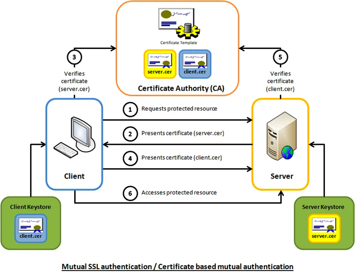
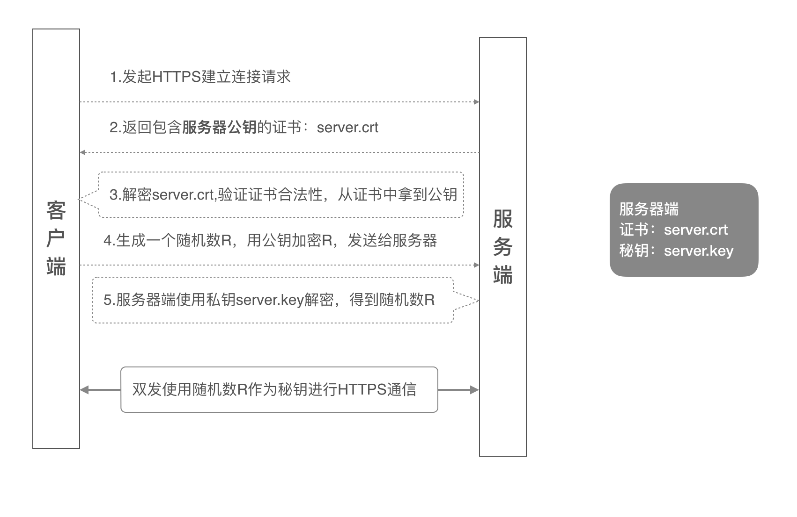
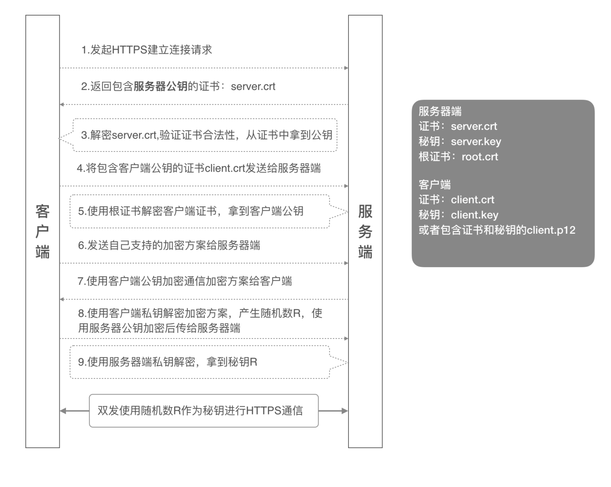
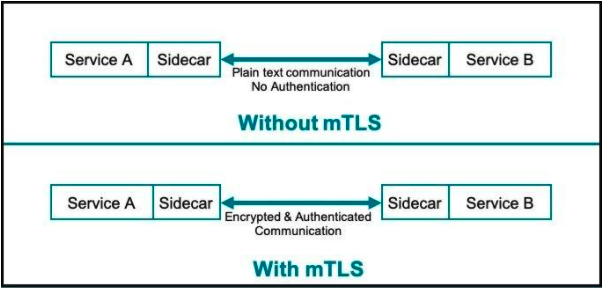
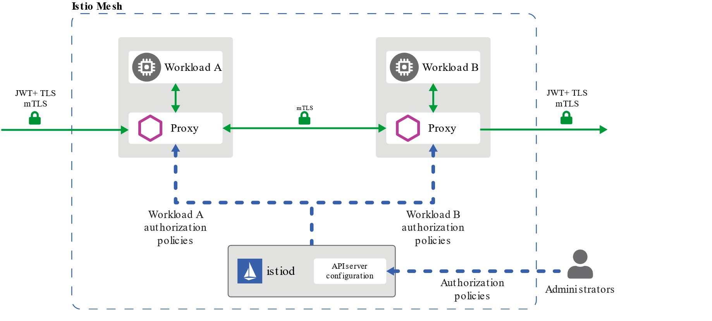
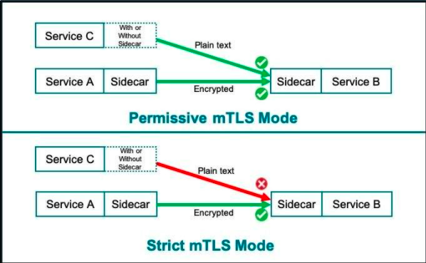

# mTLS

## 什么是 mTLS？

> **双向TLS（mTLS）是指在服务器端和客户端之间使用双向加密通道。如今，mTLS是确保云原生应用程序中微服务之间的通信安全的首选协议。**

在一个典型的 Kubernetes 集群中，加密的流量进入集群，经过一个负载均衡器终止 TLS 连接，从而产生解密的流量。然后，解密的流量被发送到集群内的相关服务。由于集群内的流量通常被认为是安全的，对于许多用例，这是一个可以接受的方法。

但对于某些用例，如处理个人身份信息（PII），可能需要额外的保护。在这些情况下，我们希望确保 **所有的** 网络流量，甚至同一集群内的流量，都是加密的。这为防止窥探（读取传输中的数据）和欺骗（伪造数据来源）攻击提供了额外保障。这可以帮助减轻系统中其他缺陷的影响。

如果手动实现这个完整的数据传输加密系统的话，需要对集群中的每个应用程序进行大规模改造。你需要告诉所有的应用程序终止自己的 TLS 连接，为所有的应用程序颁发证书，并为所有的应用程序添加一个新的证书颁发机构。

## 原理

### 单向认证流程

单向认证流程中，服务器端保存着公钥证书和私钥两个文件，整个握手过程如下：

### 双向认证流程

## istio 中的 mTLS

**Istio可能是最著名的，功能丰富且成熟的服务网格控制平面，它可以提供安全的服务到服务通信，而无需更改任何应用程序代码**

从mTLS角度来看，Istio和所有服务网格控制平面必须提供：

*   处理证书签名和管理的证书颁发机构。

*   一个API配置服务器，用于将通信策略（例如身份验证策略，授权策略和安全命名信息）分发到代理。

控制平面将证书和授权策略分发到Sidecar。当两个微服务需要通信时，Sidecar会建立一个安全的代理链接，并负责加密通过它的流量。

Istio 的安全功能主要包括以下几个部分的实现： &#x20;

*   双向 TLS 支持。 &#x20;

*   基于黑白名单的访问控制。&#x20;

*   &#x20;基于角色的访问控制。

双向 tls支持主要针对通信方面，将明文传输的服务通信，转换为 Envoy 之间的加密通信。这一安全设置可以在全局、Namespace 或者单个服务的范围内生效。 &#x20;

认证策略是对服务收到的请求生效，要在双向 tls 中指定客户端认证策略，需要在DetinationRule 中设置 TLSSettings，每个认证策略需要和目的地规则共同生效。

上图源引[Istio官网](https://istio.io/docs/concepts/security/authz.svg "Istio官网") ，图中非常明确的表示 [Istio](https://www.servicemesher.com/istio-handbook/GLOSSARY.html#istio "Istio") 所希望的是在网格中能够使用 mTLS 进行授权，而在网格外使用 JWT+mTLS 进行授权。服务间身份认证是使用 mTLS，来源身份验证中则是使用 JWT。

**Istio支持三种mTLS模式**，使你可以控制微服务在服务网格中的通信方式：

1.  Permissive(允许)：代理将接受mTLS和纯文本流量。(默认)

2.  Strict(严格)：代理仅接受mTLS流量。

3.  Disable(禁用)：禁用双向TLS。

## 参考

*   [https://jimmysong.io/istio-handbook/concepts/mtls.html](https://jimmysong.io/istio-handbook/concepts/mtls.html "https://jimmysong.io/istio-handbook/concepts/mtls.html")

*   [https://segmentfault.com/a/1190000020193837](https://segmentfault.com/a/1190000020193837 "https://segmentfault.com/a/1190000020193837")

*   [https://help.aliyun.com/document\_detail/160093.html](https://help.aliyun.com/document_detail/160093.html "https://help.aliyun.com/document_detail/160093.html")

*   [http://www.dockone.io/article/9176](http://www.dockone.io/article/9176 "http://www.dockone.io/article/9176")

*   [https://www.kubernetes.org.cn/8900.html](https://www.kubernetes.org.cn/8900.html "https://www.kubernetes.org.cn/8900.html")

*   [https://www.servicemesher.com/istio-handbook/practice/request-authentication.html](https://www.servicemesher.com/istio-handbook/practice/request-authentication.html "https://www.servicemesher.com/istio-handbook/practice/request-authentication.html")

*   [https://www.cloudflare.com/zh-cn/learning/access-management/what-is-mutual-tls/](https://www.cloudflare.com/zh-cn/learning/access-management/what-is-mutual-tls/ "https://www.cloudflare.com/zh-cn/learning/access-management/what-is-mutual-tls/")
